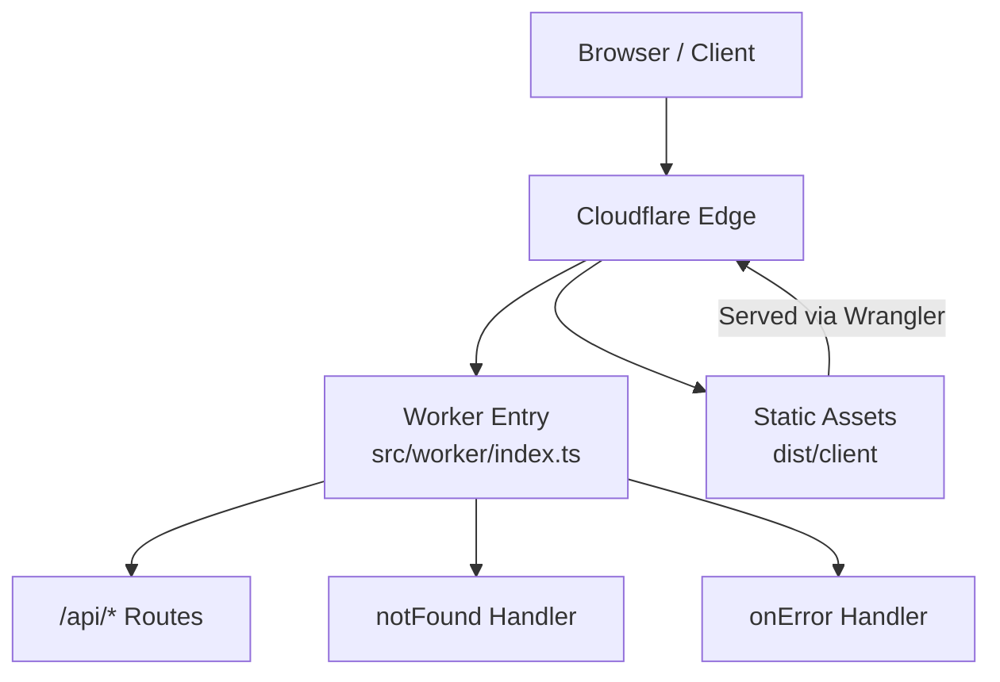
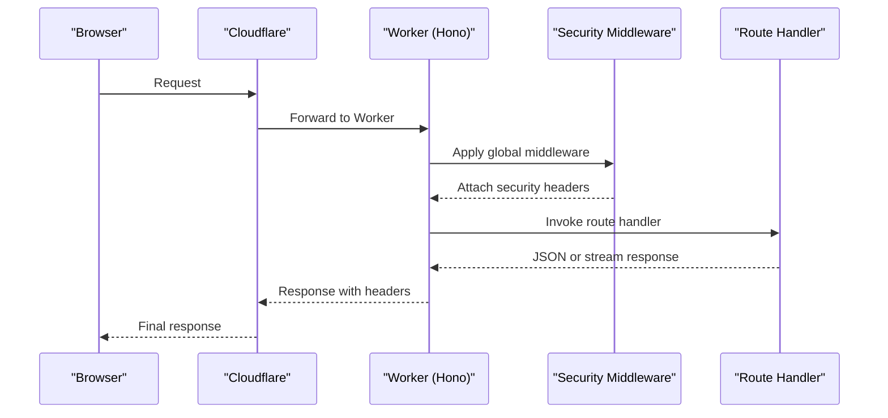
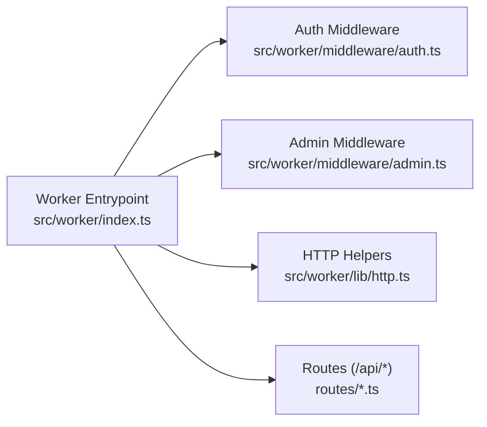

# Security Headers & CORS

<cite>
**Referenced Files in This Document**
- [src/worker/index.ts](file://src/worker/index.ts)
- [wrangler.json](file://wrangler.json)
- [plans/003-apply-browser-security-headers.md](file://plans/003-apply-browser-security-headers.md)
- [src/worker/lib/http.ts](file://src/worker/lib/http.ts)
- [src/worker/middleware/auth.ts](file://src/worker/middleware/auth.ts)
</cite>

## Table of Contents
1. [Introduction](#introduction)
2. [Project Structure](#project-structure)
3. [Core Components](#core-components)
4. [Architecture Overview](#architecture-overview)
5. [Detailed Component Analysis](#detailed-component-analysis)
6. [Dependency Analysis](#dependency-analysis)
7. [Performance Considerations](#performance-considerations)
8. [Troubleshooting Guide](#troubleshooting-guide)
9. [Conclusion](#conclusion)
10. [Appendices](#appendices)

## Introduction
This document explains how security headers and Cross-Origin Resource Sharing (CORS) are configured for the Cloudflare Workers application. It focuses on:
- How to set baseline browser security headers such as Content-Security-Policy, X-Frame-Options, Strict-Transport-Security, X-Content-Type-Options, Referrer-Policy, and Permissions-Policy.
- How to configure CORS for cross-origin requests, including allowed origins, methods, headers, and credentials handling.
- Secure defaults and environment-specific customization strategies.
- Common vulnerabilities mitigated by these configurations and how middleware helps enforce them.

The current codebase does not implement application-level security headers or CORS at the Worker level; a plan exists to add them. The guidance below shows where and how to implement them safely without breaking existing functionality.

## Project Structure
The Worker is built with Hono and mounted under /api/* routes. Static assets are served via Wrangler’s assets configuration. There is currently no global middleware that sets response headers for API responses, and no public/_headers file for static documents.

**Diagram sources**
- [src/worker/index.ts:24-60](file://src/worker/index.ts#L24-L60)
- [wrangler.json:26-33](file://wrangler.json#L26-L33)

**Section sources**
- [src/worker/index.ts:24-60](file://src/worker/index.ts#L24-L60)
- [wrangler.json:26-33](file://wrangler.json#L26-L33)

## Core Components
- Worker entrypoint and routing: centralizes route mounting and error/not-found handlers.
- HTTP helpers: standardized error responses used across routes.
- Auth middleware: validates sessions and enforces role-based access.
- Plan for security headers: outlines steps to add CSP, frame protections, referrer policy, permissions policy, and API-safe headers.

Key responsibilities:
- Centralize header injection at the earliest possible point in the request lifecycle.
- Keep API headers separate from static headers.
- Preserve multi-value Set-Cookie and other critical headers.

**Section sources**
- [src/worker/index.ts:24-60](file://src/worker/index.ts#L24-L60)
- [src/worker/lib/http.ts:23-75](file://src/worker/lib/http.ts#L23-L75)
- [src/worker/middleware/auth.ts:23-50](file://src/worker/middleware/auth.ts#L23-L50)
- [plans/003-apply-browser-security-headers.md:93-106](file://plans/003-apply-browser-security-headers.md#L93-L106)

## Architecture Overview
The recommended architecture adds two layers of protection:
- Static layer: use a _headers file for SPA and asset responses.
- API layer: add Hono middleware before route mounting to attach API-safe headers to all Worker-generated responses.

**Diagram sources**
- [src/worker/index.ts:24-45](file://src/worker/index.ts#L24-L45)
- [plans/003-apply-browser-security-headers.md:93-106](file://plans/003-apply-browser-security-headers.md#L93-L106)

## Detailed Component Analysis

### Static Security Headers (SPA and Assets)
- Use a _headers file placed in the static output directory so Vite copies it into dist/client.
- Apply baseline headers to all static resources:
  - X-Content-Type-Options: nosniff
  - Referrer-Policy: strict-origin-when-cross-origin
  - X-Frame-Options: DENY
  - Permissions-Policy: disable unused features (camera, microphone, geolocation, payment)
  - Content-Security-Policy: default-src 'self' with explicit allowlists for required external origins; consider report-only only when necessary after inventorying external dependencies.

Implementation notes:
- Ensure the build process copies _headers into dist/client.
- Validate headers locally using curl against preview builds.

**Section sources**
- [plans/003-apply-browser-security-headers.md:76-91](file://plans/003-apply-browser-security-headers.md#L76-L91)

### API Security Headers (Worker Middleware)
- Add top-level middleware in the Worker entrypoint before route mounting.
- For every response (success and error), append API-safe headers:
  - X-Content-Type-Options: nosniff
  - Referrer-Policy: strict-origin-when-cross-origin
  - Frame protections appropriate for APIs (e.g., avoid HTML CSP on non-HTML responses)
  - Cache-Control and other content-specific headers must be preserved.
- Do not collapse multiple Set-Cookie values; ensure they are appended correctly.

Verification:
- Assert headers on unauthenticated endpoints, validation failures, and successful authenticated responses.
- Confirm behavior remains unchanged under tests.

**Section sources**
- [plans/003-apply-browser-security-headers.md:93-106](file://plans/003-apply-browser-security-headers.md#L93-L106)
- [src/worker/index.ts:24-45](file://src/worker/index.ts#L24-L45)

### CORS Policy Configuration
Recommended approach:
- Configure CORS per route group or globally in Hono middleware if needed.
- Allowed origins: restrict to known production domains; avoid wildcards in production.
- Allowed methods: limit to GET, POST, PUT, DELETE as required by each endpoint.
- Allowed headers: specify exact headers clients will send (e.g., Content-Type, Authorization).
- Credentials: enable only when necessary and pair with specific origins; never combine credentials with wildcard origins.
- Preflight: ensure OPTIONS responses include Access-Control-Allow-* headers.

Environment-specific customization:
- Development: allow localhost origins for convenience.
- Production: lock down to exact domain(s).
- Secrets and variables: store sensitive origin lists or flags in wrangler vars/secrets.

Common pitfalls:
- Wildcard origins with credentials enabled.
- Overly permissive methods or headers.
- Missing preflight handling for non-simple requests.

[No sources needed since this section provides general guidance]

### Strict-Transport-Security (HSTS)
- Enforce HTTPS via Strict-Transport-Security on all responses.
- Include max-age, includeSubDomains, and optionally preload when appropriate.
- Ensure the site is fully HTTPS before enabling preload.

[No sources needed since this section provides general guidance]

### Content-Security-Policy (CSP) Strategy
- Start with a restrictive policy: default-src 'self'.
- Explicitly allowlist required external origins for scripts, styles, fonts, images, media, frames, workers, and connect endpoints.
- Use Content-Security-Policy-Report-Only temporarily only if an external dependency cannot be avoided; track exceptions and remove them when feasible.
- Avoid unsafe-inline and broad wildcards.

Inventorying external dependencies:
- Search source and built output for external URLs.
- Classify origins as required or removable.
- Test changes locally to avoid breaking sign-in, media, or checkout flows.

**Section sources**
- [plans/003-apply-browser-security-headers.md:61-75](file://plans/003-apply-browser-security-headers.md#L61-L75)
- [plans/003-apply-browser-security-headers.md:76-91](file://plans/003-apply-browser-security-headers.md#L76-L91)

### Error Handling and Headers
- Standardized error responses should still receive security headers.
- Ensure headers are attached even for 4xx and 5xx responses.
- Preserve error codes and messages while adding headers.

**Section sources**
- [src/worker/lib/http.ts:23-75](file://src/worker/lib/http.ts#L23-L75)

### Authentication and Authorization Context
- Auth middleware validates sessions and enriches context with user data.
- Role-based middleware enforces access control for admin and owner roles.
- These do not directly set security headers but rely on consistent error responses and secure session handling.

**Section sources**
- [src/worker/middleware/auth.ts:23-50](file://src/worker/middleware/auth.ts#L23-L50)
- [src/worker/middleware/admin.ts:5-13](file://src/worker/middleware/admin.ts#L5-L13)

## Dependency Analysis
The Worker entrypoint mounts many route modules. Security middleware should be applied before any route logic to ensure consistent header behavior.

**Diagram sources**
- [src/worker/index.ts:24-45](file://src/worker/index.ts#L24-L45)
- [src/worker/middleware/auth.ts:23-50](file://src/worker/middleware/auth.ts#L23-L50)
- [src/worker/middleware/admin.ts:5-13](file://src/worker/middleware/admin.ts#L5-L13)
- [src/worker/lib/http.ts:23-75](file://src/worker/lib/http.ts#L23-L75)

**Section sources**
- [src/worker/index.ts:24-45](file://src/worker/index.ts#L24-L45)

## Performance Considerations
- Header middleware should be lightweight and run once per request.
- Avoid heavy computations inside the middleware; keep policies simple and deterministic.
- Preserve existing caching headers and streaming behaviors.
- Minimize overhead by applying headers early and consistently.

[No sources needed since this section provides general guidance]

## Troubleshooting Guide
Common issues and resolutions:
- CSP blocking resources:
  - Review external origins and update allowlists.
  - Temporarily switch to report-only to identify violations, then tighten policy.
- CORS preflight failures:
  - Verify allowed origins, methods, and headers.
  - Ensure credentials are handled correctly and not combined with wildcard origins.
- HSTS misconfiguration:
  - Ensure full HTTPS coverage before enabling preload.
- Set-Cookie collapsing:
  - Ensure middleware appends multiple Set-Cookie values instead of overwriting.

Validation steps:
- Build and preview locally; inspect headers with curl or browser dev tools.
- Run tests to confirm behavior remains unchanged.

**Section sources**
- [plans/003-apply-browser-security-headers.md:107-137](file://plans/003-apply-browser-security-headers.md#L107-L137)

## Conclusion
To harden the application:
- Implement static headers via a _headers file for SPA and assets.
- Add Hono middleware in the Worker entrypoint to attach API-safe headers to all responses.
- Configure CORS strictly per environment, avoiding wildcards with credentials.
- Enforce HSTS and a restrictive CSP with explicit allowlists.
- Maintain tests and validation to prevent regressions.

These measures mitigate common web vulnerabilities such as XSS, clickjacking, MIME sniffing, and insecure cross-origin interactions.

[No sources needed since this section summarizes without analyzing specific files]

## Appendices

### Recommended Default Headers
- Static:
  - X-Content-Type-Options: nosniff
  - Referrer-Policy: strict-origin-when-cross-origin
  - X-Frame-Options: DENY
  - Permissions-Policy: camera=(), microphone=(), geolocation=(), payment=()
  - Content-Security-Policy: default-src 'self'; explicit allowlists as needed
- API:
  - X-Content-Type-Options: nosniff
  - Referrer-Policy: strict-origin-when-cross-origin
  - Appropriate cache-control per endpoint
  - Preserve Set-Cookie, ranges, and content-disposition

[No sources needed since this section provides general guidance]

### Environment Customization Tips
- Development: allow localhost origins for CORS; use relaxed CSP report-only if needed.
- Production: lock down origins, methods, and headers; enforce strict CSP and HSTS.
- Store sensitive settings in wrangler secrets or vars.

[No sources needed since this section provides general guidance]