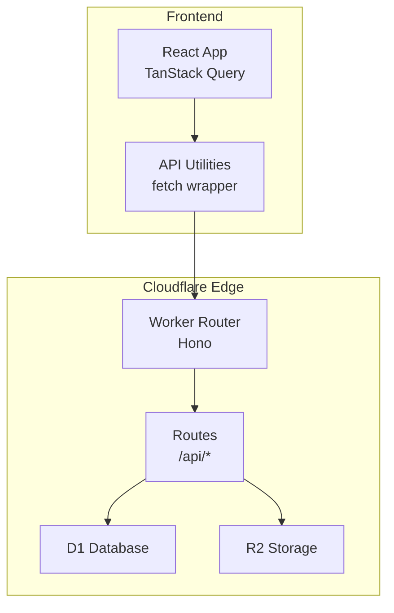
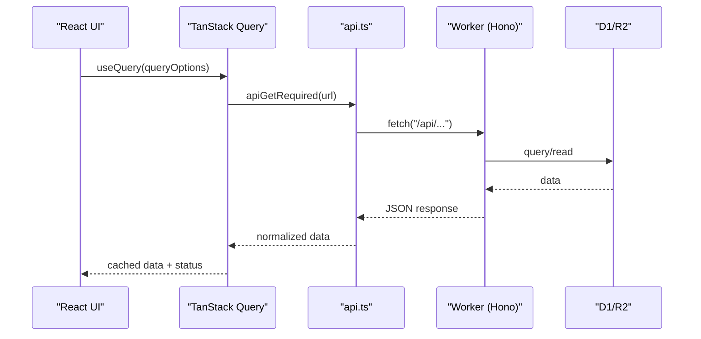
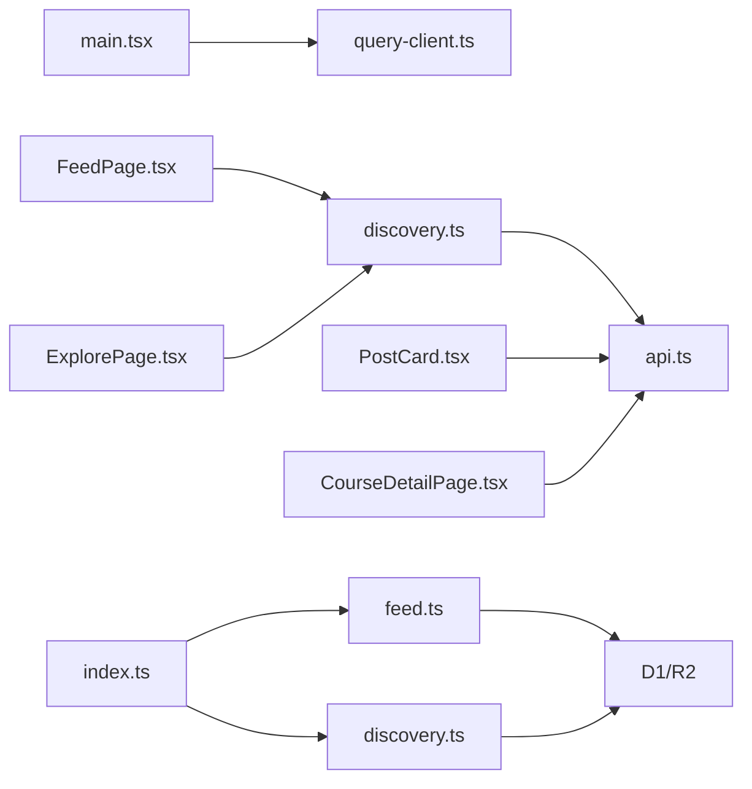

# Caching Strategies

<cite>
**Referenced Files in This Document**
- [query-client.ts](file://src/react-app/lib/query-client.ts)
- [main.tsx](file://src/react-app/main.tsx)
- [api.ts](file://src/react-app/lib/api.ts)
- [discovery.ts](file://src/react-app/lib/discovery.ts)
- [FeedPage.tsx](file://src/react-app/pages/FeedPage.tsx)
- [ExplorePage.tsx](file://src/react-app/pages/ExplorePage.tsx)
- [PostCard.tsx](file://src/react-app/components/PostCard.tsx)
- [CourseDetailPage.tsx](file://src/react-app/pages/CourseDetailPage.tsx)
- [feed.ts](file://src/worker/routes/feed.ts)
- [discovery.ts](file://src/worker/routes/discovery.ts)
- [index.ts](file://src/worker/index.ts)
- [wrangler.json](file://wrangler.json)
</cite>

## Table of Contents
1. [Introduction](#introduction)
2. [Project Structure](#project-structure)
3. [Core Components](#core-components)
4. [Architecture Overview](#architecture-overview)
5. [Detailed Component Analysis](#detailed-component-analysis)
6. [Dependency Analysis](#dependency-analysis)
7. [Performance Considerations](#performance-considerations)
8. [Troubleshooting Guide](#troubleshooting-guide)
9. [Conclusion](#conclusion)

## Introduction
This document explains the caching strategies used across the Zenith application, focusing on TanStack Query configuration and patterns on the frontend, data-fetching utilities, and backend edge caching via Cloudflare Workers. It covers cache policies, stale times, refetch strategies, optimistic updates, cache invalidation, and performance considerations for large datasets.

## Project Structure
Zenith is a full-stack application with:
- Frontend React app using TanStack Query for client-side caching and state synchronization.
- Backend Hono-based Cloudflare Worker exposing REST endpoints under /api/*, served alongside static assets.

**Diagram sources**
- [main.tsx:1-38](file://src/react-app/main.tsx#L1-L38)
- [api.ts:1-164](file://src/react-app/lib/api.ts#L1-L164)
- [index.ts:1-71](file://src/worker/index.ts#L1-L71)
- [feed.ts:1-395](file://src/worker/routes/feed.ts#L1-L395)
- [discovery.ts:1-120](file://src/worker/routes/discovery.ts#L1-L120)

**Section sources**
- [main.tsx:1-38](file://src/react-app/main.tsx#L1-L38)
- [index.ts:1-71](file://src/worker/index.ts#L1-L71)

## Core Components
- TanStack Query Client: Global configuration for retries and refetch behavior.
- API Utilities: Centralized fetch wrapper handling JSON normalization and error mapping.
- Data Hooks: Typed query options and mutations for discovery and feed features.
- Pages and Components: Use queries/mutations to render data and trigger cache updates.

Key responsibilities:
- Configure default query behaviors globally.
- Provide typed helpers for GET/POST/PUT/PATCH/DELETE.
- Define stable query keys and staleTime per feature.
- Invalidate or update caches after mutations.

**Section sources**
- [query-client.ts:1-14](file://src/react-app/lib/query-client.ts#L1-L14)
- [api.ts:1-164](file://src/react-app/lib/api.ts#L1-L164)
- [discovery.ts:1-99](file://src/react-app/lib/discovery.ts#L1-L99)

## Architecture Overview
The frontend uses TanStack Query to cache responses from the backend APIs. The backend runs on Cloudflare Workers, which can leverage Cloudflare’s edge caching (e.g., Cache-Control headers) to reduce latency and origin load.

**Diagram sources**
- [discovery.ts:65-90](file://src/react-app/lib/discovery.ts#L65-L90)
- [api.ts:123-138](file://src/react-app/lib/api.ts#L123-L138)
- [index.ts:24-45](file://src/worker/index.ts#L24-L45)
- [feed.ts:13-41](file://src/worker/routes/feed.ts#L13-L41)

## Detailed Component Analysis

### TanStack Query Configuration
- Global defaults disable automatic retry and window-focus refetch to keep behavior predictable and avoid unnecessary network calls.
- The client is provided at the app root so all components share the same cache instance.

Recommendations:
- Keep retry disabled for idempotent reads; enable selective retry for specific queries if needed.
- Consider enabling background refetch only where appropriate (e.g., real-time dashboards).

**Section sources**
- [query-client.ts:1-14](file://src/react-app/lib/query-client.ts#L1-L14)
- [main.tsx:1-38](file://src/react-app/main.tsx#L1-L38)

### API Utilities and Error Handling
- Centralized fetch wrapper normalizes JSON responses and errors, dispatches global events for auth-related states, and provides convenience methods for HTTP verbs.
- Errors are wrapped with consistent codes and messages for uniform handling.

Best practices:
- Use the required variants when you expect a successful response.
- Handle ApiError instances consistently in UI layers.

**Section sources**
- [api.ts:1-164](file://src/react-app/lib/api.ts#L1-L164)

### Discovery Feature Caching
- Query keys are structured for precise invalidation and deduplication.
- Stale time is set to 60 seconds for overview and preferences to balance freshness and performance.
- Search results are keyed by input parameters to avoid cross-contamination between different searches.

Optimistic updates:
- After updating interests, invalidate the entire discovery cache to reflect changes immediately.

**Section sources**
- [discovery.ts:58-99](file://src/react-app/lib/discovery.ts#L58-L99)
- [ExplorePage.tsx:199-222](file://src/react-app/pages/ExplorePage.tsx#L199-L222)

### Feed Feature Caching
- Feed page consumes a single query that returns mixed content types.
- Mutations like liking or saving posts invalidate relevant query keys (feed, creator profile, detail views) to keep UI consistent.

Cache strategy:
- No explicit staleTime is set in the feed query options; rely on global defaults.
- Use targeted invalidations after mutations to minimize re-fetch scope.

**Section sources**
- [FeedPage.tsx:1-60](file://src/react-app/pages/FeedPage.tsx#L1-L60)
- [PostCard.tsx:28-53](file://src/react-app/components/PostCard.tsx#L28-L53)

### Course Detail Caching
- Like and progress mutations invalidate course detail and related lists to ensure consistency.

**Section sources**
- [CourseDetailPage.tsx:28-51](file://src/react-app/pages/CourseDetailPage.tsx#L28-L51)

### Backend Edge Caching (Cloudflare)
- The Worker serves both API routes and static assets.
- To enable edge caching for read-heavy endpoints, return appropriate Cache-Control headers (e.g., public, max-age) in responses.
- For authenticated or personalized data (like feed), avoid aggressive caching; use short max-age or no-store as needed.

Implementation guidance:
- Add Cache-Control headers in route handlers for immutable or long-lived resources.
- Use Vary headers when responses depend on cookies or authorization.
- Leverage Cloudflare’s CDN for static assets automatically.

**Section sources**
- [index.ts:24-45](file://src/worker/index.ts#L24-L45)
- [wrangler.json:1-139](file://wrangler.json#L1-L139)

### Optimistic Updates Patterns
- Update local state immediately upon user action.
- On success, leave the optimistic state as-is or refine it.
- On failure, roll back to previous state and show an error.

Examples in codebase:
- Tests demonstrate rollback behavior when mutations fail.
- Mutation onSuccess hooks trigger targeted invalidations to refresh data.

**Section sources**
- [PostCard.tsx:28-53](file://src/react-app/components/PostCard.tsx#L28-L53)
- [CourseDetailPage.tsx:28-51](file://src/react-app/pages/CourseDetailPage.tsx#L28-L51)
- [SaveButton.test.tsx:32-44](file://src/react-app/components/SaveButton.test.tsx#L32-L44)

### Cache Invalidation Strategies
- Use granular query keys to invalidate only affected areas (e.g., feed, creator profile, detail view).
- After write operations, prefer targeted invalidations over full cache resets.
- For search and discovery, invalidate based on changed inputs or preferences.

**Section sources**
- [PostCard.tsx:28-53](file://src/react-app/components/PostCard.tsx#L28-L53)
- [ExplorePage.tsx:199-222](file://src/react-app/pages/ExplorePage.tsx#L199-L222)

## Dependency Analysis

**Diagram sources**
- [main.tsx:1-38](file://src/react-app/main.tsx#L1-L38)
- [query-client.ts:1-14](file://src/react-app/lib/query-client.ts#L1-L14)
- [discovery.ts:1-99](file://src/react-app/lib/discovery.ts#L1-L99)
- [api.ts:1-164](file://src/react-app/lib/api.ts#L1-L164)
- [FeedPage.tsx:1-60](file://src/react-app/pages/FeedPage.tsx#L1-L60)
- [ExplorePage.tsx:1-223](file://src/react-app/pages/ExplorePage.tsx#L1-L223)
- [PostCard.tsx:28-53](file://src/react-app/components/PostCard.tsx#L28-L53)
- [CourseDetailPage.tsx:28-51](file://src/react-app/pages/CourseDetailPage.tsx#L28-L51)
- [index.ts:1-71](file://src/worker/index.ts#L1-L71)
- [feed.ts:1-395](file://src/worker/routes/feed.ts#L1-L395)
- [discovery.ts:1-120](file://src/worker/routes/discovery.ts#L1-L120)

**Section sources**
- [index.ts:1-71](file://src/worker/index.ts#L1-L71)
- [feed.ts:1-395](file://src/worker/routes/feed.ts#L1-L395)
- [discovery.ts:1-120](file://src/worker/routes/discovery.ts#L1-L120)

## Performance Considerations
- Memory management for large datasets:
  - Limit result sizes server-side (e.g., pagination, limits).
  - Avoid storing redundant copies; rely on TanStack Query’s deduplication.
  - Use virtualization for very long lists to reduce DOM size.
- Network efficiency:
  - Set appropriate staleTime for each query type (e.g., longer for discovery overview, shorter for live feeds).
  - Prefer targeted invalidations to minimize re-fetches.
  - Enable background refetch selectively for frequently updated data.
- Edge caching:
  - Apply Cache-Control headers for immutable or semi-static endpoints.
  - Use short max-age or no-store for personalized/authenticated endpoints.
  - Leverage Cloudflare’s CDN for static assets and images.

[No sources needed since this section provides general guidance]

## Troubleshooting Guide
Common issues and resolutions:
- Unexpected refetches:
  - Check global refetchOnWindowFocus and component-level refetch intervals.
- Stale data not updating:
  - Ensure mutation triggers correct invalidation keys.
- Authentication errors:
  - The API wrapper dispatches unauthorized events; handle them to redirect or clear sessions.
- Large payloads causing memory pressure:
  - Implement pagination and limit fields returned by the backend.

**Section sources**
- [api.ts:61-92](file://src/react-app/lib/api.ts#L61-L92)
- [PostCard.tsx:28-53](file://src/react-app/components/PostCard.tsx#L28-L53)
- [ExplorePage.tsx:199-222](file://src/react-app/pages/ExplorePage.tsx#L199-L222)

## Conclusion
Zenith employs a layered caching strategy:
- TanStack Query manages client-side cache with predictable defaults and targeted invalidations.
- API utilities standardize requests and error handling.
- Backend endpoints can be optimized with Cloudflare edge caching for improved latency and reduced origin load.
Adopting these patterns ensures responsive UX, efficient network usage, and scalable performance for large datasets.

[No sources needed since this section summarizes without analyzing specific files]