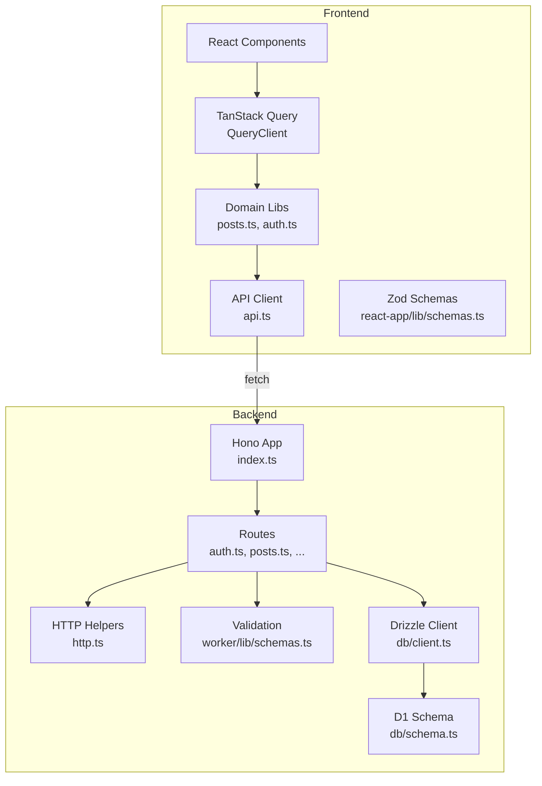
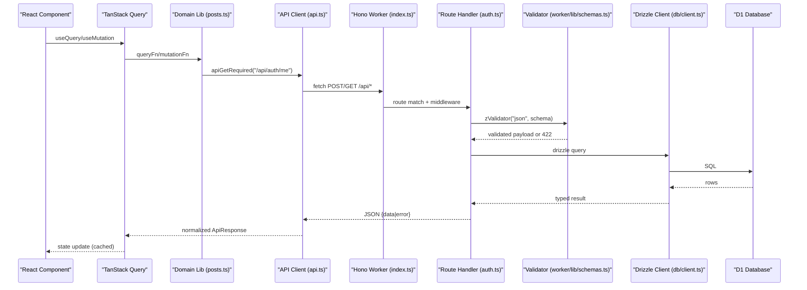
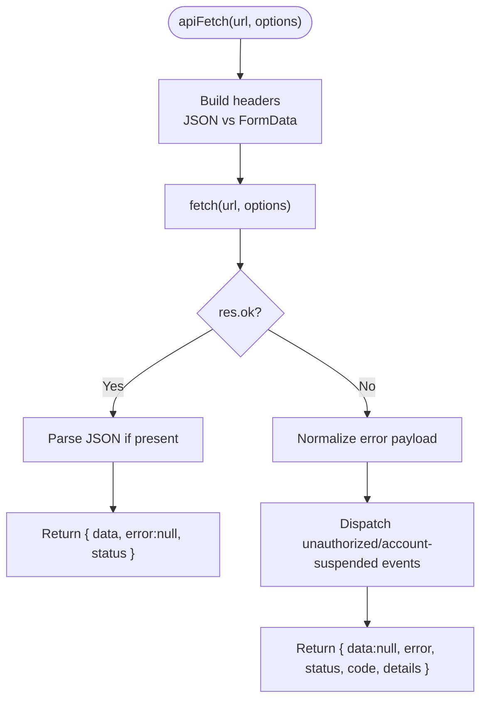
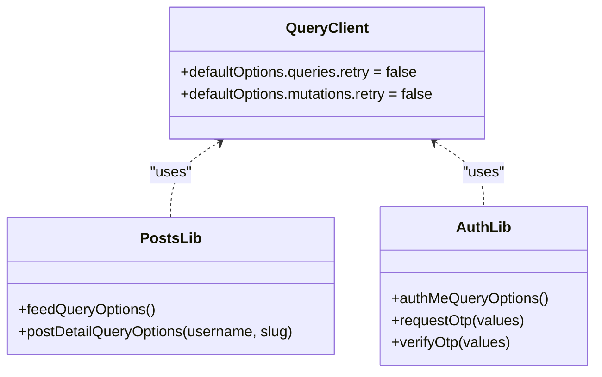
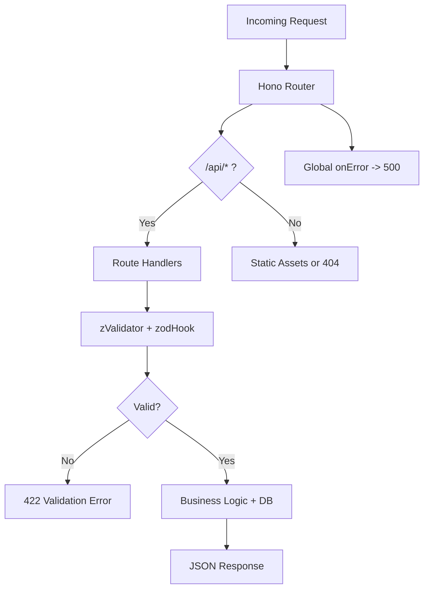
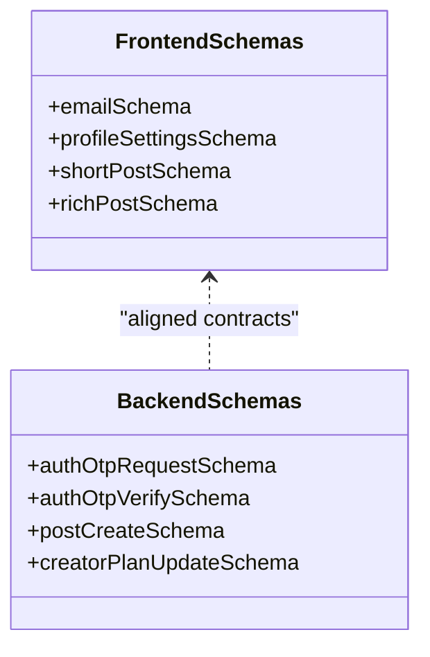
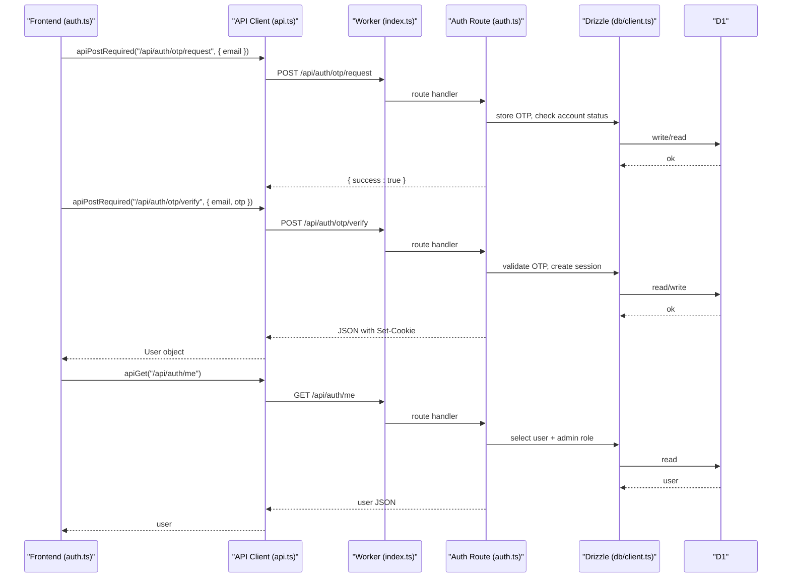
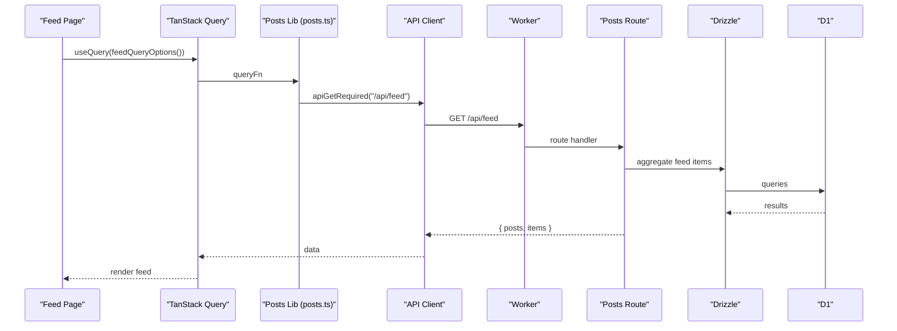
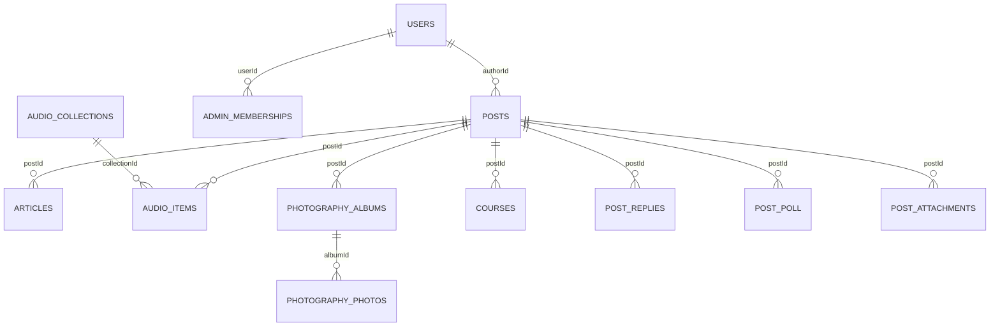
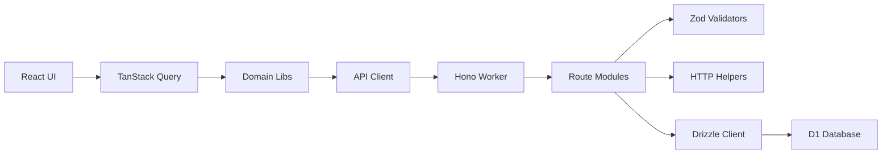

# Data Flow Patterns

<cite>
**Referenced Files in This Document**
- [api.ts](file://src/react-app/lib/api.ts)
- [query-client.ts](file://src/react-app/lib/query-client.ts)
- [posts.ts](file://src/react-app/lib/posts.ts)
- [auth.ts](file://src/react-app/lib/auth.ts)
- [index.ts](file://src/worker/index.ts)
- [http.ts](file://src/worker/lib/http.ts)
- [client.ts](file://src/worker/db/client.ts)
- [schema.ts](file://src/worker/db/schema.ts)
- [auth.ts](file://src/worker/routes/auth.ts)
- [schemas.ts](file://src/react-app/lib/schemas.ts)
- [schemas.ts](file://src/worker/lib/schemas.ts)
</cite>

## Table of Contents
1. [Introduction](#introduction)
2. [Project Structure](#project-structure)
3. [Core Components](#core-components)
4. [Architecture Overview](#architecture-overview)
5. [Detailed Component Analysis](#detailed-component-analysis)
6. [Dependency Analysis](#dependency-analysis)
7. [Performance Considerations](#performance-considerations)
8. [Troubleshooting Guide](#troubleshooting-guide)
9. [Conclusion](#conclusion)

## Introduction
This document explains the end-to-end data flow patterns in the Zenith system, from React components through TanStack Query to Cloudflare Workers and D1. It covers API client abstractions, DTOs, schema validation, caching strategies, real-time updates via polling, error propagation and retry strategies, and consistency patterns including optimistic updates.

## Project Structure
The application is split into a React frontend and a Hono-based Cloudflare Worker backend:
- Frontend (React + TanStack Query):
  - API client utilities and typed responses
  - Query options and mutations per domain
  - Zod schemas for form/input validation
- Backend (Cloudflare Worker + Hono):
  - Route registration and global error handling
  - Validation with Zod and standardized error responses
  - Drizzle ORM client over D1 database
  - Typed DB schema definitions

**Diagram sources**
- [index.ts:24-45](file://src/worker/index.ts#L24-L45)
- [auth.ts:135-212](file://src/worker/routes/auth.ts#L135-L212)
- [http.ts:23-33](file://src/worker/lib/http.ts#L23-L33)
- [client.ts:4-6](file://src/worker/db/client.ts#L4-L6)
- [schema.ts:1-32](file://src/worker/db/schema.ts#L1-L32)
- [api.ts:43-92](file://src/react-app/lib/api.ts#L43-L92)
- [posts.ts:96-108](file://src/react-app/lib/posts.ts#L96-L108)
- [auth.ts:20-34](file://src/react-app/lib/auth.ts#L20-L34)
- [schemas.ts:1-43](file://src/react-app/lib/schemas.ts#L1-L43)
- [schemas.ts:13-23](file://src/worker/lib/schemas.ts#L13-L23)

**Section sources**
- [index.ts:24-45](file://src/worker/index.ts#L24-L45)
- [api.ts:43-92](file://src/react-app/lib/api.ts#L43-L92)
- [posts.ts:96-108](file://src/react-app/lib/posts.ts#L96-L108)
- [auth.ts:20-34](file://src/react-app/lib/auth.ts#L20-L34)

## Core Components
- API Client Abstraction:
  - Normalized response envelope and typed helpers for GET/POST/PUT/PATCH/DELETE
  - Centralized error normalization and custom event dispatch on 401/account-suspended
- TanStack Query Configuration:
  - Global defaults disable automatic retries and refetch-on-focus
  - Per-query overrides available via queryOptions
- Domain Libraries:
  - Define query keys and functions that call the API client
  - Provide types for DTOs used by UI components
- Worker Routing and Error Handling:
  - Hono app mounts route modules under /api/*
  - Global notFound and onError handlers
- Validation and DTOs:
  - Zod schemas at both frontend and backend enforce input contracts
  - Consistent error shape across the stack

**Section sources**
- [api.ts:1-41](file://src/react-app/lib/api.ts#L1-L41)
- [query-client.ts:3-13](file://src/react-app/lib/query-client.ts#L3-L13)
- [posts.ts:88-108](file://src/react-app/lib/posts.ts#L88-L108)
- [index.ts:24-45](file://src/worker/index.ts#L24-L45)
- [http.ts:23-33](file://src/worker/lib/http.ts#L23-L33)
- [schemas.ts:1-43](file://src/react-app/lib/schemas.ts#L1-L43)
- [schemas.ts:13-23](file://src/worker/lib/schemas.ts#L13-L23)

## Architecture Overview
End-to-end request-response cycle:
- React component triggers a TanStack Query operation
- Domain lib calls apiGetRequired or similar
- Fetch wraps the request, normalizes errors, and returns typed data
- Hono routes validate inputs, interact with D1 via Drizzle, and return JSON
- Errors are standardized and propagated back to the client

**Diagram sources**
- [posts.ts:96-108](file://src/react-app/lib/posts.ts#L96-L108)
- [api.ts:43-92](file://src/react-app/lib/api.ts#L43-L92)
- [index.ts:24-45](file://src/worker/index.ts#L24-L45)
- [auth.ts:135-212](file://src/worker/routes/auth.ts#L135-L212)
- [schemas.ts:13-23](file://src/worker/lib/schemas.ts#L13-L23)
- [client.ts:4-6](file://src/worker/db/client.ts#L4-L6)

## Detailed Component Analysis

### API Client and Error Propagation
- Response envelope:
  - ApiResponse<T> carries data, error, status, code, details
  - ApiError class encapsulates structured error info
- Fetch wrapper:
  - Sets credentials and content-type appropriately
  - Dispatches custom events for 401 and account-suspended
  - Normalizes error payloads into consistent shape
- Required helpers:
  - Throw ApiError on non-ok responses for concise try/catch usage

**Diagram sources**
- [api.ts:43-92](file://src/react-app/lib/api.ts#L43-L92)
- [api.ts:123-134](file://src/react-app/lib/api.ts#L123-L134)

**Section sources**
- [api.ts:1-41](file://src/react-app/lib/api.ts#L1-L41)
- [api.ts:43-92](file://src/react-app/lib/api.ts#L43-L92)
- [api.ts:123-134](file://src/react-app/lib/api.ts#L123-L134)

### TanStack Query Integration and Caching
- Global defaults:
  - No automatic retries
  - No refetch on window focus
- Per-query configuration:
  - Stale times and retry flags can be overridden
- Key management:
  - Domain libs define stable queryKeys for cache invalidation

**Diagram sources**
- [query-client.ts:3-13](file://src/react-app/lib/query-client.ts#L3-L13)
- [posts.ts:96-108](file://src/react-app/lib/posts.ts#L96-L108)
- [auth.ts:29-34](file://src/react-app/lib/auth.ts#L29-L34)

**Section sources**
- [query-client.ts:3-13](file://src/react-app/lib/query-client.ts#L3-L13)
- [posts.ts:88-108](file://src/react-app/lib/posts.ts#L88-L108)
- [auth.ts:29-34](file://src/react-app/lib/auth.ts#L29-L34)

### Worker Routing and Error Handling
- Hono app mounts all /api/* route modules
- Global notFound distinguishes API vs assets
- Global onError returns a standardized server error

**Diagram sources**
- [index.ts:24-45](file://src/worker/index.ts#L24-L45)
- [index.ts:47-60](file://src/worker/index.ts#L47-L60)
- [http.ts:23-33](file://src/worker/lib/http.ts#L23-L33)

**Section sources**
- [index.ts:24-45](file://src/worker/index.ts#L24-L45)
- [index.ts:47-60](file://src/worker/index.ts#L47-L60)
- [http.ts:23-33](file://src/worker/lib/http.ts#L23-L33)

### Validation and DTO Patterns
- Frontend Zod schemas:
  - Enforce user input constraints for forms and payloads
- Backend Zod schemas:
  - Validate incoming JSON and params
  - Use discriminated unions for mode-specific fields
- Consistency:
  - Shared naming conventions and field semantics across layers

**Diagram sources**
- [schemas.ts:1-43](file://src/react-app/lib/schemas.ts#L1-L43)
- [schemas.ts:100-146](file://src/react-app/lib/schemas.ts#L100-L146)
- [schemas.ts:13-23](file://src/worker/lib/schemas.ts#L13-L23)
- [schemas.ts:79-93](file://src/worker/lib/schemas.ts#L79-L93)

**Section sources**
- [schemas.ts:1-43](file://src/react-app/lib/schemas.ts#L1-L43)
- [schemas.ts:100-146](file://src/react-app/lib/schemas.ts#L100-L146)
- [schemas.ts:13-23](file://src/worker/lib/schemas.ts#L13-L23)
- [schemas.ts:79-93](file://src/worker/lib/schemas.ts#L79-L93)

### Authentication Flow and Session Handling
- OTP sign-in:
  - Request OTP, verify OTP, set cookies, and return user profile
- Me endpoint:
  - Returns current user with admin role context
- Cookie propagation:
  - Custom helper ensures Set-Cookie headers are forwarded

**Diagram sources**
- [auth.ts:36-46](file://src/react-app/lib/auth.ts#L36-L46)
- [api.ts:98-117](file://src/react-app/lib/api.ts#L98-L117)
- [index.ts:24-45](file://src/worker/index.ts#L24-L45)
- [auth.ts:135-212](file://src/worker/routes/auth.ts#L135-L212)
- [client.ts:4-6](file://src/worker/db/client.ts#L4-L6)

**Section sources**
- [auth.ts:20-46](file://src/react-app/lib/auth.ts#L20-L46)
- [auth.ts:135-212](file://src/worker/routes/auth.ts#L135-L212)
- [api.ts:98-117](file://src/react-app/lib/api.ts#L98-L117)

### Posts and Feed Data Flow
- Query options define keys and fetchers for feed and post detail
- Mutations handle creating posts, replies, likes, polls, and drafts
- Types model rich content structures for UI rendering

**Diagram sources**
- [posts.ts:96-108](file://src/react-app/lib/posts.ts#L96-L108)
- [api.ts:94-96](file://src/react-app/lib/api.ts#L94-L96)
- [index.ts:24-45](file://src/worker/index.ts#L24-L45)

**Section sources**
- [posts.ts:88-108](file://src/react-app/lib/posts.ts#L88-L108)
- [api.ts:94-96](file://src/react-app/lib/api.ts#L94-L96)

### Database Schema and ORM Layer
- Drizzle client creation binds schema to D1
- Schema defines entities like users, posts, articles, audio, photography, courses, subscriptions, and more
- Indexes optimize common queries (e.g., author-created, moderation status)

**Diagram sources**
- [schema.ts:5-32](file://src/worker/db/schema.ts#L5-L32)
- [schema.ts:168-188](file://src/worker/db/schema.ts#L168-L188)
- [schema.ts:234-291](file://src/worker/db/schema.ts#L234-L291)
- [schema.ts:294-348](file://src/worker/db/schema.ts#L294-L348)
- [schema.ts:351-409](file://src/worker/db/schema.ts#L351-L409)
- [schema.ts:449-507](file://src/worker/db/schema.ts#L449-L507)
- [schema.ts:542-580](file://src/worker/db/schema.ts#L542-L580)

**Section sources**
- [client.ts:4-6](file://src/worker/db/client.ts#L4-L6)
- [schema.ts:5-32](file://src/worker/db/schema.ts#L5-L32)

## Dependency Analysis
- Frontend dependencies:
  - React components depend on TanStack Query hooks
  - Domain libs depend on the API client
  - API client depends on fetch and environment capabilities
- Backend dependencies:
  - Hono app depends on route modules
  - Route modules depend on validators, HTTP helpers, and DB client
  - DB client depends on D1 and schema

**Diagram sources**
- [index.ts:24-45](file://src/worker/index.ts#L24-L45)
- [api.ts:43-92](file://src/react-app/lib/api.ts#L43-L92)
- [posts.ts:96-108](file://src/react-app/lib/posts.ts#L96-L108)
- [http.ts:23-33](file://src/worker/lib/http.ts#L23-L33)
- [client.ts:4-6](file://src/worker/db/client.ts#L4-L6)

**Section sources**
- [index.ts:24-45](file://src/worker/index.ts#L24-L45)
- [api.ts:43-92](file://src/react-app/lib/api.ts#L43-L92)
- [posts.ts:96-108](file://src/react-app/lib/posts.ts#L96-L108)
- [http.ts:23-33](file://src/worker/lib/http.ts#L23-L33)
- [client.ts:4-6](file://src/worker/db/client.ts#L4-L6)

## Performance Considerations
- Frontend caching:
  - Disable global retries and refetch-on-focus to reduce noise
  - Use staleTime for frequently accessed endpoints (e.g., auth/me)
  - Leverage queryKeys for targeted invalidation after mutations
- Backend performance:
  - Use indexes defined in schema for frequent filters (e.g., author-created, moderation-status)
  - Keep payloads minimal; avoid large JSON bodies where possible
- Network efficiency:
  - Batch related reads when feasible at the route layer
  - Prefer PATCH for partial updates to minimize payload size

[No sources needed since this section provides general guidance]

## Troubleshooting Guide
- Common error codes:
  - 400 bad_request, 401 unauthorized, 403 forbidden, 404 not_found, 409 conflict, 413 payload_too_large, 415 unsupported_media_type, 422 validation_failed, 500 internal_server_error
- Frontend error handling:
  - ApiError includes status, code, and details for precise UX
  - Unauthorized events trigger re-auth flows
- Backend validation:
  - zodHook converts Zod failures into 422 responses with issues array
- Debugging tips:
  - Inspect normalized ApiResponse in network tab
  - Verify Zod schemas align between frontend and backend
  - Check D1 indexes and query plans for slow endpoints

**Section sources**
- [http.ts:4-33](file://src/worker/lib/http.ts#L4-L33)
- [api.ts:13-25](file://src/react-app/lib/api.ts#L13-L25)
- [api.ts:61-82](file://src/react-app/lib/api.ts#L61-L82)
- [http.ts:77-80](file://src/worker/lib/http.ts#L77-L80)

## Conclusion
Zenith’s data flow combines a robust API client, strict Zod validation, and TanStack Query caching to deliver a responsive and reliable user experience. The Hono worker centralizes routing and error handling, while Drizzle and D1 provide type-safe persistence. By standardizing error shapes and leveraging query keys, the system achieves consistent behavior across the stack and supports optimistic updates and polling patterns for near-real-time interactions.

[No sources needed since this section summarizes without analyzing specific files]