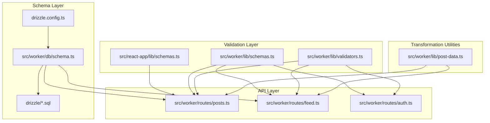
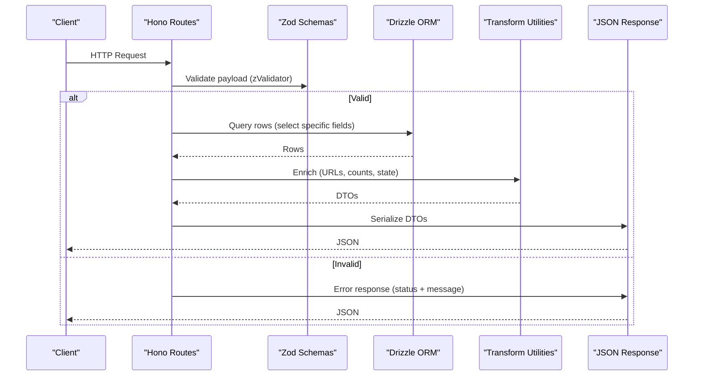
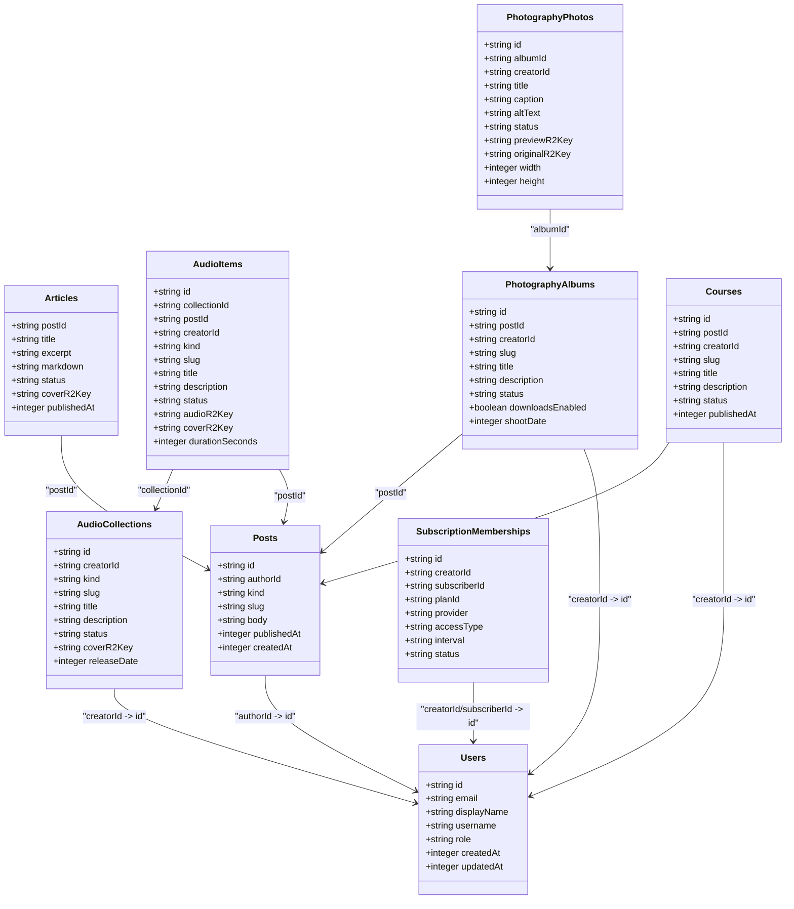
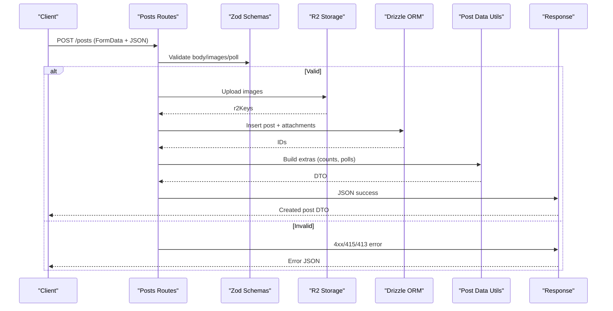
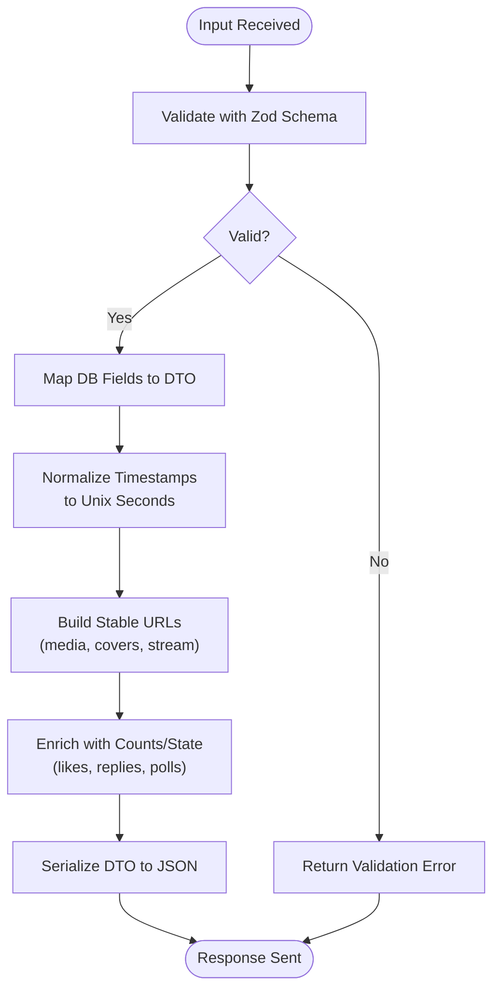
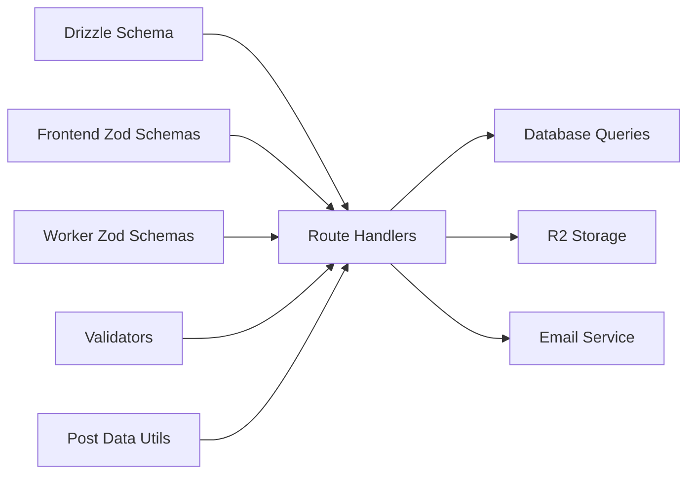

# Data Transformation Patterns

<cite>
**Referenced Files in This Document**
- [drizzle.config.ts](file://drizzle.config.ts)
- [schema.ts](file://src/worker/db/schema.ts)
- [0000_overrated_nitro.sql](file://drizzle/0000_overrated_nitro.sql)
- [schemas.ts (frontend)](file://src/react-app/lib/schemas.ts)
- [schemas.ts (worker)](file://src/worker/lib/schemas.ts)
- [validators.ts](file://src/worker/lib/validators.ts)
- [posts.ts](file://src/worker/routes/posts.ts)
- [feed.ts](file://src/worker/routes/feed.ts)
- [post-data.ts](file://src/worker/lib/post-data.ts)
- [auth.ts](file://src/worker/routes/auth.ts)
</cite>

## Table of Contents
1. Introduction
2. Project Structure
3. Core Components
4. Architecture Overview
5. Detailed Component Analysis
6. Dependency Analysis
7. Performance Considerations
8. Troubleshooting Guide
9. Conclusion

## Introduction
This document explains how Zenith transforms database schemas defined with Drizzle ORM into TypeScript types and validates data at runtime using Zod. It covers DTO patterns for API requests and responses, field mapping between database models and API contracts, data sanitization strategies, and versioning approaches for schema evolution and backward compatibility. The goal is to provide a clear, code-backed guide that helps developers understand the end-to-end transformation pipeline from persistence to API boundaries.

## Project Structure
Zenith organizes data definitions and transformations across several layers:
- Database schema definitions are centralized in a single Drizzle schema file.
- Migration SQL files live under a dedicated directory and are generated or managed via Drizzle Kit configuration.
- Runtime validation schemas are defined separately for the frontend and worker, each tailored to their context (form inputs vs. API payloads).
- Route handlers use Zod validators to validate incoming requests and transform rows into typed DTOs for responses.
- Utility modules encapsulate common transformations like URL generation, media handling, and enrichment of post-related data.

**Diagram sources**
- [drizzle.config.ts:1-14](file://drizzle.config.ts#L1-L14)
- [schema.ts:1-800](file://src/worker/db/schema.ts#L1-L800)
- [0000_overrated_nitro.sql:1-36](file://drizzle/0000_overrated_nitro.sql#L1-L36)
- [schemas.ts (frontend):1-363](file://src/react-app/lib/schemas.ts#L1-L363)
- [schemas.ts (worker):1-221](file://src/worker/lib/schemas.ts#L1-L221)
- [validators.ts:1-94](file://src/worker/lib/validators.ts#L1-L94)
- [posts.ts:1-200](file://src/worker/routes/posts.ts#L1-L200)
- [feed.ts:1-200](file://src/worker/routes/feed.ts#L1-L200)
- [post-data.ts:1-350](file://src/worker/lib/post-data.ts#L1-L350)
- [auth.ts:1-200](file://src/worker/routes/auth.ts#L1-L200)

**Section sources**
- [drizzle.config.ts:1-14](file://drizzle.config.ts#L1-L14)
- [schema.ts:1-800](file://src/worker/db/schema.ts#L1-L800)
- [0000_overrated_nitro.sql:1-36](file://drizzle/0000_overrated_nitro.sql#L1-L36)

## Core Components
- Drizzle schema definitions define tables, columns, constraints, indexes, and timestamps. These drive both type generation and migrations.
- Zod schemas define request/response contracts and perform runtime validation and sanitization. Separate sets exist for frontend forms and worker API endpoints.
- Route handlers orchestrate validation, DB queries, and DTO construction. They map DB rows to stable API shapes and enrich them with computed fields.
- Utility modules centralize transformation logic such as URL building, media extension mapping, and aggregation of related entities (likes, replies, polls).

Key responsibilities:
- Enforce input shape and constraints at the API boundary.
- Convert DB row structures into consistent DTOs consumed by clients.
- Provide deterministic serialization of dates and binary metadata.
- Isolate business rules for membership entitlements and content visibility.

**Section sources**
- [schema.ts:1-800](file://src/worker/db/schema.ts#L1-L800)
- [schemas.ts (frontend):1-363](file://src/react-app/lib/schemas.ts#L1-L363)
- [schemas.ts (worker):1-221](file://src/worker/lib/schemas.ts#L1-L221)
- [validators.ts:1-94](file://src/worker/lib/validators.ts#L1-L94)
- [posts.ts:1-200](file://src/worker/routes/posts.ts#L1-L200)
- [feed.ts:1-200](file://src/worker/routes/feed.ts#L1-L200)
- [post-data.ts:1-350](file://src/worker/lib/post-data.ts#L1-L350)

## Architecture Overview
The data transformation pipeline follows a layered approach:
- Input validation: Zod schemas validate and sanitize incoming JSON/form data.
- Business processing: Route handlers query the database using Drizzle ORM and apply authorization/membership checks.
- DTO construction: Raw rows are mapped to stable response shapes; URLs and counts are computed; sensitive fields are omitted.
- Output serialization: Responses are returned as JSON with consistent error codes and messages.

**Diagram sources**
- [posts.ts:1-200](file://src/worker/routes/posts.ts#L1-L200)
- [feed.ts:1-200](file://src/worker/routes/feed.ts#L1-L200)
- [schemas.ts (worker):1-221](file://src/worker/lib/schemas.ts#L1-L221)
- [post-data.ts:1-350](file://src/worker/lib/post-data.ts#L1-L350)

## Detailed Component Analysis

### Drizzle Schema and Type Generation
- Centralized schema definitions include users, posts, articles, audio, photography, courses, subscriptions, payments, moderation, and more. Columns specify types, defaults, enums, timestamps, and indexes.
- Drizzle Kit config points to the schema file and outputs migrations to a dedicated directory. Generated SQL migrations ensure schema evolution is tracked and reproducible.

Implications:
- Strongly-typed ORM queries reduce runtime errors.
- Consistent column naming and constraints enable predictable DTO mapping.
- Timestamp modes (seconds vs milliseconds) require explicit conversion during serialization.

**Section sources**
- [drizzle.config.ts:1-14](file://drizzle.config.ts#L1-L14)
- [schema.ts:1-800](file://src/worker/db/schema.ts#L1-L800)
- [0000_overrated_nitro.sql:1-36](file://drizzle/0000_overrated_nitro.sql#L1-L36)

### Frontend Validation Schemas (Zod)
- Frontend schemas define form inputs for authentication, profile settings, posts, articles, audio, photography, and subscription plans.
- They enforce length limits, allowed file types and sizes, URL formats, and custom cross-field validations.
- Types are inferred from schemas to keep UI and validation tightly coupled.

Sanitization examples:
- Trimming whitespace, lowercasing emails, enforcing HTTPS-only URLs.
- File type and size checks for images, audio, and original photography files.
- Conditional requirements based on status (e.g., published items must have required assets).

**Section sources**
- [schemas.ts (frontend):1-363](file://src/react-app/lib/schemas.ts#L1-L363)

### Worker Validation Schemas (Zod)
- Worker schemas define strict API contracts for routes: auth OTP flows, post creation, reply operations, poll voting, creator plan updates, subscription options, and user settings.
- Discriminated unions model mode-specific payloads (e.g., paid vs free trial plans).
- Numeric money fields are validated as cents with bounds checking.

Validation highlights:
- Strict object shapes prevent unexpected fields.
- Regex and URL validations ensure safe inputs.
- Custom refinements add domain-specific rules (e.g., unique tab keys, minimum visible tabs).

**Section sources**
- [schemas.ts (worker):1-221](file://src/worker/lib/schemas.ts#L1-L221)

### Input Validators (Utility Functions)
- Standalone validators implement RFC-compliant email checks, password strength, username format enforcement, and URL scheme validation.
- Username generation derives safe identifiers from email local parts with random suffixes.

Use cases:
- Early rejection of invalid inputs before hitting route handlers.
- Deterministic username creation during registration flows.

**Section sources**
- [validators.ts:1-94](file://src/worker/lib/validators.ts#L1-L94)

### Route Handlers and DTO Construction
- Posts routes demonstrate request validation via @hono/zod-validator, file uploads, poll parsing, and attachment storage.
- Feed routes select only necessary fields from multiple joined tables and return normalized DTOs for different content kinds.
- Auth routes wrap third-party auth behavior, normalize user objects, and propagate cookies consistently.

DTO patterns:
- Explicit selection of fields avoids leaking internal state.
- Dates serialized to Unix seconds for consistency.
- Media references built via helper functions returning stable URLs.

**Section sources**
- [posts.ts:1-200](file://src/worker/routes/posts.ts#L1-L200)
- [feed.ts:1-200](file://src/worker/routes/feed.ts#L1-L200)
- [auth.ts:1-200](file://src/worker/routes/auth.ts#L1-L200)

### Transformation Utilities
- Post-data utilities aggregate related entities (attachments, likes, replies, polls) and compute viewer-specific state (liked/saved).
- URL helpers generate secure links for media, covers, streams, previews, and originals.
- Extension mappers derive file extensions from content types.

Benefits:
- Centralized logic reduces duplication and ensures consistent client-facing shapes.
- Aggregation minimizes N+1 queries by batching lookups.

**Section sources**
- [post-data.ts:1-350](file://src/worker/lib/post-data.ts#L1-L350)

### Class Diagram: Core Entities and Relationships

**Diagram sources**
- [schema.ts:1-800](file://src/worker/db/schema.ts#L1-L800)

### Sequence Diagram: POST /api/posts Create Flow

**Diagram sources**
- [posts.ts:1-200](file://src/worker/routes/posts.ts#L1-L200)
- [post-data.ts:1-350](file://src/worker/lib/post-data.ts#L1-L350)

### Flowchart: Field Mapping and Sanitization

**Diagram sources**
- [post-data.ts:1-350](file://src/worker/lib/post-data.ts#L1-L350)
- [feed.ts:1-200](file://src/worker/routes/feed.ts#L1-L200)

## Dependency Analysis
- Drizzle schema drives both migration generation and strongly-typed queries.
- Zod schemas decouple validation rules from business logic, enabling reuse across frontend and worker.
- Route handlers depend on validators and utility modules to produce consistent DTOs.
- External services (R2 storage, email) are integrated within handlers after validation.

**Diagram sources**
- [schema.ts:1-800](file://src/worker/db/schema.ts#L1-L800)
- [schemas.ts (frontend):1-363](file://src/react-app/lib/schemas.ts#L1-L363)
- [schemas.ts (worker):1-221](file://src/worker/lib/schemas.ts#L1-L221)
- [validators.ts:1-94](file://src/worker/lib/validators.ts#L1-L94)
- [posts.ts:1-200](file://src/worker/routes/posts.ts#L1-L200)
- [feed.ts:1-200](file://src/worker/routes/feed.ts#L1-L200)
- [post-data.ts:1-350](file://src/worker/lib/post-data.ts#L1-L350)

**Section sources**
- [schema.ts:1-800](file://src/worker/db/schema.ts#L1-L800)
- [schemas.ts (frontend):1-363](file://src/react-app/lib/schemas.ts#L1-L363)
- [schemas.ts (worker):1-221](file://src/worker/lib/schemas.ts#L1-L221)
- [validators.ts:1-94](file://src/worker/lib/validators.ts#L1-L94)
- [posts.ts:1-200](file://src/worker/routes/posts.ts#L1-L200)
- [feed.ts:1-200](file://src/worker/routes/feed.ts#L1-L200)
- [post-data.ts:1-350](file://src/worker/lib/post-data.ts#L1-L350)

## Performance Considerations
- Select only needed fields in queries to minimize payload and memory usage.
- Batch aggregations (likes, replies, polls) to avoid N+1 queries.
- Use Unix timestamps consistently to avoid costly conversions on hot paths.
- Validate early and fail fast to reduce unnecessary work.
- Stream large media where possible and serve via stable URLs rather than embedding binary data.

[No sources needed since this section provides general guidance]

## Troubleshooting Guide
Common issues and resolutions:
- Validation failures: Ensure Zod schemas match expected payloads; check custom refinements and discriminated unions.
- Date mismatches: Confirm timestamp modes (seconds vs milliseconds) and convert appropriately when serializing.
- Missing fields in DTOs: Verify select projections include all required fields for the response shape.
- Authorization errors: Review membership entitlement conditions and account statuses before querying content.
- File upload errors: Validate MIME types and sizes; confirm R2 permissions and key generation.

**Section sources**
- [schemas.ts (worker):1-221](file://src/worker/lib/schemas.ts#L1-L221)
- [post-data.ts:1-350](file://src/worker/lib/post-data.ts#L1-L350)
- [posts.ts:1-200](file://src/worker/routes/posts.ts#L1-L200)

## Conclusion
Zenith’s data transformation patterns combine Drizzle ORM for strong typing and migrations with Zod for robust runtime validation. Route handlers construct stable DTOs by selecting precise fields, normalizing timestamps, building secure URLs, and enriching responses with aggregated state. Separating frontend and worker schemas ensures context-appropriate validation while maintaining consistency. By following these patterns, teams can evolve schemas safely, maintain backward compatibility, and deliver reliable APIs.

[No sources needed since this section summarizes without analyzing specific files]