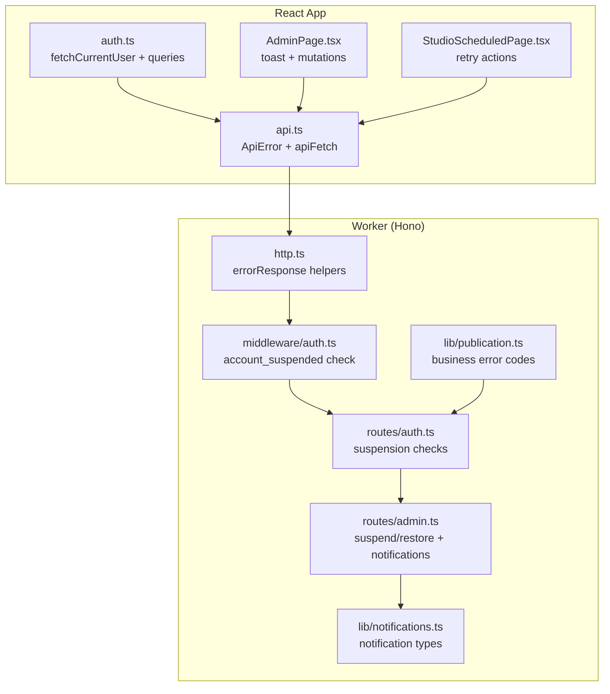
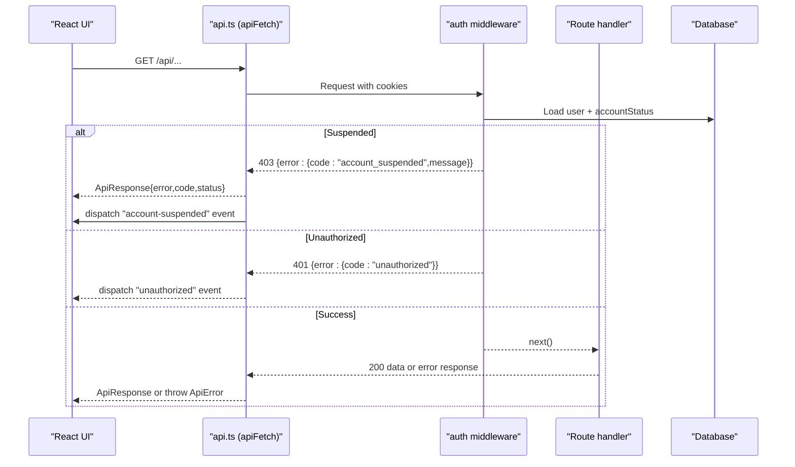
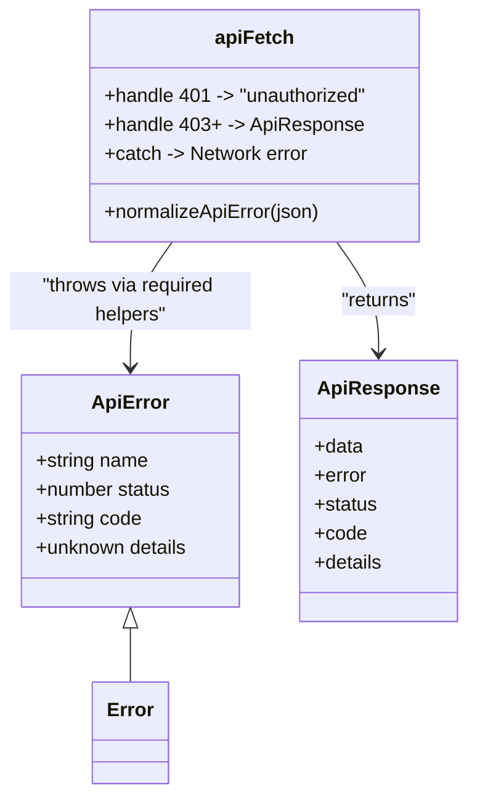
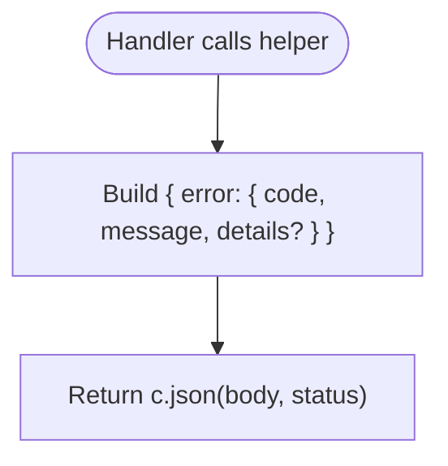
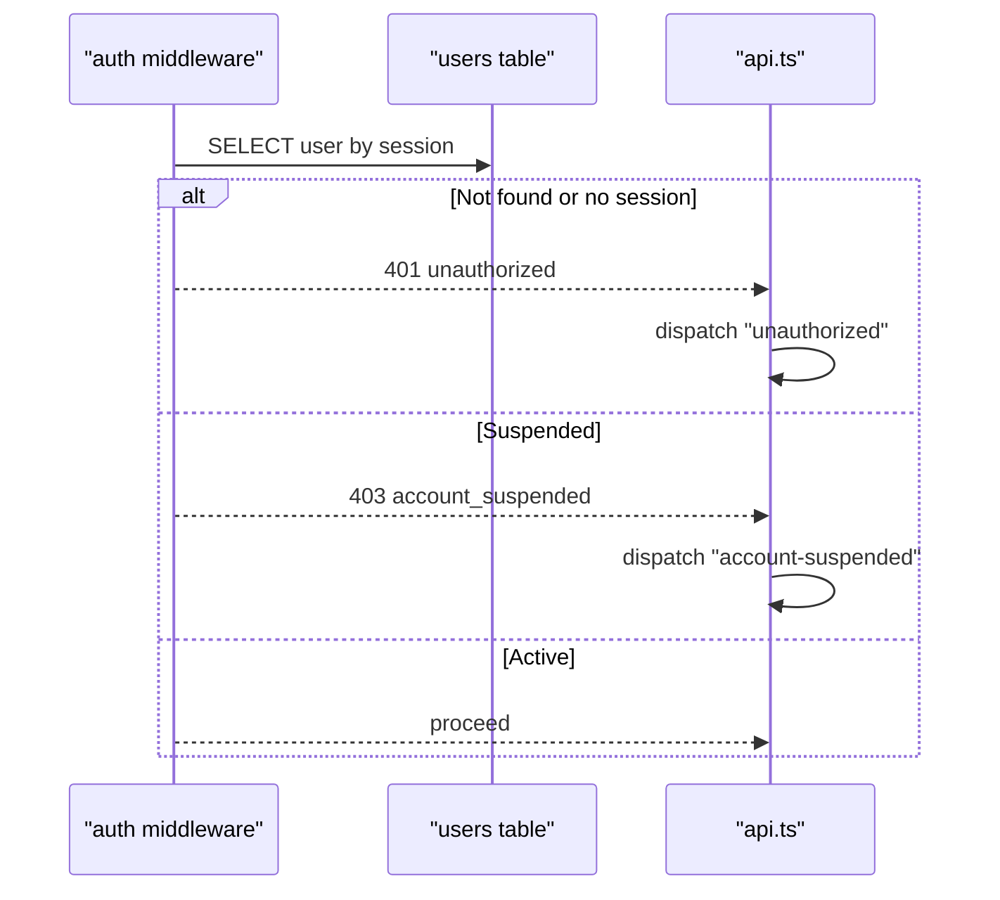
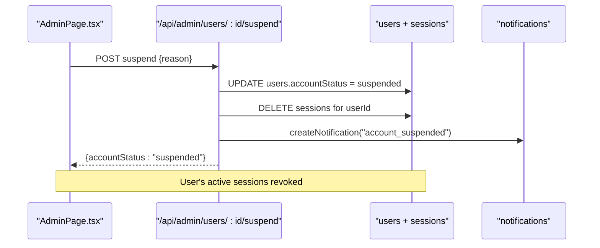
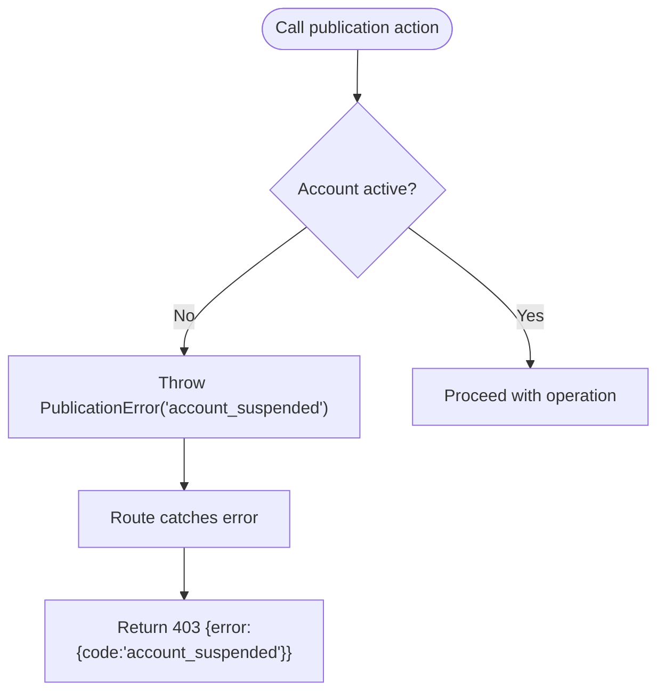
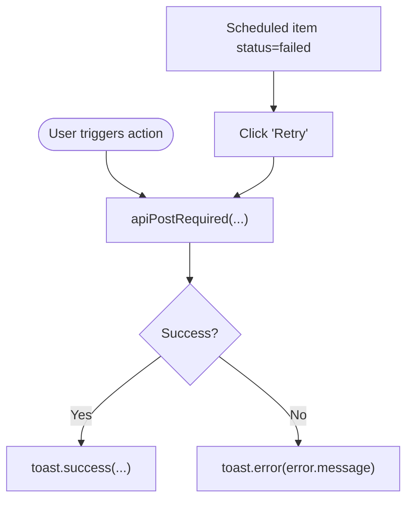
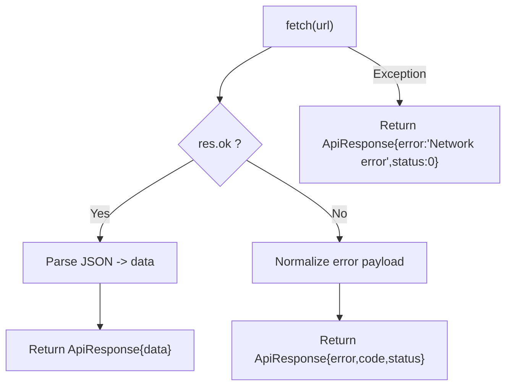
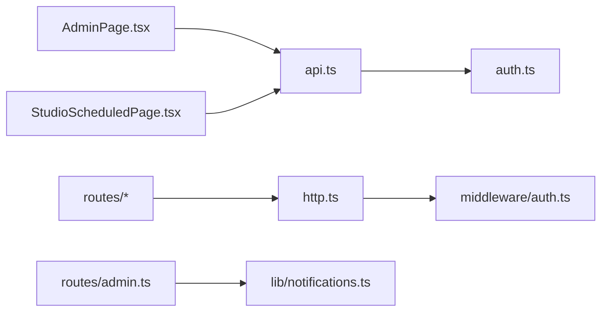

# Error Handling Flow

<cite>
**Referenced Files in This Document**
- [api.ts](file://src/react-app/lib/api.ts)
- [auth.ts](file://src/react-app/lib/auth.ts)
- [http.ts](file://src/worker/lib/http.ts)
- [auth-middleware.ts](file://src/worker/middleware/auth.ts)
- [admin-routes.ts](file://src/worker/routes/admin.ts)
- [auth-routes.ts](file://src/worker/routes/auth.ts)
- [publication.ts](file://src/worker/lib/publication.ts)
- [notifications.ts](file://src/worker/lib/notifications.ts)
- [AdminPage.tsx](file://src/react-app/pages/AdminPage.tsx)
- [StudioScheduledPage.tsx](file://src/react-app/pages/StudioScheduledPage.tsx)
</cite>

## Table of Contents
1. [Introduction](#introduction)
2. [Project Structure](#project-structure)
3. [Core Components](#core-components)
4. [Architecture Overview](#architecture-overview)
5. [Detailed Component Analysis](#detailed-component-analysis)
6. [Dependency Analysis](#dependency-analysis)
7. [Performance Considerations](#performance-considerations)
8. [Troubleshooting Guide](#troubleshooting-guide)
9. [Conclusion](#conclusion)

## Introduction
This document explains how errors are modeled, normalized, and propagated across the Zenith system—from Cloudflare Workers through the API layer to React components. It focuses on the ApiError class, error codes such as account_suspended, retry mechanisms, network error handling, user feedback patterns, and authentication error flows that trigger session cleanup and redirects.

## Project Structure
The error handling spans two main layers:
- Worker (Cloudflare Hono routes and middleware): standardized error responses and business logic error signaling.
- React App (TanStack Query + custom fetch wrapper): normalized client-side error objects and UI reactions.

**Diagram sources**
- [api.ts:1-164](file://src/react-app/lib/api.ts#L1-L164)
- [auth.ts:1-55](file://src/react-app/lib/auth.ts#L1-L55)
- [http.ts:1-80](file://src/worker/lib/http.ts#L1-L80)
- [auth-middleware.ts:1-57](file://src/worker/middleware/auth.ts#L1-L57)
- [admin-routes.ts:292-529](file://src/worker/routes/admin.ts#L292-L529)
- [auth-routes.ts:140-180](file://src/worker/routes/auth.ts#L140-L180)
- [publication.ts:110-120](file://src/worker/lib/publication.ts#L110-L120)
- [notifications.ts:182-234](file://src/worker/lib/notifications.ts#L182-L234)

**Section sources**
- [api.ts:1-164](file://src/react-app/lib/api.ts#L1-L164)
- [http.ts:1-80](file://src/worker/lib/http.ts#L1-L80)

## Core Components
- ApiError class: a typed Error with status, code, and details for consistent client-side error handling.
- HTTP error helpers: standardized JSON error bodies with code/message/details from the server.
- Auth middleware: enforces account status and returns account_suspended when needed.
- Client normalization: apiFetch normalizes server payloads into ApiResponse and throws ApiError via required helpers.

Key responsibilities:
- Server: produce uniform error shapes and codes.
- Middleware: gate access based on account state.
- Client: normalize responses, surface structured errors, and react to specific codes.

**Section sources**
- [api.ts:12-25](file://src/react-app/lib/api.ts#L12-L25)
- [http.ts:23-33](file://src/worker/lib/http.ts#L23-L33)
- [auth-middleware.ts:23-50](file://src/worker/middleware/auth.ts#L23-L50)

## Architecture Overview
End-to-end flow for an authenticated request that may fail due to suspension or other errors:

**Diagram sources**
- [api.ts:43-92](file://src/react-app/lib/api.ts#L43-L92)
- [auth-middleware.ts:23-50](file://src/worker/middleware/auth.ts#L23-L50)
- [http.ts:23-33](file://src/worker/lib/http.ts#L23-L33)

## Detailed Component Analysis

### ApiError Class and Normalization
- The ApiError class carries status, code, and optional details, enabling precise handling downstream.
- apiFetch normalizes both string and object error payloads into a consistent shape and returns ApiResponse.
- Required helpers (apiPostRequired, etc.) convert failed responses into thrown ApiError instances.

**Diagram sources**
- [api.ts:12-25](file://src/react-app/lib/api.ts#L12-L25)
- [api.ts:27-41](file://src/react-app/lib/api.ts#L27-L41)
- [api.ts:43-92](file://src/react-app/lib/api.ts#L43-L92)
- [api.ts:123-134](file://src/react-app/lib/api.ts#L123-L134)

**Section sources**
- [api.ts:12-25](file://src/react-app/lib/api.ts#L12-L25)
- [api.ts:27-41](file://src/react-app/lib/api.ts#L27-L41)
- [api.ts:43-92](file://src/react-app/lib/api.ts#L43-L92)
- [api.ts:123-134](file://src/react-app/lib/api.ts#L123-L134)

### Server-Side Error Responses and Codes
- errorResponse produces a consistent JSON body with error.code, error.message, and optional error.details.
- Helper functions (badRequest, unauthorized, forbidden, notFound, serverError) standardize common cases.
- Validation failures return 422 with issues payload.

**Diagram sources**
- [http.ts:23-33](file://src/worker/lib/http.ts#L23-L33)
- [http.ts:35-43](file://src/worker/lib/http.ts#L35-L43)
- [http.ts:45-75](file://src/worker/lib/http.ts#L45-L75)

**Section sources**
- [http.ts:23-33](file://src/worker/lib/http.ts#L23-L33)
- [http.ts:35-43](file://src/worker/lib/http.ts#L35-L43)
- [http.ts:45-75](file://src/worker/lib/http.ts#L45-L75)

### Authentication Errors and Session Cleanup
- authMiddleware loads the current session and user; if accountStatus is suspended, it returns 403 with code account_suspended.
- Routes also enforce suspension checks before sensitive operations.
- On 401, the client dispatches an "unauthorized" event; on 403 with code account_suspended, it dispatches "account-suspended".

**Diagram sources**
- [auth-middleware.ts:23-50](file://src/worker/middleware/auth.ts#L23-L50)
- [api.ts:61-82](file://src/react-app/lib/api.ts#L61-L82)

**Section sources**
- [auth-middleware.ts:23-50](file://src/worker/middleware/auth.ts#L23-L50)
- [api.ts:61-82](file://src/react-app/lib/api.ts#L61-L82)

### Account Suspension Flow and Notifications
- Admin can suspend a user; this updates account status, records audit logs, sends a notification, and revokes sessions.
- Subsequent requests hit auth middleware and receive 403 account_suspended.
- The client reacts by dispatching "account-suspended" and can trigger UI-level redirects or sign-out flows.

**Diagram sources**
- [admin-routes.ts:334-341](file://src/worker/routes/admin.ts#L334-L341)
- [admin-routes.ts:514-521](file://src/worker/routes/admin.ts#L514-L521)
- [notifications.ts:182-234](file://src/worker/lib/notifications.ts#L182-L234)

**Section sources**
- [admin-routes.ts:334-341](file://src/worker/routes/admin.ts#L334-L341)
- [admin-routes.ts:514-521](file://src/worker/routes/admin.ts#L514-L521)
- [notifications.ts:182-234](file://src/worker/lib/notifications.ts#L182-L234)

### Business Logic Error Propagation (Publication)
- Certain operations throw domain-specific errors (e.g., account_suspended) which routes catch and translate to HTTP 403 with the same code.
- This ensures consistent client behavior regardless of where the error originates.

**Diagram sources**
- [publication.ts:114-114](file://src/worker/lib/publication.ts#L114-L114)

**Section sources**
- [publication.ts:114-114](file://src/worker/lib/publication.ts#L114-L114)

### Client-Side Retry and User Feedback Patterns
- TanStack Query options include retry:false for auth queries to avoid re-attempting after 401.
- Scheduled items expose explicit retry actions for failed states.
- Admin actions use toast notifications for success/error feedback.

**Diagram sources**
- [auth.ts:29-34](file://src/react-app/lib/auth.ts#L29-L34)
- [StudioScheduledPage.tsx:125-143](file://src/react-app/pages/StudioScheduledPage.tsx#L125-L143)
- [AdminPage.tsx:151-161](file://src/react-app/pages/AdminPage.tsx#L151-L161)

**Section sources**
- [auth.ts:29-34](file://src/react-app/lib/auth.ts#L29-L34)
- [StudioScheduledPage.tsx:125-143](file://src/react-app/pages/StudioScheduledPage.tsx#L125-L143)
- [AdminPage.tsx:151-161](file://src/react-app/pages/AdminPage.tsx#L151-L161)

### Network Error Handling
- apiFetch wraps fetch and returns a network error ApiResponse when exceptions occur (no stack trace leaked).
- Required helpers then throw ApiError with status 0 and a generic message.

**Diagram sources**
- [api.ts:43-92](file://src/react-app/lib/api.ts#L43-L92)
- [api.ts:123-134](file://src/react-app/lib/api.ts#L123-L134)

**Section sources**
- [api.ts:43-92](file://src/react-app/lib/api.ts#L43-L92)
- [api.ts:123-134](file://src/react-app/lib/api.ts#L123-L134)

## Dependency Analysis
- Client depends on api.ts for all HTTP interactions and error shaping.
- Worker routes depend on http.ts for consistent error responses and on middleware for auth enforcement.
- Notification creation is decoupled but used by admin flows to inform users about account changes.

**Diagram sources**
- [api.ts:1-164](file://src/react-app/lib/api.ts#L1-L164)
- [auth.ts:1-55](file://src/react-app/lib/auth.ts#L1-L55)
- [http.ts:1-80](file://src/worker/lib/http.ts#L1-L80)
- [auth-middleware.ts:1-57](file://src/worker/middleware/auth.ts#L1-L57)
- [admin-routes.ts:292-529](file://src/worker/routes/admin.ts#L292-L529)
- [notifications.ts:182-234](file://src/worker/lib/notifications.ts#L182-L234)

**Section sources**
- [api.ts:1-164](file://src/react-app/lib/api.ts#L1-L164)
- [http.ts:1-80](file://src/worker/lib/http.ts#L1-L80)

## Performance Considerations
- Avoid retrying auth queries on 401 to prevent unnecessary network churn and rapid redirects.
- Use minimal error payloads; only include details when necessary for debugging.
- Prefer early returns in middleware to reduce database lookups for invalid sessions.

[No sources needed since this section provides general guidance]

## Troubleshooting Guide
Common symptoms and resolutions:
- Repeated 401 loops: ensure client handles "unauthorized" event and clears local state/session.
- Stuck in suspended state: verify admin suspend/restore flows and session revocation.
- Network errors: check connectivity and CORS; client will return status 0 with generic message.
- Validation failures: inspect validation_failed responses and fix input schemas.

**Section sources**
- [api.ts:61-92](file://src/react-app/lib/api.ts#L61-L92)
- [http.ts:35-43](file://src/worker/lib/http.ts#L35-L43)

## Conclusion
Zenith’s error handling is built around a consistent contract:
- Server: standardized JSON error bodies with stable codes.
- Middleware: centralized authorization and account-status checks.
- Client: normalized ApiResponse and ApiError with targeted UI reactions and controlled retries.
This design enables predictable behavior for critical scenarios like account suspension, authentication failures, and transient network issues while keeping user feedback clear and actionable.