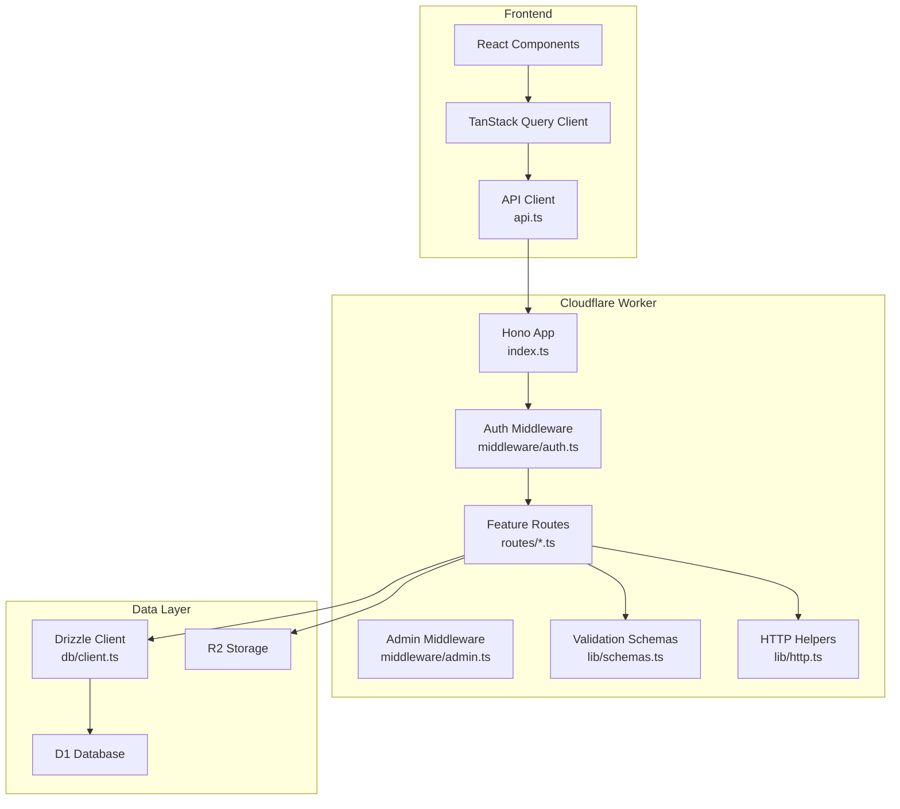
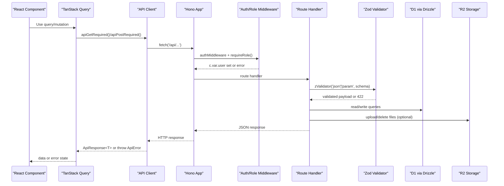
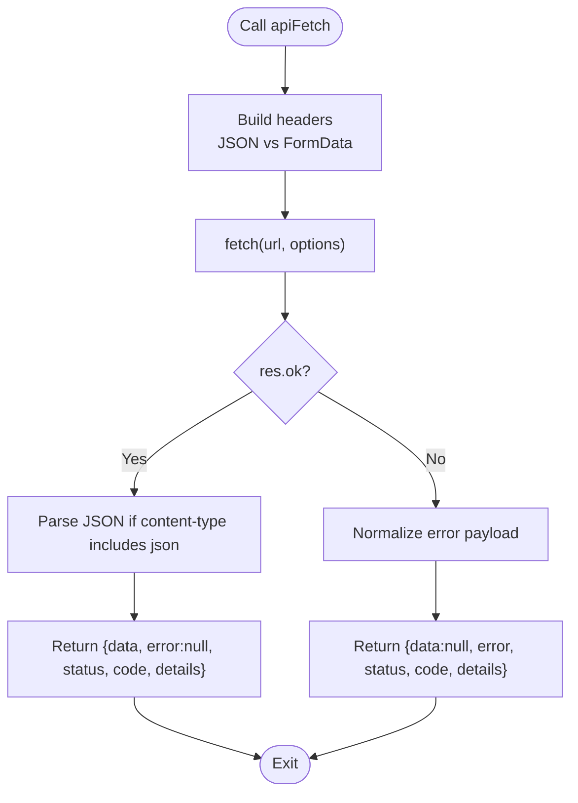
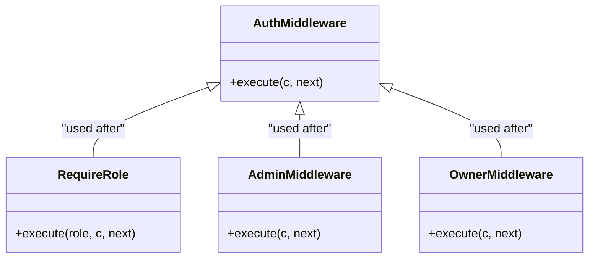
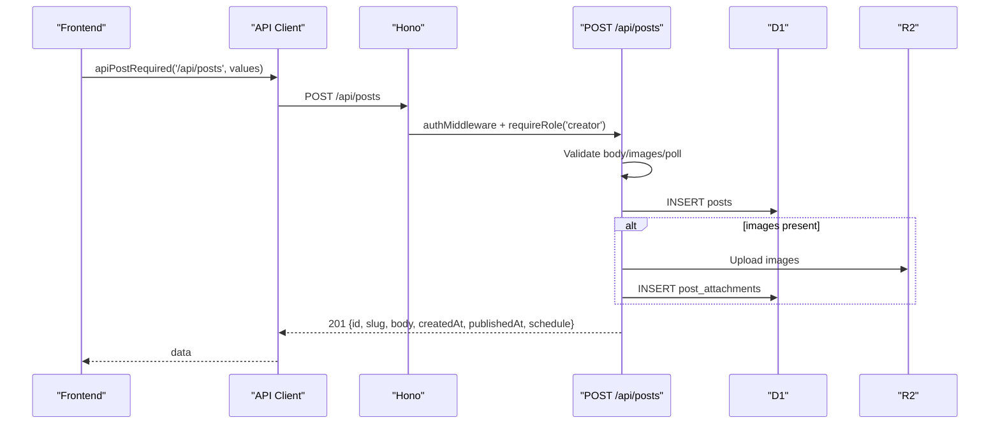
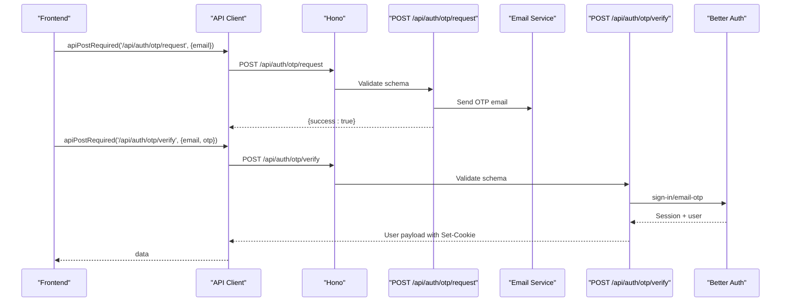
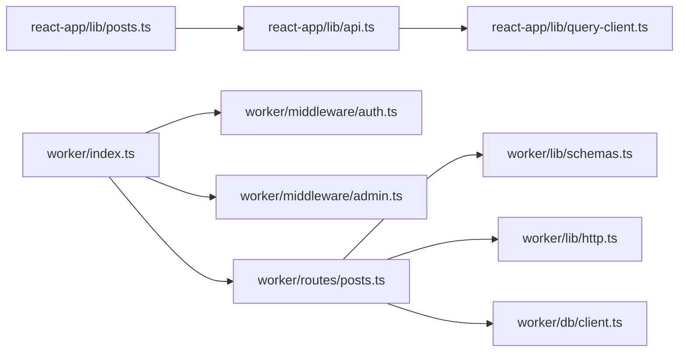

# Request-Response Cycle

<cite>
**Referenced Files in This Document**
- [index.ts](file://src/worker/index.ts)
- [api.ts](file://src/react-app/lib/api.ts)
- [query-client.ts](file://src/react-app/lib/query-client.ts)
- [posts.ts](file://src/react-app/lib/posts.ts)
- [http.ts](file://src/worker/lib/http.ts)
- [auth.ts](file://src/worker/middleware/auth.ts)
- [admin.ts](file://src/worker/middleware/admin.ts)
- [auth.ts](file://src/worker/routes/auth.ts)
- [posts.ts](file://src/worker/routes/posts.ts)
- [client.ts](file://src/worker/db/client.ts)
- [schemas.ts](file://src/worker/lib/schemas.ts)
</cite>

## Table of Contents
1. [Introduction](#introduction)
2. [Project Structure](#project-structure)
3. [Core Components](#core-components)
4. [Architecture Overview](#architecture-overview)
5. [Detailed Component Analysis](#detailed-component-analysis)
6. [Dependency Analysis](#dependency-analysis)
7. [Performance Considerations](#performance-considerations)
8. [Troubleshooting Guide](#troubleshooting-guide)
9. [Conclusion](#conclusion)

## Introduction
This document explains the end-to-end request-response cycle in Zenith, from React components using TanStack Query to Cloudflare Workers (Hono), and finally to the D1 database. It covers how the API client layer handles HTTP requests, normalizes responses, and propagates errors; how middleware enforces authentication, authorization, and validation; and how data is transformed at each layer for typical CRUD operations.

## Project Structure
The application consists of:
- Frontend React app with TanStack Query and a typed API client that wraps fetch and returns a consistent ApiResponse type.
- Backend Hono server on Cloudflare Workers that mounts feature routes, applies middleware, validates inputs, interacts with D1 via Drizzle ORM, and returns standardized JSON responses.
- Shared schemas for input validation and error utilities for consistent error payloads.



**Diagram sources**
- [index.ts:1-71](file://src/worker/index.ts#L1-L71)
- [api.ts:1-164](file://src/react-app/lib/api.ts#L1-L164)
- [query-client.ts:1-14](file://src/react-app/lib/query-client.ts#L1-L14)
- [auth.ts:1-57](file://src/worker/middleware/auth.ts#L1-L57)
- [admin.ts:1-14](file://src/worker/middleware/admin.ts#L1-L14)
- [posts.ts:1-800](file://src/worker/routes/posts.ts#L1-L800)
- [schemas.ts:1-221](file://src/worker/lib/schemas.ts#L1-L221)
- [http.ts:1-80](file://src/worker/lib/http.ts#L1-L80)
- [client.ts:1-9](file://src/worker/db/client.ts#L1-L9)

**Section sources**
- [index.ts:1-71](file://src/worker/index.ts#L1-L71)
- [api.ts:1-164](file://src/react-app/lib/api.ts#L1-L164)
- [query-client.ts:1-14](file://src/react-app/lib/query-client.ts#L1-L14)

## Core Components
- Frontend API client: Provides typed helpers for GET/POST/PUT/PATCH/DELETE, normalizes responses into ApiResponse<T>, and throws ApiError on failures.
- TanStack Query: Configured with minimal retries and no automatic refetches, used by feature modules to call the API client.
- Hono server: Mounts route groups under /api/*, defines global error and not-found handlers, and exposes scheduled tasks.
- Middleware pipeline: Authentication and role checks populate c.var.user; admin/owner checks restrict sensitive endpoints.
- Validation: Zod schemas validate JSON and form data; zValidator integrates with Hono to short-circuit on invalid input.
- Error handling: Centralized helpers produce consistent error JSON payloads with code, message, and optional details.
- Data access: Drizzle client wraps D1; routes perform queries and mutations, then serialize results for the frontend.

**Section sources**
- [api.ts:1-164](file://src/react-app/lib/api.ts#L1-L164)
- [query-client.ts:1-14](file://src/react-app/lib/query-client.ts#L1-L14)
- [index.ts:1-71](file://src/worker/index.ts#L1-L71)
- [auth.ts:1-57](file://src/worker/middleware/auth.ts#L1-L57)
- [admin.ts:1-14](file://src/worker/middleware/admin.ts#L1-L14)
- [schemas.ts:1-221](file://src/worker/lib/schemas.ts#L1-L221)
- [http.ts:1-80](file://src/worker/lib/http.ts#L1-L80)
- [client.ts:1-9](file://src/worker/db/client.ts#L1-L9)

## Architecture Overview
The request flows through these layers:
1. React component calls a TanStack Query hook or mutation.
2. The query/mutation invokes the API client which performs fetch with credentials.
3. The Hono worker receives the request, runs auth and role middleware, validates input, executes business logic, and accesses D1/R2.
4. Responses are normalized to ApiResponse<T> on the client side; errors are thrown as ApiError with status, code, and details.



**Diagram sources**
- [api.ts:1-164](file://src/react-app/lib/api.ts#L1-L164)
- [index.ts:1-71](file://src/worker/index.ts#L1-L71)
- [auth.ts:1-57](file://src/worker/middleware/auth.ts#L1-L57)
- [posts.ts:1-800](file://src/worker/routes/posts.ts#L1-L800)
- [schemas.ts:1-221](file://src/worker/lib/schemas.ts#L1-L221)
- [client.ts:1-9](file://src/worker/db/client.ts#L1-L9)

## Detailed Component Analysis

### Frontend API Client and TanStack Query
- ApiResponse<T>: A unified shape with data, error, status, code, and details.
- apiFetch: Performs fetch with credentials, parses JSON when applicable, dispatches custom events for specific statuses (e.g., unauthorized, account-suspended), and returns ApiResponse<T>.
- Required helpers: apiGetRequired, apiPostRequired, etc., unwrap ApiResponse and throw ApiError on failure.
- TanStack Query configuration: Disables retries and window-focus refetch to keep behavior predictable and explicit.



**Diagram sources**
- [api.ts:1-164](file://src/react-app/lib/api.ts#L1-L164)

**Section sources**
- [api.ts:1-164](file://src/react-app/lib/api.ts#L1-L164)
- [query-client.ts:1-14](file://src/react-app/lib/query-client.ts#L1-L14)

### Hono Server and Route Mounting
- The Hono app mounts multiple route groups under /api/* (auth, feed, profile, settings, creator, posts, articles, audio, photography, payments, notifications, courses, admin, library, schedules, discovery).
- Global onError returns a standardized server error; notFound differentiates between API paths and static assets.
- Scheduled tasks run background maintenance jobs.

**Section sources**
- [index.ts:1-71](file://src/worker/index.ts#L1-L71)

### Middleware Pipeline: Authentication and Authorization
- authMiddleware: Uses Better Auth to get session, loads user with role and admin role from D1, rejects suspended accounts, and attaches user to context.
- requireRole: Restricts endpoints to specific roles (subscriber/creator).
- admin/owner middleware: Enforces higher privileges for admin endpoints.



**Diagram sources**
- [auth.ts:1-57](file://src/worker/middleware/auth.ts#L1-L57)
- [admin.ts:1-14](file://src/worker/middleware/admin.ts#L1-L14)

**Section sources**
- [auth.ts:1-57](file://src/worker/middleware/auth.ts#L1-L57)
- [admin.ts:1-14](file://src/worker/middleware/admin.ts#L1-L14)

### Input Validation with Zod
- Schemas define strict shapes for auth OTP, post creation, replies, polls, settings, and more.
- zValidator integrates with Hono to validate 'json' and 'param' fields and short-circuit with 422 validation_failed errors.

**Section sources**
- [schemas.ts:1-221](file://src/worker/lib/schemas.ts#L1-L221)
- [posts.ts:1-800](file://src/worker/routes/posts.ts#L1-L800)
- [auth.ts:1-259](file://src/worker/routes/auth.ts#L1-L259)

### Error Handling and Normalization
- Backend error helpers return consistent JSON with code, message, and optional details.
- Frontend normalizes both string and object error payloads into ApiResponse fields and throws ApiError for required helpers.

```mermaid
classDiagram
class ApiResponse_T_ {
+data : T | null
+error : string | null
+status : number
+code : string?
+details : unknown?
}
class ApiError {
+message : string
+status : number
+code : string
+details : unknown?
}
class ErrorBody {
+error : { code : string; message : string; details? : unknown }
}
ApiResponse_T_ --> ApiError : "throws on failure"
ErrorBody <-- "returned by" : HTTP helpers
```

**Diagram sources**
- [api.ts:1-164](file://src/react-app/lib/api.ts#L1-L164)
- [http.ts:1-80](file://src/worker/lib/http.ts#L1-L80)

**Section sources**
- [http.ts:1-80](file://src/worker/lib/http.ts#L1-L80)
- [api.ts:1-164](file://src/react-app/lib/api.ts#L1-L164)

### Data Access Layer
- Drizzle client wraps D1 with schema types for type-safe queries.
- Routes use Drizzle to read/write entities and serialize results for the frontend.

**Section sources**
- [client.ts:1-9](file://src/worker/db/client.ts#L1-L9)
- [posts.ts:1-800](file://src/worker/routes/posts.ts#L1-L800)

### Typical CRUD Flows

#### Create Post (Draft)
- Frontend: posts.ts calls createPost(values) which uses apiPostRequired('/api/posts', values).
- Backend: POST /api/posts with authMiddleware and requireRole('creator'); validates multipart/form-data or JSON; creates post row; optionally uploads images; may schedule publication; returns created post metadata.



**Diagram sources**
- [posts.ts:1-160](file://src/react-app/lib/posts.ts#L1-L160)
- [api.ts:1-164](file://src/react-app/lib/api.ts#L1-L164)
- [posts.ts:1-800](file://src/worker/routes/posts.ts#L1-L800)

**Section sources**
- [posts.ts:1-160](file://src/react-app/lib/posts.ts#L1-L160)
- [posts.ts:419-542](file://src/worker/routes/posts.ts#L419-L542)

#### Update Draft Post
- Frontend: updateDraftPost(postId, values) uses apiPatchRequired('/api/posts/:postId', values).
- Backend: PATCH /api/posts/:postId with auth and role checks; validates updates; removes attachments if requested; re-uploads new images; updates poll; returns updated post.

**Section sources**
- [posts.ts:121-123](file://src/react-app/lib/posts.ts#L121-L123)
- [posts.ts:555-623](file://src/worker/routes/posts.ts#L555-L623)

#### Delete Draft Post
- Frontend: deleteDraftPost(postId) uses apiDeleteRequired('/api/posts/:postId').
- Backend: DELETE /api/posts/:postId with auth and role checks; deletes post and associated attachments; returns deleted flag.

**Section sources**
- [posts.ts:125-127](file://src/react-app/lib/posts.ts#L125-L127)
- [posts.ts:625-636](file://src/worker/routes/posts.ts#L625-L636)

#### Get Post Detail and Replies
- Frontend: postDetailQueryOptions(username, slug) calls apiGetRequired('/api/posts/by-slug/:username/:slug').
- Backend: GET /api/posts/by-slug/:username/:slug with auth; validates params; checks access; builds extras and replies; returns serialized post and replies.

**Section sources**
- [posts.ts:103-108](file://src/react-app/lib/posts.ts#L103-L108)
- [posts.ts:640-678](file://src/worker/routes/posts.ts#L640-L678)

#### Like/Unlike Post
- Frontend: likePost/unlikePost call respective endpoints.
- Backend: POST/DELETE /api/posts/:postId/like with auth; toggles like; returns counts and viewerLiked state.

**Section sources**
- [posts.ts:133-139](file://src/react-app/lib/posts.ts#L133-L139)
- [posts.ts:779-800](file://src/worker/routes/posts.ts#L779-L800)

#### Create Reply
- Frontend: createReply(postId, values) uses apiPostRequired('/api/posts/:postId/replies', values).
- Backend: POST /api/posts/:postId/replies with auth; validates body and optional parent; inserts reply; uploads images; serializes replies; notifies mentioned user.

**Section sources**
- [posts.ts:129-131](file://src/react-app/lib/posts.ts#L129-L131)
- [posts.ts:695-775](file://src/worker/routes/posts.ts#L695-L775)

### Authentication Flow (OTP)
- Frontend triggers OTP request and verification flows via auth routes.
- Backend validates OTP request/verify schemas, stores OTP, sends email, verifies against Better Auth, and sets cookies.



**Diagram sources**
- [auth.ts:1-259](file://src/worker/routes/auth.ts#L1-L259)
- [api.ts:1-164](file://src/react-app/lib/api.ts#L1-L164)

**Section sources**
- [auth.ts:135-212](file://src/worker/routes/auth.ts#L135-L212)

## Dependency Analysis
- Frontend depends on TanStack Query and the API client module.
- Hono app depends on route modules, middleware, and shared libraries.
- Routes depend on validation schemas, HTTP helpers, and data access via Drizzle.
- Middleware depends on auth library and D1 schema.



**Diagram sources**
- [api.ts:1-164](file://src/react-app/lib/api.ts#L1-L164)
- [query-client.ts:1-14](file://src/react-app/lib/query-client.ts#L1-L14)
- [posts.ts:1-160](file://src/react-app/lib/posts.ts#L1-L160)
- [index.ts:1-71](file://src/worker/index.ts#L1-L71)
- [auth.ts:1-57](file://src/worker/middleware/auth.ts#L1-L57)
- [admin.ts:1-14](file://src/worker/middleware/admin.ts#L1-L14)
- [posts.ts:1-800](file://src/worker/routes/posts.ts#L1-L800)
- [schemas.ts:1-221](file://src/worker/lib/schemas.ts#L1-L221)
- [http.ts:1-80](file://src/worker/lib/http.ts#L1-L80)
- [client.ts:1-9](file://src/worker/db/client.ts#L1-L9)

**Section sources**
- [index.ts:1-71](file://src/worker/index.ts#L1-L71)
- [posts.ts:1-800](file://src/worker/routes/posts.ts#L1-L800)
- [api.ts:1-164](file://src/react-app/lib/api.ts#L1-L164)

## Performance Considerations
- Disable unnecessary retries and refetches in TanStack Query to avoid redundant network calls.
- Use batched DB operations where possible (e.g., inserting multiple attachments).
- Parallelize independent reads/writes within route handlers (e.g., building extras and fetching replies concurrently).
- Validate early to fail fast and reduce downstream work.
- Avoid large payloads; enforce size limits for images and bodies.

[No sources needed since this section provides general guidance]

## Troubleshooting Guide
- Network errors: The API client returns ApiResponse with error "Network error" and status 0; ensure connectivity and CORS/cookies are configured.
- Unauthorized: 401 triggers an "unauthorized" event; verify session cookies and auth middleware behavior.
- Account suspended: 403 with code "account_suspended" triggers a corresponding event; handle by prompting re-authentication or support contact.
- Validation failures: 422 with code "validation_failed" includes issues array; inspect Zod schema definitions and client payloads.
- Not found: 404 for API paths; check route mounting and URL patterns.
- Internal server errors: 500 with code "internal_server_error"; review logs and error boundaries.

**Section sources**
- [api.ts:1-164](file://src/react-app/lib/api.ts#L1-L164)
- [http.ts:1-80](file://src/worker/lib/http.ts#L1-L80)
- [index.ts:47-60](file://src/worker/index.ts#L47-L60)

## Conclusion
Zenith’s request-response cycle is built around a clear separation of concerns: a typed frontend API client with TanStack Query, a Hono-based backend with robust middleware and validation, and a Drizzle-backed D1 data layer. Consistent ApiResponse and error codes enable reliable error propagation and handling across the stack. The documented flows for CRUD operations illustrate how data is transformed and validated at each stage, ensuring correctness and maintainability.