# Deployment Architecture

<cite>
**Referenced Files in This Document**
- [wrangler.json](file://wrangler.json)
- [package.json](file://package.json)
- [drizzle.config.ts](file://drizzle.config.ts)
- [vite.config.ts](file://vite.config.ts)
- [src/worker/index.ts](file://src/worker/index.ts)
- [src/worker/db/client.ts](file://src/worker/db/client.ts)
- [src/react-app/main.tsx](file://src/react-app/main.tsx)
- [AGENTS.md](file://AGENTS.md)
</cite>

## Table of Contents
1. [Introduction](#introduction)
2. [Project Structure](#project-structure)
3. [Core Components](#core-components)
4. [Architecture Overview](#architecture-overview)
5. [Detailed Component Analysis](#detailed-component-analysis)
6. [Dependency Analysis](#dependency-analysis)
7. [Performance Considerations](#performance-considerations)
8. [Troubleshooting Guide](#troubleshooting-guide)
9. [Conclusion](#conclusion)
10. [Appendices](#appendices)

## Introduction
This document describes the deployment and infrastructure architecture for a Cloudflare-based application that uses Workers for backend APIs, Pages for frontend hosting, D1 for the database, and R2 for object storage. It covers environment configuration and secrets management, CI/CD and automated deployments, local development with Cloudflare emulation, monitoring and logging strategies, and scaling and performance considerations inherent to edge computing.

## Project Structure
The project is organized into:
- Frontend React application under src/react-app, built by Vite and served as static assets via Cloudflare Pages through the Worker’s assets binding.
- Backend Hono API server implemented as a Cloudflare Worker entrypoint at src/worker/index.ts.
- Database schema and migrations managed with Drizzle ORM and D1.
- Object storage integration configured via R2 bindings.
- Environment and deployment configuration defined in wrangler.json and package scripts.

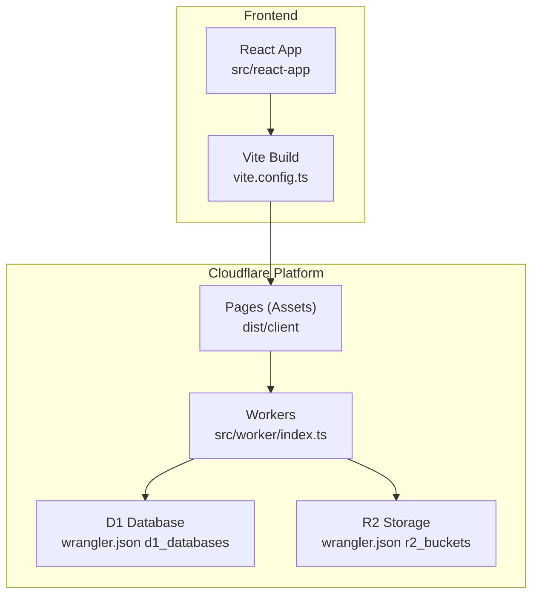

**Diagram sources**
- [vite.config.ts:1-28](file://vite.config.ts#L1-L28)
- [wrangler.json:26-33](file://wrangler.json#L26-L33)
- [wrangler.json:52-65](file://wrangler.json#L52-L65)
- [src/worker/index.ts:1-71](file://src/worker/index.ts#L1-L71)

**Section sources**
- [vite.config.ts:1-28](file://vite.config.ts#L1-L28)
- [wrangler.json:1-139](file://wrangler.json#L1-L139)
- [src/worker/index.ts:1-71](file://src/worker/index.ts#L1-L71)

## Core Components
- Cloudflare Workers (Backend): The Hono-based API server is exported from the Worker entrypoint and exposes multiple route modules under /api/* paths. It also defines scheduled tasks for background maintenance.
- Cloudflare Pages (Frontend): Static assets are built by Vite and served via the Worker’s assets binding configured to handle single-page applications.
- Cloudflare D1 (Database): Drizzle ORM is used to interact with D1; the client factory creates a typed DB instance bound to the D1Database provided by the runtime.
- Cloudflare R2 (Object Storage): R2 buckets are bound to the Worker for storing media and other objects.
- Configuration and Secrets: Environment variables and secrets are declared in wrangler.json per environment. Sensitive values are enforced as required secrets.

Key responsibilities:
- Routing and middleware orchestration in the Worker.
- Asset serving and SPA fallback logic.
- Database access abstraction via Drizzle.
- Secure handling of secrets and environment-specific settings.

**Section sources**
- [src/worker/index.ts:1-71](file://src/worker/index.ts#L1-L71)
- [src/worker/db/client.ts:1-9](file://src/worker/db/client.ts#L1-L9)
- [wrangler.json:34-51](file://wrangler.json#L34-L51)
- [wrangler.json:66-114](file://wrangler.json#L66-L114)

## Architecture Overview
The system follows an edge-first model:
- Requests arrive at Cloudflare’s edge network.
- Static assets are served directly from Pages or proxied through the Worker when needed (e.g., API routes).
- The Worker processes API requests, authenticates users, and interacts with D1 and R2.
- Scheduled tasks run periodically to process due items and maintain memberships.

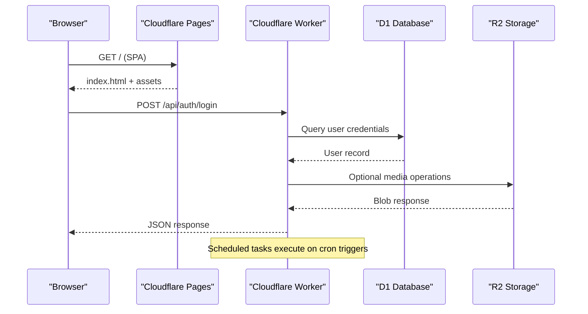

**Diagram sources**
- [wrangler.json:26-33](file://wrangler.json#L26-L33)
- [wrangler.json:66-114](file://wrangler.json#L66-L114)
- [src/worker/index.ts:62-70](file://src/worker/index.ts#L62-L70)

## Detailed Component Analysis

### Cloudflare Workers (Backend)
- Entry point exports a Hono app with multiple API route modules mounted under /api/* namespaces.
- Error handling returns standardized server errors; not-found handler serves assets for non-API routes.
- Scheduled handler runs periodic maintenance tasks using waitUntil to ensure completion.

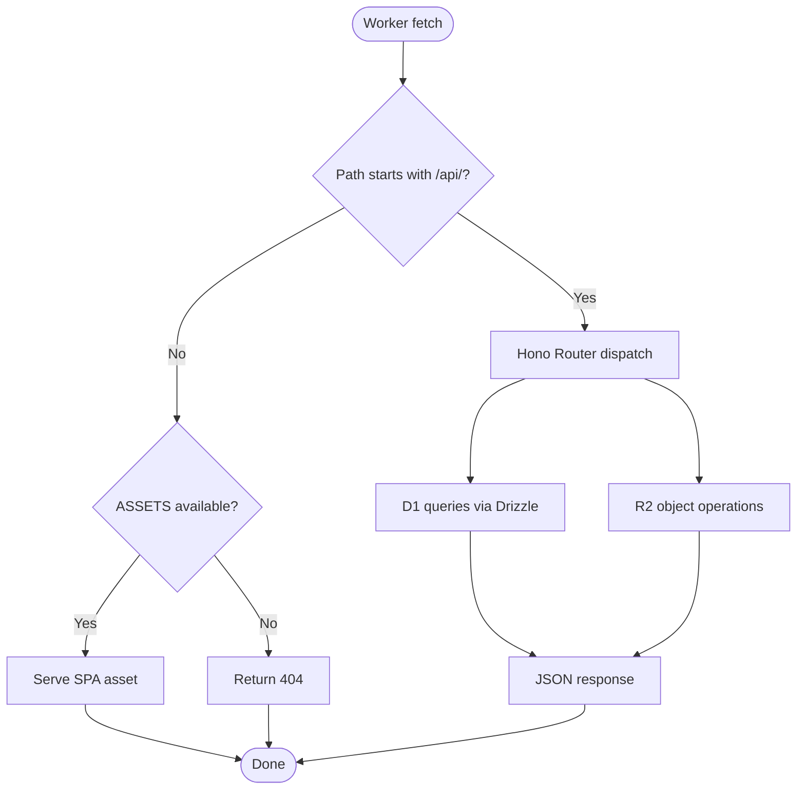

**Diagram sources**
- [src/worker/index.ts:24-60](file://src/worker/index.ts#L24-L60)

**Section sources**
- [src/worker/index.ts:1-71](file://src/worker/index.ts#L1-L71)

### Cloudflare Pages (Frontend Hosting)
- Vite builds the React app and outputs to dist/client.
- The Worker’s assets binding serves these files and handles SPA routing by falling back to index.html for non-API routes.

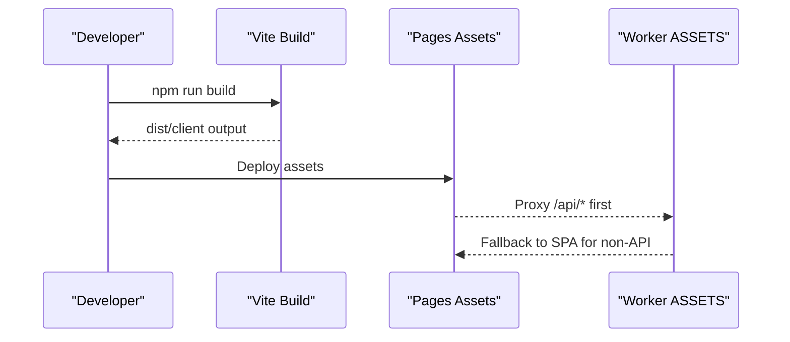

**Diagram sources**
- [vite.config.ts:1-28](file://vite.config.ts#L1-L28)
- [wrangler.json:26-33](file://wrangler.json#L26-L33)

**Section sources**
- [vite.config.ts:1-28](file://vite.config.ts#L1-L28)
- [wrangler.json:26-33](file://wrangler.json#L26-L33)

### Cloudflare D1 (Database)
- Drizzle ORM is configured to use the D1 HTTP driver.
- A typed client factory wraps the D1Database instance with schema definitions.

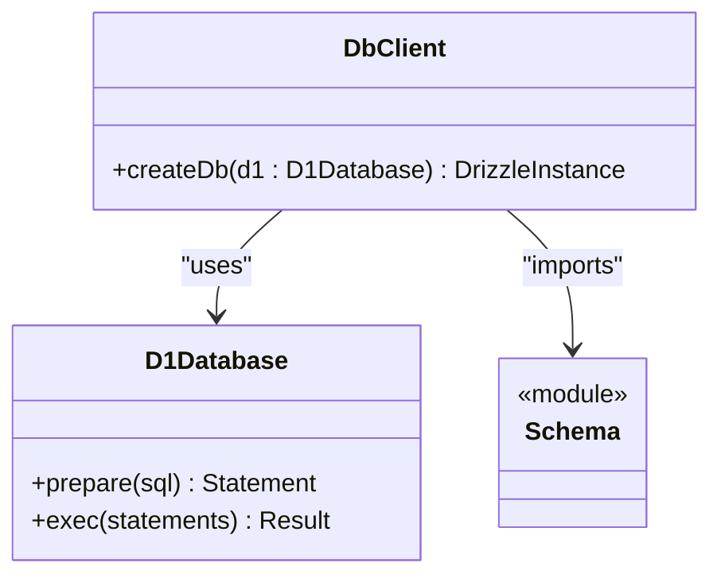

**Diagram sources**
- [src/worker/db/client.ts:1-9](file://src/worker/db/client.ts#L1-L9)
- [drizzle.config.ts:1-14](file://drizzle.config.ts#L1-L14)

**Section sources**
- [src/worker/db/client.ts:1-9](file://src/worker/db/client.ts#L1-L9)
- [drizzle.config.ts:1-14](file://drizzle.config.ts#L1-L14)

### Cloudflare R2 (Object Storage)
- R2 bucket binding provides object storage for media and other binary content.
- Bucket names differ between local and production environments.

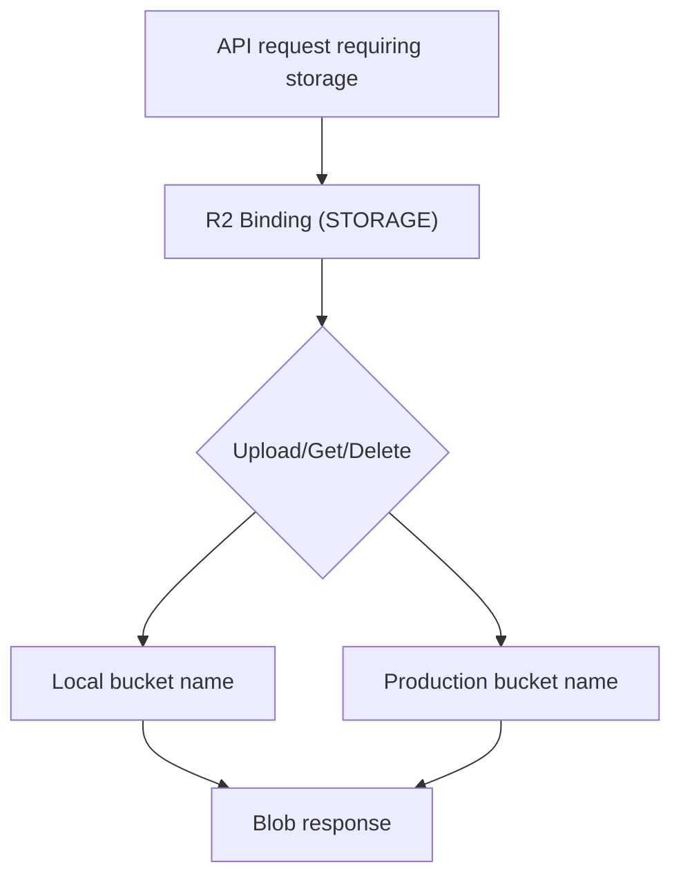

**Diagram sources**
- [wrangler.json:60-65](file://wrangler.json#L60-L65)
- [wrangler.json:107-112](file://wrangler.json#L107-L112)

**Section sources**
- [wrangler.json:60-65](file://wrangler.json#L60-L65)
- [wrangler.json:107-112](file://wrangler.json#L107-L112)

### Environment Configuration and Secrets Management
- Non-sensitive variables are defined in vars sections for default and production environments.
- Sensitive values are enforced as required secrets in the production environment.
- Email sending configuration is specified per environment.
- D1 and R2 bindings are configured separately for local and production.

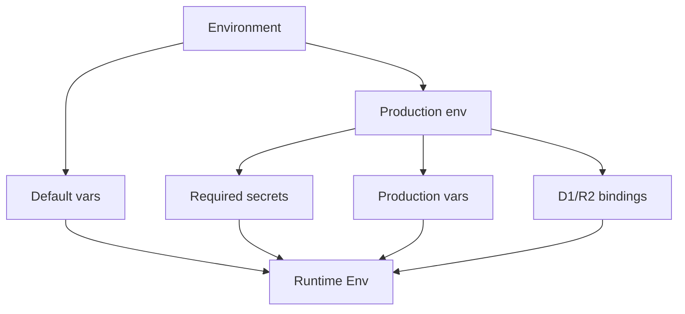

**Diagram sources**
- [wrangler.json:34-51](file://wrangler.json#L34-L51)
- [wrangler.json:66-114](file://wrangler.json#L66-L114)

**Section sources**
- [wrangler.json:34-51](file://wrangler.json#L34-L51)
- [wrangler.json:66-114](file://wrangler.json#L66-L114)

### CI/CD Pipeline and Automated Deployment
- Build and deploy commands are defined in package.json scripts.
- Production builds set CLOUDFLARE_ENV=production and invoke Wrangler deploy.
- Dry-run deployments validate configurations before actual pushes.

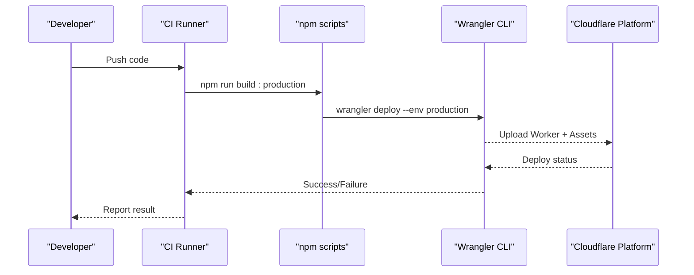

**Diagram sources**
- [package.json:83-95](file://package.json#L83-L95)
- [wrangler.json:66-114](file://wrangler.json#L66-L114)

**Section sources**
- [package.json:83-95](file://package.json#L83-L95)
- [wrangler.json:66-114](file://wrangler.json#L66-L114)

### Development Environment Setup with Local Emulation
- Local development uses Vite for the frontend and Wrangler for the Worker runtime.
- D1 and R2 bindings are configured locally with placeholder names and IDs.
- Scripts support type generation and dry-run deployments.

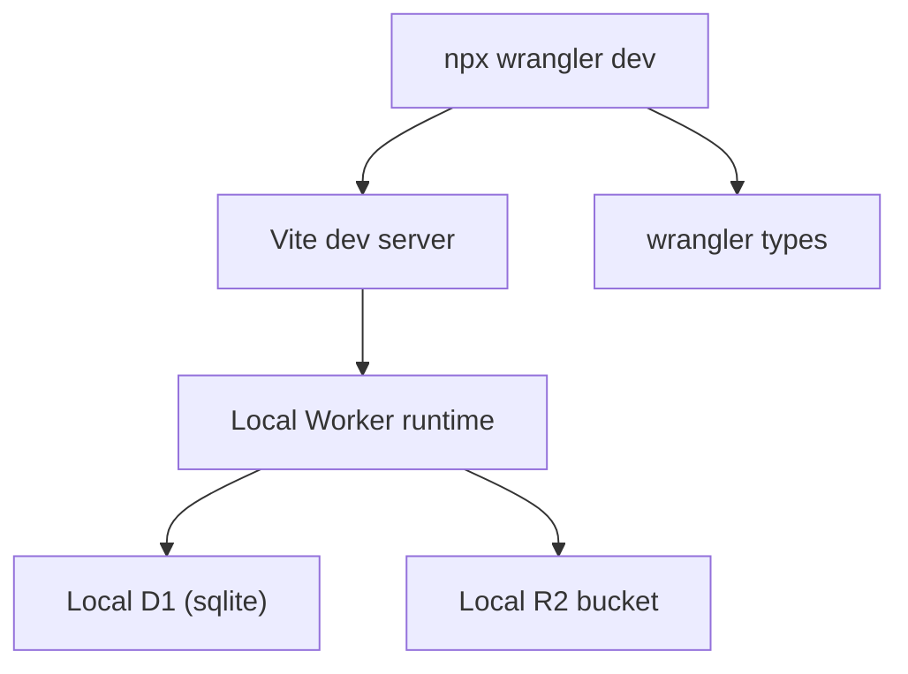

**Diagram sources**
- [wrangler.json:52-65](file://wrangler.json#L52-L65)
- [package.json:83-95](file://package.json#L83-L95)
- [AGENTS.md:12-20](file://AGENTS.md#L12-L20)

**Section sources**
- [wrangler.json:52-65](file://wrangler.json#L52-L65)
- [package.json:83-95](file://package.json#L83-L95)
- [AGENTS.md:12-20](file://AGENTS.md#L12-L20)

### Monitoring and Logging Strategies
- Observability is enabled in the Worker configuration with logs and traces.
- Invocation logs and sampling rates are configured for production telemetry.
- Admin endpoints expose health signals and links to Cloudflare metrics dashboards.

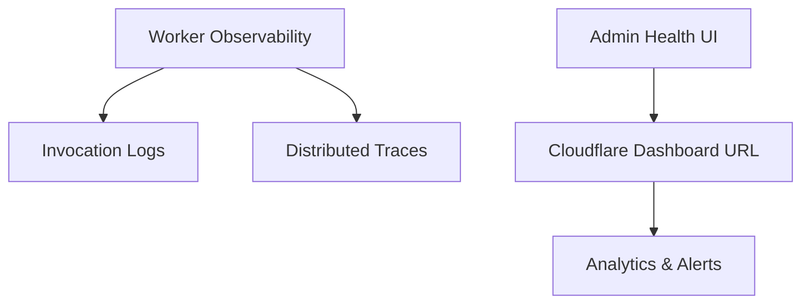

**Diagram sources**
- [wrangler.json:13-24](file://wrangler.json#L13-L24)
- [wrangler.json:82-82](file://wrangler.json#L82-L82)

**Section sources**
- [wrangler.json:13-24](file://wrangler.json#L13-L24)
- [wrangler.json:82-82](file://wrangler.json#L82-L82)

### Scaling Considerations and Performance Optimization
- Edge execution: Workers run close to users, minimizing latency.
- Smart Placement: Can be enabled to optimize request routing based on proximity and load.
- Asset caching: Pages serve static assets efficiently; API responses can leverage Cache-Control headers where appropriate.
- Concurrency: Use waitUntil for long-running background tasks without blocking responses.
- Resource limits: Monitor CPU/memory usage and adjust logic to stay within platform quotas.

[No sources needed since this section provides general guidance]

## Dependency Analysis
The application’s runtime dependencies include:
- Hono for routing and middleware.
- Drizzle ORM for D1 interactions.
- Stripe SDK for payments.
- React and TanStack Router for the frontend.
- Wrangler for local development and deployment.

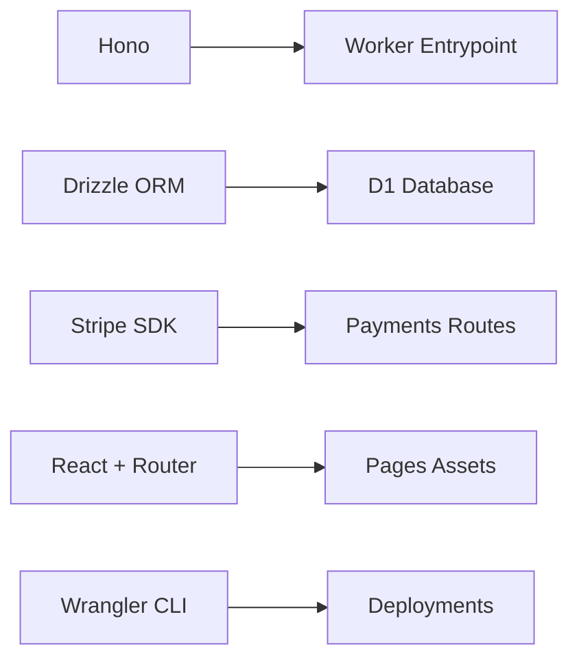

**Diagram sources**
- [package.json:14-56](file://package.json#L14-L56)
- [src/worker/index.ts:1-23](file://src/worker/index.ts#L1-L23)
- [drizzle.config.ts:1-14](file://drizzle.config.ts#L1-L14)

**Section sources**
- [package.json:14-56](file://package.json#L14-L56)
- [src/worker/index.ts:1-23](file://src/worker/index.ts#L1-L23)
- [drizzle.config.ts:1-14](file://drizzle.config.ts#L1-L14)

## Performance Considerations
- Prefer minimal payloads and efficient queries against D1.
- Use streaming and pagination for large datasets.
- Leverage R2 for direct object delivery when possible.
- Enable observability to identify hotspots and optimize cold starts.
- Consider enabling Smart Placement for global audiences.

[No sources needed since this section provides general guidance]

## Troubleshooting Guide
Common issues and resolutions:
- Missing secrets: Ensure all required secrets are set in the production environment.
- D1 connectivity: Verify account ID, database ID, and token in Drizzle configuration.
- R2 permissions: Confirm bucket names and access policies match environment bindings.
- Observability gaps: Check logs and traces in the Cloudflare dashboard.

**Section sources**
- [wrangler.json:84-90](file://wrangler.json#L84-L90)
- [drizzle.config.ts:8-12](file://drizzle.config.ts#L8-L12)

## Conclusion
This architecture leverages Cloudflare’s edge capabilities to deliver a fast, scalable, and secure application. By integrating Workers, Pages, D1, and R2 with robust configuration and observability, the system supports both rapid development and reliable production operations. Adhering to best practices for secrets management, performance tuning, and monitoring ensures optimal user experience and operational stability.

[No sources needed since this section summarizes without analyzing specific files]

## Appendices
- Commands reference for local development and deployment.
- Environment variable and secret checklist for production readiness.
- Links to Cloudflare product documentation for deeper exploration.

[No sources needed since this section provides general guidance]