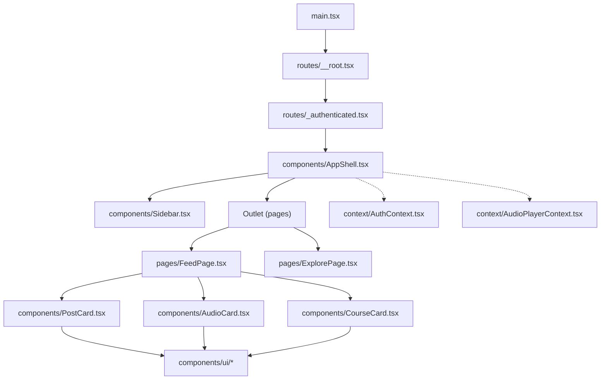
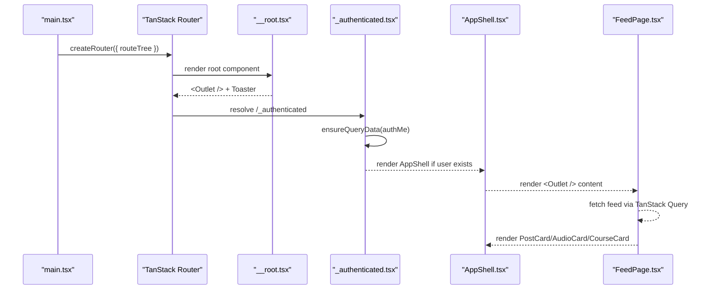
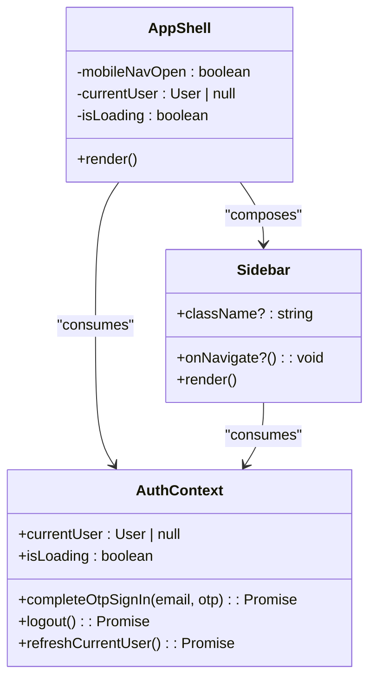
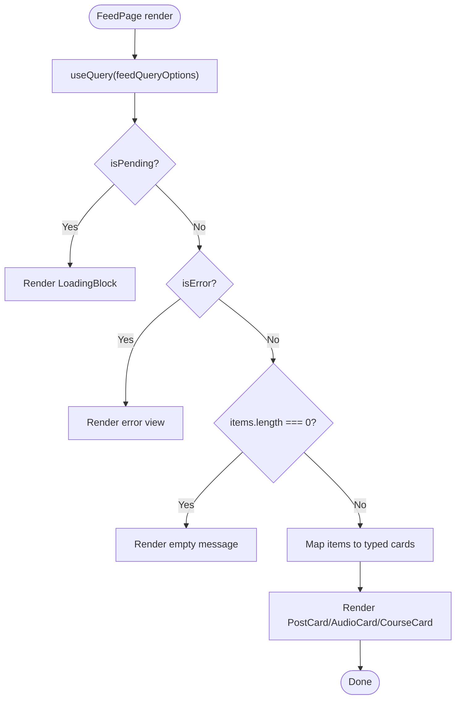
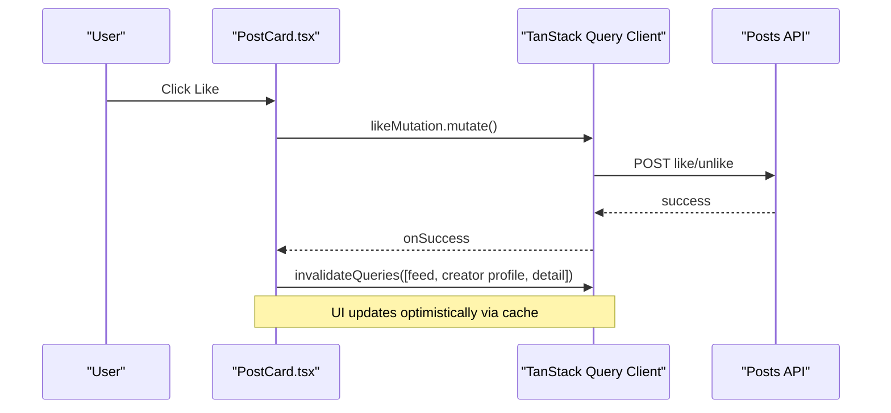
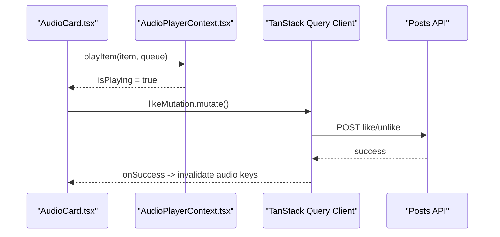
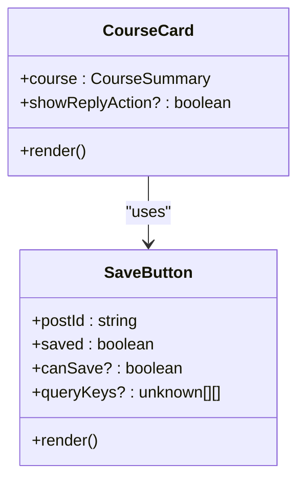
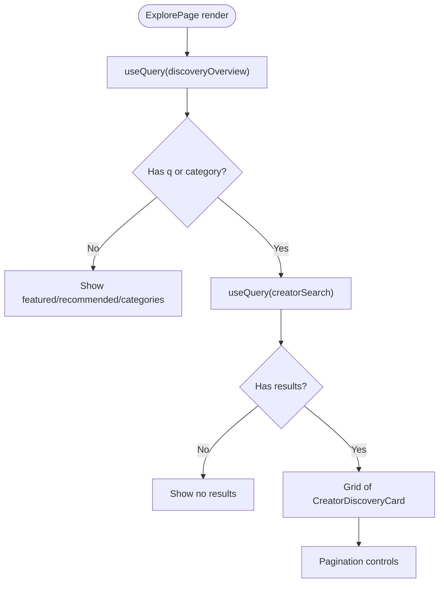
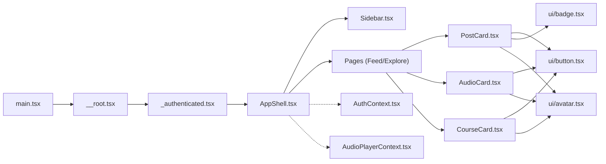

# Component Architecture

<cite>
**Referenced Files in This Document**
- [main.tsx](file://src/react-app/main.tsx)
- [__root.tsx](file://src/react-app/routes/__root.tsx)
- [_authenticated.tsx](file://src/react-app/routes/_authenticated.tsx)
- [AppShell.tsx](file://src/react-app/components/AppShell.tsx)
- [Sidebar.tsx](file://src/react-app/components/Sidebar.tsx)
- [AuthContext.tsx](file://src/react-app/context/AuthContext.tsx)
- [AudioPlayerContext.tsx](file://src/react-app/context/AudioPlayerContext.tsx)
- [FeedPage.tsx](file://src/react-app/pages/FeedPage.tsx)
- [ExplorePage.tsx](file://src/react-app/pages/ExplorePage.tsx)
- [PostCard.tsx](file://src/react-app/components/PostCard.tsx)
- [AudioCard.tsx](file://src/react-app/components/AudioCard.tsx)
- [CourseCard.tsx](file://src/react-app/components/CourseCard.tsx)
- [SaveButton.tsx](file://src/react-app/components/SaveButton.tsx)
- [button.tsx](file://src/react-app/components/ui/button.tsx)
- [card.tsx](file://src/react-app/components/ui/card.tsx)
- [avatar.tsx](file://src/react-app/components/ui/avatar.tsx)
</cite>

## Table of Contents
1. [Introduction](#introduction)
2. [Project Structure](#project-structure)
3. [Core Components](#core-components)
4. [Architecture Overview](#architecture-overview)
5. [Detailed Component Analysis](#detailed-component-analysis)
6. [Dependency Analysis](#dependency-analysis)
7. [Performance Considerations](#performance-considerations)
8. [Troubleshooting Guide](#troubleshooting-guide)
9. [Conclusion](#conclusion)
10. [Appendices](#appendices)

## Introduction
This document explains the React component architecture from the application shell down to reusable UI primitives. It covers how pages are separated from reusable components, how feature domains (posts, audio, photography, courses) are composed, and how state is managed via contexts and TanStack Query. It also outlines testing strategies and accessibility considerations used across the codebase.

## Project Structure
The application follows a clear separation:
- Entry and providers: main.tsx bootstraps providers (theme, query client, auth, audio player) and mounts the router.
- Routes: __root.tsx defines the root outlet; _authenticated.tsx enforces authentication and renders AppShell as the authenticated layout.
- Shell and navigation: AppShell provides the global layout with Sidebar and mobile sheet navigation.
- Pages: FeedPage and ExplorePage orchestrate data fetching and compose feature cards.
- Feature components: PostCard, AudioCard, CourseCard encapsulate domain-specific rendering and interactions.
- Shared UI: shadcn/ui primitives (button, card, avatar, etc.) provide accessible, theme-aware building blocks.

**Diagram sources**
- [main.tsx:12-37](file://src/react-app/main.tsx#L12-L37)
- [__root.tsx:10-22](file://src/react-app/routes/__root.tsx#L10-L22)
- [_authenticated.tsx:5-19](file://src/react-app/routes/_authenticated.tsx#L5-L19)
- [AppShell.tsx:16-62](file://src/react-app/components/AppShell.tsx#L16-L62)
- [Sidebar.tsx:36-159](file://src/react-app/components/Sidebar.tsx#L36-L159)
- [FeedPage.tsx:10-59](file://src/react-app/pages/FeedPage.tsx#L10-L59)
- [ExplorePage.tsx:27-172](file://src/react-app/pages/ExplorePage.tsx#L27-L172)

**Section sources**
- [main.tsx:12-37](file://src/react-app/main.tsx#L12-L37)
- [__root.tsx:10-22](file://src/react-app/routes/__root.tsx#L10-L22)
- [_authenticated.tsx:5-19](file://src/react-app/routes/_authenticated.tsx#L5-L19)
- [AppShell.tsx:16-62](file://src/react-app/components/AppShell.tsx#L16-L62)

## Core Components
- AppShell: The authenticated layout that renders Sidebar, a mobile Sheet-triggered navigation, and an Outlet for page content. It guards unauthenticated access by redirecting to login when needed.
- Sidebar: Role-based navigation with user avatar, links, badges (e.g., unread notifications), logout, and theme switcher. Uses router state for active link styling.
- AuthContext: Provides current user, loading state, OTP sign-in, logout, and refresh. Integrates with TanStack Query cache keys for auth state.
- AudioPlayerContext: Manages playback queue, play/pause, seek, volume, and dynamic theming based on cover art colors. Renders a persistent mini-player bar.

Key prop interfaces and responsibilities:
- AppShell props: none (layout orchestrator).
- Sidebar props: className, onNavigate callback for closing mobile sheet.
- SaveButton props: postId, saved, canSave, queryKeys, className.
- PostCard props: post, showReplyAction.
- AudioCard props: item, queue, showReplyAction.
- CourseCard props: course, showReplyAction.

State management patterns:
- Global app state via Contexts (Auth, Audio Player).
- Server state via TanStack Query (queries and mutations).
- Local UI state within components (e.g., displayedSaved in SaveButton).

Accessibility highlights:
- Buttons and inputs include aria-labels and semantic roles.
- Sheet headers use sr-only titles/descriptions for screen readers.
- Icons use aria-hidden where appropriate.

**Section sources**
- [AppShell.tsx:16-62](file://src/react-app/components/AppShell.tsx#L16-L62)
- [Sidebar.tsx:24-159](file://src/react-app/components/Sidebar.tsx#L24-L159)
- [AuthContext.tsx:13-89](file://src/react-app/context/AuthContext.tsx#L13-L89)
- [AudioPlayerContext.tsx:9-133](file://src/react-app/context/AudioPlayerContext.tsx#L9-L133)
- [SaveButton.tsx:10-81](file://src/react-app/components/SaveButton.tsx#L10-L81)
- [PostCard.tsx:13-182](file://src/react-app/components/PostCard.tsx#L13-L182)
- [AudioCard.tsx:15-167](file://src/react-app/components/AudioCard.tsx#L15-L167)
- [CourseCard.tsx:14-102](file://src/react-app/components/CourseCard.tsx#L14-L102)

## Architecture Overview
The runtime composition starts at main.tsx, which sets up providers and the router. The root route wraps the app with global elements like Toaster and devtools. The authenticated route ensures a logged-in user before rendering AppShell, which composes Sidebar and page content via Outlet.

**Diagram sources**
- [main.tsx:12-37](file://src/react-app/main.tsx#L12-L37)
- [__root.tsx:10-22](file://src/react-app/routes/__root.tsx#L10-L22)
- [_authenticated.tsx:5-19](file://src/react-app/routes/_authenticated.tsx#L5-L19)
- [AppShell.tsx:16-62](file://src/react-app/components/AppShell.tsx#L16-L62)
- [FeedPage.tsx:10-59](file://src/react-app/pages/FeedPage.tsx#L10-L59)

## Detailed Component Analysis

### AppShell and Navigation Flow
AppShell composes the global layout and handles mobile navigation using a Sheet. It redirects unauthenticated users to login. Sidebar renders role-based navigation and integrates with AuthContext for user info and logout.

**Diagram sources**
- [AppShell.tsx:16-62](file://src/react-app/components/AppShell.tsx#L16-L62)
- [Sidebar.tsx:24-159](file://src/react-app/components/Sidebar.tsx#L24-L159)
- [AuthContext.tsx:13-89](file://src/react-app/context/AuthContext.tsx#L13-L89)

**Section sources**
- [AppShell.tsx:16-62](file://src/react-app/components/AppShell.tsx#L16-L62)
- [Sidebar.tsx:24-159](file://src/react-app/components/Sidebar.tsx#L24-L159)
- [_authenticated.tsx:5-19](file://src/react-app/routes/_authenticated.tsx#L5-L19)

### Feed Composition Pattern
FeedPage queries the feed and conditionally renders PostCard, AudioCard, or CourseCard based on item type. It demonstrates a polymorphic composition pattern driven by server-provided types.

**Diagram sources**
- [FeedPage.tsx:10-59](file://src/react-app/pages/FeedPage.tsx#L10-L59)

**Section sources**
- [FeedPage.tsx:10-59](file://src/react-app/pages/FeedPage.tsx#L10-L59)

### PostCard: Interactions and State
PostCard handles likes and poll voting via TanStack Query mutations, invalidating relevant caches to keep UI consistent. It composes Avatar, Badge, Button, ReportDialog, and SaveButton.

**Diagram sources**
- [PostCard.tsx:28-53](file://src/react-app/components/PostCard.tsx#L28-L53)

**Section sources**
- [PostCard.tsx:13-182](file://src/react-app/components/PostCard.tsx#L13-L182)

### AudioCard: Playback Integration
AudioCard integrates with AudioPlayerContext to start playback and update the global queue. It displays metadata, duration, and actions similar to PostCard but tailored for audio items.

**Diagram sources**
- [AudioCard.tsx:33-43](file://src/react-app/components/AudioCard.tsx#L33-L43)
- [AudioPlayerContext.tsx:135-168](file://src/react-app/context/AudioPlayerContext.tsx#L135-L168)

**Section sources**
- [AudioCard.tsx:15-167](file://src/react-app/components/AudioCard.tsx#L15-L167)
- [AudioPlayerContext.tsx:135-168](file://src/react-app/context/AudioPlayerContext.tsx#L135-L168)

### CourseCard: Access Control and Metadata
CourseCard shows lesson counts, access lock indicators, and composes SaveButton with conditional canSave logic based on access and ownership.

**Diagram sources**
- [CourseCard.tsx:14-102](file://src/react-app/components/CourseCard.tsx#L14-L102)
- [SaveButton.tsx:10-81](file://src/react-app/components/SaveButton.tsx#L10-L81)

**Section sources**
- [CourseCard.tsx:14-102](file://src/react-app/components/CourseCard.tsx#L14-L102)
- [SaveButton.tsx:10-81](file://src/react-app/components/SaveButton.tsx#L10-L81)

### ExplorePage: Discovery and Search
ExplorePage manages search state, sorts, pagination, and category browsing. It uses TanStack Query for overview and search results, and includes an interest prompt to personalize recommendations.

**Diagram sources**
- [ExplorePage.tsx:27-172](file://src/react-app/pages/ExplorePage.tsx#L27-L172)

**Section sources**
- [ExplorePage.tsx:27-172](file://src/react-app/pages/ExplorePage.tsx#L27-L172)

### UI Primitives: shadcn/ui
Reusable primitives follow a consistent pattern:
- button.tsx: variant and size variants via class-variance-authority, supports asChild composition.
- card.tsx: structured CardHeader/CardTitle/CardDescription/CardContent/CardFooter with responsive sizing.
- avatar.tsx: Avatar/Image/Fallback and group utilities built on Radix primitives.

These components emphasize accessibility, theme variables, and consistent data-slot attributes for testing and styling.

**Section sources**
- [button.tsx:1-66](file://src/react-app/components/ui/button.tsx#L1-L66)
- [card.tsx:1-101](file://src/react-app/components/ui/card.tsx#L1-L101)
- [avatar.tsx:1-111](file://src/react-app/components/ui/avatar.tsx#L1-L111)

## Dependency Analysis
High-level dependencies:
- main.tsx depends on providers and router configuration.
- Routes depend on context providers and query client.
- AppShell depends on Sidebar and AuthContext.
- Pages depend on feature libraries (posts, audio, courses) and compose feature cards.
- Feature cards depend on UI primitives and shared components (SaveButton, ReportDialog).

**Diagram sources**
- [main.tsx:12-37](file://src/react-app/main.tsx#L12-L37)
- [__root.tsx:10-22](file://src/react-app/routes/__root.tsx#L10-L22)
- [_authenticated.tsx:5-19](file://src/react-app/routes/_authenticated.tsx#L5-L19)
- [AppShell.tsx:16-62](file://src/react-app/components/AppShell.tsx#L16-L62)
- [Sidebar.tsx:24-159](file://src/react-app/components/Sidebar.tsx#L24-L159)
- [FeedPage.tsx:10-59](file://src/react-app/pages/FeedPage.tsx#L10-L59)
- [PostCard.tsx:13-182](file://src/react-app/components/PostCard.tsx#L13-L182)
- [AudioCard.tsx:15-167](file://src/react-app/components/AudioCard.tsx#L15-L167)
- [CourseCard.tsx:14-102](file://src/react-app/components/CourseCard.tsx#L14-L102)
- [button.tsx:1-66](file://src/react-app/components/ui/button.tsx#L1-L66)
- [avatar.tsx:1-111](file://src/react-app/components/ui/avatar.tsx#L1-L111)

**Section sources**
- [main.tsx:12-37](file://src/react-app/main.tsx#L12-L37)
- [__root.tsx:10-22](file://src/react-app/routes/__root.tsx#L10-L22)
- [_authenticated.tsx:5-19](file://src/react-app/routes/_authenticated.tsx#L5-L19)
- [AppShell.tsx:16-62](file://src/react-app/components/AppShell.tsx#L16-L62)
- [Sidebar.tsx:24-159](file://src/react-app/components/Sidebar.tsx#L24-L159)
- [FeedPage.tsx:10-59](file://src/react-app/pages/FeedPage.tsx#L10-L59)
- [PostCard.tsx:13-182](file://src/react-app/components/PostCard.tsx#L13-L182)
- [AudioCard.tsx:15-167](file://src/react-app/components/AudioCard.tsx#L15-L167)
- [CourseCard.tsx:14-102](file://src/react-app/components/CourseCard.tsx#L14-L102)
- [button.tsx:1-66](file://src/react-app/components/ui/button.tsx#L1-L66)
- [avatar.tsx:1-111](file://src/react-app/components/ui/avatar.tsx#L1-L111)

## Performance Considerations
- Prefer TanStack Query for server state to avoid unnecessary re-renders and to leverage caching and background updates.
- Use memoization (e.g., useMemo/useCallback) in contexts like AudioPlayerContext to prevent redundant computations.
- Avoid heavy work in render paths; defer expensive operations to effects or callbacks.
- Keep lists keyed by stable IDs to optimize reconciliation.
- Lazy-load images and media where possible to reduce initial payload.

[No sources needed since this section provides general guidance]

## Troubleshooting Guide
Common issues and resolutions:
- Unauthenticated redirects: Ensure the authenticated route’s beforeLoad resolves auth data and redirects correctly.
- Stale UI after mutations: Invalidate the correct query keys in mutation onSuccess handlers to refresh related views.
- Audio playback not starting: Verify streamUrl availability and browser autoplay policies; check isPlaying state transitions.
- Toast errors: Inspect onError handlers in mutations for meaningful messages and ensure network errors are handled gracefully.

**Section sources**
- [_authenticated.tsx:5-19](file://src/react-app/routes/_authenticated.tsx#L5-L19)
- [PostCard.tsx:28-53](file://src/react-app/components/PostCard.tsx#L28-L53)
- [AudioPlayerContext.tsx:197-233](file://src/react-app/context/AudioPlayerContext.tsx#L197-L233)

## Conclusion
The architecture cleanly separates concerns: routes handle navigation and guards, AppShell provides layout and global navigation, pages orchestrate data and compose feature cards, and shadcn/ui primitives offer accessible, themeable building blocks. State is centralized through contexts for global concerns and TanStack Query for server state, enabling predictable updates and efficient caching.

[No sources needed since this section summarizes without analyzing specific files]

## Appendices

### Testing Strategies
- Unit tests for components:
  - Render components with required props and assert DOM structure.
  - Mock TanStack Query hooks to control query/mutation states.
  - Simulate user interactions (clicks) and verify side effects (toast, navigation).
- Example test files present in the repository indicate coverage for components such as AppShell, Sidebar, PostCard, SaveButton, ReportDialog, ScheduleDialog, ShortPostComposer, and various pages.

**Section sources**
- [AppShell.test.tsx](file://src/react-app/components/AppShell.test.tsx)
- [Sidebar.test.tsx](file://src/react-app/components/Sidebar.test.tsx)
- [PostCard.test.tsx](file://src/react-app/components/PostCard.test.tsx)
- [SaveButton.test.tsx](file://src/react-app/components/SaveButton.test.tsx)
- [ReportDialog.test.tsx](file://src/react-app/components/ReportDialog.test.tsx)
- [ScheduleDialog.test.tsx](file://src/react-app/components/ScheduleDialog.test.tsx)
- [ShortPostComposer.test.tsx](file://src/react-app/components/ShortPostComposer.test.tsx)
- [AdminPage.test.tsx](file://src/react-app/pages/AdminPage.test.tsx)
- [ExplorePage.test.tsx](file://src/react-app/pages/ExplorePage.test.tsx)
- [LibraryPage.test.tsx](file://src/react-app/pages/LibraryPage.test.tsx)
- [NotificationsPage.test.tsx](file://src/react-app/pages/NotificationsPage.test.tsx)
- [PhotographyAlbumPage.test.tsx](file://src/react-app/pages/PhotographyAlbumPage.test.tsx)
- [PostDetailPage.test.tsx](file://src/react-app/pages/PostDetailPage.test.tsx)
- [ProfilePage.test.tsx](file://src/react-app/pages/ProfilePage.test.tsx)
- [SettingsPage.test.tsx](file://src/react-app/pages/SettingsPage.test.tsx)
- [StudioPage.test.tsx](file://src/react-app/pages/StudioPage.test.tsx)
- [StudioScheduledPage.test.tsx](file://src/react-app/pages/StudioScheduledPage.test.tsx)
- [SubscriptionsPage.test.tsx](file://src/react-app/pages/SubscriptionsPage.test.tsx)
- [AuthPages.test.tsx](file://src/react-app/pages/AuthPages.test.tsx)
- [BecomeCreatorPage.test.tsx](file://src/react-app/pages/BecomeCreatorPage.test.tsx)
- [input-otp.test.tsx](file://src/react-app/components/ui/input-otp.test.tsx)
- [test-setup.ts](file://src/react-app/test-setup.ts)

### Accessibility Considerations
- Use semantic HTML elements (article, nav, header, main) and proper heading hierarchy.
- Provide descriptive aria-labels for interactive elements (buttons, sliders, icons).
- Ensure focus management in dialogs and sheets; use sr-only text for hidden labels.
- Maintain color contrast and keyboard navigability for all interactive components.
- Leverage shadcn/ui primitives that are built on accessible Radix primitives.

[No sources needed since this section provides general guidance]