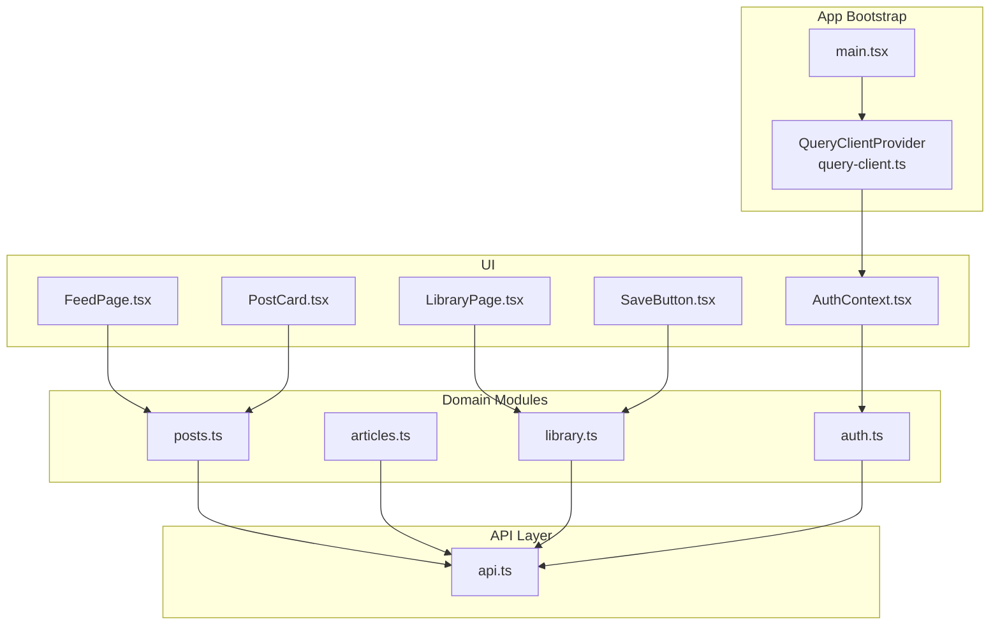
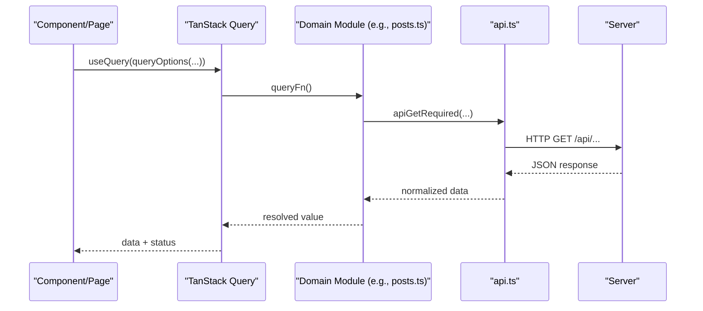
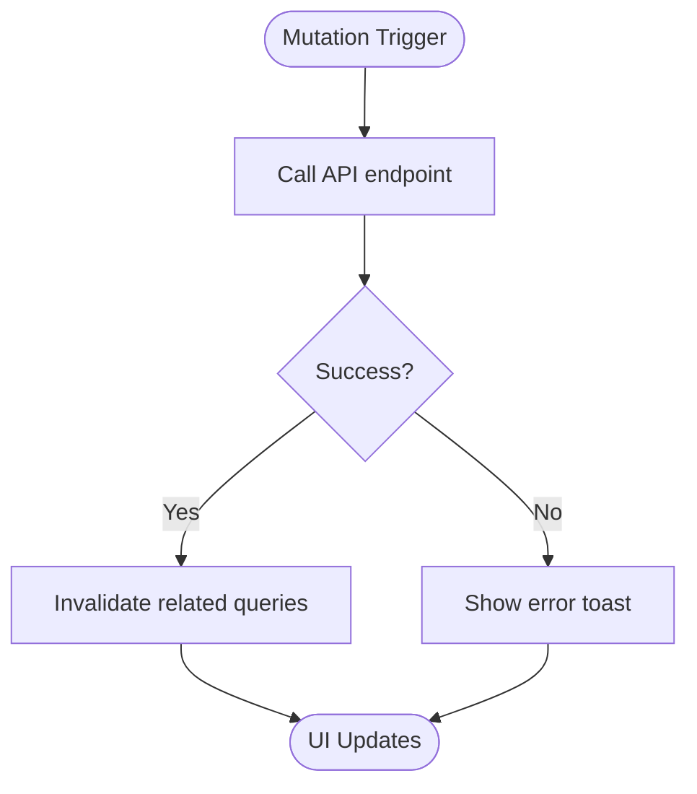
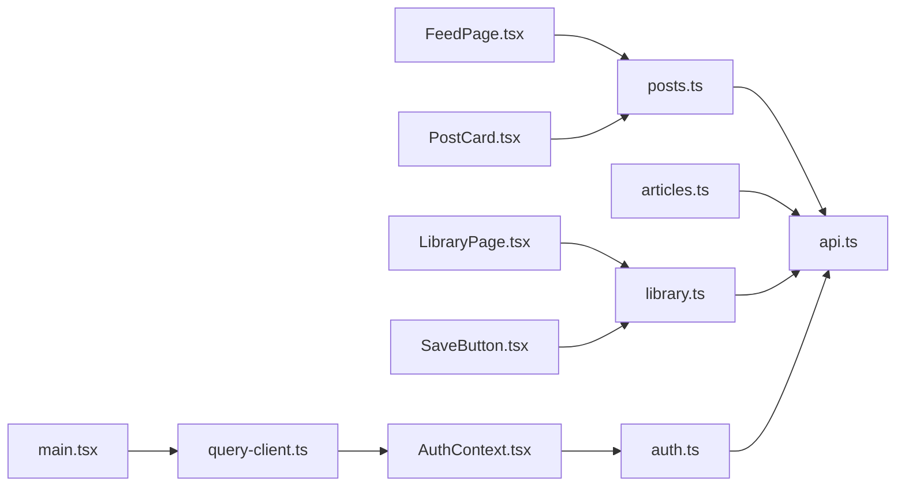

# Data Fetching and Caching

<cite>
**Referenced Files in This Document**
- [main.tsx](file://src/react-app/main.tsx)
- [query-client.ts](file://src/react-app/lib/query-client.ts)
- [api.ts](file://src/react-app/lib/api.ts)
- [auth.ts](file://src/react-app/lib/auth.ts)
- [AuthContext.tsx](file://src/react-app/context/AuthContext.tsx)
- [posts.ts](file://src/react-app/lib/posts.ts)
- [articles.ts](file://src/react-app/lib/articles.ts)
- [library.ts](file://src/react-app/lib/library.ts)
- [FeedPage.tsx](file://src/react-app/pages/FeedPage.tsx)
- [LibraryPage.tsx](file://src/react-app/pages/LibraryPage.tsx)
- [PostCard.tsx](file://src/react-app/components/PostCard.tsx)
- [SaveButton.tsx](file://src/react-app/components/SaveButton.tsx)
</cite>

## Table of Contents
1. Introduction
2. Project Structure
3. Core Components
4. Architecture Overview
5. Detailed Component Analysis
6. Dependency Analysis
7. Performance Considerations
8. Troubleshooting Guide
9. Conclusion

## Introduction
This document explains the data fetching architecture built with TanStack Query across the application. It covers query client configuration, cache strategies, background synchronization patterns, the API client abstraction layer, error handling, authentication integration for protected endpoints, mutations, optimistic updates, pagination patterns, cache invalidation, stale data handling, and performance optimization techniques for large datasets.

## Project Structure
The data-fetching stack is organized into:
- Query client setup and provider wiring at the app root
- A typed API client that normalizes responses and errors
- Feature-specific modules that define query keys and options
- Pages and components that consume queries and mutations
- An authentication context that manages user state and clears caches on auth events

**Diagram sources**
- [main.tsx:1-38](file://src/react-app/main.tsx#L1-L38)
- [query-client.ts:1-14](file://src/react-app/lib/query-client.ts#L1-L14)
- [api.ts:1-164](file://src/react-app/lib/api.ts#L1-L164)
- [auth.ts:1-55](file://src/react-app/lib/auth.ts#L1-L55)
- [posts.ts:1-160](file://src/react-app/lib/posts.ts#L1-L160)
- [articles.ts:1-71](file://src/react-app/lib/articles.ts#L1-L71)
- [library.ts:1-70](file://src/react-app/lib/library.ts#L1-L70)
- [FeedPage.tsx:1-60](file://src/react-app/pages/FeedPage.tsx#L1-L60)
- [LibraryPage.tsx:1-157](file://src/react-app/pages/LibraryPage.tsx#L1-L157)
- [PostCard.tsx:1-182](file://src/react-app/components/PostCard.tsx#L1-L182)
- [SaveButton.tsx:1-81](file://src/react-app/components/SaveButton.tsx#L1-L81)
- [AuthContext.tsx:1-90](file://src/react-app/context/AuthContext.tsx#L1-L90)

**Section sources**
- [main.tsx:1-38](file://src/react-app/main.tsx#L1-L38)
- [query-client.ts:1-14](file://src/react-app/lib/query-client.ts#L1-L14)

## Core Components
- Query Client: Centralized configuration for retries and refetch behavior.
- API Client: Typed fetch wrapper with normalized responses and custom error types.
- Domain Modules: Encapsulate query keys, query functions, and mutation helpers per feature.
- UI Consumers: Pages and components use TanStack Query hooks to render data and handle mutations.
- Authentication Context: Manages current user via a query, handles OTP sign-in, logout, and global auth event listeners.

Key responsibilities:
- Configure default retry and focus-based refetch behavior globally.
- Normalize server errors and network failures consistently.
- Provide stable query keys for precise invalidation and caching.
- Use optimistic updates where appropriate to improve perceived performance.
- Invalidate related queries after mutations to keep UI consistent.

**Section sources**
- [query-client.ts:1-14](file://src/react-app/lib/query-client.ts#L1-L14)
- [api.ts:1-164](file://src/react-app/lib/api.ts#L1-L164)
- [auth.ts:1-55](file://src/react-app/lib/auth.ts#L1-L55)
- [posts.ts:1-160](file://src/react-app/lib/posts.ts#L1-L160)
- [articles.ts:1-71](file://src/react-app/lib/articles.ts#L1-L71)
- [library.ts:1-70](file://src/react-app/lib/library.ts#L1-L70)
- [AuthContext.tsx:1-90](file://src/react-app/context/AuthContext.tsx#L1-L90)

## Architecture Overview
The application uses TanStack Query as the single source of truth for server state. Queries are defined in domain modules using queryOptions and consumed by pages/components. Mutations update server state and invalidate relevant queries. The API client abstracts HTTP calls and centralizes error normalization. Authentication integrates with the query cache to reflect login/logout states and respond to unauthorized or account-suspended events.

**Diagram sources**
- [FeedPage.tsx:1-60](file://src/react-app/pages/FeedPage.tsx#L1-L60)
- [posts.ts:1-160](file://src/react-app/lib/posts.ts#L1-L160)
- [api.ts:1-164](file://src/react-app/lib/api.ts#L1-L164)

## Detailed Component Analysis

### Query Client Configuration
- Global defaults disable automatic retries and window-focus refetches to avoid noisy revalidation and to rely on explicit invalidation.
- The client is provided at the app root via QueryClientProvider and shared through router context.

Implications:
- Predictable behavior under network flakiness; developers must explicitly trigger refetches when needed.
- Reduced background traffic unless invalidated by mutations or navigation.

**Section sources**
- [query-client.ts:1-14](file://src/react-app/lib/query-client.ts#L1-L14)
- [main.tsx:1-38](file://src/react-app/main.tsx#L1-L38)

### API Client Abstraction and Error Handling
- Provides typed methods for GET/POST/PUT/PATCH/DELETE and required variants that throw a structured ApiError.
- Normalizes heterogeneous server error payloads into a consistent shape.
- Emits global events for specific statuses (e.g., unauthorized, account-suspended) to centralize auth state cleanup.

Error strategy:
- Network errors return a standardized response object; required variants convert them into exceptions.
- Non-JSON responses fall back to text-based error messages.
- Consumers can catch ApiError and inspect status, code, and details.

**Section sources**
- [api.ts:1-164](file://src/react-app/lib/api.ts#L1-L164)

### Authentication Integration and Protected Endpoints
- Current user is fetched via a dedicated query option with a stable key.
- OTP sign-in flow sets the user directly into the cache upon success.
- Logout clears the user and removes related queries (feed, profile).
- Global event listeners clear user state on unauthorized or account-suspended signals.

Token refresh pattern:
- Uses session cookies via credentials: include; no token refresh logic is implemented here.
- Unauthorized responses trigger cache cleanup rather than automatic token refresh.

**Section sources**
- [auth.ts:1-55](file://src/react-app/lib/auth.ts#L1-L55)
- [AuthContext.tsx:1-90](file://src/react-app/context/AuthContext.tsx#L1-L90)
- [api.ts:1-164](file://src/react-app/lib/api.ts#L1-L164)

### Query Patterns and Cache Keys
- Each feature defines a keys namespace and returns queryOptions with deterministic queryKeys.
- Examples:
  - Feed: ['feed']
  - Post detail: ['posts', username, slug]
  - Replies: ['posts', postId, 'replies']
  - Library list: ['library', { page, type, sort, query }]

Benefits:
- Precise invalidation and coalescing of identical requests.
- Easy to scope cache updates to affected areas.

**Section sources**
- [posts.ts:1-160](file://src/react-app/lib/posts.ts#L1-L160)
- [articles.ts:1-71](file://src/react-app/lib/articles.ts#L1-L71)
- [library.ts:1-70](file://src/react-app/lib/library.ts#L1-L70)

### Background Synchronization and Stale Data Handling
- Default settings disable refetchOnWindowFocus; staleTime is not set globally but can be configured per query.
- For library listing, placeholderData keeps previous data while new pages load, improving perceived responsiveness.

Recommendations:
- Set staleTime for frequently accessed, slowly changing data to reduce refetches.
- Use gcTime to control cache eviction for large datasets.

**Section sources**
- [query-client.ts:1-14](file://src/react-app/lib/query-client.ts#L1-L14)
- [library.ts:1-70](file://src/react-app/lib/library.ts#L1-L70)

### Mutations and Cache Invalidation
- Mutations call API methods and then invalidate related queries to ensure consistency.
- Typical invalidation targets include feed, creator profiles, and post details.

Example flows:
- Like/unlike a post invalidates feed, creator profile, and post detail.
- Voting in a poll invalidates the same scopes.
- Saving/removing from library invalidates library lists and related views.

**Diagram sources**
- [PostCard.tsx:1-182](file://src/react-app/components/PostCard.tsx#L1-L182)
- [SaveButton.tsx:1-81](file://src/react-app/components/SaveButton.tsx#L1-L81)

**Section sources**
- [PostCard.tsx:1-182](file://src/react-app/components/PostCard.tsx#L1-L182)
- [SaveButton.tsx:1-81](file://src/react-app/components/SaveButton.tsx#L1-L81)

### Optimistic Updates
- SaveButton demonstrates local optimistic state: toggling the bookmark icon immediately before the server responds.
- On success, it persists the change and invalidates relevant queries.
- On failure, it rolls back to the previous saved state and shows an error.

Best practices:
- Keep optimistic state minimal and reversible.
- Always invalidate or refetch dependent queries to reconcile with server state.

**Section sources**
- [SaveButton.tsx:1-81](file://src/react-app/components/SaveButton.tsx#L1-L81)

### Pagination Patterns
- LibraryPage implements server-side pagination with page, pageSize, type, sort, and optional query parameters.
- Uses keepPreviousData to maintain UI continuity during page transitions.
- Navigation controls disable while fetching to prevent race conditions.

Optimization tips:
- Debounce search input to reduce request frequency.
- Consider infinite queries for append-style feeds; for server-paged lists, keepPreviousData is effective.

**Section sources**
- [library.ts:1-70](file://src/react-app/lib/library.ts#L1-L70)
- [LibraryPage.tsx:1-157](file://src/react-app/pages/LibraryPage.tsx#L1-L157)

### Example: Feed Page Data Flow
- FeedPage consumes feedQueryOptions which calls the feed endpoint.
- Renders different card types based on item.type.
- Handles pending and error states gracefully.

**Section sources**
- [FeedPage.tsx:1-60](file://src/react-app/pages/FeedPage.tsx#L1-L60)
- [posts.ts:1-160](file://src/react-app/lib/posts.ts#L1-L160)

## Dependency Analysis
The following diagram maps how modules depend on each other for data fetching and caching.

**Diagram sources**
- [main.tsx:1-38](file://src/react-app/main.tsx#L1-L38)
- [query-client.ts:1-14](file://src/react-app/lib/query-client.ts#L1-L14)
- [AuthContext.tsx:1-90](file://src/react-app/context/AuthContext.tsx#L1-L90)
- [auth.ts:1-55](file://src/react-app/lib/auth.ts#L1-L55)
- [FeedPage.tsx:1-60](file://src/react-app/pages/FeedPage.tsx#L1-L60)
- [posts.ts:1-160](file://src/react-app/lib/posts.ts#L1-L160)
- [articles.ts:1-71](file://src/react-app/lib/articles.ts#L1-L71)
- [library.ts:1-70](file://src/react-app/lib/library.ts#L1-L70)
- [LibraryPage.tsx:1-157](file://src/react-app/pages/LibraryPage.tsx#L1-L157)
- [PostCard.tsx:1-182](file://src/react-app/components/PostCard.tsx#L1-L182)
- [SaveButton.tsx:1-81](file://src/react-app/components/SaveButton.tsx#L1-L81)
- [api.ts:1-164](file://src/react-app/lib/api.ts#L1-L164)

**Section sources**
- [api.ts:1-164](file://src/react-app/lib/api.ts#L1-L164)
- [posts.ts:1-160](file://src/react-app/lib/posts.ts#L1-L160)
- [library.ts:1-70](file://src/react-app/lib/library.ts#L1-L70)
- [auth.ts:1-55](file://src/react-app/lib/auth.ts#L1-L55)

## Performance Considerations
- Disable unnecessary refetches: Global refetchOnWindowFocus is off; consider enabling selectively for critical queries.
- Tune staleTime and gcTime:
  - Increase staleTime for rarely changing data to reduce network usage.
  - Lower gcTime for large datasets to free memory when unused.
- Use keepPreviousData for paginated lists to avoid flicker and preserve scroll position.
- Prefer queryOptions factories to reuse configurations and ensure consistent keys.
- Avoid over-invalidation: Invalidate only the necessary query keys to minimize re-renders.
- Debounce inputs: Search fields should debounce to limit request bursts.
- Coalesce requests: TanStack Query automatically coalesces identical concurrent requests; leverage this by sharing queryKeys.

[No sources needed since this section provides general guidance]

## Troubleshooting Guide
Common issues and resolutions:
- Unexpected 401 responses:
  - The API emits an unauthorized event; ensure global listeners clear user state and redirect appropriately.
- Account suspended:
  - The API emits an account-suspended event; clear cached user data and prompt re-authentication.
- Mutation errors:
  - Catch ApiError and display user-friendly messages; ensure rollback of optimistic state on failure.
- Stale UI after mutations:
  - Verify that all related query keys are invalidated; check for missing dependencies in invalidation arrays.
- Excessive network calls:
  - Review retry and refetch policies; ensure queryKeys are unique and stable.

**Section sources**
- [api.ts:1-164](file://src/react-app/lib/api.ts#L1-L164)
- [AuthContext.tsx:1-90](file://src/react-app/context/AuthContext.tsx#L1-L90)
- [PostCard.tsx:1-182](file://src/react-app/components/PostCard.tsx#L1-L182)
- [SaveButton.tsx:1-81](file://src/react-app/components/SaveButton.tsx#L1-L81)

## Conclusion
The application’s data fetching architecture leverages TanStack Query for predictable caching, efficient background synchronization, and clean separation between UI and server state. The API client standardizes error handling and request/response shapes. Authentication integrates seamlessly with the query cache, and mutations employ targeted invalidation and optimistic updates to deliver responsive UX. By tuning cache policies and adopting precise invalidation strategies, the system scales well to large datasets and complex interactions.

[No sources needed since this section summarizes without analyzing specific files]