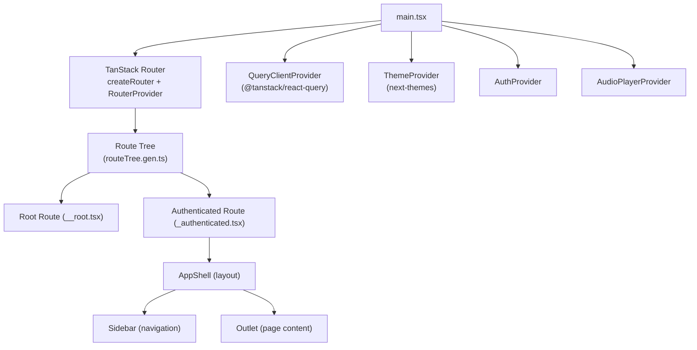
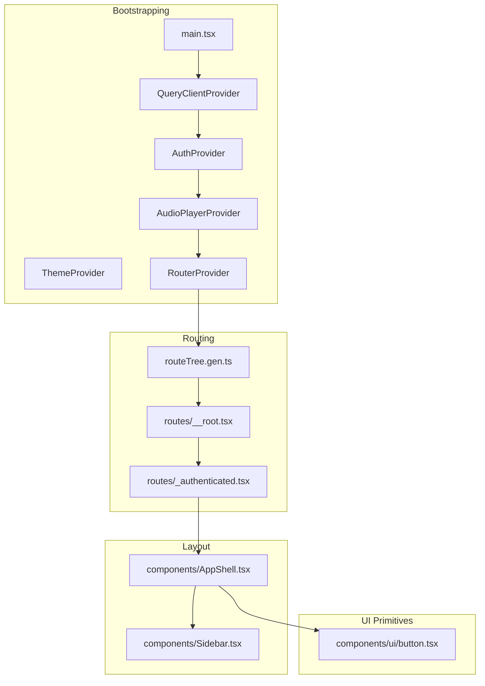
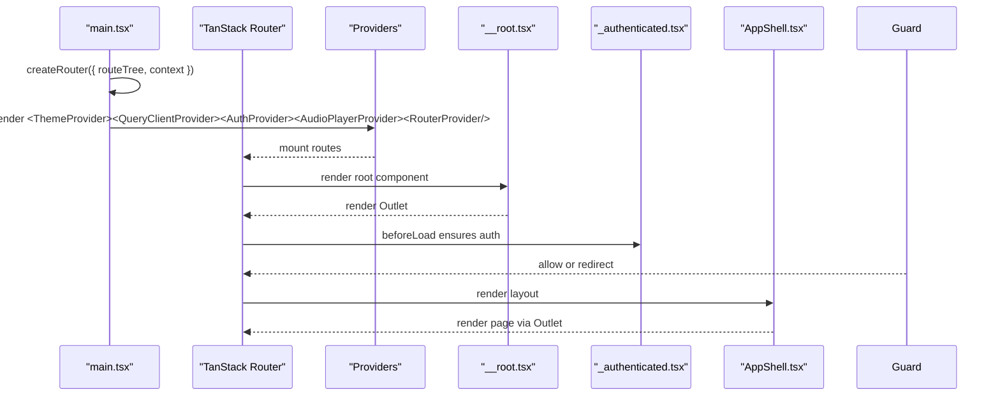
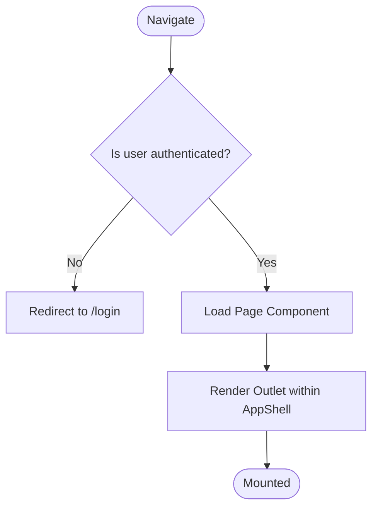
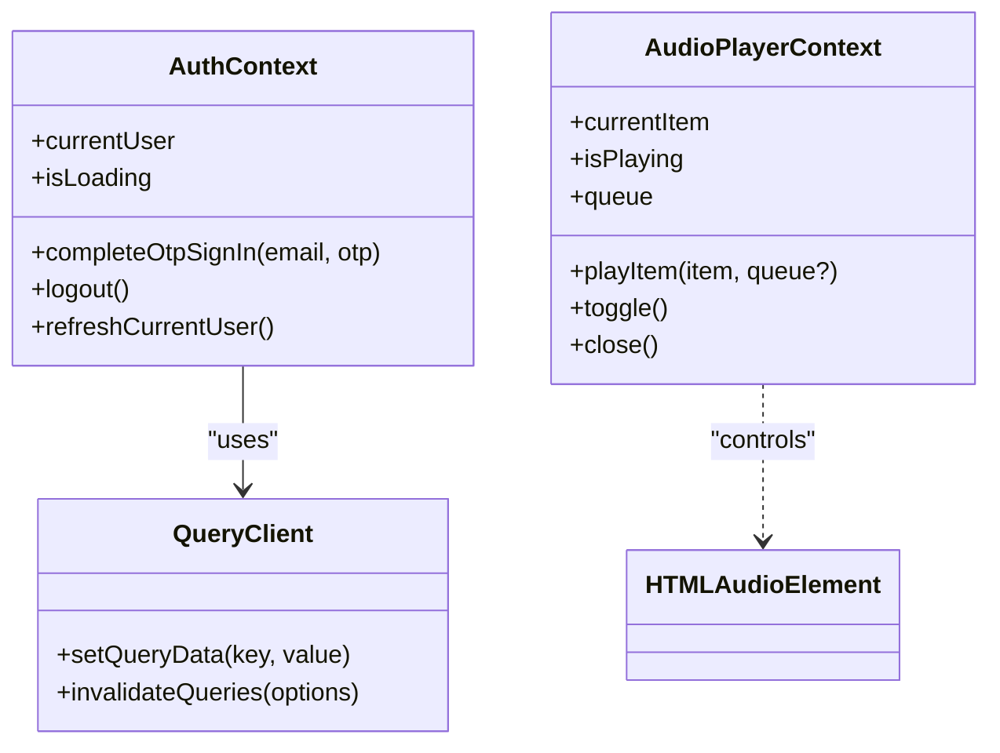
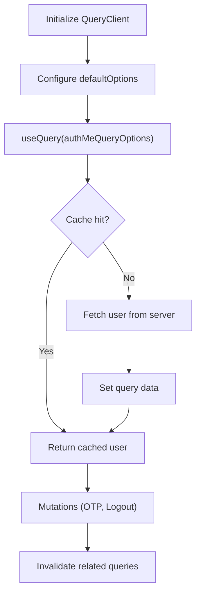
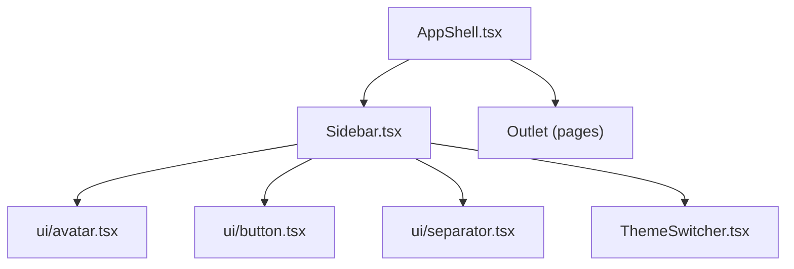
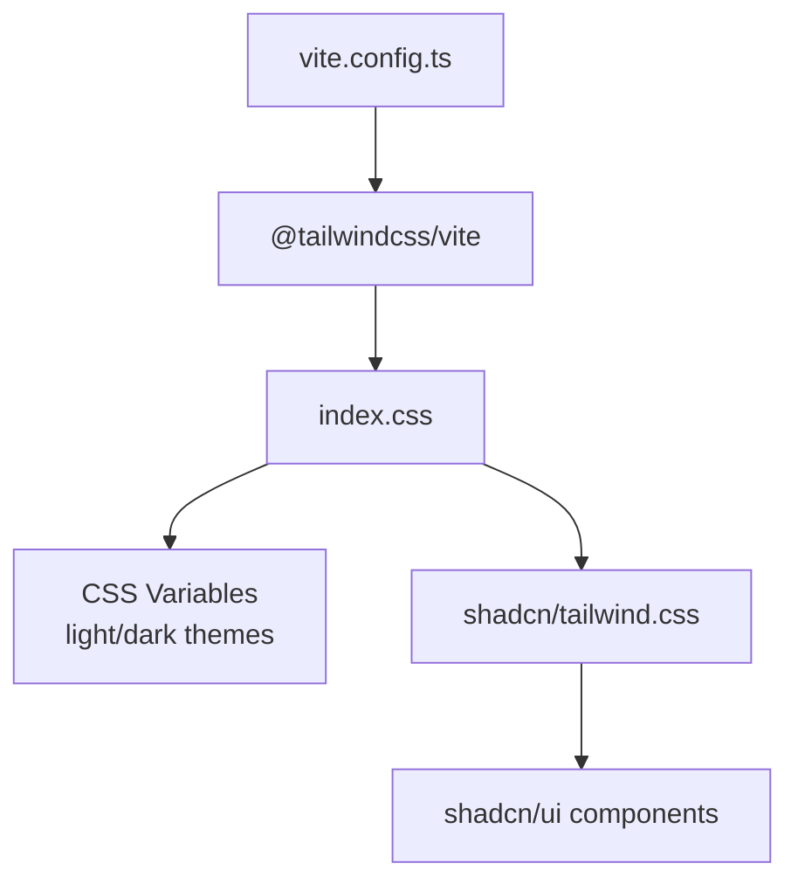
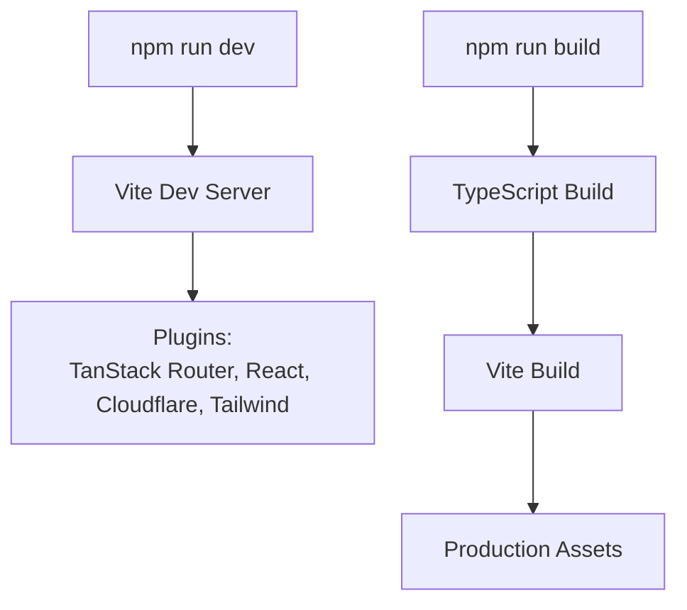
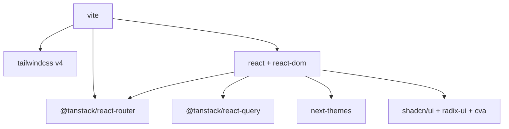

# Frontend Architecture

<cite>
**Referenced Files in This Document**
- [main.tsx](file://src/react-app/main.tsx)
- [vite.config.ts](file://vite.config.ts)
- [package.json](file://package.json)
- [index.css](file://src/react-app/index.css)
- [components.json](file://components.json)
- [routeTree.gen.ts](file://src/react-app/routeTree.gen.ts)
- [__root.tsx](file://src/react-app/routes/__root.tsx)
- [_authenticated.tsx](file://src/react-app/routes/_authenticated.tsx)
- [AppShell.tsx](file://src/react-app/components/AppShell.tsx)
- [Sidebar.tsx](file://src/react-app/components/Sidebar.tsx)
- [AuthContext.tsx](file://src/react-app/context/AuthContext.tsx)
- [AudioPlayerContext.tsx](file://src/react-app/context/AudioPlayerContext.tsx)
- [query-client.ts](file://src/react-app/lib/query-client.ts)
- [button.tsx](file://src/react-app/components/ui/button.tsx)
</cite>

## Table of Contents
1. Introduction
2. Project Structure
3. Core Components
4. Architecture Overview
5. Detailed Component Analysis
6. Dependency Analysis
7. Performance Considerations
8. Troubleshooting Guide
9. Conclusion

## Introduction
This document describes the React 19 frontend architecture for the application. It covers:
- Component-based architecture using functional components and hooks
- File-based routing with TanStack Router and the generated route tree
- State management via React Context providers for authentication and global state
- Data fetching strategy with TanStack Query for server state and caching
- Component hierarchy from AppShell down to shadcn/ui primitives
- Styling approach with Tailwind CSS v4 and custom theme configuration
- Build process with Vite and development workflow patterns

## Project Structure
The frontend lives under src/react-app and is organized by feature areas:
- Entry point and bootstrapping: main.tsx
- Routing: routes/ directory with file-based conventions and a generated route tree
- UI components: components/ including reusable UI primitives under components/ui (shadcn/ui)
- Global state: context/ for Auth and Audio Player
- Data layer: lib/ utilities, API helpers, and TanStack Query client configuration
- Styles: index.css with Tailwind v4 and theme variables

**Diagram sources**
- [main.tsx:12-37](file://src/react-app/main.tsx#L12-L37)
- [routeTree.gen.ts:11-69](file://src/react-app/routeTree.gen.ts#L11-L69)
- [__root.tsx:10-22](file://src/react-app/routes/__root.tsx#L10-L22)
- [_authenticated.tsx:5-19](file://src/react-app/routes/_authenticated.tsx#L5-L19)
- [AppShell.tsx:16-62](file://src/react-app/components/AppShell.tsx#L16-L62)
- [Sidebar.tsx:36-159](file://src/react-app/components/Sidebar.tsx#L36-L159)

**Section sources**
- [main.tsx:1-37](file://src/react-app/main.tsx#L1-L37)
- [vite.config.ts:1-27](file://vite.config.ts#L1-L27)
- [package.json:14-56](file://package.json#L14-L56)

## Core Components
- Application bootstrap:
  - Creates the TanStack Router with the generated route tree and injects the QueryClient into router context
  - Wraps the app with ThemeProvider, QueryClientProvider, AuthProvider, and AudioPlayerProvider
  - Renders RouterProvider to mount routes

- Root route:
  - Defines router context type for QueryClient
  - Renders page Outlet plus Toaster and React Query Devtools

- Authentication guard:
  - Ensures user data exists before allowing access to authenticated routes; redirects to login if not authenticated

- Layout shell:
  - Provides responsive sidebar navigation and mobile sheet menu
  - Enforces redirect to login when no current user is present

- Sidebar:
  - Role-aware navigation items (subscriber vs creator)
  - Displays unread notification badge
  - Integrates logout flow and theme switcher

- Providers:
  - AuthContext: manages current user via TanStack Query, OTP sign-in mutation, logout mutation, and event-driven invalidation
  - AudioPlayerContext: manages audio playback state, queue, seek/volume controls, and dynamic theming based on cover art colors

**Section sources**
- [main.tsx:12-37](file://src/react-app/main.tsx#L12-L37)
- [__root.tsx:10-22](file://src/react-app/routes/__root.tsx#L10-L22)
- [_authenticated.tsx:5-19](file://src/react-app/routes/_authenticated.tsx#L5-L19)
- [AppShell.tsx:16-62](file://src/react-app/components/AppShell.tsx#L16-L62)
- [Sidebar.tsx:36-159](file://src/react-app/components/Sidebar.tsx#L36-L159)
- [AuthContext.tsx:23-89](file://src/react-app/context/AuthContext.tsx#L23-L89)
- [AudioPlayerContext.tsx:135-360](file://src/react-app/context/AudioPlayerContext.tsx#L135-L360)

## Architecture Overview
The application uses a layered architecture:
- Presentation layer: Functional React components and shadcn/ui primitives
- Routing layer: TanStack Router with file-based routes and code splitting
- State layer: React Context for cross-cutting concerns (auth, audio player)
- Data layer: TanStack Query for server state, caching, and mutations
- Styling layer: Tailwind CSS v4 with CSS variables and shadcn theme tokens
- Build layer: Vite with plugins for React, TanStack Router, Cloudflare, and Tailwind

**Diagram sources**
- [main.tsx:12-37](file://src/react-app/main.tsx#L12-L37)
- [routeTree.gen.ts:11-69](file://src/react-app/routeTree.gen.ts#L11-L69)
- [__root.tsx:10-22](file://src/react-app/routes/__root.tsx#L10-L22)
- [_authenticated.tsx:5-19](file://src/react-app/routes/_authenticated.tsx#L5-L19)
- [AppShell.tsx:16-62](file://src/react-app/components/AppShell.tsx#L16-L62)
- [Sidebar.tsx:36-159](file://src/react-app/components/Sidebar.tsx#L36-L159)
- [button.tsx:42-65](file://src/react-app/components/ui/button.tsx#L42-L65)

## Detailed Component Analysis

### Bootstrapping and Providers
- The root entry creates a TanStack Router with the generated route tree and injects the QueryClient into router context
- Providers are nested: ThemeProvider wraps QueryClientProvider, which wraps AuthProvider and AudioPlayerProvider
- RouterProvider mounts the route tree

**Diagram sources**
- [main.tsx:12-37](file://src/react-app/main.tsx#L12-L37)
- [__root.tsx:10-22](file://src/react-app/routes/__root.tsx#L10-L22)
- [_authenticated.tsx:5-19](file://src/react-app/routes/_authenticated.tsx#L5-L19)
- [AppShell.tsx:16-62](file://src/react-app/components/AppShell.tsx#L16-L62)

**Section sources**
- [main.tsx:12-37](file://src/react-app/main.tsx#L12-L37)
- [__root.tsx:10-22](file://src/react-app/routes/__root.tsx#L10-L22)

### Routing System (TanStack Router)
- File-based routes under src/react-app/routes generate a strongly typed route tree
- The generated route tree defines paths, parent-child relationships, and types for navigation
- The root route declares router context type for QueryClient
- The authenticated route enforces authentication via ensureQueryData and redirects to login if needed

**Diagram sources**
- [routeTree.gen.ts:11-69](file://src/react-app/routeTree.gen.ts#L11-L69)
- [_authenticated.tsx:5-19](file://src/react-app/routes/_authenticated.tsx#L5-L19)
- [AppShell.tsx:16-62](file://src/react-app/components/AppShell.tsx#L16-L62)

**Section sources**
- [routeTree.gen.ts:11-69](file://src/react-app/routeTree.gen.ts#L11-L69)
- [routeTree.gen.ts:267-343](file://src/react-app/routeTree.gen.ts#L267-L343)
- [routeTree.gen.ts:344-504](file://src/react-app/routeTree.gen.ts#L344-L504)
- [routeTree.gen.ts:512-780](file://src/react-app/routeTree.gen.ts#L512-L780)
- [__root.tsx:10-22](file://src/react-app/routes/__root.tsx#L10-L22)
- [_authenticated.tsx:5-19](file://src/react-app/routes/_authenticated.tsx#L5-L19)

### State Management Patterns (React Context)
- AuthContext:
  - Uses TanStack Query to fetch and cache current user
  - Exposes mutations for OTP sign-in and logout
  - Invalidates queries on unauthorized events
  - Provides refreshCurrentUser helper

- AudioPlayerContext:
  - Manages playback state, queue, seek, volume, and dynamic theming
  - Controls HTMLAudioElement lifecycle and events
  - Derives theme colors from cover image luminance

**Diagram sources**
- [AuthContext.tsx:23-89](file://src/react-app/context/AuthContext.tsx#L23-L89)
- [AudioPlayerContext.tsx:135-360](file://src/react-app/context/AudioPlayerContext.tsx#L135-L360)
- [query-client.ts:1-14](file://src/react-app/lib/query-client.ts#L1-L14)

**Section sources**
- [AuthContext.tsx:23-89](file://src/react-app/context/AuthContext.tsx#L23-L89)
- [AudioPlayerContext.tsx:135-360](file://src/react-app/context/AudioPlayerContext.tsx#L135-L360)

### Data Fetching Strategy (TanStack Query)
- QueryClient configured with default options:
  - Queries: retry disabled, refetchOnWindowFocus disabled
  - Mutations: retry disabled
- AuthContext leverages useQuery for current user and useMutation for OTP sign-in and logout
- Router context provides QueryClient to routes for preloading and ensuring data

**Diagram sources**
- [query-client.ts:1-14](file://src/react-app/lib/query-client.ts#L1-L14)
- [AuthContext.tsx:23-89](file://src/react-app/context/AuthContext.tsx#L23-L89)
- [_authenticated.tsx:5-19](file://src/react-app/routes/_authenticated.tsx#L5-L19)

**Section sources**
- [query-client.ts:1-14](file://src/react-app/lib/query-client.ts#L1-L14)
- [AuthContext.tsx:23-89](file://src/react-app/context/AuthContext.tsx#L23-L89)

### Component Hierarchy (AppShell to shadcn/ui)
- AppShell renders:
  - Sidebar for navigation
  - Header with mobile sheet trigger
  - Main area with Outlet for page content
- Sidebar composes:
  - Avatar, Button, Separator, ThemeSwitcher
  - Links to routes with role-based visibility
- Reusable UI components are implemented with shadcn/ui primitives (e.g., Button)

**Diagram sources**
- [AppShell.tsx:16-62](file://src/react-app/components/AppShell.tsx#L16-L62)
- [Sidebar.tsx:36-159](file://src/react-app/components/Sidebar.tsx#L36-L159)
- [button.tsx:42-65](file://src/react-app/components/ui/button.tsx#L42-L65)

**Section sources**
- [AppShell.tsx:16-62](file://src/react-app/components/AppShell.tsx#L16-L62)
- [Sidebar.tsx:36-159](file://src/react-app/components/Sidebar.tsx#L36-L159)
- [button.tsx:42-65](file://src/react-app/components/ui/button.tsx#L42-L65)

### Styling Approach (Tailwind CSS v4 and Theme)
- Tailwind v4 is integrated via @tailwindcss/vite plugin
- index.css imports Tailwind, shadcn theme, fonts, and defines CSS variables for light/dark themes
- components.json configures shadcn/ui style, aliases, and CSS variable usage
- Custom variants and animations are defined in index.css

**Diagram sources**
- [vite.config.ts:1-27](file://vite.config.ts#L1-L27)
- [index.css:1-139](file://src/react-app/index.css#L1-L139)
- [components.json:1-25](file://components.json#L1-L25)

**Section sources**
- [vite.config.ts:1-27](file://vite.config.ts#L1-L27)
- [index.css:1-139](file://src/react-app/index.css#L1-L139)
- [components.json:1-25](file://components.json#L1-L25)

### Build Process and Development Workflow (Vite)
- Vite config includes:
  - TanStack Router plugin with auto code splitting and generated route tree path
  - React plugin
  - Cloudflare plugin
  - Tailwind v4 plugin
- Package scripts define dev, build, preview, lint, test, and deployment commands
- TypeScript compilation is part of the build pipeline

**Diagram sources**
- [vite.config.ts:1-27](file://vite.config.ts#L1-L27)
- [package.json:83-95](file://package.json#L83-L95)

**Section sources**
- [vite.config.ts:1-27](file://vite.config.ts#L1-L27)
- [package.json:83-95](file://package.json#L83-L95)

## Dependency Analysis
Key dependencies and their roles:
- React 19 and ReactDOM for rendering
- TanStack Router for file-based routing and code splitting
- TanStack Query for server state management and caching
- next-themes for theme switching
- shadcn/ui primitives built on Radix UI and class-variance-authority
- Tailwind CSS v4 for utility-first styling and theme variables
- Vite for fast builds and development

**Diagram sources**
- [package.json:14-56](file://package.json#L14-L56)
- [vite.config.ts:1-27](file://vite.config.ts#L1-L27)

**Section sources**
- [package.json:14-56](file://package.json#L14-L56)
- [vite.config.ts:1-27](file://vite.config.ts#L1-L27)

## Performance Considerations
- Code splitting: TanStack Router enables automatic code splitting per route
- Query caching: TanStack Query reduces redundant network requests with caching and invalidation strategies
- Minimal re-renders: Context values are memoized where appropriate (e.g., AudioPlayerContext value)
- Styling performance: Tailwind v4 compiles efficiently; CSS variables enable theme switching without heavy JS overhead
- Avoid unnecessary refetches: Default options disable refetchOnWindowFocus and retries to reduce network churn

[No sources needed since this section provides general guidance]

## Troubleshooting Guide
- Authentication issues:
  - Ensure _authenticated route’s beforeLoad successfully ensures user data
  - Verify unauthorized events clear auth state in AuthContext
- Navigation problems:
  - Confirm routeTree.gen.ts reflects current routes structure
  - Check that AppShell redirects unauthenticated users to /login
- Query errors:
  - Inspect QueryClient defaultOptions and mutation handlers
  - Use React Query Devtools to inspect cache and mutations
- Styling inconsistencies:
  - Validate CSS variables in index.css for light/dark modes
  - Ensure shadcn/ui components receive correct theme tokens

**Section sources**
- [_authenticated.tsx:5-19](file://src/react-app/routes/_authenticated.tsx#L5-L19)
- [AuthContext.tsx:41-49](file://src/react-app/context/AuthContext.tsx#L41-L49)
- [routeTree.gen.ts:11-69](file://src/react-app/routeTree.gen.ts#L11-L69)
- [AppShell.tsx:21-25](file://src/react-app/components/AppShell.tsx#L21-L25)
- [query-client.ts:1-14](file://src/react-app/lib/query-client.ts#L1-L14)
- [index.css:53-123](file://src/react-app/index.css#L53-L123)

## Conclusion
The frontend architecture combines modern React patterns with robust tooling:
- Functional components and hooks provide clear separation of concerns
- TanStack Router delivers type-safe, file-based routing with code splitting
- React Context and TanStack Query manage global and server state effectively
- Tailwind CSS v4 and shadcn/ui offer a consistent, customizable design system
- Vite streamlines development and production builds

This structure supports scalability, maintainability, and a smooth developer experience.