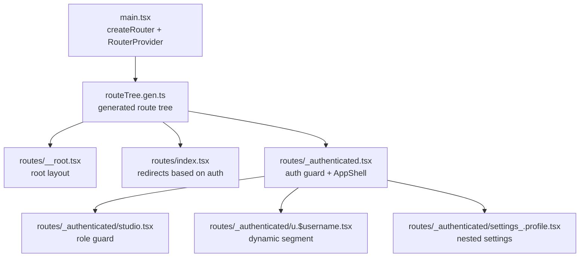
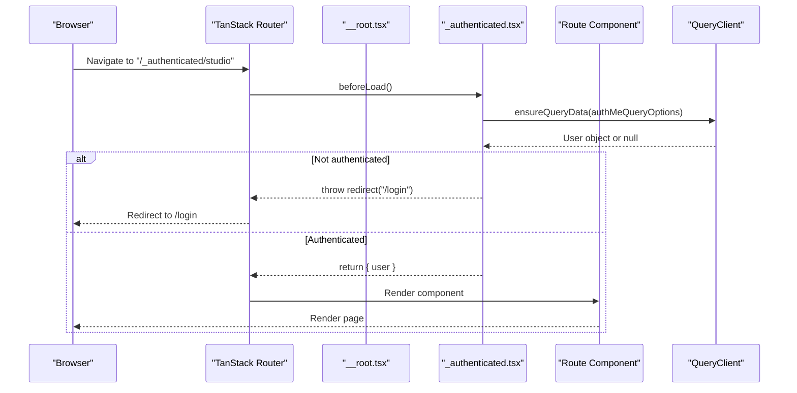
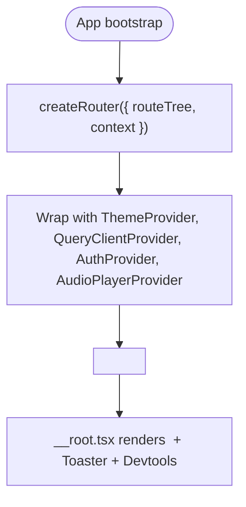
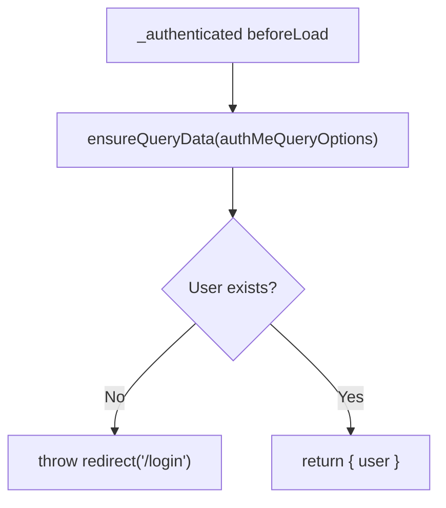
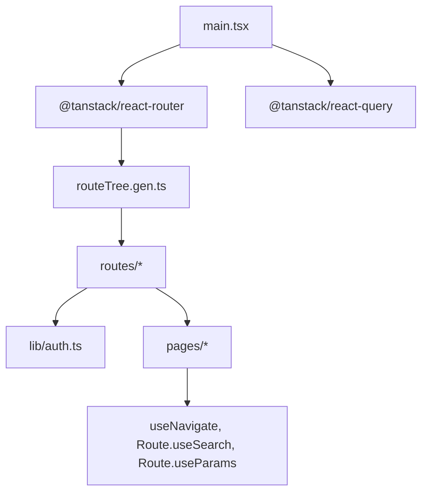

# Routing and Navigation

<cite>
**Referenced Files in This Document**
- [main.tsx](file://src/react-app/main.tsx)
- [routeTree.gen.ts](file://src/react-app/routeTree.gen.ts)
- [__root.tsx](file://src/react-app/routes/__root.tsx)
- [_authenticated.tsx](file://src/react-app/routes/_authenticated.tsx)
- [index.tsx](file://src/react-app/routes/index.tsx)
- [studio.tsx](file://src/react-app/routes/_authenticated/studio.tsx)
- [u.$username.tsx](file://src/react-app/routes/_authenticated/u.$username.tsx)
- [settings_.profile.tsx](file://src/react-app/routes/_authenticated/settings_.profile.tsx)
- [ProtectedRoute.tsx](file://src/react-app/components/ProtectedRoute.tsx)
- [query-client.ts](file://src/react-app/lib/query-client.ts)
- [auth.ts](file://src/react-app/lib/auth.ts)
- [StudioPage.tsx](file://src/react-app/pages/StudioPage.tsx)
</cite>

## Table of Contents
1. [Introduction](#introduction)
2. [Project Structure](#project-structure)
3. [Core Components](#core-components)
4. [Architecture Overview](#architecture-overview)
5. [Detailed Component Analysis](#detailed-component-analysis)
6. [Dependency Analysis](#dependency-analysis)
7. [Performance Considerations](#performance-considerations)
8. [Troubleshooting Guide](#troubleshooting-guide)
9. [Conclusion](#conclusion)

## Introduction
This document explains the TanStack Router implementation and navigation patterns used in the application. It covers the file-based routing system, the generated route tree structure, nested routes, dynamic segments, authentication guards, router configuration, context providers, programmatic navigation, route parameters, query string handling, route-level data loading with TanStack Query, and error boundaries for route-specific error handling.

## Project Structure
The application uses TanStack Router’s file-based routing convention under src/react-app/routes. Each file defines a route via createFileRoute or createRootRouteWithContext. The build tooling generates a type-safe route tree at src/react-app/routeTree.gen.ts, which is consumed by the router instance created in main.tsx.

**Diagram sources**
- [main.tsx:12-17](file://src/react-app/main.tsx#L12-L17)
- [routeTree.gen.ts:11-50](file://src/react-app/routeTree.gen.ts#L11-L50)
- [__root.tsx:10-12](file://src/react-app/routes/__root.tsx#L10-L12)
- [index.tsx:4-12](file://src/react-app/routes/index.tsx#L4-L12)
- [_authenticated.tsx:5-19](file://src/react-app/routes/_authenticated.tsx#L5-L19)
- [studio.tsx:4-11](file://src/react-app/routes/_authenticated/studio.tsx#L4-L11)
- [u.$username.tsx:4-11](file://src/react-app/routes/_authenticated/u.$username.tsx#L4-L11)
- [settings_.profile.tsx:4-6](file://src/react-app/routes/_authenticated/settings_.profile.tsx#L4-L6)

**Section sources**
- [main.tsx:12-17](file://src/react-app/main.tsx#L12-L17)
- [routeTree.gen.ts:11-50](file://src/react-app/routeTree.gen.ts#L11-L50)

## Core Components
- Router initialization and context injection:
  - The router is created with createRouter and provided to the app via RouterProvider. Context includes the QueryClient instance for route-level data loading.
- Root route:
  - Defines the root component that renders child routes via Outlet and global UI elements (e.g., Toaster, devtools).
- Authentication guard:
  - The _authenticated route ensures a user exists before rendering protected content; otherwise redirects to login.
- Index redirect:
  - The index route redirects authenticated users to /feed and unauthenticated users to /login.
- Role-based guard:
  - The studio route enforces creator role before allowing access.
- Dynamic segments:
  - User profile route uses $username to extract route parameters.
- Nested settings:
  - Settings sub-routes are organized with underscore notation to represent nested paths.

**Section sources**
- [main.tsx:12-17](file://src/react-app/main.tsx#L12-L17)
- [__root.tsx:10-22](file://src/react-app/routes/__root.tsx#L10-L22)
- [_authenticated.tsx:5-19](file://src/react-app/routes/_authenticated.tsx#L5-L19)
- [index.tsx:4-12](file://src/react-app/routes/index.tsx#L4-L12)
- [studio.tsx:4-11](file://src/react-app/routes/_authenticated/studio.tsx#L4-L11)
- [u.$username.tsx:4-11](file://src/react-app/routes/_authenticated/u.$username.tsx#L4-L11)
- [settings_.profile.tsx:4-6](file://src/react-app/routes/_authenticated/settings_.profile.tsx#L4-L6)

## Architecture Overview
The router architecture centers around a generated route tree and context-driven guards. The root route provides shared UI, while protected routes enforce authentication and authorization. Data fetching is integrated through TanStack Query using ensureQueryData in beforeLoad hooks.

**Diagram sources**
- [_authenticated.tsx:5-19](file://src/react-app/routes/_authenticated.tsx#L5-L19)
- [auth.ts:29-34](file://src/react-app/lib/auth.ts#L29-L34)
- [main.tsx:12-17](file://src/react-app/main.tsx#L12-L17)

## Detailed Component Analysis

### File-Based Routing and Generated Route Tree
- Routes are defined as files under src/react-app/routes.
- The build process generates routeTree.gen.ts with typed route definitions, full paths, parent relationships, and helper types for navigation and search.
- The generated tree is imported into main.tsx and passed to createRouter.

Key aspects:
- Full path mapping and id mapping for type safety.
- Parent-child relationships for nested routes.
- Preloader route references for each route definition.

**Section sources**
- [routeTree.gen.ts:11-50](file://src/react-app/routeTree.gen.ts#L11-L50)
- [routeTree.gen.ts:267-305](file://src/react-app/routeTree.gen.ts#L267-L305)
- [routeTree.gen.ts:344-384](file://src/react-app/routeTree.gen.ts#L344-L384)
- [routeTree.gen.ts:512-580](file://src/react-app/routeTree.gen.ts#L512-L580)

### Router Configuration and Context Providers
- main.tsx creates the router with routeTree and injects QueryClient into context.
- Providers wrap RouterProvider: ThemeProvider, QueryClientProvider, AuthProvider, AudioPlayerProvider.
- The root route declares the RouterContext type including QueryClient.

**Diagram sources**
- [main.tsx:12-37](file://src/react-app/main.tsx#L12-L37)
- [__root.tsx:10-22](file://src/react-app/routes/__root.tsx#L10-L22)

**Section sources**
- [main.tsx:12-37](file://src/react-app/main.tsx#L12-L37)
- [__root.tsx:6-12](file://src/react-app/routes/__root.tsx#L6-L12)

### Authentication Guard and Protected Routes
- The _authenticated route performs a beforeLoad check using QueryClient.ensureQueryData to fetch current user info.
- If no user is present, it throws a redirect to /login.
- A client-side ProtectedRoute component can be used within components to guard children based on AuthContext state.

**Diagram sources**
- [_authenticated.tsx:5-19](file://src/react-app/routes/_authenticated.tsx#L5-L19)
- [auth.ts:29-34](file://src/react-app/lib/auth.ts#L29-L34)

**Section sources**
- [_authenticated.tsx:5-19](file://src/react-app/routes/_authenticated.tsx#L5-L19)
- [ProtectedRoute.tsx:6-18](file://src/react-app/components/ProtectedRoute.tsx#L6-L18)

### Role-Based Guards
- The studio route checks context.user.role and redirects non-creators to /become-creator.

**Section sources**
- [studio.tsx:4-11](file://src/react-app/routes/_authenticated/studio.tsx#L4-L11)

### Dynamic Segments and Route Parameters
- The user profile route uses $username to capture dynamic segments.
- Components access parameters via Route.useParams().

Example usage pattern:
- Extract username from params and pass it to the page component.

**Section sources**
- [u.$username.tsx:4-11](file://src/react-app/routes/_authenticated/u.$username.tsx#L4-L11)

### Nested Routes and Settings Sub-Routes
- Settings sub-routes use underscore notation to denote nesting (e.g., settings_/profile).
- These map to full paths like /settings/profile.

**Section sources**
- [settings_.profile.tsx:4-6](file://src/react-app/routes/_authenticated/settings_.profile.tsx#L4-L6)
- [routeTree.gen.ts:668-674](file://src/react-app/routeTree.gen.ts#L668-L674)

### Programmatic Navigation
- useNavigate hook is used throughout pages and components to navigate programmatically.
- Examples include navigating to new article creation, audio, photography, and courses sections.

Common patterns:
- navigate({ to: '/studio/articles/new' })
- navigate({ to: '/studio/courses/$courseId/edit', params: { postId: ... } })

**Section sources**
- [StudioPage.tsx:11-77](file://src/react-app/pages/StudioPage.tsx#L11-L77)

### Query String Handling
- TanStack Router provides useSearch for reading query parameters within route components.
- While not shown in the analyzed files, the hook is available for all routes via Route.useSearch().

[No sources needed since this section describes general usage without analyzing specific files]

### Route-Level Data Loading with TanStack Query
- BeforeLoad hooks use QueryClient.ensureQueryData to prefetch data required for route rendering.
- The authMeQueryOptions define the query key and function to fetch current user.

Benefits:
- Predictable data availability before render.
- Centralized caching and retry behavior via QueryClient defaults.

**Section sources**
- [_authenticated.tsx:5-19](file://src/react-app/routes/_authenticated.tsx#L5-L19)
- [auth.ts:29-34](file://src/react-app/lib/auth.ts#L29-L34)
- [query-client.ts:3-13](file://src/react-app/lib/query-client.ts#L3-L13)

### Error Boundaries for Route-Specific Error Handling
- The root route renders global UI elements and could be extended to include error boundaries per route if needed.
- For route-level errors, consider wrapping route components with React error boundaries or using TanStack Router’s error handling features (not shown in analyzed files).

[No sources needed since this section provides general guidance]

## Dependency Analysis
The routing layer depends on:
- TanStack Router for file-based routing, navigation, and hooks.
- TanStack Query for data fetching and caching.
- Application contexts (Auth, Audio Player) for state sharing.

**Diagram sources**
- [main.tsx:12-17](file://src/react-app/main.tsx#L12-L17)
- [routeTree.gen.ts:11-50](file://src/react-app/routeTree.gen.ts#L11-L50)
- [auth.ts:29-34](file://src/react-app/lib/auth.ts#L29-L34)

**Section sources**
- [main.tsx:12-17](file://src/react-app/main.tsx#L12-L17)
- [routeTree.gen.ts:11-50](file://src/react-app/routeTree.gen.ts#L11-L50)

## Performance Considerations
- Use ensureQueryData in beforeLoad to avoid waterfalls and ensure data is ready before rendering.
- Configure QueryClient defaults to control retries and refetch behaviors globally.
- Prefer route-level guards to minimize unnecessary renders and network requests.

[No sources needed since this section provides general guidance]

## Troubleshooting Guide
Common issues and resolutions:
- Redirect loops: Ensure beforeLoad guards do not conflict (e.g., index redirect vs. _authenticated guard).
- Missing user context: Verify QueryClient.ensureQueryData resolves correctly and auth endpoints return expected data.
- Parameter extraction: Confirm dynamic segments match route definitions and use Route.useParams() appropriately.
- Navigation errors: Validate target paths against the generated route tree and use typed navigation where possible.

**Section sources**
- [index.tsx:4-12](file://src/react-app/routes/index.tsx#L4-L12)
- [_authenticated.tsx:5-19](file://src/react-app/routes/_authenticated.tsx#L5-L19)
- [u.$username.tsx:4-11](file://src/react-app/routes/_authenticated/u.$username.tsx#L4-L11)

## Conclusion
The application leverages TanStack Router’s file-based routing with a generated type-safe route tree, robust authentication and role-based guards, and seamless integration with TanStack Query for route-level data loading. Programmatic navigation and parameter handling are straightforward using built-in hooks. Extending error boundaries and query string handling follows standard patterns supported by the framework.