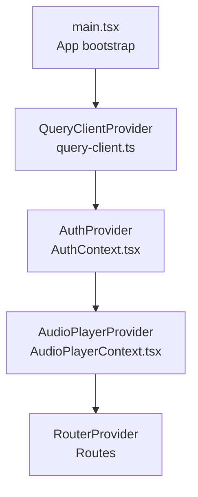
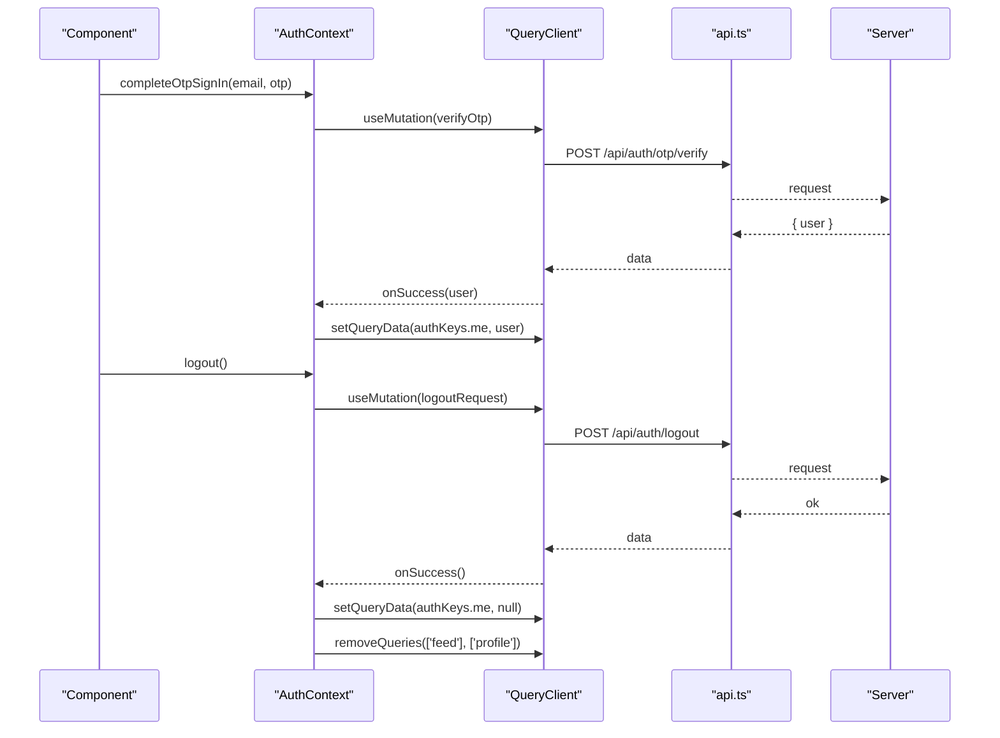
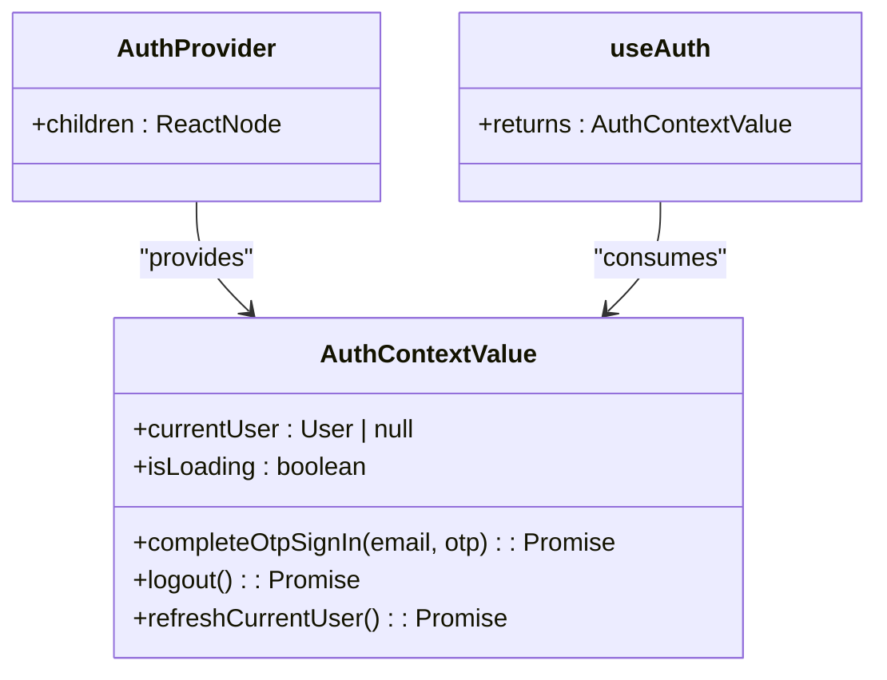
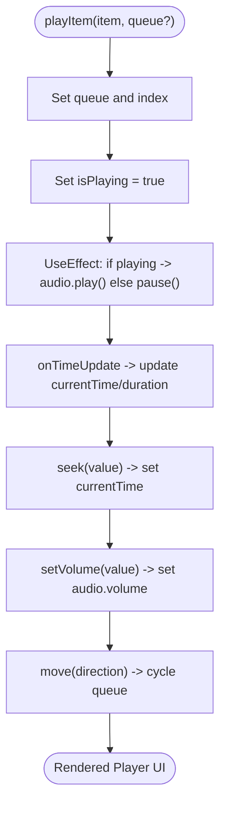
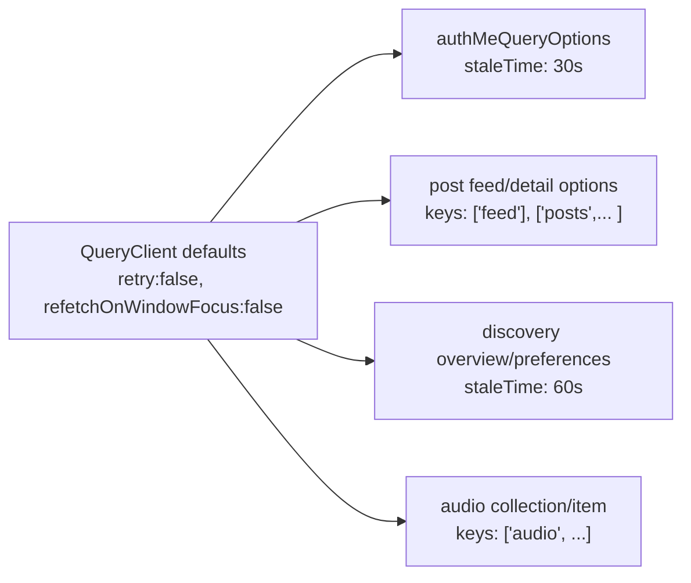
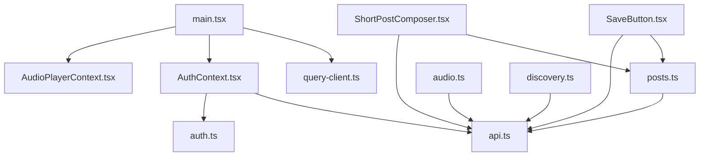

# State Management

<cite>
**Referenced Files in This Document**
- [main.tsx](file://src/react-app/main.tsx)
- [query-client.ts](file://src/react-app/lib/query-client.ts)
- [AuthContext.tsx](file://src/react-app/context/AuthContext.tsx)
- [AudioPlayerContext.tsx](file://src/react-app/context/AudioPlayerContext.tsx)
- [api.ts](file://src/react-app/lib/api.ts)
- [auth.ts](file://src/react-app/lib/auth.ts)
- [posts.ts](file://src/react-app/lib/posts.ts)
- [audio.ts](file://src/react-app/lib/audio.ts)
- [discovery.ts](file://src/react-app/lib/discovery.ts)
- [SaveButton.tsx](file://src/react-app/components/SaveButton.tsx)
- [ShortPostComposer.tsx](file://src/react-app/components/ShortPostComposer.tsx)
</cite>

## Table of Contents
1. [Introduction](#introduction)
2. [Project Structure](#project-structure)
3. [Core Components](#core-components)
4. [Architecture Overview](#architecture-overview)
5. [Detailed Component Analysis](#detailed-component-analysis)
6. [Dependency Analysis](#dependency-analysis)
7. [Performance Considerations](#performance-considerations)
8. [Troubleshooting Guide](#troubleshooting-guide)
9. [Conclusion](#conclusion)

## Introduction
This document explains the state management architecture that combines React Context for client-side UI and application state with TanStack Query for server state. It covers:
- Provider patterns using AuthContext (authentication) and AudioPlayerContext (media playback).
- Server state strategy with TanStack Query: caching, synchronization, and optimistic updates.
- Client state patterns for UI-specific state and form handling.
- Custom hooks for accessing state and mutations.
- State persistence considerations, error handling, and performance optimization techniques.

## Project Structure
The React application is bootstrapped with a top-level provider tree that wires up TanStack Query, authentication, audio player, and routing. The query client is configured centrally and shared across components via providers.

**Diagram sources**
- [main.tsx:25-37](file://src/react-app/main.tsx#L25-L37)
- [query-client.ts:3-13](file://src/react-app/lib/query-client.ts#L3-L13)
- [AuthContext.tsx:23-83](file://src/react-app/context/AuthContext.tsx#L23-L83)
- [AudioPlayerContext.tsx:135-360](file://src/react-app/context/AudioPlayerContext.tsx#L135-L360)

**Section sources**
- [main.tsx:12-37](file://src/react-app/main.tsx#L12-L37)
- [query-client.ts:1-14](file://src/react-app/lib/query-client.ts#L1-L14)

## Core Components
- QueryClient configuration: centralized defaults for retries and refetch behavior.
- AuthContext: provides current user, loading state, OTP sign-in, logout, and refresh logic; integrates with TanStack Query cache to keep auth state consistent.
- AudioPlayerContext: manages playback queue, play/pause, seek, volume, and dynamic theming based on cover art colors.
- API layer: normalized responses and errors, cookie-based sessions, and custom events for auth lifecycle.

Key responsibilities:
- Server state: TanStack Query handles caching, background refetches, and invalidation.
- Client state: React Context and local component state manage UI and media playback.
- Mutations: useMutation orchestrates side effects and cache updates.

**Section sources**
- [query-client.ts:1-14](file://src/react-app/lib/query-client.ts#L1-L14)
- [AuthContext.tsx:1-90](file://src/react-app/context/AuthContext.tsx#L1-L90)
- [AudioPlayerContext.tsx:1-361](file://src/react-app/context/AudioPlayerContext.tsx#L1-L361)
- [api.ts:1-164](file://src/react-app/lib/api.ts#L1-L164)

## Architecture Overview
The system separates concerns between server state (TanStack Query) and client state (React Context + local state). Providers wrap the app to share global context. Data flows from API endpoints through the normalized API layer into TanStack Query caches, which components consume via hooks. Mutations update server state and invalidate or set relevant queries to keep UI consistent.

**Diagram sources**
- [AuthContext.tsx:26-39](file://src/react-app/context/AuthContext.tsx#L26-L39)
- [auth.ts:36-46](file://src/react-app/lib/auth.ts#L36-L46)
- [api.ts:123-145](file://src/react-app/lib/api.ts#L123-L145)

## Detailed Component Analysis

### Authentication State with AuthContext
AuthContext encapsulates authentication flow and integrates tightly with TanStack Query:
- Reads current user via a query option with a stable key.
- Uses mutations for OTP verification and logout.
- Updates the cache directly on success and clears related queries on logout.
- Subscribes to window events for unauthorized/suspended states to reset auth cache.

**Diagram sources**
- [AuthContext.tsx:13-19](file://src/react-app/context/AuthContext.tsx#L13-L19)
- [AuthContext.tsx:23-83](file://src/react-app/context/AuthContext.tsx#L23-L83)
- [AuthContext.tsx:85-90](file://src/react-app/context/AuthContext.tsx#L85-L90)

Key behaviors:
- Cache keys are defined centrally and reused by queries/mutations.
- Unauthorized and account-suspended events clear the current user and related data.
- Refresh method invalidates the current user query.

**Section sources**
- [AuthContext.tsx:1-90](file://src/react-app/context/AuthContext.tsx#L1-L90)
- [auth.ts:16-34](file://src/react-app/lib/auth.ts#L16-L34)
- [api.ts:61-82](file://src/react-app/lib/api.ts#L61-L82)

### Media Playback State with AudioPlayerContext
AudioPlayerContext manages:
- Queue, current item index, playback state, and progress.
- HTML <audio> element lifecycle and event handling.
- Dynamic theme generation from cover art color sampling.
- UI controls for play/pause, seek, volume, and navigation.

**Diagram sources**
- [AudioPlayerContext.tsx:150-195](file://src/react-app/context/AudioPlayerContext.tsx#L150-L195)
- [AudioPlayerContext.tsx:197-233](file://src/react-app/context/AudioPlayerContext.tsx#L197-L233)
- [AudioPlayerContext.tsx:247-268](file://src/react-app/context/AudioPlayerContext.tsx#L247-L268)

Optimization highlights:
- Memoized context value to minimize re-renders.
- Color extraction only when cover URL changes.
- Controlled audio element via refs to avoid unnecessary re-renders.

**Section sources**
- [AudioPlayerContext.tsx:1-361](file://src/react-app/context/AudioPlayerContext.tsx#L1-L361)

### Server State Strategy with TanStack Query
Caching and synchronization:
- Central QueryClient disables automatic retries and window-focus refetches for predictable behavior.
- Each domain module exports queryOptions with stable keys and optional staleTime.
- Mutations trigger targeted invalidations to keep caches fresh.

Examples:
- Auth: fetchCurrentUser uses a query option with a dedicated key and stale time.
- Posts: feed and detail queries use structured keys for precise invalidation.
- Discovery: overview and preferences queries with longer stale times.
- Audio: collection and item detail queries keyed by username and slug.

**Diagram sources**
- [query-client.ts:3-13](file://src/react-app/lib/query-client.ts#L3-L13)
- [auth.ts:29-34](file://src/react-app/lib/auth.ts#L29-L34)
- [posts.ts:96-108](file://src/react-app/lib/posts.ts#L96-L108)
- [discovery.ts:65-75](file://src/react-app/lib/discovery.ts#L65-L75)
- [audio.ts:91-119](file://src/react-app/lib/audio.ts#L91-L119)

**Section sources**
- [query-client.ts:1-14](file://src/react-app/lib/query-client.ts#L1-L14)
- [auth.ts:20-34](file://src/react-app/lib/auth.ts#L20-L34)
- [posts.ts:88-108](file://src/react-app/lib/posts.ts#L88-L108)
- [discovery.ts:58-75](file://src/react-app/lib/discovery.ts#L58-L75)
- [audio.ts:84-119](file://src/react-app/lib/audio.ts#L84-L119)

### Client State Patterns for UI and Forms
- Local state for UI toggles, form inputs, and temporary UI flags.
- react-hook-form with zod resolver for validation and controlled fields.
- Field arrays for dynamic lists (e.g., poll options, images).
- Optimistic UI updates with rollback on failure.

Example: ShortPostComposer
- Uses useForm and useWatch to track form state.
- Publish mutation builds FormData conditionally and invalidates relevant query keys.
- Handles scheduling mode and image previews with memory cleanup.

Example: SaveButton
- Toggles saved state locally before mutation completes.
- On success, invalidates library and post-related queries.
- On error, rolls back to previous saved state and shows toast.

**Section sources**
- [ShortPostComposer.tsx:44-156](file://src/react-app/components/ShortPostComposer.tsx#L44-L156)
- [SaveButton.tsx:37-81](file://src/react-app/components/SaveButton.tsx#L37-L81)

### Custom Hooks for State Access and Mutation Patterns
- useAuth: typed hook to access authentication context safely.
- useAudioPlayer: typed hook to access audio player context safely.
- Domain modules export queryOptions and mutation functions used within useMutation/useQuery.

Patterns:
- Stable query keys per resource and action.
- StaleTime tuned per domain to balance freshness and performance.
- Targeted invalidations after mutations to minimize over-fetching.

**Section sources**
- [AuthContext.tsx:85-90](file://src/react-app/context/AuthContext.tsx#L85-L90)
- [AudioPlayerContext.tsx:129-133](file://src/react-app/context/AudioPlayerContext.tsx#L129-L133)
- [posts.ts:96-108](file://src/react-app/lib/posts.ts#L96-L108)
- [audio.ts:91-119](file://src/react-app/lib/audio.ts#L91-L119)
- [discovery.ts:65-75](file://src/react-app/lib/discovery.ts#L65-L75)

## Dependency Analysis
High-level dependencies among core files:

**Diagram sources**
- [main.tsx:25-37](file://src/react-app/main.tsx#L25-L37)
- [query-client.ts:1-14](file://src/react-app/lib/query-client.ts#L1-L14)
- [AuthContext.tsx:1-90](file://src/react-app/context/AuthContext.tsx#L1-L90)
- [AudioPlayerContext.tsx:1-361](file://src/react-app/context/AudioPlayerContext.tsx#L1-L361)
- [api.ts:1-164](file://src/react-app/lib/api.ts#L1-L164)
- [auth.ts:1-55](file://src/react-app/lib/auth.ts#L1-L55)
- [posts.ts:1-160](file://src/react-app/lib/posts.ts#L1-L160)
- [audio.ts:1-155](file://src/react-app/lib/audio.ts#L1-L155)
- [discovery.ts:1-99](file://src/react-app/lib/discovery.ts#L1-L99)
- [SaveButton.tsx:1-81](file://src/react-app/components/SaveButton.tsx#L1-L81)
- [ShortPostComposer.tsx:1-440](file://src/react-app/components/ShortPostComposer.tsx#L1-L440)

**Section sources**
- [main.tsx:12-37](file://src/react-app/main.tsx#L12-L37)
- [api.ts:1-164](file://src/react-app/lib/api.ts#L1-L164)

## Performance Considerations
- Disable automatic retries and refetch-on-window-focus globally to reduce network churn and ensure deterministic behavior.
- Use stable query keys and scoped invalidations to limit re-renders and refetches.
- Apply staleTime where appropriate to reduce frequent requests (e.g., discovery preferences).
- Memoize expensive computations and context values to prevent unnecessary renders.
- Avoid heavy work in render paths; offload to effects and callbacks.
- Reuse object references for props and handlers where possible.

[No sources needed since this section provides general guidance]

## Troubleshooting Guide
Common issues and resolutions:
- Unauthorized or suspended sessions:
  - The API layer dispatches 'unauthorized' and 'account-suspended' events.
  - AuthContext listens to these events and clears the current user and related queries.
- Mutation failures:
  - Always handle onError to show user feedback and roll back optimistic state when necessary.
  - For SaveButton, revert displayedSaved on error to maintain consistency.
- Form submission errors:
  - Validate inputs early with zod and surface messages via react-hook-form.
  - Ensure FormData construction matches server expectations.

**Section sources**
- [api.ts:61-91](file://src/react-app/lib/api.ts#L61-L91)
- [AuthContext.tsx:41-49](file://src/react-app/context/AuthContext.tsx#L41-L49)
- [SaveButton.tsx:54-58](file://src/react-app/components/SaveButton.tsx#L54-L58)
- [ShortPostComposer.tsx:125-144](file://src/react-app/components/ShortPostComposer.tsx#L125-L144)

## Conclusion
This architecture cleanly separates server state (TanStack Query) from client state (React Context and local state), enabling predictable caching, efficient synchronization, and responsive UI interactions. Provider patterns centralize cross-cutting concerns like authentication and media playback, while domain modules encapsulate data access and mutation logic. With careful key design, targeted invalidations, and robust error handling, the system delivers a performant and maintainable state management strategy.