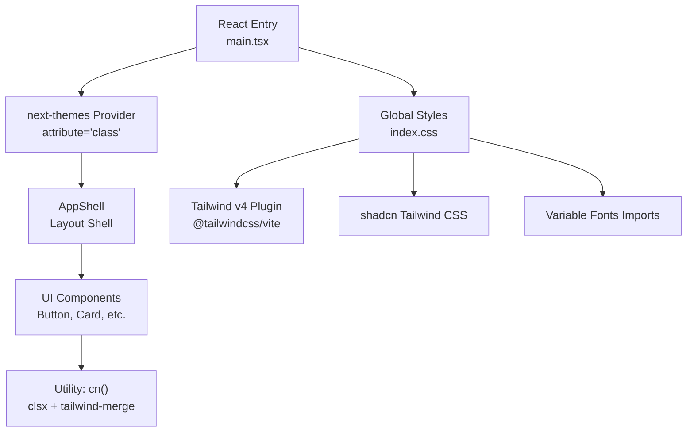
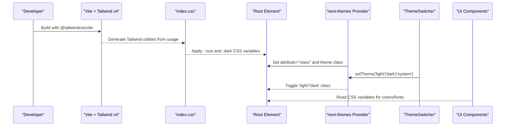
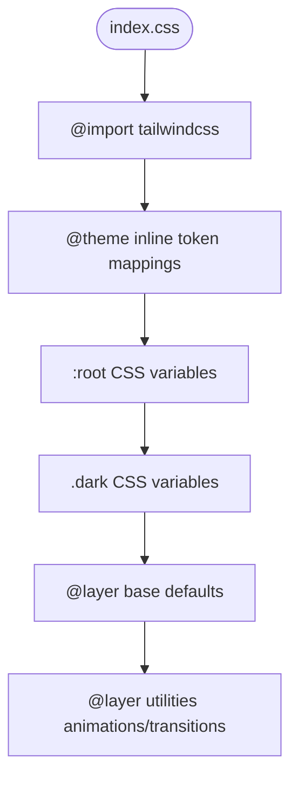
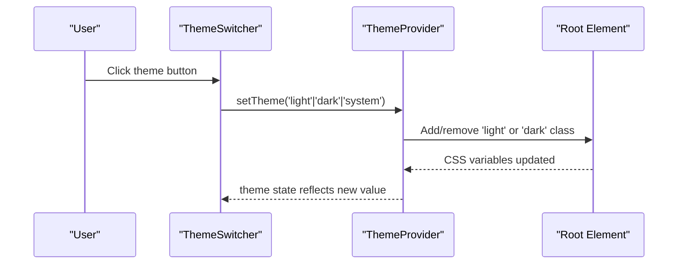
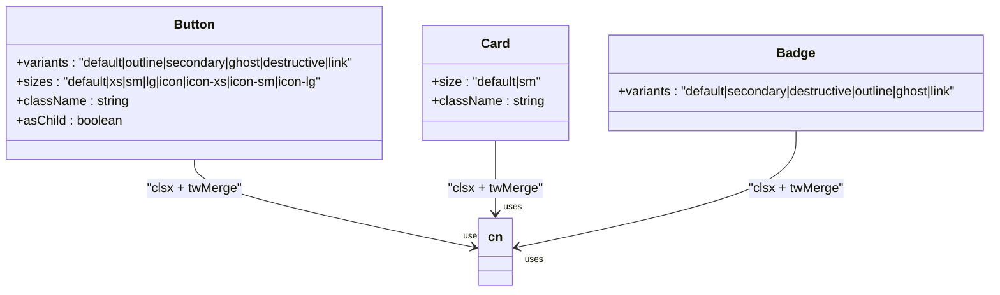
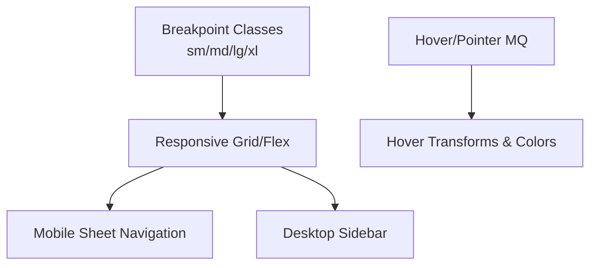
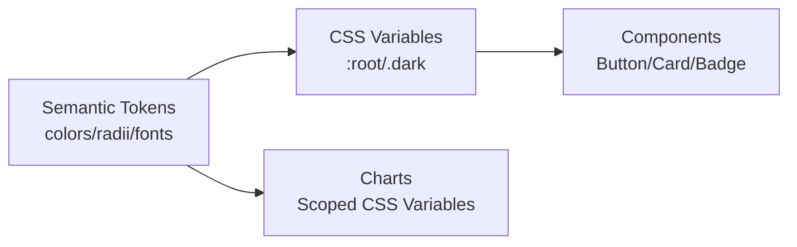
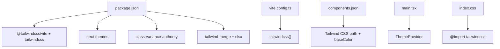

# Styling and Theming

<cite>
**Referenced Files in This Document**
- [components.json](file://components.json)
- [index.css](file://src/react-app/index.css)
- [main.tsx](file://src/react-app/main.tsx)
- [ThemeSwitcher.tsx](file://src/react-app/components/ThemeSwitcher.tsx)
- [button.tsx](file://src/react-app/components/ui/button.tsx)
- [card.tsx](file://src/react-app/components/ui/card.tsx)
- [utils.ts](file://src/react-app/lib/utils.ts)
- [vite.config.ts](file://vite.config.ts)
- [package.json](file://package.json)
- [chart.tsx](file://src/react-app/components/ui/chart.tsx)
- [AppShell.tsx](file://src/react-app/components/AppShell.tsx)
</cite>

## Table of Contents
1. [Introduction](#introduction)
2. [Project Structure](#project-structure)
3. [Core Components](#core-components)
4. [Architecture Overview](#architecture-overview)
5. [Detailed Component Analysis](#detailed-component-analysis)
6. [Dependency Analysis](#dependency-analysis)
7. [Performance Considerations](#performance-considerations)
8. [Troubleshooting Guide](#troubleshooting-guide)
9. [Conclusion](#conclusion)

## Introduction
This document explains the styling architecture for the application, focusing on Tailwind CSS v4, theme management with next-themes, and component-level styling patterns. It covers how utility-first CSS is configured via a shadcn-style components.json, how dark/light themes are implemented using CSS variables and a class-based attribute strategy, and how reusable UI components compose Tailwind classes with class-variance-authority (CVA). It also includes responsive design patterns, custom color schemes, typography scaling, guidance on CSS-in-JS alternatives, style organization, and performance considerations for large applications.

## Project Structure
The styling system centers around:
- A single global stylesheet that imports Tailwind v4 and defines theme tokens as CSS variables.
- A Vite configuration that enables Tailwind v4 through its plugin.
- A shadcn-style components.json that configures Tailwind integration, base color palette, and aliases.
- A React entry point that wraps the app with next-themes provider to manage light/dark/system themes.
- Reusable UI components under src/react-app/components/ui that use CVA and clsx/tailwind-merge utilities.

**Diagram sources**
- [main.tsx:1-38](file://src/react-app/main.tsx#L1-L38)
- [index.css:1-267](file://src/react-app/index.css#L1-L267)
- [vite.config.ts:1-28](file://vite.config.ts#L1-L28)
- [components.json:1-26](file://components.json#L1-L26)

**Section sources**
- [components.json:1-26](file://components.json#L1-L26)
- [index.css:1-267](file://src/react-app/index.css#L1-L267)
- [main.tsx:1-38](file://src/react-app/main.tsx#L1-L38)
- [vite.config.ts:1-28](file://vite.config.ts#L1-L28)

## Core Components
- Global styles and theme tokens: index.css defines CSS variables for colors, radii, and fonts, and exposes a .dark variant via @custom-variant. It imports Tailwind v4, shadcn’s Tailwind CSS, and variable fonts.
- Theme provider: main.tsx wraps the app with next-themes using attribute="class", defaultTheme="dark", and disables transition-on-change for smoother switching.
- Theme switcher: ThemeSwitcher.tsx provides buttons to set light, dark, or system theme via next-themes’ useTheme hook.
- Utility function: utils.ts exports cn() combining clsx and tailwind-merge for safe class composition.
- UI primitives: button.tsx and card.tsx demonstrate CVA-driven variants and sizes, data attributes for state, and consistent use of semantic color tokens.

**Section sources**
- [index.css:1-267](file://src/react-app/index.css#L1-L267)
- [main.tsx:1-38](file://src/react-app/main.tsx#L1-L38)
- [ThemeSwitcher.tsx:1-37](file://src/react-app/components/ThemeSwitcher.tsx#L1-L37)
- [utils.ts:1-7](file://src/react-app/lib/utils.ts#L1-L7)
- [button.tsx:1-66](file://src/react-app/components/ui/button.tsx#L1-L66)
- [card.tsx:1-101](file://src/react-app/components/ui/card.tsx#L1-L101)

## Architecture Overview
The styling architecture follows a clear separation of concerns:
- Build-time: Tailwind v4 processes utility classes and compiles CSS based on usage.
- Runtime: next-themes toggles a class on the root element to switch themes; CSS variables update accordingly.
- Components: UI components encapsulate layout and appearance using CVA variants, semantic tokens, and responsive utilities.

**Diagram sources**
- [vite.config.ts:1-28](file://vite.config.ts#L1-L28)
- [index.css:1-267](file://src/react-app/index.css#L1-L267)
- [main.tsx:1-38](file://src/react-app/main.tsx#L1-L38)
- [ThemeSwitcher.tsx:1-37](file://src/react-app/components/ThemeSwitcher.tsx#L1-L37)

## Detailed Component Analysis

### Tailwind v4 Configuration and Theme Tokens
- Tailwind v4 is enabled via the Vite plugin and imported in index.css. The file declares an inline @theme block mapping semantic tokens (colors, radii, fonts) to CSS variables.
- Light and dark palettes are defined using oklch values under :root and .dark selectors.
- A custom dark variant is registered with @custom-variant dark (&:is(.dark *)); ensuring descendant selectors inherit dark mode correctly.
- Base layer applies global resets and typography defaults using semantic tokens.

**Diagram sources**
- [index.css:1-267](file://src/react-app/index.css#L1-L267)

**Section sources**
- [index.css:1-267](file://src/react-app/index.css#L1-L267)

### Theme Management with next-themes
- The app root wraps everything in ThemeProvider with attribute="class", enabling class-based theme toggling.
- Default theme is set to dark; transitions on change are disabled for immediate feedback.
- ThemeSwitcher uses useTheme to read current theme and call setTheme for light, dark, or system modes.

**Diagram sources**
- [main.tsx:1-38](file://src/react-app/main.tsx#L1-L38)
- [ThemeSwitcher.tsx:1-37](file://src/react-app/components/ThemeSwitcher.tsx#L1-L37)

**Section sources**
- [main.tsx:1-38](file://src/react-app/main.tsx#L1-L38)
- [ThemeSwitcher.tsx:1-37](file://src/react-app/components/ThemeSwitcher.tsx#L1-L37)

### Component Styling Patterns (CVA + Semantic Tokens)
- Button uses CVA to define variants (default, outline, secondary, ghost, destructive, link) and sizes (default, xs, sm, lg, icon variants). It leverages semantic tokens like bg-primary, text-primary-foreground, border-border, and ring utilities.
- Card composes layout and spacing with semantic tokens and responsive modifiers, using data attributes for size variants.
- Both components use cn() to merge className props safely with generated variants.

**Diagram sources**
- [button.tsx:1-66](file://src/react-app/components/ui/button.tsx#L1-L66)
- [card.tsx:1-101](file://src/react-app/components/ui/card.tsx#L1-L101)
- [utils.ts:1-7](file://src/react-app/lib/utils.ts#L1-L7)

**Section sources**
- [button.tsx:1-66](file://src/react-app/components/ui/button.tsx#L1-L66)
- [card.tsx:1-101](file://src/react-app/components/ui/card.tsx#L1-L101)
- [utils.ts:1-7](file://src/react-app/lib/utils.ts#L1-L7)

### Responsive Design Patterns
- Layouts use Tailwind breakpoints (sm, lg, xl) to adapt structure and spacing. For example, AppShell hides sidebar on small screens and shows a mobile header with a sheet navigation.
- AuthPageShell demonstrates grid layouts that shift between stacked and side-by-side columns across breakpoints.
- Many components apply hover-only behaviors via media queries for pointer and hover capabilities.

**Diagram sources**
- [AppShell.tsx:1-63](file://src/react-app/components/AppShell.tsx#L1-L63)
- [AuthPageShell.tsx:45-125](file://src/react-app/components/AuthPageShell.tsx#L45-L125)
- [index.css:185-238](file://src/react-app/index.css#L185-L238)

**Section sources**
- [AppShell.tsx:1-63](file://src/react-app/components/AppShell.tsx#L1-L63)
- [AuthPageShell.tsx:45-125](file://src/react-app/components/AuthPageShell.tsx#L45-L125)
- [index.css:185-238](file://src/react-app/index.css#L185-L238)

### Custom Color Schemes and Typography Scaling
- Color scheme: Semantic tokens (primary, secondary, muted, accent, destructive, foreground, background, borders, rings) are mapped to CSS variables in both light and dark palettes. Charts and other features can reference these tokens consistently.
- Typography: Font families are exposed via CSS variables and applied at the base layer. Variable fonts are imported and used for headings and body text.
- Chart theming: chart.tsx injects scoped CSS variables per chart instance, supporting theme-aware colors for light and dark modes.

**Diagram sources**
- [index.css:53-123](file://src/react-app/index.css#L53-L123)
- [chart.tsx:1-60](file://src/react-app/components/ui/chart.tsx#L1-L60)

**Section sources**
- [index.css:53-123](file://src/react-app/index.css#L53-L123)
- [chart.tsx:1-60](file://src/react-app/components/ui/chart.tsx#L1-L60)

### Style Organization and CSS-in-JS Alternatives
- Current approach: Utility-first CSS with Tailwind v4, semantic tokens via CSS variables, and component-level CVA variants. No CSS modules are used; styles are centralized in index.css and composed via Tailwind classes.
- CSS-in-JS alternatives: While libraries like styled-components or Emotion exist, this project avoids them in favor of Tailwind and CVA for predictable, composable styling. If needed, dynamic styles can be injected via <style> tags (as seen in chart.tsx) or by setting CSS variables inline.

**Section sources**
- [index.css:1-267](file://src/react-app/index.css#L1-L267)
- [chart.tsx:90-115](file://src/react-app/components/ui/chart.tsx#L90-L115)

## Dependency Analysis
- Tailwind v4 is integrated via @tailwindcss/vite plugin and imported in index.css.
- next-themes manages runtime theme state and toggles a class on the root element.
- shadcn-style components.json configures Tailwind paths, base color palette, and aliases for components and utils.
- package.json lists dependencies including Tailwind v4, next-themes, clsx, tailwind-merge, and CVA.

**Diagram sources**
- [package.json:1-98](file://package.json#L1-L98)
- [vite.config.ts:1-28](file://vite.config.ts#L1-L28)
- [components.json:1-26](file://components.json#L1-L26)
- [main.tsx:1-38](file://src/react-app/main.tsx#L1-L38)
- [index.css:1-10](file://src/react-app/index.css#L1-L10)

**Section sources**
- [package.json:1-98](file://package.json#L1-L98)
- [vite.config.ts:1-28](file://vite.config.ts#L1-L28)
- [components.json:1-26](file://components.json#L1-L26)
- [main.tsx:1-38](file://src/react-app/main.tsx#L1-L38)
- [index.css:1-10](file://src/react-app/index.css#L1-L10)

## Performance Considerations
- Tailwind v4 generates only used utilities, minimizing CSS payload. Ensure you avoid overusing arbitrary values to keep the bundle lean.
- Avoid heavy inline styles; prefer CSS variables and Tailwind classes for better caching and reduced reflows.
- Use motion-reduce media queries to respect user preferences and reduce animation overhead.
- Keep theme switching class-based to avoid expensive DOM mutations; disable transition-on-change if instant updates are preferred.
- For charts and dynamic styles, scope CSS variables per instance to prevent global repaints.

[No sources needed since this section provides general guidance]

## Troubleshooting Guide
- Theme not applying: Verify that the root element has the correct class (light/dark) and that @custom-variant dark is present. Check that next-themes is wrapping the app and attribute="class" is set.
- Colors inconsistent across components: Ensure components use semantic tokens (e.g., bg-primary, text-muted-foreground) rather than hardcoded colors. Confirm CSS variables are defined in both :root and .dark.
- Variants not merging correctly: Use cn() to merge className props; ensure tailwind-merge is installed and imported.
- Animations too aggressive: Respect prefers-reduced-motion; verify that motion-reduce rules are applied where necessary.

**Section sources**
- [index.css:8-12](file://src/react-app/index.css#L8-L12)
- [index.css:240-266](file://src/react-app/index.css#L240-L266)
- [utils.ts:1-7](file://src/react-app/lib/utils.ts#L1-L7)
- [main.tsx:25-37](file://src/react-app/main.tsx#L25-L37)

## Conclusion
The application employs a robust, scalable styling architecture built on Tailwind v4 and semantic CSS variables for theming. next-themes provides efficient runtime theme switching via class toggling, while CVA and utility-first patterns enable consistent, maintainable component styles. Responsive design is achieved through breakpoint utilities and media queries, and dynamic theming is supported via scoped CSS variables. This approach balances developer experience, performance, and accessibility, making it well-suited for large-scale applications.

[No sources needed since this section summarizes without analyzing specific files]