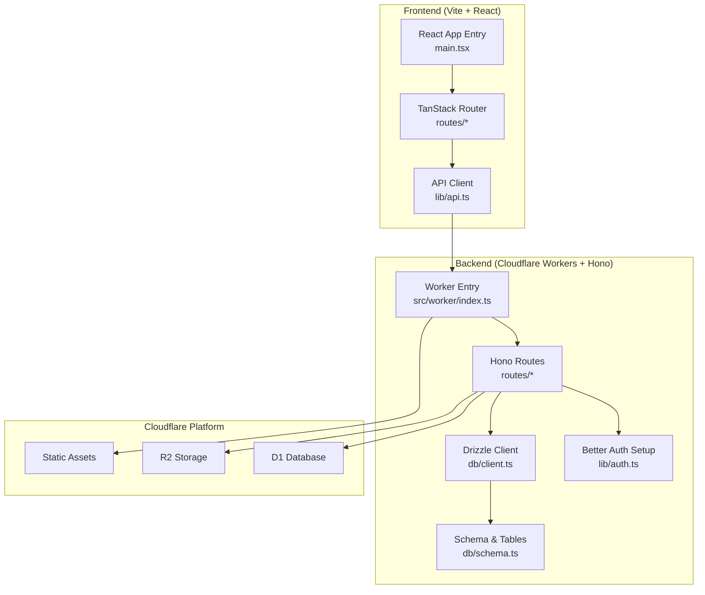
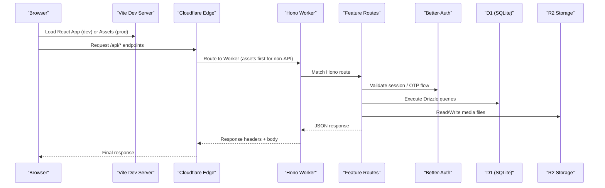
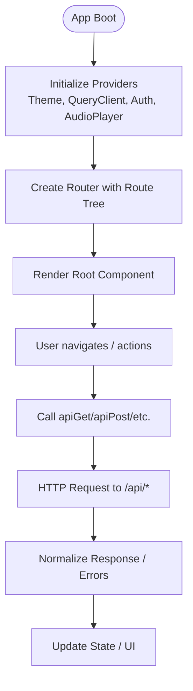
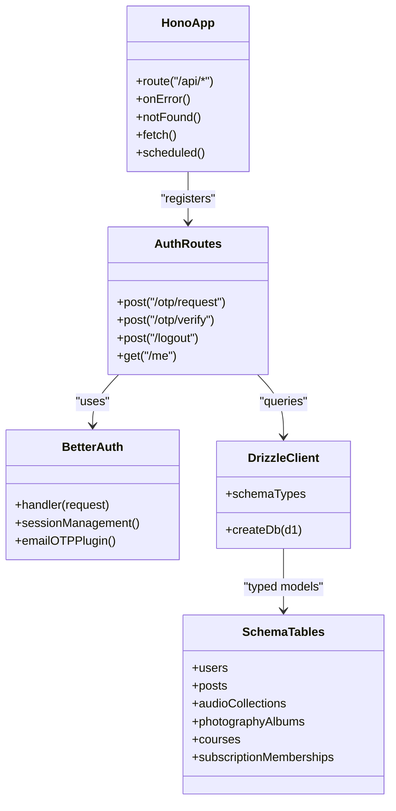
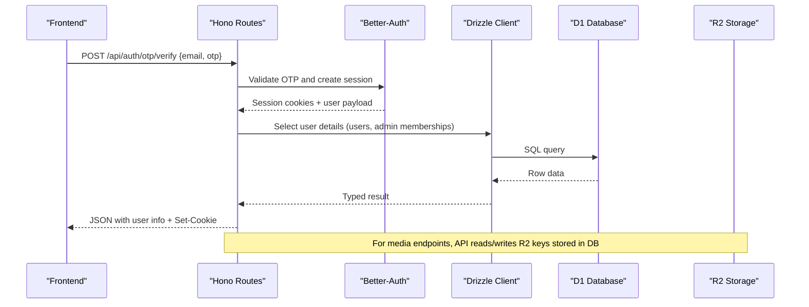
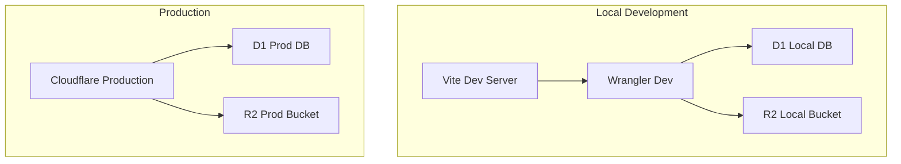
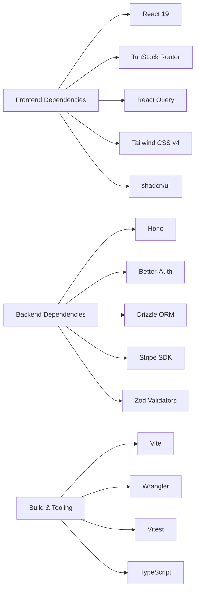

# System Overview

<cite>
**Referenced Files in This Document**
- [package.json](file://package.json)
- [vite.config.ts](file://vite.config.ts)
- [wrangler.json](file://wrangler.json)
- [drizzle.config.ts](file://drizzle.config.ts)
- [src/worker/index.ts](file://src/worker/index.ts)
- [src/react-app/main.tsx](file://src/react-app/main.tsx)
- [src/react-app/routes/__root.tsx](file://src/react-app/routes/__root.tsx)
- [src/react-app/lib/api.ts](file://src/react-app/lib/api.ts)
- [src/worker/db/client.ts](file://src/worker/db/client.ts)
- [src/worker/db/schema.ts](file://src/worker/db/schema.ts)
- [src/worker/lib/auth.ts](file://src/worker/lib/auth.ts)
- [src/worker/routes/auth.ts](file://src/worker/routes/auth.ts)
</cite>

## Table of Contents
1. [Introduction](#introduction)
2. [Project Structure](#project-structure)
3. [Core Components](#core-components)
4. [Architecture Overview](#architecture-overview)
5. [Detailed Component Analysis](#detailed-component-analysis)
6. [Dependency Analysis](#dependency-analysis)
7. [Performance Considerations](#performance-considerations)
8. [Troubleshooting Guide](#troubleshooting-guide)
9. [Conclusion](#conclusion)

## Introduction
Zenith is a full-stack creator network application built on Cloudflare’s edge platform. It separates the React frontend from the backend API layer running on Cloudflare Workers. The frontend is developed with Vite and uses React 19, TanStack Router, and Tailwind CSS v4 for styling. The backend is implemented with Hono and integrates Better-Auth for authentication. Data persistence uses Drizzle ORM against Cloudflare D1 (SQLite), while media storage leverages R2. The system benefits from Cloudflare’s global edge network for low-latency responses and scalable compute.

## Project Structure
The repository organizes code into two primary environments:
- Frontend: src/react-app contains the React application, routes, components, context providers, and UI libraries.
- Backend: src/worker contains the Hono-based API, middleware, database client, schema definitions, and route modules.

Build and runtime configuration:
- Vite config enables React, TanStack Router, Tailwind CSS v4, and Cloudflare integration.
- Wrangler config defines the Worker entrypoint, assets serving, environment variables, D1/R2 bindings, and production settings.
- Drizzle config points to the schema and D1 HTTP driver for migrations and tooling.

**Diagram sources**
- [vite.config.ts:1-28](file://vite.config.ts#L1-L28)
- [wrangler.json:1-139](file://wrangler.json#L1-L139)
- [src/worker/index.ts:1-71](file://src/worker/index.ts#L1-L71)
- [src/react-app/main.tsx:1-38](file://src/react-app/main.tsx#L1-L38)
- [src/react-app/lib/api.ts:1-164](file://src/react-app/lib/api.ts#L1-L164)
- [src/worker/db/client.ts:1-9](file://src/worker/db/client.ts#L1-L9)
- [src/worker/db/schema.ts:1-800](file://src/worker/db/schema.ts#L1-L800)

**Section sources**
- [package.json:1-98](file://package.json#L1-L98)
- [vite.config.ts:1-28](file://vite.config.ts#L1-L28)
- [wrangler.json:1-139](file://wrangler.json#L1-L139)
- [drizzle.config.ts:1-14](file://drizzle.config.ts#L1-L14)

## Core Components
- Frontend Application:
  - React 19 app bootstrapped via main.tsx with TanStack Router and React Query.
  - Tailwind CSS v4 provides utility-first styling; shadcn/ui components are configured via components.json.
  - API client abstracts fetch calls and normalizes errors across GET/POST/PUT/PATCH/DELETE operations.

- Backend API Layer:
  - Hono app registers multiple feature routes under /api/* namespaces.
  - Better-Auth integrated with Drizzle adapter manages sessions, OTP sign-in, and user fields mapping.
  - Drizzle ORM client connects to D1 using sqlite dialect and typed schema.

- Infrastructure Bindings:
  - D1 database binding named DB used by Drizzle client.
  - R2 bucket binding named STORAGE for object storage.
  - Static assets served from dist/client with SPA fallback and worker-first routing for /api/*.

**Section sources**
- [src/react-app/main.tsx:1-38](file://src/react-app/main.tsx#L1-L38)
- [src/react-app/routes/__root.tsx:1-23](file://src/react-app/routes/__root.tsx#L1-L23)
- [src/react-app/lib/api.ts:1-164](file://src/react-app/lib/api.ts#L1-L164)
- [src/worker/index.ts:1-71](file://src/worker/index.ts#L1-L71)
- [src/worker/lib/auth.ts:1-80](file://src/worker/lib/auth.ts#L1-L80)
- [src/worker/db/client.ts:1-9](file://src/worker/db/client.ts#L1-L9)
- [src/worker/db/schema.ts:1-800](file://src/worker/db/schema.ts#L1-L800)
- [wrangler.json:1-139](file://wrangler.json#L1-L139)

## Architecture Overview
The system follows a clear separation between the browser-based React frontend and the serverless Hono API hosted on Cloudflare Workers. Requests originate from the browser, traverse the CDN edge, and are handled by the Worker which routes them through Hono to domain-specific handlers. Business logic interacts with D1 via Drizzle ORM and may use R2 for file uploads/downloads. Static assets are served directly from the Worker’s assets binding with SPA fallback.

**Diagram sources**
- [src/worker/index.ts:1-71](file://src/worker/index.ts#L1-L71)
- [src/worker/routes/auth.ts:1-259](file://src/worker/routes/auth.ts#L1-L259)
- [src/worker/lib/auth.ts:1-80](file://src/worker/lib/auth.ts#L1-L80)
- [src/worker/db/client.ts:1-9](file://src/worker/db/client.ts#L1-L9)
- [wrangler.json:1-139](file://wrangler.json#L1-L139)

## Detailed Component Analysis

### Frontend Application (React 19 + TanStack Router + Tailwind CSS v4)
- Bootstrap: main.tsx initializes providers (theme, query client, auth, audio player) and mounts the router.
- Routing: TanStack Router generates route tree and handles navigation; root route includes global UI elements like Toaster and dev tools.
- Styling: Tailwind CSS v4 imported via index.css with theme variables and animations; shadcn/ui components configured via components.json.
- API Client: lib/api.ts standardizes fetch calls, credentials handling, error normalization, and typed helpers.

**Diagram sources**
- [src/react-app/main.tsx:1-38](file://src/react-app/main.tsx#L1-L38)
- [src/react-app/routes/__root.tsx:1-23](file://src/react-app/routes/__root.tsx#L1-L23)
- [src/react-app/lib/api.ts:1-164](file://src/react-app/lib/api.ts#L1-L164)

**Section sources**
- [src/react-app/main.tsx:1-38](file://src/react-app/main.tsx#L1-L38)
- [src/react-app/routes/__root.tsx:1-23](file://src/react-app/routes/__root.tsx#L1-L23)
- [src/react-app/lib/api.ts:1-164](file://src/react-app/lib/api.ts#L1-L164)

### Backend API Layer (Hono + Better-Auth + Drizzle ORM)
- Worker Entry: index.ts creates a Hono app, registers all feature routes under /api/*, sets error and not-found handlers, and exports fetch/scheduled handlers.
- Authentication: lib/auth.ts configures Better-Auth with Drizzle adapter, email OTP plugin, and maps user fields to custom schema.
- Routes: Example auth routes implement OTP request/verify, logout, and current user retrieval, integrating validation, error handling, and cookie propagation.
- Database: db/client.ts wraps Drizzle with D1 and schema types; db/schema.ts defines tables for users, posts, media, courses, subscriptions, etc.

**Diagram sources**
- [src/worker/index.ts:1-71](file://src/worker/index.ts#L1-L71)
- [src/worker/routes/auth.ts:1-259](file://src/worker/routes/auth.ts#L1-L259)
- [src/worker/lib/auth.ts:1-80](file://src/worker/lib/auth.ts#L1-L80)
- [src/worker/db/client.ts:1-9](file://src/worker/db/client.ts#L1-L9)
- [src/worker/db/schema.ts:1-800](file://src/worker/db/schema.ts#L1-L800)

**Section sources**
- [src/worker/index.ts:1-71](file://src/worker/index.ts#L1-L71)
- [src/worker/routes/auth.ts:1-259](file://src/worker/routes/auth.ts#L1-L259)
- [src/worker/lib/auth.ts:1-80](file://src/worker/lib/auth.ts#L1-L80)
- [src/worker/db/client.ts:1-9](file://src/worker/db/client.ts#L1-L9)
- [src/worker/db/schema.ts:1-800](file://src/worker/db/schema.ts#L1-L800)

### Data Flow: From Request to Database
A typical authenticated request flows through Hono routing, validates identity via Better-Auth, executes Drizzle queries against D1, and returns JSON. Media operations interact with R2.

**Diagram sources**
- [src/worker/routes/auth.ts:1-259](file://src/worker/routes/auth.ts#L1-L259)
- [src/worker/lib/auth.ts:1-80](file://src/worker/lib/auth.ts#L1-L80)
- [src/worker/db/client.ts:1-9](file://src/worker/db/client.ts#L1-L9)
- [src/worker/db/schema.ts:1-800](file://src/worker/db/schema.ts#L1-L800)

**Section sources**
- [src/worker/routes/auth.ts:1-259](file://src/worker/routes/auth.ts#L1-L259)
- [src/worker/lib/auth.ts:1-80](file://src/worker/lib/auth.ts#L1-L80)
- [src/worker/db/client.ts:1-9](file://src/worker/db/client.ts#L1-L9)
- [src/worker/db/schema.ts:1-800](file://src/worker/db/schema.ts#L1-L800)

### Deployment Topology and Infrastructure Requirements
- Runtime: Cloudflare Workers with nodejs_compat flag and observability enabled.
- Assets: Static build output served from dist/client with single-page application fallback; worker-first routing for /api/*.
- Environment: Variables include payment provider, Stripe mode/account, email sender, and base URLs; secrets include Better-Auth secret and Stripe keys.
- Databases: D1 binding named DB with migration directory pointing to drizzle folder; local and production databases configured.
- Storage: R2 bucket binding named STORAGE for media files; local and production buckets configured.
- Tooling: Drizzle Kit configured for D1 HTTP driver with account/database/token credentials.

**Diagram sources**
- [wrangler.json:1-139](file://wrangler.json#L1-L139)
- [drizzle.config.ts:1-14](file://drizzle.config.ts#L1-L14)

**Section sources**
- [wrangler.json:1-139](file://wrangler.json#L1-L139)
- [drizzle.config.ts:1-14](file://drizzle.config.ts#L1-L14)

## Dependency Analysis
- Frontend dependencies: React 19, TanStack Router, React Query, Tailwind CSS v4, shadcn/ui, Recharts, Zod, and various UI utilities.
- Backend dependencies: Hono, Better-Auth, Drizzle ORM, Stripe SDK, Zod validators, and email utilities.
- Build/runtime: Vite for frontend, Wrangler for Workers, Vitest for testing, TypeScript across both environments.

**Diagram sources**
- [package.json:1-98](file://package.json#L1-L98)

**Section sources**
- [package.json:1-98](file://package.json#L1-L98)

## Performance Considerations
- Edge Execution: Workers run close to users, reducing latency; enable observability and traces for monitoring performance.
- Asset Serving: Static assets served directly from the Worker’s assets binding; ensure proper caching headers and SPA fallback.
- Database Access: Use Drizzle’s typed queries and indexes defined in schema to optimize D1 performance.
- Media Handling: Store large files in R2; keep only metadata and keys in D1 to minimize payload sizes.
- Concurrency: Scheduled handlers process background tasks efficiently; batch operations where possible.

[No sources needed since this section provides general guidance]

## Troubleshooting Guide
- Authentication Issues:
  - OTP flows validate attempts and handle too-many-attempts errors; ensure email delivery is configured and allowed senders are set.
  - Cookie propagation is handled explicitly; verify Set-Cookie headers are forwarded correctly.
- API Errors:
  - Centralized error responses return consistent codes and messages; normalize errors in the frontend client.
- Database Migrations:
  - Ensure D1 migrations are applied; tests demonstrate applying SQL statements sequentially.
- Observability:
  - Enable invocation logs and traces in Wrangler config; monitor metrics via Cloudflare dashboard URL provided in environment variables.

**Section sources**
- [src/worker/routes/auth.ts:1-259](file://src/worker/routes/auth.ts#L1-L259)
- [wrangler.json:1-139](file://wrangler.json#L1-L139)

## Conclusion
Zenith’s architecture cleanly separates the React frontend from the Hono-based backend, leveraging Cloudflare’s edge computing for scalability and performance. The technology stack—React 19, TanStack Router, Tailwind CSS v4, Hono, Better-Auth, Drizzle ORM, D1, and R2—provides a modern, type-safe, and efficient foundation. With well-defined data flows, robust error handling, and comprehensive infrastructure configuration, the system supports complex creator workflows while maintaining high availability and low latency.

[No sources needed since this section summarizes without analyzing specific files]