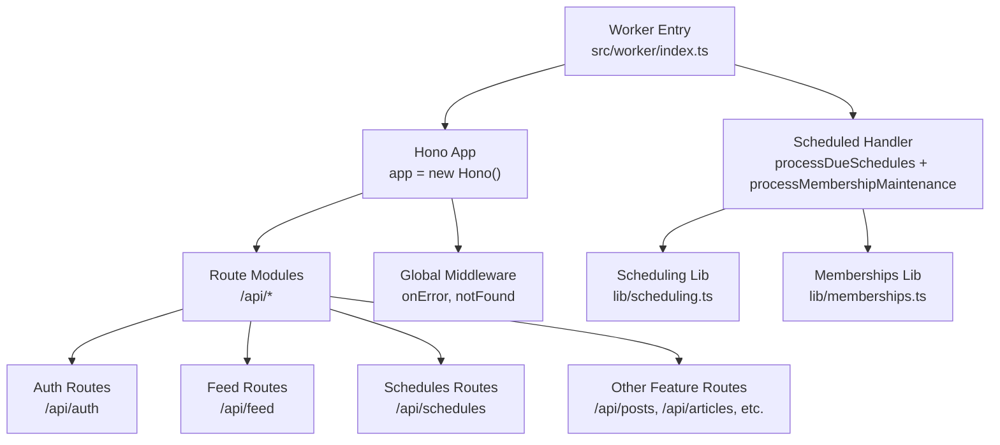
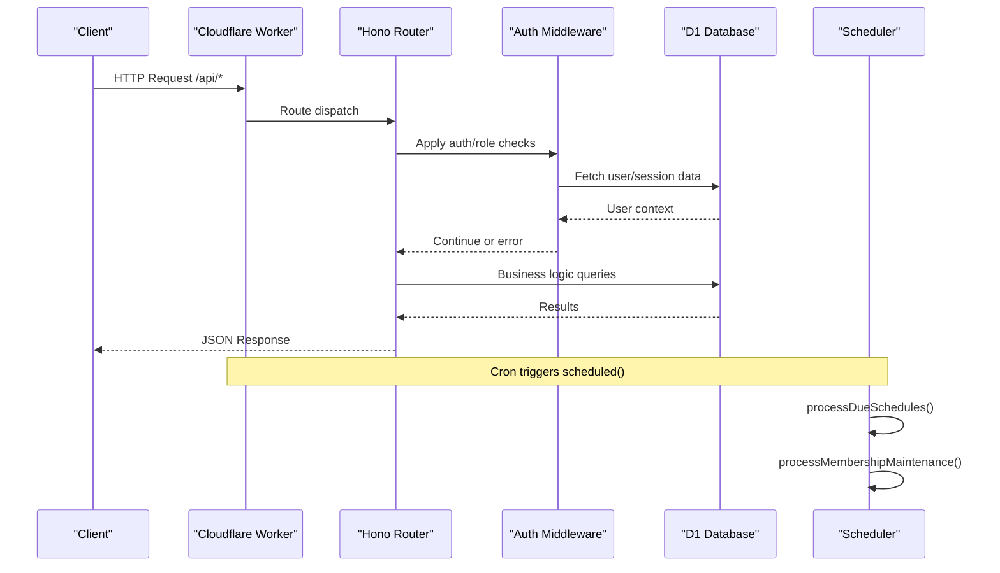
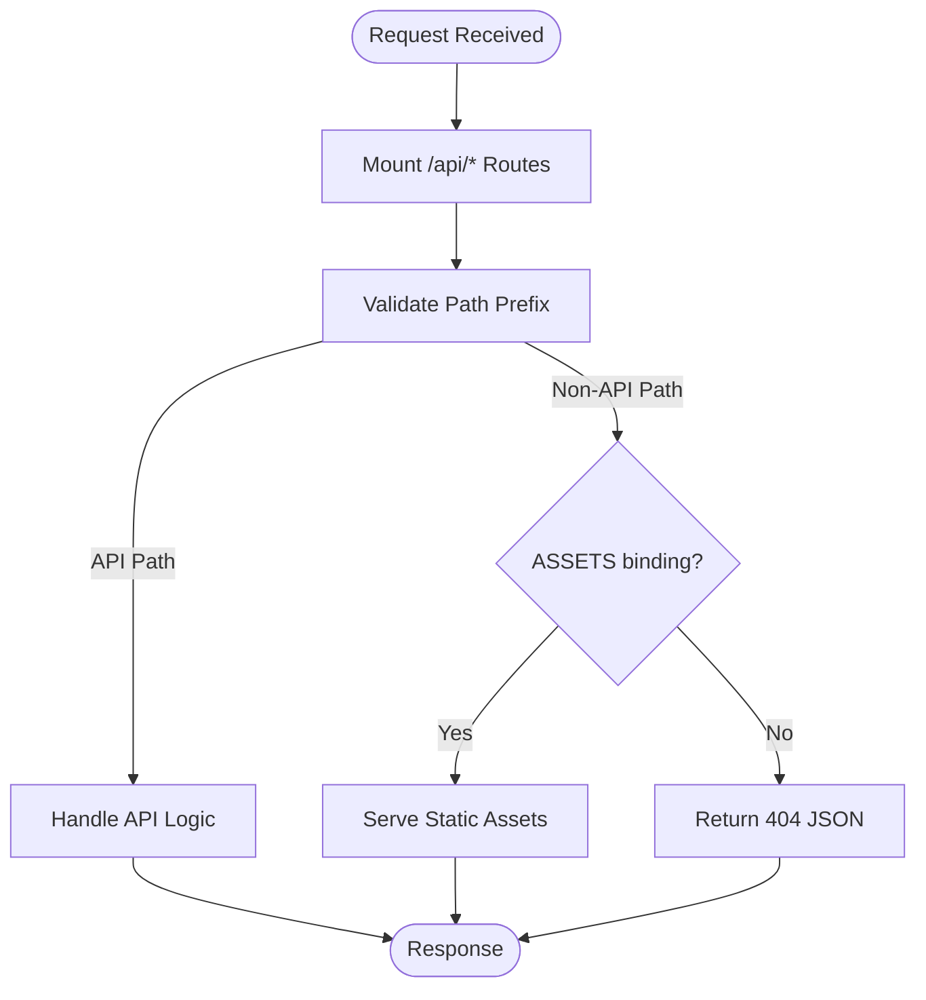
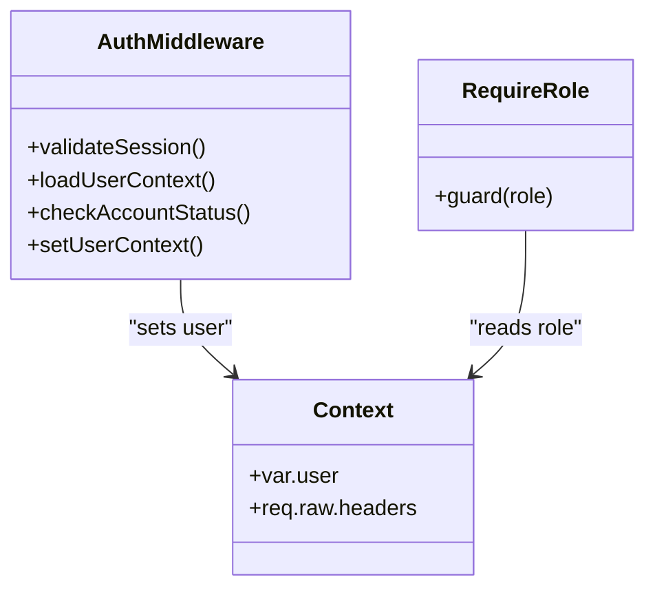
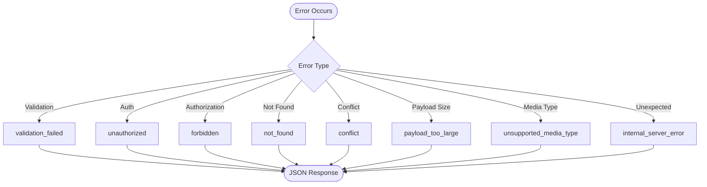
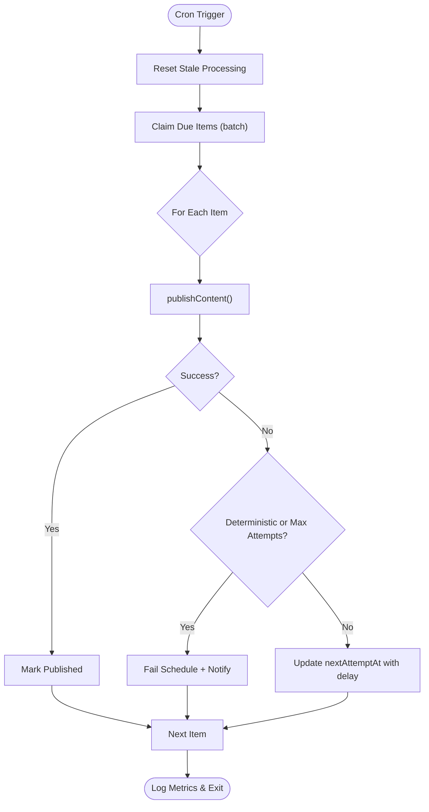
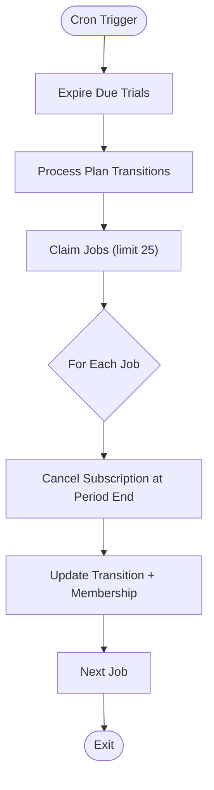
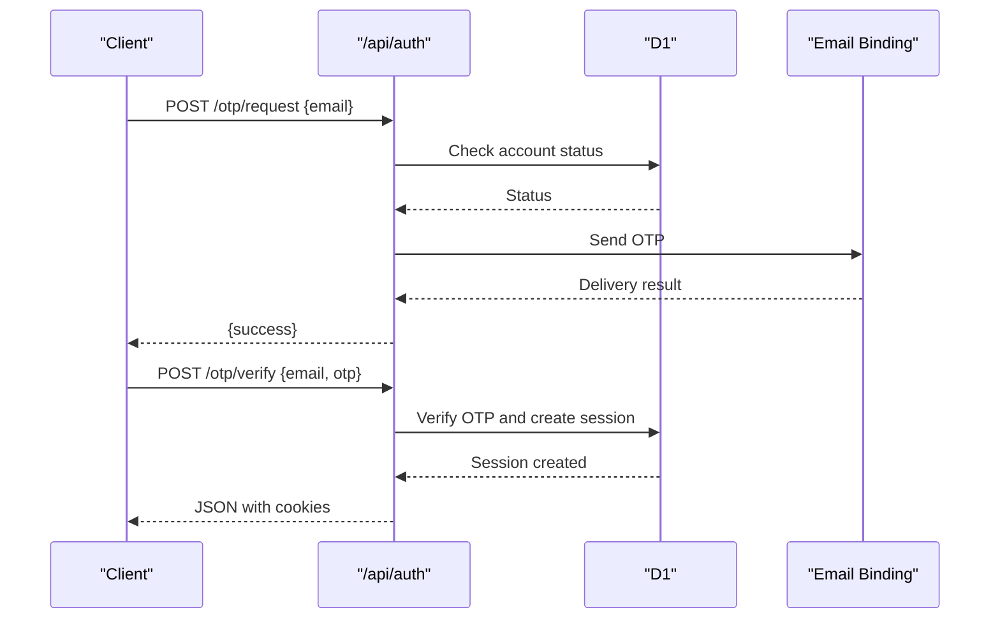
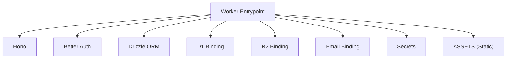

# API Overview

<cite>
**Referenced Files in This Document**
- [index.ts](file://src/worker/index.ts)
- [wrangler.json](file://wrangler.json)
- [package.json](file://package.json)
- [auth.ts](file://src/worker/middleware/auth.ts)
- [http.ts](file://src/worker/lib/http.ts)
- [scheduling.ts](file://src/worker/lib/scheduling.ts)
- [memberships.ts](file://src/worker/lib/memberships.ts)
- [auth.ts](file://src/worker/routes/auth.ts)
- [schedules.ts](file://src/worker/routes/schedules.ts)
- [feed.ts](file://src/worker/routes/feed.ts)
- [schema.ts](file://src/worker/db/schema.ts)
</cite>

## Table of Contents
1. Introduction
2. Project Structure
3. Core Components
4. Architecture Overview
5. Detailed Component Analysis
6. Dependency Analysis
7. Performance Considerations
8. Troubleshooting Guide
9. Conclusion

## Introduction
This document provides a comprehensive overview of the Cloudflare Workers API for the project. It explains how the Hono framework is initialized and configured, how routes are organized under /api/*, the middleware pipeline for authentication and authorization, and the error handling strategy. It also documents the scheduled task system used to process content schedules and membership maintenance, deployment configuration with Wrangler (including environment variables and service bindings), guidance on API versioning, CORS considerations, security headers, and performance best practices for serverless and edge environments.

## Project Structure
The API is implemented as a single Cloudflare Worker entrypoint that wires multiple feature-specific route modules. The worker uses Hono for routing and middleware, Drizzle ORM for database access, and integrates with Cloudflare D1, R2, Email, and Secrets via bindings defined in the Wrangler configuration.



**Diagram sources**
- [index.ts:1-71](file://src/worker/index.ts#L1-L71)
- [scheduling.ts:1-127](file://src/worker/lib/scheduling.ts#L1-L127)
- [memberships.ts:1-144](file://src/worker/lib/memberships.ts#L1-L144)

**Section sources**
- [index.ts:1-71](file://src/worker/index.ts#L1-L71)
- [wrangler.json:1-139](file://wrangler.json#L1-L139)
- [package.json:1-98](file://package.json#L1-L98)

## Core Components
- Hono application initialization and global handlers:
  - Creates a typed Hono app and mounts all /api/* route modules.
  - Global error handler returns a standardized JSON error response.
  - Not-found handler serves static assets when available or returns a 404 JSON for API paths.
- Authentication and authorization middleware:
  - Validates sessions using Better Auth and enriches context with user details from the database.
  - Provides role-based guards for endpoints requiring specific roles.
- Error handling utilities:
  - Centralized functions to return consistent JSON errors with codes and messages.
  - Zod validation hook to convert validation failures into standard responses.
- Scheduled tasks:
  - Cron-triggered jobs process due content schedules and membership maintenance tasks.
  - Robust retry logic with exponential backoff and failure notifications.

**Section sources**
- [index.ts:24-71](file://src/worker/index.ts#L24-L71)
- [auth.ts:1-57](file://src/worker/middleware/auth.ts#L1-L57)
- [http.ts:1-80](file://src/worker/lib/http.ts#L1-L80)
- [scheduling.ts:1-127](file://src/worker/lib/scheduling.ts#L1-L127)
- [memberships.ts:1-144](file://src/worker/lib/memberships.ts#L1-L144)

## Architecture Overview
The API follows a modular architecture where each domain has its own Hono router mounted under a common prefix. Requests flow through global middleware (error/not found) and per-route middleware (authentication and authorization). Data operations use Drizzle ORM against D1, while media storage uses R2. Background processing is handled by the Worker’s scheduled interface.



**Diagram sources**
- [index.ts:24-71](file://src/worker/index.ts#L24-L71)
- [auth.ts:23-50](file://src/worker/middleware/auth.ts#L23-L50)
- [scheduling.ts:42-127](file://src/worker/lib/scheduling.ts#L42-L127)
- [memberships.ts:138-144](file://src/worker/lib/memberships.ts#L138-L144)

## Detailed Component Analysis

### Hono Application and Route Organization
- The worker initializes a single Hono instance and mounts feature routers under /api prefixes.
- Each route module encapsulates its endpoints, validators, and business logic.
- Global onError and notFound handlers ensure consistent error behavior and asset fallback.



**Diagram sources**
- [index.ts:24-60](file://src/worker/index.ts#L24-L60)

**Section sources**
- [index.ts:24-60](file://src/worker/index.ts#L24-L60)

### Authentication and Authorization Middleware
- Session validation is performed via Better Auth; if missing, an unauthorized response is returned.
- User context is loaded from the database including role and account status.
- Suspended accounts receive a forbidden response.
- Role-based guard ensures only authorized roles can access protected endpoints.



**Diagram sources**
- [auth.ts:23-56](file://src/worker/middleware/auth.ts#L23-L56)

**Section sources**
- [auth.ts:1-57](file://src/worker/middleware/auth.ts#L1-L57)

### Error Handling Strategy
- All errors follow a consistent JSON structure with code, message, and optional details.
- Validation errors use a dedicated hook to transform Zod issues into a standard response.
- Common error helpers cover bad request, unauthorized, forbidden, not found, conflict, payload too large, unsupported media type, and internal server error.



**Diagram sources**
- [http.ts:1-80](file://src/worker/lib/http.ts#L1-L80)

**Section sources**
- [http.ts:1-80](file://src/worker/lib/http.ts#L1-L80)

### Scheduled Task System: Content Schedules
- Cron job triggers processDueSchedules which:
  - Resets stale processing entries to pending.
  - Claims due items in batches with optimistic locking.
  - Attempts publication with retry logic and exponential backoff.
  - On deterministic failures or max attempts, marks as failed and notifies creators.
  - Logs metrics for due, published, retried, and failed counts.



**Diagram sources**
- [scheduling.ts:42-127](file://src/worker/lib/scheduling.ts#L42-L127)

**Section sources**
- [scheduling.ts:1-127](file://src/worker/lib/scheduling.ts#L1-L127)

### Scheduled Task System: Membership Maintenance
- Cron job triggers processMembershipMaintenance which:
  - Expires due trial memberships.
  - Processes plan transitions (e.g., cancel at period end) with retries and error logging.
  - Updates subscription records accordingly.



**Diagram sources**
- [memberships.ts:138-144](file://src/worker/lib/memberships.ts#L138-L144)

**Section sources**
- [memberships.ts:1-144](file://src/worker/lib/memberships.ts#L1-L144)

### API Endpoint Patterns and Examples
- Authentication:
  - OTP-based sign-in flow with email verification and session establishment.
  - Protected endpoints enforce role checks.
- Feed:
  - Aggregates posts, articles, audio, photography, and courses for subscribed users with entitlement checks.
- Schedules:
  - CRUD-like endpoints to list, fetch, and schedule content with validation and ownership checks.



**Diagram sources**
- [auth.ts:135-200](file://src/worker/routes/auth.ts#L135-L200)

**Section sources**
- [auth.ts:1-200](file://src/worker/routes/auth.ts#L1-L200)
- [feed.ts:1-200](file://src/worker/routes/feed.ts#L1-L200)
- [schedules.ts:1-200](file://src/worker/routes/schedules.ts#L1-L200)

### Data Models and Relationships
- Core entities include users, posts, content schedules, and membership-related tables.
- Indexes optimize queries for moderation, publishing, and entitlement checks.

```mermaid
erDiagram
USERS {
text id PK
text email UK
text username UK
text role
text account_status
timestamp created_at
timestamp updated_at
}
POSTS {
text id PK
text author_id FK
text kind
text slug
text body
text moderation_status
timestamp published_at
timestamp created_at
}
CONTENT_SCHEDULES {
text post_id PK FK
text creator_id FK
text status
timestamp scheduled_for
timestamp next_attempt_at
int attempt_count
int revision
timestamp processing_started_at
text last_error_code
text last_error_message
timestamp published_at
timestamp created_at
timestamp updated_at
}
SUBSCRIPTION_MEMBERSHIPS {
text id PK
text subscriber_id FK
text creator_id FK
text status
int trial_ends_at
timestamp created_at
timestamp updated_at
}
USERS ||--o{ POSTS : "author"
POSTS ||--o{ CONTENT_SCHEDULES : "scheduled"
USERS ||--o{ SUBSCRIPTION_MEMBERSHIPS : "subscriber"
USERS ||--o{ SUBSCRIPTION_MEMBERSHIPS : "creator"
```

**Diagram sources**
- [schema.ts:1-200](file://src/worker/db/schema.ts#L1-L200)

**Section sources**
- [schema.ts:1-200](file://src/worker/db/schema.ts#L1-L200)

## Dependency Analysis
The worker depends on several Cloudflare services and libraries:
- Hono for routing and middleware.
- Drizzle ORM for schema definitions and queries.
- Better Auth for session management.
- Wrangler for deployment configuration, including D1, R2, Email, and secrets.



**Diagram sources**
- [index.ts:1-23](file://src/worker/index.ts#L1-L23)
- [wrangler.json:52-113](file://wrangler.json#L52-L113)

**Section sources**
- [wrangler.json:1-139](file://wrangler.json#L1-L139)
- [package.json:14-57](file://package.json#L14-L57)

## Performance Considerations
- Serverless constraints:
  - Keep request handling minimal and avoid heavy CPU-bound work in handlers.
  - Use batch operations and limit query sizes to reduce latency and memory usage.
- Edge computing:
  - Prefer caching strategies where possible (e.g., CDN for static assets).
  - Minimize cold start impact by avoiding unnecessary initialization.
- Database efficiency:
  - Leverage indexes defined in schema for frequent queries (moderation, publishing, entitlement).
  - Use optimistic locking for concurrent claims in scheduled tasks.
- Observability:
  - Enable invocation logs and traces via Wrangler observability settings.
  - Log structured events for scheduling and membership maintenance to aid debugging.

[No sources needed since this section provides general guidance]

## Troubleshooting Guide
- Authentication issues:
  - Ensure session cookies are correctly set and forwarded.
  - Verify account status is active; suspended accounts receive forbidden responses.
- Validation errors:
  - Use the Zod validation hook to inspect issues and adjust client payloads.
- Scheduled tasks:
  - Review logs for retry events and failure reasons.
  - Check nextAttemptAt fields to understand backoff behavior.
- Asset serving:
  - Confirm ASSETS binding and SPA not-found handling for non-API routes.

**Section sources**
- [auth.ts:23-50](file://src/worker/middleware/auth.ts#L23-L50)
- [http.ts:77-80](file://src/worker/lib/http.ts#L77-L80)
- [scheduling.ts:100-127](file://src/worker/lib/scheduling.ts#L100-L127)
- [index.ts:52-60](file://src/worker/index.ts#L52-L60)

## Conclusion
The API leverages Hono for modular routing, robust middleware for authentication and authorization, and centralized error handling to provide a consistent developer experience. Scheduled tasks ensure reliable background processing for content publication and membership lifecycle management. Deployment is streamlined via Wrangler with clear bindings for databases, storage, email, and secrets. Following the outlined performance and troubleshooting guidance will help maintain a responsive and resilient serverless API on Cloudflare’s edge network.

[No sources needed since this section summarizes without analyzing specific files]