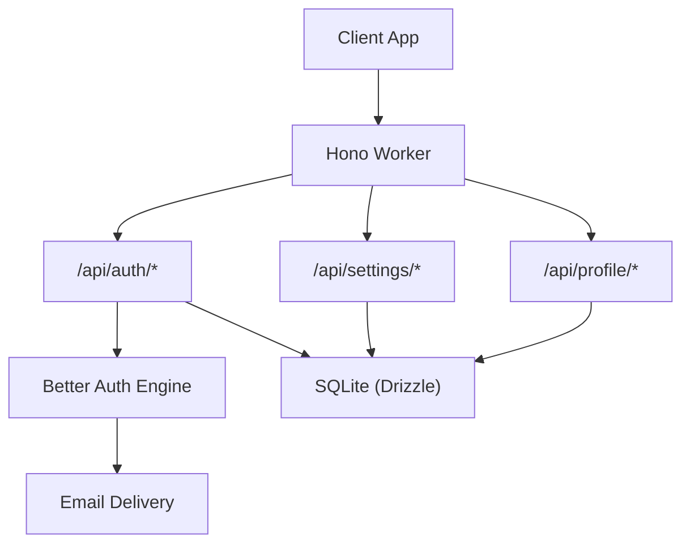
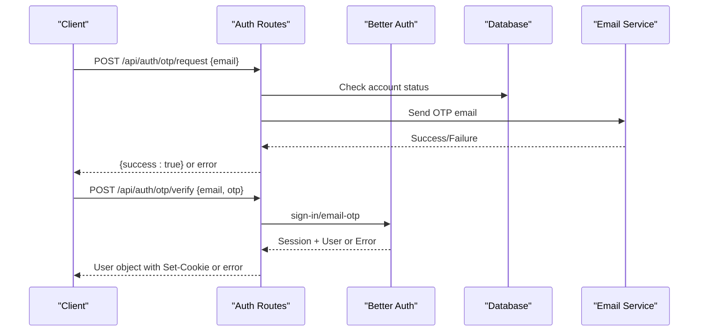
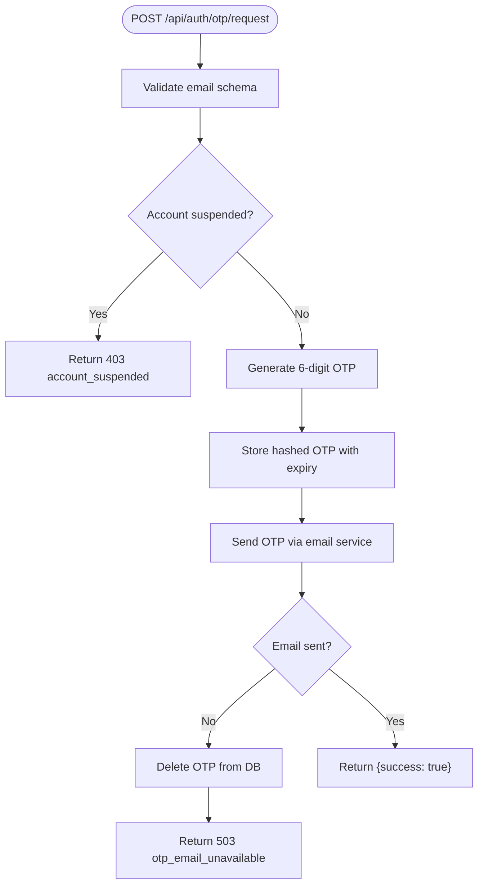
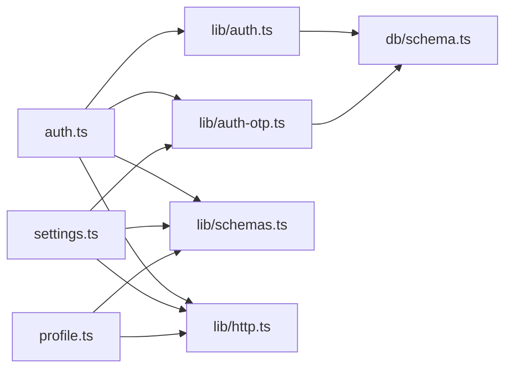

# Authentication API Endpoints

<cite>
**Referenced Files in This Document**
- [index.ts](file://src/worker/index.ts)
- [auth.ts](file://src/worker/routes/auth.ts)
- [settings.ts](file://src/worker/routes/settings.ts)
- [profile.ts](file://src/worker/routes/profile.ts)
- [auth.ts](file://src/worker/lib/auth.ts)
- [auth-otp.ts](file://src/worker/lib/auth-otp.ts)
- [schemas.ts](file://src/worker/lib/schemas.ts)
- [http.ts](file://src/worker/lib/http.ts)
- [auth.ts](file://src/react-app/lib/auth.ts)
- [api.ts](file://src/react-app/lib/api.ts)
- [AuthContext.tsx](file://src/react-app/context/AuthContext.tsx)
- [LoginPage.tsx](file://src/react-app/pages/LoginPage.tsx)
- [RegisterPage.tsx](file://src/react-app/pages/RegisterPage.tsx)
</cite>

## Table of Contents
1. Introduction
2. Project Structure
3. Core Components
4. Architecture Overview
5. Detailed Component Analysis
6. Dependency Analysis
7. Performance Considerations
8. Troubleshooting Guide
9. Conclusion

## Introduction
This document provides comprehensive API documentation for authentication-related endpoints, including login via OTP, registration through OTP verification, profile management, and account settings. It specifies HTTP methods, URL patterns, request/response schemas, authentication requirements, error codes, validation rules, status codes, security headers behavior, CORS configuration, rate limiting policies, and client implementation guidelines.

## Project Structure
The authentication system is implemented as a Hono-based worker with modular routes:
- /api/auth: Authentication endpoints (OTP sign-in, logout, session management)
- /api/settings: Account settings (avatar, username, email change via OTP, profile fields)
- /api/profile: Public and authenticated profile endpoints (avatar retrieval, user profiles)
- Shared libraries: Better Auth integration, OTP utilities, Zod schemas, HTTP helpers
- Frontend clients: React app uses TanStack Query and a typed API client to call endpoints

**Diagram sources**
- [index.ts:24-45](file://src/worker/index.ts#L24-L45)
- [auth.ts:14-16](file://src/worker/routes/auth.ts#L14-L16)
- [settings.ts:31-32](file://src/worker/routes/settings.ts#L31-L32)
- [profile.ts:17-18](file://src/worker/routes/profile.ts#L17-L18)
- [auth.ts:9-77](file://src/worker/lib/auth.ts#L9-L77)

**Section sources**
- [index.ts:24-45](file://src/worker/index.ts#L24-L45)

## Core Components
- Authentication routes: OTP sign-in flow, logout, and passthrough to Better Auth native endpoints
- Settings routes: Avatar upload, username update, email change via OTP, profile updates
- Profile routes: Avatar retrieval by userId, public profile by username, creator-specific data
- Better Auth integration: Configured with Drizzle adapter, email OTP plugin, custom user fields
- OTP utilities: Generation, hashing, storage, verification with attempt limits and expiration
- Validation schemas: Zod schemas for all request payloads
- HTTP helpers: Standardized error responses and status codes

**Section sources**
- [auth.ts:14-259](file://src/worker/routes/auth.ts#L14-L259)
- [settings.ts:31-327](file://src/worker/routes/settings.ts#L31-L327)
- [profile.ts:17-329](file://src/worker/routes/profile.ts#L17-L329)
- [auth.ts:9-77](file://src/worker/lib/auth.ts#L9-L77)
- [auth-otp.ts:1-124](file://src/worker/lib/auth-otp.ts#L1-L124)
- [schemas.ts:1-221](file://src/worker/lib/schemas.ts#L1-L221)
- [http.ts:1-80](file://src/worker/lib/http.ts#L1-L80)

## Architecture Overview
The authentication architecture combines Hono routing, Better Auth for session handling, and Drizzle ORM for persistence. OTP flows are enforced via hashed tokens stored in the verification table with strict attempt limits and expiration.

**Diagram sources**
- [auth.ts:135-212](file://src/worker/routes/auth.ts#L135-L212)
- [auth.ts:9-77](file://src/worker/lib/auth.ts#L9-L77)
- [auth-otp.ts:67-73](file://src/worker/lib/auth-otp.ts#L67-L73)

**Section sources**
- [auth.ts:135-212](file://src/worker/routes/auth.ts#L135-L212)

## Detailed Component Analysis

### Authentication Endpoints (/api/auth)
- POST /api/auth/otp/request
  - Purpose: Request a 6-digit OTP for sign-in or registration
  - Authentication: None
  - Request body: { email: string }
  - Response: { success: true } on success
  - Errors: 403 if account suspended; 503 if email delivery fails
- POST /api/auth/otp/verify
  - Purpose: Verify OTP and establish session
  - Authentication: None
  - Request body: { email: string, otp: string }
  - Response: User object with Set-Cookie header for session
  - Errors: 400 invalid_otp; 403 too_many_otp_attempts
- POST /api/auth/logout
  - Purpose: Invalidate session
  - Authentication: Required (session cookie)
  - Request body: None
  - Response: { message: "Logged out" }
  - Errors: 401 unauthorized
- GET /api/auth/me
  - Purpose: Retrieve current user profile
  - Authentication: Required (session cookie)
  - Response: User object with role, adminRole, etc.
  - Errors: 401 unauthorized; 404 not found

**Diagram sources**
- [auth.ts:135-164](file://src/worker/routes/auth.ts#L135-L164)
- [auth-otp.ts:67-73](file://src/worker/lib/auth-otp.ts#L67-L73)

**Section sources**
- [auth.ts:127-212](file://src/worker/routes/auth.ts#L127-L212)
- [auth.ts:222-249](file://src/worker/routes/auth.ts#L222-L249)

### Registration Flow
Registration uses the same OTP flow as login. New users are created during OTP verification with generated usernames and default roles.

- POST /api/auth/register: Disabled (returns 400 password_auth_disabled)
- POST /api/auth/login: Disabled (returns 400 password_auth_disabled)
- Registration occurs during POST /api/auth/otp/verify when user doesn't exist

**Section sources**
- [auth.ts:127-131](file://src/worker/routes/auth.ts#L127-L131)
- [auth.ts:182-189](file://src/worker/routes/auth.ts#L182-L189)

### Profile Management (/api/profile)
- GET /api/profile/avatar/:userId
  - Purpose: Retrieve user avatar image
  - Authentication: None
  - Path params: { userId: string }
  - Response: Image binary with appropriate Content-Type
  - Errors: 404 not found
- GET /api/profile/:username
  - Purpose: Get public profile information
  - Authentication: None
  - Path params: { username: string }
  - Response: Profile object with categories and tabs for creators
  - Errors: 404 not found
- GET /api/profile/:username/subscriptions
  - Purpose: List subscriptions for a user
  - Authentication: None
  - Path params: { username: string }
  - Response: { subscriptions: [...] }
  - Errors: 404 not found
- GET /api/profile/:username/subscribers
  - Purpose: List subscribers for a creator
  - Authentication: Required (session cookie)
  - Path params: { username: string }
  - Response: { subscribers: [...] }
  - Errors: 404 not found; requires creator role

**Section sources**
- [profile.ts:22-82](file://src/worker/routes/profile.ts#L22-L82)
- [profile.ts:86-155](file://src/worker/routes/profile.ts#L86-L155)

### Account Settings (/api/settings)
- PUT /api/settings/avatar
  - Purpose: Upload/update user avatar
  - Authentication: Required (session cookie)
  - Request: multipart/form-data with 'avatar' field
  - Allowed types: image/jpeg, image/png, image/webp
  - Max size: 5 MB
  - Response: { avatarUrl: string }
  - Errors: 422 validation_failed; 415 unsupported_media_type; 413 payload_too_large
- PUT /api/settings/password
  - Purpose: Password update (disabled)
  - Authentication: Required (session cookie)
  - Response: 400 password_auth_disabled
- POST /api/settings/email/otp/request
  - Purpose: Request OTP for email change
  - Authentication: Required (session cookie)
  - Request body: { newEmail: string }
  - Response: { success: true }
  - Errors: 409 conflict if email taken; 503 otp_email_unavailable
- POST /api/settings/email/otp/verify
  - Purpose: Verify email change OTP and update email
  - Authentication: Required (session cookie)
  - Request body: { newEmail: string, otp: string }
  - Response: { message: "Email updated", email: string }
  - Errors: 400 invalid_otp; 403 too_many_attempts; 409 conflict
- PUT /api/settings/email
  - Purpose: Direct email update (disabled)
  - Authentication: Required (session cookie)
  - Response: 400 password_auth_disabled
- PUT /api/settings/username
  - Purpose: Update username
  - Authentication: Required (session cookie)
  - Request body: { newUsername: string }
  - Response: { username: string }
  - Errors: 409 conflict if username taken
- PUT /api/settings/profile
  - Purpose: Update display name, tagline, social links
  - Authentication: Required (session cookie)
  - Request body: { displayName: string, tagline?: string, socialLinks?: {...} }
  - Response: Updated profile fields
  - Errors: 422 validation_failed

**Section sources**
- [settings.ts:68-133](file://src/worker/routes/settings.ts#L68-L133)
- [settings.ts:148-203](file://src/worker/routes/settings.ts#L148-L203)
- [settings.ts:207-255](file://src/worker/routes/settings.ts#L207-L255)
- [settings.ts:270-305](file://src/worker/routes/settings.ts#L270-L305)
- [settings.ts:309-326](file://src/worker/routes/settings.ts#L309-L326)

### OTP Security and Verification
- OTP length: 6 digits
- Expiration: 300 seconds (5 minutes)
- Maximum attempts: 3
- Storage: Hashed OTPs stored in verification table with attempt counting
- Verification: Constant-time comparison to prevent timing attacks

**Section sources**
- [auth-otp.ts:5-7](file://src/worker/lib/auth-otp.ts#L5-L7)
- [auth-otp.ts:40-43](file://src/worker/lib/auth-otp.ts#L40-L43)
- [auth-otp.ts:87-123](file://src/worker/lib/auth-otp.ts#L87-L123)

### Better Auth Integration
- Base URL and trusted origins configured
- Database adapter using Drizzle with SQLite
- Email OTP plugin enabled with custom send function
- Custom user fields mapped to database columns
- Password authentication disabled

**Section sources**
- [auth.ts:9-77](file://src/worker/lib/auth.ts#L9-L77)

## Dependency Analysis
The authentication system has clear separation of concerns with minimal coupling between components.

**Diagram sources**
- [auth.ts:1-12](file://src/worker/routes/auth.ts#L1-L12)
- [settings.ts:1-20](file://src/worker/routes/settings.ts#L1-L20)
- [profile.ts:1-8](file://src/worker/routes/profile.ts#L1-L8)
- [auth.ts:1-7](file://src/worker/lib/auth.ts#L1-L7)
- [auth-otp.ts:1-4](file://src/worker/lib/auth-otp.ts#L1-L4)

**Section sources**
- [auth.ts:1-12](file://src/worker/routes/auth.ts#L1-L12)
- [settings.ts:1-20](file://src/worker/routes/settings.ts#L1-L20)
- [profile.ts:1-8](file://src/worker/routes/profile.ts#L1-L8)

## Performance Considerations
- OTP generation uses cryptographically secure random values
- Database queries are optimized with proper indexing on frequently accessed fields
- File uploads validate content type and size before processing
- Session management leverages Better Auth's efficient cookie-based approach
- Email delivery failures are handled gracefully without blocking user operations

[No sources needed since this section provides general guidance]

## Troubleshooting Guide
Common error codes and their meanings:
- 400 bad_request: General request validation failure
- 401 unauthorized: Missing or invalid session
- 403 forbidden: Insufficient permissions or account suspended
- 404 not_found: Resource not found
- 409 conflict: Duplicate resource (email/username already exists)
- 422 validation_failed: Schema validation errors
- 413 payload_too_large: File exceeds size limit
- 415 unsupported_media_type: Invalid file format
- 503 otp_email_unavailable: Email service temporarily unavailable

Error response format:
{
  "error": {
    "code": "error_code",
    "message": "Human-readable message",
    "details": {} // Optional additional context
  }
}

**Section sources**
- [http.ts:23-80](file://src/worker/lib/http.ts#L23-L80)

## Conclusion
The authentication system provides a secure, modern approach to user authentication using OTP-based sign-in instead of traditional passwords. The implementation follows best practices for security, validation, and error handling while maintaining a clean separation of concerns across modules. The API is designed to be intuitive for both web and mobile clients with consistent error handling and clear status codes.

[No sources needed since this section summarizes without analyzing specific files]