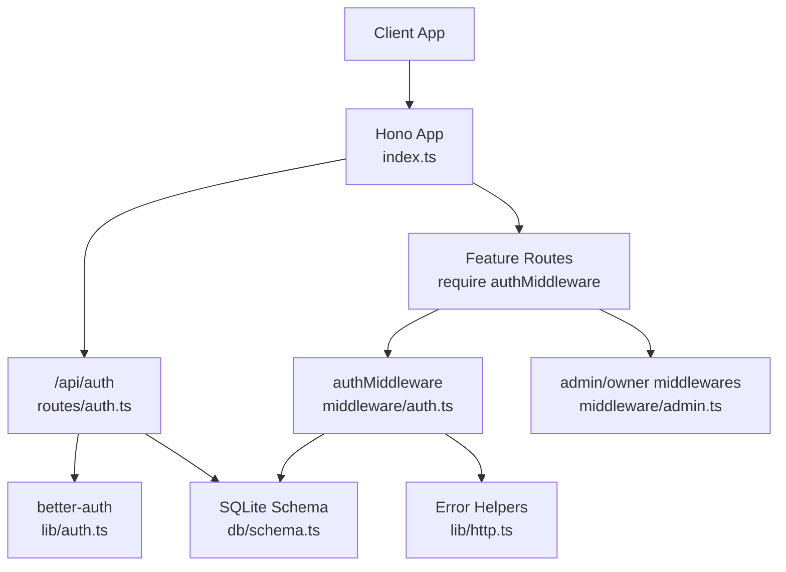
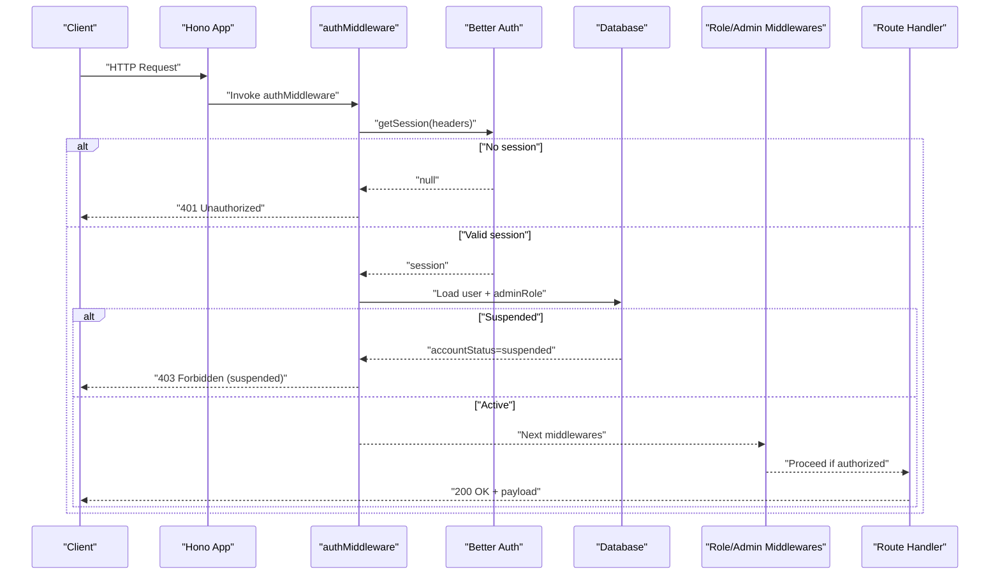
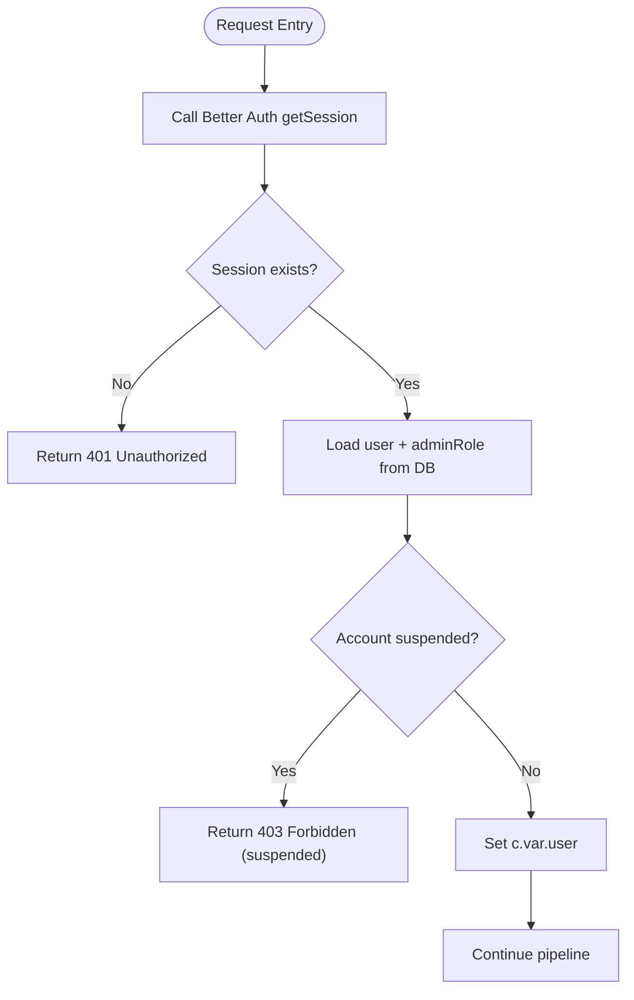
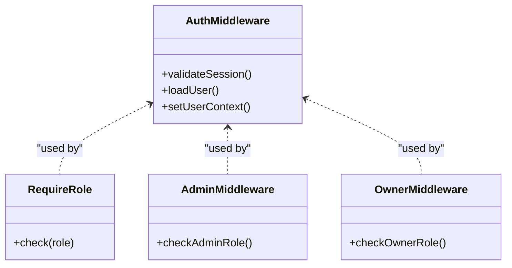
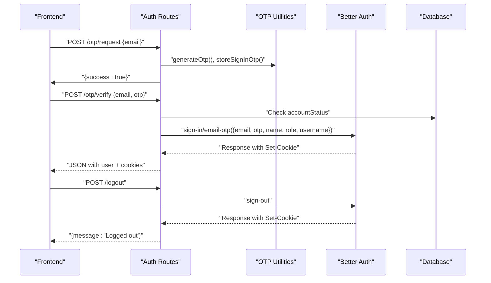
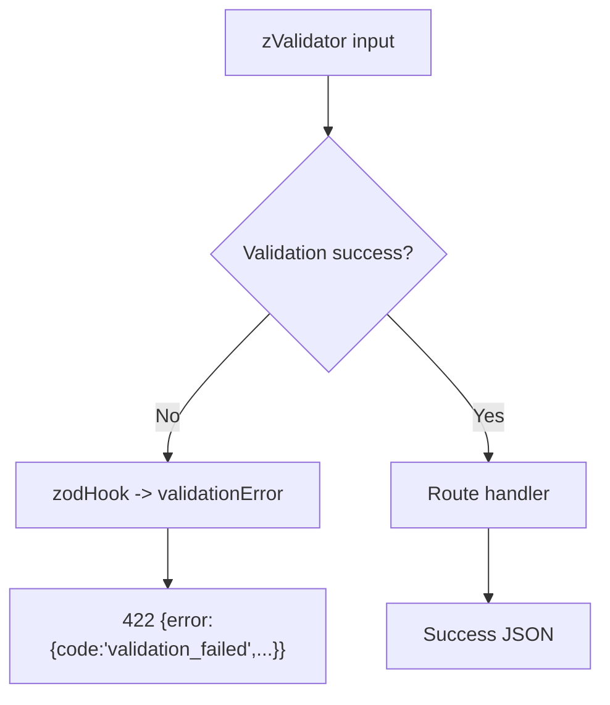
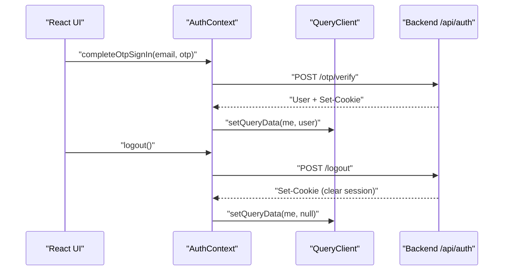
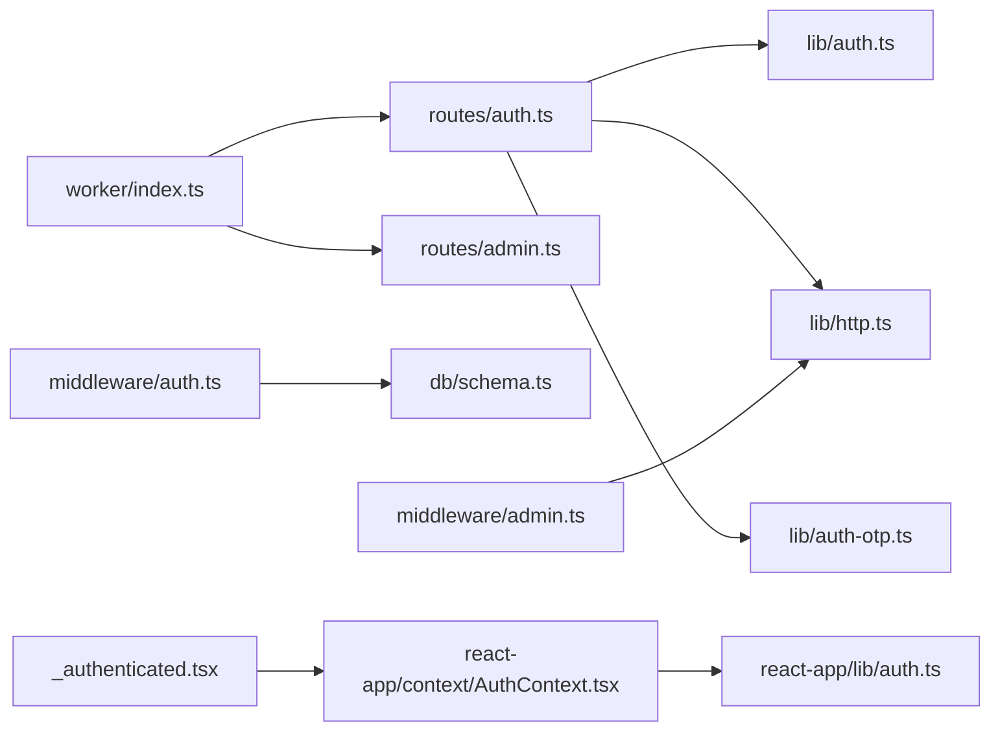

# Authentication Middleware

<cite>
**Referenced Files in This Document**
- [auth.ts](file://src/worker/middleware/auth.ts)
- [admin.ts](file://src/worker/middleware/admin.ts)
- [auth_routes.ts](file://src/worker/routes/auth.ts)
- [auth_lib.ts](file://src/worker/lib/auth.ts)
- [http.ts](file://src/worker/lib/http.ts)
- [index.ts](file://src/worker/index.ts)
- [schema.ts](file://src/worker/db/schema.ts)
- [auth_otp.ts](file://src/worker/lib/auth-otp.ts)
- [AuthContext.tsx](file://src/react-app/context/AuthContext.tsx)
- [auth_client.ts](file://src/react-app/lib/auth.ts)
- [_authenticated.tsx](file://src/react-app/routes/_authenticated.tsx)
- [ProtectedRoute.tsx](file://src/react-app/components/ProtectedRoute.tsx)
</cite>

## Table of Contents
1. Introduction
2. Project Structure
3. Core Components
4. Architecture Overview
5. Detailed Component Analysis
6. Dependency Analysis
7. Performance Considerations
8. Troubleshooting Guide
9. Conclusion

## Introduction
This document explains the authentication middleware system, covering request validation, token extraction and verification, user context injection, role-based access control (RBAC), permission checks, authorization workflows, protected route creation, custom middleware composition, error response formatting, and common scenarios such as session validation, token refresh, and logout handling. It also documents integration patterns with the frontend authentication flow and state synchronization.

## Project Structure
The backend is a Hono application that wires multiple feature routes under /api/* namespaces. Authentication is implemented via:
- A global app entrypoint that mounts all route groups
- An auth middleware that validates sessions and injects user context
- Role and admin RBAC middlewares
- Auth routes for OTP sign-in, logout, and current user retrieval
- Better Auth library integration for session management and email OTP flows
- Frontend React Query context and API helpers to manage session state

**Diagram sources**
- [index.ts:24-45](file://src/worker/index.ts#L24-L45)
- [auth_routes.ts:14-259](file://src/worker/routes/auth.ts#L14-L259)
- [auth_lib.ts:9-77](file://src/worker/lib/auth.ts#L9-L77)
- [schema.ts:107-165](file://src/worker/db/schema.ts#L107-L165)
- [auth.ts:23-50](file://src/worker/middleware/auth.ts#L23-L50)
- [admin.ts:5-13](file://src/worker/middleware/admin.ts#L5-L13)
- [http.ts:23-75](file://src/worker/lib/http.ts#L23-L75)

**Section sources**
- [index.ts:24-45](file://src/worker/index.ts#L24-L45)

## Core Components
- Auth middleware: Validates session via Better Auth, loads enriched user data from DB, enforces account status, and injects c.var.user into the request context.
- Role and admin middlewares: Enforce subscriber/creator roles and owner/moderator permissions.
- Auth routes: Provide OTP sign-in, OTP verification, logout, and current user endpoints; forward native Better Auth endpoints when not blocked.
- Better Auth configuration: Sets up email OTP plugin, database adapter, and user fields mapping.
- HTTP utilities: Centralized error response formatting and validators hook.
- Frontend AuthContext: Manages current user, OTP sign-in mutation, logout mutation, and query invalidation on unauthorized events.

**Section sources**
- [auth.ts:8-50](file://src/worker/middleware/auth.ts#L8-L50)
- [admin.ts:5-13](file://src/worker/middleware/admin.ts#L5-L13)
- [auth_routes.ts:14-259](file://src/worker/routes/auth.ts#L14-L259)
- [auth_lib.ts:9-77](file://src/worker/lib/auth.ts#L9-L77)
- [http.ts:23-75](file://src/worker/lib/http.ts#L23-L75)
- [AuthContext.tsx:23-83](file://src/react-app/context/AuthContext.tsx#L23-L83)

## Architecture Overview
The request lifecycle for protected endpoints:
1. Request arrives at Hono app and matches a route group.
2. For protected routes, authMiddleware runs first:
   - Creates a Better Auth instance using baseURL and env.
   - Calls getSession() with incoming headers to validate the session cookie/token.
   - If no session, returns 401 unauthorized.
   - Loads user profile including role and adminRole from DB.
   - Rejects suspended accounts with 403.
   - Injects c.set('user', ...) into context.
3. Additional middlewares (role or admin) check c.var.user.role/adminRole and return 403 if insufficient.
4. Route handler executes business logic with authenticated user available.

**Diagram sources**
- [auth.ts:23-50](file://src/worker/middleware/auth.ts#L23-L50)
- [auth_routes.ts:224-249](file://src/worker/routes/auth.ts#L224-L249)
- [admin.ts:5-13](file://src/worker/middleware/admin.ts#L5-L13)
- [auth_lib.ts:9-77](file://src/worker/lib/auth.ts#L9-L77)
- [schema.ts:107-165](file://src/worker/db/schema.ts#L107-L165)

## Detailed Component Analysis

### Auth Middleware and User Context Injection
- Extracts session via Better Auth’s getSession using request headers.
- Queries users table joined with admin_memberships to populate role and adminRole.
- Enforces accountStatus active vs suspended.
- Sets c.var.user for downstream handlers.

**Diagram sources**
- [auth.ts:23-50](file://src/worker/middleware/auth.ts#L23-L50)
- [schema.ts:5-32](file://src/worker/db/schema.ts#L5-L32)
- [schema.ts:35-43](file://src/worker/db/schema.ts#L35-L43)

**Section sources**
- [auth.ts:8-50](file://src/worker/middleware/auth.ts#L8-L50)

### Role-Based Access Control and Permission Checking
- requireRole(role): Ensures c.var.user.role matches required role; otherwise returns 403.
- adminMiddleware: Requires non-null adminRole.
- ownerMiddleware: Requires adminRole === 'owner'.

**Diagram sources**
- [auth.ts:52-56](file://src/worker/middleware/auth.ts#L52-L56)
- [admin.ts:5-13](file://src/worker/middleware/admin.ts#L5-L13)

**Section sources**
- [auth.ts:52-56](file://src/worker/middleware/auth.ts#L52-L56)
- [admin.ts:5-13](file://src/worker/middleware/admin.ts#L5-L13)

### OTP Sign-In Flow and Token Verification
- POST /api/auth/otp/request: Generates OTP, stores hashed OTP in verification table, sends email.
- POST /api/auth/otp/verify: Verifies OTP against stored hash, calls Better Auth sign-in/email-otp, sets cookies, returns legacy user shape.
- POST /api/auth/logout: Signs out via Better Auth and clears cookies.
- GET /api/auth/me: Returns current user details after authMiddleware.

**Diagram sources**
- [auth_routes.ts:135-220](file://src/worker/routes/auth.ts#L135-L220)
- [auth_otp.ts:26-77](file://src/worker/lib/auth-otp.ts#L26-L77)
- [auth_lib.ts:9-77](file://src/worker/lib/auth.ts#L9-L77)

**Section sources**
- [auth_routes.ts:135-220](file://src/worker/routes/auth.ts#L135-L220)
- [auth_otp.ts:1-124](file://src/worker/lib/auth-otp.ts#L1-L124)
- [auth_lib.ts:9-77](file://src/worker/lib/auth.ts#L9-L77)

### Error Response Formatting and Validation Hook
- Centralized errorResponse helper standardizes error payloads with code, message, and optional details.
- zodHook integrates Zod validation errors into consistent 422 responses.
- Convenience functions for common statuses: unauthorized, forbidden, notFound, conflict, etc.

**Diagram sources**
- [http.ts:23-79](file://src/worker/lib/http.ts#L23-L79)

**Section sources**
- [http.ts:23-79](file://src/worker/lib/http.ts#L23-L79)

### Protected Route Creation and Custom Middleware Composition
- Feature routes apply authMiddleware globally or per-route to enforce authentication.
- Admin routes apply both authMiddleware and adminMiddleware/ownerMiddleware to restrict access.
- Example usage patterns:
  - Global protection: adminRoutes.use('*', authMiddleware, adminMiddleware)
  - Per-route protection: authRoutes.post('/otp/request', zValidator(...), handler)
  - Role-gated endpoints: adminRoutes.put('/discovery/categories/:id', ownerMiddleware, handler)

**Section sources**
- [admin.ts:5-13](file://src/worker/middleware/admin.ts#L5-L13)
- [auth_routes.ts:135-220](file://src/worker/routes/auth.ts#L135-L220)
- [index.ts:24-45](file://src/worker/index.ts#L24-L45)

### Integration Patterns with Frontend Authentication Flows
- Frontend uses React Query to fetch current user via GET /api/auth/me.
- AuthContext provides:
  - completeOtpSignIn(email, otp) calling verifyOtp
  - logout() calling logoutRequest
  - refreshCurrentUser() invalidating auth.me query
- Route guards:
  - _authenticated.tsx redirects unauthenticated users to /login
  - ProtectedRoute component conditionally renders children based on currentUser
- State synchronization:
  - On unauthorized or account-suspended events, AuthContext clears user state
  - Logout mutation clears relevant queries

**Diagram sources**
- [AuthContext.tsx:23-83](file://src/react-app/context/AuthContext.tsx#L23-L83)
- [auth_client.ts:20-55](file://src/react-app/lib/auth.ts#L20-L55)
- [auth_routes.ts:224-249](file://src/worker/routes/auth.ts#L224-L249)

**Section sources**
- [AuthContext.tsx:23-83](file://src/react-app/context/AuthContext.tsx#L23-L83)
- [auth_client.ts:20-55](file://src/react-app/lib/auth.ts#L20-L55)
- [_authenticated.tsx:5-19](file://src/react-app/routes/_authenticated.tsx#L5-L19)
- [ProtectedRoute.tsx:6-18](file://src/react-app/components/ProtectedRoute.tsx#L6-L18)

## Dependency Analysis
- Backend dependencies:
  - Hono app mounts route groups under /api/*
  - Auth routes depend on Better Auth for session management and email OTP
  - Middleware depends on DB schema for user and admin memberships
  - Error helpers centralize response formatting
- Frontend dependencies:
  - React Query manages caching and invalidation
  - AuthContext encapsulates mutations and state updates
  - Route guards ensure navigation security

**Diagram sources**
- [index.ts:24-45](file://src/worker/index.ts#L24-L45)
- [auth_routes.ts:14-259](file://src/worker/routes/auth.ts#L14-L259)
- [auth_lib.ts:9-77](file://src/worker/lib/auth.ts#L9-L77)
- [http.ts:23-75](file://src/worker/lib/http.ts#L23-L75)
- [auth_otp.ts:1-124](file://src/worker/lib/auth-otp.ts#L1-L124)
- [auth.ts:23-50](file://src/worker/middleware/auth.ts#L23-L50)
- [admin.ts:5-13](file://src/worker/middleware/admin.ts#L5-L13)
- [schema.ts:5-43](file://src/worker/db/schema.ts#L5-L43)
- [AuthContext.tsx:23-83](file://src/react-app/context/AuthContext.tsx#L23-L83)
- [auth_client.ts:20-55](file://src/react-app/lib/auth.ts#L20-L55)
- [_authenticated.tsx:5-19](file://src/react-app/routes/_authenticated.tsx#L5-L19)

**Section sources**
- [index.ts:24-45](file://src/worker/index.ts#L24-L45)

## Performance Considerations
- Session validation: getSession() is called per request; ensure efficient cookie/header propagation to avoid repeated network calls.
- Database queries: User lookup joins users and admin_memberships; indexes exist on userId and role columns to optimize lookups.
- OTP storage: Hashed OTPs stored in verification table with expiration; cleanup occurs on expiry or successful verification.
- Frontend caching: React Query caches /api/auth/me with staleTime to reduce redundant requests; invalidate on logout or unauthorized events.

[No sources needed since this section provides general guidance]

## Troubleshooting Guide
Common issues and resolutions:
- 401 Unauthorized: Missing or invalid session cookie; ensure cookies are sent with requests and origin is trusted.
- 403 Forbidden: Insufficient role or admin privileges; verify c.var.user.role and adminRole.
- Account suspended: Requests return 403 with code 'account_suspended'; restore account via admin actions.
- OTP failures: Invalid or expired codes; retry with new OTP; monitor attempt limits.
- Logout not clearing state: Ensure client-side query cache is cleared and cookies are removed.

**Section sources**
- [http.ts:49-55](file://src/worker/lib/http.ts#L49-L55)
- [auth_routes.ts:135-220](file://src/worker/routes/auth.ts#L135-L220)
- [auth.ts:44-46](file://src/worker/middleware/auth.ts#L44-L46)

## Conclusion
The authentication middleware system provides robust session validation, user context injection, and flexible RBAC through composable middlewares. OTP-based sign-in ensures secure passwordless authentication, while centralized error handling and frontend state synchronization deliver a consistent user experience. By following the documented patterns, developers can create protected routes, implement custom authorization logic, and integrate seamlessly with the frontend authentication flow.