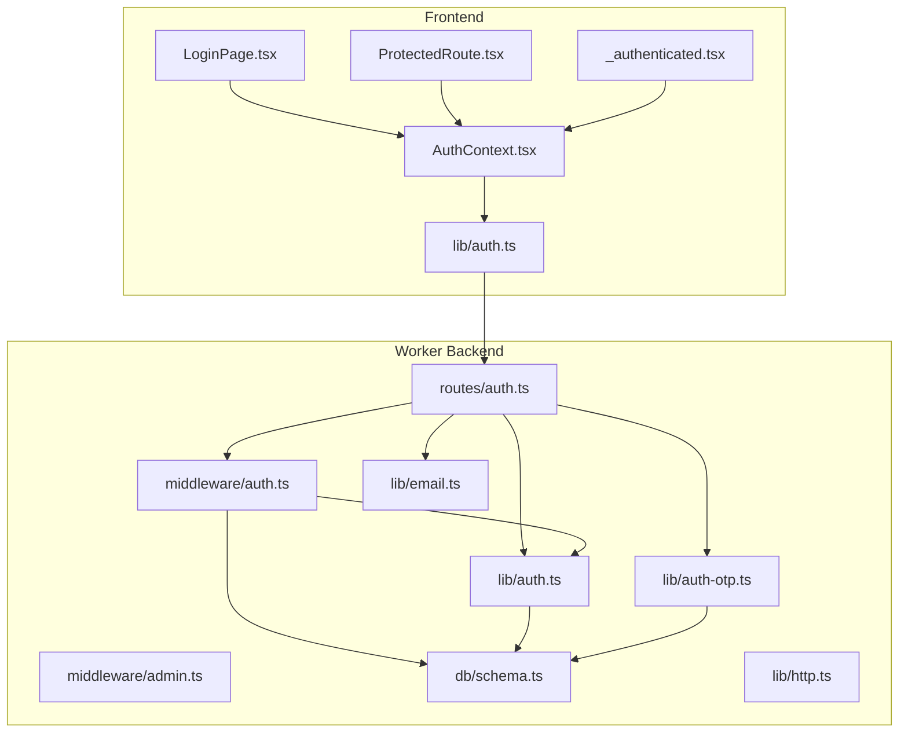
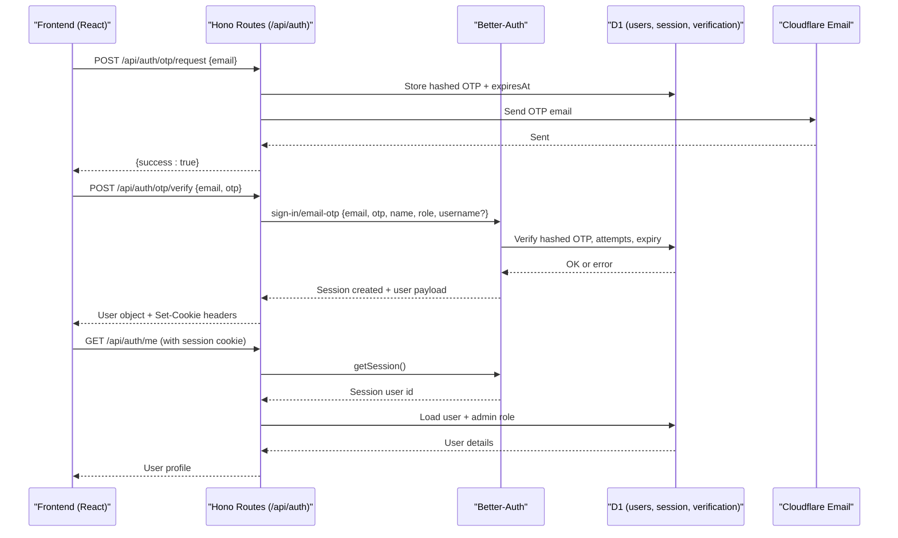
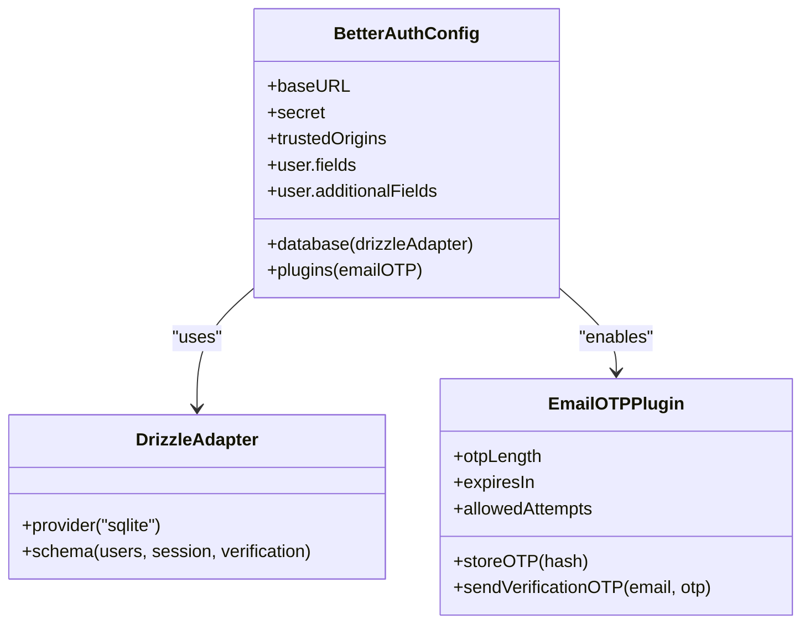
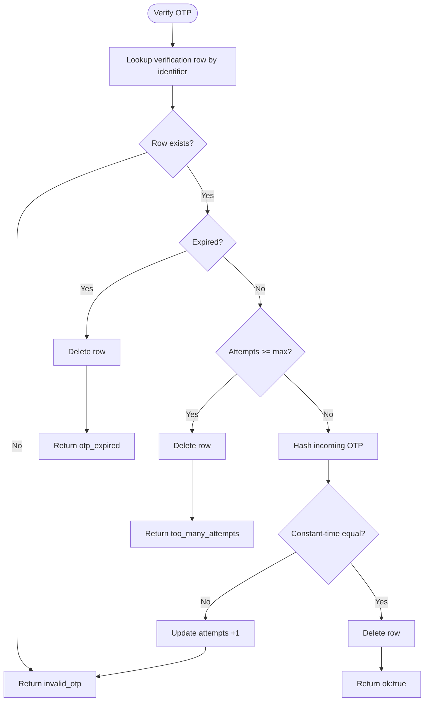
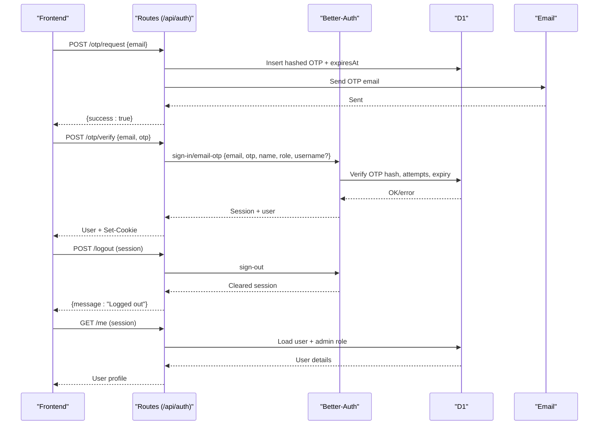
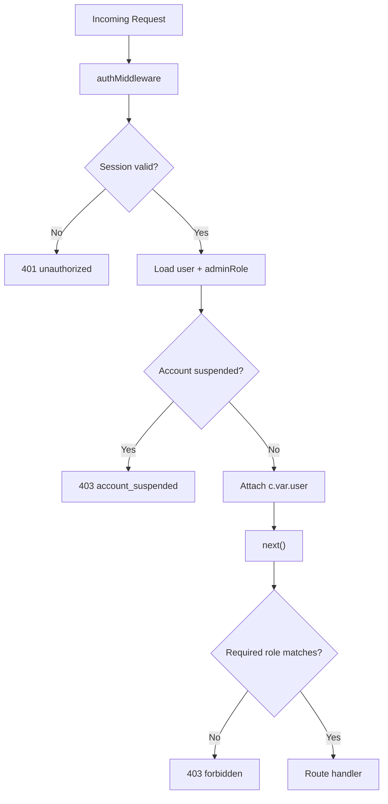
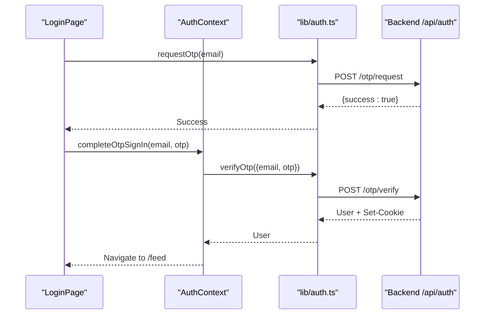
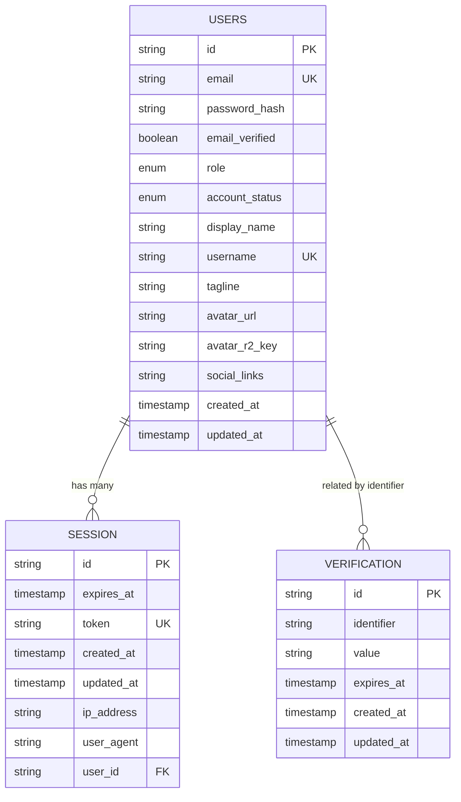
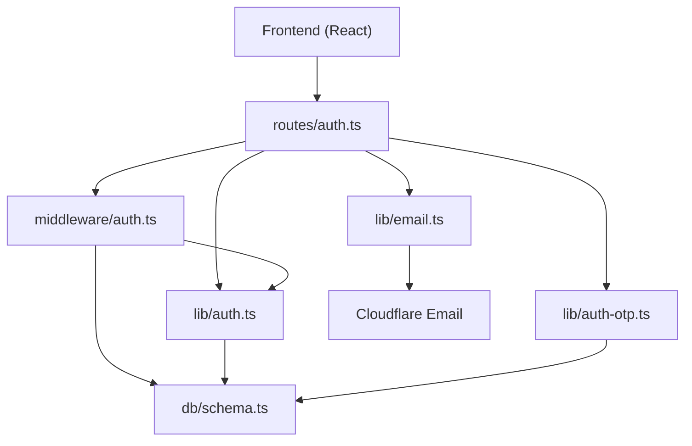

# Authentication System

<cite>
**Referenced Files in This Document**
- [auth.ts](file://src/worker/lib/auth.ts)
- [auth-otp.ts](file://src/worker/lib/auth-otp.ts)
- [email.ts](file://src/worker/lib/email.ts)
- [auth.ts](file://src/worker/routes/auth.ts)
- [auth.ts](file://src/worker/middleware/auth.ts)
- [admin.ts](file://src/worker/middleware/admin.ts)
- [schema.ts](file://src/worker/db/schema.ts)
- [http.ts](file://src/worker/lib/http.ts)
- [auth.ts](file://src/react-app/lib/auth.ts)
- [AuthContext.tsx](file://src/react-app/context/AuthContext.tsx)
- [LoginPage.tsx](file://src/react-app/pages/LoginPage.tsx)
- [ProtectedRoute.tsx](file://src/react-app/components/ProtectedRoute.tsx)
- [_authenticated.tsx](file://src/react-app/routes/_authenticated.tsx)
- [002-throttle-otp-requests.md](file://plans/002-throttle-otp-requests.md)
</cite>

## Table of Contents
1. [Introduction](#introduction)
2. [Project Structure](#project-structure)
3. [Core Components](#core-components)
4. [Architecture Overview](#architecture-overview)
5. [Detailed Component Analysis](#detailed-component-analysis)
6. [Dependency Analysis](#dependency-analysis)
7. [Performance Considerations](#performance-considerations)
8. [Troubleshooting Guide](#troubleshooting-guide)
9. [Conclusion](#conclusion)
10. [Appendices](#appendices)

## Introduction
This document explains the authentication system implementation centered on Better-Auth with email OTP verification, session management, and user state persistence. It covers the middleware pipeline for request authentication, authorization checks, and role-based access control. It also documents OTP generation, email delivery, verification flows, security considerations (rate limiting, brute force protection, secure sessions), frontend integration patterns, and error handling strategies.

## Project Structure
The authentication system spans backend Worker routes, middleware, libraries for OTP and email, database schema definitions, and frontend React components and hooks. Key areas:
- Backend auth configuration and OTP utilities
- Hono routes exposing OTP endpoints and delegating to Better-Auth
- Middleware enforcing authentication and roles
- Database tables for users, sessions, and verification tokens
- Frontend context and pages orchestrating OTP sign-in and protected navigation

**Diagram sources**
- [auth.ts:1-259](file://src/worker/routes/auth.ts#L1-L259)
- [auth.ts:1-57](file://src/worker/middleware/auth.ts#L1-L57)
- [admin.ts:1-14](file://src/worker/middleware/admin.ts#L1-L14)
- [auth.ts:1-80](file://src/worker/lib/auth.ts#L1-L80)
- [auth-otp.ts:1-124](file://src/worker/lib/auth-otp.ts#L1-L124)
- [email.ts:1-56](file://src/worker/lib/email.ts#L1-L56)
- [schema.ts:1-200](file://src/worker/db/schema.ts#L1-L200)
- [http.ts:1-80](file://src/worker/lib/http.ts#L1-L80)
- [auth.ts:1-55](file://src/react-app/lib/auth.ts#L1-L55)
- [AuthContext.tsx:1-90](file://src/react-app/context/AuthContext.tsx#L1-L90)
- [LoginPage.tsx:1-158](file://src/react-app/pages/LoginPage.tsx#L1-L158)
- [ProtectedRoute.tsx:1-19](file://src/react-app/components/ProtectedRoute.tsx#L1-L19)
- [_authenticated.tsx:1-20](file://src/react-app/routes/_authenticated.tsx#L1-L20)

**Section sources**
- [auth.ts:1-259](file://src/worker/routes/auth.ts#L1-L259)
- [auth.ts:1-57](file://src/worker/middleware/auth.ts#L1-L57)
- [auth.ts:1-80](file://src/worker/lib/auth.ts#L1-L80)
- [auth-otp.ts:1-124](file://src/worker/lib/auth-otp.ts#L1-L124)
- [email.ts:1-56](file://src/worker/lib/email.ts#L1-L56)
- [schema.ts:1-200](file://src/worker/db/schema.ts#L1-L200)
- [http.ts:1-80](file://src/worker/lib/http.ts#L1-L80)
- [auth.ts:1-55](file://src/react-app/lib/auth.ts#L1-L55)
- [AuthContext.tsx:1-90](file://src/react-app/context/AuthContext.tsx#L1-L90)
- [LoginPage.tsx:1-158](file://src/react-app/pages/LoginPage.tsx#L1-L158)
- [ProtectedRoute.tsx:1-19](file://src/react-app/components/ProtectedRoute.tsx#L1-L19)
- [_authenticated.tsx:1-20](file://src/react-app/routes/_authenticated.tsx#L1-L20)

## Core Components
- Better-Auth configuration: Initializes Better-Auth with Drizzle adapter, custom user fields, and emailOTP plugin. Password login is disabled; OTP is the sole sign-in mechanism.
- OTP utilities: Generate cryptographically random codes, hash them securely, store hashed values with expiration and attempt tracking, and verify using constant-time comparison.
- Email delivery: Sends transactional emails via Cloudflare Email binding with a simple text message containing the OTP and expiry notice.
- Auth routes: Expose /api/auth/otp/request and /api/auth/otp/verify, handle logout, and proxy allowed Better-Auth native endpoints while blocking sensitive ones.
- Middleware pipeline: Validates sessions, enriches user context with role and admin membership, and enforces account status and role-based access.
- Frontend integration: React Query-powered hooks and context manage OTP requests, verification, current user retrieval, and logout. Protected routes guard authenticated sections.

**Section sources**
- [auth.ts:1-80](file://src/worker/lib/auth.ts#L1-L80)
- [auth-otp.ts:1-124](file://src/worker/lib/auth-otp.ts#L1-L124)
- [email.ts:1-56](file://src/worker/lib/email.ts#L1-L56)
- [auth.ts:1-259](file://src/worker/routes/auth.ts#L1-L259)
- [auth.ts:1-57](file://src/worker/middleware/auth.ts#L1-L57)
- [admin.ts:1-14](file://src/worker/middleware/admin.ts#L1-L14)
- [auth.ts:1-55](file://src/react-app/lib/auth.ts#L1-L55)
- [AuthContext.tsx:1-90](file://src/react-app/context/AuthContext.tsx#L1-L90)
- [LoginPage.tsx:1-158](file://src/react-app/pages/LoginPage.tsx#L1-L158)
- [ProtectedRoute.tsx:1-19](file://src/react-app/components/ProtectedRoute.tsx#L1-L19)
- [_authenticated.tsx:1-20](file://src/react-app/routes/_authenticated.tsx#L1-L20)

## Architecture Overview
The authentication flow integrates frontend UI, Hono routes, Better-Auth, D1 storage, and Cloudflare Email. Sessions are managed by Better-Auth and stored in D1. OTPs are generated, hashed, and verified against stored records with strict limits.

**Diagram sources**
- [auth.ts:135-212](file://src/worker/routes/auth.ts#L135-L212)
- [auth.ts:1-80](file://src/worker/lib/auth.ts#L1-L80)
- [auth-otp.ts:57-124](file://src/worker/lib/auth-otp.ts#L57-L124)
- [email.ts:45-56](file://src/worker/lib/email.ts#L45-L56)
- [schema.ts:107-165](file://src/worker/db/schema.ts#L107-L165)

## Detailed Component Analysis

### Better-Auth Integration and Configuration
- Initializes Better-Auth with Drizzle adapter mapped to SQLite schema.
- Disables password-based authentication; enables emailOTP plugin with custom OTP length, expiry, and max attempts.
- Stores OTPs using a hashing function and sends OTPs via email callback.
- Extends user model with additional fields like role, username, tagline, avatar URL, and social links.

**Diagram sources**
- [auth.ts:9-76](file://src/worker/lib/auth.ts#L9-L76)
- [schema.ts:107-165](file://src/worker/db/schema.ts#L107-L165)

**Section sources**
- [auth.ts:1-80](file://src/worker/lib/auth.ts#L1-L80)
- [schema.ts:107-165](file://src/worker/db/schema.ts#L107-L165)

### OTP Generation, Storage, and Verification
- Generates 6-digit numeric OTPs using crypto.getRandomValues.
- Hashes OTPs with SHA-256 and stores base64url-encoded digests.
- Persists identifiers, hashed values, expiration timestamps, and attempt counters.
- Verifies OTPs with constant-time equality to prevent timing attacks; increments attempts on failure and deletes expired or exhausted entries.

**Diagram sources**
- [auth-otp.ts:87-124](file://src/worker/lib/auth-otp.ts#L87-L124)

**Section sources**
- [auth-otp.ts:1-124](file://src/worker/lib/auth-otp.ts#L1-L124)

### Email Delivery
- Constructs a plain-text email with subject and body containing the OTP and expiry warning.
- Uses Cloudflare Email binding to send transactional messages.
- Provides helpers for absolute URL resolution and environment-based base URLs.

**Section sources**
- [email.ts:1-56](file://src/worker/lib/email.ts#L1-L56)

### Auth Routes and Flow
- POST /api/auth/otp/request: Validates email, stores OTP, sends email, returns success. Suspended accounts are rejected early.
- POST /api/auth/otp/verify: Validates email and OTP, calls Better-Auth sign-in endpoint, handles errors and rate-limited responses, returns user payload with cookies.
- POST /api/auth/logout: Requires authentication, delegates to Better-Auth sign-out, returns success with cookies.
- GET /api/auth/me: Requires authentication, loads enriched user data including admin role.
- Proxying Better-Auth native endpoints: Blocks sensitive paths and forwards others to Better-Auth handler.

**Diagram sources**
- [auth.ts:135-212](file://src/worker/routes/auth.ts#L135-L212)
- [auth.ts:216-249](file://src/worker/routes/auth.ts#L216-L249)
- [auth.ts:253-259](file://src/worker/routes/auth.ts#L253-L259)

**Section sources**
- [auth.ts:1-259](file://src/worker/routes/auth.ts#L1-L259)

### Middleware Pipeline and Authorization
- Authentication middleware validates session via Better-Auth, fetches user from D1, checks account status, and attaches user context.
- Role-based middleware enforces required roles (subscriber vs creator).
- Admin middleware enforces administrator roles (owner/moderator).

**Diagram sources**
- [auth.ts:23-56](file://src/worker/middleware/auth.ts#L23-L56)
- [admin.ts:5-13](file://src/worker/middleware/admin.ts#L5-L13)

**Section sources**
- [auth.ts:1-57](file://src/worker/middleware/auth.ts#L1-L57)
- [admin.ts:1-14](file://src/worker/middleware/admin.ts#L1-L14)

### Frontend Authentication Flows
- LoginPage orchestrates two-step OTP flow: request code then verify.
- AuthContext manages OTP mutation, current user query, logout, and error handling.
- lib/auth exposes typed functions for OTP request/verification, logout, and fetching current user.
- ProtectedRoute and _authenticated route guard require active sessions.

**Diagram sources**
- [LoginPage.tsx:34-51](file://src/react-app/pages/LoginPage.tsx#L34-L51)
- [AuthContext.tsx:51-61](file://src/react-app/context/AuthContext.tsx#L51-L61)
- [auth.ts:36-46](file://src/react-app/lib/auth.ts#L36-L46)
- [auth.ts:168-212](file://src/worker/routes/auth.ts#L168-L212)

**Section sources**
- [LoginPage.tsx:1-158](file://src/react-app/pages/LoginPage.tsx#L1-L158)
- [AuthContext.tsx:1-90](file://src/react-app/context/AuthContext.tsx#L1-L90)
- [auth.ts:1-55](file://src/react-app/lib/auth.ts#L1-L55)
- [ProtectedRoute.tsx:1-19](file://src/react-app/components/ProtectedRoute.tsx#L1-L19)
- [_authenticated.tsx:1-20](file://src/react-app/routes/_authenticated.tsx#L1-L20)

### Data Models and Persistence
- Users table includes identity, role, account status, and profile fields.
- Sessions table stores Better-Auth session tokens, expiration, and metadata.
- Verification table stores hashed OTPs, identifiers, expiration, and attempt counts.

**Diagram sources**
- [schema.ts:5-32](file://src/worker/db/schema.ts#L5-L32)
- [schema.ts:107-165](file://src/worker/db/schema.ts#L107-L165)

**Section sources**
- [schema.ts:1-200](file://src/worker/db/schema.ts#L1-L200)

## Dependency Analysis
- Routes depend on middleware for authentication and role checks.
- Middleware depends on Better-Auth for session validation and D1 for user enrichment.
- OTP utilities depend on D1 schema for verification storage and crypto APIs for hashing and generation.
- Email module depends on Cloudflare Email binding.
- Frontend depends on React Query and typed API functions.

**Diagram sources**
- [auth.ts:1-259](file://src/worker/routes/auth.ts#L1-L259)
- [auth.ts:1-57](file://src/worker/middleware/auth.ts#L1-L57)
- [auth.ts:1-80](file://src/worker/lib/auth.ts#L1-L80)
- [auth-otp.ts:1-124](file://src/worker/lib/auth-otp.ts#L1-L124)
- [email.ts:1-56](file://src/worker/lib/email.ts#L1-L56)
- [schema.ts:1-200](file://src/worker/db/schema.ts#L1-L200)

**Section sources**
- [auth.ts:1-259](file://src/worker/routes/auth.ts#L1-L259)
- [auth.ts:1-57](file://src/worker/middleware/auth.ts#L1-L57)
- [auth.ts:1-80](file://src/worker/lib/auth.ts#L1-L80)
- [auth-otp.ts:1-124](file://src/worker/lib/auth-otp.ts#L1-L124)
- [email.ts:1-56](file://src/worker/lib/email.ts#L1-L56)
- [schema.ts:1-200](file://src/worker/db/schema.ts#L1-L200)

## Performance Considerations
- OTP verification uses constant-time comparison to mitigate timing attacks.
- Short-lived OTPs reduce exposure windows.
- Attempt limits prevent brute-force guessing.
- Session lookups are minimal and rely on indexed columns for performance.
- Email sending is asynchronous and should be monitored for failures.

[No sources needed since this section provides general guidance]

## Troubleshooting Guide
Common issues and resolutions:
- OTP email unavailable: Ensure proper email routing and recipient verification; retry after transient failures.
- Invalid or expired OTP: Re-request a new code; ensure client clocks are accurate.
- Too many incorrect codes: Wait for cooldown and reattempt; check for automated abuse.
- Account suspended: Review account status and reason; contact support if necessary.
- Unauthorized or forbidden: Validate session presence and required roles; ensure correct middleware usage.

Error response helpers provide consistent JSON shapes with codes and messages for client handling.

**Section sources**
- [http.ts:23-80](file://src/worker/lib/http.ts#L23-L80)
- [auth.ts:135-212](file://src/worker/routes/auth.ts#L135-L212)

## Conclusion
The authentication system leverages Better-Auth with email OTP verification to provide a secure, passwordless sign-in experience. Robust middleware ensures authenticated and authorized access, while OTP utilities enforce strong security practices. Frontend integration is streamlined through React Query and context providers, enabling smooth user flows and robust error handling. Future enhancements include implementing rate limiting for OTP requests to further protect against abuse.

[No sources needed since this section summarizes without analyzing specific files]

## Appendices

### Security Considerations
- Rate limiting plan outlines per-email and per-IP throttling for OTP requests to prevent abuse.
- Secure session handling via Better-Auth with HTTP-only cookies and short lifetimes.
- Brute force protection through attempt limits and constant-time comparisons.
- Privacy-preserving fingerprinting for rate-limit keys avoids logging raw emails.

**Section sources**
- [002-throttle-otp-requests.md:1-164](file://plans/002-throttle-otp-requests.md#L1-L164)