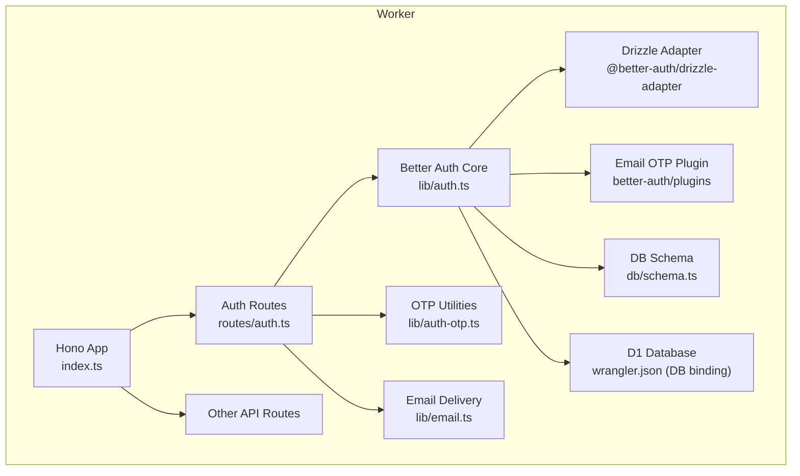
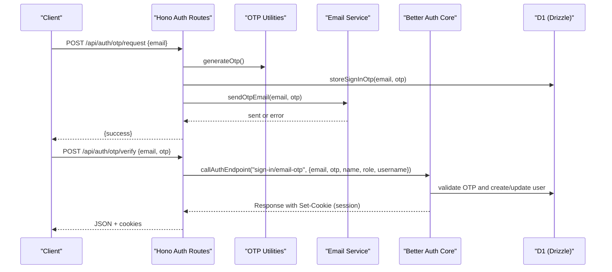
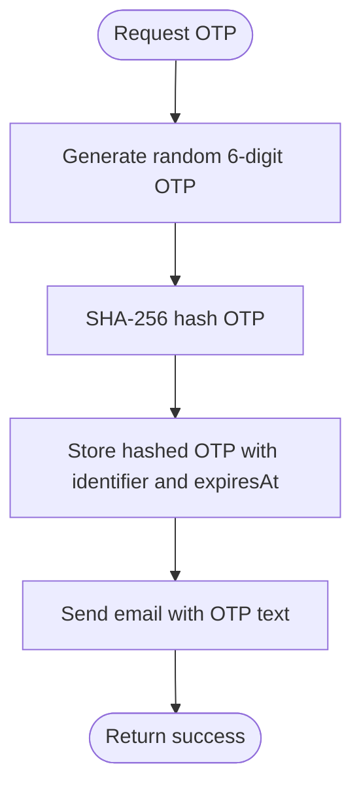
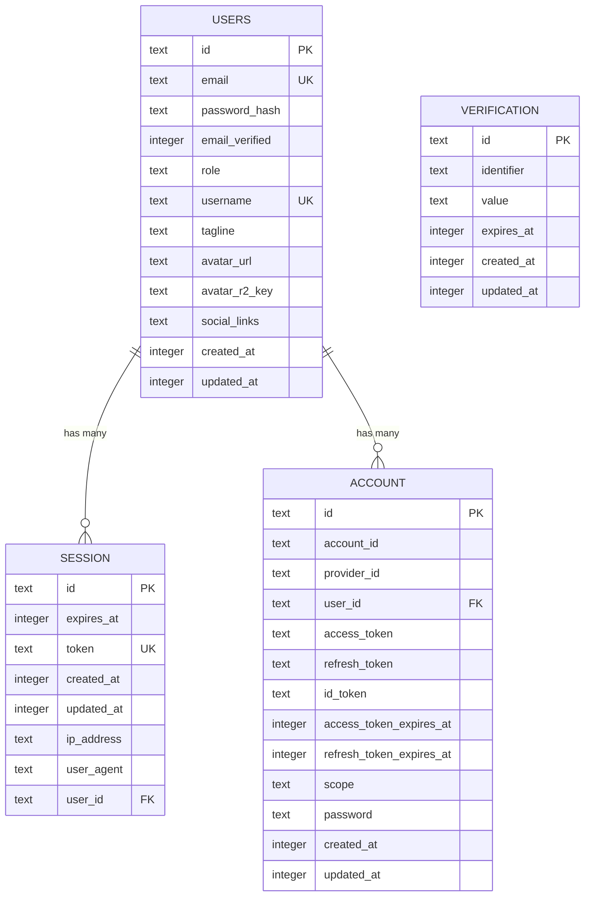
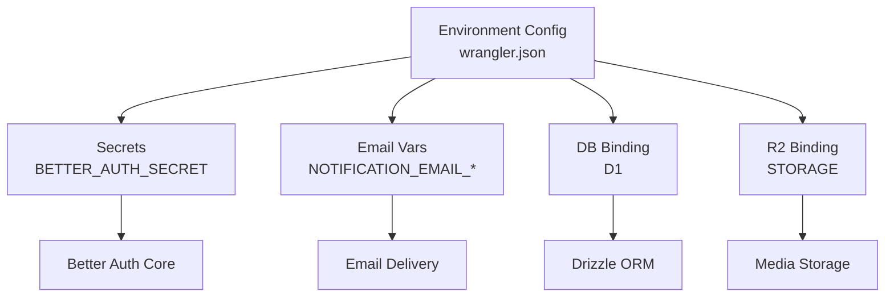
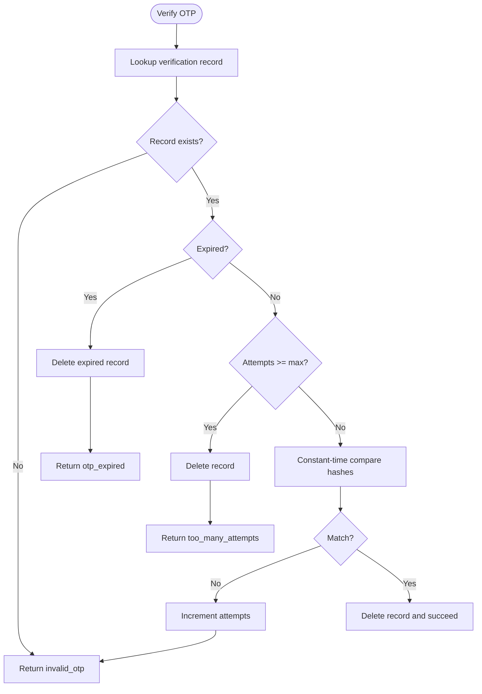
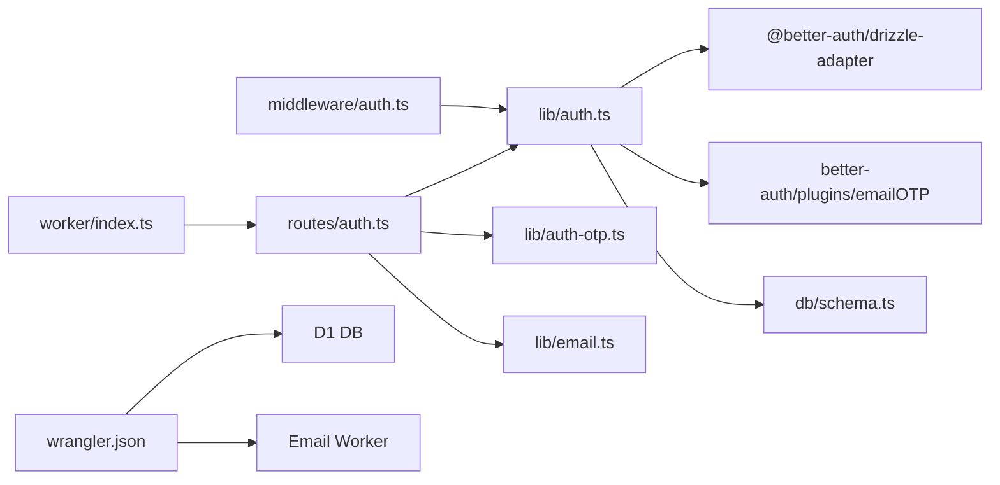

# Better-Auth Integration

<cite>
**Referenced Files in This Document**
- [src/worker/lib/auth.ts](file://src/worker/lib/auth.ts)
- [src/worker/lib/auth-otp.ts](file://src/worker/lib/auth-otp.ts)
- [src/worker/routes/auth.ts](file://src/worker/routes/auth.ts)
- [src/worker/lib/email.ts](file://src/worker/lib/email.ts)
- [src/worker/db/schema.ts](file://src/worker/db/schema.ts)
- [drizzle/0002_better_auth.sql](file://drizzle/0002_better_auth.sql)
- [src/worker/middleware/auth.ts](file://src/worker/middleware/auth.ts)
- [wrangler.json](file://wrangler.json)
- [src/worker/index.ts](file://src/worker/index.ts)
</cite>

## Table of Contents
1. [Introduction](#introduction)
2. [Project Structure](#project-structure)
3. [Core Components](#core-components)
4. [Architecture Overview](#architecture-overview)
5. [Detailed Component Analysis](#detailed-component-analysis)
6. [Dependency Analysis](#dependency-analysis)
7. [Performance Considerations](#performance-considerations)
8. [Troubleshooting Guide](#troubleshooting-guide)
9. [Conclusion](#conclusion)

## Introduction
This document explains the Better-Auth integration used by the project, focusing on initialization, configuration, Drizzle ORM adapter setup, email OTP plugin behavior, user schema extensions, environment and secret management, trusted origins, and security considerations for sessions and tokens. It is intended for both developers integrating authentication and operators configuring production environments.

## Project Structure
The authentication system is implemented as a Cloudflare Worker with Hono routes that wrap Better Auth endpoints and provide custom flows for email-based OTP sign-in. The database layer uses Drizzle ORM against a D1 SQLite database.



**Diagram sources**
- [src/worker/index.ts:24-45](file://src/worker/index.ts#L24-L45)
- [src/worker/routes/auth.ts:14-259](file://src/worker/routes/auth.ts#L14-L259)
- [src/worker/lib/auth.ts:9-77](file://src/worker/lib/auth.ts#L9-L77)
- [src/worker/lib/auth-otp.ts:1-124](file://src/worker/lib/auth-otp.ts#L1-L124)
- [src/worker/lib/email.ts:1-56](file://src/worker/lib/email.ts#L1-L56)
- [src/worker/db/schema.ts:108-165](file://src/worker/db/schema.ts#L108-L165)
- [wrangler.json:52-59](file://wrangler.json#L52-L59)

**Section sources**
- [src/worker/index.ts:24-45](file://src/worker/index.ts#L24-L45)
- [src/worker/routes/auth.ts:14-259](file://src/worker/routes/auth.ts#L14-L259)
- [src/worker/lib/auth.ts:9-77](file://src/worker/lib/auth.ts#L9-L77)
- [src/worker/lib/auth-otp.ts:1-124](file://src/worker/lib/auth-otp.ts#L1-L124)
- [src/worker/lib/email.ts:1-56](file://src/worker/lib/email.ts#L1-L56)
- [src/worker/db/schema.ts:108-165](file://src/worker/db/schema.ts#L108-L165)
- [wrangler.json:52-59](file://wrangler.json#L52-L59)

## Core Components
- Better Auth initialization and configuration:
  - Base URL, secret, trusted origins, Drizzle adapter mapping, email OTP plugin, and user field mappings are defined in the auth factory.
- Email OTP plugin:
  - OTP length, expiration, attempt limits, hashing, storage, and email delivery are configured and enforced.
- User schema extensions:
  - Additional fields such as role, username, tagline, avatar R2 key, and social links are added to the user model.
- Session handling:
  - Middleware validates sessions and enriches context with user details and admin roles.

**Section sources**
- [src/worker/lib/auth.ts:9-77](file://src/worker/lib/auth.ts#L9-L77)
- [src/worker/lib/auth-otp.ts:5-7](file://src/worker/lib/auth-otp.ts#L5-L7)
- [src/worker/db/schema.ts:5-32](file://src/worker/db/schema.ts#L5-L32)
- [src/worker/middleware/auth.ts:23-50](file://src/worker/middleware/auth.ts#L23-L50)

## Architecture Overview
The authentication flow combines custom Hono routes with Better Auth’s internal handlers. Password-based login is disabled; instead, users request an OTP via email, verify it, and receive a session cookie managed by Better Auth.



**Diagram sources**
- [src/worker/routes/auth.ts:135-212](file://src/worker/routes/auth.ts#L135-L212)
- [src/worker/lib/auth-otp.ts:26-68](file://src/worker/lib/auth-otp.ts#L26-L68)
- [src/worker/lib/email.ts:45-55](file://src/worker/lib/email.ts#L45-L55)
- [src/worker/lib/auth.ts:9-38](file://src/worker/lib/auth.ts#L9-L38)

## Detailed Component Analysis

### Better Auth Initialization and Configuration
- Base URL and secret:
  - The base URL is derived from the request origin at runtime.
  - The secret is read from the environment variable used by Better Auth for signing sessions and tokens.
- Trusted origins:
  - Configured to include the base URL to allow cross-origin requests from the frontend.
- Database adapter:
  - Uses the Drizzle adapter with provider set to sqlite and schema mapping that includes Better Auth tables and the extended user table.
- Email OTP plugin:
  - OTP length, expiration seconds, allowed attempts, OTP hashing function, and email sender callback are configured.
- User field mapping:
  - Maps standard fields like name and image to custom columns.
  - Adds additional fields including passwordHash, role, username, tagline, avatarR2Key, and socialLinks with appropriate input/return visibility and defaults.

```mermaid
classDiagram
class AuthFactory {
+createAuth(env, baseURL)
}
class DrizzleAdapter {
+provider : "sqlite"
+schema : { ...users, session, account, verification }
}
class EmailOTPPlugin {
+otpLength
+expiresIn
+allowedAttempts
+storeOTP.hash
+sendVerificationOTP
}
class UserSchema {
+name -> displayName
+image -> avatarUrl
+additionalFields : passwordHash, role, username, tagline, avatarR2Key, socialLinks
}
AuthFactory --> DrizzleAdapter : "uses"
AuthFactory --> EmailOTPPlugin : "configures"
AuthFactory --> UserSchema : "maps fields"
```

**Diagram sources**
- [src/worker/lib/auth.ts:9-77](file://src/worker/lib/auth.ts#L9-L77)
- [src/worker/db/schema.ts:108-165](file://src/worker/db/schema.ts#L108-L165)

**Section sources**
- [src/worker/lib/auth.ts:9-77](file://src/worker/lib/auth.ts#L9-L77)

### Email OTP Plugin Configuration
- OTP parameters:
  - Length: 6 digits.
  - Expiration: 300 seconds (5 minutes).
  - Max attempts: 3 incorrect attempts before requiring a new code.
- Storage and hashing:
  - OTPs are hashed using SHA-256 and stored in the verification table with an identifier and expiration timestamp.
  - Attempts are tracked by appending an attempt counter to the stored value.
- Email delivery:
  - OTP emails are sent via Cloudflare Email Workers using a MIME message builder.
  - The subject and body include the OTP and expiration notice.



**Diagram sources**
- [src/worker/lib/auth-otp.ts:26-68](file://src/worker/lib/auth-otp.ts#L26-L68)
- [src/worker/lib/email.ts:45-55](file://src/worker/lib/email.ts#L45-L55)

**Section sources**
- [src/worker/lib/auth-otp.ts:5-7](file://src/worker/lib/auth-otp.ts#L5-L7)
- [src/worker/lib/auth-otp.ts:40-68](file://src/worker/lib/auth-otp.ts#L40-L68)
- [src/worker/lib/email.ts:45-55](file://src/worker/lib/email.ts#L45-L55)

### User Schema Extensions
- Extended fields:
  - role: Enumerated values with default subscriber.
  - username: Unique string required for display URLs.
  - tagline: Optional short description.
  - avatarUrl: Public URL for profile images.
  - avatarR2Key: Internal reference to R2 storage object (not returned to clients).
  - socialLinks: Serialized JSON string of social media URLs.
- Mapping to Better Auth:
  - Standard fields mapped to custom column names.
  - Additional fields declared with input/return visibility flags to control exposure.



**Diagram sources**
- [src/worker/db/schema.ts:5-32](file://src/worker/db/schema.ts#L5-L32)
- [src/worker/db/schema.ts:108-165](file://src/worker/db/schema.ts#L108-L165)

**Section sources**
- [src/worker/db/schema.ts:5-32](file://src/worker/db/schema.ts#L5-L32)
- [src/worker/db/schema.ts:108-165](file://src/worker/db/schema.ts#L108-L165)

### Environment Variables and Secrets
- Required secrets:
  - BETTER_AUTH_SECRET: Used by Better Auth to sign sessions and tokens. Must be set per environment.
- Email configuration:
  - NOTIFICATION_EMAIL_FROM and NOTIFICATION_EMAIL_FROM_NAME define sender identity.
  - NOTIFICATION_EMAIL_BASE_URL provides base URL for absolute links in emails when needed.
  - NOTIFICATION_EMAIL binding enables sending transactional emails via Cloudflare Email Workers.
- Database and storage bindings:
  - DB binding points to D1 database with migrations directory.
  - STORAGE binding points to R2 bucket for file storage.
- Production overrides:
  - Production environment sets specific vars and secrets, including email base URL and dashboard URLs.



**Diagram sources**
- [wrangler.json:66-114](file://wrangler.json#L66-L114)
- [src/worker/lib/email.ts:10-25](file://src/worker/lib/email.ts#L10-L25)

**Section sources**
- [wrangler.json:66-114](file://wrangler.json#L66-L114)
- [src/worker/lib/email.ts:10-25](file://src/worker/lib/email.ts#L10-L25)

### Trusted Origins Setup
- The base URL is passed into the Better Auth factory and included in trustedOrigins to allow the frontend to make authenticated requests.
- Ensure the frontend origin matches the base URL used during initialization to avoid CORS or CSRF issues.

**Section sources**
- [src/worker/lib/auth.ts:12-16](file://src/worker/lib/auth.ts#L12-L16)

### Security Considerations
- Session handling:
  - Sessions are stored in the session table with unique tokens and expiration timestamps.
  - Cookies are propagated from Better Auth responses to client requests.
- Token generation:
  - OTPs are cryptographically generated and hashed before storage.
  - Constant-time comparison prevents timing attacks during OTP verification.
- Attempt limits:
  - OTP verification enforces maximum attempts and deletes expired entries.
- Account status checks:
  - Requests are rejected if the account is suspended.
- Password auth disabled:
  - Legacy password endpoints return explicit errors directing users to OTP flow.



**Diagram sources**
- [src/worker/lib/auth-otp.ts:87-124](file://src/worker/lib/auth-otp.ts#L87-L124)

**Section sources**
- [src/worker/db/schema.ts:108-165](file://src/worker/db/schema.ts#L108-L165)
- [src/worker/lib/auth-otp.ts:17-24](file://src/worker/lib/auth-otp.ts#L17-L24)
- [src/worker/routes/auth.ts:96-103](file://src/worker/routes/auth.ts#L96-L103)

## Dependency Analysis
The authentication subsystem depends on several modules and external services:



**Diagram sources**
- [src/worker/routes/auth.ts:1-259](file://src/worker/routes/auth.ts#L1-259)
- [src/worker/lib/auth.ts:1-77](file://src/worker/lib/auth.ts#L1-L77)
- [src/worker/lib/auth-otp.ts:1-124](file://src/worker/lib/auth-otp.ts#L1-L124)
- [src/worker/lib/email.ts:1-56](file://src/worker/lib/email.ts#L1-L56)
- [src/worker/middleware/auth.ts:1-57](file://src/worker/middleware/auth.ts#L1-L57)
- [src/worker/index.ts:1-71](file://src/worker/index.ts#L1-L71)
- [wrangler.json:1-139](file://wrangler.json#L1-L139)

**Section sources**
- [src/worker/routes/auth.ts:1-259](file://src/worker/routes/auth.ts#L1-L259)
- [src/worker/lib/auth.ts:1-77](file://src/worker/lib/auth.ts#L1-L77)
- [src/worker/lib/auth-otp.ts:1-124](file://src/worker/lib/auth-otp.ts#L1-L124)
- [src/worker/lib/email.ts:1-56](file://src/worker/lib/email.ts#L1-L56)
- [src/worker/middleware/auth.ts:1-57](file://src/worker/middleware/auth.ts#L1-L57)
- [src/worker/index.ts:1-71](file://src/worker/index.ts#L1-L71)
- [wrangler.json:1-139](file://wrangler.json#L1-L139)

## Performance Considerations
- OTP generation and hashing use Web Crypto APIs for efficiency and security.
- Database queries are targeted and indexed (e.g., verification.identifier index) to minimize lookup time.
- Email delivery is asynchronous; failures are handled gracefully without blocking the OTP storage step.
- Session validation middleware performs minimal overhead by fetching only necessary user fields.

[No sources needed since this section provides general guidance]

## Troubleshooting Guide
- OTP email not received:
  - Check NOTIFICATION_EMAIL binding and allowed sender addresses.
  - Ensure NOTIFICATION_EMAIL_BASE_URL is configured if absolute URLs are needed.
- OTP verification fails repeatedly:
  - After exceeding allowed attempts, the record is deleted; request a new OTP.
  - Verify that the OTP has not expired (5-minute window).
- Session not set after verification:
  - Ensure cookies are forwarded from Better Auth responses to the client.
  - Confirm trustedOrigins includes the frontend origin.
- Account suspended:
  - Requests are rejected with a specific error code; contact support or update account status.

**Section sources**
- [src/worker/lib/email.ts:23-43](file://src/worker/lib/email.ts#L23-L43)
- [src/worker/lib/auth-otp.ts:87-124](file://src/worker/lib/auth-otp.ts#L87-L124)
- [src/worker/routes/auth.ts:135-212](file://src/worker/routes/auth.ts#L135-L212)
- [src/worker/middleware/auth.ts:23-50](file://src/worker/middleware/auth.ts#L23-L50)

## Conclusion
The Better-Auth integration in this project provides a secure, OTP-based authentication flow backed by Drizzle ORM and D1. It emphasizes safety through cryptographic OTP handling, strict attempt limits, and robust session management. Proper configuration of secrets, trusted origins, and email bindings is essential for reliable operation across environments.

[No sources needed since this section summarizes without analyzing specific files]