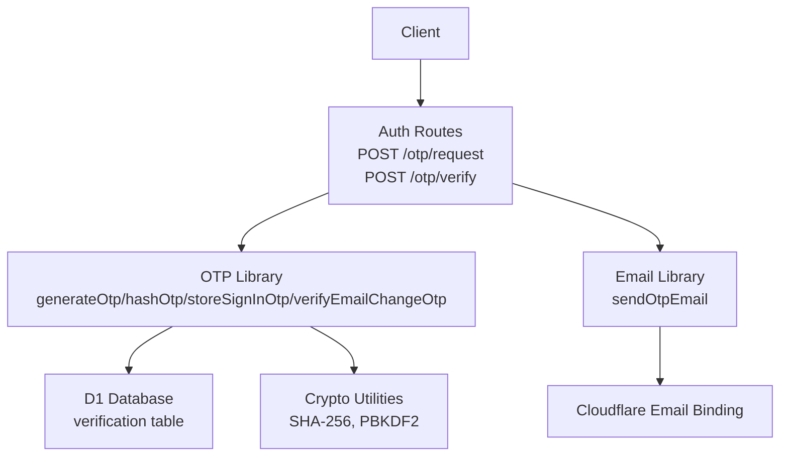
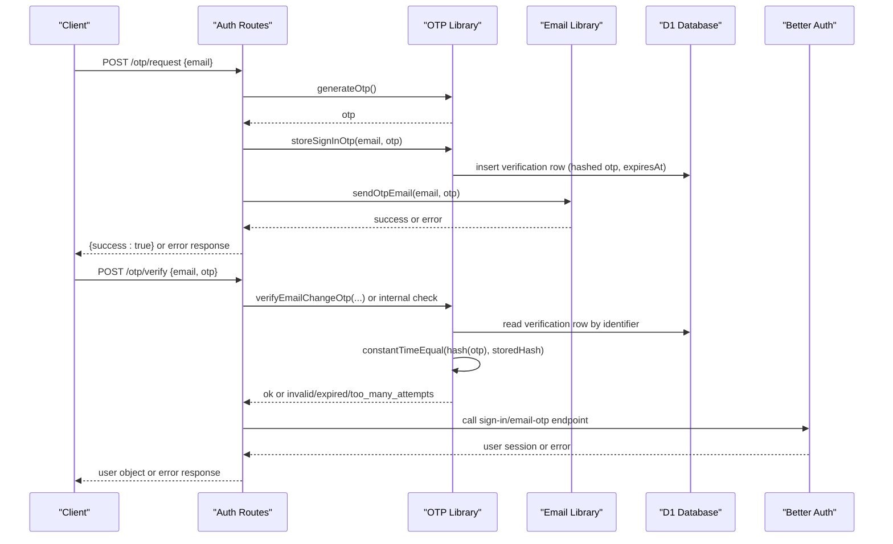
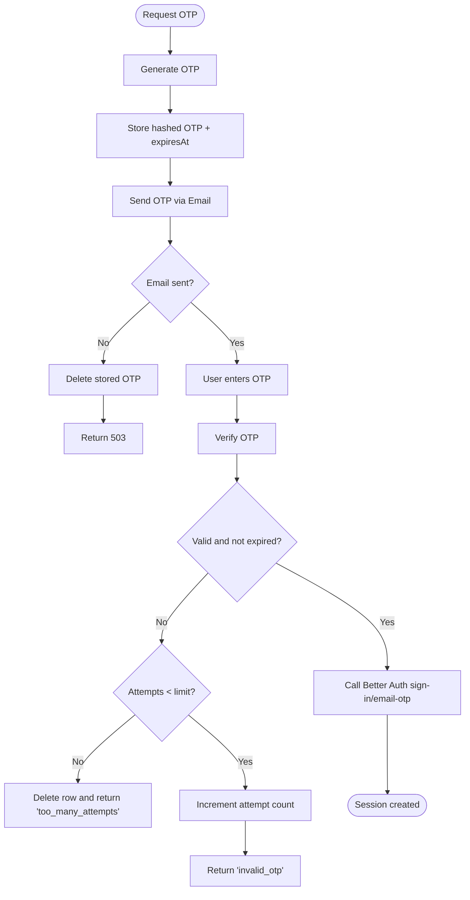
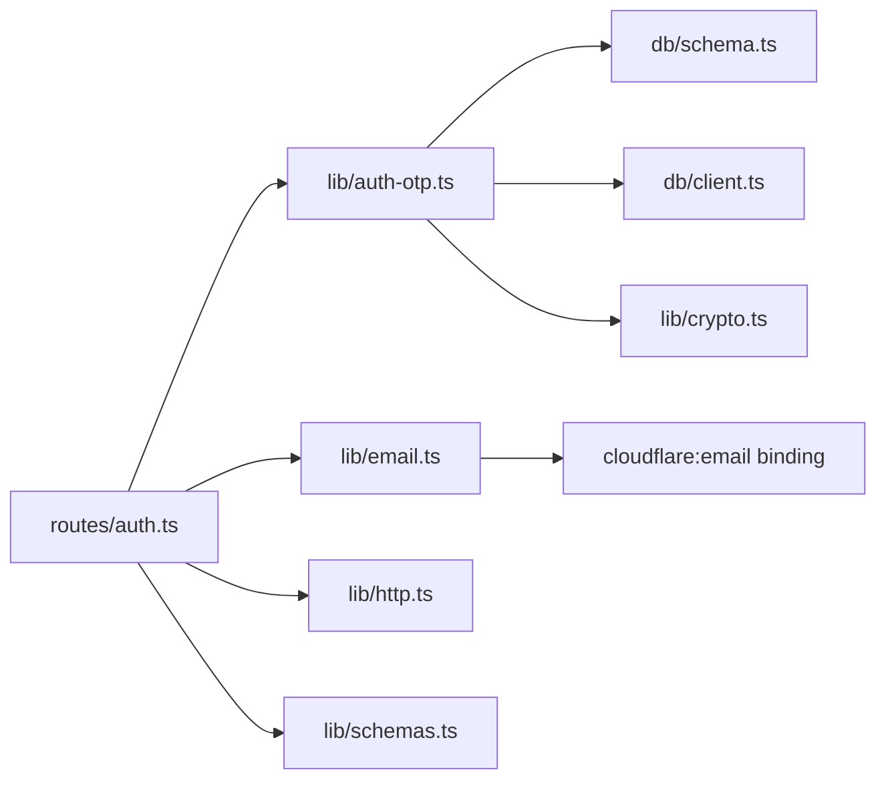
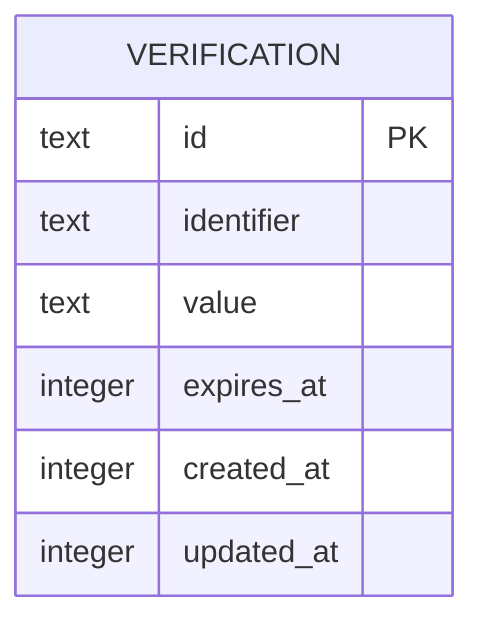

# OTP Verification System

<cite>
**Referenced Files in This Document**
- [auth-otp.ts](file://src/worker/lib/auth-otp.ts)
- [crypto.ts](file://src/worker/lib/crypto.ts)
- [email.ts](file://src/worker/lib/email.ts)
- [auth.ts](file://src/worker/routes/auth.ts)
- [schema.ts](file://src/worker/db/schema.ts)
- [client.ts](file://src/worker/db/client.ts)
- [schemas.ts](file://src/worker/lib/schemas.ts)
- [http.ts](file://src/worker/lib/http.ts)
- [002-throttle-otp-requests.md](file://plans/002-throttle-otp-requests.md)
</cite>

## Table of Contents
1. [Introduction](#introduction)
2. [Project Structure](#project-structure)
3. [Core Components](#core-components)
4. [Architecture Overview](#architecture-overview)
5. [Detailed Component Analysis](#detailed-component-analysis)
6. [Dependency Analysis](#dependency-analysis)
7. [Performance Considerations](#performance-considerations)
8. [Troubleshooting Guide](#troubleshooting-guide)
9. [Conclusion](#conclusion)
10. [Appendices](#appendices)

## Introduction
This document explains the OTP verification system used for email-based sign-in and email change flows. It covers OTP generation, hashing, secure storage, email delivery via Cloudflare Email, template rendering, error handling, lifecycle from generation to expiration, brute-force protection with attempt limits, rate limiting strategies, security considerations (timing attack prevention, secure comparison), and audit logging for suspicious activities.

## Project Structure
The OTP system spans a small set of focused modules:
- Routes expose endpoints for requesting and verifying OTPs.
- The OTP library implements generation, hashing, storage, and verification logic.
- Crypto utilities provide secure hashing and password operations using Web Crypto API.
- Email module sends transactional emails through Cloudflare Email binding.
- Database schema defines the verification table storing hashed OTP values and metadata.
- Schemas validate request payloads.
- HTTP helpers standardize error responses.

**Diagram sources**
- [auth.ts:135-212](file://src/worker/routes/auth.ts#L135-L212)
- [auth-otp.ts:26-123](file://src/worker/lib/auth-otp.ts#L26-L123)
- [email.ts:27-55](file://src/worker/lib/email.ts#L27-L55)
- [crypto.ts:25-51](file://src/worker/lib/crypto.ts#L25-L51)
- [schema.ts:151-165](file://src/worker/db/schema.ts#L151-L165)

**Section sources**
- [auth.ts:135-212](file://src/worker/routes/auth.ts#L135-L212)
- [auth-otp.ts:1-124](file://src/worker/lib/auth-otp.ts#L1-L124)
- [email.ts:1-56](file://src/worker/lib/email.ts#L1-L56)
- [crypto.ts:1-109](file://src/worker/lib/crypto.ts#L1-L109)
- [schema.ts:151-165](file://src/worker/db/schema.ts#L151-L165)
- [client.ts:1-9](file://src/worker/db/client.ts#L1-L9)
- [schemas.ts:13-23](file://src/worker/lib/schemas.ts#L13-L23)
- [http.ts:23-33](file://src/worker/lib/http.ts#L23-L33)

## Core Components
- OTP Generation: Cryptographically secure random digits, fixed length, uniform distribution.
- Hashing Mechanism: SHA-256 digest of OTP stored as base64url; constant-time comparison prevents timing attacks.
- Secure Storage: Hashed OTP plus attempt counter stored in D1 with identifier and expiry timestamp.
- Email Delivery: Plain-text email sent via Cloudflare Email binding with subject and body containing OTP and expiry notice.
- Request Validation: Zod schemas enforce email format and 6-digit OTP pattern.
- Error Handling: Standardized JSON error responses with typed codes.

**Section sources**
- [auth-otp.ts:26-43](file://src/worker/lib/auth-otp.ts#L26-L43)
- [auth-otp.ts:57-77](file://src/worker/lib/auth-otp.ts#L57-L77)
- [email.ts:27-55](file://src/worker/lib/email.ts#L27-L55)
- [schemas.ts:13-23](file://src/worker/lib/schemas.ts#L13-L23)
- [http.ts:23-33](file://src/worker/lib/http.ts#L23-L33)

## Architecture Overview
The OTP flow is split into two primary endpoints:
- POST /api/auth/otp/request: Generates an OTP, stores it securely, and sends an email.
- POST /api/auth/otp/verify: Validates the submitted OTP against the stored hash, enforces attempt limits, and delegates authentication to Better Auth.

**Diagram sources**
- [auth.ts:135-212](file://src/worker/routes/auth.ts#L135-L212)
- [auth-otp.ts:87-123](file://src/worker/lib/auth-otp.ts#L87-L123)
- [email.ts:45-55](file://src/worker/lib/email.ts#L45-L55)
- [schema.ts:151-165](file://src/worker/db/schema.ts#L151-L165)

## Detailed Component Analysis

### OTP Generation Algorithm
- Uses crypto.getRandomValues to produce cryptographically secure bytes.
- Filters out high-value bytes to avoid modulo bias and builds a 6-digit numeric string.
- Ensures uniform distribution across digit space.

Complexity:
- Time: O(k) where k is number of generated bytes until 6 digits are collected.
- Space: O(1) beyond temporary buffers.

Security:
- Relies on platform CSPRNG.
- Avoids biased sampling by rejecting bytes >= 250 before modulo operation.

**Section sources**
- [auth-otp.ts:26-38](file://src/worker/lib/auth-otp.ts#L26-L38)

### Hashing Mechanism Using Crypto Utilities
- OTP is hashed with SHA-256 via crypto.subtle.digest.
- Digest is encoded to base64url for safe storage.
- Password hashing utilities use PBKDF2-HMAC-SHA256 with salt and iterations for strong key derivation.

Security:
- Constant-time comparison function avoids timing side channels during verification.
- PBKDF2 parameters ensure resistance to brute force for passwords.

**Section sources**
- [auth-otp.ts:40-43](file://src/worker/lib/auth-otp.ts#L40-L43)
- [auth-otp.ts:17-24](file://src/worker/lib/auth-otp.ts#L17-L24)
- [crypto.ts:25-51](file://src/worker/lib/crypto.ts#L25-L51)
- [crypto.ts:57-108](file://src/worker/lib/crypto.ts#L57-L108)

### Secure Storage Patterns
- Identifier scheme:
  - Sign-in: `sign-in-otp-${email}`
  - Email change: `change-email-otp-${userId}-${newEmail}`
- Stored value format:
  - For sign-in: base64url(SHA-256(otp))
  - For email change: base64url(SHA-256(otp)):attemptCount
- Expiry timestamp ensures short-lived tokens.
- Deletion after successful verification or when too many attempts occur.

Database schema:
- verification table includes id, identifier, value, expiresAt, timestamps.
- Indexed by identifier for fast lookup.

**Section sources**
- [auth-otp.ts:57-77](file://src/worker/lib/auth-otp.ts#L57-L77)
- [auth-otp.ts:87-123](file://src/worker/lib/auth-otp.ts#L87-L123)
- [schema.ts:151-165](file://src/worker/db/schema.ts#L151-L165)

### Email Delivery Workflow Through Cloudflare Email
- Transactional email helper constructs MIME message and sends via binding.
- OTP email contains plain text with code and expiry notice.
- Errors propagate back to route handler, which cleans up stored OTP and returns a service unavailable response.

Template rendering:
- Simple plain-text composition without HTML templates.
- Base URL resolution supports absolute URLs when configured.

**Section sources**
- [email.ts:27-55](file://src/worker/lib/email.ts#L27-L55)
- [auth.ts:150-163](file://src/worker/routes/auth.ts#L150-L163)

### OTP Lifecycle: From Generation to Expiration

**Diagram sources**
- [auth.ts:135-212](file://src/worker/routes/auth.ts#L135-L212)
- [auth-otp.ts:87-123](file://src/worker/lib/auth-otp.ts#L87-L123)
- [email.ts:45-55](file://src/worker/lib/email.ts#L45-L55)

**Section sources**
- [auth.ts:135-212](file://src/worker/routes/auth.ts#L135-L212)
- [auth-otp.ts:87-123](file://src/worker/lib/auth-otp.ts#L87-L123)

### Brute Force Protection With Attempt Limits
- Attempt counter embedded in stored value for email-change OTPs.
- On each failed verification, attempt count increments atomically.
- When attempts reach the maximum, the row is deleted and a specific error code is returned.
- For sign-in OTP verification, the route maps 403 from Better Auth to a “too many OTP attempts” error.

Security implications:
- Prevents automated guessing by limiting retries per token.
- Deletes token after max attempts to mitigate replay.

**Section sources**
- [auth-otp.ts:102-118](file://src/worker/lib/auth-otp.ts#L102-L118)
- [auth.ts:190-209](file://src/worker/routes/auth.ts#L190-L209)

### Rate Limiting Strategies
- Plan 002 outlines adding Worker-level rate limits:
  - Per normalized email fingerprint: 3 requests per 60 seconds.
  - Per client IP: 10 requests per 60 seconds.
- Rejections should occur before any D1 writes or email sending.
- Response uses 429 status with Retry-After header and generic message.

Current state:
- The plan exists but implementation requires wrangler configuration and integration tests.
- Until implemented, the route lacks explicit request-rate guards at the application layer.

**Section sources**
- [002-throttle-otp-requests.md:65-101](file://plans/002-throttle-otp-requests.md#L65-L101)
- [auth.ts:135-163](file://src/worker/routes/auth.ts#L135-L163)

### Security Considerations
- Timing Attack Prevention:
  - constantTimeEqual compares hashes byte-by-byte without early exit.
  - Password verification uses timingSafeEqual if available, otherwise fallback loop.
- Secure Comparison Methods:
  - All sensitive comparisons avoid short-circuit behavior.
- Audit Logging for Suspicious Activities:
  - Admin audit logs exist for moderation actions; OTP-specific suspicious activity logging is not present in current files.
  - Recommendations include logging failed verification attempts with anonymized identifiers and IPs for threat detection.

**Section sources**
- [auth-otp.ts:17-24](file://src/worker/lib/auth-otp.ts#L17-L24)
- [crypto.ts:57-108](file://src/worker/lib/crypto.ts#L57-L108)
- [schema.ts:655-667](file://src/worker/db/schema.ts#L655-L667)

## Dependency Analysis

**Diagram sources**
- [auth.ts:1-14](file://src/worker/routes/auth.ts#L1-L14)
- [auth-otp.ts:1-4](file://src/worker/lib/auth-otp.ts#L1-L4)
- [email.ts:1-3](file://src/worker/lib/email.ts#L1-L3)
- [schema.ts:151-165](file://src/worker/db/schema.ts#L151-L165)
- [client.ts:1-9](file://src/worker/db/client.ts#L1-L9)
- [crypto.ts:1-4](file://src/worker/lib/crypto.ts#L1-L4)
- [http.ts:1-3](file://src/worker/lib/http.ts#L1-L3)
- [schemas.ts:1-3](file://src/worker/lib/schemas.ts#L1-L3)

**Section sources**
- [auth.ts:1-14](file://src/worker/routes/auth.ts#L1-L14)
- [auth-otp.ts:1-4](file://src/worker/lib/auth-otp.ts#L1-L4)
- [email.ts:1-3](file://src/worker/lib/email.ts#L1-L3)
- [schema.ts:151-165](file://src/worker/db/schema.ts#L151-L165)
- [client.ts:1-9](file://src/worker/db/client.ts#L1-L9)
- [crypto.ts:1-4](file://src/worker/lib/crypto.ts#L1-L4)
- [http.ts:1-3](file://src/worker/lib/http.ts#L1-L3)
- [schemas.ts:1-3](file://src/worker/lib/schemas.ts#L1-L3)

## Performance Considerations
- OTP generation uses minimal CPU and memory; randomness source is efficient.
- SHA-256 hashing is lightweight compared to PBKDF2 password hashing.
- Database operations are single-row reads/writes indexed by identifier.
- Email sending is external; failures are handled quickly to avoid blocking.
- Rate limiting (planned) will reduce unnecessary work under abuse.

[No sources needed since this section provides general guidance]

## Troubleshooting Guide
Common issues and resolutions:
- OTP email delivery failure:
  - Symptom: 503 response with code indicating email unavailability.
  - Action: Ensure Cloudflare Email binding is configured; clean up stored OTP on failure.
- Invalid or expired OTP:
  - Symptom: 400 response with invalid_otp or otp_expired.
  - Action: Check expiresAt and attempt count; regenerate OTP if necessary.
- Too many attempts:
  - Symptom: 403 or specific code indicating too many incorrect codes.
  - Action: Delete stored OTP and prompt user to request a new code.
- Rate limiting:
  - Symptom: 429 response once limits are enforced.
  - Action: Implement Worker rate-limit bindings and reject early before D1/email calls.

**Section sources**
- [auth.ts:150-163](file://src/worker/routes/auth.ts#L150-L163)
- [auth.ts:190-209](file://src/worker/routes/auth.ts#L190-L209)
- [auth-otp.ts:97-118](file://src/worker/lib/auth-otp.ts#L97-L118)
- [002-throttle-otp-requests.md:85-101](file://plans/002-throttle-otp-requests.md#L85-L101)

## Conclusion
The OTP verification system implements secure generation, hashing, and storage with robust error handling and attempt limits. Email delivery integrates cleanly via Cloudflare Email. While timing-safe comparisons and careful hashing protect against common attacks, rate limiting remains a planned enhancement to further harden the system. Adding audit logging for OTP-related suspicious activities would improve observability and incident response.

[No sources needed since this section summarizes without analyzing specific files]

## Appendices

### Data Model: Verification Table

**Diagram sources**
- [schema.ts:151-165](file://src/worker/db/schema.ts#L151-L165)

### Request Schemas
- OTP request: email validated as trimmed lowercase email.
- OTP verify: email and 6-digit OTP validated with regex.

**Section sources**
- [schemas.ts:13-23](file://src/worker/lib/schemas.ts#L13-L23)

### Error Response Format
- Standardized JSON with error.code and error.message; optional details.

**Section sources**
- [http.ts:23-33](file://src/worker/lib/http.ts#L23-L33)