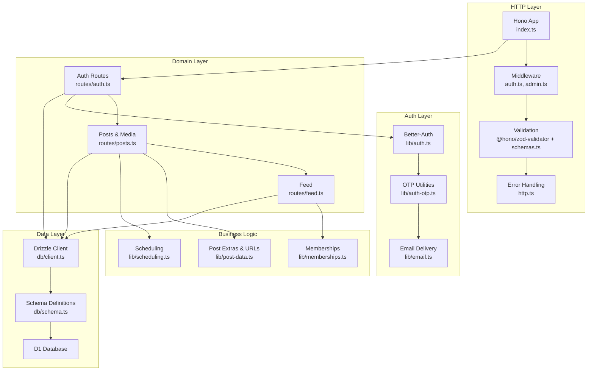
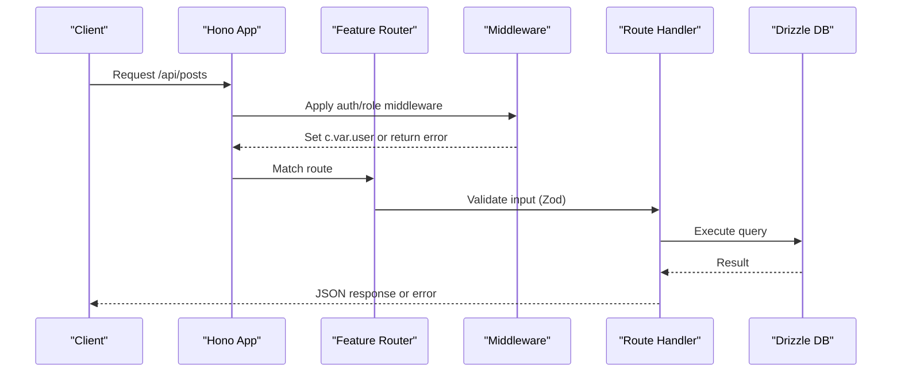
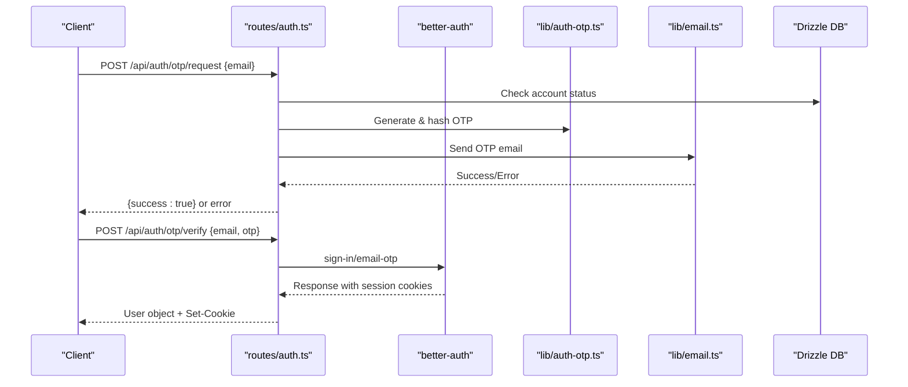
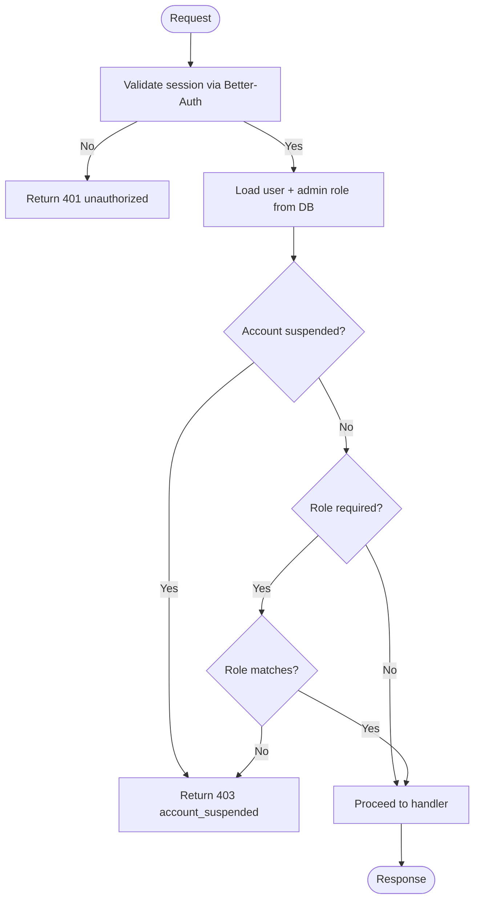
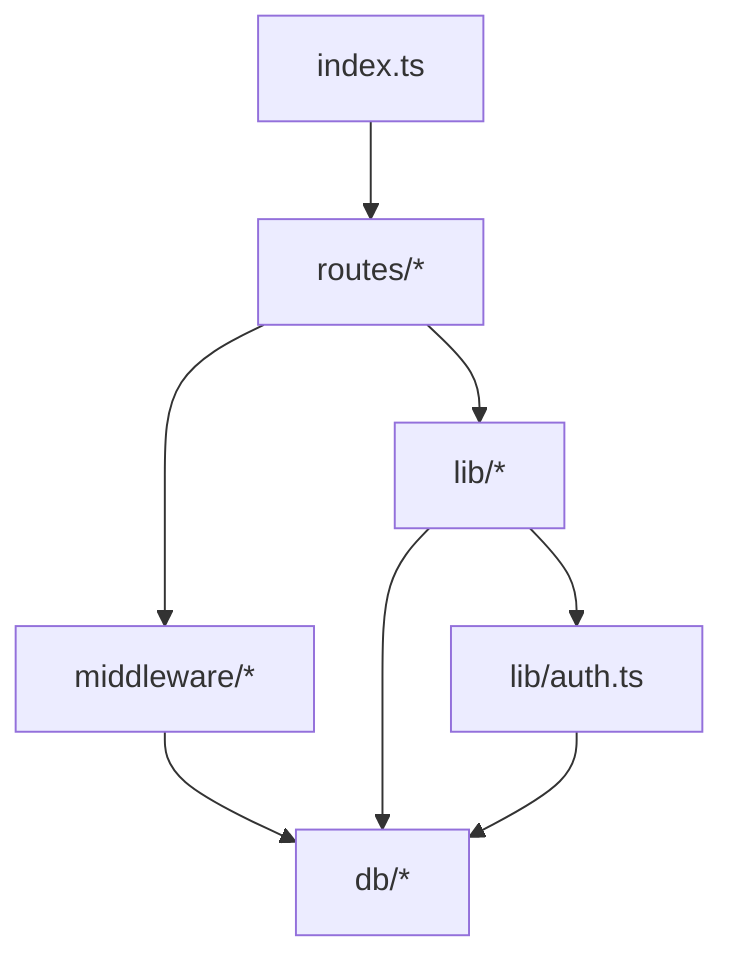

# Backend API

<cite>
**Referenced Files in This Document**
- [index.ts](file://src/worker/index.ts)
- [wrangler.json](file://wrangler.json)
- [schema.ts](file://src/worker/db/schema.ts)
- [client.ts](file://src/worker/db/client.ts)
- [auth.ts](file://src/worker/lib/auth.ts)
- [auth-middleware.ts](file://src/worker/middleware/auth.ts)
- [admin-middleware.ts](file://src/worker/middleware/admin.ts)
- [http.ts](file://src/worker/lib/http.ts)
- [schemas.ts](file://src/worker/lib/schemas.ts)
- [auth-routes.ts](file://src/worker/routes/auth.ts)
- [posts.ts](file://src/worker/routes/posts.ts)
- [feed.ts](file://src/worker/routes/feed.ts)
- [post-data.ts](file://src/worker/lib/post-data.ts)
- [auth-otp.ts](file://src/worker/lib/auth-otp.ts)
- [email.ts](file://src/worker/lib/email.ts)
</cite>

## Table of Contents
1. Introduction
2. Project Structure
3. Core Components
4. Architecture Overview
5. Detailed Component Analysis
6. Dependency Analysis
7. Performance Considerations
8. Troubleshooting Guide
9. Conclusion

## Introduction
This document provides comprehensive documentation for the Cloudflare Workers backend API built with Hono. It explains the framework setup, route organization by feature domain, middleware pipeline for authentication, validation, and authorization, and the database integration using Drizzle ORM with type-safe queries and schema definitions. It also details the business logic layer, authentication system with Better-Auth and email OTP verification, request/response schemas with Zod, error handling strategies, security considerations, and guidance for adding new endpoints and testing functionality.

## Project Structure
The Worker entrypoint wires up all feature routes under /api/*, configures global error and not-found handlers, and exposes scheduled tasks for background maintenance. Routes are organized by feature domain (auth, feed, profile, settings, creator, posts, articles, audio, photography, payments, notifications, courses, admin, reports, library, schedules, discovery). The application uses Wrangler configuration to bind D1, R2, Email, and environment variables.

```mermaid
graph TB
A["Worker Entry<br/>src/worker/index.ts"] --> B["Hono App<br/>Routes Mounting"]
B --> C["/api/auth<br/>routes/auth.ts"]
B --> D["/api/feed<br/>routes/feed.ts"]
B --> E["/api/profile<br/>routes/profile.ts"]
B --> F["/api/settings<br/>routes/settings.ts"]
B --> G["/api/creator<br/>routes/creator.ts"]
B --> H["/api/posts<br/>routes/posts.ts"]
B --> I["/api/articles<br/>routes/articles.ts"]
B --> J["/api/audio<br/>routes/audio.ts"]
B --> K["/api/photography<br/>routes/photography.ts"]
B --> L["/api/payments<br/>routes/payments.ts"]
B --> M["/api/notifications<br/>routes/notifications.ts"]
B --> N["/api/courses<br/>routes/courses.ts"]
B --> O["/api/admin<br/>routes/admin.ts"]
B --> P["/api/reports<br/>routes/reports.ts"]
B --> Q["/api/library<br/>routes/library.ts"]
B --> R["/api/schedules<br/>routes/schedules.ts"]
B --> S["/api/discovery<br/>routes/discovery.ts"]
A --> T["Scheduled Tasks<br/>processDueSchedules, processMembershipMaintenance"]
```

**Diagram sources**
- [index.ts:24-45](file://src/worker/index.ts#L24-L45)

**Section sources**
- [index.ts:1-71](file://src/worker/index.ts#L1-L71)
- [wrangler.json:1-139](file://wrangler.json#L1-L139)

## Core Components
- Hono app initialization and route mounting
- Middleware pipeline:
  - Authentication and role checks
  - Admin/owner authorization
- Validation layer with Zod via @hono/zod-validator
- Error handling utilities returning consistent JSON errors
- Database client factory for Drizzle ORM
- Schema definitions for all entities
- Business logic modules per feature area

Key responsibilities:
- index.ts: Wires routes, global error/notFound handlers, scheduled tasks
- middleware/auth.ts: Authenticates requests, loads user context, enforces roles
- middleware/admin.ts: Enforces admin/owner access
- lib/http.ts: Standardized error responses and helpers
- lib/schemas.ts: Zod schemas for input validation
- db/client.ts: Drizzle client creation
- db/schema.ts: Type-safe schema definitions
- lib/auth.ts: Better-Auth configuration with email OTP plugin
- lib/auth-otp.ts: OTP generation, hashing, storage, verification
- lib/email.ts: Transactional email sending via Cloudflare Email
- routes/*: Feature-specific endpoints and business logic

**Section sources**
- [index.ts:24-71](file://src/worker/index.ts#L24-L71)
- [auth-middleware.ts:1-57](file://src/worker/middleware/auth.ts#L1-L57)
- [admin-middleware.ts:1-14](file://src/worker/middleware/admin.ts#L1-L14)
- [http.ts:1-80](file://src/worker/lib/http.ts#L1-L80)
- [schemas.ts:1-221](file://src/worker/lib/schemas.ts#L1-L221)
- [client.ts:1-9](file://src/worker/db/client.ts#L1-L9)
- [schema.ts:1-978](file://src/worker/db/schema.ts#L1-L978)
- [auth.ts:1-80](file://src/worker/lib/auth.ts#L1-L80)
- [auth-otp.ts:1-124](file://src/worker/lib/auth-otp.ts#L1-L124)
- [email.ts:1-56](file://src/worker/lib/email.ts#L1-L56)

## Architecture Overview
The API follows a layered architecture:
- HTTP layer (Hono): Route handlers, middleware, validation, error formatting
- Auth layer (Better-Auth + custom OTP): Session management, OTP-based sign-in
- Domain layer (routes/*): Feature-specific controllers and orchestration
- Business logic (lib/*): Reusable functions for post data, memberships, scheduling, etc.
- Data layer (Drizzle ORM + D1): Type-safe queries against SQLite schema

**Diagram sources**
- [index.ts:24-45](file://src/worker/index.ts#L24-L45)
- [auth-middleware.ts:1-57](file://src/worker/middleware/auth.ts#L1-L57)
- [auth-routes.ts:1-259](file://src/worker/routes/auth.ts#L1-L259)
- [posts.ts:1-200](file://src/worker/routes/posts.ts#L1-L200)
- [feed.ts:1-200](file://src/worker/routes/feed.ts#L1-L200)
- [post-data.ts:1-200](file://src/worker/lib/post-data.ts#L1-L200)
- [client.ts:1-9](file://src/worker/db/client.ts#L1-L9)
- [schema.ts:1-978](file://src/worker/db/schema.ts#L1-L978)

## Detailed Component Analysis

### Hono Framework Setup and Route Organization
- The Hono app is created with typed environment and variables from auth middleware
- All feature routes are mounted under /api/<feature>
- Global onError returns standardized server errors; notFound handles API vs SPA assets

**Diagram sources**
- [index.ts:24-45](file://src/worker/index.ts#L24-L45)
- [auth-middleware.ts:1-57](file://src/worker/middleware/auth.ts#L1-L57)
- [posts.ts:1-200](file://src/worker/routes/posts.ts#L1-L200)

**Section sources**
- [index.ts:24-71](file://src/worker/index.ts#L24-L71)

### Authentication System with Better-Auth and Email OTP
- Better-Auth configured with Drizzle adapter and email OTP plugin
- Custom OTP flow: generate, store hashed OTP, send via Cloudflare Email, verify with attempt limits
- Legacy endpoints disabled; OTP-based sign-in used instead
- Session retrieval and cookie propagation handled consistently

**Diagram sources**
- [auth-routes.ts:135-212](file://src/worker/routes/auth.ts#L135-L212)
- [auth-otp.ts:26-124](file://src/worker/lib/auth-otp.ts#L26-L124)
- [email.ts:45-56](file://src/worker/lib/email.ts#L45-L56)
- [auth.ts:1-80](file://src/worker/lib/auth.ts#L1-L80)

**Section sources**
- [auth-routes.ts:1-259](file://src/worker/routes/auth.ts#L1-L259)
- [auth-otp.ts:1-124](file://src/worker/lib/auth-otp.ts#L1-L124)
- [email.ts:1-56](file://src/worker/lib/email.ts#L1-L56)
- [auth.ts:1-80](file://src/worker/lib/auth.ts#L1-L80)

### Middleware Pipeline: Authentication, Validation, Authorization
- authMiddleware: Validates session, loads user with role and admin role, blocks suspended accounts
- requireRole: Restricts endpoints to specific roles
- adminMiddleware/ownerMiddleware: Enforce administrative privileges

**Diagram sources**
- [auth-middleware.ts:23-50](file://src/worker/middleware/auth.ts#L23-L50)
- [admin-middleware.ts:5-13](file://src/worker/middleware/admin.ts#L5-L13)

**Section sources**
- [auth-middleware.ts:1-57](file://src/worker/middleware/auth.ts#L1-L57)
- [admin-middleware.ts:1-14](file://src/worker/middleware/admin.ts#L1-L14)

### Database Integration with Drizzle ORM
- Schema defines all tables with types, constraints, indexes, and timestamps
- Client factory creates a typed Drizzle instance bound to D1
- Queries use Drizzle ORM for type safety and performance

Key entities include users, sessions, accounts, verification tokens, posts, articles, audio collections/items, photography albums/photos, courses, polls, replies, likes, saved items, subscriptions, membership plans, payment customers, moderation cases, audit logs, and more.

**Section sources**
- [schema.ts:1-978](file://src/worker/db/schema.ts#L1-L978)
- [client.ts:1-9](file://src/worker/db/client.ts#L1-L9)

### Request/Response Schemas and Validation Patterns
- Zod schemas define strict input validation for auth, posts, replies, polls, profiles, settings, subscriptions, and more
- @hono/zod-validator integrates validation into route handlers with a unified hook
- Consistent error responses for validation failures

Examples:
- authOtpRequestSchema, authOtpVerifySchema
- postCreateSchema, replyCreateJsonSchema, pollVoteSchema
- profileSettingsSchema, usernameSettingsSchema
- membershipSubscribeSchema, customerPortalSchema

**Section sources**
- [schemas.ts:1-221](file://src/worker/lib/schemas.ts#L1-L221)
- [http.ts:77-80](file://src/worker/lib/http.ts#L77-L80)

### Error Handling Strategies
- Centralized errorResponse utility returns structured JSON with code, message, and optional details
- Specific helpers for common statuses: badRequest, unauthorized, forbidden, notFound, conflict, payloadTooLarge, unsupportedMediaType, serverError
- Validation failures return 422 with issues array

**Section sources**
- [http.ts:1-80](file://src/worker/lib/http.ts#L1-L80)

### Security Considerations
- Input sanitization via Zod schemas and strict parsing
- OTP stored as hashed values with constant-time comparison to prevent timing attacks
- Attempt limiting for OTP verification
- Account suspension checks before allowing actions
- Content-type and size validations for uploads
- CORS and trusted origins configured through Better-Auth and Wrangler

Security best practices implemented:
- Hashed OTP storage and secure comparison
- Rate-limiting patterns via allowedAttempts
- Strict URL validation for social links
- Controlled media upload types and sizes

**Section sources**
- [auth-otp.ts:17-43](file://src/worker/lib/auth-otp.ts#L17-L43)
- [auth-routes.ts:135-212](file://src/worker/routes/auth.ts#L135-L212)
- [posts.ts:121-140](file://src/worker/routes/posts.ts#L121-L140)
- [auth.ts:12-22](file://src/worker/lib/auth.ts#L12-L22)

### Adding New Endpoints
Steps:
1. Define Zod schema in lib/schemas.ts if needed
2. Create or extend route file under src/worker/routes/<feature>.ts
3. Add middleware chain: authMiddleware, requireRole, adminMiddleware as appropriate
4. Use createDb for type-safe queries against db/schema.ts
5. Return standardized responses using c.json or errorResponse helpers
6. Register route in index.ts under /api/<feature>

Example pattern:
- POST /api/<feature>/resource with zValidator('json', schema, zodHook)
- GET /api/<feature>/resource/:id with param validation
- Protected endpoints with authMiddleware and role checks

**Section sources**
- [index.ts:26-45](file://src/worker/index.ts#L26-L45)
- [auth-routes.ts:135-212](file://src/worker/routes/auth.ts#L135-L212)
- [posts.ts:1-200](file://src/worker/routes/posts.ts#L1-L200)

### Testing API Functionality
- Use integration tests for auth flows (OTP request/verify, logout)
- Mock D1 and R2 bindings for unit tests
- Validate request/response schemas with Zod
- Assert error codes and messages match expected patterns

Testing recommendations:
- Test both success and failure paths
- Verify middleware behavior (auth, role, admin)
- Ensure scheduled tasks run correctly in test environments

[No sources needed since this section provides general guidance]

## Dependency Analysis
The API has clear separation between HTTP, auth, domain, business logic, and data layers. Dependencies flow downward without circular imports.

**Diagram sources**
- [index.ts:24-45](file://src/worker/index.ts#L24-L45)
- [auth-middleware.ts:1-57](file://src/worker/middleware/auth.ts#L1-L57)
- [auth.ts:1-80](file://src/worker/lib/auth.ts#L1-L80)
- [client.ts:1-9](file://src/worker/db/client.ts#L1-L9)

**Section sources**
- [index.ts:24-45](file://src/worker/index.ts#L24-L45)

## Performance Considerations
- Batched queries for post extras reduce round trips
- Indexed columns optimize frequent lookups (authorId, createdAt, status, publishedAt)
- Limit clauses prevent large result sets
- Efficient media URL generation avoids unnecessary computations
- Scheduled tasks run asynchronously to avoid blocking requests

Optimization opportunities:
- Cache frequently accessed data (e.g., creator profiles)
- Implement pagination for large feeds
- Use connection pooling where applicable

[No sources needed since this section provides general guidance]

## Troubleshooting Guide
Common issues and resolutions:
- 401 Unauthorized: Missing or invalid session; ensure cookies are sent
- 403 Forbidden: Insufficient role or suspended account; check user.role and accountStatus
- 422 Validation Failed: Invalid input; review Zod schema and request payload
- 503 OTP Email Unavailable: Email binding misconfigured; verify NOTIFICATION_EMAIL
- Not Found: Incorrect route or missing resource; verify path and parameters

Debugging tips:
- Enable invocation logs and traces in Wrangler
- Log error codes and messages from errorResponse
- Validate environment variables and secrets

**Section sources**
- [http.ts:23-75](file://src/worker/lib/http.ts#L23-L75)
- [auth-routes.ts:150-161](file://src/worker/routes/auth.ts#L150-L161)

## Conclusion
The Cloudflare Workers backend API is a well-structured, secure, and scalable system built with Hono, Better-Auth, Drizzle ORM, and Zod. It provides a robust foundation for content management, user authentication, and subscription-based features. The modular design facilitates easy extension and maintenance while ensuring strong security and performance characteristics.

[No sources needed since this section summarizes without analyzing specific files]