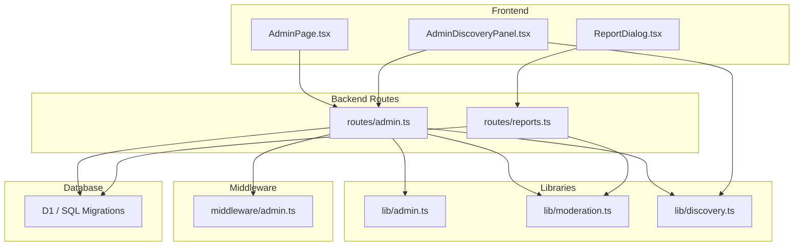
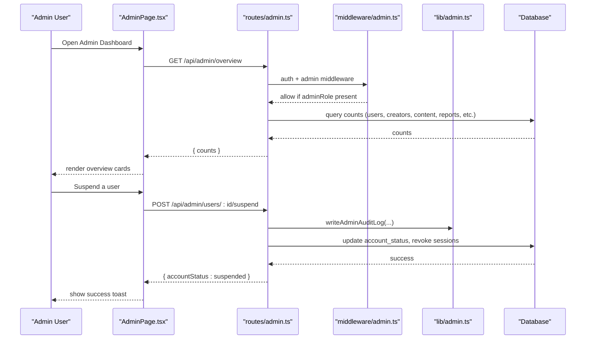
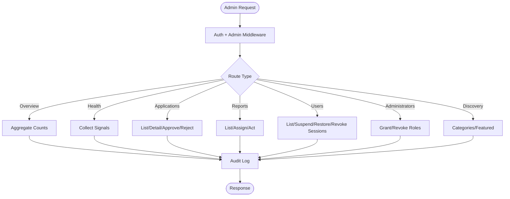
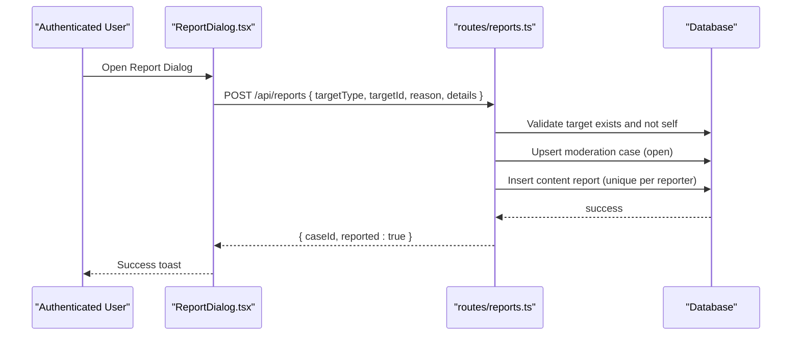
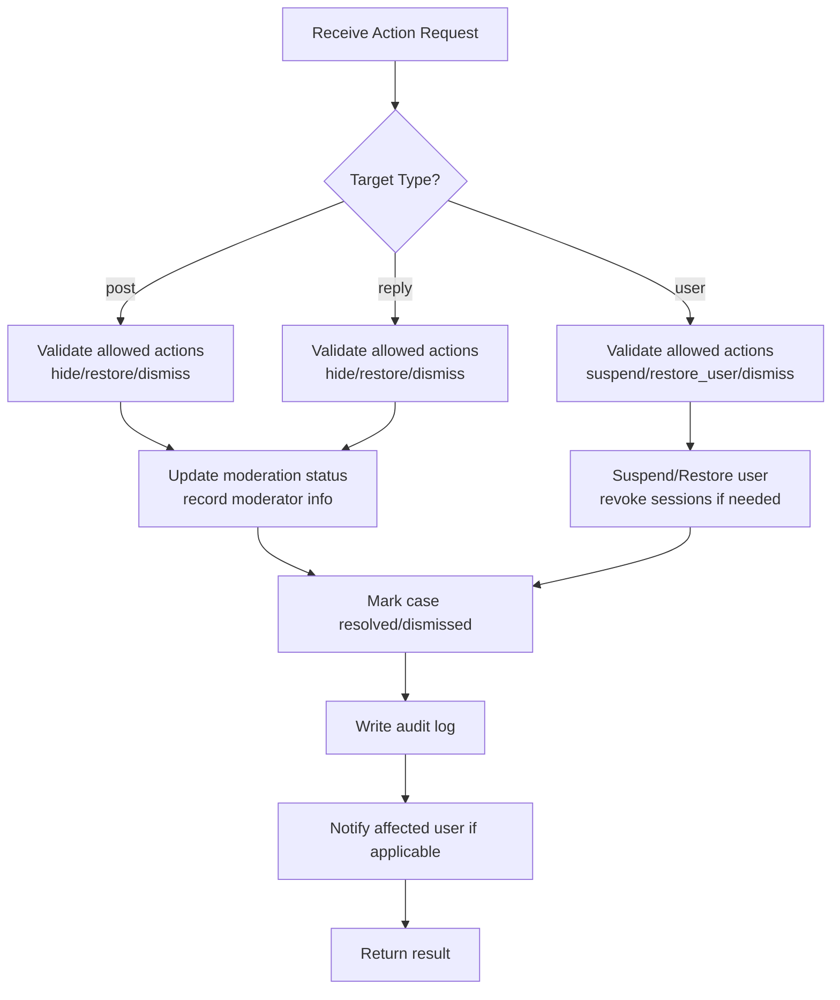
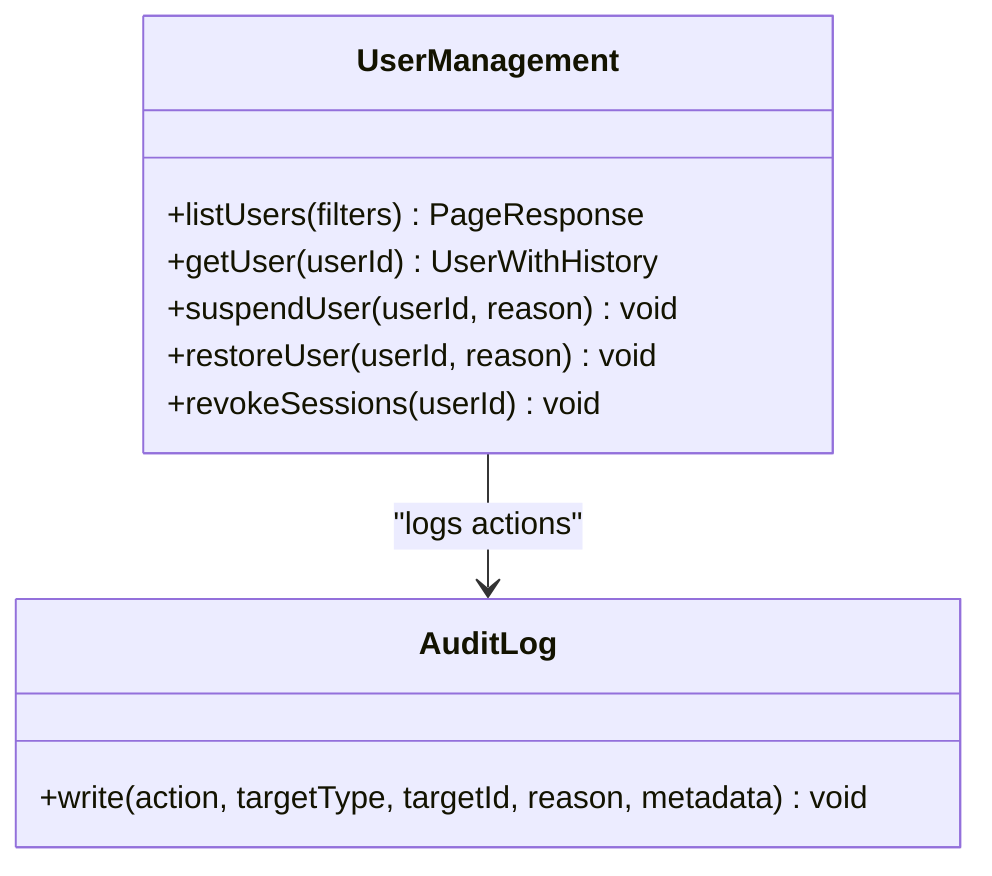
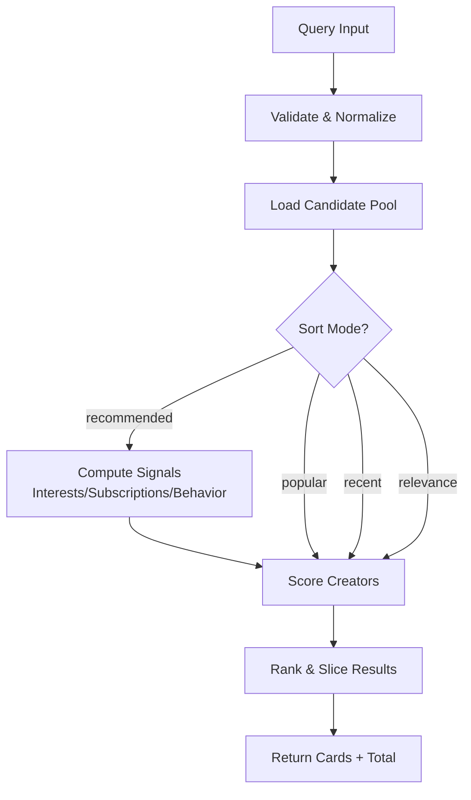
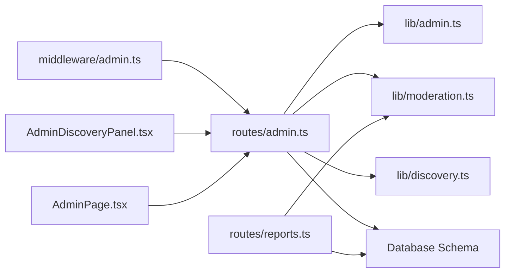

# Admin & Moderation Logic

<cite>
**Referenced Files in This Document**
- [admin.ts](file://src/worker/routes/admin.ts)
- [reports.ts](file://src/worker/routes/reports.ts)
- [admin.ts](file://src/worker/lib/admin.ts)
- [moderation.ts](file://src/worker/lib/moderation.ts)
- [discovery.ts](file://src/worker/lib/discovery.ts)
- [admin.ts](file://src/worker/middleware/admin.ts)
- [AdminPage.tsx](file://src/react-app/pages/AdminPage.tsx)
- [AdminDiscoveryPanel.tsx](file://src/react-app/components/AdminDiscoveryPanel.tsx)
- [ReportDialog.tsx](file://src/react-app/components/ReportDialog.tsx)
- [admin.ts](file://src/react-app/lib/admin.ts)
- [0011_admin_dashboard.sql](file://drizzle/0011_admin_dashboard.sql)
- [0015_creator_discovery.sql](file://drizzle/0015_creator_discovery.sql)
</cite>

## Table of Contents
1. Introduction
2. Project Structure
3. Core Components
4. Architecture Overview
5. Detailed Component Analysis
6. Dependency Analysis
7. Performance Considerations
8. Troubleshooting Guide
9. Conclusion

## Introduction
This document explains the administrative and moderation business logic for the platform. It covers user management operations, content review workflows, platform analytics, moderation tools (content flagging, user suspension, policy enforcement), discovery algorithms for content recommendation and creator categorization, and examples of admin dashboard operations including bulk actions and reporting mechanisms. The documentation is designed to be accessible to both technical and non-technical readers while providing code-level references and diagrams.

## Project Structure
The admin and moderation system spans server-side routes, shared libraries, middleware, database migrations, and a React-based admin dashboard:
- Server routes handle admin endpoints for overview, health, applications, reports, users, audit log, administrators, and discovery settings.
- Shared libraries implement audit logging, moderation state checks, and discovery ranking/search.
- Middleware enforces admin and owner roles.
- Database migrations define core tables for admin memberships, moderation cases, content reports, audit logs, discovery categories, featured creators, and user interests.
- The React admin UI provides dashboards for overview, applications, reports, users, discovery, health, audit log, and administrators.

**Diagram sources**
- [AdminPage.tsx](file://src/react-app/pages/AdminPage.tsx)
- [AdminDiscoveryPanel.tsx](file://src/react-app/components/AdminDiscoveryPanel.tsx)
- [ReportDialog.tsx](file://src/react-app/components/ReportDialog.tsx)
- [admin.ts](file://src/worker/routes/admin.ts)
- [reports.ts](file://src/worker/routes/reports.ts)
- [admin.ts](file://src/worker/lib/admin.ts)
- [moderation.ts](file://src/worker/lib/moderation.ts)
- [discovery.ts](file://src/worker/lib/discovery.ts)
- [admin.ts](file://src/worker/middleware/admin.ts)

**Section sources**
- [admin.ts](file://src/worker/routes/admin.ts)
- [reports.ts](file://src/worker/routes/reports.ts)
- [admin.ts](file://src/worker/lib/admin.ts)
- [moderation.ts](file://src/worker/lib/moderation.ts)
- [discovery.ts](file://src/worker/lib/discovery.ts)
- [admin.ts](file://src/worker/middleware/admin.ts)
- [AdminPage.tsx](file://src/react-app/pages/AdminPage.tsx)
- [AdminDiscoveryPanel.tsx](file://src/react-app/components/AdminDiscoveryPanel.tsx)
- [ReportDialog.tsx](file://src/react-app/components/ReportDialog.tsx)
- [0011_admin_dashboard.sql](file://drizzle/0011_admin_dashboard.sql)
- [0015_creator_discovery.sql](file://drizzle/0015_creator_discovery.sql)

## Core Components
- Admin API endpoints: overview counts, health signals, creator application review, moderation case handling, user lifecycle actions, audit log queries, administrator role management, and discovery category/featured creator management.
- Reporting endpoint: allows authenticated users to report posts, replies, or users; creates or reopens moderation cases and records reports.
- Audit logging: writes immutable records of all admin actions with actor, action type, target, reason, and metadata.
- Moderation utilities: helpers to check post moderation state and visibility rules.
- Discovery engine: computes eligible creators, recommended lists, search results, and category summaries using signals from interests, subscriptions, and behavior.
- Middleware: enforces admin and owner roles on protected routes.

Key responsibilities:
- User management: suspend, restore, revoke sessions, list/filter users, manage admin roles.
- Content review: assign cases, hide/restore content, dismiss cases, track resolution actions.
- Platform analytics: overview counts and health signals across notifications, payments, schedules, and moderation workload.
- Discovery: taxonomy management, featured curation, and algorithmic recommendations.

**Section sources**
- [admin.ts](file://src/worker/routes/admin.ts)
- [reports.ts](file://src/worker/routes/reports.ts)
- [admin.ts](file://src/worker/lib/admin.ts)
- [moderation.ts](file://src/worker/lib/moderation.ts)
- [discovery.ts](file://src/worker/lib/discovery.ts)
- [admin.ts](file://src/worker/middleware/admin.ts)

## Architecture Overview
The admin and moderation architecture follows a clear separation between frontend dashboards, backend routes, shared libraries, and persistent storage. Requests flow through authentication and authorization middleware before reaching route handlers that perform database operations and emit audit logs.

**Diagram sources**
- [AdminPage.tsx](file://src/react-app/pages/AdminPage.tsx)
- [admin.ts](file://src/worker/routes/admin.ts)
- [admin.ts](file://src/worker/middleware/admin.ts)
- [admin.ts](file://src/worker/lib/admin.ts)

## Detailed Component Analysis

### Admin API Endpoints
- Overview: aggregates key metrics such as total users, creators, content, pending applications, open reports, suspended users, and hidden content.
- Health: returns multiple signals indicating operational status across notifications, uploads, memberships, webhooks, schedules, and moderation workload.
- Creator Applications: paginated listing, detail retrieval, document viewing, approve/reject decisions with audit logging and notifications.
- Reports: paginated listing with filters (status, target type, assignment), detail view with associated reports, assignment to admins, and resolution actions.
- Users: paginated listing with search and filters (role, account status, admin membership), individual user details with history, suspend/restore, session revocation.
- Administrators: list, grant/revoke roles with safety checks to ensure at least one owner remains.
- Discovery: CRUD for categories, order updates, eligible/featured creator queries, and curated featured list replacement.

**Diagram sources**
- [admin.ts](file://src/worker/routes/admin.ts)
- [admin.ts](file://src/worker/middleware/admin.ts)
- [admin.ts](file://src/worker/lib/admin.ts)

**Section sources**
- [admin.ts](file://src/worker/routes/admin.ts)

### Reporting Workflow
Users can report posts, replies, or users. The endpoint validates targets, prevents self-reporting, creates or reopens moderation cases, and records reports.

**Diagram sources**
- [ReportDialog.tsx](file://src/react-app/components/ReportDialog.tsx)
- [reports.ts](file://src/worker/routes/reports.ts)

**Section sources**
- [reports.ts](file://src/worker/routes/reports.ts)
- [ReportDialog.tsx](file://src/react-app/components/ReportDialog.tsx)

### Moderation Case Resolution
Moderators can assign cases, hide/restore content, dismiss cases, and suspend/restore users. Actions are validated against target types and enforced via audit logging and notifications.

**Diagram sources**
- [admin.ts](file://src/worker/routes/admin.ts)

**Section sources**
- [admin.ts](file://src/worker/routes/admin.ts)

### User Management Operations
Admins can list users with filters, view detailed history, suspend/restore accounts, and revoke sessions. Suspensions trigger notifications and session revocation. Restorations clear suspension fields.

**Diagram sources**
- [admin.ts](file://src/worker/routes/admin.ts)
- [admin.ts](file://src/worker/lib/admin.ts)

**Section sources**
- [admin.ts](file://src/worker/routes/admin.ts)
- [admin.ts](file://src/worker/lib/admin.ts)

### Discovery Algorithms and Tools
The discovery system supports:
- Category management: create, update, reorder, activate/deactivate.
- Featured creators: curate up to a fixed maximum, enforce eligibility, and replace the list atomically.
- Recommendation scoring: combines subscriber count, recent publication activity, and category signals (interests, subscriptions, behavior).
- Search and filtering: by query, category, sort modes (relevance, recommended, popular, recent), pagination.

**Diagram sources**
- [discovery.ts](file://src/worker/lib/discovery.ts)

**Section sources**
- [discovery.ts](file://src/worker/lib/discovery.ts)
- [admin.ts](file://src/worker/routes/admin.ts)

### Admin Dashboard Operations
The React admin interface provides:
- Overview: displays aggregated counts.
- Applications: filter, paginate, view details, download NID documents, approve/reject with reasons and notes.
- Reports: filter by status, assign to self, dismiss/hide/suspend/restore with reasons and notes.
- Users: filter by role/account status/admin membership, suspend/restore, revoke sessions.
- Discovery: manage categories (create/edit/order), curate featured creators (search/add/remove/order/save).
- Health: shows overall status and per-signal details with optional external dashboard link.
- Audit Log: paginated view of admin actions with actor, action, target, reason, timestamp.
- Administrators: grant/revoke roles with safety constraints.

Examples:
- Approving a creator application triggers role change and notification.
- Hiding a reported post updates moderation status and notifies the author.
- Suspending a user sets account status, clears sessions, and sends a suspension notice.
- Saving category order persists display_order and audits the change.

**Section sources**
- [AdminPage.tsx](file://src/react-app/pages/AdminPage.tsx)
- [AdminDiscoveryPanel.tsx](file://src/react-app/components/AdminDiscoveryPanel.tsx)

## Dependency Analysis
- Middleware dependency: All admin routes depend on authentication and admin role checks. Owner-only routes require owner role.
- Library dependencies: Admin routes use audit logging, moderation utilities, and discovery functions.
- Data model dependencies: Migrations define relationships among users, posts, post_replies, moderation_cases, content_reports, admin_memberships, admin_audit_logs, discovery_categories, creator_categories, user_category_interests, and featured_creators.

**Diagram sources**
- [admin.ts](file://src/worker/middleware/admin.ts)
- [admin.ts](file://src/worker/routes/admin.ts)
- [reports.ts](file://src/worker/routes/reports.ts)
- [admin.ts](file://src/worker/lib/admin.ts)
- [moderation.ts](file://src/worker/lib/moderation.ts)
- [discovery.ts](file://src/worker/lib/discovery.ts)
- [AdminDiscoveryPanel.tsx](file://src/react-app/components/AdminDiscoveryPanel.tsx)
- [AdminPage.tsx](file://src/react-app/pages/AdminPage.tsx)

**Section sources**
- [admin.ts](file://src/worker/middleware/admin.ts)
- [admin.ts](file://src/worker/routes/admin.ts)
- [reports.ts](file://src/worker/routes/reports.ts)
- [admin.ts](file://src/worker/lib/admin.ts)
- [moderation.ts](file://src/worker/lib/moderation.ts)
- [discovery.ts](file://src/worker/lib/discovery.ts)
- [AdminDiscoveryPanel.tsx](file://src/react-app/components/AdminDiscoveryPanel.tsx)
- [AdminPage.tsx](file://src/react-app/pages/AdminPage.tsx)

## Performance Considerations
- Pagination: All list endpoints support page and pageSize parameters with bounded limits to prevent excessive loads.
- Batch operations: Approval/rejection and featured creator updates use batched statements for atomicity and efficiency.
- Query optimization: Aggregations and counts use targeted SQL with indexes defined in migrations (e.g., moderation status, timestamps, roles).
- Signal collection: Health endpoint performs parallel queries to minimize latency across independent metrics.
- Recommendation pool: Ranking uses a capped candidate pool to keep computation tractable.

[No sources needed since this section provides general guidance]

## Troubleshooting Guide
Common issues and resolutions:
- Forbidden access: Ensure the current user has an admin role; owner-only endpoints require owner role.
- Duplicate reports: Users cannot report the same item twice; the system prevents duplicate entries.
- Invalid actions: Actions must match target types (e.g., hide/restore for posts/replies; suspend/restore for users).
- Eligibility constraints: Featured creators must be eligible (active creators with published content).
- Safety constraints: Final owner cannot be demoted or removed; attempts will fail with conflict responses.
- Stale data: Refresh pages after mutations; the UI invalidates relevant queries on successful mutations.

Operational tips:
- Use the audit log to trace admin actions and reasons.
- Check health signals for attention states and investigate failed emails, webhook failures, or stuck schedules.
- Review moderation case statuses and assigned admins to balance workload.

**Section sources**
- [admin.ts](file://src/worker/routes/admin.ts)
- [reports.ts](file://src/worker/routes/reports.ts)
- [admin.ts](file://src/worker/middleware/admin.ts)

## Conclusion
The admin and moderation system provides robust controls for user management, content review, platform analytics, and discovery curation. It enforces strong authorization, comprehensive auditing, and efficient data operations. The React dashboard offers intuitive workflows for common tasks, while the backend ensures correctness, safety, and scalability.

[No sources needed since this section summarizes without analyzing specific files]