# Authentication & Authorization Logic

<cite>
**Referenced Files in This Document**
- [auth.ts](file://src/worker/lib/auth.ts)
- [auth-otp.ts](file://src/worker/lib/auth-otp.ts)
- [email.ts](file://src/worker/lib/email.ts)
- [auth.ts](file://src/worker/routes/auth.ts)
- [auth.ts](file://src/worker/middleware/auth.ts)
- [admin.ts](file://src/worker/middleware/admin.ts)
- [schema.ts](file://src/worker/db/schema.ts)
- [auth.ts](file://src/react-app/lib/auth.ts)
- [AuthContext.tsx](file://src/react-app/context/AuthContext.tsx)
- [LoginPage.tsx](file://src/react-app/pages/LoginPage.tsx)
- [RegisterPage.tsx](file://src/react-app/pages/RegisterPage.tsx)
- [ProtectedRoute.tsx](file://src/react-app/components/ProtectedRoute.tsx)
- [CreatorRoute.tsx](file://src/react-app/components/CreatorRoute.tsx)
</cite>

## Table of Contents
1. [Introduction](#introduction)
2. [Project Structure](#project-structure)
3. [Core Components](#core-components)
4. [Architecture Overview](#architecture-overview)
5. [Detailed Component Analysis](#detailed-component-analysis)
6. [Dependency Analysis](#dependency-analysis)
7. [Performance Considerations](#performance-considerations)
8. [Troubleshooting Guide](#troubleshooting-guide)
9. [Conclusion](#conclusion)

## Introduction
This document explains the authentication and authorization logic for the application, focusing on Better-Auth integration, email OTP verification workflow, session management, and role-based access control (RBAC). It covers the end-to-end flow from registration to login, including OTP generation, validation, security measures, user state management, token handling, and middleware patterns. It also provides examples of protected routes, permission checks, and common scenarios.

## Project Structure
The authentication system spans both the server-side worker and the React frontend:
- Worker side: Better-Auth configuration, OTP utilities, email delivery, API routes, middleware, and database schema.
- Frontend side: Auth context, API helpers, pages for login/register, and route guards.

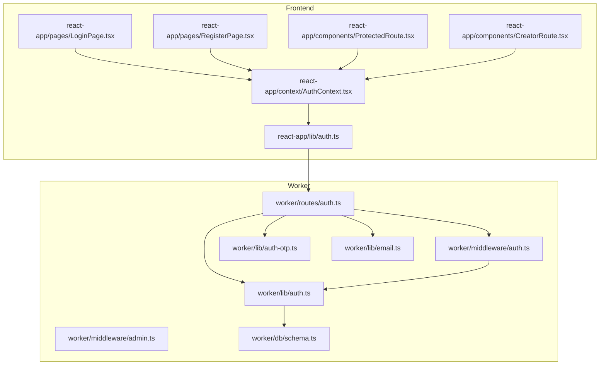

**Diagram sources**
- [auth.ts:1-259](file://src/worker/routes/auth.ts#L1-L259)
- [auth.ts:1-57](file://src/worker/middleware/auth.ts#L1-L57)
- [admin.ts:1-14](file://src/worker/middleware/admin.ts#L1-L14)
- [auth.ts:1-80](file://src/worker/lib/auth.ts#L1-L80)
- [auth-otp.ts:1-124](file://src/worker/lib/auth-otp.ts#L1-L124)
- [email.ts:1-56](file://src/worker/lib/email.ts#L1-L56)
- [schema.ts:107-165](file://src/worker/db/schema.ts#L107-L165)
- [auth.ts:1-55](file://src/react-app/lib/auth.ts#L1-L55)
- [AuthContext.tsx:1-90](file://src/react-app/context/AuthContext.tsx#L1-L90)
- [LoginPage.tsx:1-158](file://src/react-app/pages/LoginPage.tsx#L1-L158)
- [RegisterPage.tsx:1-158](file://src/react-app/pages/RegisterPage.tsx#L1-L158)
- [ProtectedRoute.tsx:1-19](file://src/react-app/components/ProtectedRoute.tsx#L1-L19)
- [CreatorRoute.tsx:1-23](file://src/react-app/components/CreatorRoute.tsx#L1-L23)

**Section sources**
- [auth.ts:1-259](file://src/worker/routes/auth.ts#L1-L259)
- [auth.ts:1-57](file://src/worker/middleware/auth.ts#L1-L57)
- [admin.ts:1-14](file://src/worker/middleware/admin.ts#L1-L14)
- [auth.ts:1-80](file://src/worker/lib/auth.ts#L1-L80)
- [auth-otp.ts:1-124](file://src/worker/lib/auth-otp.ts#L1-L124)
- [email.ts:1-56](file://src/worker/lib/email.ts#L1-L56)
- [schema.ts:107-165](file://src/worker/db/schema.ts#L107-L165)
- [auth.ts:1-55](file://src/react-app/lib/auth.ts#L1-L55)
- [AuthContext.tsx:1-90](file://src/react-app/context/AuthContext.tsx#L1-L90)
- [LoginPage.tsx:1-158](file://src/react-app/pages/LoginPage.tsx#L1-L158)
- [RegisterPage.tsx:1-158](file://src/react-app/pages/RegisterPage.tsx#L1-L158)
- [ProtectedRoute.tsx:1-19](file://src/react-app/components/ProtectedRoute.tsx#L1-L19)
- [CreatorRoute.tsx:1-23](file://src/react-app/components/CreatorRoute.tsx#L1-L23)

## Core Components
- Better-Auth setup with Drizzle adapter and emailOTP plugin.
- OTP utilities for generation, hashing, storage, and verification.
- Email delivery for OTP codes.
- API routes for OTP request/verify, logout, and current user retrieval.
- Middleware for authenticated sessions and role checks.
- Admin/owner middleware for elevated permissions.
- Frontend auth context and API helpers.
- Route guards for protected and creator-only routes.

Key responsibilities:
- Server: Validate requests, manage sessions via cookies, enforce roles, store OTPs securely, send emails.
- Client: Initiate OTP flows, handle responses, maintain user state, guard routes based on auth status and roles.

**Section sources**
- [auth.ts:1-80](file://src/worker/lib/auth.ts#L1-L80)
- [auth-otp.ts:1-124](file://src/worker/lib/auth-otp.ts#L1-L124)
- [email.ts:1-56](file://src/worker/lib/email.ts#L1-L56)
- [auth.ts:1-259](file://src/worker/routes/auth.ts#L1-L259)
- [auth.ts:1-57](file://src/worker/middleware/auth.ts#L1-L57)
- [admin.ts:1-14](file://src/worker/middleware/admin.ts#L1-L14)
- [auth.ts:1-55](file://src/react-app/lib/auth.ts#L1-L55)
- [AuthContext.tsx:1-90](file://src/react-app/context/AuthContext.tsx#L1-L90)
- [ProtectedRoute.tsx:1-19](file://src/react-app/components/ProtectedRoute.tsx#L1-L19)
- [CreatorRoute.tsx:1-23](file://src/react-app/components/CreatorRoute.tsx#L1-L23)

## Architecture Overview
The authentication architecture integrates Better-Auth with custom OTP flows and Hono middleware for robust session and role enforcement.

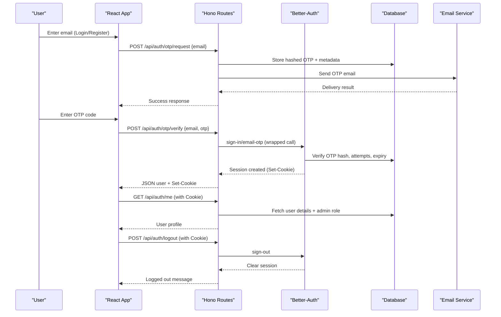

**Diagram sources**
- [auth.ts:135-220](file://src/worker/routes/auth.ts#L135-L220)
- [auth.ts:1-80](file://src/worker/lib/auth.ts#L1-L80)
- [auth-otp.ts:67-124](file://src/worker/lib/auth-otp.ts#L67-L124)
- [email.ts:45-56](file://src/worker/lib/email.ts#L45-L56)
- [schema.ts:107-165](file://src/worker/db/schema.ts#L107-L165)

## Detailed Component Analysis

### Better-Auth Integration
- Configured with Drizzle adapter using SQLite schema mapping.
- Email/password disabled; only email OTP enabled via plugin.
- Custom user fields include role, username, tagline, avatar R2 key, social links.
- Base URL and secret configured for secure cookie handling.

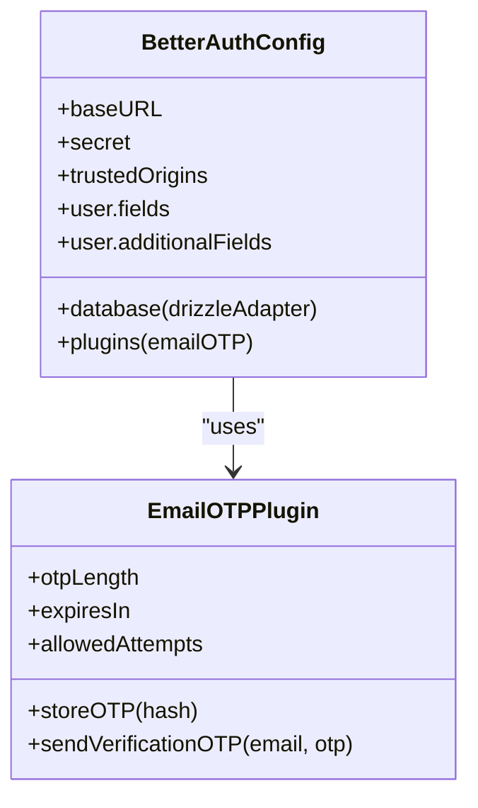

**Diagram sources**
- [auth.ts:1-80](file://src/worker/lib/auth.ts#L1-L80)

**Section sources**
- [auth.ts:1-80](file://src/worker/lib/auth.ts#L1-L80)

### OTP Generation, Storage, and Verification
- OTP length, expiration, and max attempts are defined constants.
- Secure generation uses cryptographic random values.
- Hashing uses SHA-256 with base64url encoding; constant-time comparison prevents timing attacks.
- Storage includes identifier, hashed value, attempt counter, and expiry timestamp.
- Verification enforces expiry, attempt limits, and deletes OTP upon success.

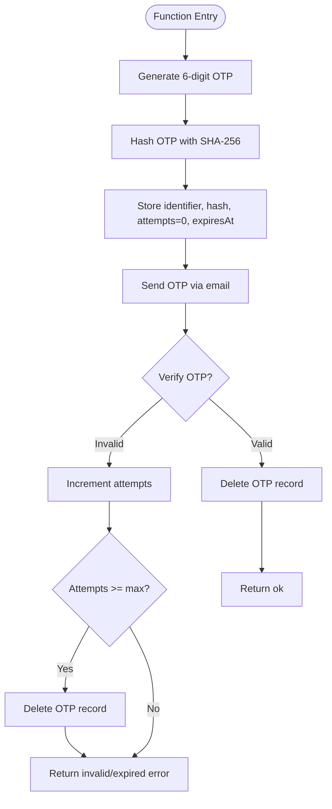

**Diagram sources**
- [auth-otp.ts:26-124](file://src/worker/lib/auth-otp.ts#L26-L124)

**Section sources**
- [auth-otp.ts:1-124](file://src/worker/lib/auth-otp.ts#L1-L124)

### Email Delivery
- Uses Cloudflare Email binding for transactional emails.
- OTP email includes code and expiration notice.
- Error handling returns specific status when delivery fails.

**Section sources**
- [email.ts:1-56](file://src/worker/lib/email.ts#L1-L56)

### API Routes: OTP Request, Verify, Logout, Me
- OTP request validates account status, stores OTP, sends email, and cleans up on failure.
- OTP verify calls Better-Auth’s sign-in endpoint, maps legacy user shape, and forwards cookies.
- Logout clears session via Better-Auth.
- Me endpoint fetches enriched user data including admin role.

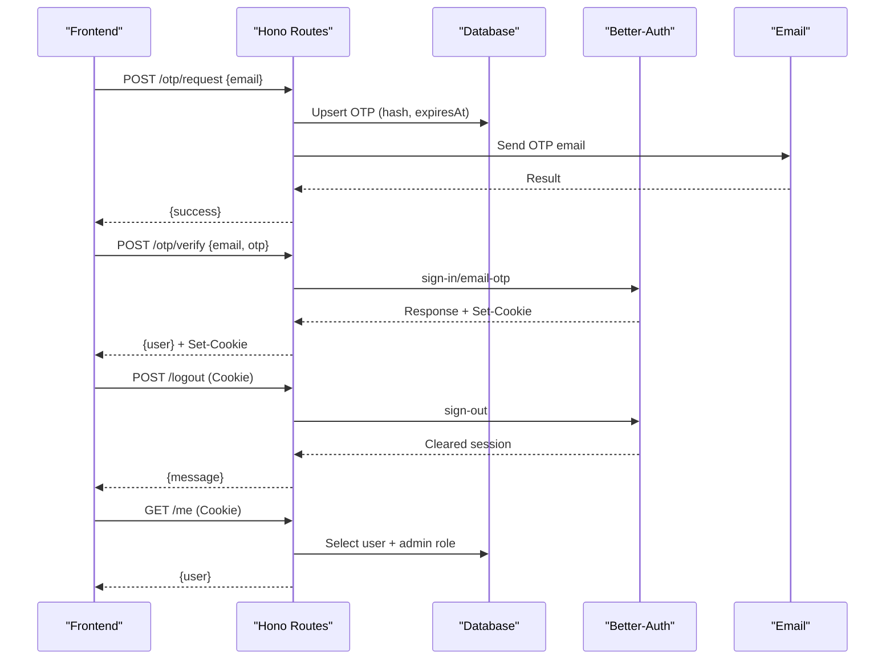

**Diagram sources**
- [auth.ts:135-249](file://src/worker/routes/auth.ts#L135-L249)

**Section sources**
- [auth.ts:1-259](file://src/worker/routes/auth.ts#L1-L259)

### Middleware: Authentication and Role Checks
- authMiddleware validates session via Better-Auth, loads user with role and admin role, blocks suspended accounts.
- requireRole enforces subscriber or creator role.
- adminMiddleware and ownerMiddleware enforce administrator privileges.

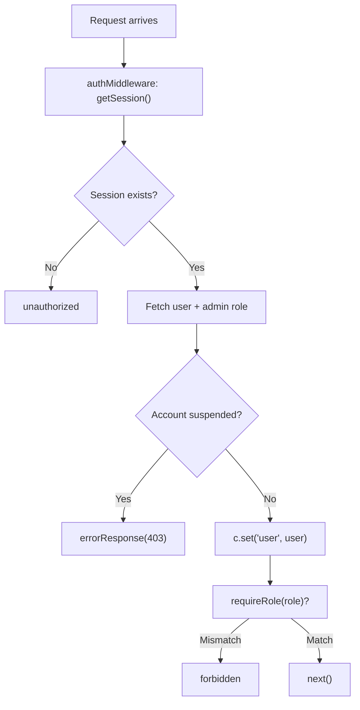

**Diagram sources**
- [auth.ts:1-57](file://src/worker/middleware/auth.ts#L1-L57)
- [admin.ts:1-14](file://src/worker/middleware/admin.ts#L1-L14)

**Section sources**
- [auth.ts:1-57](file://src/worker/middleware/auth.ts#L1-L57)
- [admin.ts:1-14](file://src/worker/middleware/admin.ts#L1-L14)

### Database Schema: Users, Sessions, Verifications
- users table includes role, accountStatus, and profile fields.
- session table stores Better-Auth sessions with token and timestamps.
- verification table stores OTP records with identifiers, hashes, and expiry.

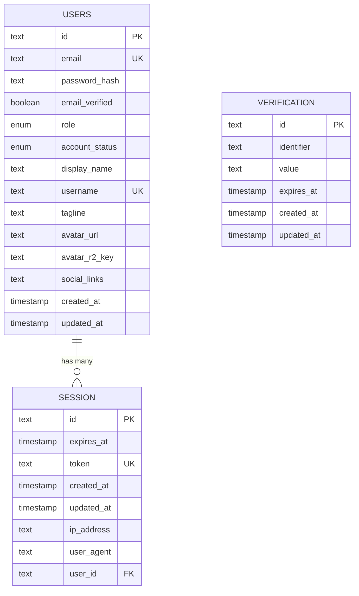

**Diagram sources**
- [schema.ts:5-32](file://src/worker/db/schema.ts#L5-L32)
- [schema.ts:107-165](file://src/worker/db/schema.ts#L107-L165)

**Section sources**
- [schema.ts:1-200](file://src/worker/db/schema.ts#L1-L200)

### Frontend Auth Context and API Helpers
- AuthContext manages current user state, OTP verification mutation, logout mutation, and query invalidation.
- API helpers provide functions for OTP request/verify, logout, and fetching current user.

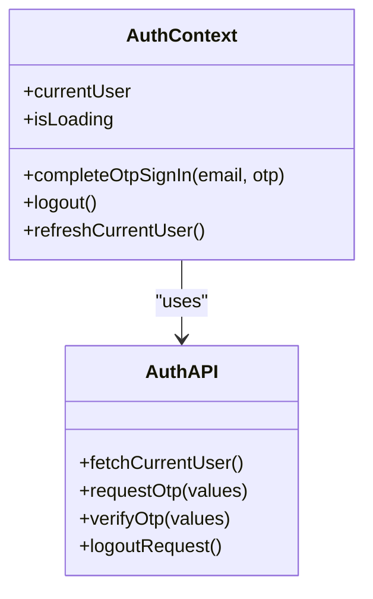

**Diagram sources**
- [AuthContext.tsx:1-90](file://src/react-app/context/AuthContext.tsx#L1-L90)
- [auth.ts:1-55](file://src/react-app/lib/auth.ts#L1-L55)

**Section sources**
- [AuthContext.tsx:1-90](file://src/react-app/context/AuthContext.tsx#L1-L90)
- [auth.ts:1-55](file://src/react-app/lib/auth.ts#L1-L55)

### Pages: Login and Register Flows
- LoginPage and RegisterPage follow a two-step flow: email submission then OTP entry.
- They use form validation, mutations for OTP request, and context methods for verification.
- Navigation redirects to feed upon successful sign-in.

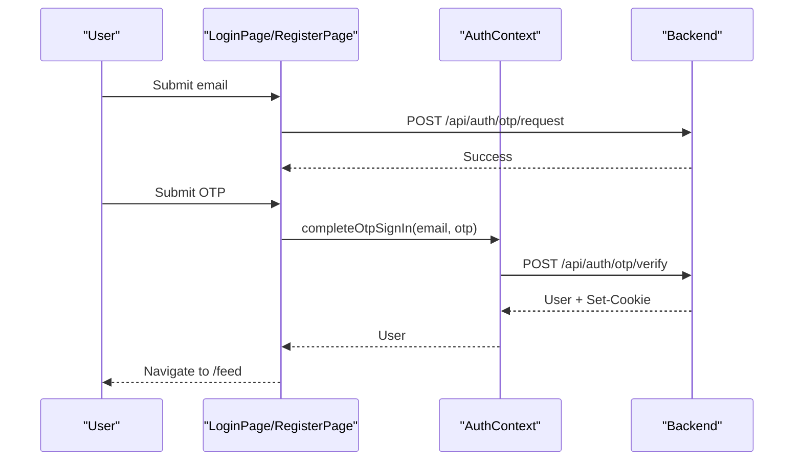

**Diagram sources**
- [LoginPage.tsx:1-158](file://src/react-app/pages/LoginPage.tsx#L1-L158)
- [RegisterPage.tsx:1-158](file://src/react-app/pages/RegisterPage.tsx#L1-L158)
- [AuthContext.tsx:1-90](file://src/react-app/context/AuthContext.tsx#L1-L90)
- [auth.ts:135-212](file://src/worker/routes/auth.ts#L135-L212)

**Section sources**
- [LoginPage.tsx:1-158](file://src/react-app/pages/LoginPage.tsx#L1-L158)
- [RegisterPage.tsx:1-158](file://src/react-app/pages/RegisterPage.tsx#L1-L158)

### Protected Routes and Permission Checking
- ProtectedRoute ensures the user is authenticated before rendering content.
- CreatorRoute ensures the user has creator role; otherwise redirects to become-creator.

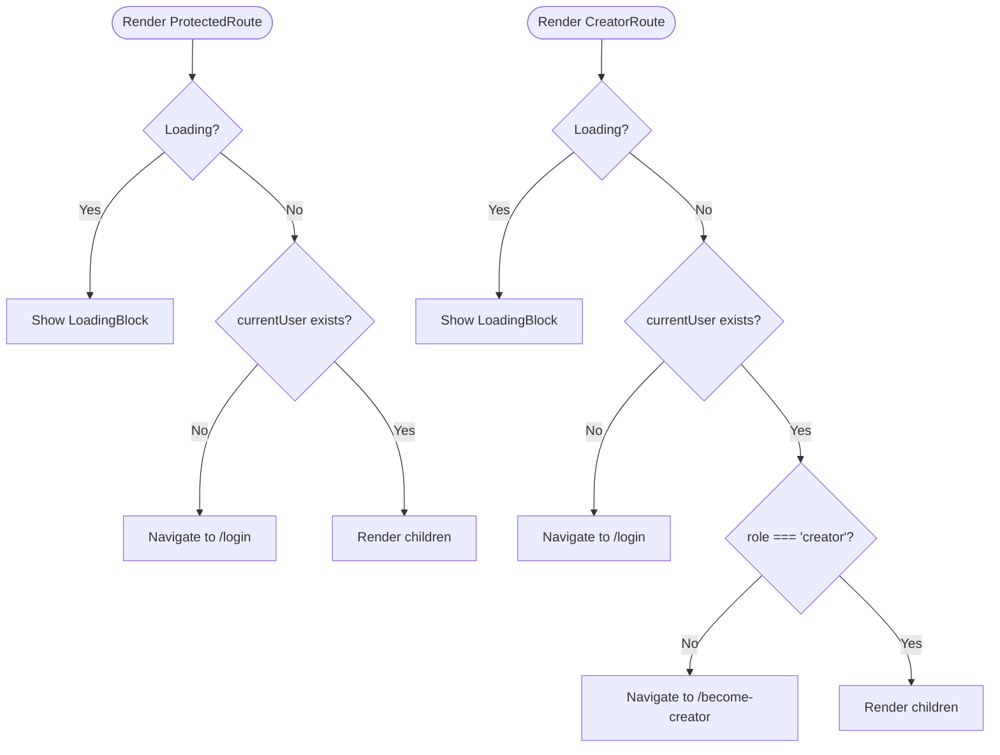

**Diagram sources**
- [ProtectedRoute.tsx:1-19](file://src/react-app/components/ProtectedRoute.tsx#L1-L19)
- [CreatorRoute.tsx:1-23](file://src/react-app/components/CreatorRoute.tsx#L1-L23)

**Section sources**
- [ProtectedRoute.tsx:1-19](file://src/react-app/components/ProtectedRoute.tsx#L1-L19)
- [CreatorRoute.tsx:1-23](file://src/react-app/components/CreatorRoute.tsx#L1-L23)

## Dependency Analysis
- Routes depend on Better-Auth, OTP utilities, email service, and middleware.
- Middleware depends on Better-Auth and database schema for user lookup.
- Frontend depends on API helpers and context for state management.
- Database schema defines relationships between users, sessions, and verifications.

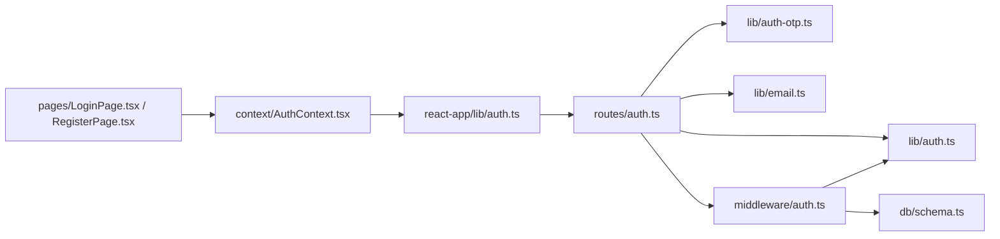

**Diagram sources**
- [auth.ts:1-259](file://src/worker/routes/auth.ts#L1-L259)
- [auth.ts:1-80](file://src/worker/lib/auth.ts#L1-L80)
- [auth-otp.ts:1-124](file://src/worker/lib/auth-otp.ts#L1-L124)
- [email.ts:1-56](file://src/worker/lib/email.ts#L1-L56)
- [auth.ts:1-57](file://src/worker/middleware/auth.ts#L1-L57)
- [schema.ts:107-165](file://src/worker/db/schema.ts#L107-L165)
- [auth.ts:1-55](file://src/react-app/lib/auth.ts#L1-L55)
- [AuthContext.tsx:1-90](file://src/react-app/context/AuthContext.tsx#L1-L90)
- [LoginPage.tsx:1-158](file://src/react-app/pages/LoginPage.tsx#L1-L158)
- [RegisterPage.tsx:1-158](file://src/react-app/pages/RegisterPage.tsx#L1-L158)

**Section sources**
- [auth.ts:1-259](file://src/worker/routes/auth.ts#L1-L259)
- [auth.ts:1-80](file://src/worker/lib/auth.ts#L1-L80)
- [auth-otp.ts:1-124](file://src/worker/lib/auth-otp.ts#L1-L124)
- [email.ts:1-56](file://src/worker/lib/email.ts#L1-L56)
- [auth.ts:1-57](file://src/worker/middleware/auth.ts#L1-L57)
- [schema.ts:107-165](file://src/worker/db/schema.ts#L107-L165)
- [auth.ts:1-55](file://src/react-app/lib/auth.ts#L1-L55)
- [AuthContext.tsx:1-90](file://src/react-app/context/AuthContext.tsx#L1-L90)
- [LoginPage.tsx:1-158](file://src/react-app/pages/LoginPage.tsx#L1-L158)
- [RegisterPage.tsx:1-158](file://src/react-app/pages/RegisterPage.tsx#L1-L158)

## Performance Considerations
- OTP hashing and constant-time comparison minimize timing attack risks without significant overhead.
- Short-lived OTPs reduce exposure window; ensure timely email delivery.
- Session cookies managed by Better-Auth avoid repeated heavy lookups; cache user data client-side where appropriate.
- Avoid unnecessary re-fetches by leveraging React Query caching and stale times.

[No sources needed since this section provides general guidance]

## Troubleshooting Guide
Common issues and resolutions:
- OTP email unavailable: Ensure email binding is configured; fallback messages guide users to verified recipients.
- Invalid or expired OTP: Check attempt limits and expiry; clear stored OTP on errors.
- Suspended accounts: Requests return 403 with explicit code; review account status before proceeding.
- Unauthorized access: Ensure session cookie is present and valid; refresh user state on unauthorized events.
- Role mismatches: Verify user.role and adminRole; redirect appropriately for creator-only routes.

**Section sources**
- [auth.ts:135-212](file://src/worker/routes/auth.ts#L135-L212)
- [auth.ts:23-50](file://src/worker/middleware/auth.ts#L23-L50)
- [AuthContext.tsx:41-49](file://src/react-app/context/AuthContext.tsx#L41-L49)

## Conclusion
The authentication and authorization system combines Better-Auth with custom OTP workflows and robust middleware to deliver secure, role-aware access control. The design emphasizes secure OTP handling, clear error signaling, and efficient session management. Frontend components integrate seamlessly with backend APIs to provide smooth user experiences for login, registration, and protected resource access.

[No sources needed since this section summarizes without analyzing specific files]