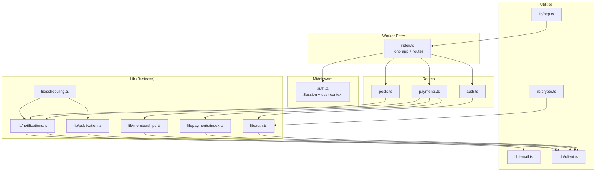
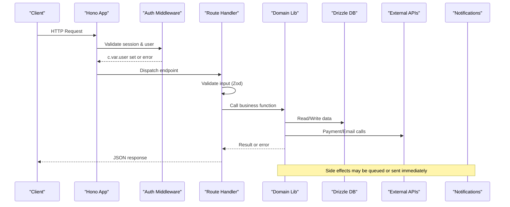
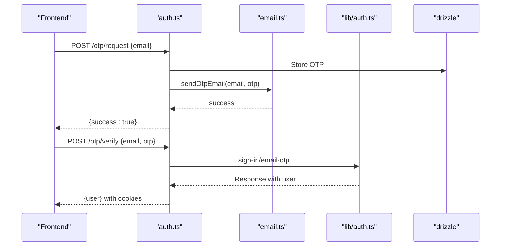
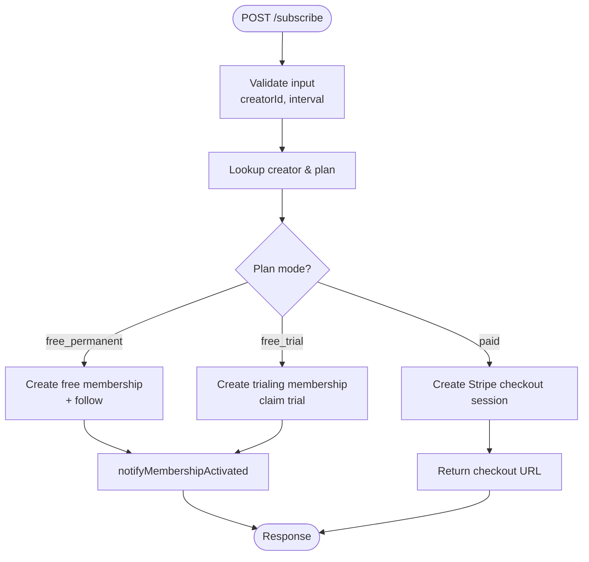
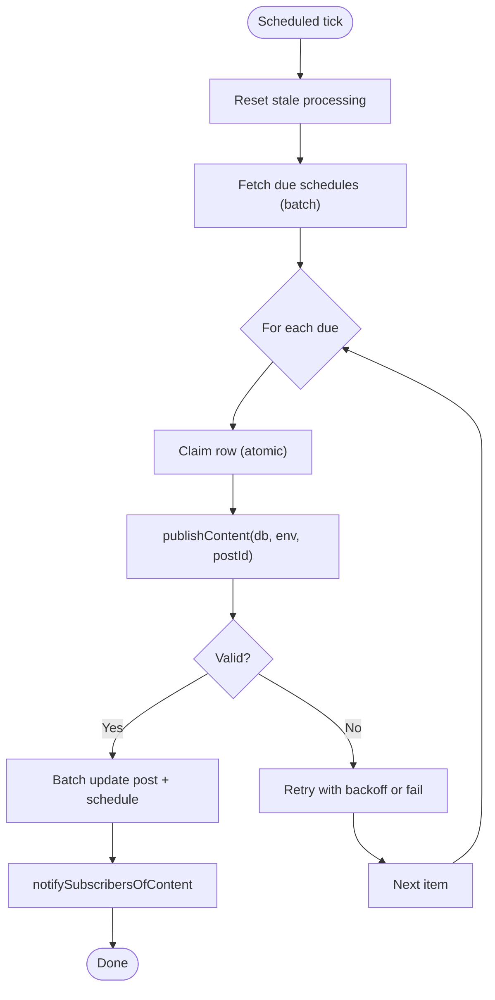
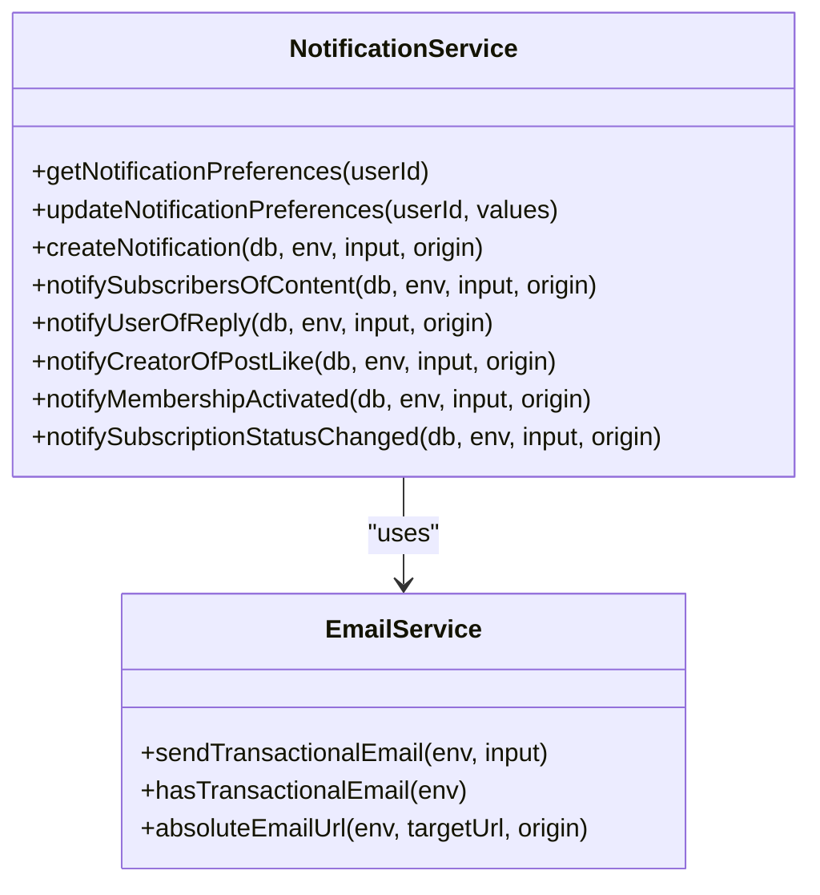
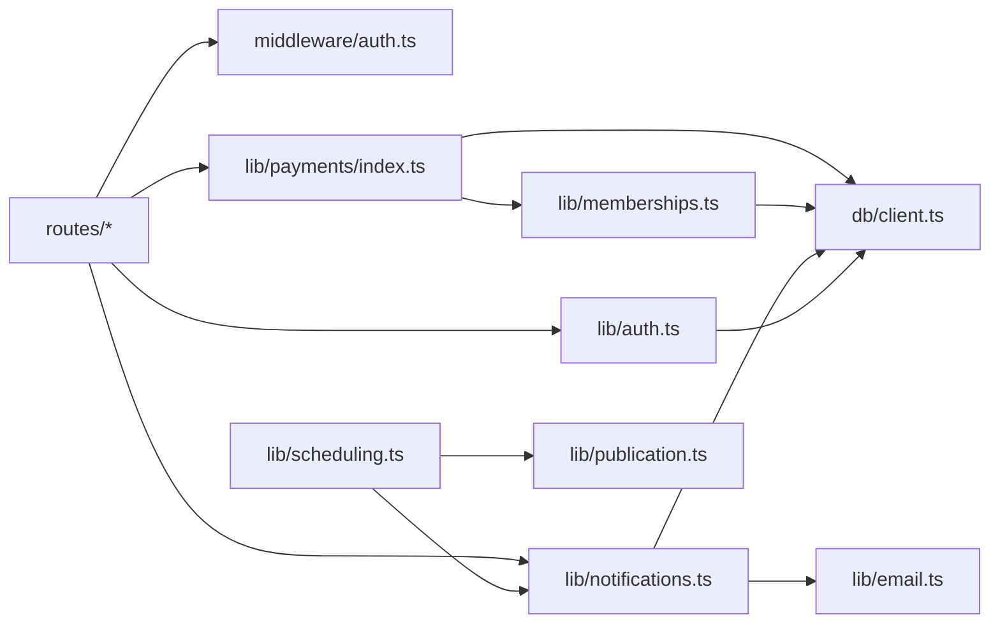

# Business Logic Layer

<cite>
**Referenced Files in This Document**
- [src/worker/index.ts](file://src/worker/index.ts)
- [src/worker/middleware/auth.ts](file://src/worker/middleware/auth.ts)
- [src/worker/routes/auth.ts](file://src/worker/routes/auth.ts)
- [src/worker/lib/auth.ts](file://src/worker/lib/auth.ts)
- [src/worker/lib/http.ts](file://src/worker/lib/http.ts)
- [src/worker/lib/crypto.ts](file://src/worker/lib/crypto.ts)
- [src/worker/lib/email.ts](file://src/worker/lib/email.ts)
- [src/worker/routes/payments.ts](file://src/worker/routes/payments.ts)
- [src/worker/lib/payments/index.ts](file://src/worker/lib/payments/index.ts)
- [src/worker/lib/memberships.ts](file://src/worker/lib/memberships.ts)
- [src/worker/lib/scheduling.ts](file://src/worker/lib/scheduling.ts)
- [src/worker/lib/publication.ts](file://src/worker/lib/publication.ts)
- [src/worker/lib/notifications.ts](file://src/worker/lib/notifications.ts)
- [src/worker/db/client.ts](file://src/worker/db/client.ts)
</cite>

## Table of Contents
1. [Introduction](#introduction)
2. [Project Structure](#project-structure)
3. [Core Components](#core-components)
4. [Architecture Overview](#architecture-overview)
5. [Detailed Component Analysis](#detailed-component-analysis)
6. [Dependency Analysis](#dependency-analysis)
7. [Performance Considerations](#performance-considerations)
8. [Troubleshooting Guide](#troubleshooting-guide)
9. [Conclusion](#conclusion)

## Introduction
This document explains the business logic layer organization and implementation patterns for the serverless worker application. It focuses on how route handlers delegate to modular business modules, how data flows through validation, persistence, external integrations, and notifications, and how async scheduled tasks operate. The goal is to make the separation of concerns, testability patterns, dependency injection approaches, error handling strategies, and performance considerations clear for both technical and non-technical readers.

## Project Structure
The worker exposes a Hono application that mounts feature routes under /api/* paths. Each route module encapsulates HTTP endpoints and delegates to lib modules for domain logic. Shared utilities include HTTP error helpers, crypto primitives, email delivery, and DB client initialization. Scheduled tasks run via Cloudflare Workers cron-like scheduling.

**Diagram sources**
- [src/worker/index.ts:24-45](file://src/worker/index.ts#L24-L45)
- [src/worker/middleware/auth.ts:23-50](file://src/worker/middleware/auth.ts#L23-L50)
- [src/worker/routes/auth.ts:14-212](file://src/worker/routes/auth.ts#L14-L212)
- [src/worker/routes/payments.ts:44-800](file://src/worker/routes/payments.ts#L44-L800)
- [src/worker/routes/posts.ts:60-200](file://src/worker/routes/posts.ts#L60-L200)
- [src/worker/lib/auth.ts:9-77](file://src/worker/lib/auth.ts#L9-L77)
- [src/worker/lib/payments/index.ts:5-9](file://src/worker/lib/payments/index.ts#L5-L9)
- [src/worker/lib/memberships.ts:10-54](file://src/worker/lib/memberships.ts#L10-L54)
- [src/worker/lib/scheduling.ts:42-126](file://src/worker/lib/scheduling.ts#L42-L126)
- [src/worker/lib/publication.ts:197-272](file://src/worker/lib/publication.ts#L197-L272)
- [src/worker/lib/notifications.ts:153-234](file://src/worker/lib/notifications.ts#L153-L234)
- [src/worker/lib/http.ts:23-75](file://src/worker/lib/http.ts#L23-L75)
- [src/worker/lib/crypto.ts:25-51](file://src/worker/lib/crypto.ts#L25-L51)
- [src/worker/lib/email.ts:27-43](file://src/worker/lib/email.ts#L27-L43)
- [src/worker/db/client.ts:4-6](file://src/worker/db/client.ts#L4-L6)

**Section sources**
- [src/worker/index.ts:24-45](file://src/worker/index.ts#L24-L45)

## Core Components
- HTTP error utilities: standardized JSON error responses and Zod hook integration.
- Authentication: Better Auth configuration with Drizzle adapter, OTP plugin, and custom session/user enrichment.
- Payments: Stripe provider abstraction, creator onboarding, plan management, checkout sessions, and subscription lifecycle.
- Memberships: entitlement checks, trial expiration, and plan transition processing.
- Scheduling: due schedule processing, retry/backoff, and publication orchestration.
- Publication: content validation per kind, atomic updates, and subscriber notifications.
- Notifications: preference-aware creation, deduplication, and optional email delivery.
- Email: transactional email sending via Cloudflare Email API with MIME message building.
- Crypto: PBKDF2 password hashing utilities using Web Crypto API.
- Database: Drizzle ORM client factory over D1.

Key responsibilities are cleanly separated:
- Routes handle request parsing, authorization, and orchestration.
- Lib modules implement domain logic and side effects.
- Utilities provide cross-cutting capabilities.

**Section sources**
- [src/worker/lib/http.ts:23-75](file://src/worker/lib/http.ts#L23-L75)
- [src/worker/lib/auth.ts:9-77](file://src/worker/lib/auth.ts#L9-L77)
- [src/worker/lib/payments/index.ts:5-9](file://src/worker/lib/payments/index.ts#L5-L9)
- [src/worker/lib/memberships.ts:10-54](file://src/worker/lib/memberships.ts#L10-L54)
- [src/worker/lib/scheduling.ts:42-126](file://src/worker/lib/scheduling.ts#L42-L126)
- [src/worker/lib/publication.ts:197-272](file://src/worker/lib/publication.ts#L197-L272)
- [src/worker/lib/notifications.ts:153-234](file://src/worker/lib/notifications.ts#L153-L234)
- [src/worker/lib/email.ts:27-43](file://src/worker/lib/email.ts#L27-L43)
- [src/worker/lib/crypto.ts:25-51](file://src/worker/lib/crypto.ts#L25-L51)
- [src/worker/db/client.ts:4-6](file://src/worker/db/client.ts#L4-L6)

## Architecture Overview
The worker uses a layered architecture:
- Entry point registers routes and global error/not-found handlers.
- Middleware enriches context with authenticated user and role checks.
- Route handlers validate inputs, enforce permissions, and call into lib modules.
- Lib modules perform DB operations, integrate with external services, and emit side effects (notifications, emails).
- Scheduled entry points process due jobs asynchronously.

**Diagram sources**
- [src/worker/index.ts:24-50](file://src/worker/index.ts#L24-L50)
- [src/worker/middleware/auth.ts:23-50](file://src/worker/middleware/auth.ts#L23-L50)
- [src/worker/routes/auth.ts:135-212](file://src/worker/routes/auth.ts#L135-L212)
- [src/worker/lib/auth.ts:9-77](file://src/worker/lib/auth.ts#L9-L77)
- [src/worker/db/client.ts:4-6](file://src/worker/db/client.ts#L4-L6)

## Detailed Component Analysis

### Authentication Flow
- OTP-based sign-in replaces password login.
- Routes generate and verify OTPs, then delegate to Better Auth for session establishment.
- User profile retrieval joins admin memberships for role resolution.

**Diagram sources**
- [src/worker/routes/auth.ts:135-212](file://src/worker/routes/auth.ts#L135-L212)
- [src/worker/lib/email.ts:45-55](file://src/worker/lib/email.ts#L45-L55)
- [src/worker/lib/auth.ts:9-77](file://src/worker/lib/auth.ts#L9-L77)

**Section sources**
- [src/worker/routes/auth.ts:127-212](file://src/worker/routes/auth.ts#L127-L212)
- [src/worker/lib/auth.ts:9-77](file://src/worker/lib/auth.ts#L9-L77)
- [src/worker/lib/email.ts:45-55](file://src/worker/lib/email.ts#L45-L55)

### Payments and Subscriptions
- Creator payment account onboarding and dashboard link generation.
- Plan configuration with product and price synchronization to Stripe.
- Subscription options and checkout flow; free trials and paid modes.
- Membership entitlement checks and transitions at period end.

**Diagram sources**
- [src/worker/routes/payments.ts:601-800](file://src/worker/routes/payments.ts#L601-L800)
- [src/worker/lib/memberships.ts:14-31](file://src/worker/lib/memberships.ts#L14-L31)
- [src/worker/lib/notifications.ts:390-431](file://src/worker/lib/notifications.ts#L390-L431)

**Section sources**
- [src/worker/routes/payments.ts:260-333](file://src/worker/routes/payments.ts#L260-L333)
- [src/worker/routes/payments.ts:337-536](file://src/worker/routes/payments.ts#L337-L536)
- [src/worker/routes/payments.ts:601-800](file://src/worker/routes/payments.ts#L601-L800)
- [src/worker/lib/payments/index.ts:5-9](file://src/worker/lib/payments/index.ts#L5-L9)
- [src/worker/lib/memberships.ts:14-54](file://src/worker/lib/memberships.ts#L14-L54)
- [src/worker/lib/notifications.ts:390-431](file://src/worker/lib/notifications.ts#L390-L431)

### Content Scheduling and Publication
- Scheduled job picks due items, claims them atomically, and publishes content if valid.
- Validation enforces per-kind requirements (post text/images/poll, article cover, audio parent status, photography cover/photos, course modules/lessons).
- On success, marks published and notifies subscribers; on failure, retries with backoff or fails deterministically.

**Diagram sources**
- [src/worker/lib/scheduling.ts:42-126](file://src/worker/lib/scheduling.ts#L42-L126)
- [src/worker/lib/publication.ts:197-272](file://src/worker/lib/publication.ts#L197-L272)
- [src/worker/lib/notifications.ts:257-299](file://src/worker/lib/notifications.ts#L257-L299)

**Section sources**
- [src/worker/lib/scheduling.ts:42-126](file://src/worker/lib/scheduling.ts#L42-L126)
- [src/worker/lib/publication.ts:113-195](file://src/worker/lib/publication.ts#L113-L195)
- [src/worker/lib/publication.ts:197-272](file://src/worker/lib/publication.ts#L197-L272)

### Notifications System
- Preference-aware notification creation with deduplication by key.
- Optional email delivery based on preferences and environment configuration.
- Specialized helpers for content, replies, likes, and membership events.

**Diagram sources**
- [src/worker/lib/notifications.ts:118-234](file://src/worker/lib/notifications.ts#L118-L234)
- [src/worker/lib/email.ts:27-43](file://src/worker/lib/email.ts#L27-L43)

**Section sources**
- [src/worker/lib/notifications.ts:118-234](file://src/worker/lib/notifications.ts#L118-L234)
- [src/worker/lib/notifications.ts:257-461](file://src/worker/lib/notifications.ts#L257-L461)

### Utility Functions
- HTTP error helpers: consistent JSON error shapes and Zod hook for validation failures.
- Crypto: PBKDF2 password hashing and verification using Web Crypto API.
- Email: MIME message construction and sending via Cloudflare Email binding.
- DB client: Drizzle factory over D1 database binding.

**Section sources**
- [src/worker/lib/http.ts:23-75](file://src/worker/lib/http.ts#L23-L75)
- [src/worker/lib/crypto.ts:25-51](file://src/worker/lib/crypto.ts#L25-L51)
- [src/worker/lib/email.ts:27-43](file://src/worker/lib/email.ts#L27-L43)
- [src/worker/db/client.ts:4-6](file://src/worker/db/client.ts#L4-L6)

## Dependency Analysis
- Routes depend on middleware for auth and on lib modules for business logic.
- Lib modules depend on DB client and external providers (Stripe, Email).
- Scheduling depends on publication and notifications.
- Payments depend on provider abstraction and membership utilities.

**Diagram sources**
- [src/worker/index.ts:24-45](file://src/worker/index.ts#L24-L45)
- [src/worker/middleware/auth.ts:23-50](file://src/worker/middleware/auth.ts#L23-L50)
- [src/worker/routes/payments.ts:44-800](file://src/worker/routes/payments.ts#L44-L800)
- [src/worker/lib/payments/index.ts:5-9](file://src/worker/lib/payments/index.ts#L5-L9)
- [src/worker/lib/memberships.ts:10-54](file://src/worker/lib/memberships.ts#L10-L54)
- [src/worker/lib/scheduling.ts:42-126](file://src/worker/lib/scheduling.ts#L42-L126)
- [src/worker/lib/publication.ts:197-272](file://src/worker/lib/publication.ts#L197-L272)
- [src/worker/lib/notifications.ts:153-234](file://src/worker/lib/notifications.ts#L153-L234)
- [src/worker/lib/email.ts:27-43](file://src/worker/lib/email.ts#L27-L43)
- [src/worker/db/client.ts:4-6](file://src/worker/db/client.ts#L4-L6)

**Section sources**
- [src/worker/index.ts:24-45](file://src/worker/index.ts#L24-L45)

## Performance Considerations
- Batch DB operations: use batch writes for multi-step updates to reduce round-trips and ensure atomicity.
- Idempotency keys: for external provider calls (e.g., Stripe checkout), use stable keys to prevent duplicate charges.
- Backoff and retries: implement exponential or fixed delays with attempt limits for transient errors.
- Stale task recovery: reset stuck processing states to avoid deadlocks in scheduled jobs.
- Minimal payloads: return only necessary fields and avoid heavy transformations in hot paths.
- Async side effects: prefer fire-and-forget for non-critical notifications while ensuring durability via DB records.

[No sources needed since this section provides general guidance]

## Troubleshooting Guide
Common issues and resolutions:
- Validation failures: check Zod schemas and ensure request bodies match expected types. Use the provided zodHook to convert validation errors to consistent JSON responses.
- Unauthorized/forbidden: verify session presence and user roles; confirm account status is active.
- Payment provider unconfigured: ensure Stripe sandbox configuration and secrets are set; catch configuration errors and return appropriate status codes.
- Email delivery failures: inspect NOTIFICATION_EMAIL binding and sender settings; log and surface service unavailable errors.
- Scheduled publication failures: review lastErrorCode and lastErrorMessage; deterministic failures require content fixes; retryable errors will backoff automatically.

**Section sources**
- [src/worker/lib/http.ts:23-75](file://src/worker/lib/http.ts#L23-L75)
- [src/worker/middleware/auth.ts:23-50](file://src/worker/middleware/auth.ts#L23-L50)
- [src/worker/routes/payments.ts:48-58](file://src/worker/routes/payments.ts#L48-L58)
- [src/worker/lib/email.ts:27-43](file://src/worker/lib/email.ts#L27-L43)
- [src/worker/lib/scheduling.ts:93-126](file://src/worker/lib/scheduling.ts#L93-L126)

## Conclusion
The business logic layer is organized around clear separation between routes, middleware, and domain modules. Validation, authorization, and error handling are standardized. External integrations are abstracted behind provider interfaces, enabling testability and flexibility. Scheduled tasks and async side effects are designed for resilience with retries, idempotency, and durable state tracking. This structure supports scalable, maintainable serverless operations with strong guarantees for correctness and performance.