# Content Management Logic

<cite>
**Referenced Files in This Document**
- [publication.ts](file://src/worker/lib/publication.ts)
- [scheduling.ts](file://src/worker/lib/scheduling.ts)
- [posts.ts](file://src/worker/routes/posts.ts)
- [articles.ts](file://src/worker/routes/articles.ts)
- [audio.ts](file://src/worker/routes/audio.ts)
- [photography.ts](file://src/worker/routes/photography.ts)
- [courses.ts](file://src/worker/routes/courses.ts)
- [schema.ts](file://src/worker/db/schema.ts)
- [0014_content_scheduling.sql](file://drizzle/0014_content_scheduling.sql)
</cite>

## Table of Contents
1. [Introduction](#introduction)
2. [Project Structure](#project-structure)
3. [Core Components](#core-components)
4. [Architecture Overview](#architecture-overview)
5. [Detailed Component Analysis](#detailed-component-analysis)
6. [Dependency Analysis](#dependency-analysis)
7. [Performance Considerations](#performance-considerations)
8. [Troubleshooting Guide](#troubleshooting-guide)
9. [Conclusion](#conclusion)

## Introduction
This document explains the content management business logic for posts, articles, audio, photography, and courses. It covers the publication workflow, content transformation pipelines, scheduling mechanisms, validation rules, versioning/draft management, publishing states, and lifecycle operations including creation, batch updates, and deletion. The system uses a unified post entity with specialized tables per content kind, a robust scheduling engine, and consistent validation and notification flows.

## Project Structure
The backend is organized by feature routes (posts, articles, audio, photography, courses), shared libraries (publication, scheduling), and database schema definitions. Each content type has its own route handlers that create/update entities, manage media uploads, and trigger publication via a shared pipeline. Scheduling is implemented as a background process that claims due items, validates them, publishes, and handles retries/failures.

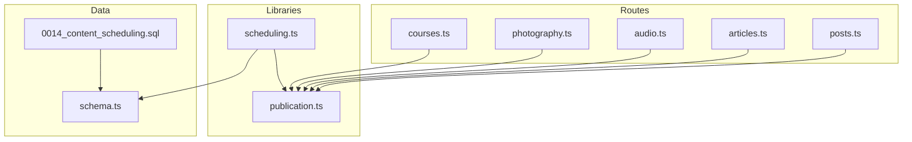

**Diagram sources**
- [posts.ts](file://src/worker/routes/posts.ts)
- [articles.ts](file://src/worker/routes/articles.ts)
- [audio.ts](file://src/worker/routes/audio.ts)
- [photography.ts](file://src/worker/routes/photography.ts)
- [courses.ts](file://src/worker/routes/courses.ts)
- [publication.ts](file://src/worker/lib/publication.ts)
- [scheduling.ts](file://src/worker/lib/scheduling.ts)
- [schema.ts](file://src/worker/db/schema.ts)
- [0014_content_scheduling.sql](file://drizzle/0014_content_scheduling.sql)

**Section sources**
- [schema.ts](file://src/worker/db/schema.ts)
- [0014_content_scheduling.sql](file://drizzle/0014_content_scheduling.sql)

## Core Components
- Publication pipeline: Centralized logic to validate and publish any content kind, update timestamps, set status, and notify subscribers.
- Scheduling engine: Claims pending schedules, processes due items with retry/backoff, and records failures with notifications.
- Route handlers: Create/update/delete content, handle media uploads, enforce validation, and call the publication pipeline when appropriate.
- Data model: Unified posts table plus kind-specific tables (articles, audio collections/items, photography albums/photos, courses/modules/lessons).

Key responsibilities:
- Validation: Per-kind constraints enforced both at route level and during publication.
- Versioning/Drafts: Draft vs published state tracked per kind; publishedAt preserved on re-publish unless explicitly changed.
- Scheduling: Optional future publish time recorded; background job picks up due items and publishes atomically.
- Notifications: On immediate publish or scheduled publish, subscribers are notified with target URLs and titles.

**Section sources**
- [publication.ts](file://src/worker/lib/publication.ts)
- [scheduling.ts](file://src/worker/lib/scheduling.ts)
- [posts.ts](file://src/worker/routes/posts.ts)
- [articles.ts](file://src/worker/routes/articles.ts)
- [audio.ts](file://src/worker/routes/audio.ts)
- [photography.ts](file://src/worker/routes/photography.ts)
- [courses.ts](file://src/worker/routes/courses.ts)
- [schema.ts](file://src/worker/db/schema.ts)

## Architecture Overview
The architecture separates HTTP handling from core business logic. Routes parse and validate inputs, persist data, and optionally invoke the publication pipeline. The scheduling worker periodically scans due schedules, claims them, and calls the same publication pipeline used by direct publish endpoints.

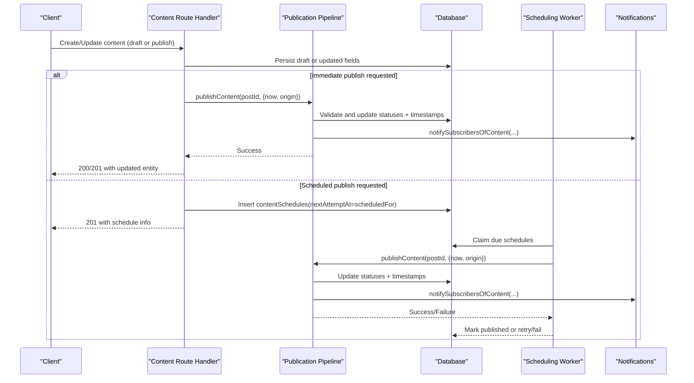

**Diagram sources**
- [posts.ts](file://src/worker/routes/posts.ts)
- [articles.ts](file://src/worker/routes/articles.ts)
- [audio.ts](file://src/worker/routes/audio.ts)
- [photography.ts](file://src/worker/routes/photography.ts)
- [courses.ts](file://src/worker/routes/courses.ts)
- [publication.ts](file://src/worker/lib/publication.ts)
- [scheduling.ts](file://src/worker/lib/scheduling.ts)

## Detailed Component Analysis

### Publication Pipeline
The publication pipeline unifies validation and publishing across all content kinds. It:
- Loads a composite record joining posts with the relevant kind-specific tables and user info.
- Computes title, target URL, and entity ID based on kind.
- Validates account/moderation status and kind-specific requirements.
- Atomically updates posts and kind-specific tables to published with timestamps.
- Notifies subscribers and logs events.

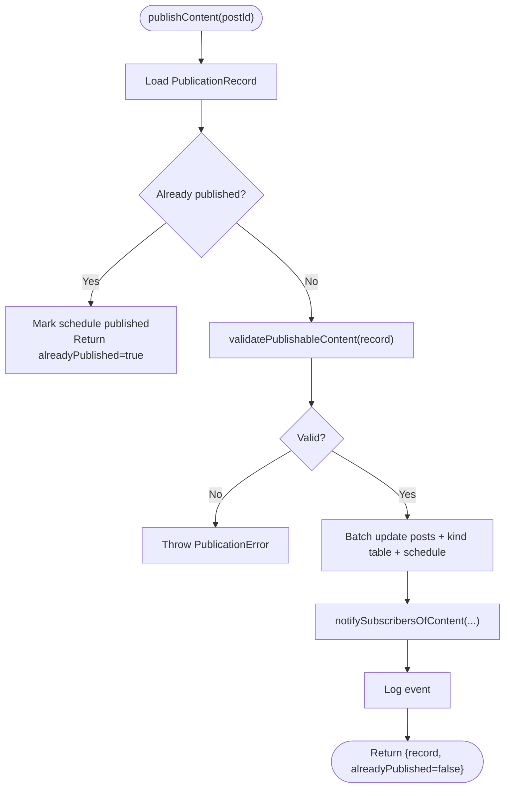

**Diagram sources**
- [publication.ts](file://src/worker/lib/publication.ts)

**Section sources**
- [publication.ts](file://src/worker/lib/publication.ts)

### Scheduling Engine
The scheduler:
- Resets stale processing entries back to pending.
- Selects due pending schedules up to a batch size.
- Claims each item with optimistic locking and increments attempt count.
- Calls publishContent; on deterministic errors or max attempts, marks failed and notifies creator.
- On transient errors, schedules retry with exponential-like delays.

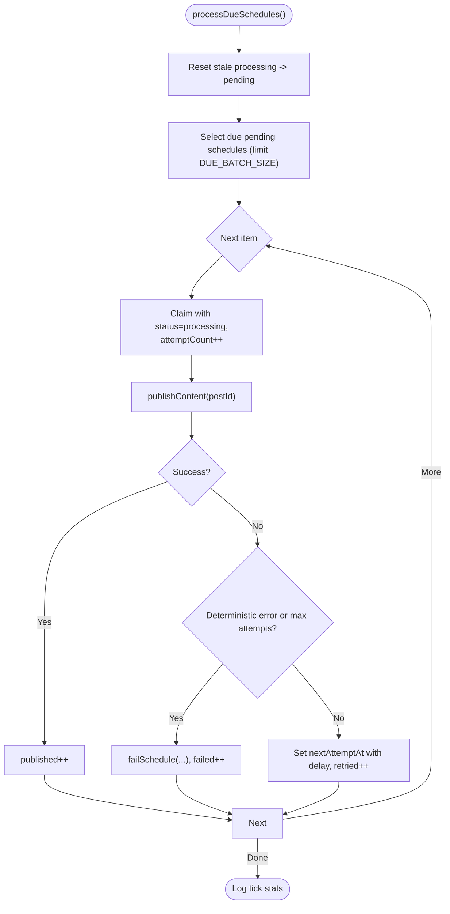

**Diagram sources**
- [scheduling.ts](file://src/worker/lib/scheduling.ts)
- [publication.ts](file://src/worker/lib/publication.ts)

**Section sources**
- [scheduling.ts](file://src/worker/lib/scheduling.ts)

### Posts Workflow
Posts support text, images, and polls. Creation can be immediate or scheduled. Draft editing supports adding/removing attachments and replacing polls. Publishing requires either body text, images, or a poll with at least two options.

Key behaviors:
- Slug generation ensures uniqueness per author.
- Image upload validates type and size; stored in object storage with metadata.
- Poll parsing enforces option counts and lengths.
- If scheduled, a contentSchedules row is created; otherwise, immediate publish triggers subscriber notifications.

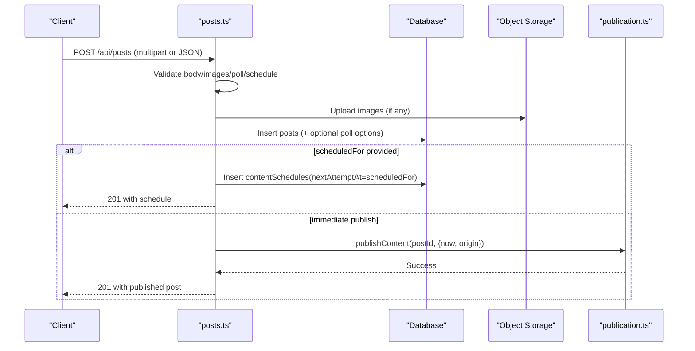

**Diagram sources**
- [posts.ts](file://src/worker/routes/posts.ts)
- [publication.ts](file://src/worker/lib/publication.ts)

**Section sources**
- [posts.ts](file://src/worker/routes/posts.ts)

### Articles Workflow
Articles have title, excerpt, markdown, and cover image. They can be saved as drafts or published immediately. When publishing, validation ensures required fields and cover presence.

Key behaviors:
- Excerpt auto-generated from markdown if not provided.
- Cover upload validated and persisted; cover URL derived from postId.
- Publish endpoint triggers the publication pipeline; moderation/account checks enforced.

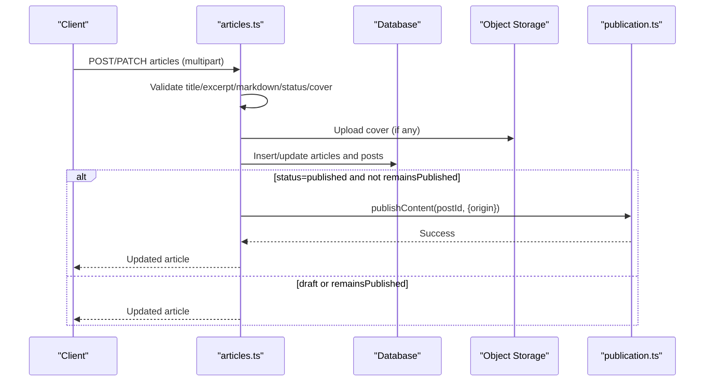

**Diagram sources**
- [articles.ts](file://src/worker/routes/articles.ts)
- [publication.ts](file://src/worker/lib/publication.ts)

**Section sources**
- [articles.ts](file://src/worker/routes/articles.ts)

### Audio Workflow
Audio supports collections (albums/podcasts) and items (music/podcast episodes). Items belong to a collection and require an audio file and cover (item or collection-level). Publishing validates parent collection status and required assets.

Key behaviors:
- Collection/item slugs generated uniquely per creator.
- Audio and cover files uploaded with validated types/sizes.
- Item creation creates a corresponding post; publishing sets item status and timestamp.
- Ordering endpoints allow reordering items within a collection.

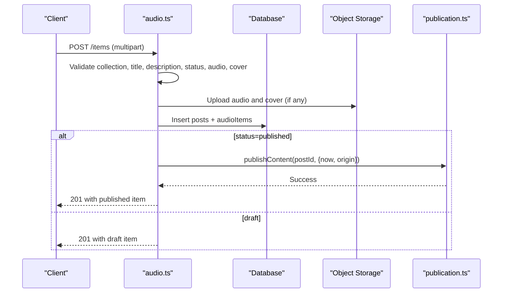

**Diagram sources**
- [audio.ts](file://src/worker/routes/audio.ts)
- [publication.ts](file://src/worker/lib/publication.ts)

**Section sources**
- [audio.ts](file://src/worker/routes/audio.ts)

### Photography Workflow
Photography manages albums and photos. Albums require at least one published photo and a published cover photo to be published. Photos support preview and original files with distinct validations.

Key behaviors:
- Album creation disallows immediate publish; must add photos first.
- Photo upload supports multiple previews and optional originals with metadata.
- Deleting a photo may revert album to draft if it was the cover.
- Reordering photos maintains display order.

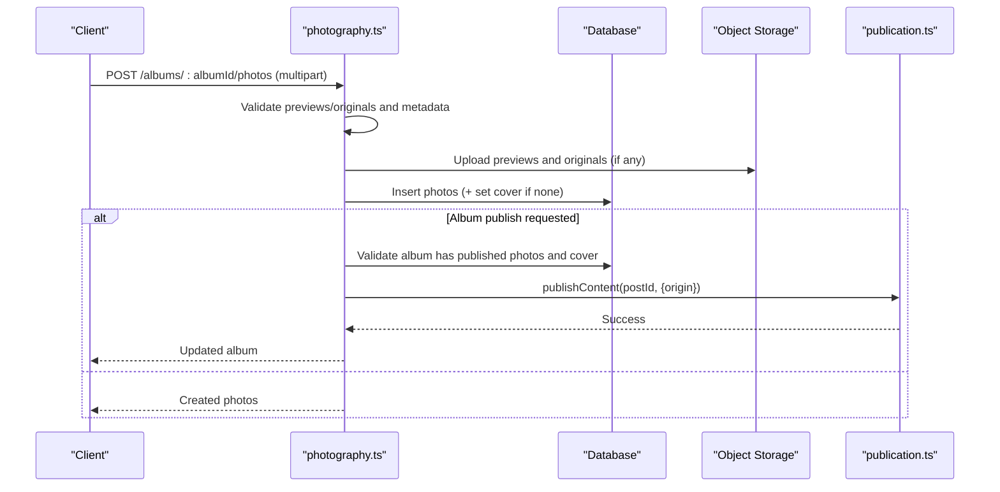

**Diagram sources**
- [photography.ts](file://src/worker/routes/photography.ts)
- [publication.ts](file://src/worker/lib/publication.ts)

**Section sources**
- [photography.ts](file://src/worker/routes/photography.ts)

### Courses Workflow
Courses consist of modules and lessons with rich attachments (video/audio/files). Lessons can be drafted and later published after content is added. Course publishing requires at least one module and one published lesson.

Key behaviors:
- Multipart upload for large attachments with start/part/complete flow.
- Lesson publish validation ensures title and content/attachment presence.
- Progress tracking per user for completed lessons.
- Unpublish clears publishedAt and sets status to draft.

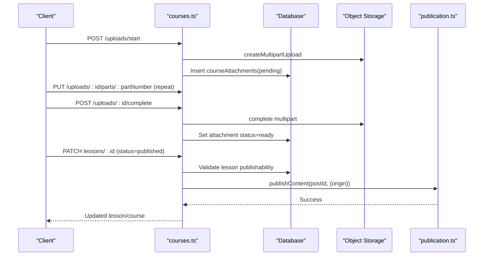

**Diagram sources**
- [courses.ts](file://src/worker/routes/courses.ts)
- [publication.ts](file://src/worker/lib/publication.ts)

**Section sources**
- [courses.ts](file://src/worker/routes/courses.ts)

### Data Model and Versioning
The data model centers around a unified posts table with kind-specific extensions. Scheduling tracks publish attempts and outcomes. Timestamps capture creation, updates, and publication times.

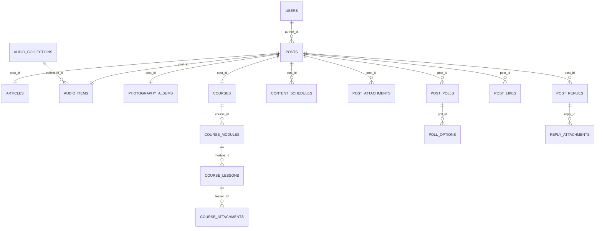

**Diagram sources**
- [schema.ts](file://src/worker/db/schema.ts)

**Section sources**
- [schema.ts](file://src/worker/db/schema.ts)
- [0014_content_scheduling.sql](file://drizzle/0014_content_scheduling.sql)

## Dependency Analysis
- Routes depend on shared utilities for slug generation, media helpers, and moderation checks.
- All publish paths converge on the publication pipeline, ensuring consistent validation and side effects.
- Scheduling depends on the publication pipeline and database indices for efficient due-item selection.
- Media storage interactions are isolated per route handler with consistent validation patterns.

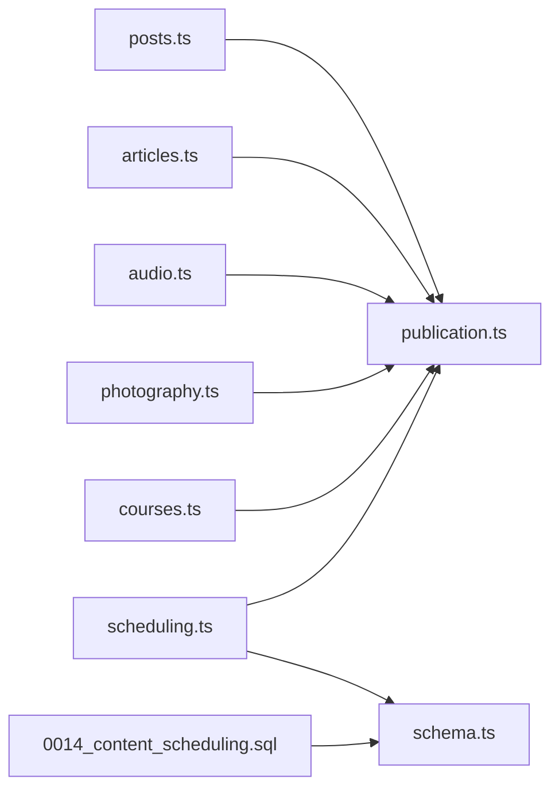

**Diagram sources**
- [posts.ts](file://src/worker/routes/posts.ts)
- [articles.ts](file://src/worker/routes/articles.ts)
- [audio.ts](file://src/worker/routes/audio.ts)
- [photography.ts](file://src/worker/routes/photography.ts)
- [courses.ts](file://src/worker/routes/courses.ts)
- [publication.ts](file://src/worker/lib/publication.ts)
- [scheduling.ts](file://src/worker/lib/scheduling.ts)
- [schema.ts](file://src/worker/db/schema.ts)
- [0014_content_scheduling.sql](file://drizzle/0014_content_scheduling.sql)

**Section sources**
- [publication.ts](file://src/worker/lib/publication.ts)
- [scheduling.ts](file://src/worker/lib/scheduling.ts)
- [schema.ts](file://src/worker/db/schema.ts)

## Performance Considerations
- Batched database writes reduce round-trips during publish operations.
- Optimistic claiming of schedules prevents duplicate processing.
- Due-schedule queries use indexed columns for fast retrieval.
- Media uploads leverage multipart streaming for large files.
- Notification calls are decoupled and logged on failure to avoid blocking publish.

[No sources needed since this section provides general guidance]

## Troubleshooting Guide
Common issues and resolutions:
- Deterministic validation failures: Ensure required fields/assets exist per kind before publishing.
- Account suspended or content moderated: Restore account/content status before attempting publish.
- Parent unpublished (audio): Publish the collection before publishing items.
- Insufficient content (course): Add at least one module and one published lesson.
- Schedule retries: Check lastErrorCode and lastErrorMessage; adjust timing or fix validation.

Operational tips:
- Inspect contentSchedules for stuck items; reset processingStartedAt if necessary.
- Verify object storage keys exist for required assets.
- Review logs for content_published and content_schedule_failed events.

**Section sources**
- [publication.ts](file://src/worker/lib/publication.ts)
- [scheduling.ts](file://src/worker/lib/scheduling.ts)

## Conclusion
The content management system provides a consistent, extensible pipeline for creating, validating, scheduling, and publishing diverse content types. By centralizing publication logic and leveraging a robust scheduling engine, the system ensures reliability, auditability, and scalability. Route handlers encapsulate domain-specific validation and media handling while delegating cross-cutting concerns to shared libraries.

[No sources needed since this section summarizes without analyzing specific files]