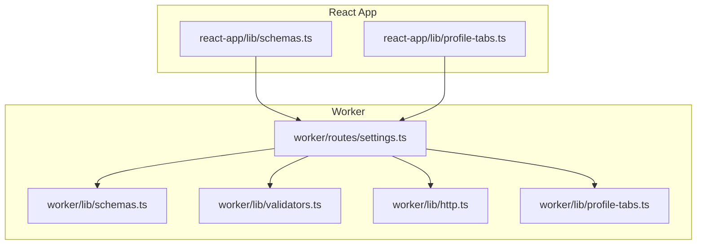
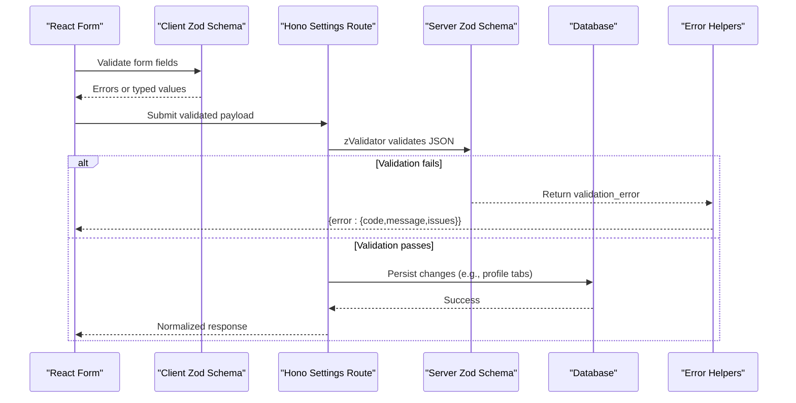
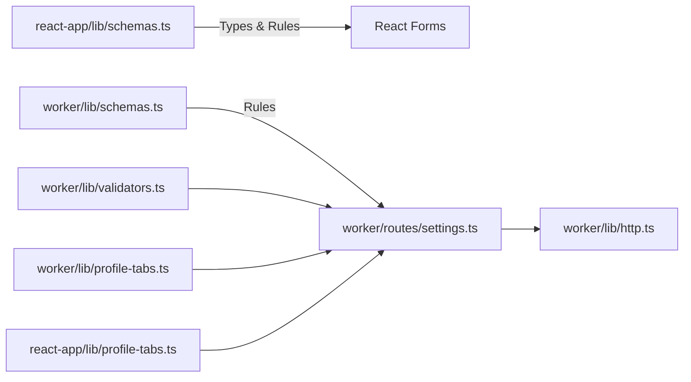

# Data Validation & Schemas

<cite>
**Referenced Files in This Document**
- [schemas.ts](file://src/react-app/lib/schemas.ts)
- [schemas.ts](file://src/worker/lib/schemas.ts)
- [validators.ts](file://src/worker/lib/validators.ts)
- [profile-tabs.ts](file://src/react-app/lib/profile-tabs.ts)
- [profile-tabs.ts](file://src/worker/lib/profile-tabs.ts)
- [settings.ts](file://src/worker/routes/settings.ts)
- [http.ts](file://src/worker/lib/http.ts)
</cite>

## Table of Contents
1. Introduction
2. Project Structure
3. Core Components
4. Architecture Overview
5. Detailed Component Analysis
6. Dependency Analysis
7. Performance Considerations
8. Troubleshooting Guide
9. Conclusion

## Introduction
This document explains the data validation and schema management strategy across the application, focusing on Zod-based schemas, validation rules, type safety patterns, profile tab configuration, custom field validation, dynamic form handling, input sanitization, output transformation, and error reporting. It provides concrete examples of complex validation scenarios, custom validators, and composition patterns used throughout the codebase.

## Project Structure
Validation and schemas are implemented in two layers:
- React app layer (client-side): user-facing forms and UI-driven validation using Zod schemas for immediate feedback and type-safe form values.
- Worker layer (server-side): API request validation using Zod with Hono’s @hono/zod-validator to enforce constraints before business logic executes.

**Diagram sources**
- [schemas.ts:1-363](file://src/react-app/lib/schemas.ts#L1-L363)
- [schemas.ts:1-221](file://src/worker/lib/schemas.ts#L1-L221)
- [validators.ts:1-94](file://src/worker/lib/validators.ts#L1-L94)
- [profile-tabs.ts:1-57](file://src/react-app/lib/profile-tabs.ts#L1-L57)
- [profile-tabs.ts:1-83](file://src/worker/lib/profile-tabs.ts#L1-L83)
- [settings.ts:1-327](file://src/worker/routes/settings.ts#L1-L327)
- [http.ts:1-80](file://src/worker/lib/http.ts#L1-L80)

**Section sources**
- [schemas.ts:1-363](file://src/react-app/lib/schemas.ts#L1-L363)
- [schemas.ts:1-221](file://src/worker/lib/schemas.ts#L1-L221)
- [validators.ts:1-94](file://src/worker/lib/validators.ts#L1-L94)
- [profile-tabs.ts:1-57](file://src/react-app/lib/profile-tabs.ts#L1-L57)
- [profile-tabs.ts:1-83](file://src/worker/lib/profile-tabs.ts#L1-L83)
- [settings.ts:1-327](file://src/worker/routes/settings.ts#L1-L327)
- [http.ts:1-80](file://src/worker/lib/http.ts#L1-L80)

## Core Components
- Client-side Zod schemas define form inputs, file validations, URL checks, and cross-field constraints. They also export TypeScript types via z.infer for type-safe components.
- Server-side Zod schemas validate incoming JSON payloads, route parameters, and settings updates. They integrate with Hono middleware to return structured validation errors.
- Shared utility validators provide reusable checks for emails, URLs, usernames, and password length.
- Profile tabs configuration includes a strict schema ensuring all nine tabs exist, no duplicates, and at least one visible tab.

Key responsibilities:
- Input sanitization: trimming, lowercasing, URL normalization.
- Output transformation: converting price strings to cents, normalizing tab ordering.
- Error reporting: consistent error shape with codes, messages, and issues array.

**Section sources**
- [schemas.ts:1-363](file://src/react-app/lib/schemas.ts#L1-L363)
- [schemas.ts:1-221](file://src/worker/lib/schemas.ts#L1-L221)
- [validators.ts:1-94](file://src/worker/lib/validators.ts#L1-L94)
- [profile-tabs.ts:1-57](file://src/react-app/lib/profile-tabs.ts#L1-L57)
- [profile-tabs.ts:1-83](file://src/worker/lib/profile-tabs.ts#L1-L83)
- [settings.ts:1-327](file://src/worker/routes/settings.ts#L1-L327)
- [http.ts:1-80](file://src/worker/lib/http.ts#L1-L80)

## Architecture Overview
The validation architecture enforces constraints at both boundaries:
- Frontend schemas provide immediate UX feedback and ensure typed data is sent to the server.
- Backend schemas guarantee correctness before database or external service interactions.
- Centralized error helpers standardize responses and make client error handling predictable.

**Diagram sources**
- [schemas.ts:1-363](file://src/react-app/lib/schemas.ts#L1-L363)
- [schemas.ts:1-221](file://src/worker/lib/schemas.ts#L1-L221)
- [settings.ts:1-327](file://src/worker/routes/settings.ts#L1-L327)
- [http.ts:1-80](file://src/worker/lib/http.ts#L1-L80)

## Detailed Component Analysis

### Client-Side Zod Schemas (React App)
- Email and OTP schemas enforce format and length constraints.
- Profile settings schema validates display name, tagline, and social links with URL protocol checks.
- Username schema enforces allowed characters and length.
- File schemas validate content types and sizes for avatars, covers, audio, photography previews/originals.
- Rich post schema ensures either text, images, or poll; polls require question and valid options count.
- Article, audio collection, and photography schemas apply status-dependent constraints (draft vs published).
- Price input schema converts string amounts to cents safely; subscription plan schema enforces minimum prices and trial days.

Patterns:
- Composition: reuse base schemas like emailSchema, imageListSchema, and priceInputSchema.
- Cross-field validation: superRefine for conditional requirements (e.g., publish requires cover/audio).
- Type exports: z.infer generates TS types for form state and API payloads.

Complex scenarios:
- Poll creation requires non-empty question and 2–4 options.
- Photography upload must match originals to previews by position.
- Subscription plan mode dictates required fields (paid needs monthly/yearly; free_trial needs days).

**Section sources**
- [schemas.ts:1-363](file://src/react-app/lib/schemas.ts#L1-L363)

### Server-Side Zod Schemas (Worker)
- Authentication OTP schemas validate email and six-digit OTP.
- Post and reply schemas enforce body lengths and optional parent IDs.
- Parameter schemas validate route segments (username, slug, IDs).
- Creator plan update uses discriminatedUnion by mode to enforce mode-specific fields.
- Membership and customer portal schemas validate creator identifiers and intervals.
- Profile settings schema validates displayName, tagline, and socialLinks with URL protocol checks.
- Profile tabs schema enforces exactly nine tabs, unique keys, and at least one visible tab.
- Email settings schemas validate new email and OTP verification.

Patterns:
- Strict objects: prevent unknown fields from leaking into business logic.
- Discriminated unions: model variant payloads cleanly.
- Custom refinement: enforce HTTPS-only URLs and duplicate detection.

**Section sources**
- [schemas.ts:1-221](file://src/worker/lib/schemas.ts#L1-L221)

### Validators Utility
Reusable validators:
- isValidEmail: RFC-5321-compatible regex.
- isValidPassword: minimum length check.
- isValidUsername: strict character set and boundary rules.
- isValidHttpsUrl: URL parse + protocol enforcement.
- isValidUrl: URL parse + http(s) protocol enforcement.
- generateUsername: deterministic yet randomized username generation from email local part.

Usage:
- Applied where lightweight checks are needed outside Zod pipelines or for legacy compatibility.

**Section sources**
- [validators.ts:1-94](file://src/worker/lib/validators.ts#L1-L94)

### Profile Tabs Configuration
Frontend:
- Defines tab keys, labels, descriptions, and default visibility/order.
- Provides query options to fetch current tabs and an updater function to persist changes.

Backend:
- Schema enforces nine-tab structure, uniqueness, and visibility.
- Normalizer maps DB rows to canonical tab definitions, handles legacy “All” placement, and re-indexes order.

Persistence:
- PUT /api/settings/profile-tabs upserts per-tab visibility and order, then returns normalized tabs.

**Section sources**
- [profile-tabs.ts:1-57](file://src/react-app/lib/profile-tabs.ts#L1-L57)
- [profile-tabs.ts:1-83](file://src/worker/lib/profile-tabs.ts#L1-L83)
- [settings.ts:35-64](file://src/worker/routes/settings.ts#L35-L64)

### Settings Routes and Validation Integration
Endpoints:
- GET/PUT /profile-tabs: retrieve and update profile tab visibility/order.
- PUT /avatar: multipart file upload with content-type and size checks.
- POST /email/otp/request and /email/otp/verify: email change flow with OTP lifecycle.
- PUT /username: username update with uniqueness check.
- PUT /profile: update displayName, tagline, and socialLinks.

Integration:
- zValidator with zodHook centralizes validation failures into a consistent error shape.
- Business logic runs only after successful schema validation.

**Section sources**
- [settings.ts:1-327](file://src/worker/routes/settings.ts#L1-L327)
- [http.ts:1-80](file://src/worker/lib/http.ts#L1-L80)

### Error Reporting Strategy
- All validation failures return a uniform JSON envelope: { error: { code, message, details? } }.
- Details include issues array from Zod for granular field-level feedback.
- Specific helpers: validationError, badRequest, unauthorized, forbidden, notFound, conflict, payloadTooLarge, unsupportedMediaType, serverError.
- zodHook bridges Zod results to HTTP responses automatically.

**Section sources**
- [http.ts:1-80](file://src/worker/lib/http.ts#L1-L80)

## Dependency Analysis

**Diagram sources**
- [schemas.ts:1-363](file://src/react-app/lib/schemas.ts#L1-L363)
- [schemas.ts:1-221](file://src/worker/lib/schemas.ts#L1-L221)
- [validators.ts:1-94](file://src/worker/lib/validators.ts#L1-L94)
- [profile-tabs.ts:1-57](file://src/react-app/lib/profile-tabs.ts#L1-L57)
- [profile-tabs.ts:1-83](file://src/worker/lib/profile-tabs.ts#L1-L83)
- [settings.ts:1-327](file://src/worker/routes/settings.ts#L1-L327)
- [http.ts:1-80](file://src/worker/lib/http.ts#L1-L80)

**Section sources**
- [schemas.ts:1-363](file://src/react-app/lib/schemas.ts#L1-L363)
- [schemas.ts:1-221](file://src/worker/lib/schemas.ts#L1-L221)
- [validators.ts:1-94](file://src/worker/lib/validators.ts#L1-L94)
- [profile-tabs.ts:1-57](file://src/react-app/lib/profile-tabs.ts#L1-L57)
- [profile-tabs.ts:1-83](file://src/worker/lib/profile-tabs.ts#L1-L83)
- [settings.ts:1-327](file://src/worker/routes/settings.ts#L1-L327)
- [http.ts:1-80](file://src/worker/lib/http.ts#L1-L80)

## Performance Considerations
- Prefer primitive validations and built-in Zod methods over heavy custom refinements when possible.
- Use discriminated unions to avoid unnecessary branching in validation.
- Normalize and index data once (e.g., profile tabs) to minimize repeated computations.
- Avoid large file uploads without streaming; enforce size limits early to reduce memory pressure.
- Cache frequently accessed constants (e.g., tab definitions) as Maps for O(1) lookups.

[No sources needed since this section provides general guidance]

## Troubleshooting Guide
Common issues and resolutions:
- Validation failed (422): Inspect the issues array to locate field-level errors; ensure client and server schemas align.
- Unsupported media type: Verify Content-Type headers and allowed MIME types for uploads.
- Payload too large (413): Enforce client-side size checks and server-side limits; compress or split uploads if necessary.
- Duplicate profile tabs: Ensure each tab key appears exactly once; the schema will reject duplicates.
- At least one visible tab: When toggling visibility, keep at least one tab enabled.
- Invalid URLs: Social links must be http(s); use the provided validators or refine functions.

**Section sources**
- [http.ts:1-80](file://src/worker/lib/http.ts#L1-L80)
- [settings.ts:1-327](file://src/worker/routes/settings.ts#L1-L327)
- [schemas.ts:1-221](file://src/worker/lib/schemas.ts#L1-L221)

## Conclusion
The validation and schema system combines robust Zod definitions with centralized error handling to deliver reliable, type-safe data flows from UI to persistence. By composing simple validators, enforcing cross-field constraints, and normalizing outputs, the application maintains consistency, security, and usability across features like profile settings, media uploads, and dynamic profile tabs.

[No sources needed since this section summarizes without analyzing specific files]