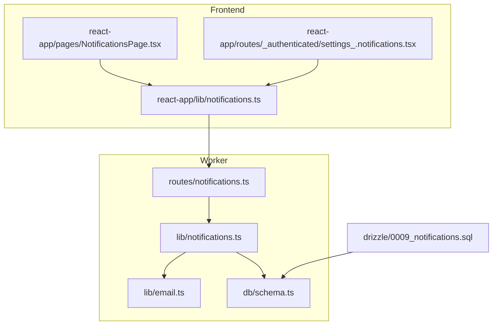
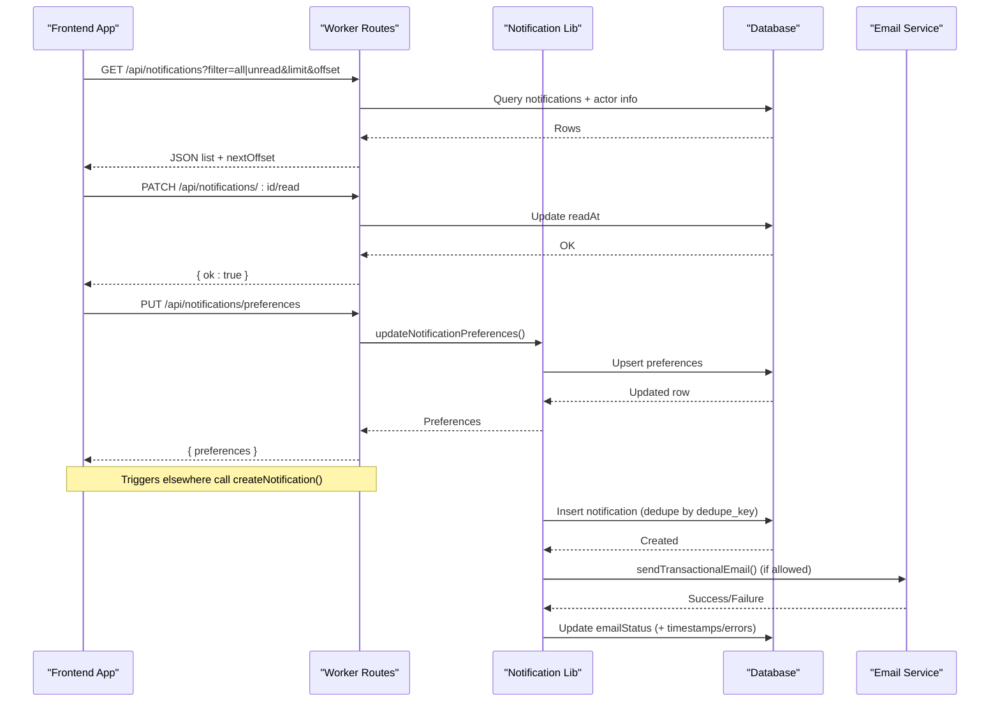
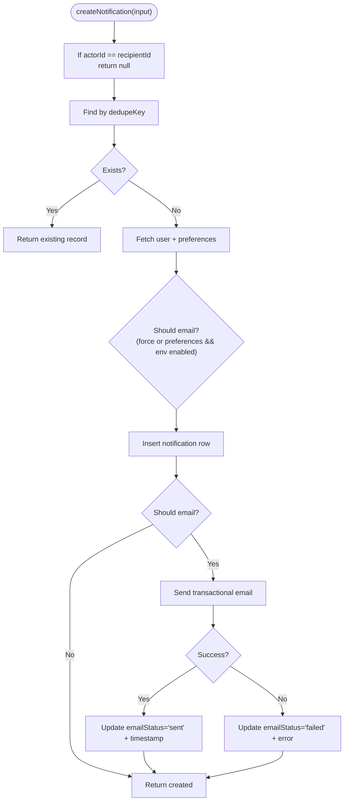
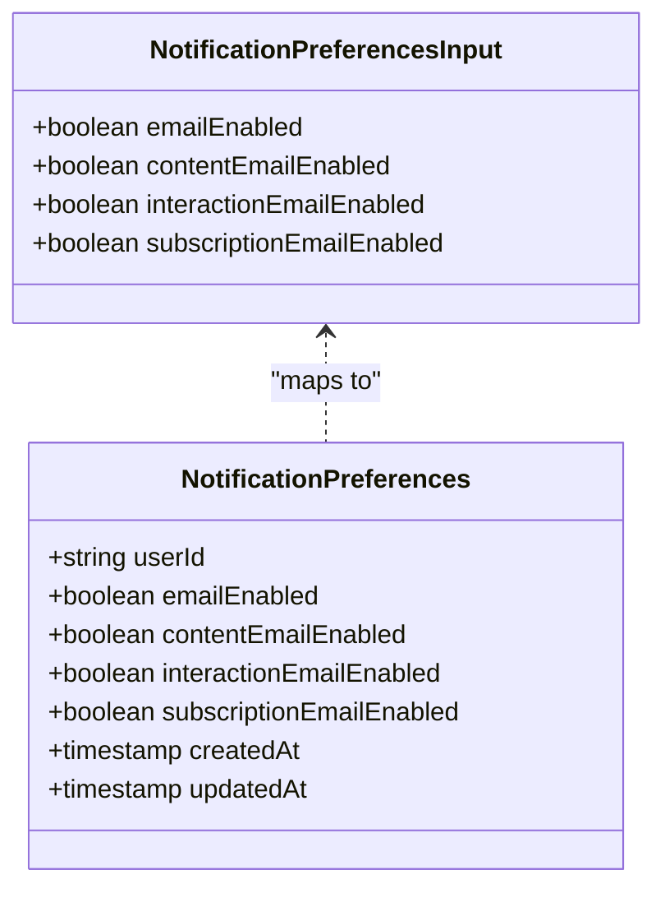
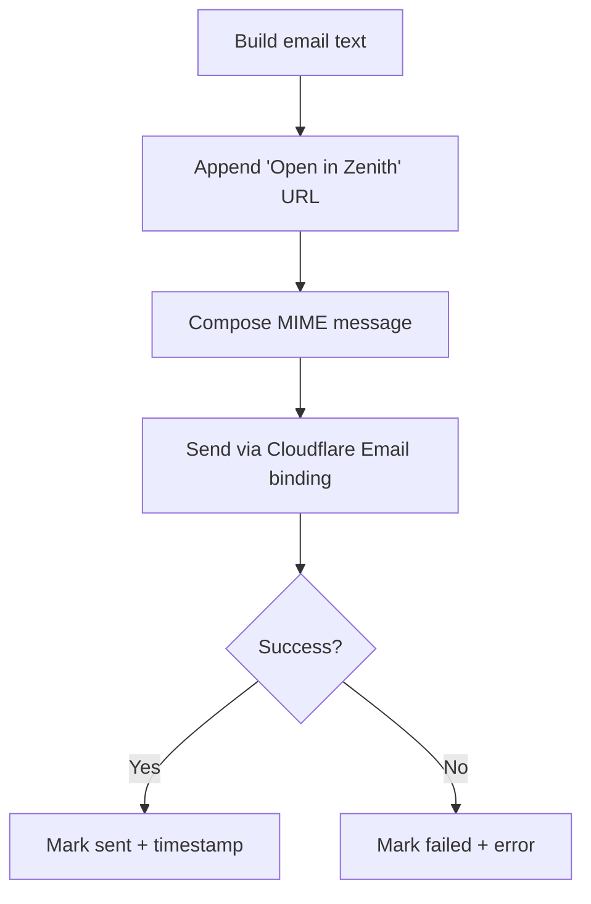
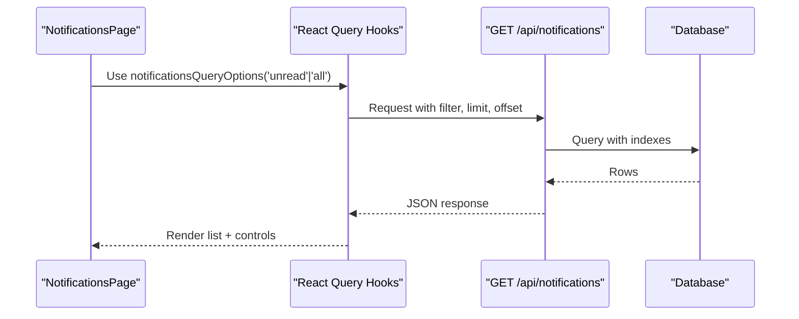
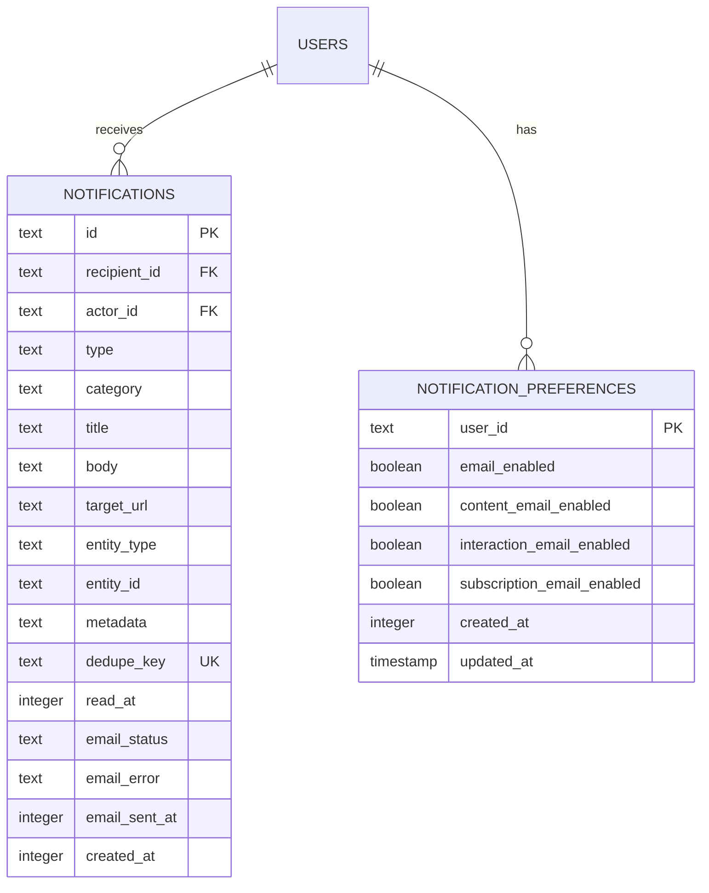
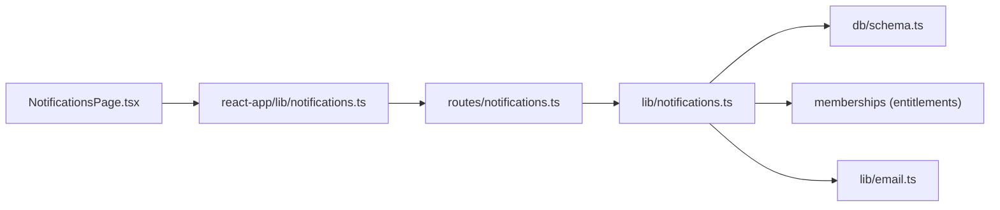

# Notification System Logic

<cite>
**Referenced Files in This Document**
- [notifications.ts](file://src/worker/lib/notifications.ts)
- [notifications.ts](file://src/worker/routes/notifications.ts)
- [email.ts](file://src/worker/lib/email.ts)
- [schema.ts](file://src/worker/db/schema.ts)
- [0009_notifications.sql](file://drizzle/0009_notifications.sql)
- [notifications.ts](file://src/react-app/lib/notifications.ts)
- [NotificationsPage.tsx](file://src/react-app/pages/NotificationsPage.tsx)
- [settings_.notifications.tsx](file://src/react-app/routes/_authenticated/settings_.notifications.tsx)
- [publication.ts](file://src/worker/lib/publication.ts)
</cite>

## Table of Contents
1. [Introduction](#introduction)
2. [Project Structure](#project-structure)
3. [Core Components](#core-components)
4. [Architecture Overview](#architecture-overview)
5. [Detailed Component Analysis](#detailed-component-analysis)
6. [Dependency Analysis](#dependency-analysis)
7. [Performance Considerations](#performance-considerations)
8. [Troubleshooting Guide](#troubleshooting-guide)
9. [Conclusion](#conclusion)

## Introduction
This document explains the notification system’s business logic, covering how notifications are created, delivered, and managed through user preferences. It details supported notification types (system alerts, social interactions, content updates), delivery channels (in-app and email), and batching strategies used to avoid duplicates and reduce overhead. It also includes examples of triggers, template rendering patterns for emails, and optimization techniques applied throughout the flow.

## Project Structure
The notification system spans worker-side libraries, routes, database schema/migrations, and frontend integration:
- Worker library implements creation, preference management, and delivery orchestration.
- Worker routes expose REST endpoints for listing, marking read, and updating preferences.
- Email utilities handle transactional email composition and sending via Cloudflare Email binding.
- Database schema defines tables and indexes for efficient querying.
- Frontend React app consumes APIs and renders the Notifications page and settings.



**Diagram sources**
- [notifications.ts:1-461](file://src/worker/lib/notifications.ts#L1-L461)
- [notifications.ts:1-188](file://src/worker/routes/notifications.ts#L1-L188)
- [email.ts:1-56](file://src/worker/lib/email.ts#L1-L56)
- [schema.ts:871-930](file://src/worker/db/schema.ts#L871-L930)
- [0009_notifications.sql:1-41](file://drizzle/0009_notifications.sql#L1-L41)
- [notifications.ts:1-79](file://src/react-app/lib/notifications.ts#L1-L79)
- [NotificationsPage.tsx:1-164](file://src/react-app/pages/NotificationsPage.tsx#L1-L164)
- [settings_.notifications.tsx:1-7](file://src/react-app/routes/_authenticated/settings_.notifications.tsx#L1-L7)

**Section sources**
- [notifications.ts:1-461](file://src/worker/lib/notifications.ts#L1-L461)
- [notifications.ts:1-188](file://src/worker/routes/notifications.ts#L1-L188)
- [email.ts:1-56](file://src/worker/lib/email.ts#L1-L56)
- [schema.ts:871-930](file://src/worker/db/schema.ts#L871-L930)
- [0009_notifications.sql:1-41](file://drizzle/0009_notifications.sql#L1-L41)
- [notifications.ts:1-79](file://src/react-app/lib/notifications.ts#L1-L79)
- [NotificationsPage.tsx:1-164](file://src/react-app/pages/NotificationsPage.tsx#L1-L164)
- [settings_.notifications.tsx:1-7](file://src/react-app/routes/_authenticated/settings_.notifications.tsx#L1-L7)

## Core Components
- Notification creation and deduplication: Centralized function ensures idempotent creation using a unique dedupe key and prevents self-notifications.
- Preference management: Per-user toggles control whether email is sent for each category; defaults are applied if none exist.
- Delivery orchestration: After persistence, email is conditionally sent based on preferences and environment configuration; status is updated accordingly.
- API layer: Authenticated endpoints list notifications with pagination, count unread, mark as read, and update preferences.
- Frontend integration: React Query hooks fetch data and trigger mutations; UI supports filtering, marking read, and navigating to targets.

Key responsibilities:
- Library functions encapsulate business rules and side effects.
- Routes enforce authentication and input validation.
- Email module abstracts provider-specific sending.
- Schema and migrations define durable storage and performance-critical indexes.
- Frontend provides user-facing features and state synchronization.

**Section sources**
- [notifications.ts:118-234](file://src/worker/lib/notifications.ts#L118-L234)
- [notifications.ts:74-183](file://src/worker/routes/notifications.ts#L74-L183)
- [email.ts:10-43](file://src/worker/lib/email.ts#L10-L43)
- [schema.ts:871-930](file://src/worker/db/schema.ts#L871-L930)
- [notifications.ts:42-78](file://src/react-app/lib/notifications.ts#L42-L78)
- [NotificationsPage.tsx:18-108](file://src/react-app/pages/NotificationsPage.tsx#L18-L108)

## Architecture Overview
The notification system follows a clear separation between business logic, API exposure, persistence, and delivery:



**Diagram sources**
- [notifications.ts:74-183](file://src/worker/routes/notifications.ts#L74-L183)
- [notifications.ts:153-234](file://src/worker/lib/notifications.ts#L153-L234)
- [email.ts:27-43](file://src/worker/lib/email.ts#L27-L43)

## Detailed Component Analysis

### Notification Creation and Deduplication
- Idempotency: Uses a deterministic dedupe key per recipient and event context; duplicate calls return existing records without side effects.
- Self-notification prevention: If actor equals recipient, creation is skipped.
- Preference-aware email gating: Determines whether to attempt email based on global and category-level toggles; account category always allows email.
- Status tracking: Records pending/sent/failed/not_applicable with error messages and timestamps.



**Diagram sources**
- [notifications.ts:153-234](file://src/worker/lib/notifications.ts#L153-L234)

**Section sources**
- [notifications.ts:153-234](file://src/worker/lib/notifications.ts#L153-L234)

### User Preference Management
- Defaults: Global and category-level email toggles have sensible defaults; missing rows are created on first read.
- Updates: Upsert operation persists changes and returns current preferences.
- Categories: Content, interaction, subscription, and account categories map to specific toggles; account bypasses general email toggle.



**Diagram sources**
- [notifications.ts:32-97](file://src/worker/lib/notifications.ts#L32-L97)
- [schema.ts:917-930](file://src/worker/db/schema.ts#L917-L930)

**Section sources**
- [notifications.ts:118-151](file://src/worker/lib/notifications.ts#L118-L151)
- [schema.ts:917-930](file://src/worker/db/schema.ts#L917-L930)

### Notification Types and Triggers
Supported types include content updates, social interactions, subscriptions, payments, creator applications, moderation actions, scheduling failures, and account lifecycle events. Examples of triggers:
- Content published: Notifies all eligible subscribers of a creator’s new post/article/audio/photography/course.
- Reply created: Notifies users when someone comments or replies to their content or thread.
- Post liked: Notifies creators when their content receives a like.
- Subscription lifecycle: Notifies both creator and subscriber on activation and status changes.
- Schedule failure: Forces an account-category notification to alert creators about failed scheduled posts.

```mermaid
sequenceDiagram
participant Pub as "Publication Flow"
participant Lib as "notifySubscribersOfContent()"
participant DB as "SubscriptionMemberships"
participant Create as "createNotification()"
participant Email as "sendTransactionalEmail()"
Pub->>Lib : Call with creatorId, contentType, entityId, title, targetUrl
Lib->>DB : Query eligible subscribers
DB-->>Lib : Subscriber IDs
loop For each subscriber
Lib->>Create : Build dedupeKey and payload
Create->>Create : Dedupe check + persist
alt Email allowed
Create->>Email : Send email
Email-->>Create : Success/Failure
Create->>Create : Update emailStatus
end
end
```

**Diagram sources**
- [notifications.ts:257-299](file://src/worker/lib/notifications.ts#L257-L299)
- [notifications.ts:153-234](file://src/worker/lib/notifications.ts#L153-L234)
- [publication.ts:258-272](file://src/worker/lib/publication.ts#L258-L272)

**Section sources**
- [notifications.ts:16-31](file://src/worker/lib/notifications.ts#L16-L31)
- [notifications.ts:257-461](file://src/worker/lib/notifications.ts#L257-L461)
- [publication.ts:258-272](file://src/worker/lib/publication.ts#L258-L272)

### Delivery Channels and Template Rendering
- In-app channel: All notifications are persisted and available via API for the recipient to view in the app.
- Email channel: Optional, governed by preferences and environment configuration. Emails are plain text with a “Open in Zenith” link appended from the target URL.
- Template rendering: Simple string composition builds subject and body; absolute URLs are resolved using configured base URL or request origin.



**Diagram sources**
- [email.ts:10-43](file://src/worker/lib/email.ts#L10-L43)
- [notifications.ts:99-116](file://src/worker/lib/notifications.ts#L99-L116)

**Section sources**
- [email.ts:10-43](file://src/worker/lib/email.ts#L10-L43)
- [notifications.ts:99-116](file://src/worker/lib/notifications.ts#L99-L116)

### API Endpoints and Frontend Integration
- List notifications: Supports filter (all/unread), limit, offset; returns serialized items with actor info and computed unread flag.
- Unread count: Fast count query for badges or headers.
- Mark read: Single or bulk operations set readAt timestamp.
- Preferences: Read and update per-user toggles.

Frontend uses React Query for caching and optimistic updates, with a dedicated page to display and manage notifications.



**Diagram sources**
- [notifications.ts:49-66](file://src/react-app/lib/notifications.ts#L49-L66)
- [notifications.ts:74-119](file://src/worker/routes/notifications.ts#L74-L119)

**Section sources**
- [notifications.ts:74-183](file://src/worker/routes/notifications.ts#L74-L183)
- [notifications.ts:42-78](file://src/react-app/lib/notifications.ts#L42-L78)
- [NotificationsPage.tsx:18-108](file://src/react-app/pages/NotificationsPage.tsx#L18-L108)

### Data Model and Indexing Strategy
- notifications table stores all fields required for display and delivery, including dedupe key, read state, and email delivery status.
- Unique index on dedupe_key enforces idempotency at the database level.
- Composite indexes optimize common queries: recipient+readAt+createdAt for unread lists, recipient+createdAt for paginated feeds, and actor_id for actor-centric queries.
- notification_preferences table holds per-user toggles with timestamps.



**Diagram sources**
- [0009_notifications.sql:1-41](file://drizzle/0009_notifications.sql#L1-L41)
- [schema.ts:871-930](file://src/worker/db/schema.ts#L871-L930)

**Section sources**
- [0009_notifications.sql:1-41](file://drizzle/0009_notifications.sql#L1-L41)
- [schema.ts:871-930](file://src/worker/db/schema.ts#L871-L930)

## Dependency Analysis
- Worker routes depend on auth middleware and Zod schemas for validation.
- Notification library depends on Drizzle ORM schema definitions and membership entitlement conditions to scope subscribers.
- Email utility depends on Cloudflare Email binding and MIME composition.
- Frontend depends on shared API helpers and React Query for state synchronization.



**Diagram sources**
- [notifications.ts:1-188](file://src/worker/routes/notifications.ts#L1-L188)
- [notifications.ts:1-461](file://src/worker/lib/notifications.ts#L1-L461)
- [schema.ts:871-930](file://src/worker/db/schema.ts#L871-L930)
- [email.ts:1-56](file://src/worker/lib/email.ts#L1-L56)
- [notifications.ts:1-79](file://src/react-app/lib/notifications.ts#L1-L79)
- [NotificationsPage.tsx:1-164](file://src/react-app/pages/NotificationsPage.tsx#L1-L164)

**Section sources**
- [notifications.ts:1-188](file://src/worker/routes/notifications.ts#L1-L188)
- [notifications.ts:1-461](file://src/worker/lib/notifications.ts#L1-L461)
- [schema.ts:871-930](file://src/worker/db/schema.ts#L871-L930)
- [email.ts:1-56](file://src/worker/lib/email.ts#L1-L56)
- [notifications.ts:1-79](file://src/react-app/lib/notifications.ts#L1-L79)
- [NotificationsPage.tsx:1-164](file://src/react-app/pages/NotificationsPage.tsx#L1-L164)

## Performance Considerations
- Deduplication at both application and database layers avoids redundant writes and email sends.
- Indexed queries ensure fast retrieval for large notification sets; pagination limits prevent heavy payloads.
- Parallel fetching of user and preferences reduces latency during creation.
- Conditional email sending respects preferences and environment flags to minimize external calls.
- Bulk mark-read endpoint reduces round-trips for clearing unread states.

[No sources needed since this section provides general guidance]

## Troubleshooting Guide
Common issues and resolutions:
- Duplicate notifications appear: Verify dedupeKey uniqueness across recipients and contexts; ensure callers construct stable keys.
- Missing emails: Check user preferences (global and category toggles), ensure hasTransactionalEmail(env) is true, and inspect emailStatus and emailError fields.
- Incorrect links in emails: Confirm absoluteEmailUrl resolution with NOTIFICATION_EMAIL_BASE_URL or request origin; validate targetUrl format.
- Slow listing: Ensure proper use of filter=unread and pagination; verify indexes on recipient_id and read_at.
- Permission errors marking read: Ensure the authenticated user owns the notification; route validates recipient ownership.

**Section sources**
- [notifications.ts:153-234](file://src/worker/lib/notifications.ts#L153-L234)
- [email.ts:10-43](file://src/worker/lib/email.ts#L10-L43)
- [notifications.ts:149-183](file://src/worker/routes/notifications.ts#L149-L183)

## Conclusion
The notification system combines robust business logic, safe delivery mechanisms, and user-controlled preferences to deliver timely and relevant updates. Idempotent creation, indexed storage, and conditional email dispatch ensure reliability and performance. The frontend integrates seamlessly via typed APIs and reactive state management, providing a responsive user experience for viewing and managing notifications.

[No sources needed since this section summarizes without analyzing specific files]