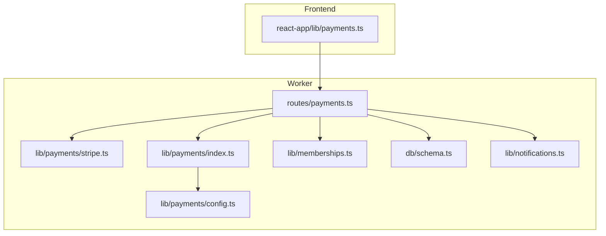
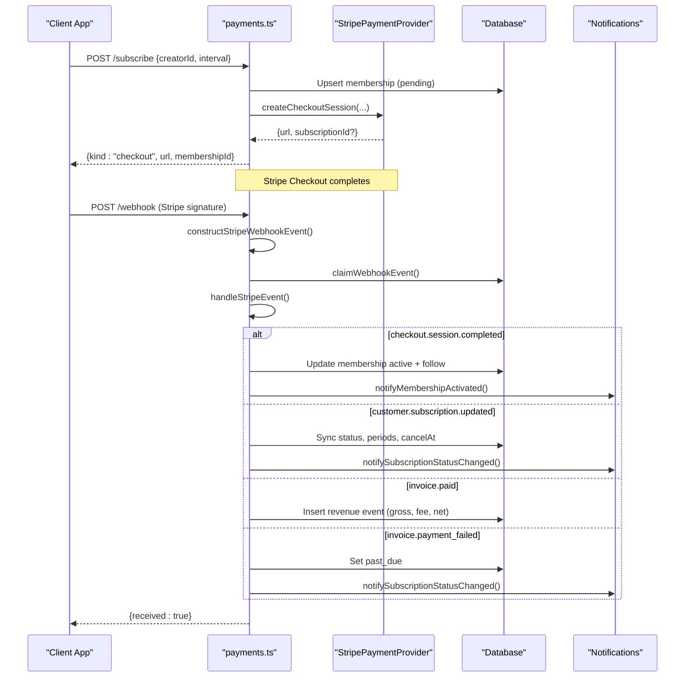
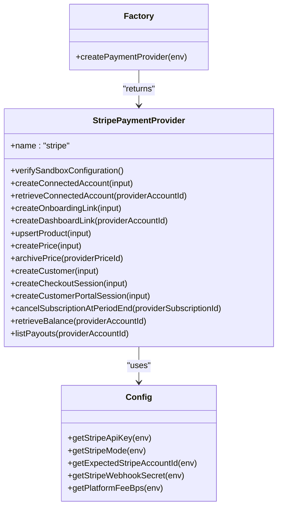
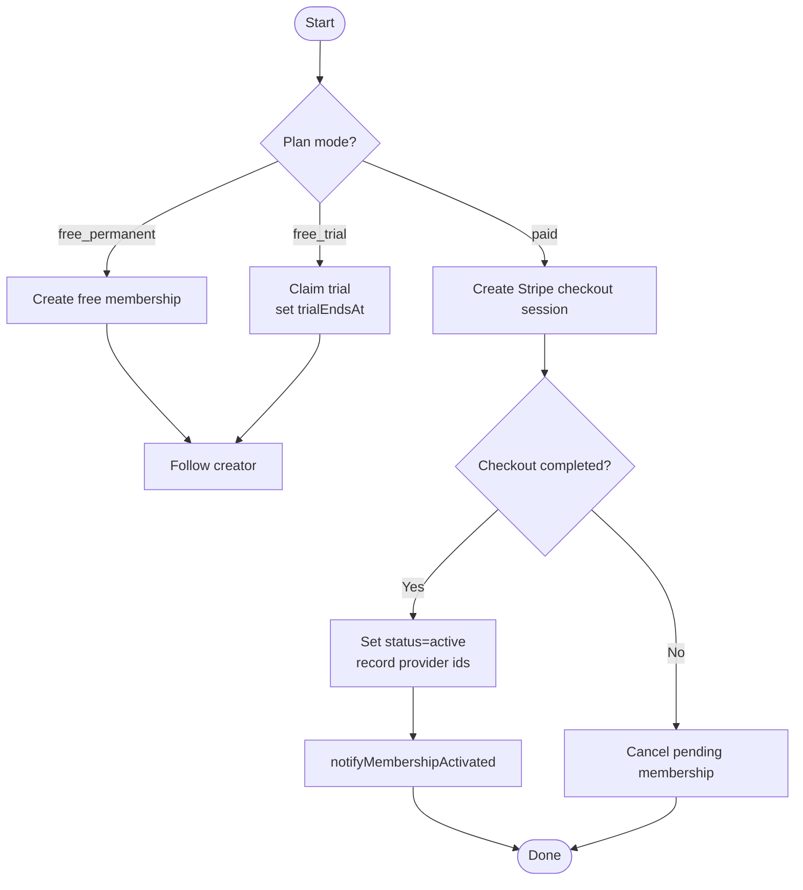
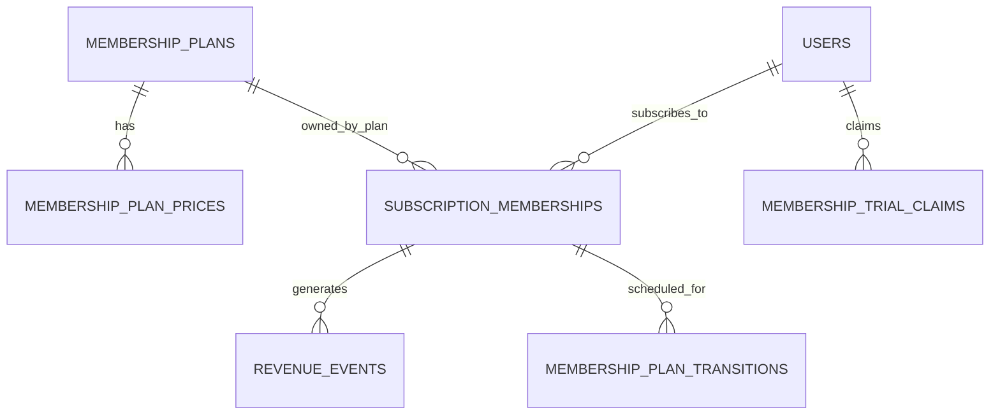
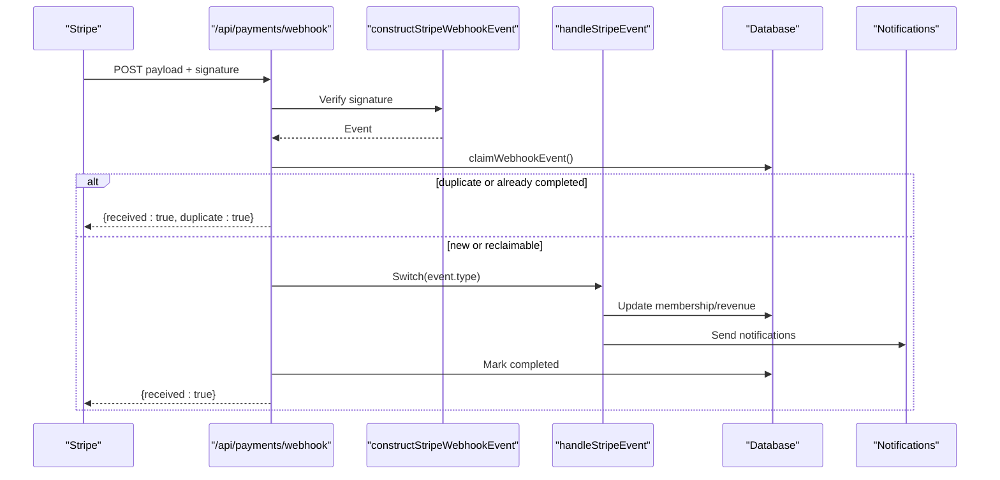
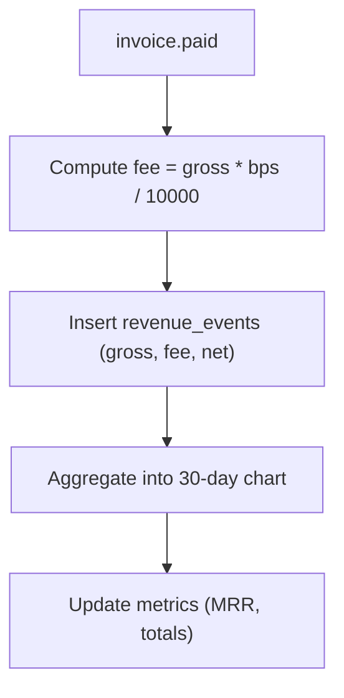
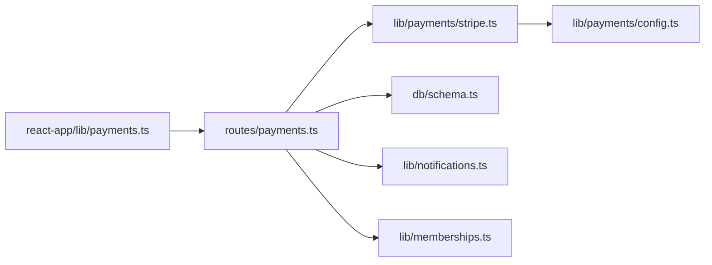

# Payment & Membership Logic

<cite>
**Referenced Files in This Document**
- [payments.ts](file://src/worker/routes/payments.ts)
- [stripe.ts](file://src/worker/lib/payments/stripe.ts)
- [index.ts](file://src/worker/lib/payments/index.ts)
- [config.ts](file://src/worker/lib/payments/config.ts)
- [memberships.ts](file://src/worker/lib/memberships.ts)
- [schema.ts](file://src/worker/db/schema.ts)
- [notifications.ts](file://src/worker/lib/notifications.ts)
- [payments.ts (frontend)](file://src/react-app/lib/payments.ts)
</cite>

## Table of Contents
1. Introduction
2. Project Structure
3. Core Components
4. Architecture Overview
5. Detailed Component Analysis
6. Dependency Analysis
7. Performance Considerations
8. Troubleshooting Guide
9. Conclusion

## Introduction
This document explains the payment processing and membership management business logic, focusing on Stripe integration patterns, subscription lifecycle management, and membership tier handling. It covers webhook processing, subscription status synchronization, revenue tracking, and workflows for creating, canceling, upgrading, and downgrading subscriptions, including error handling for payment failures.

## Project Structure
The payment and membership system is implemented primarily in the worker layer with supporting types and configuration:
- Routes: HTTP endpoints for creator plan management, subscription actions, analytics, and webhooks
- Provider abstraction: Stripe implementation and factory
- Configuration: Sandbox validation and environment-driven settings
- Membership utilities: Entitlement checks, trial expiration, and scheduled transitions
- Database schema: Plans, prices, memberships, trials, transitions, revenue events, and webhook event logs
- Notifications: Subscription lifecycle notifications to creators and subscribers
- Frontend helpers: Types and API calls used by the React app

**Diagram sources**
- [payments.ts](file://src/worker/routes/payments.ts)
- [stripe.ts](file://src/worker/lib/payments/stripe.ts)
- [index.ts](file://src/worker/lib/payments/index.ts)
- [config.ts](file://src/worker/lib/payments/config.ts)
- [memberships.ts](file://src/worker/lib/memberships.ts)
- [schema.ts](file://src/worker/db/schema.ts)
- [notifications.ts](file://src/worker/lib/notifications.ts)
- [payments.ts (frontend)](file://src/react-app/lib/payments.ts)

**Section sources**
- [payments.ts](file://src/worker/routes/payments.ts)
- [stripe.ts](file://src/worker/lib/payments/stripe.ts)
- [index.ts](file://src/worker/lib/payments/index.ts)
- [config.ts](file://src/worker/lib/payments/config.ts)
- [memberships.ts](file://src/worker/lib/memberships.ts)
- [schema.ts](file://src/worker/db/schema.ts)
- [notifications.ts](file://src/worker/lib/notifications.ts)
- [payments.ts (frontend)](file://src/react-app/lib/payments.ts)

## Core Components
- Stripe provider: Encapsulates all Stripe operations (accounts, products, prices, customers, checkout, portal, balance, payouts, webhooks).
- Payments routes: Expose endpoints for creator onboarding, plan updates, subscription creation, billing portal access, cancellation, analytics, and webhooks.
- Membership utilities: Provide entitlement checks, trial expiration, and scheduled transition processing.
- Schema: Defines tables for plans, prices, memberships, trials, transitions, revenue events, and webhook events.
- Notifications: Emits subscription-related notifications to both creators and subscribers.
- Frontend helpers: Define types and API functions consumed by the React UI.

**Section sources**
- [stripe.ts](file://src/worker/lib/payments/stripe.ts)
- [payments.ts](file://src/worker/routes/payments.ts)
- [memberships.ts](file://src/worker/lib/memberships.ts)
- [schema.ts](file://src/worker/db/schema.ts)
- [notifications.ts](file://src/worker/lib/notifications.ts)
- [payments.ts (frontend)](file://src/react-app/lib/payments.ts)

## Architecture Overview
The system uses a provider abstraction to interact with Stripe, while routes orchestrate business logic and persist state. Webhooks are validated and dispatched to handlers that update memberships, record revenue, and send notifications.

**Diagram sources**
- [payments.ts](file://src/worker/routes/payments.ts)
- [stripe.ts](file://src/worker/lib/payments/stripe.ts)
- [notifications.ts](file://src/worker/lib/notifications.ts)
- [schema.ts](file://src/worker/db/schema.ts)

## Detailed Component Analysis

### Stripe Integration Patterns
- Provider factory selects Stripe based on configuration; all calls validate sandbox mode and expected account ID.
- Connected accounts are created and retrieved with capability flags; onboarding links and dashboard links are generated.
- Products and prices are upserted with idempotency keys; prices support monthly/yearly intervals.
- Checkout sessions embed metadata (membershipId, interval, planPriceId) and configure application fees and transfers.
- Customer portal sessions allow subscribers to manage billing.
- Balance and payouts are fetched per connected account.

**Diagram sources**
- [stripe.ts](file://src/worker/lib/payments/stripe.ts)
- [config.ts](file://src/worker/lib/payments/config.ts)
- [index.ts](file://src/worker/lib/payments/index.ts)

**Section sources**
- [stripe.ts](file://src/worker/lib/payments/stripe.ts)
- [config.ts](file://src/worker/lib/payments/config.ts)
- [index.ts](file://src/worker/lib/payments/index.ts)

### Subscription Lifecycle Management
- Free permanent/trial memberships are created directly without payments; trials set an expiration timestamp.
- Paid memberships require a Stripe checkout session; upon completion, membership becomes active and follows the creator.
- Subscription updates from Stripe sync status, period boundaries, and cancellation timing.
- Past due invoices mark memberships as past_due and trigger notifications.
- Scheduled transitions allow cancelling paid subscriptions at period end when a creator disables paid mode or changes plans.

**Diagram sources**
- [payments.ts](file://src/worker/routes/payments.ts)
- [memberships.ts](file://src/worker/lib/memberships.ts)

**Section sources**
- [payments.ts](file://src/worker/routes/payments.ts)
- [memberships.ts](file://src/worker/lib/memberships.ts)

### Membership Tier Handling
- Plan modes: disabled, free_permanent, free_trial, paid.
- Prices: monthly and yearly intervals with active flag; inactive prices archived when updated.
- Entitlement: active or trialing with unexpired trial grants access.
- Trial claims: one-time per subscriber per creator; expired trials are marked expired by maintenance.

**Diagram sources**
- [schema.ts](file://src/worker/db/schema.ts)

**Section sources**
- [schema.ts](file://src/worker/db/schema.ts)
- [memberships.ts](file://src/worker/lib/memberships.ts)

### Payment Webhook Processing
- Endpoint validates Stripe signature and rejects live mode events.
- Deduplicates and reclaims stale processing via claim table.
- Dispatches to handlers for checkout completion/expiry, subscription changes, invoice payments/failures.
- Updates membership status, records revenue events, and sends notifications.

**Diagram sources**
- [payments.ts](file://src/worker/routes/payments.ts)
- [stripe.ts](file://src/worker/lib/payments/stripe.ts)
- [schema.ts](file://src/worker/db/schema.ts)
- [notifications.ts](file://src/worker/lib/notifications.ts)

**Section sources**
- [payments.ts](file://src/worker/routes/payments.ts)
- [stripe.ts](file://src/worker/lib/payments/stripe.ts)
- [schema.ts](file://src/worker/db/schema.ts)
- [notifications.ts](file://src/worker/lib/notifications.ts)

### Revenue Tracking
- Revenue events recorded on successful invoice payments with gross, platform fee, and net amounts.
- Platform fee calculated using basis points from configuration.
- Analytics endpoint aggregates MRR, totals, and builds a 30-day chart bucketed by UTC date.

**Diagram sources**
- [payments.ts](file://src/worker/routes/payments.ts)
- [config.ts](file://src/worker/lib/payments/config.ts)
- [schema.ts](file://src/worker/db/schema.ts)

**Section sources**
- [payments.ts](file://src/worker/routes/payments.ts)
- [config.ts](file://src/worker/lib/payments/config.ts)
- [schema.ts](file://src/worker/db/schema.ts)

### Workflows and Examples

#### Subscription Creation (Paid)
- Validate inputs and eligibility; ensure creator accepts memberships and payer is active.
- Upsert membership as pending; create Stripe customer if needed; create checkout session with metadata and idempotency key.
- Return checkout URL; frontend redirects user to complete payment.

**Section sources**
- [payments.ts](file://src/worker/routes/payments.ts)
- [stripe.ts](file://src/worker/lib/payments/stripe.ts)

#### Subscription Cancellation
- Free/trial memberships can be canceled directly; paid memberships must be managed via Stripe Billing Portal.
- For paid-mode transitions (e.g., disabling paid), schedule cancellation at period end and process asynchronously with retries.

**Section sources**
- [payments.ts](file://src/worker/routes/payments.ts)
- [memberships.ts](file://src/worker/lib/memberships.ts)

#### Upgrade/Downgrade Workflows
- Upgrades/downgrades are handled through Stripe’s subscription model; webhook updates synchronize status and periods.
- When changing plan prices, archive old prices and create new ones; existing active subscriptions continue until next renewal or explicit change.

**Section sources**
- [payments.ts](file://src/worker/routes/payments.ts)
- [stripe.ts](file://src/worker/lib/payments/stripe.ts)

#### Error Handling for Payment Failures
- Invalid signatures return bad request; live mode events rejected.
- Failed invoice payments set membership to past_due and notify users.
- Configuration errors surface as provider unavailable responses; retries and fallbacks applied where applicable.

**Section sources**
- [payments.ts](file://src/worker/routes/payments.ts)
- [config.ts](file://src/worker/lib/payments/config.ts)

## Dependency Analysis
- Routes depend on provider abstraction, database schema, and notification utilities.
- Provider depends on configuration for sandbox validation and secrets.
- Maintenance jobs rely on membership utilities and provider for scheduled cancellations.
- Frontend consumes typed API helpers and query options.

**Diagram sources**
- [payments.ts (frontend)](file://src/react-app/lib/payments.ts)
- [payments.ts](file://src/worker/routes/payments.ts)
- [stripe.ts](file://src/worker/lib/payments/stripe.ts)
- [config.ts](file://src/worker/lib/payments/config.ts)
- [schema.ts](file://src/worker/db/schema.ts)
- [notifications.ts](file://src/worker/lib/notifications.ts)
- [memberships.ts](file://src/worker/lib/memberships.ts)

**Section sources**
- [payments.ts (frontend)](file://src/react-app/lib/payments.ts)
- [payments.ts](file://src/worker/routes/payments.ts)
- [stripe.ts](file://src/worker/lib/payments/stripe.ts)
- [config.ts](file://src/worker/lib/payments/config.ts)
- [schema.ts](file://src/worker/db/schema.ts)
- [notifications.ts](file://src/worker/lib/notifications.ts)
- [memberships.ts](file://src/worker/lib/memberships.ts)

## Performance Considerations
- Use idempotency keys for Stripe operations to prevent duplicates during retries.
- Batch database writes where possible (e.g., membership creation plus follow insertion).
- Reclaim stale webhook processing entries to avoid deadlocks and ensure progress.
- Archive unused prices instead of deleting to maintain referential integrity.
- Bucket revenue data by UTC dates to simplify aggregation and chart rendering.

[No sources needed since this section provides general guidance]

## Troubleshooting Guide
- Missing or invalid Stripe signature: Ensure correct webhook secret and signature header.
- Live mode rejection: Confirm STRIPE_MODE=test and use sandbox keys only.
- Creator not accepting memberships: Check plan mode and creator account status.
- Paid setup incomplete: Complete Stripe Sandbox Express onboarding before enabling paid mode.
- Stale checkouts or failed transitions: Inspect admin signals and retry queues; review lastError fields.

**Section sources**
- [payments.ts](file://src/worker/routes/payments.ts)
- [admin.ts](file://src/worker/routes/admin.ts)
- [config.ts](file://src/worker/lib/payments/config.ts)

## Conclusion
The payment and membership system integrates Stripe via a robust provider abstraction, ensuring secure sandbox-only operation, idempotent operations, and comprehensive lifecycle management. Webhooks keep local state synchronized, revenue is tracked accurately, and notifications inform both creators and subscribers. The design supports flexible membership tiers, safe upgrades/downgrades, and resilient error handling.