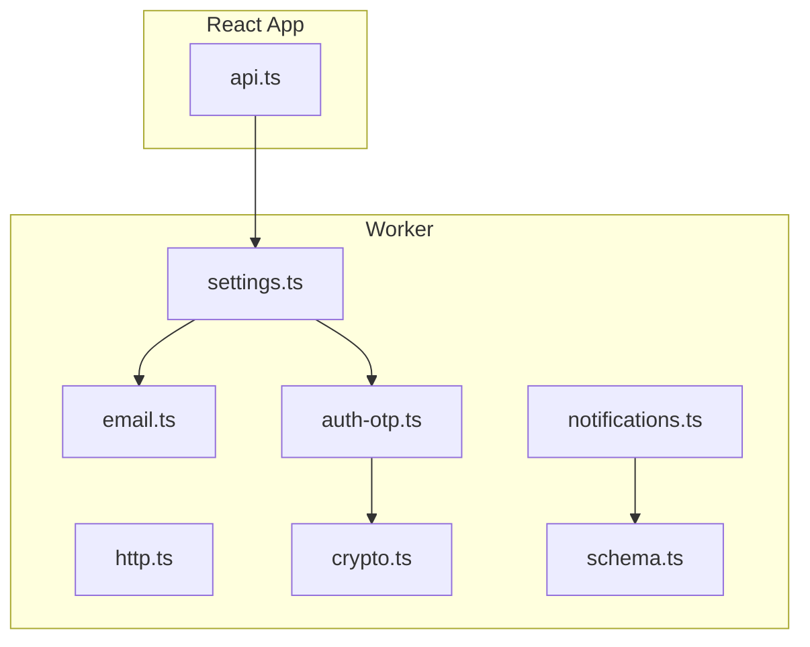
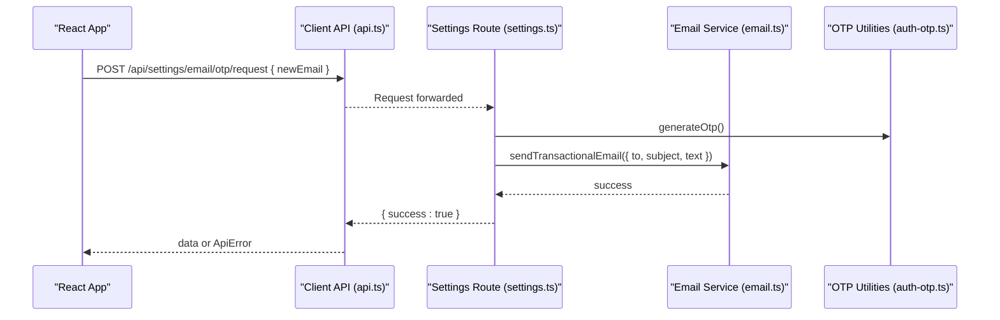
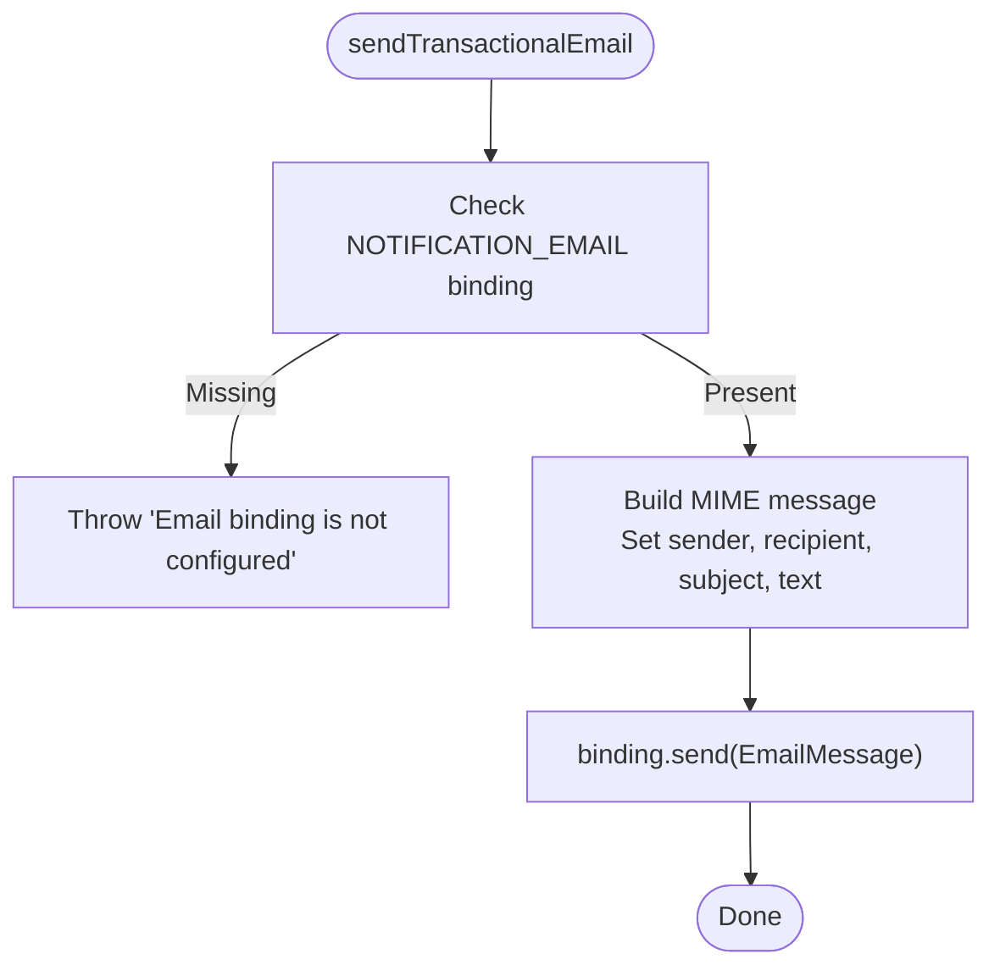
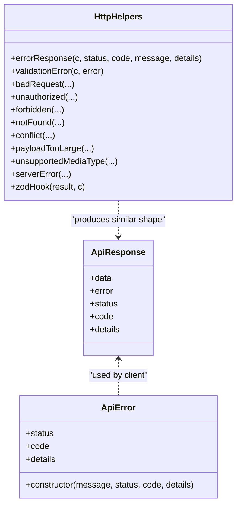
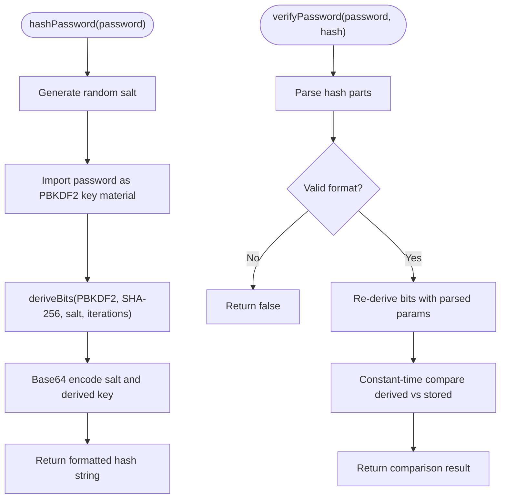
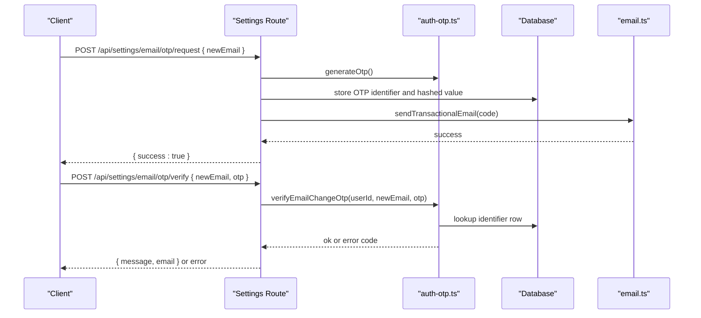
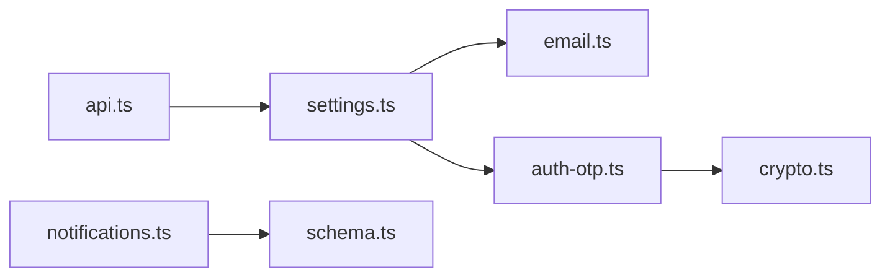

# Utility Services

<cite>
**Referenced Files in This Document**
- [email.ts](file://src/worker/lib/email.ts)
- [http.ts](file://src/worker/lib/http.ts)
- [crypto.ts](file://src/worker/lib/crypto.ts)
- [api.ts](file://src/react-app/lib/api.ts)
- [auth-otp.ts](file://src/worker/lib/auth-otp.ts)
- [settings.ts](file://src/worker/routes/settings.ts)
- [notifications.ts](file://src/worker/routes/notifications.ts)
- [schema.ts](file://src/worker/db/schema.ts)
- [crypto.test.ts](file://src/worker/lib/crypto.test.ts)
- [http.test.ts](file://src/worker/lib/http.test.ts)
</cite>

## Table of Contents
1. [Introduction](#introduction)
2. [Project Structure](#project-structure)
3. [Core Components](#core-components)
4. [Architecture Overview](#architecture-overview)
5. [Detailed Component Analysis](#detailed-component-analysis)
6. [Dependency Analysis](#dependency-analysis)
7. [Performance Considerations](#performance-considerations)
8. [Troubleshooting Guide](#troubleshooting-guide)
9. [Conclusion](#conclusion)

## Introduction
This document explains the core utility services used across the application: email handling, HTTP request management, and cryptographic operations. It covers how emails are composed and sent via Cloudflare Email, how HTTP requests are abstracted on both server and client sides, and how secure hashing is implemented using Web Crypto APIs. It also documents error handling patterns, OTP flows, and best practices for reliable delivery and secure communication.

## Project Structure
The relevant utilities are split between the worker (server-side) and the React app (client-side):
- Worker utilities:
  - Email composition and sending
  - HTTP error helpers and validation hooks
  - Cryptographic primitives for password hashing and verification
  - OTP generation and verification
- Client utilities:
  - Unified API client with standardized error handling and response normalization

**Diagram sources**
- [email.ts:1-56](file://src/worker/lib/email.ts#L1-L56)
- [http.ts:1-80](file://src/worker/lib/http.ts#L1-L80)
- [crypto.ts:1-109](file://src/worker/lib/crypto.ts#L1-L109)
- [auth-otp.ts:1-123](file://src/worker/lib/auth-otp.ts#L1-L123)
- [settings.ts:137-221](file://src/worker/routes/settings.ts#L137-L221)
- [notifications.ts:1-25](file://src/worker/routes/notifications.ts#L1-L25)
- [schema.ts:895-915](file://src/worker/db/schema.ts#L895-L915)
- [api.ts:1-164](file://src/react-app/lib/api.ts#L1-L164)

**Section sources**
- [email.ts:1-56](file://src/worker/lib/email.ts#L1-L56)
- [http.ts:1-80](file://src/worker/lib/http.ts#L1-L80)
- [crypto.ts:1-109](file://src/worker/lib/crypto.ts#L1-L109)
- [api.ts:1-164](file://src/react-app/lib/api.ts#L1-L164)
- [auth-otp.ts:1-123](file://src/worker/lib/auth-otp.ts#L1-L123)
- [settings.ts:137-221](file://src/worker/routes/settings.ts#L137-L221)
- [notifications.ts:1-25](file://src/worker/routes/notifications.ts#L1-L25)
- [schema.ts:895-915](file://src/worker/db/schema.ts#L895-L915)

## Core Components
- Email service: Composes MIME messages and sends them via Cloudflare Email binding. Provides helpers to compute absolute URLs for links inside emails and a capability check for email availability.
- HTTP error utilities: Standardized error envelope, typed error codes, and Zod integration hook for consistent validation errors.
- Cryptography: PBKDF2-based password hashing and constant-time verification using Web Crypto APIs.
- OTP utilities: Secure OTP generation, hashing, and verification with attempt limiting and expiration.
- Client API abstraction: Normalizes responses and errors, supports all HTTP methods, and throws structured ApiError instances.

**Section sources**
- [email.ts:10-43](file://src/worker/lib/email.ts#L10-L43)
- [http.ts:23-79](file://src/worker/lib/http.ts#L23-L79)
- [crypto.ts:25-108](file://src/worker/lib/crypto.ts#L25-L108)
- [auth-otp.ts:26-123](file://src/worker/lib/auth-otp.ts#L26-L123)
- [api.ts:43-164](file://src/react-app/lib/api.ts#L43-L164)

## Architecture Overview
The system integrates three primary layers:
- Client layer: The React app uses a unified API client to call backend endpoints. Errors are normalized and surfaced as structured objects or exceptions.
- Worker layer: Routes orchestrate business logic, validate inputs, interact with the database, and use utility services for email and crypto.
- External integrations: Cloudflare Email binding delivers transactional emails; Web Crypto provides secure hashing without external dependencies.

**Diagram sources**
- [api.ts:98-103](file://src/react-app/lib/api.ts#L98-L103)
- [settings.ts:148-203](file://src/worker/routes/settings.ts#L148-L203)
- [email.ts:27-43](file://src/worker/lib/email.ts#L27-L43)
- [auth-otp.ts:26-38](file://src/worker/lib/auth-otp.ts#L26-L38)

## Detailed Component Analysis

### Email Handling
Responsibilities:
- Build MIME messages and send via Cloudflare Email binding.
- Provide helpers to compute absolute URLs for email content based on environment configuration.
- Offer a capability check to determine if email is configured.

Key behaviors:
- Absolute URL resolution prefers explicit https/http URLs, falls back to configured base URL, then returns raw target when no base exists.
- Transactional email sender constructs a plain-text message and sends it through the binding.
- OTP email helper composes a sign-in code message with expiry guidance.

Usage examples:
- Compute base URL from environment or origin.
- Resolve absolute URLs for links embedded in emails.
- Send a transactional email with recipient, subject, and text body.
- Send an OTP email with a generated code.

Best practices:
- Always provide an explicit https base URL in production to avoid insecure links.
- Validate recipients and sanitize subjects/text before sending.
- Handle binding absence gracefully by checking capability before attempting to send.

**Diagram sources**
- [email.ts:27-43](file://src/worker/lib/email.ts#L27-L43)

**Section sources**
- [email.ts:10-21](file://src/worker/lib/email.ts#L10-L21)
- [email.ts:23-25](file://src/worker/lib/email.ts#L23-L25)
- [email.ts:27-43](file://src/worker/lib/email.ts#L27-L43)
- [email.ts:45-55](file://src/worker/lib/email.ts#L45-L55)

### HTTP Request Management and Error Handling
Responsibilities:
- Server-side: Provide standardized error responses and a Zod validation hook that returns consistent 422 payloads.
- Client-side: Abstract fetch calls, normalize JSON error shapes, and throw structured ApiError instances.

Server-side helpers:
- errorResponse builds a uniform JSON error envelope with code, message, and optional details.
- Convenience functions map common HTTP statuses to typed error codes.
- zodHook converts validation failures into 422 responses with issues array.

Client-side abstraction:
- apiFetch centralizes headers, credentials, and error normalization.
- Methods for GET/POST/PUT/PATCH/DELETE return ApiResponse with data, error, status, code, and details.
- Required variants throw ApiError on non-ok responses.

Integration patterns:
- Use zodHook with @hono/zod-validator to enforce input schemas consistently.
- On the client, prefer required variants for imperative flows where failures should be handled explicitly.

**Diagram sources**
- [api.ts:1-41](file://src/react-app/lib/api.ts#L1-L41)
- [api.ts:43-92](file://src/react-app/lib/api.ts#L43-L92)
- [http.ts:23-79](file://src/worker/lib/http.ts#L23-L79)

**Section sources**
- [http.ts:4-33](file://src/worker/lib/http.ts#L4-L33)
- [http.ts:35-79](file://src/worker/lib/http.ts#L35-L79)
- [api.ts:13-41](file://src/react-app/lib/api.ts#L13-L41)
- [api.ts:43-92](file://src/react-app/lib/api.ts#L43-L92)
- [api.ts:94-164](file://src/react-app/lib/api.ts#L94-L164)

### Cryptographic Operations
Responsibilities:
- Password hashing using PBKDF2-HMAC-SHA256 with random salt and configurable iterations.
- Constant-time verification to prevent timing attacks.
- Base64 encoding/decoding helpers for portable storage.

Implementation highlights:
- hashPassword generates a salt, derives a key, and returns a self-describing string containing algorithm, parameters, salt, and derived key.
- verifyPassword parses stored hashes, re-derives the key, and compares using timing-safe equality when available.

Security considerations:
- Uses only Web Crypto APIs; no Node.js crypto imports.
- Iteration count set to a strong default; ensure environment constraints allow this cost.
- Malformed hashes are rejected safely.

**Diagram sources**
- [crypto.ts:25-51](file://src/worker/lib/crypto.ts#L25-L51)
- [crypto.ts:57-108](file://src/worker/lib/crypto.ts#L57-L108)

**Section sources**
- [crypto.ts:8-16](file://src/worker/lib/crypto.ts#L8-L16)
- [crypto.ts:25-51](file://src/worker/lib/crypto.ts#L25-L51)
- [crypto.ts:57-108](file://src/worker/lib/crypto.ts#L57-L108)
- [crypto.test.ts:1-49](file://src/worker/lib/crypto.test.ts#L1-49)

### OTP Generation and Verification
Responsibilities:
- Generate cryptographically secure numeric OTPs.
- Hash OTPs for safe storage and comparison.
- Verify OTPs with expiration checks and attempt limits.

Flow overview:
- generateOtp creates a random 6-digit code.
- hashOtp computes a base64url-encoded SHA-256 digest for storage.
- verifyEmailChangeOtp validates existence, expiration, attempts, and performs constant-time comparison.

**Diagram sources**
- [auth-otp.ts:26-43](file://src/worker/lib/auth-otp.ts#L26-L43)
- [auth-otp.ts:87-123](file://src/worker/lib/auth-otp.ts#L87-L123)
- [settings.ts:148-203](file://src/worker/routes/settings.ts#L148-L203)
- [email.ts:27-43](file://src/worker/lib/email.ts#L27-L43)

**Section sources**
- [auth-otp.ts:26-38](file://src/worker/lib/auth-otp.ts#L26-L38)
- [auth-otp.ts:40-43](file://src/worker/lib/auth-otp.ts#L40-L43)
- [auth-otp.ts:87-123](file://src/worker/lib/auth-otp.ts#L87-L123)
- [settings.ts:148-203](file://src/worker/routes/settings.ts#L148-L203)

### Email Template Rendering and Delivery Retry Mechanisms
Template rendering:
- Emails are constructed as plain text using a MIME library. There is no HTML template engine; content is assembled programmatically.
- URL helpers ensure links inside emails resolve correctly against configured base URLs.

Delivery reliability:
- The current implementation sends emails synchronously within route handlers. No built-in retry queue is present in the email module.
- For robust delivery, consider wrapping sendTransactionalEmail with exponential backoff and idempotency keys at the caller level.
- Database schema includes fields for tracking notification email status and errors, which can be leveraged for retry workflows.

Practical recommendations:
- Implement a background job or queue to retry failed deliveries with backoff.
- Persist delivery attempts and outcomes to enable auditing and retries.
- Use unique dedupe keys to avoid duplicate emails during retries.

**Section sources**
- [email.ts:10-21](file://src/worker/lib/email.ts#L10-L21)
- [email.ts:27-43](file://src/worker/lib/email.ts#L27-L43)
- [schema.ts:895-915](file://src/worker/db/schema.ts#L895-L915)

### HTTP Client Abstraction and External API Integration Patterns
Client abstraction:
- apiFetch handles headers, credentials, and JSON parsing.
- Response normalization maps varied error shapes into a consistent structure.
- Required variants throw ApiError with status, code, and details for precise error handling.

External API integration patterns:
- Always include credentials for authenticated requests.
- Normalize error responses to display user-friendly messages while preserving technical details for logging.
- For long-running or flaky external calls, implement retries with backoff and circuit breakers at the caller layer.

**Section sources**
- [api.ts:43-92](file://src/react-app/lib/api.ts#L43-L92)
- [api.ts:94-164](file://src/react-app/lib/api.ts#L94-L164)

## Dependency Analysis
- Client depends on the API abstraction for all network calls.
- Worker routes depend on email and OTP utilities for authentication and settings flows.
- OTP utilities rely on Web Crypto for hashing and randomness.
- Notification schema tracks email delivery states, enabling future retry mechanisms.

**Diagram sources**
- [api.ts:1-164](file://src/react-app/lib/api.ts#L1-L164)
- [settings.ts:148-203](file://src/worker/routes/settings.ts#L148-L203)
- [email.ts:27-43](file://src/worker/lib/email.ts#L27-L43)
- [auth-otp.ts:26-43](file://src/worker/lib/auth-otp.ts#L26-L43)
- [crypto.ts:25-51](file://src/worker/lib/crypto.ts#L25-L51)
- [notifications.ts:1-25](file://src/worker/routes/notifications.ts#L1-L25)
- [schema.ts:895-915](file://src/worker/db/schema.ts#L895-L915)

**Section sources**
- [api.ts:1-164](file://src/react-app/lib/api.ts#L1-L164)
- [settings.ts:148-203](file://src/worker/routes/settings.ts#L148-L203)
- [email.ts:27-43](file://src/worker/lib/email.ts#L27-L43)
- [auth-otp.ts:26-43](file://src/worker/lib/auth-otp.ts#L26-L43)
- [crypto.ts:25-51](file://src/worker/lib/crypto.ts#L25-L51)
- [notifications.ts:1-25](file://src/worker/routes/notifications.ts#L1-L25)
- [schema.ts:895-915](file://src/worker/db/schema.ts#L895-L915)

## Performance Considerations
- Password hashing uses PBKDF2 with a high iteration count; ensure latency budgets accommodate this cost.
- Avoid synchronous email sending in hot paths; offload to background jobs to reduce request latency.
- Cache frequently accessed configuration values (e.g., base URL) to minimize recomputation.
- Use efficient validators and early exits to reduce unnecessary processing.

[No sources needed since this section provides general guidance]

## Troubleshooting Guide
Common issues and resolutions:
- Email binding not configured: Ensure NOTIFICATION_EMAIL is set and valid. Check hasTransactionalEmail before sending.
- Invalid or malformed OTP: Verify OTP length, expiration, and attempt limits. Confirm hashing matches storage format.
- Validation failures: Inspect Zod issues returned by zodHook; ensure request bodies match expected schemas.
- Network errors: Inspect ApiError properties (status, code, details) to differentiate between network failures and server errors.

Operational tips:
- Log error envelopes consistently to aid debugging.
- Track email delivery statuses and errors in the database to support retries and audits.
- Use test suites to assert error shapes and behavior under edge cases.

**Section sources**
- [http.ts:23-79](file://src/worker/lib/http.ts#L23-L79)
- [api.ts:13-41](file://src/react-app/lib/api.ts#L13-L41)
- [crypto.test.ts:1-49](file://src/worker/lib/crypto.test.ts#L1-49)
- [http.test.ts:1-42](file://src/worker/lib/http.test.ts#L1-L42)

## Conclusion
The utility services provide a solid foundation for secure and reliable operations:
- Email handling composes and sends transactional messages with clear URL resolution.
- HTTP utilities standardize error handling and validation across server and client.
- Cryptographic functions offer secure password hashing and verification using Web Crypto.
- OTP utilities ensure safe, rate-limited verification flows.

Adopting background jobs for email delivery and implementing robust retry strategies will further improve resilience. Consistent error envelopes and structured exceptions simplify debugging and enhance user experience.