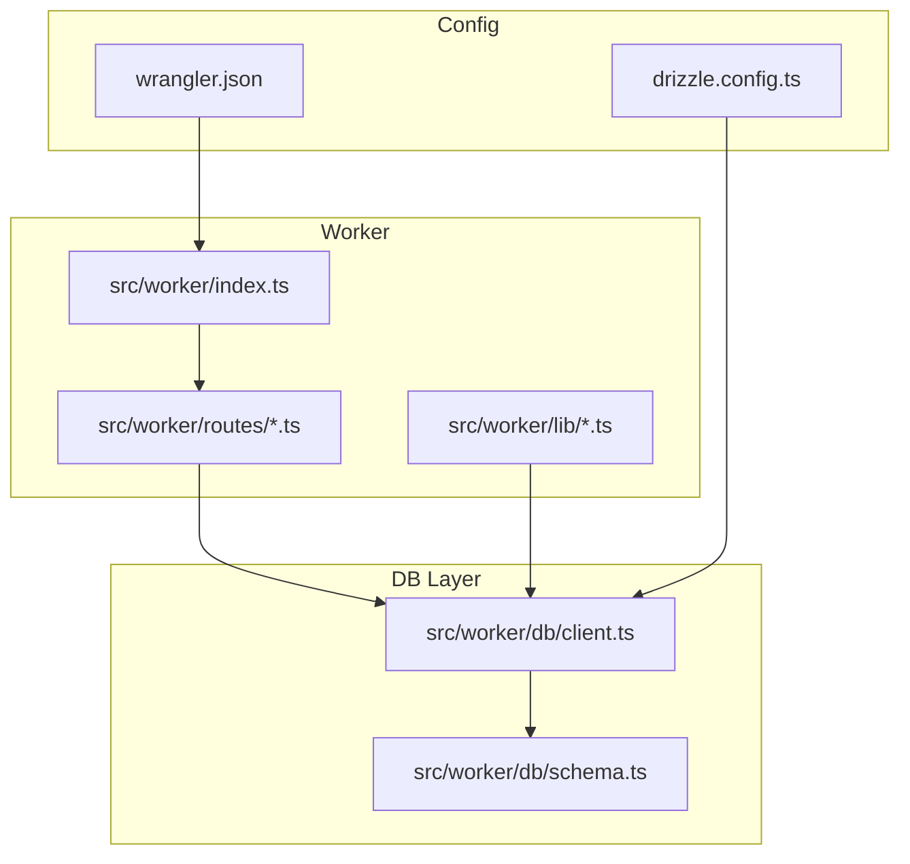
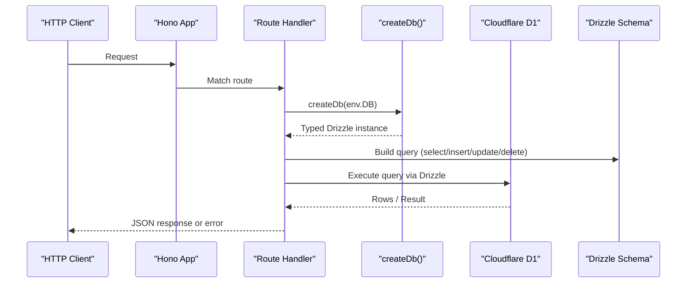
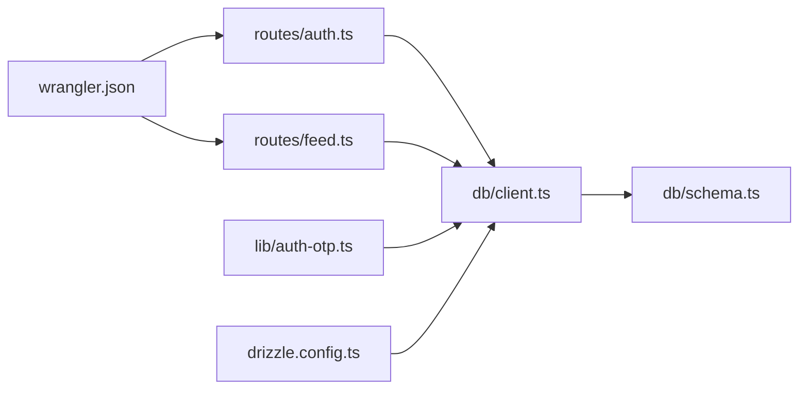

# Database Client

<cite>
**Referenced Files in This Document**
- [client.ts](file://src/worker/db/client.ts)
- [schema.ts](file://src/worker/db/schema.ts)
- [drizzle.config.ts](file://drizzle.config.ts)
- [wrangler.json](file://wrangler.json)
- [index.ts](file://src/worker/index.ts)
- [auth.ts](file://src/worker/routes/auth.ts)
- [feed.ts](file://src/worker/routes/feed.ts)
- [auth-otp.ts](file://src/worker/lib/auth-otp.ts)
- [http.ts](file://src/worker/lib/http.ts)
- [admin-migration.test.ts](file://src/worker/db/admin-migration.test.ts)
</cite>

## Table of Contents
1. [Introduction](#introduction)
2. [Project Structure](#project-structure)
3. [Core Components](#core-components)
4. [Architecture Overview](#architecture-overview)
5. [Detailed Component Analysis](#detailed-component-analysis)
6. [Dependency Analysis](#dependency-analysis)
7. [Performance Considerations](#performance-considerations)
8. [Troubleshooting Guide](#troubleshooting-guide)
9. [Conclusion](#conclusion)
10. [Appendices](#appendices)

## Introduction
This document explains the database client implementation using Drizzle ORM with Cloudflare D1 in a Cloudflare Workers application. It covers connection setup, configuration options, environment variable management, client initialization, connection pooling behavior, error handling patterns, type-safe query writing, transaction handling, batch operations, performance optimization techniques, query caching strategies, and debugging approaches. Practical examples illustrate common CRUD operations, complex joins, and aggregation queries using the Drizzle ORM API as used throughout the codebase.

## Project Structure
The database layer is organized under src/worker/db with a minimal client factory and a comprehensive schema definition. Configuration for Drizzle Kit and Wrangler bindings are defined at the project root. The Worker entrypoint wires routes that consume the database client.

**Diagram sources**
- [index.ts:1-71](file://src/worker/index.ts#L1-L71)
- [client.ts:1-9](file://src/worker/db/client.ts#L1-L9)
- [schema.ts:1-800](file://src/worker/db/schema.ts#L1-L800)
- [drizzle.config.ts:1-14](file://drizzle.config.ts#L1-L14)
- [wrangler.json:1-139](file://wrangler.json#L1-L139)

**Section sources**
- [index.ts:1-71](file://src/worker/index.ts#L1-L71)
- [client.ts:1-9](file://src/worker/db/client.ts#L1-L9)
- [schema.ts:1-800](file://src/worker/db/schema.ts#L1-L800)
- [drizzle.config.ts:1-14](file://drizzle.config.ts#L1-L14)
- [wrangler.json:1-139](file://wrangler.json#L1-L139)

## Core Components
- Database client factory: Creates a typed Drizzle instance bound to a D1Database and the shared schema.
- Schema definitions: Strongly-typed SQLite tables with indexes, constraints, and default functions.
- Configuration: Drizzle Kit config for migrations and Wrangler bindings for D1 access.
- Usage patterns: Routes and libraries instantiate the client per request and perform type-safe queries.

Key responsibilities:
- client.ts: Exposes createDb(d1) returning a fully typed Drizzle instance and a Db type alias.
- schema.ts: Declares all tables, columns, relations, defaults, and indexes used across the app.
- drizzle.config.ts: Defines dialect, driver, and credentials for Drizzle Kit against D1.
- wrangler.json: Declares the D1 binding name and migration directory; provides production/local environments.

**Section sources**
- [client.ts:1-9](file://src/worker/db/client.ts#L1-L9)
- [schema.ts:1-800](file://src/worker/db/schema.ts#L1-L800)
- [drizzle.config.ts:1-14](file://drizzle.config.ts#L1-L14)
- [wrangler.json:1-139](file://wrangler.json#L1-L139)

## Architecture Overview
At runtime, each Worker invocation receives an env object containing the DB binding (D1Database). Route handlers or library modules call createDb(c.env.DB) to obtain a typed Drizzle client for that request. Queries are built using Drizzle’s type-safe API and executed against D1. Errors from the database surface through consistent HTTP error helpers.

**Diagram sources**
- [index.ts:1-71](file://src/worker/index.ts#L1-L71)
- [auth.ts:135-164](file://src/worker/routes/auth.ts#L135-L164)
- [feed.ts:13-41](file://src/worker/routes/feed.ts#L13-L41)
- [client.ts:1-9](file://src/worker/db/client.ts#L1-L9)

## Detailed Component Analysis

### Database Client Factory
- Purpose: Wrap the D1Database with Drizzle and attach the schema for full type inference.
- Behavior: Returns a typed Drizzle instance; no connection pooling is configured here. In Workers, each invocation typically creates a new client bound to the same underlying D1 handle provided by the runtime.
- Type export: Db type alias enables consistent typing across modules.

Practical usage:
- Create once per request inside route handlers or utility functions.
- Pass the resulting db instance into domain logic.

**Section sources**
- [client.ts:1-9](file://src/worker/db/client.ts#L1-L9)

### Schema Definition
- Tables: Comprehensive set of entities including users, posts, articles, audio, photography, courses, subscriptions, payments, moderation, and more.
- Types: Uses sqliteTable with explicit column types, enums, timestamps, and defaults.
- Indexes: Strategic indexing on frequently filtered/sorted columns and composite keys.
- Relations: Foreign key references and cascade behaviors where appropriate.

Design highlights:
- Timestamps use unixepoch or subsecond variants with SQL defaults.
- Many-to-many and composite primary keys are modeled explicitly.
- Boolean fields are stored as integer with mode 'boolean'.

**Section sources**
- [schema.ts:1-800](file://src/worker/db/schema.ts#L1-L800)

### Configuration and Environment Variables
- Drizzle Kit: Configured with sqlite dialect and d1-http driver. Credentials come from environment variables for account ID, database ID, and token.
- Wrangler: Declares the D1 binding named DB and the migrations directory. Production environment sets specific database metadata and secrets.

Environment variables:
- CLOUDFLARE_ACCOUNT_ID
- CLOUDFLARE_DATABASE_ID
- CLOUDFLARE_D1_TOKEN

Wrangler bindings:
- d1_databases.binding: DB
- d1_databases.migrations_dir: drizzle

**Section sources**
- [drizzle.config.ts:1-14](file://drizzle.config.ts#L1-L14)
- [wrangler.json:52-114](file://wrangler.json#L52-L114)

### Client Initialization in Routes and Libraries
- Pattern: Each handler calls createDb(c.env.DB) to get a typed client.
- Examples:
  - Authentication OTP flow reads/writes verification records.
  - Feed endpoint performs multiple joined selects across posts, users, and subscription memberships.

Typical steps:
- Validate input with Zod via @hono/zod-validator.
- Instantiate db = createDb(c.env.DB).
- Compose queries using eq, and, desc, innerJoin, etc.
- Return JSON responses or structured errors.

**Section sources**
- [auth.ts:135-164](file://src/worker/routes/auth.ts#L135-L164)
- [feed.ts:13-41](file://src/worker/routes/feed.ts#L13-L41)
- [auth-otp.ts:57-73](file://src/worker/lib/auth-otp.ts#L57-L73)

### Error Handling Patterns
- Centralized HTTP error helpers provide consistent error shapes and status codes.
- Database-related failures should be caught and mapped to appropriate error responses.
- Global onError in the Hono app logs and returns a generic server error.

Common patterns:
- Use validationError for invalid payloads.
- Use notFound, unauthorized, forbidden, conflict, payloadTooLarge, unsupportedMediaType as needed.
- For internal issues, return serverError with a message.

**Section sources**
- [http.ts:23-75](file://src/worker/lib/http.ts#L23-L75)
- [index.ts:47-50](file://src/worker/index.ts#L47-L50)

### Transactions
- Drizzle supports transactions via db.transaction(callback).
- Recommended pattern: Wrap multi-step writes (e.g., creating related rows) in a transaction to ensure atomicity.
- Example usage pattern:
  - const result = await db.transaction(async (tx) => { ... });
  - Perform multiple tx.* operations within the callback.
  - On success, return desired value; on error, throw to rollback.

Note: Ensure your D1 adapter supports transactions in your runtime; Drizzle exposes this API consistently.

[No sources needed since this section provides general guidance]

### Batch Operations
- Insert many: Use db.insert(table).values([...]).run() for bulk inserts.
- Update many: Use db.update(table).set({...}).where(...).run() to update multiple rows.
- Delete many: Use db.delete(table).where(...).run() to remove multiple rows.

Best practices:
- Keep batches reasonably sized to avoid large payloads and timeouts.
- Combine with WHERE clauses to target subsets efficiently.
- Monitor D1 limits and consider chunking very large batches.

[No sources needed since this section provides general guidance]

### Writing Type-Safe Queries
- Select: Use db.select({ ... }).from(table).where(...).all() or .get().
- Insert: Use db.insert(table).values({...}).run().
- Update: Use db.update(table).set({...}).where(...).run().
- Delete: Use db.delete(table).where(...).run().

Examples in codebase:
- Reading user account status before OTP flows.
- Complex joins combining posts, users, and subscription memberships for feed generation.

**Section sources**
- [auth.ts:138-142](file://src/worker/routes/auth.ts#L138-L142)
- [feed.ts:15-41](file://src/worker/routes/feed.ts#L15-L41)

### Common CRUD Operations
- Create: Insert new rows with values; leverage defaults and generated IDs.
- Read: Select single row with .get(), or lists with .all(); apply filters and ordering.
- Update: Set fields conditionally; use updatedAt hooks where defined.
- Delete: Remove rows with appropriate WHERE conditions; rely on cascade rules.

**Section sources**
- [auth-otp.ts:57-73](file://src/worker/lib/auth-otp.ts#L57-L73)
- [feed.ts:43-77](file://src/worker/routes/feed.ts#L43-L77)

### Complex Joins and Aggregations
- Joins: Inner join across posts, users, collections, and membership tables to enforce entitlements.
- Aggregations: Use Drizzle’s aggregate functions (count, sum, avg) when building analytics endpoints.
- Ordering and pagination: Apply orderBy and limit for efficient retrieval.

Example patterns:
- Feed queries join content tables with author and subscription data.
- Membership checks filter results based on subscriber entitlements.

**Section sources**
- [feed.ts:79-120](file://src/worker/routes/feed.ts#L79-L120)
- [feed.ts:122-155](file://src/worker/routes/feed.ts#L122-L155)

### Migration Management
- Migrations live under drizzle/ and are referenced by Wrangler.
- Tests demonstrate applying raw SQL statements to verify migration integrity.
- Drizzle Kit generates migrations from schema changes.

Operational notes:
- Run drizzle-kit migrate to generate and apply migrations locally or in CI.
- Ensure migrations_dir matches Wrangler configuration.

**Section sources**
- [admin-migration.test.ts:16-30](file://src/worker/db/admin-migration.test.ts#L16-L30)
- [wrangler.json:52-58](file://wrangler.json#L52-L58)

## Dependency Analysis
The database client depends on Drizzle ORM and the schema module. Routes and libraries depend on the client factory to obtain a typed db instance. Wrangler binds D1 as DB, which is consumed via c.env.DB.

**Diagram sources**
- [auth.ts:1-10](file://src/worker/routes/auth.ts#L1-L10)
- [feed.ts:1-10](file://src/worker/routes/feed.ts#L1-L10)
- [auth-otp.ts:1-10](file://src/worker/lib/auth-otp.ts#L1-L10)
- [client.ts:1-9](file://src/worker/db/client.ts#L1-L9)
- [schema.ts:1-20](file://src/worker/db/schema.ts#L1-L20)
- [drizzle.config.ts:1-14](file://drizzle.config.ts#L1-L14)
- [wrangler.json:52-58](file://wrangler.json#L52-L58)

**Section sources**
- [auth.ts:1-10](file://src/worker/routes/auth.ts#L1-L10)
- [feed.ts:1-10](file://src/worker/routes/feed.ts#L1-L10)
- [auth-otp.ts:1-10](file://src/worker/lib/auth-otp.ts#L1-L10)
- [client.ts:1-9](file://src/worker/db/client.ts#L1-L9)
- [schema.ts:1-20](file://src/worker/db/schema.ts#L1-L20)
- [drizzle.config.ts:1-14](file://drizzle.config.ts#L1-L14)
- [wrangler.json:52-58](file://wrangler.json#L52-L58)

## Performance Considerations
- Connection pooling: In Workers, D1 connections are managed by the runtime. Creating a Drizzle client per request is lightweight; avoid unnecessary reconfiguration.
- Query efficiency:
  - Use selective select projections to reduce payload size.
  - Add appropriate indexes on filtered/sorted columns (already present in schema).
  - Prefer .get() for single-row lookups and .all() for lists.
- Pagination: Apply limit and offset or cursor-based pagination for large datasets.
- Batch writes: Group inserts/updates to minimize round trips while respecting D1 limits.
- Caching:
  - Cache read-heavy, immutable data at the edge (e.g., KV or R2 metadata) to reduce D1 load.
  - Use short-lived caches for frequently accessed but mutable data.
- Observability: Enable Worker observability and tracing to monitor latency and errors.

[No sources needed since this section provides general guidance]

## Troubleshooting Guide
Common issues and resolutions:
- Missing D1 binding: Ensure wrangler.json declares d1_databases with binding DB and correct database metadata.
- Migration drift: Re-run drizzle-kit generate/migrate to align schema and migrations; validate with tests.
- Permission errors: Verify CLOUDFLARE_D1_TOKEN has sufficient privileges for the target database.
- Validation failures: Use zodHook to convert Zod errors into standardized responses.
- Unexpected nulls: Check NOT NULL constraints and default values in schema; ensure insert payloads include required fields.
- Slow queries: Inspect execution plans, add missing indexes, and refine WHERE clauses.

Useful utilities:
- http.ts error helpers for consistent error responses.
- Global onError in index.ts for logging and fallback responses.

**Section sources**
- [http.ts:23-75](file://src/worker/lib/http.ts#L23-L75)
- [index.ts:47-50](file://src/worker/index.ts#L47-L50)
- [wrangler.json:52-114](file://wrangler.json#L52-L114)

## Conclusion
The database client leverages Drizzle ORM with Cloudflare D1 to provide a strongly-typed, maintainable data access layer. By centralizing schema definitions, configuring Drizzle Kit and Wrangler appropriately, and following consistent patterns for client initialization, error handling, and query construction, the application achieves robustness and performance. Adopting transactions, batching, indexing, and caching further enhances reliability and scalability.

[No sources needed since this section summarizes without analyzing specific files]

## Appendices

### Quick Reference: Typical Query Patterns
- Single row lookup: db.select(...).from(table).where(eq(...)).get()
- List with filters: db.select(...).from(table).where(and(...)).orderBy(desc(...)).limit(n).all()
- Insert: db.insert(table).values({...}).run()
- Update: db.update(table).set({...}).where(...).run()
- Delete: db.delete(table).where(...).run()
- Transaction: db.transaction(async (tx) => { /* multiple tx.* ops */ })

[No sources needed since this section provides general guidance]