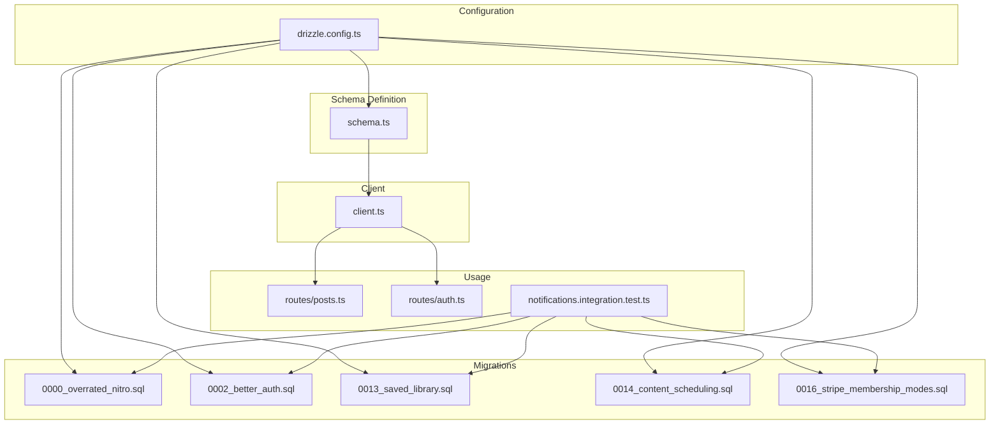
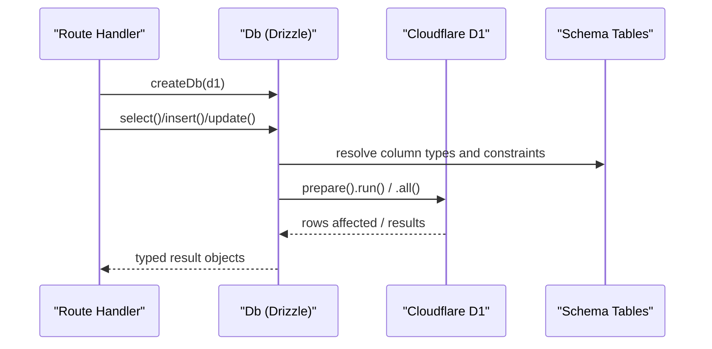
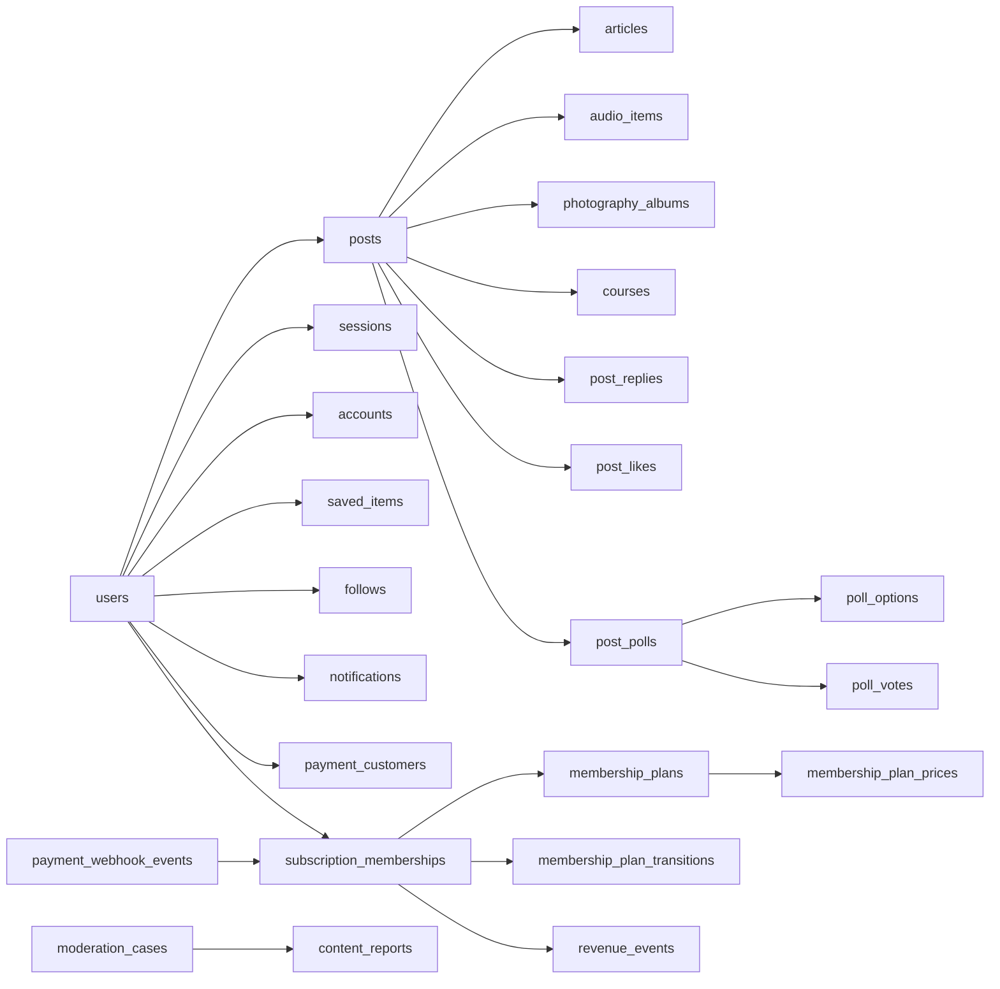

# Database Layer

<cite>
**Referenced Files in This Document**
- [drizzle.config.ts](file://drizzle.config.ts)
- [schema.ts](file://src/worker/db/schema.ts)
- [client.ts](file://src/worker/db/client.ts)
- [0000_overrated_nitro.sql](file://drizzle/0000_overrated_nitro.sql)
- [0002_better_auth.sql](file://drizzle/0002_better_auth.sql)
- [0013_saved_library.sql](file://drizzle/0013_saved_library.sql)
- [0014_content_scheduling.sql](file://drizzle/0014_content_scheduling.sql)
- [0016_stripe_membership_modes.sql](file://drizzle/0016_stripe_membership_modes.sql)
- [posts.ts](file://src/worker/routes/posts.ts)
- [auth.ts](file://src/worker/routes/auth.ts)
- [notifications.integration.test.ts](file://src/worker/routes/notifications.integration.test.ts)
</cite>

## Table of Contents
1. [Introduction](#introduction)
2. [Project Structure](#project-structure)
3. [Core Components](#core-components)
4. [Architecture Overview](#architecture-overview)
5. [Detailed Component Analysis](#detailed-component-analysis)
6. [Dependency Analysis](#dependency-analysis)
7. [Performance Considerations](#performance-considerations)
8. [Troubleshooting Guide](#troubleshooting-guide)
9. [Conclusion](#conclusion)
10. [Appendices](#appendices)

## Introduction
This document provides comprehensive data model documentation for the Drizzle ORM database layer used by the application. It covers entity relationships, field definitions, and data types across all schema models; primary and foreign keys; indexes and constraints; type-safe query patterns with TypeScript integration; database connection management; migration strategies; schema evolution workflows; common query patterns; transaction handling; performance optimization techniques; data validation rules; business constraints; referential integrity; and guidance for efficient queries in serverless environments to avoid N+1 problems.

## Project Structure
The database layer is implemented using Drizzle ORM with SQLite (D1). The schema is defined in a single TypeScript file that exports table definitions and inferred TypeScript types. A small client module creates a typed Drizzle instance bound to Cloudflare D1. Migrations are stored as SQL files generated by Drizzle Kit and applied via tests and likely deployment scripts.



**Diagram sources**
- [schema.ts:1-978](file://src/worker/db/schema.ts#L1-L978)
- [client.ts:1-9](file://src/worker/db/client.ts#L1-L9)
- [drizzle.config.ts:1-14](file://drizzle.config.ts#L1-L14)
- [0000_overrated_nitro.sql:1-36](file://drizzle/0000_overrated_nitro.sql#L1-L36)
- [0002_better_auth.sql:1-79](file://drizzle/0002_better_auth.sql#L1-L79)
- [0013_saved_library.sql:1-11](file://drizzle/0013_saved_library.sql#L1-L11)
- [0014_content_scheduling.sql:1-47](file://drizzle/0014_content_scheduling.sql#L1-L47)
- [0016_stripe_membership_modes.sql:1-85](file://drizzle/0016_stripe_membership_modes.sql#L1-L85)
- [posts.ts:1-200](file://src/worker/routes/posts.ts#L1-L200)
- [auth.ts:1-200](file://src/worker/routes/auth.ts#L1-L200)
- [notifications.integration.test.ts:1-25](file://src/worker/routes/notifications.integration.test.ts#L1-L25)

**Section sources**
- [drizzle.config.ts:1-14](file://drizzle.config.ts#L1-L14)
- [schema.ts:1-978](file://src/worker/db/schema.ts#L1-L978)
- [client.ts:1-9](file://src/worker/db/client.ts#L1-L9)

## Core Components
- Schema definition: All tables are declared with Drizzle’s sqliteTable, including columns, defaults, timestamps, enums, and indexes. Inferred TypeScript types are exported for type safety.
- Client: A factory function wraps a D1Database instance with schema to produce a strongly-typed Db object used throughout routes and libraries.
- Configuration: Drizzle Kit configuration points to the schema file, output directory, dialect (sqlite), driver (d1-http), and credentials for Cloudflare D1.

Key responsibilities:
- Type inference: $inferSelect and $inferInsert provide compile-time guarantees for reads and writes.
- Indexing strategy: Composite and partial indexes support high-performance queries typical in serverless workloads.
- Referential integrity: Foreign keys enforce cascading deletes or set-null semantics where appropriate.

**Section sources**
- [schema.ts:1-978](file://src/worker/db/schema.ts#L1-L978)
- [client.ts:1-9](file://src/worker/db/client.ts#L1-L9)
- [drizzle.config.ts:1-14](file://drizzle.config.ts#L1-L14)

## Architecture Overview
The database architecture centers on a single SQLite database backed by Cloudflare D1. Drizzle ORM provides a type-safe query API. Routes and libraries create a Db instance per request and execute queries against the schema. Migrations are versioned SQL files that evolve the schema over time.



**Diagram sources**
- [client.ts:1-9](file://src/worker/db/client.ts#L1-L9)
- [schema.ts:1-978](file://src/worker/db/schema.ts#L1-L978)
- [posts.ts:1-200](file://src/worker/routes/posts.ts#L1-L200)
- [auth.ts:1-200](file://src/worker/routes/auth.ts#L1-L200)

## Detailed Component Analysis

### Users and Authentication
- users: Core identity table with unique email and username, role enumeration, account status, timestamps, and an index on accountStatus.
- session, account, verification: Better Auth integration tables for sessions, OAuth accounts, and verification tokens with appropriate indexes and timestamps.

Relationships:
- session.user_id -> users.id (cascade delete)
- account.user_id -> users.id (cascade delete)

Indexes:
- users.email, users.username (unique)
- session.token (unique), session.user_id
- account.user_id
- verification.identifier

Constraints:
- Enumerations for roles, statuses, and modes ensure valid states.
- Timestamps use integer mode with Unix epoch seconds or milliseconds depending on precision needs.

TypeScript integration:
- User, Session, Account, Verification types are inferred from schema for type-safe operations.

**Section sources**
- [schema.ts:5-32](file://src/worker/db/schema.ts#L5-L32)
- [schema.ts:108-148](file://src/worker/db/schema.ts#L108-L148)
- [schema.ts:151-165](file://src/worker/db/schema.ts#L151-L165)
- [0002_better_auth.sql:1-79](file://drizzle/0002_better_auth.sql#L1-L79)

### Posts and Content Types
- posts: Central content entity with kind enumeration (post, article, audio, photography, course), moderation fields, publishedAt, and multiple composite indexes for author, kind, and moderation queries.
- articles, audioCollections, audioItems, photographyAlbums, photographyPhotos, courses: Specialized content entities linked back to posts via post_id (unique one-to-one mapping enforced by unique constraint on post_id).

Relationships:
- articles.post_id -> posts.id (cascade)
- audioItems.post_id -> posts.id (cascade)
- photographyAlbums.post_id -> posts.id (cascade)
- courses.post_id -> posts.id (cascade)

Indexes:
- posts.author_created_idx, posts.kind_created_idx, posts.moderation_author_idx, posts.kind_published_idx
- Unique indexes on creator/slug combinations for collections and items
- Status/publishedAt indexes for efficient listing

Business constraints:
- Moderation status and reasons track visibility and auditability.
- PublishedAt derived from content-specific entities when applicable.

TypeScript integration:
- Post, Article, AudioCollection, AudioItem, PhotographyAlbum, PhotographyPhoto, Course types inferred.

**Section sources**
- [schema.ts:168-188](file://src/worker/db/schema.ts#L168-L188)
- [schema.ts:211-231](file://src/worker/db/schema.ts#L211-L231)
- [schema.ts:234-291](file://src/worker/db/schema.ts#L234-L291)
- [schema.ts:294-348](file://src/worker/db/schema.ts#L294-L348)
- [schema.ts:351-370](file://src/worker/db/schema.ts#L351-L370)
- [0014_content_scheduling.sql:1-47](file://drizzle/0014_content_scheduling.sql#L1-L47)

### Discussions, Likes, and Interactions
- postReplies: Threaded replies with parentReplyId self-reference, moderation fields, and indexes for post timeline and moderation queries.
- replyAttachments: Media attachments per reply.
- postLikes, replyLikes: Many-to-many interactions with user and content, with user-level indexes.

Relationships:
- postReplies.post_id -> posts.id (cascade)
- postReplies.parent_reply_id -> postReplies.id (self-reference)
- postLikes.post_id -> posts.id (cascade)
- replyLikes.reply_id -> postReplies.id (cascade)

Indexes:
- post_replies_post_created_idx, post_replies_parent_idx, post_replies_moderation_post_idx, post_replies_post_deleted_created_idx
- post_likes_user_idx, reply_likes_user_idx

TypeScript integration:
- PostReply, ReplyAttachment, PostLike, ReplyLike types inferred.

**Section sources**
- [schema.ts:466-507](file://src/worker/db/schema.ts#L466-L507)
- [schema.ts:509-529](file://src/worker/db/schema.ts#L509-L529)

### Saved Library
- saved_items: Many-to-many between users and posts with saved timestamp and composite primary key.

Relationships:
- saved_items.user_id -> users.id (cascade)
- saved_items.post_id -> posts.id (cascade)

Indexes:
- saved_items_user_saved_idx supports user-centric timelines.

TypeScript integration:
- SavedItem type inferred.

**Section sources**
- [schema.ts:532-539](file://src/worker/db/schema.ts#L532-L539)
- [0013_saved_library.sql:1-11](file://drizzle/0013_saved_library.sql#L1-L11)

### Polls
- postPolls: One poll per post (unique post_id).
- pollOptions: Ordered options per poll.
- pollVotes: One vote per user per poll with updated timestamps.

Relationships:
- postPolls.post_id -> posts.id (cascade)
- pollOptions.poll_id -> postPolls.id (cascade)
- pollVotes.poll_id -> postPolls.id (cascade)
- pollVotes.option_id -> pollOptions.id (cascade)

Indexes:
- poll_options_poll_position_idx, poll_votes_option_idx

TypeScript integration:
- PostPoll, PollOption, PollVote types inferred.

**Section sources**
- [schema.ts:542-580](file://src/worker/db/schema.ts#L542-L580)

### Follows
- follows: Self-referencing many-to-many relationship between users with composite primary key and follower/followee indexes.

Relationships:
- follows.follower_id -> users.id (cascade)
- follows.followee_id -> users.id (cascade)

Indexes:
- follows_follower_idx, follows_followee_idx

TypeScript integration:
- Follow type inferred.

**Section sources**
- [schema.ts:583-593](file://src/worker/db/schema.ts#L583-L593)
- [0000_overrated_nitro.sql:1-36](file://drizzle/0000_overrated_nitro.sql#L1-L36)

### Creator Applications and Moderation
- creatorApplications: Application records with status workflow and review metadata.
- moderationCases: Cases targeting posts, replies, or users with assignment and resolution tracking.
- contentReports: Reports tied to cases with reason enumeration.
- adminAuditLogs: Audit trail for admin actions.

Relationships:
- moderationCases.assigned_admin_id -> users.id (set null)
- moderationCases.resolved_by -> users.id (set null)
- contentReports.case_id -> moderationCases.id (cascade)
- contentReports.reporter_id -> users.id (cascade)
- adminAuditLogs.actor_id -> users.id (restrict)

Indexes:
- creator_applications_status_updated_idx
- moderation_cases_target_unique, moderation_cases_status_updated_idx
- content_reports_case_reporter_unique, content_reports_case_created_idx
- admin_audit_logs_created_idx, admin_audit_logs_actor_created_idx

TypeScript integration:
- CreatorApplication, ModerationCase, ContentReport, AdminAuditLog types inferred.

**Section sources**
- [schema.ts:596-623](file://src/worker/db/schema.ts#L596-L623)
- [schema.ts:626-667](file://src/worker/db/schema.ts#L626-L667)

### Creator Discovery and Profile Tabs
- discoveryCategories: Categories with slug uniqueness and active ordering.
- creatorCategories: Many-to-many linking creators to categories with display order.
- userCategoryInterest: User preferences for category interests.
- featuredCreators: Curated list with ordering and attribution.
- creatorProfileTabs: Per-creator tab visibility and ordering.

Relationships:
- creatorCategories.creator_id -> users.id (cascade)
- creatorCategories.category_id -> discoveryCategories.id (cascade)
- userCategoryInterest.user_id -> users.id (cascade)
- userCategoryInterest.category_id -> discoveryCategories.id (cascade)
- featuredCreators.creator_id -> users.id (cascade)
- creatorProfileTabs.creator_id -> users.id (cascade)

Indexes:
- discovery_categories_active_order_idx
- creator_categories_category_creator_idx, creator_categories_creator_order_idx
- user_category_interests_category_user_idx
- featured_creators_order_idx
- creator_profile_tabs_creator_order_idx

TypeScript integration:
- DiscoveryCategory, CreatorCategory, UserCategoryInterest, FeaturedCreator, CreatorProfileTab types inferred.

**Section sources**
- [schema.ts:64-105](file://src/worker/db/schema.ts#L64-L105)
- [schema.ts:46-61](file://src/worker/db/schema.ts#L46-L61)

### Courses and Lesson Progress
- courses: Course entity with slug uniqueness per creator and status/publishedAt indexing.
- courseModules: Ordered modules within a course.
- courseLessons: Lessons within modules with markdown content and status/publishedAt.
- courseAttachments: Attachments per lesson with upload state and ordering.
- courseLessonProgress: Completion tracking per user per lesson.

Relationships:
- courses.post_id -> posts.id (cascade)
- courseModules.course_id -> courses.id (cascade)
- courseLessons.course_id -> courses.id (cascade)
- courseLessons.module_id -> courseModules.id (cascade)
- courseAttachments.course_id -> courses.id (cascade)
- courseAttachments.lesson_id -> courseLessons.id (cascade)
- courseLessonProgress.lesson_id -> courseLessons.id (cascade)
- courseLessonProgress.user_id -> users.id (cascade)

Indexes:
- courses_creator_slug_unique, courses_creator_status_published_idx
- course_modules_course_order_idx
- course_lessons_module_order_idx, course_lessons_course_status_idx
- course_attachments_lesson_order_idx, course_attachments_course_status_idx
- course_progress_course_user_idx

TypeScript integration:
- Course, CourseModule, CourseLesson, CourseAttachment, CourseLessonProgress types inferred.

**Section sources**
- [schema.ts:351-446](file://src/worker/db/schema.ts#L351-L446)

### Notifications
- notifications: Event-driven notifications with deduplication via unique dedupe_key and rich categorization.
- notificationPreferences: Per-user email toggles.

Relationships:
- notifications.recipient_id -> users.id (cascade)
- notifications.actor_id -> users.id (set null)

Indexes:
- notifications_recipient_read_created_idx, notifications_recipient_created_idx, notifications_actor_idx

TypeScript integration:
- Notification, NewNotification, NotificationPreference types inferred.

**Section sources**
- [schema.ts:872-930](file://src/worker/db/schema.ts#L872-L930)

### Payments, Memberships, and Revenue
- membershipPlans: Plans with mode enumeration and revision tracking; provider product id added for Stripe integration.
- membershipPlanPrices: Prices per plan with interval, currency, and provider identifiers; partial unique index for active prices.
- paymentCustomers: Mapping users to provider customers.
- subscriptionMemberships: Subscriptions with access type, interval, status, and provider event tracking.
- membershipTrialClaims: One-time trial claims per creator-subscriber pair.
- membershipPlanTransitions: Async transitions for paid-mode changes with retry logic.
- revenueEvents: Immutable financial events with gross/fee/net amounts and provider invoice deduplication.
- paymentWebhookEvents: Webhook processing pipeline with status, attempts, and error tracking.

Relationships:
- membershipPlanPrices.plan_id -> membershipPlans.id (cascade)
- paymentCustomers.user_id -> users.id (cascade)
- subscriptionMemberships.creator_id -> users.id (cascade)
- subscriptionMemberships.subscriber_id -> users.id (cascade)
- subscriptionMemberships.plan_id -> membershipPlans.id (set null)
- subscriptionMemberships.plan_price_id -> membershipPlanPrices.id (set null)
- membershipTrialClaims.creator_id -> users.id (cascade)
- membershipTrialClaims.subscriber_id -> users.id (cascade)
- membershipTrialClaims.plan_id -> membershipPlans.id (set null)
- membershipPlanTransitions.plan_id -> membershipPlans.id (cascade)
- membershipPlanTransitions.membership_id -> subscriptionMemberships.id (cascade)
- revenueEvents.creator_id -> users.id (cascade)
- revenueEvents.subscriber_id -> users.id (set null)
- revenueEvents.membership_id -> subscriptionMemberships.id (set null)

Indexes:
- membership_plan_prices_active_interval_unique (partial), membership_plan_prices_provider_price_unique, membership_plan_prices_creator_idx, membership_plan_prices_provider_price_idx
- payment_customers_provider_customer_unique
- subscription_memberships_subscriber_creator_unique, subscription_memberships_creator_idx, subscription_memberships_subscriber_idx, subscription_memberships_provider_subscription_idx, subscription_memberships_checkout_idx, subscription_memberships_plan_price_idx
- membership_trial_claims_ends_idx
- membership_plan_transitions_membership_unique, membership_plan_transitions_due_idx
- revenue_events_creator_occurred_idx, revenue_events_provider_invoice_unique
- payment_webhook_events_status_claimed_idx

TypeScript integration:
- MembershipPlan, MembershipPlanPrice, PaymentCustomer, SubscriptionMembership, MembershipTrialClaim, MembershipPlanTransition, RevenueEvent, PaymentWebhookEvent types inferred.

**Section sources**
- [schema.ts:694-870](file://src/worker/db/schema.ts#L694-L870)
- [0016_stripe_membership_modes.sql:1-85](file://drizzle/0016_stripe_membership_modes.sql#L1-L85)

### Content Scheduling
- contentSchedules: Job queue for scheduled publishing with status, attempt tracking, and due-time indexing.

Relationships:
- contentSchedules.post_id -> posts.id (cascade)
- contentSchedules.creator_id -> users.id (cascade)

Indexes:
- content_schedules_due_idx, content_schedules_creator_status_idx

TypeScript integration:
- ContentSchedule type inferred.

**Section sources**
- [schema.ts:191-208](file://src/worker/db/schema.ts#L191-L208)
- [0014_content_scheduling.sql:1-47](file://drizzle/0014_content_scheduling.sql#L1-L47)

### Data Models Diagram
```mermaid
erDiagram
USERS {
text id PK
text email UK
text password_hash
integer email_verified
text role
text account_status
text suspension_reason
integer suspended_at
text suspended_by
text display_name
text username UK
text tagline
text avatar_url
text avatar_r2_key
text social_links
integer created_at
integer updated_at
}
SESSION {
text id PK
integer expires_at
text token UK
integer created_at
integer updated_at
text ip_address
text user_agent
text user_id FK
}
ACCOUNT {
text id PK
text account_id
text provider_id
text user_id FK
text access_token
text refresh_token
text id_token
integer access_token_expires_at
integer refresh_token_expires_at
text scope
text password
integer created_at
integer updated_at
}
VERIFICATION {
text id PK
text identifier
text value
integer expires_at
integer created_at
integer updated_at
}
POSTS {
text id PK
text author_id FK
text kind
text slug
text body
text moderation_status
text moderation_reason
integer moderated_at
text moderated_by
integer published_at
integer created_at
}
ARTICLES {
text post_id PK FK
text title
text excerpt
text markdown
text status
text cover_r2_key
text cover_file_name
text cover_content_type
integer cover_size_bytes
integer published_at
integer created_at
integer updated_at
}
AUDIO_COLLECTIONS {
text id PK
text creator_id FK
text kind
text slug
text title
text description
text status
text cover_r2_key
text cover_file_name
text cover_content_type
integer cover_size_bytes
integer release_date
integer created_at
integer updated_at
}
AUDIO_ITEMS {
text id PK
text collection_id FK
text post_id UK FK
text creator_id FK
text kind
text slug
text title
text description
text status
text audio_r2_key
text audio_file_name
text audio_content_type
integer audio_size_bytes
text cover_r2_key
text cover_file_name
text cover_content_type
integer cover_size_bytes
integer duration_seconds
integer display_order
integer published_at
integer created_at
integer updated_at
}
PHOTOGRAPHY_ALBUMS {
text id PK
text post_id UK FK
text creator_id FK
text slug
text title
text description
text status
integer downloads_enabled
integer shoot_date
text cover_photo_id
integer published_at
integer created_at
integer updated_at
}
PHOTOGRAPHY_PHOTOS {
text id PK
text album_id FK
text creator_id FK
text title
text caption
text alt_text
text status
text preview_r2_key
text preview_file_name
text preview_content_type
integer preview_size_bytes
text original_r2_key
text original_file_name
text original_content_type
integer original_size_bytes
integer original_download_enabled
integer width
integer height
integer display_order
integer created_at
integer updated_at
}
COURSES {
text id PK
text post_id UK FK
text creator_id FK
text slug
text title
text description
text status
integer published_at
integer created_at
integer updated_at
}
COURSE_MODULES {
text id PK
text course_id FK
text title
text description
integer display_order
integer created_at
integer updated_at
}
COURSE_LESSONS {
text id PK
text course_id FK
text module_id FK
text title
text summary
text markdown
text status
integer display_order
integer published_at
integer created_at
integer updated_at
}
COURSE_ATTACHMENTS {
text id PK
text course_id FK
text lesson_id FK
text uploader_id FK
text kind
text status
text r2_key UK
text r2_upload_id
text file_name
text content_type
integer size_bytes
integer display_order
integer created_at
integer updated_at
}
COURSE_LESSON_PROGRESS {
text course_id FK
text lesson_id FK
text user_id FK
integer completed_at
}
POST_ATTACHMENTS {
text id PK
text post_id FK
text uploader_id FK
text r2_key UK
text file_name
text content_type
integer size_bytes
integer display_order
integer created_at
}
POST_REPLIES {
text id PK
text post_id FK
text author_id FK
text parent_reply_id
text mentioned_user_id
text body
integer edited_at
integer deleted_at
text moderation_status
text moderation_reason
integer moderated_at
text moderated_by
integer created_at
integer updated_at
}
REPLY_ATTACHMENTS {
text id PK
text reply_id FK
text uploader_id FK
text r2_key UK
text file_name
text content_type
integer size_bytes
integer display_order
integer created_at
}
POST_LIKES {
text post_id FK
text user_id FK
integer created_at
}
REPLY_LIKES {
text reply_id FK
text user_id FK
integer created_at
}
SAVED_ITEMS {
text user_id FK
text post_id FK
integer saved_at
}
POST_POLLS {
text id PK
text post_id UK FK
text question
integer closes_at
integer created_at
}
POLL_OPTIONS {
text id PK
text poll_id FK
text text
integer position
integer created_at
}
POLL_VOTES {
text poll_id FK
text user_id FK
text option_id FK
integer created_at
integer updated_at
}
FOLLOWS {
text follower_id FK
text followee_id FK
integer created_at
}
CREATOR_APPLICATIONS {
text id PK
text user_id UK FK
text full_name
text address
text city
text country
text nid_number
text nid_document_r2_key
text social_links
text content_links
text status
text reviewed_by
integer reviewed_at
text decision_reason
text admin_note
integer resubmitted_at
integer created_at
integer updated_at
}
MODERATION_CASES {
text id PK
text target_type
text target_id
text status
text assigned_admin_id
text resolution_action
text resolution_note
text resolved_by
integer resolved_at
integer created_at
integer updated_at
}
CONTENT_REPORTS {
text id PK
text case_id FK
text reporter_id FK
text reason
text details
integer created_at
}
ADMIN_AUDIT_LOGS {
text id PK
text actor_id FK
text action
text target_type
text target_id
text reason
text metadata
integer created_at
}
MEMBERSHIP_PLANS {
text id PK
text creator_id UK FK
text name
text description
text currency
text mode
text provider_product_id
integer revision
integer paid_enabled
integer free_permanent_enabled
integer free_trial_enabled
integer free_trial_days
integer created_at
integer updated_at
}
MEMBERSHIP_PLAN_PRICES {
text id PK
text plan_id FK
text creator_id FK
text provider
text interval
integer amount_cents
text currency
text provider_product_id
text provider_price_id
integer active
integer created_at
integer updated_at
}
PAYMENT_CUSTOMERS {
text user_id FK
text provider
text provider_customer_id
integer created_at
}
SUBSCRIPTION_MEMBERSHIPS {
text id PK
text creator_id FK
text subscriber_id FK
text plan_id
text plan_price_id
text provider
text access_type
text interval
text status
text provider_subscription_id
text provider_checkout_session_id
text provider_customer_id
integer provider_event_created_at
integer current_period_start
integer current_period_end
integer trial_ends_at
integer cancel_at
integer canceled_at
integer created_at
integer updated_at
}
MEMBERSHIP_TRIAL_CLAIMS {
text creator_id FK
text subscriber_id FK
text plan_id
integer started_at
integer ends_at
}
MEMBERSHIP_PLAN_TRANSITIONS {
text id PK
text plan_id FK
text membership_id FK
text provider_subscription_id
text status
integer attempts
integer next_attempt_at
integer claimed_at
text last_error
integer created_at
integer updated_at
}
REVENUE_EVENTS {
text id PK
text creator_id FK
text subscriber_id
text membership_id
text provider
text provider_event_id
text provider_invoice_id
integer amount_gross_cents
integer amount_fee_cents
integer amount_net_cents
text currency
integer occurred_at
integer created_at
}
PAYMENT_WEBHOOK_EVENTS {
text id PK
text provider
text event_type
integer livemode
text status
integer event_created_at
integer attempts
integer claimed_at
text last_error
integer processed_at
}
NOTIFICATIONS {
text id PK
text recipient_id FK
text actor_id
text type
text category
text title
text body
text target_url
text entity_type
text entityId
text metadata
text dedupe_key UK
integer read_at
text email_status
text email_error
integer email_sent_at
integer created_at
}
NOTIFICATION_PREFERENCES {
text user_id PK FK
integer email_enabled
integer content_email_enabled
integer interaction_email_enabled
integer subscription_email_enabled
integer created_at
integer updated_at
}
USERS ||--o{ SESSION : "has many"
USERS ||--o{ ACCOUNT : "has many"
USERS ||--o{ POSTS : "author"
USERS ||--o{ FOLLOW : "follower"
USERS ||--o{ FOLLOW : "followee"
USERS ||--o{ SAVED_ITEMS : "saved"
USERS ||--o{ POLL_VOTES : "votes"
USERS ||--o{ COURSE_ATTACHMENTS : "uploads"
USERS ||--o{ REPLY_ATTACHMENTS : "uploads"
USERS ||--o{ POST_LIKES : "likes"
USERS ||--o{ REPLY_LIKES : "likes"
USERS ||--o{ NOTIFICATIONS : "recipient"
USERS ||--o{ NOTIFICATION_PREFERENCES : "preferences"
USERS ||--o{ PAYMENT_CUSTOMERS : "customers"
USERS ||--o{ SUBSCRIPTION_MEMBERSHIPS : "subscriber"
USERS ||--o{ MEMBERSHIP_TRIAL_CLAIMS : "claims"
USERS ||--o{ CREATOR_APPLICATIONS : "applications"
USERS ||--o{ MODERATION_CASES : "assigned/resolved"
USERS ||--o{ ADMIN_AUDIT_LOGS : "actor"
POSTS ||--|| ARTICLES : "one-to-one"
POSTS ||--|| AUDIO_ITEMS : "one-to-one"
POSTS ||--|| PHOTOGRAPHY_ALBUMS : "one-to-one"
POSTS ||--|| COURSES : "one-to-one"
POSTS ||--o{ POST_REPLIES : "replies"
POSTS ||--o{ POST_ATTACHMENTS : "attachments"
POSTS ||--o{ POST_LIKES : "likes"
POSTS ||--|| POST_POLLS : "polls"
AUDIO_COLLECTIONS ||--o{ AUDIO_ITEMS : "contains"
COURSES ||--o{ COURSE_MODULES : "modules"
COURSES ||--o{ COURSE_LESSONS : "lessons"
COURSES ||--o{ COURSE_ATTACHMENTS : "attachments"
COURSE_MODULES ||--o{ COURSE_LESSONS : "contains"
COURSE_LESSONS ||--o{ COURSE_ATTACHMENTS : "attachments"
COURSE_LESSONS ||--o{ COURSE_LESSON_PROGRESS : "progress"
POST_REPLIES ||--o{ REPLY_ATTACHMENTS : "attachments"
POST_REPLIES ||--o{ REPLY_LIKES : "likes"
POST_REPLIES ||--o{ POST_REPLIES : "parent-child"
POST_POLLS ||--o{ POLL_OPTIONS : "options"
POST_POLLS ||--o{ POLL_VOTES : "votes"
MEMBERSHIP_PLANS ||--o{ MEMBERSHIP_PLAN_PRICES : "prices"
MEMBERSHIP_PLANS ||--o{ SUBSCRIPTION_MEMBERSHIPS : "plans"
MEMBERSHIP_PLANS ||--o{ MEMBERSHIP_TRIAL_CLAIMS : "claims"
MEMBERSHIP_PLANS ||--o{ MEMBERSHIP_PLAN_TRANSITIONS : "transitions"
SUBSCRIPTION_MEMBERSHIPS ||--o{ REVENUE_EVENTS : "events"
SUBSCRIPTION_MEMBERSHIPS ||--o{ MEMBERSHIP_PLAN_TRANSITIONS : "transitions"
MODERATION_CASES ||--o{ CONTENT_REPORTS : "reports"
```

**Diagram sources**
- [schema.ts:1-978](file://src/worker/db/schema.ts#L1-L978)

## Dependency Analysis
- Schema dependencies: Entities reference users and each other through foreign keys with cascade or set-null policies.
- Query dependencies: Routes import specific tables and use Drizzle operators (eq, and, or, desc, sql) to build queries.
- Migration dependencies: Tests load migrations sequentially to bootstrap the database for integration tests.



**Diagram sources**
- [schema.ts:1-978](file://src/worker/db/schema.ts#L1-L978)

**Section sources**
- [posts.ts:1-200](file://src/worker/routes/posts.ts#L1-L200)
- [auth.ts:1-200](file://src/worker/routes/auth.ts#L1-L200)
- [notifications.integration.test.ts:1-25](file://src/worker/routes/notifications.integration.test.ts#L1-L25)

## Performance Considerations
- Index usage:
  - Use composite indexes for frequent filter combinations (e.g., author + createdAt, kind + publishedAt, status + nextAttemptAt).
  - Partial indexes (e.g., active prices) reduce index size and improve selective queries.
- Avoid N+1 queries:
  - Prefer joins or batched selects to fetch related entities (e.g., author profile with posts, attachments with posts).
  - Use aliasing for self-referencing relationships (e.g., reply authors, mentioned users).
- Serverless optimization:
  - Minimize round trips by batching inserts/updates where possible.
  - Leverage unique constraints to prevent retries and conflicts.
  - Keep transactions short and scoped to critical sections.
- Timezone and precision:
  - Use integer timestamps consistently; choose seconds vs milliseconds based on required precision.
  - Default functions compute timestamps at insert/update to avoid client drift.

[No sources needed since this section provides general guidance]

## Troubleshooting Guide
- Migration issues:
  - Ensure all migrations are applied in order during tests and deployments.
  - Validate SQL statements split by statement-breakpoint markers when applying raw migrations.
- Constraint violations:
  - Unique constraints on emails, usernames, slugs, and provider identifiers will cause errors if violated; handle conflicts gracefully.
  - Foreign key cascades can unexpectedly remove related data; verify onDelete behavior.
- Query performance:
  - Check explain plans for slow queries and add missing composite indexes.
  - Avoid selecting unnecessary columns to reduce payload sizes.
- Transaction handling:
  - Wrap multi-step operations (e.g., creating a post with attachments and scheduling) in transactions to maintain consistency.
  - Handle rollback scenarios for external service failures (e.g., R2 uploads, Stripe webhooks).

**Section sources**
- [notifications.integration.test.ts:1-25](file://src/worker/routes/notifications.integration.test.ts#L1-L25)
- [0000_overrated_nitro.sql:1-36](file://drizzle/0000_overrated_nitro.sql#L1-L36)
- [0002_better_auth.sql:1-79](file://drizzle/0002_better_auth.sql#L1-L79)
- [0013_saved_library.sql:1-11](file://drizzle/0013_saved_library.sql#L1-L11)
- [0014_content_scheduling.sql:1-47](file://drizzle/0014_content_scheduling.sql#L1-L47)
- [0016_stripe_membership_modes.sql:1-85](file://drizzle/0016_stripe_membership_modes.sql#L1-L85)

## Conclusion
The Drizzle ORM layer provides a robust, type-safe foundation for the application’s data model. The schema enforces strong referential integrity, enumerations, and well-planned indexes to support high-performance queries in serverless environments. By following the documented patterns—using the typed Db client, leveraging indexes, avoiding N+1 queries, and managing migrations carefully—you can maintain reliability and scalability as the system evolves.

[No sources needed since this section summarizes without analyzing specific files]

## Appendices

### Connection Management
- Create a typed Db instance per request using createDb(d1) to ensure isolation and proper resource lifecycle.
- Pass the Db instance into route handlers and library functions to centralize database access.

**Section sources**
- [client.ts:1-9](file://src/worker/db/client.ts#L1-L9)

### Migration Strategy
- Use Drizzle Kit configuration to generate migrations from schema changes.
- Apply migrations via SQL files in tests and deployment pipelines.
- Maintain backward compatibility with careful ALTER TABLE and data migration steps.

**Section sources**
- [drizzle.config.ts:1-14](file://drizzle.config.ts#L1-L14)
- [notifications.integration.test.ts:1-25](file://src/worker/routes/notifications.integration.test.ts#L1-L25)

### Common Query Patterns
- Select with filters and ordering:
  - Use eq, and, or, desc to construct precise queries.
  - Alias tables for self-references (e.g., reply authors, mentioned users).
- Insert with defaults and timestamps:
  - Rely on default functions for created_at and updated_at.
  - Use unique constraints to prevent duplicates.
- Batch operations:
  - Group related inserts/updates to minimize round trips.

**Section sources**
- [posts.ts:1-200](file://src/worker/routes/posts.ts#L1-L200)
- [auth.ts:1-200](file://src/worker/routes/auth.ts#L1-L200)

### Data Validation Rules and Business Constraints
- Enumerations:
  - Roles, statuses, kinds, intervals, providers, and categories are enforced at the schema level.
- Uniqueness:
  - Emails, usernames, slugs, provider identifiers, and dedupe keys ensure data integrity.
- Referential integrity:
  - Foreign keys with cascade or set-null preserve consistency across related entities.

**Section sources**
- [schema.ts:1-978](file://src/worker/db/schema.ts#L1-L978)