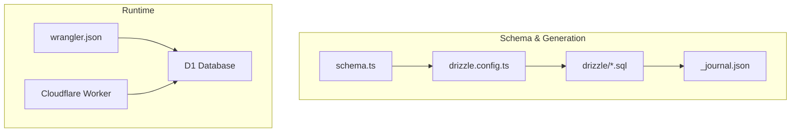
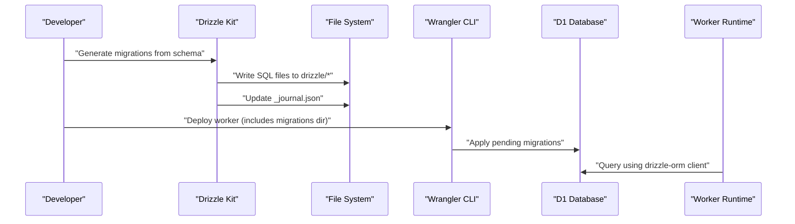
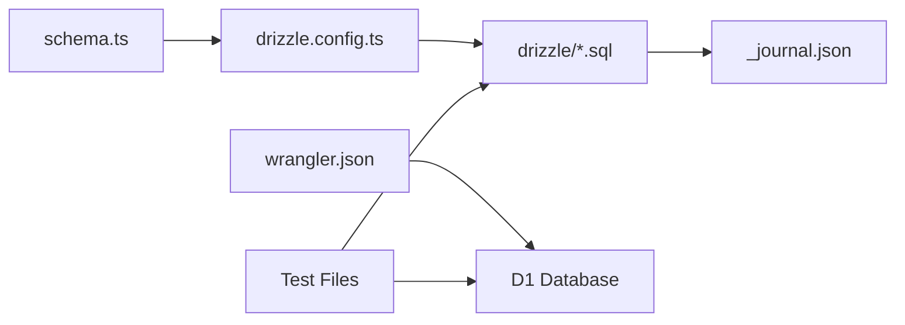

# Database Migrations

<cite>
**Referenced Files in This Document**
- [drizzle.config.ts](file://drizzle.config.ts)
- [wrangler.json](file://wrangler.json)
- [package.json](file://package.json)
- [schema.ts](file://src/worker/db/schema.ts)
- [client.ts](file://src/worker/db/client.ts)
- [_journal.json](file://drizzle/meta/_journal.json)
- [0000_overrated_nitro.sql](file://drizzle/0000_overrated_nitro.sql)
- [0016_stripe_membership_modes.sql](file://drizzle/0016_stripe_membership_modes.sql)
- [admin-migration.test.ts](file://src/worker/db/admin-migration.test.ts)
- [discovery-migration.test.ts](file://src/worker/db/discovery-migration.test.ts)
- [auth.integration.test.ts](file://src/worker/routes/auth.integration.test.ts)
</cite>

## Table of Contents
1. Introduction
2. Project Structure
3. Core Components
4. Architecture Overview
5. Detailed Component Analysis
6. Dependency Analysis
7. Performance Considerations
8. Troubleshooting Guide
9. Conclusion

## Introduction
This document explains the database migration system built with Drizzle for a Cloudflare Workers application backed by D1 (SQLite). It covers the end-to-end workflow from schema definition to SQL generation, versioning strategy, deployment automation, rollback procedures, and safe change practices. It also includes guidance on testing migrations and handling environment-specific configuration for local and production environments.

## Project Structure
The migration system centers around:
- A TypeScript schema that defines tables, indexes, and constraints.
- Drizzle Kit generating SQL migration files into a dedicated directory.
- Wrangler configuration pointing to the migrations directory for both local and production databases.
- Tests that apply migrations against an in-memory or test D1 instance to validate data preservation and integrity.

**Diagram sources**
- [schema.ts](file://src/worker/db/schema.ts)
- [drizzle.config.ts](file://drizzle.config.ts)
- [wrangler.json](file://wrangler.json)
- [_journal.json](file://drizzle/meta/_journal.json)

**Section sources**
- [drizzle.config.ts](file://drizzle.config.ts)
- [wrangler.json](file://wrangler.json)
- [package.json](file://package.json)

## Core Components
- Schema definition: Centralized table definitions with types, defaults, indexes, and foreign keys.
- Drizzle Kit configuration: Points to the schema, output directory, dialect, driver, and D1 credentials.
- Migration files: Versioned SQL statements generated by Drizzle Kit.
- Journal metadata: Tracks applied versions and breakpoints.
- Wrangler bindings: Maps environment variables and secrets; declares D1 database and migrations directory.
- Test harness: Applies migrations via Vitest and Cloudflare Workers test runtime to ensure correctness.

Key responsibilities:
- Generate idempotent, ordered SQL migrations from the schema.
- Track applied migrations via journal metadata.
- Provide environment-specific D1 connections for local and production.
- Validate migrations through tests that assert data preservation and constraint behavior.

**Section sources**
- [schema.ts](file://src/worker/db/schema.ts)
- [drizzle.config.ts](file://drizzle.config.ts)
- [_journal.json](file://drizzle/meta/_journal.json)
- [wrangler.json](file://wrangler.json)
- [admin-migration.test.ts](file://src/worker/db/admin-migration.test.ts)
- [discovery-migration.test.ts](file://src/worker/db/discovery-migration.test.ts)

## Architecture Overview
The migration architecture integrates schema-driven generation with Cloudflare’s D1 runtime.

**Diagram sources**
- [drizzle.config.ts](file://drizzle.config.ts)
- [wrangler.json](file://wrangler.json)
- [client.ts](file://src/worker/db/client.ts)

## Detailed Component Analysis

### Schema Definition and Types
- The schema file defines all tables, columns, constraints, indexes, and relationships.
- Timestamps use Unix epoch values with appropriate modes for seconds or milliseconds.
- Enums are represented as text fields with CHECK constraints where applicable.
- Foreign keys enforce referential integrity with cascade behaviors.

Best practices reflected in the schema:
- Use unique indexes for business keys (e.g., slugs, provider IDs).
- Add composite indexes for common query patterns.
- Keep default values explicit and consistent.
- Separate concerns across tables to avoid over-normalization while preserving performance.

**Section sources**
- [schema.ts](file://src/worker/db/schema.ts)

### Drizzle Kit Configuration
- Specifies the schema path, output directory, SQLite dialect, and D1 HTTP driver.
- Credentials are sourced from environment variables for account ID, database ID, and token.
- Ensures generated SQL targets D1-compatible SQLite features.

Operational notes:
- Ensure environment variables are set before running Drizzle Kit commands.
- The driver selection affects how migrations interact with D1.

**Section sources**
- [drizzle.config.ts](file://drizzle.config.ts)

### Migration File Structure and Naming
- Migration files follow a numeric prefix pattern for ordering (e.g., 0000_..., 0001_...).
- Each file contains one or more SQL statements separated by a specific breakpoint marker used by tests and tooling.
- The journal tracks the latest version and metadata such as dialect and timestamps.

Naming conventions:
- Prefix with zero-padded sequential numbers to guarantee order.
- Include a descriptive tag after the underscore.

Breakpoint usage:
- Statements are split at a defined marker to allow granular execution in tests and tooling.

**Section sources**
- [0000_overrated_nitro.sql](file://drizzle/0000_overrated_nitro.sql)
- [0016_stripe_membership_modes.sql](file://drizzle/0016_stripe_membership_modes.sql)
- [_journal.json](file://drizzle/meta/_journal.json)

### SQL Generation Process
- Drizzle Kit reads the schema and generates SQL migration files into the configured output directory.
- Generated SQL reflects schema changes including CREATE TABLE, ALTER TABLE, INDEX creation, and data updates.
- The journal is updated to reflect the current state and version.

Workflow:
- Modify schema.ts.
- Run Drizzle Kit generate to produce new SQL migration files.
- Review generated SQL for safety and idempotency.
- Commit migration files and metadata.

**Section sources**
- [drizzle.config.ts](file://drizzle.config.ts)
- [0016_stripe_membership_modes.sql](file://drizzle/0016_stripe_membership_modes.sql)

### Environment-Specific Configurations
- Local development uses a local D1 database binding with a specified name and ID.
- Production environment overrides database name, ID, and other variables/secrets.
- Wrangler binds the migrations directory so deployments include the latest SQL files.

Environment considerations:
- Use separate D1 databases per environment.
- Store sensitive values as secrets in Wrangler for production.
- Ensure the correct environment flag is set during build/deploy.

**Section sources**
- [wrangler.json](file://wrangler.json)
- [package.json](file://package.json)

### Deployment Process for Cloudflare Workers
- Build the application and deploy using Wrangler.
- Wrangler applies pending migrations to the target D1 database based on the migrations directory.
- The worker runtime connects to D1 using the drizzle-orm client bound to the D1 instance.

Deployment steps:
- Set environment variables for D1 credentials when generating migrations locally.
- Build and deploy with the appropriate environment flag.
- Verify migrations applied successfully via logs or health checks.

**Section sources**
- [wrangler.json](file://wrangler.json)
- [client.ts](file://src/worker/db/client.ts)
- [package.json](file://package.json)

### Creating New Migrations
Recommended process:
- Update schema.ts with desired changes.
- Generate migrations using Drizzle Kit to create new SQL files.
- Inspect generated SQL for correctness and safety.
- Commit migration files and metadata.
- Deploy with Wrangler to apply changes to the target environment.

Guidelines:
- Keep migrations small and focused on a single change.
- Avoid destructive operations without backups or safeguards.
- Use conditional updates and safe defaults to preserve existing data.

**Section sources**
- [drizzle.config.ts](file://drizzle.config.ts)
- [0016_stripe_membership_modes.sql](file://drizzle/0016_stripe_membership_modes.sql)

### Rollback Procedures
- Drizzle-generated migrations are forward-only; there is no automatic rollback command.
- To roll back, create a new migration that reverses the previous changes.
- Ensure the reversal is idempotent and preserves data integrity.
- Apply the reversal migration in the same deployment cycle if needed.

Best practices:
- Always write a corresponding reverse migration.
- Test reversal scripts thoroughly in a staging environment.
- Coordinate rollbacks with feature flags or staged deployments.

**Section sources**
- [0016_stripe_membership_modes.sql](file://drizzle/0016_stripe_membership_modes.sql)

### Handling Schema Conflicts
Common conflicts and resolutions:
- Duplicate unique constraints: Adjust column names or remove conflicting constraints.
- Missing foreign key references: Ensure referenced tables exist and keys match types.
- Non-idempotent statements: Wrap changes with checks or use conditional logic.

Resolution strategies:
- Reorder migrations to satisfy dependencies.
- Split large migrations into smaller, atomic steps.
- Use temporary tables or staging columns to migrate data safely.

**Section sources**
- [schema.ts](file://src/worker/db/schema.ts)
- [0016_stripe_membership_modes.sql](file://drizzle/0016_stripe_membership_modes.sql)

### Data Preservation During Migrations
- Preserve existing records by avoiding destructive operations unless necessary.
- Use UPDATE statements with careful conditions to transform data safely.
- Maintain backward compatibility by keeping deprecated columns temporarily.

Examples from migrations:
- Adding new columns with defaults.
- Updating existing rows to populate new fields based on legacy data.
- Dropping indexes only after verifying queries are optimized.

**Section sources**
- [0016_stripe_membership_modes.sql](file://drizzle/0016_stripe_membership_modes.sql)

### Testing Migration Scripts
Tests apply migrations sequentially against a test D1 instance to verify:
- Data preservation across migrations.
- Constraint enforcement (unique, foreign keys).
- Correct seeding and cascading behavior.

Testing approach:
- Import raw SQL migration files.
- Split statements by the breakpoint marker.
- Execute each statement against env.DB in sequence.
- Assert expected outcomes and error cases.

**Section sources**
- [admin-migration.test.ts](file://src/worker/db/admin-migration.test.ts)
- [discovery-migration.test.ts](file://src/worker/db/discovery-migration.test.ts)
- [auth.integration.test.ts](file://src/worker/routes/auth.integration.test.ts)

### Best Practices for Safe Schema Changes
- Prefer additive changes (new columns, tables, indexes) over destructive ones.
- Use transactions where supported to ensure atomicity.
- Validate constraints before dropping legacy structures.
- Document assumptions and data transformations within migration comments.
- Run tests locally and in CI to catch issues early.

[No sources needed since this section provides general guidance]

## Dependency Analysis
Migrations depend on the schema definition and are applied via Wrangler to D1. Tests rely on the Cloudflare Workers test runtime to execute SQL statements.

**Diagram sources**
- [schema.ts](file://src/worker/db/schema.ts)
- [drizzle.config.ts](file://drizzle.config.ts)
- [wrangler.json](file://wrangler.json)
- [_journal.json](file://drizzle/meta/_journal.json)
- [admin-migration.test.ts](file://src/worker/db/admin-migration.test.ts)

**Section sources**
- [wrangler.json](file://wrangler.json)
- [drizzle.config.ts](file://drizzle.config.ts)
- [admin-migration.test.ts](file://src/worker/db/admin-migration.test.ts)

## Performance Considerations
- Index design: Ensure indexes align with frequent query patterns to minimize full table scans.
- Batch operations: Group related updates to reduce transaction overhead.
- Large data migrations: Consider chunking updates to avoid long-running transactions.
- Monitoring: Observe D1 query performance and adjust indexes accordingly.

[No sources needed since this section provides general guidance]

## Troubleshooting Guide
Common issues and resolutions:
- Migration fails due to missing dependencies: Check table and column existence order.
- Unique constraint violations: Verify data uniqueness before applying migrations.
- Environment variable misconfiguration: Ensure D1 credentials are correctly set for local and production.
- Breakpoint parsing errors: Confirm SQL statements are properly separated by the marker.

Debugging tips:
- Run tests locally to reproduce failures.
- Inspect journal metadata to confirm applied versions.
- Use Wrangler logs to trace deployment and migration steps.

**Section sources**
- [_journal.json](file://drizzle/meta/_journal.json)
- [wrangler.json](file://wrangler.json)
- [admin-migration.test.ts](file://src/worker/db/admin-migration.test.ts)

## Conclusion
The Drizzle-based migration system provides a robust, schema-driven approach to managing database changes in Cloudflare Workers with D1. By adhering to best practices—such as additive changes, comprehensive testing, and careful data preservation—you can maintain a reliable and scalable database evolution process. Proper environment configuration and deployment automation ensure consistency across local, staging, and production environments.

[No sources needed since this section summarizes without analyzing specific files]