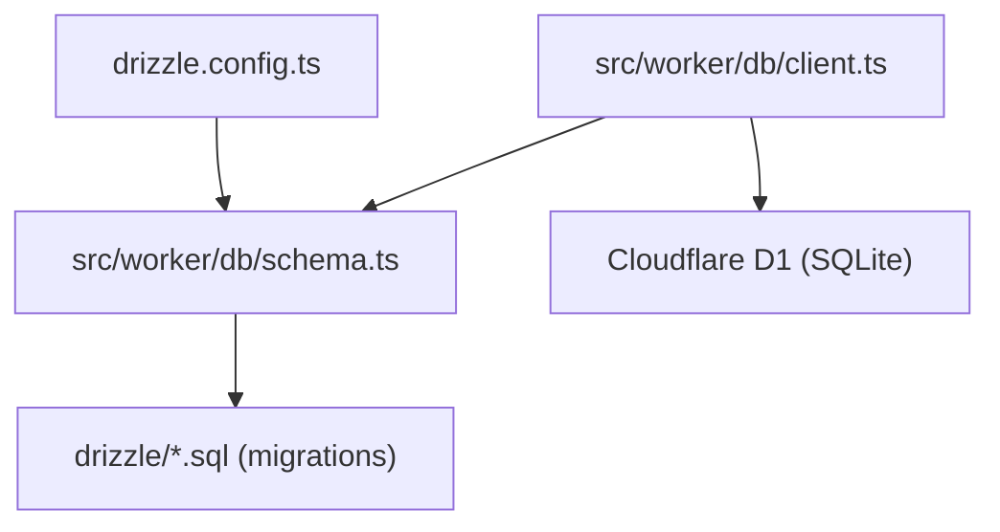
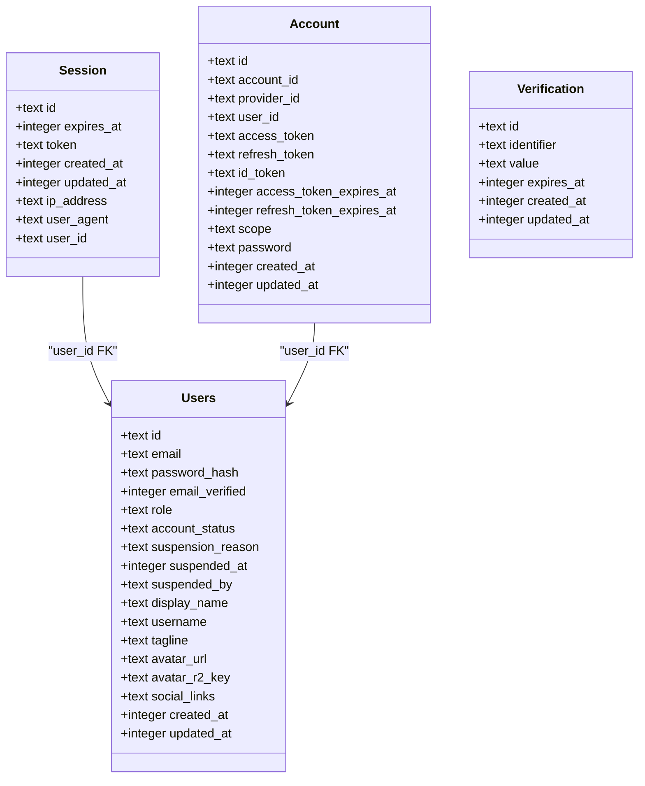
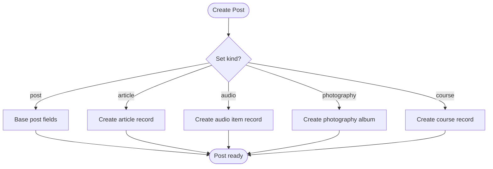
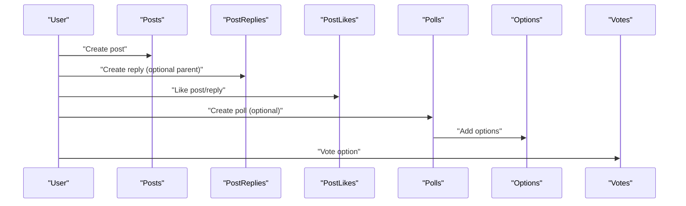
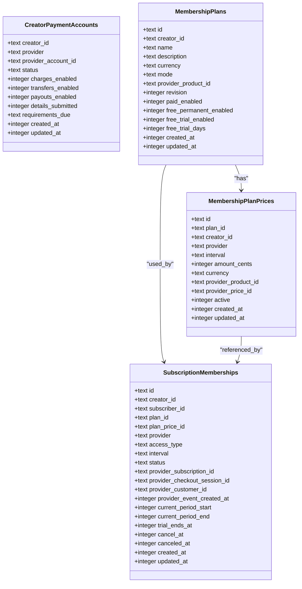
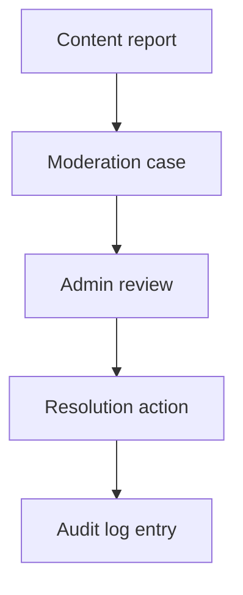
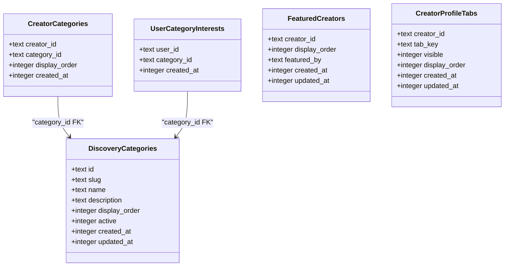
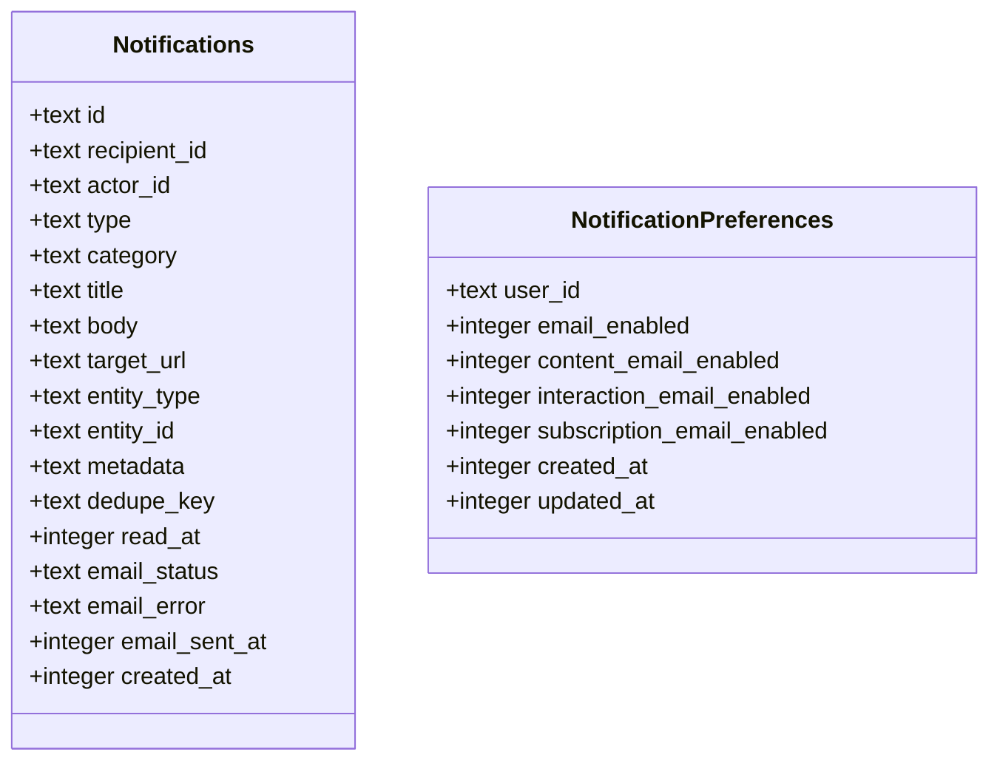
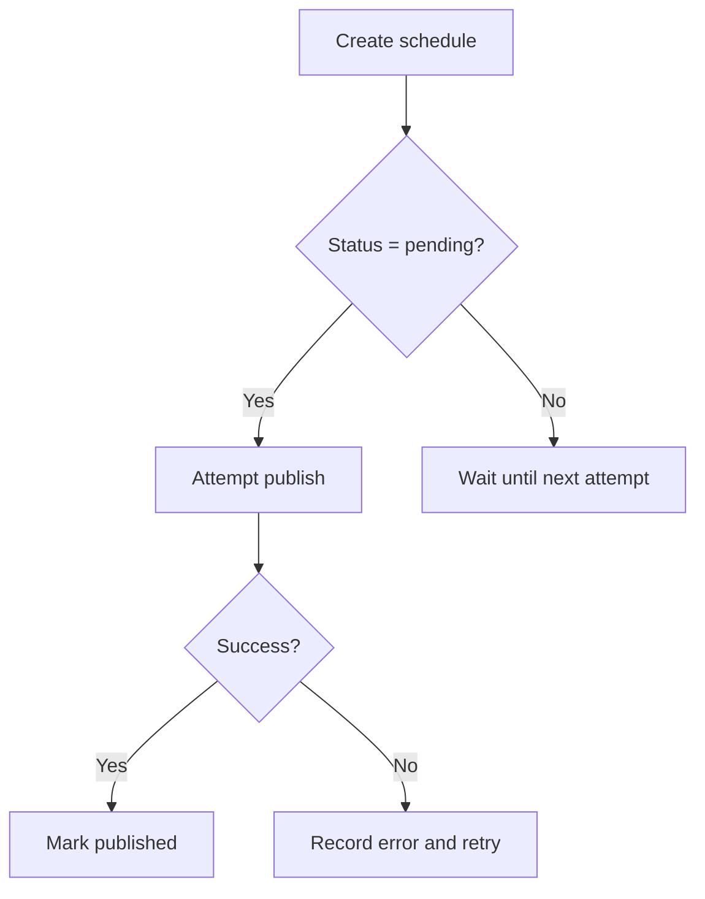
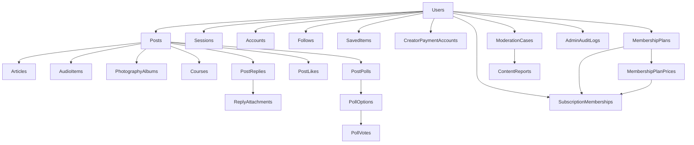

# Schema Design

<cite>
**Referenced Files in This Document**
- [drizzle.config.ts](file://drizzle.config.ts)
- [schema.ts](file://src/worker/db/schema.ts)
- [client.ts](file://src/worker/db/client.ts)
- [0002_better_auth.sql](file://drizzle/0002_better_auth.sql)
- [0003_creator_subscriptions.sql](file://drizzle/0003_creator_subscriptions.sql)
- [0004_feed_interactions.sql](file://drizzle/0004_feed_interactions.sql)
- [0005_articles.sql](file://drizzle/0005_articles.sql)
- [0006_creator_profile_tabs.sql](file://drizzle/0006_creator_profile_tabs.sql)
- [0007_audio.sql](file://drizzle/0007_audio.sql)
- [0008_photography.sql](file://drizzle/0008_photography.sql)
- [0009_notifications.sql](file://drizzle/0009_notifications.sql)
- [0010_courses.sql](file://drizzle/0010_courses.sql)
- [0011_admin_dashboard.sql](file://drizzle/0011_admin_dashboard.sql)
- [0012_threaded_discussions.sql](file://drizzle/0012_threaded_discussions.sql)
- [0013_saved_library.sql](file://drizzle/0013_saved_library.sql)
- [0014_content_scheduling.sql](file://drizzle/0014_content_scheduling.sql)
- [0015_creator_discovery.sql](file://drizzle/0015_creator_discovery.sql)
- [0016_stripe_membership_modes.sql](file://drizzle/0016_stripe_membership_modes.sql)
</cite>

## Table of Contents
1. [Introduction](#introduction)
2. [Project Structure](#project-structure)
3. [Core Components](#core-components)
4. [Architecture Overview](#architecture-overview)
5. [Detailed Component Analysis](#detailed-component-analysis)
6. [Dependency Analysis](#dependency-analysis)
7. [Performance Considerations](#performance-considerations)
8. [Troubleshooting Guide](#troubleshooting-guide)
9. [Conclusion](#conclusion)
10. [Appendices](#appendices)

## Introduction
This document provides a comprehensive data model documentation for the Drizzle ORM schema design used by the application. It covers entity relationships, field definitions, and data types across users, posts, content management (articles, audio, photography, courses), social features (replies, likes, polls, follows, saved library), monetization (plans, prices, subscriptions, payment accounts), and administrative/moderation tables. It also explains primary and foreign keys, indexes, constraints, referential integrity rules, type-safe TypeScript integration with Drizzle ORM, migration strategies, schema evolution workflows, and performance considerations specific to SQLite in serverless environments.

## Project Structure
The database schema is defined using Drizzle ORM’s SQLite dialect and managed via migrations under the drizzle directory. The runtime client connects to Cloudflare D1 through a driver configured in the Drizzle configuration file.



**Diagram sources**
- [drizzle.config.ts:1-14](file://drizzle.config.ts#L1-L14)
- [schema.ts:1-20](file://src/worker/db/schema.ts#L1-L20)
- [client.ts:1-9](file://src/worker/db/client.ts#L1-L9)

**Section sources**
- [drizzle.config.ts:1-14](file://drizzle.config.ts#L1-L14)
- [schema.ts:1-20](file://src/worker/db/schema.ts#L1-L20)
- [client.ts:1-9](file://src/worker/db/client.ts#L1-L9)

## Core Components
The schema centers around these core entities:
- Users and authentication sessions/accounts
- Posts as a polymorphic root for content types
- Content-specific extensions: articles, audio collections/items, photography albums/photos, courses/modules/lessons/attachments/progress
- Social interactions: replies, likes, polls/options/votes, follows, saved items
- Monetization: creator payment accounts, membership plans/prices, subscription memberships, webhook events, revenue events
- Administration and moderation: admin memberships, moderation cases, content reports, audit logs
- Discovery and profile tabs: categories, featured creators, user interests, profile tab visibility

Key characteristics:
- Primary keys are text identifiers generated at the application layer or via defaults.
- Foreign keys enforce referential integrity with cascade or set null semantics where appropriate.
- Timestamps use integer modes for seconds or milliseconds; updated_at fields auto-update on row changes.
- Extensive indexing supports common query patterns in serverless SQLite.

**Section sources**
- [schema.ts:1-800](file://src/worker/db/schema.ts#L1-L800)
- [0002_better_auth.sql:1-79](file://drizzle/0002_better_auth.sql#L1-L79)
- [0003_creator_subscriptions.sql:1-186](file://drizzle/0003_creator_subscriptions.sql#L1-L186)
- [0004_feed_interactions.sql:1-123](file://drizzle/0004_feed_interactions.sql#L1-L123)
- [0005_articles.sql:1-22](file://drizzle/0005_articles.sql#L1-L22)
- [0006_creator_profile_tabs.sql:1-13](file://drizzle/0006_creator_profile_tabs.sql#L1-L13)
- [0007_audio.sql:1-58](file://drizzle/0007_audio.sql#L1-L58)
- [0008_photography.sql:1-54](file://drizzle/0008_photography.sql#L1-L54)
- [0009_notifications.sql:1-41](file://drizzle/0009_notifications.sql#L1-L41)
- [0010_courses.sql:1-93](file://drizzle/0010_courses.sql#L1-L93)
- [0011_admin_dashboard.sql:1-133](file://drizzle/0011_admin_dashboard.sql#L1-L133)
- [0012_threaded_discussions.sql:1-6](file://drizzle/0012_threaded_discussions.sql#L1-L6)
- [0013_saved_library.sql:1-11](file://drizzle/0013_saved_library.sql#L1-L11)
- [0014_content_scheduling.sql:1-47](file://drizzle/0014_content_scheduling.sql#L1-L47)
- [0015_creator_discovery.sql:1-70](file://drizzle/0015_creator_discovery.sql#L1-L70)
- [0016_stripe_membership_modes.sql:1-85](file://drizzle/0016_stripe_membership_modes.sql#L1-L85)

## Architecture Overview
The data architecture uses a central posts table as a polymorphic anchor for different content kinds. Each content kind has a dedicated extension table linked by post_id. Users interact with posts and each other via replies, likes, polls, follows, and saved items. Monetization ties creators and subscribers through plans, prices, and subscriptions. Admin and moderation structures support governance and auditing.

```mermaid
erDiagram
USERS {
text id PK
text email UK
text password_hash
integer email_verified
text role
text account_status
text suspension_reason
integer suspended_at
text suspended_by
text display_name
text username UK
text tagline
text avatar_url
text avatar_r2_key
text social_links
integer created_at
integer updated_at
}
SESSION {
text id PK
integer expires_at
text token UK
integer created_at
integer updated_at
text ip_address
text user_agent
text user_id FK
}
ACCOUNT {
text id PK
text account_id
text provider_id
text user_id FK
text access_token
text refresh_token
text id_token
integer access_token_expires_at
integer refresh_token_expires_at
text scope
text password
integer created_at
integer updated_at
}
VERIFICATION {
text id PK
text identifier
text value
integer expires_at
integer created_at
integer updated_at
}
POSTS {
text id PK
text author_id FK
text kind
text slug
text body
text moderation_status
text moderation_reason
integer moderated_at
text moderated_by
integer published_at
integer created_at
}
ARTICLES {
text post_id PK FK
text title
text excerpt
text markdown
text status
text cover_r2_key
text cover_file_name
text cover_content_type
integer cover_size_bytes
integer published_at
integer created_at
integer updated_at
}
AUDIO_COLLECTIONS {
text id PK
text creator_id FK
text kind
text slug
text title
text description
text status
text cover_r2_key
text cover_file_name
text cover_content_type
integer cover_size_bytes
integer release_date
integer created_at
integer updated_at
}
AUDIO_ITEMS {
text id PK
text collection_id FK
text post_id UK FK
text creator_id FK
text kind
text slug
text title
text description
text status
text audio_r2_key
text audio_file_name
text audio_content_type
integer audio_size_bytes
text cover_r2_key
text cover_file_name
text cover_content_type
integer cover_size_bytes
integer duration_seconds
integer display_order
integer published_at
integer created_at
integer updated_at
}
PHOTOGRAPHY_ALBUMS {
text id PK
text post_id UK FK
text creator_id FK
text slug
text title
text description
text status
integer downloads_enabled
integer shoot_date
text cover_photo_id
integer published_at
integer created_at
integer updated_at
}
PHOTOGRAPHY_PHOTOS {
text id PK
text album_id FK
text creator_id FK
text title
text caption
text alt_text
text status
text preview_r2_key
text preview_file_name
text preview_content_type
integer preview_size_bytes
text original_r2_key
text original_file_name
text original_content_type
integer original_size_bytes
integer original_download_enabled
integer width
integer height
integer display_order
integer created_at
integer updated_at
}
COURSES {
text id PK
text post_id UK FK
text creator_id FK
text slug
text title
text description
text status
integer published_at
integer created_at
integer updated_at
}
COURSE_MODULES {
text id PK
text course_id FK
text title
text description
integer display_order
integer created_at
integer updated_at
}
COURSE_LESSONS {
text id PK
text course_id FK
text module_id FK
text title
text summary
text markdown
text status
integer display_order
integer published_at
integer created_at
integer updated_at
}
COURSE_ATTACHMENTS {
text id PK
text course_id FK
text lesson_id FK
text uploader_id FK
text kind
text status
text r2_key UK
text r2_upload_id
text file_name
text content_type
integer size_bytes
integer display_order
integer created_at
integer updated_at
}
COURSE_LESSON_PROGRESS {
text course_id FK
text lesson_id FK
text user_id FK
integer completed_at
}
POST_REPLIES {
text id PK
text post_id FK
text author_id FK
text parent_reply_id FK
text mentioned_user_id
text body
integer edited_at
integer deleted_at
text moderation_status
text moderation_reason
integer moderated_at
text moderated_by
integer created_at
integer updated_at
}
REPLY_ATTACHMENTS {
text id PK
text reply_id FK
text uploader_id FK
text r2_key UK
text file_name
text content_type
integer size_bytes
integer display_order
integer created_at
}
POST_LIKES {
text post_id FK
text user_id FK
integer created_at
}
REPLY_LIKES {
text reply_id FK
text user_id FK
integer created_at
}
POST_POLLS {
text id PK
text post_id UK FK
text question
integer closes_at
integer created_at
}
POLL_OPTIONS {
text id PK
text poll_id FK
text text
integer position
integer created_at
}
POLL_VOTES {
text poll_id FK
text user_id FK
text option_id FK
integer created_at
integer updated_at
}
SAVEd_ITEMS {
text user_id FK
text post_id FK
integer saved_at
}
FOLLOWS {
text follower_id FK
text followee_id FK
integer created_at
}
CREATOR_APPLICATIONS {
text id PK
text user_id UK FK
text full_name
text address
text city
text country
text nid_number
text nid_document_r2_key
text social_links
text content_links
text status
text reviewed_by
integer reviewed_at
text decision_reason
text admin_note
integer resubmitted_at
integer created_at
integer updated_at
}
MODERATION_CASES {
text id PK
text target_type
text target_id
text status
text assigned_admin_id
text resolution_action
text resolution_note
text resolved_by
integer resolved_at
integer created_at
integer updated_at
}
CONTENT_REPORTS {
text id PK
text case_id FK
text reporter_id FK
text reason
text details
integer created_at
}
ADMIN_AUDIT_LOGS {
text id PK
text actor_id FK
text action
text target_type
text target_id
text reason
text metadata
integer created_at
}
CREATOR_PAYMENT_ACCOUNTS {
text creator_id PK FK
text provider
text provider_account_id UK
text status
integer charges_enabled
integer transfers_enabled
integer payouts_enabled
integer details_submitted
text requirements_due
integer created_at
integer updated_at
}
MEMBERSHIP_PLANS {
text id PK
text creator_id UK FK
text name
text description
text currency
text mode
text provider_product_id
integer revision
integer paid_enabled
integer free_permanent_enabled
integer free_trial_enabled
integer free_trial_days
integer created_at
integer updated_at
}
MEMBERSHIP_PLAN_PRICES {
text id PK
text plan_id FK
text creator_id FK
text provider
text interval
integer amount_cents
text currency
text provider_product_id
text provider_price_id
integer active
integer created_at
integer updated_at
}
PAYMENT_CUSTOMERS {
text user_id FK
text provider
text provider_customer_id
integer created_at
}
SUBSCRIPTION_MEMBERSHIPS {
text id PK
text creator_id FK
text subscriber_id FK
text plan_id
text plan_price_id
text provider
text access_type
text interval
text status
text provider_subscription_id
text provider_checkout_session_id
text provider_customer_id
integer provider_event_created_at
integer current_period_start
integer current_period_end
integer trial_ends_at
integer cancel_at
integer canceled_at
integer created_at
integer updated_at
}
NOTIFICATIONS {
text id PK
text recipient_id FK
text actor_id
text type
text category
text title
text body
text target_url
text entity_type
text entity_id
text metadata
text dedupe_key UK
integer read_at
text email_status
text email_error
integer email_sent_at
integer created_at
}
DISCOVERY_CATEGORIES {
text id PK
text slug UK
text name
text description
integer display_order
integer active
integer created_at
integer updated_at
}
CREATOR_CATEGORIES {
text creator_id FK
text category_id FK
integer display_order
integer created_at
}
USER_CATEGORY_INTERESTS {
text user_id FK
text category_id FK
integer created_at
}
FEATURED_CREATORS {
text creator_id PK FK
integer display_order
text featured_by
integer created_at
integer updated_at
}
CONTENT_SCHEDULES {
text post_id PK FK
text creator_id FK
text status
integer scheduled_for
integer next_attempt_at
integer attempt_count
integer revision
integer processing_started_at
text last_error_code
text last_error_message
integer published_at
integer created_at
integer updated_at
}
USERS ||--o{ SESSION : "has"
USERS ||--o{ ACCOUNT : "has"
POSTS ||--|| ARTICLES : "extends"
POSTS ||--o{ AUDIO_ITEMS : "extends"
POSTS ||--|| PHOTOGRAPHY_ALBUMS : "extends"
POSTS ||--|| COURSES : "extends"
COURSES ||--o{ COURSE_MODULES : "contains"
COURSE_MODULES ||--o{ COURSE_LESSONS : "contains"
COURSE_LESSONS ||--o{ COURSE_ATTACHMENTS : "has"
COURSE_LESSONS ||--o{ COURSE_LESSON_PROGRESS : "tracked"
POSTS ||--o{ POST_REPLIES : "has"
POST_REPLIES ||--o{ REPLY_ATTACHMENTS : "has"
POSTS ||--o{ POST_LIKES : "has"
POST_REPLIES ||--o{ REPLY_LIKES : "has"
POSTS ||--|| POST_POLLS : "has"
POST_POLLS ||--o{ POLL_OPTIONS : "has"
POLL_OPTIONS ||--o{ POLL_VOTES : "has"
USERS ||--o{ SAVEd_ITEMS : "saves"
POSTS ||--o{ SAVEd_ITEMS : "saved_by"
USERS ||--o{ FOLLOWS : "follows"
USERS ||--o{ FOLLOWS : "followed_by"
USERS ||--o{ CREATOR_APPLICATIONS : "applies"
USERS ||--o{ MODERATION_CASES : "assigned/resolved"
MODERATION_CASES ||--o{ CONTENT_REPORTS : "has"
USERS ||--o{ ADMIN_AUDIT_LOGS : "audits"
USERS ||--o{ CREATOR_PAYMENT_ACCOUNTS : "owns"
USERS ||--o{ MEMBERSHIP_PLANS : "creates"
MEMBERSHIP_PLANS ||--o{ MEMBERSHIP_PLAN_PRICES : "has"
USERS ||--o{ PAYMENT_CUSTOMERS : "linked"
USERS ||--o{ SUBSCRIPTION_MEMBERSHIPS : "subscribes"
MEMBERSHIP_PLANS ||--o{ SUBSCRIPTION_MEMBERSHIPS : "used_by"
MEMBERSHIP_PLAN_PRICES ||--o{ SUBSCRIPTION_MEMBERSHIPS : "referenced_by"
USERS ||--o{ NOTIFICATIONS : "receives"
USERS ||--o{ DISCOVERY_CATEGORIES : "interests"
USERS ||--o{ CREATOR_CATEGORIES : "categorized"
USERS ||--o{ FEATURED_CREATORS : "featured"
POSTS ||--o{ CONTENT_SCHEDULES : "scheduled"
```

**Diagram sources**
- [schema.ts:1-800](file://src/worker/db/schema.ts#L1-L800)
- [0002_better_auth.sql:1-79](file://drizzle/0002_better_auth.sql#L1-L79)
- [0003_creator_subscriptions.sql:1-186](file://drizzle/0003_creator_subscriptions.sql#L1-L186)
- [0004_feed_interactions.sql:1-123](file://drizzle/0004_feed_interactions.sql#L1-L123)
- [0005_articles.sql:1-22](file://drizzle/0005_articles.sql#L1-L22)
- [0006_creator_profile_tabs.sql:1-13](file://drizzle/0006_creator_profile_tabs.sql#L1-L13)
- [0007_audio.sql:1-58](file://drizzle/0007_audio.sql#L1-L58)
- [0008_photography.sql:1-54](file://drizzle/0008_photography.sql#L1-L54)
- [0009_notifications.sql:1-41](file://drizzle/0009_notifications.sql#L1-L41)
- [0010_courses.sql:1-93](file://drizzle/0010_courses.sql#L1-L93)
- [0011_admin_dashboard.sql:1-133](file://drizzle/0011_admin_dashboard.sql#L1-L133)
- [0012_threaded_discussions.sql:1-6](file://drizzle/0012_threaded_discussions.sql#L1-L6)
- [0013_saved_library.sql:1-11](file://drizzle/0013_saved_library.sql#L1-L11)
- [0014_content_scheduling.sql:1-47](file://drizzle/0014_content_scheduling.sql#L1-L47)
- [0015_creator_discovery.sql:1-70](file://drizzle/0015_creator_discovery.sql#L1-L70)
- [0016_stripe_membership_modes.sql:1-85](file://drizzle/0016_stripe_membership_modes.sql#L1-L85)

## Detailed Component Analysis

### Users and Authentication
- Users store identity, roles, account status, and timestamps. Unique constraints on email and username ensure uniqueness. Indexes support filtering by account status.
- Sessions, accounts, and verification tables implement Better Auth integration with unique tokens and indexed lookups by user identifiers.



**Diagram sources**
- [schema.ts:1-33](file://src/worker/db/schema.ts#L1-L33)
- [schema.ts:107-166](file://src/worker/db/schema.ts#L107-L166)
- [0002_better_auth.sql:1-79](file://drizzle/0002_better_auth.sql#L1-L79)

**Section sources**
- [schema.ts:1-33](file://src/worker/db/schema.ts#L1-L33)
- [schema.ts:107-166](file://src/worker/db/schema.ts#L107-L166)
- [0002_better_auth.sql:1-79](file://drizzle/0002_better_auth.sql#L1-L79)

### Posts and Polymorphic Content Types
- Posts act as a polymorphic root with a kind discriminator. Extensions include articles, audio items, photography albums, and courses, each linked by post_id.
- Moderation fields allow tracking moderation state and reasons. Published_at supports scheduling and discovery queries.



**Diagram sources**
- [schema.ts:167-232](file://src/worker/db/schema.ts#L167-L232)
- [schema.ts:233-316](file://src/worker/db/schema.ts#L233-L316)
- [schema.ts:317-370](file://src/worker/db/schema.ts#L317-L370)
- [schema.ts:350-410](file://src/worker/db/schema.ts#L350-L410)
- [0005_articles.sql:1-22](file://drizzle/0005_articles.sql#L1-L22)
- [0007_audio.sql:1-58](file://drizzle/0007_audio.sql#L1-L58)
- [0008_photography.sql:1-54](file://drizzle/0008_photography.sql#L1-L54)
- [0010_courses.sql:1-93](file://drizzle/0010_courses.sql#L1-L93)

**Section sources**
- [schema.ts:167-232](file://src/worker/db/schema.ts#L167-L232)
- [schema.ts:233-316](file://src/worker/db/schema.ts#L233-L316)
- [schema.ts:317-370](file://src/worker/db/schema.ts#L317-L370)
- [schema.ts:350-410](file://src/worker/db/schema.ts#L350-L410)
- [0005_articles.sql:1-22](file://drizzle/0005_articles.sql#L1-L22)
- [0007_audio.sql:1-58](file://drizzle/0007_audio.sql#L1-L58)
- [0008_photography.sql:1-54](file://drizzle/0008_photography.sql#L1-L54)
- [0010_courses.sql:1-93](file://drizzle/0010_courses.sql#L1-L93)

### Social Features
- Replies form a threaded structure with parent references, moderation fields, and attachments. Likes are recorded per post and reply. Polls have options and votes with one vote per user per poll. Follows track relationships between users. Saved items enable personal libraries.



**Diagram sources**
- [schema.ts:465-530](file://src/worker/db/schema.ts#L465-L530)
- [schema.ts:531-581](file://src/worker/db/schema.ts#L531-L581)
- [schema.ts:582-594](file://src/worker/db/schema.ts#L582-L594)
- [schema.ts:531-539](file://src/worker/db/schema.ts#L531-L539)
- [0004_feed_interactions.sql:1-123](file://drizzle/0004_feed_interactions.sql#L1-L123)
- [0013_saved_library.sql:1-11](file://drizzle/0013_saved_library.sql#L1-L11)

**Section sources**
- [schema.ts:465-530](file://src/worker/db/schema.ts#L465-L530)
- [schema.ts:531-581](file://src/worker/db/schema.ts#L531-L581)
- [schema.ts:582-594](file://src/worker/db/schema.ts#L582-L594)
- [schema.ts:531-539](file://src/worker/db/schema.ts#L531-L539)
- [0004_feed_interactions.sql:1-123](file://drizzle/0004_feed_interactions.sql#L1-L123)
- [0013_saved_library.sql:1-11](file://drizzle/0013_saved_library.sql#L1-L11)

### Monetization
- Creator payment accounts link creators to Stripe. Membership plans define modes and pricing. Prices map to provider product/price IDs. Subscription memberships capture lifecycle states and periods. Webhook events and revenue events track external integrations.



**Diagram sources**
- [schema.ts:669-747](file://src/worker/db/schema.ts#L669-L747)
- [schema.ts:748-800](file://src/worker/db/schema.ts#L748-L800)
- [0003_creator_subscriptions.sql:1-186](file://drizzle/0003_creator_subscriptions.sql#L1-L186)
- [0016_stripe_membership_modes.sql:1-85](file://drizzle/0016_stripe_membership_modes.sql#L1-L85)

**Section sources**
- [schema.ts:669-747](file://src/worker/db/schema.ts#L669-L747)
- [schema.ts:748-800](file://src/worker/db/schema.ts#L748-L800)
- [0003_creator_subscriptions.sql:1-186](file://drizzle/0003_creator_subscriptions.sql#L1-L186)
- [0016_stripe_membership_modes.sql:1-85](file://drizzle/0016_stripe_membership_modes.sql#L1-L85)

### Administration and Moderation
- Admin memberships grant roles. Moderation cases track targets and resolutions. Content reports associate reporters with cases. Audit logs record admin actions.



**Diagram sources**
- [schema.ts:595-668](file://src/worker/db/schema.ts#L595-L668)
- [0011_admin_dashboard.sql:1-133](file://drizzle/0011_admin_dashboard.sql#L1-L133)

**Section sources**
- [schema.ts:595-668](file://src/worker/db/schema.ts#L595-L668)
- [0011_admin_dashboard.sql:1-133](file://drizzle/0011_admin_dashboard.sql#L1-L133)

### Discovery and Profile Tabs
- Categories define discoverable topics. Creators are categorized and can be featured. Users express interests. Profile tabs control visibility and order.



**Diagram sources**
- [schema.ts:45-106](file://src/worker/db/schema.ts#L45-L106)
- [0015_creator_discovery.sql:1-70](file://drizzle/0015_creator_discovery.sql#L1-L70)
- [0006_creator_profile_tabs.sql:1-13](file://drizzle/0006_creator_profile_tabs.sql#L1-L13)

**Section sources**
- [schema.ts:45-106](file://src/worker/db/schema.ts#L45-L106)
- [0015_creator_discovery.sql:1-70](file://drizzle/0015_creator_discovery.sql#L1-L70)
- [0006_creator_profile_tabs.sql:1-13](file://drizzle/0006_creator_profile_tabs.sql#L1-L13)

### Notifications
- Notifications store event payloads with deduplication keys and email delivery status. Preferences control email toggles.



**Diagram sources**
- [schema.ts:800-800](file://src/worker/db/schema.ts#L800-L800)
- [0009_notifications.sql:1-41](file://drizzle/0009_notifications.sql#L1-L41)

**Section sources**
- [0009_notifications.sql:1-41](file://drizzle/0009_notifications.sql#L1-L41)

### Content Scheduling
- Content schedules manage publishing workflows with retry logic and error tracking. They tie posts to creators and track attempts and outcomes.



**Diagram sources**
- [schema.ts:190-209](file://src/worker/db/schema.ts#L190-L209)
- [0014_content_scheduling.sql:1-47](file://drizzle/0014_content_scheduling.sql#L1-L47)

**Section sources**
- [schema.ts:190-209](file://src/worker/db/schema.ts#L190-L209)
- [0014_content_scheduling.sql:1-47](file://drizzle/0014_content_scheduling.sql#L1-L47)

## Dependency Analysis
The schema exhibits clear dependency chains:
- Users are referenced by most entities (sessions, accounts, posts, replies, likes, polls, follows, subscriptions).
- Posts serve as anchors for content extensions and social interactions.
- Monetization tables reference users and plans/prices, with subscription memberships linking creators and subscribers.
- Moderation and admin tables reference users and content targets.



**Diagram sources**
- [schema.ts:1-800](file://src/worker/db/schema.ts#L1-L800)

**Section sources**
- [schema.ts:1-800](file://src/worker/db/schema.ts#L1-L800)

## Performance Considerations
- Indexing strategy:
  - Composite indexes on frequently filtered columns (e.g., kind + created_at, creator_id + status + published_at).
  - Unique indexes on slugs and provider identifiers to prevent duplicates and speed up lookups.
  - Partial/filtered indexes for active records (e.g., active membership plan prices).
- Timestamp handling:
  - Use integer timestamps for seconds or milliseconds consistently; updated_at triggers ensure consistency.
- Serverless SQLite specifics:
  - Prefer single-table scans with selective WHERE clauses; avoid heavy joins when possible.
  - Use covering indexes for common queries (e.g., creator + status + published_at).
  - Batch writes where feasible to reduce transaction overhead.
- Query optimization patterns:
  - Filter by moderation_status and author_id for feed queries.
  - Use indexes on parent_reply_id for threaded discussions.
  - Leverage unique constraints for idempotent operations (e.g., likes, votes, saved items).

[No sources needed since this section provides general guidance]

## Troubleshooting Guide
Common issues and resolutions:
- Duplicate key errors:
  - Ensure unique constraints on slugs, provider IDs, and association tables are respected during inserts.
- Referential integrity violations:
  - Verify foreign key relationships before deletes; consider cascade behaviors.
- Migration conflicts:
  - Apply migrations in order; check journal and snapshots for consistency.
- Timezone and timestamp mismatches:
  - Confirm Unix epoch vs millisecond usage; align application code with schema modes.

**Section sources**
- [0002_better_auth.sql:1-79](file://drizzle/0002_better_auth.sql#L1-L79)
- [0003_creator_subscriptions.sql:1-186](file://drizzle/0003_creator_subscriptions.sql#L1-L186)
- [0004_feed_interactions.sql:1-123](file://drizzle/0004_feed_interactions.sql#L1-L123)
- [0016_stripe_membership_modes.sql:1-85](file://drizzle/0016_stripe_membership_modes.sql#L1-L85)

## Conclusion
The schema is designed for scalability and clarity in a serverless SQLite environment. Polymorphic content modeling, robust social features, and comprehensive monetization support provide a solid foundation. Careful indexing and constraint design optimize performance and maintain data integrity. Type-safe Drizzle ORM integration ensures consistent schemas across TypeScript layers.

[No sources needed since this section summarizes without analyzing specific files]

## Appendices

### Database Connection Configuration
- Drizzle configuration specifies SQLite dialect and D1 HTTP driver with credentials from environment variables.
- Client factory creates a typed Drizzle instance bound to the schema.

**Section sources**
- [drizzle.config.ts:1-14](file://drizzle.config.ts#L1-L14)
- [client.ts:1-9](file://src/worker/db/client.ts#L1-L9)

### Migration Strategies and Schema Evolution
- Migrations are versioned SQL files under drizzle, applied sequentially to evolve the schema.
- Backward-compatible changes include adding nullable columns, default values, and new indexes.
- Data migrations update existing rows to reflect new fields or modes.

**Section sources**
- [0005_articles.sql:1-22](file://drizzle/0005_articles.sql#L1-L22)
- [0014_content_scheduling.sql:1-47](file://drizzle/0014_content_scheduling.sql#L1-L47)
- [0016_stripe_membership_modes.sql:1-85](file://drizzle/0016_stripe_membership_modes.sql#L1-L85)

### Type-Safe TypeScript Integration
- Schema exports define Drizzle tables with strict types.
- Client returns a typed Db instance enabling type-safe queries.
- Enums and boolean modes map to TypeScript types for compile-time safety.

**Section sources**
- [schema.ts:1-20](file://src/worker/db/schema.ts#L1-L20)
- [client.ts:1-9](file://src/worker/db/client.ts#L1-L9)