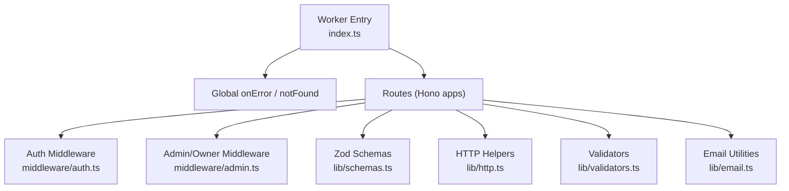
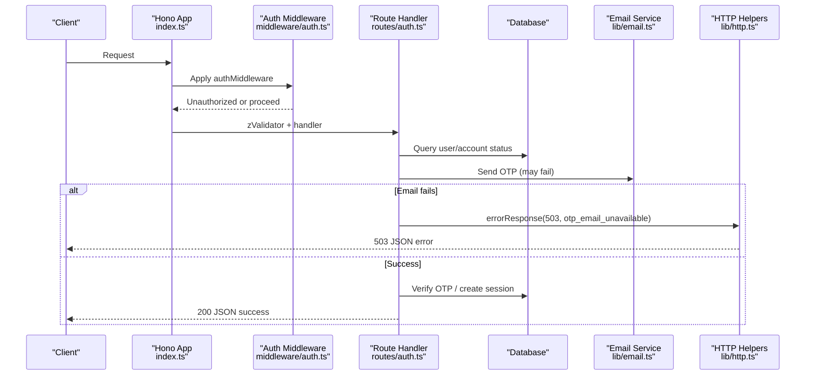
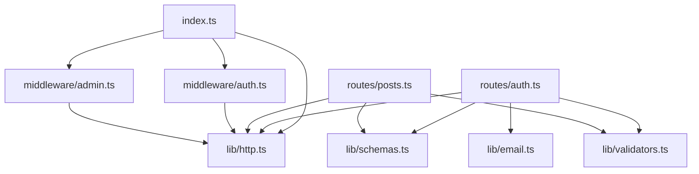

# Error Handling & Validation

<cite>
**Referenced Files in This Document**
- [index.ts](file://src/worker/index.ts)
- [http.ts](file://src/worker/lib/http.ts)
- [schemas.ts](file://src/worker/lib/schemas.ts)
- [validators.ts](file://src/worker/lib/validators.ts)
- [auth.ts](file://src/worker/middleware/auth.ts)
- [admin.ts](file://src/worker/middleware/admin.ts)
- [auth.ts](file://src/worker/routes/auth.ts)
- [posts.ts](file://src/worker/routes/posts.ts)
- [email.ts](file://src/worker/lib/email.ts)
- [http.test.ts](file://src/worker/lib/http.test.ts)
</cite>

## Table of Contents
1. [Introduction](#introduction)
2. [Project Structure](#project-structure)
3. [Core Components](#core-components)
4. [Architecture Overview](#architecture-overview)
5. [Detailed Component Analysis](#detailed-component-analysis)
6. [Dependency Analysis](#dependency-analysis)
7. [Performance Considerations](#performance-considerations)
8. [Troubleshooting Guide](#troubleshooting-guide)
9. [Conclusion](#conclusion)

## Introduction
This document explains the error handling and validation system used by the Cloudflare Workers backend. It covers centralized error responses, custom error codes, Zod-based input validation, parameter sanitization, business rule enforcement, middleware-driven cross-cutting concerns, and security considerations. It also provides guidance on debugging, error tracking, and production monitoring strategies tailored for Cloudflare Workers.

## Project Structure
The error handling and validation system is implemented across a small set of focused modules:
- Centralized HTTP utilities define a consistent error envelope and helper functions.
- Zod schemas define strict input contracts for API payloads and parameters.
- Lightweight validators provide additional utility checks and sanitization helpers.
- Hono middleware enforces authentication, authorization, and role-based access.
- Routes integrate validation and error handling consistently using shared utilities.
- The application entry configures global error and not-found handlers.

**Diagram sources**
- [index.ts:24-60](file://src/worker/index.ts#L24-L60)
- [auth.ts:23-50](file://src/worker/middleware/auth.ts#L23-L50)
- [admin.ts:5-13](file://src/worker/middleware/admin.ts#L5-L13)
- [schemas.ts:1-221](file://src/worker/lib/schemas.ts#L1-L221)
- [http.ts:23-75](file://src/worker/lib/http.ts#L23-L75)
- [validators.ts:13-94](file://src/worker/lib/validators.ts#L13-L94)
- [email.ts:27-55](file://src/worker/lib/email.ts#L27-L55)

**Section sources**
- [index.ts:24-60](file://src/worker/index.ts#L24-L60)

## Core Components
- Centralized error response format: All errors are returned as a JSON object with an error envelope containing code, message, and optional details.
- Validation integration: Zod schemas are enforced via a validator hook that converts validation failures into standardized 422 responses.
- Middleware: Authentication and authorization are enforced through Hono middleware, returning appropriate status codes and messages.
- Route-level handling: Each route uses shared helpers to return consistent error responses and handle domain-specific cases.

Key responsibilities:
- lib/http.ts: Defines ErrorCode types and helper functions for consistent error responses; includes a Zod hook for validation errors.
- lib/schemas.ts: Defines Zod schemas for all request bodies and parameters.
- lib/validators.ts: Provides simple boolean validators and sanitization helpers.
- middleware/auth.ts and middleware/admin.ts: Enforce session validity, account status, and role-based access.
- routes/auth.ts and routes/posts.ts: Demonstrate end-to-end usage of validation, error handling, and business rules.

**Section sources**
- [http.ts:4-75](file://src/worker/lib/http.ts#L4-L75)
- [schemas.ts:1-221](file://src/worker/lib/schemas.ts#L1-L221)
- [validators.ts:13-94](file://src/worker/lib/validators.ts#L13-L94)
- [auth.ts:23-50](file://src/worker/middleware/auth.ts#L23-L50)
- [admin.ts:5-13](file://src/worker/middleware/admin.ts#L5-L13)
- [auth.ts:135-212](file://src/worker/routes/auth.ts#L135-L212)
- [posts.ts:121-170](file://src/worker/routes/posts.ts#L121-L170)

## Architecture Overview
The worker uses Hono for routing and middleware. Global error handling is configured at the app level. Routes compose middleware and use shared validation and error utilities.

**Diagram sources**
- [index.ts:47-50](file://src/worker/index.ts#L47-L50)
- [auth.ts:23-50](file://src/worker/middleware/auth.ts#L23-L50)
- [auth.ts:135-164](file://src/worker/routes/auth.ts#L135-L164)
- [email.ts:45-55](file://src/worker/lib/email.ts#L45-L55)
- [http.ts:23-43](file://src/worker/lib/http.ts#L23-L43)

## Detailed Component Analysis

### Centralized Error Responses and Codes
- Standard error envelope: All errors follow a consistent structure with code, message, and optional details.
- Helper functions: Convenience functions for common statuses like bad_request, unauthorized, forbidden, not_found, conflict, payload_too_large, unsupported_media_type, and internal_server_error.
- Validation errors: A dedicated function returns 422 with issues array from Zod.

Security and robustness:
- Avoids leaking stack traces or internal state to clients.
- Uses explicit error codes to enable client-side handling and analytics.

**Section sources**
- [http.ts:4-75](file://src/worker/lib/http.ts#L4-L75)
- [http.test.ts:7-41](file://src/worker/lib/http.test.ts#L7-L41)

### Input Validation with Zod Schemas
- Schemas cover emails, passwords, OTP requests/verifications, post creation, reply operations, polls, membership flows, profile settings, notifications, and creator applications.
- Custom refinements enforce business rules such as URL protocol constraints, uniqueness of tabs, and HTTPS-only links.
- Integration via @hono/zod-validator with a shared zodHook ensures consistent 422 responses.

Examples of schema categories:
- Authentication: emailSchema, passwordSchema, authOtpRequestSchema, authOtpVerifySchema.
- Content: postCreateSchema, replyCreateJsonSchema, replyUpdateSchema, pollVoteSchema.
- Settings: usernameSettingsSchema, profileSettingsSchema, profileTabsSettingsSchema, emailSettingsSchema, notificationPreferencesSchema.
- Business: creatorPlanUpdateSchema, membershipSubscribeSchema, customerPortalSchema, creatorApplicationFieldsSchema.

**Section sources**
- [schemas.ts:1-221](file://src/worker/lib/schemas.ts#L1-L221)
- [auth.ts:135-164](file://src/worker/routes/auth.ts#L135-L164)
- [auth.ts:168-212](file://src/worker/routes/auth.ts#L168-L212)

### Parameter Sanitization and Utility Validators
- Simple validators ensure safe inputs for emails, passwords, usernames, and URLs.
- Username generation sanitizes and randomizes suffixes to avoid collisions.
- URL validators enforce allowed protocols (https or http(s)) to prevent unsafe redirects.

Use cases:
- Preventing invalid characters in usernames.
- Ensuring only https URLs are accepted where required.
- Generating safe, unique identifiers derived from user-provided data.

**Section sources**
- [validators.ts:13-94](file://src/worker/lib/validators.ts#L13-L94)

### Middleware for Cross-Cutting Concerns
- Authentication middleware validates sessions and fetches user context, including role and account status. Suspended accounts receive a 403 response.
- Role-based middleware enforces subscriber vs creator roles and admin/owner permissions.
- These middlewares centralize security checks and reduce duplication across routes.

Error propagation:
- Unauthorized and forbidden responses are returned early, preventing downstream processing.
- Consistent error codes and messages aid client handling and monitoring.

**Section sources**
- [auth.ts:23-50](file://src/worker/middleware/auth.ts#L23-L50)
- [admin.ts:5-13](file://src/worker/middleware/admin.ts#L5-L13)

### Route-Level Error Handling and Business Rules
- Auth routes demonstrate OTP request/verify flows, including graceful degradation when email delivery fails (returns 503).
- Posts routes validate image uploads, media types, sizes, and poll options, returning appropriate 4xx codes for invalid inputs.
- Routes use shared helpers to maintain consistency and clarity.

Business rule examples:
- Account suspension blocks OTP flows.
- Image upload constraints enforce type, size, and count limits.
- Poll options must be valid JSON and within length/count bounds.

**Section sources**
- [auth.ts:135-164](file://src/worker/routes/auth.ts#L135-L164)
- [auth.ts:168-212](file://src/worker/routes/auth.ts#L168-L212)
- [posts.ts:121-170](file://src/worker/routes/posts.ts#L121-L170)

### Global Error and Not-Found Handling
- Global onError logs errors and returns a standardized 500 response.
- notFound distinguishes between API paths and static assets, returning appropriate 404 responses or proxying to assets.

Production considerations:
- Logging should be integrated with external observability platforms.
- Avoid exposing stack traces in production responses.

**Section sources**
- [index.ts:47-60](file://src/worker/index.ts#L47-L60)

### Error Propagation, Retry, and Graceful Degradation
- OTP email delivery failure triggers a 503 response after cleanup, allowing clients to retry later.
- Auth endpoint calls capture status codes and map them to meaningful error codes for clients.
- Graceful degradation ensures partial failures do not crash entire flows.

Example flow:
- If email service is unavailable, the system deletes temporary OTP data and returns a clear error.
- Clients can prompt users to retry after a delay.

**Section sources**
- [auth.ts:150-164](file://src/worker/routes/auth.ts#L150-L164)
- [auth.ts:190-212](file://src/worker/routes/auth.ts#L190-L212)

### Security Considerations
- Input validation: Strict Zod schemas and validators prevent malformed or malicious inputs.
- SQL injection prevention: Use parameterized queries via Drizzle ORM; avoid string concatenation in SQL.
- XSS protection: Escape or sanitize user-generated content before rendering; rely on frameworks’ built-in escaping where possible.
- URL safety: Enforce https protocol for sensitive links; validate and normalize URLs.
- Session and authorization: Enforce authentication and role checks via middleware.

Best practices:
- Always validate and sanitize inputs at the boundary.
- Use least privilege for database operations and external services.
- Log security-relevant events without sensitive data.

[No sources needed since this section provides general guidance]

### Debugging Techniques, Error Tracking, and Monitoring
- Centralized logging: Use console.error in global onError for unhandled exceptions; integrate with Cloudflare Logs or external observability tools.
- Structured error codes: Emit machine-readable codes for analytics and alerting.
- Health checks: Expose endpoints to verify dependencies (database, email, storage).
- Metrics: Track validation failures, rate-limited requests, and service availability.
- Tracing: Correlate requests across middleware, routes, and external calls using request IDs.

Cloudflare-specific tips:
- Use Wrangler’s local dev server to reproduce errors.
- Enable detailed logs during development; switch to structured logs in production.
- Monitor Worker metrics (CPU, memory, duration) and error rates.

[No sources needed since this section provides general guidance]

## Dependency Analysis
The following diagram shows how components depend on each other for error handling and validation.

**Diagram sources**
- [index.ts:24-60](file://src/worker/index.ts#L24-L60)
- [http.ts:23-75](file://src/worker/lib/http.ts#L23-L75)
- [auth.ts:23-50](file://src/worker/middleware/auth.ts#L23-L50)
- [admin.ts:5-13](file://src/worker/middleware/admin.ts#L5-L13)
- [auth.ts:135-212](file://src/worker/routes/auth.ts#L135-L212)
- [posts.ts:121-170](file://src/worker/routes/posts.ts#L121-L170)
- [schemas.ts:1-221](file://src/worker/lib/schemas.ts#L1-L221)
- [validators.ts:13-94](file://src/worker/lib/validators.ts#L13-L94)
- [email.ts:45-55](file://src/worker/lib/email.ts#L45-L55)

**Section sources**
- [index.ts:24-60](file://src/worker/index.ts#L24-L60)

## Performance Considerations
- Validation overhead: Keep schemas minimal and efficient; avoid expensive computations in validators.
- Early exits: Return errors quickly to reduce unnecessary work.
- External calls: Handle timeouts and retries carefully; avoid blocking critical paths.
- Memory usage: Be mindful of large payloads and file uploads; enforce size limits.
- Concurrency: Leverage Cloudflare Workers’ concurrency model; avoid long-running synchronous operations.

[No sources needed since this section provides general guidance]

## Troubleshooting Guide
Common issues and resolutions:
- Validation failures (422): Check Zod schema definitions and input payloads; review issues array in error details.
- Unauthorized (401): Ensure session headers are present and valid; verify cookie handling.
- Forbidden (403): Confirm user roles and account status; check middleware logic.
- Not found (404): Validate route paths and asset fallback behavior.
- Internal server error (500): Inspect global error logs; identify unhandled exceptions.

Debugging steps:
- Reproduce locally with Wrangler; inspect logs and responses.
- Add structured logging around critical sections.
- Use feature flags to isolate problematic changes.

**Section sources**
- [http.ts:23-75](file://src/worker/lib/http.ts#L23-L75)
- [index.ts:47-60](file://src/worker/index.ts#L47-L60)

## Conclusion
The error handling and validation system emphasizes consistency, security, and resilience. Centralized error responses, strict Zod schemas, and middleware-driven authentication/authorization ensure reliable operation. For production, integrate structured logging, metrics, and observability to monitor and troubleshoot effectively.

[No sources needed since this section summarizes without analyzing specific files]