# Administration Routes

<cite>
**Referenced Files in This Document**
- [admin.ts](file://src/worker/routes/admin.ts)
- [reports.ts](file://src/worker/routes/reports.ts)
- [admin.ts](file://src/worker/middleware/admin.ts)
- [auth.ts](file://src/worker/middleware/auth.ts)
- [admin.ts](file://src/worker/lib/admin.ts)
- [schema.ts](file://src/worker/db/schema.ts)
- [0011_admin_dashboard.sql](file://drizzle/0011_admin_dashboard.sql)
- [AdminPage.tsx](file://src/react-app/pages/AdminPage.tsx)
- [admin.ts](file://src/react-app/lib/admin.ts)
- [admin.tsx](file://src/react-app/routes/_authenticated/admin.tsx)
- [admin.index.tsx](file://src/react-app/routes/_authenticated/admin.index.tsx)
- [moderation.ts](file://src/worker/lib/moderation.ts)
</cite>

## Table of Contents
1. [Introduction](#introduction)
2. [Project Structure](#project-structure)
3. [Core Components](#core-components)
4. [Architecture Overview](#architecture-overview)
5. [Detailed Component Analysis](#detailed-component-analysis)
6. [Dependency Analysis](#dependency-analysis)
7. [Performance Considerations](#performance-considerations)
8. [Troubleshooting Guide](#troubleshooting-guide)
9. [Conclusion](#conclusion)
10. [Appendices](#appendices)

## Introduction
This document provides comprehensive documentation for the administrative route handlers that enable user moderation, content review, and platform analytics. It covers admin-only endpoints for user management, content approval workflows, reporting systems, role-based access control (RBAC), audit logging, bulk administration operations, moderation queues, content flagging, and platform health monitoring. Security considerations and data privacy compliance are addressed throughout.

## Project Structure
The administrative system is implemented as a set of Hono routes under the worker layer, protected by authentication and authorization middleware, with a React frontend providing an admin UI. Key areas:
- Worker routes: Admin endpoints for overview, health, applications, reports, users, discovery, audit log, and administrators.
- Middleware: Authentication and admin/owner role checks.
- Library utilities: Audit logging and moderation helpers.
- Database schema: Tables for users, admin memberships, moderation cases, content reports, and audit logs.
- Frontend: Admin pages and panels to interact with the API.

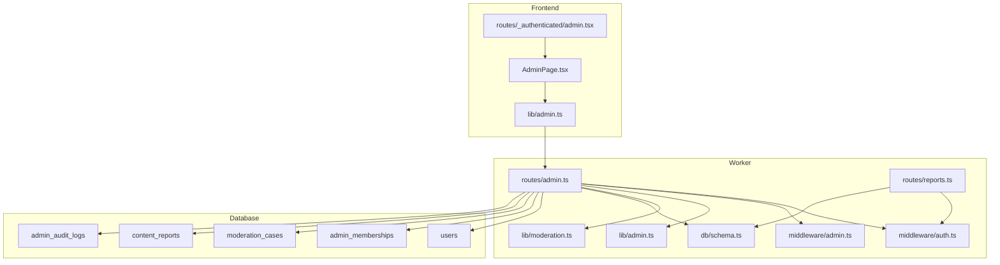

**Diagram sources**
- [admin.ts](file://src/worker/routes/admin.ts)
- [reports.ts](file://src/worker/routes/reports.ts)
- [auth.ts](file://src/worker/middleware/auth.ts)
- [admin.ts](file://src/worker/middleware/admin.ts)
- [admin.ts](file://src/worker/lib/admin.ts)
- [moderation.ts](file://src/worker/lib/moderation.ts)
- [schema.ts](file://src/worker/db/schema.ts)
- [AdminPage.tsx](file://src/react-app/pages/AdminPage.tsx)
- [admin.ts](file://src/react-app/lib/admin.ts)
- [admin.tsx](file://src/react-app/routes/_authenticated/admin.tsx)

**Section sources**
- [admin.ts](file://src/worker/routes/admin.ts)
- [reports.ts](file://src/worker/routes/reports.ts)
- [auth.ts](file://src/worker/middleware/auth.ts)
- [admin.ts](file://src/worker/middleware/admin.ts)
- [admin.ts](file://src/worker/lib/admin.ts)
- [schema.ts](file://src/worker/db/schema.ts)
- [AdminPage.tsx](file://src/react-app/pages/AdminPage.tsx)
- [admin.ts](file://src/react-app/lib/admin.ts)
- [admin.tsx](file://src/react-app/routes/_authenticated/admin.tsx)
- [admin.index.tsx](file://src/react-app/routes/_authenticated/admin.index.tsx)

## Core Components
- Admin routes: Provide endpoints for overview metrics, health diagnostics, creator application review, moderation case handling, user management, discovery category and featured creators management, audit log browsing, and administrator role management.
- Reports routes: Allow authenticated users to report posts, replies, or users; create or update moderation cases; prevent self-reporting and duplicate reports.
- Middleware: Enforce session authentication and admin/owner roles.
- Audit logging: Persist all administrative actions with actor, target, reason, and metadata; emit structured console events.
- Moderation helpers: Determine visibility of content based on moderation status and author account status.

Key responsibilities:
- RBAC: Owner vs moderator enforcement for sensitive operations.
- Data validation: Zod schemas for inputs across admin endpoints.
- Pagination and filtering: Consistent pagination helper and query filters for lists.
- Notifications: Create notifications for significant admin actions (approvals, rejections, suspensions, restorations).

**Section sources**
- [admin.ts](file://src/worker/routes/admin.ts)
- [reports.ts](file://src/worker/routes/reports.ts)
- [admin.ts](file://src/worker/middleware/admin.ts)
- [auth.ts](file://src/worker/middleware/auth.ts)
- [admin.ts](file://src/worker/lib/admin.ts)
- [moderation.ts](file://src/worker/lib/moderation.ts)

## Architecture Overview
The admin system follows a layered architecture:
- Frontend routes guard access to admin sections based on user adminRole.
- Client calls use typed helpers to call backend endpoints.
- Backend routes validate input, enforce RBAC, perform DB operations, write audit logs, and send notifications.
- Database tables model users, admin memberships, moderation cases, content reports, and audit logs.

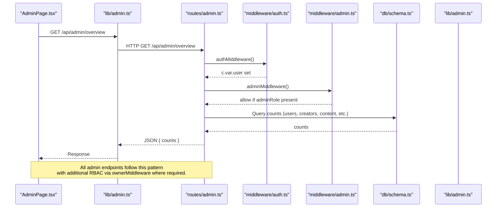

**Diagram sources**
- [AdminPage.tsx](file://src/react-app/pages/AdminPage.tsx)
- [admin.ts](file://src/react-app/lib/admin.ts)
- [admin.ts](file://src/worker/routes/admin.ts)
- [auth.ts](file://src/worker/middleware/auth.ts)
- [admin.ts](file://src/worker/middleware/admin.ts)
- [schema.ts](file://src/worker/db/schema.ts)
- [admin.ts](file://src/worker/lib/admin.ts)

## Detailed Component Analysis

### Role-Based Access Control (RBAC)
- Authentication: Session validation and user profile loading including adminRole.
- Authorization:
  - adminMiddleware: Requires any adminRole (owner or moderator).
  - ownerMiddleware: Requires adminRole === 'owner'.
- Enforcement points:
  - All admin routes use authMiddleware + adminMiddleware.
  - Sensitive endpoints (e.g., discovery management, administrator management) additionally require ownerMiddleware.
- Additional checks:
  - ensureCanActOnUser prevents moderators from acting on other administrators.
  - assertOwnerWillRemain ensures at least one owner remains after role changes.

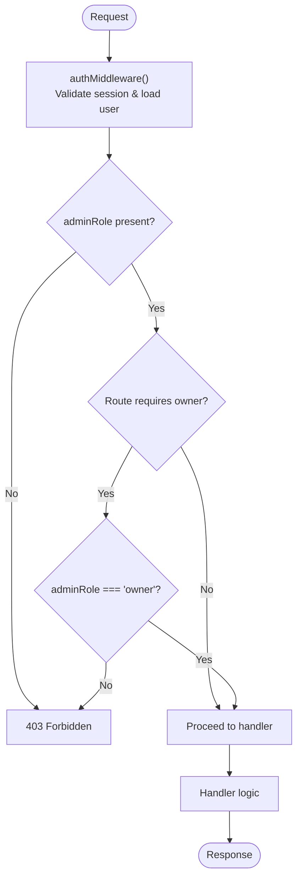

**Diagram sources**
- [auth.ts](file://src/worker/middleware/auth.ts)
- [admin.ts](file://src/worker/middleware/admin.ts)
- [admin.ts](file://src/worker/routes/admin.ts)

**Section sources**
- [auth.ts](file://src/worker/middleware/auth.ts)
- [admin.ts](file://src/worker/middleware/admin.ts)
- [admin.ts](file://src/worker/routes/admin.ts)

### User Management Endpoints
- List users with filters: page, pageSize, search (email/username/id), role, accountStatus, admin membership filter.
- Get user details with history of admin actions targeting the user.
- Suspend/restore user: Updates account status, records suspension reason, revokes sessions, sends notification, writes audit log.
- Revoke sessions: Deletes active sessions for a user, writes audit log.
- Protection: ensureCanActOnUser blocks moderators from acting on administrators.

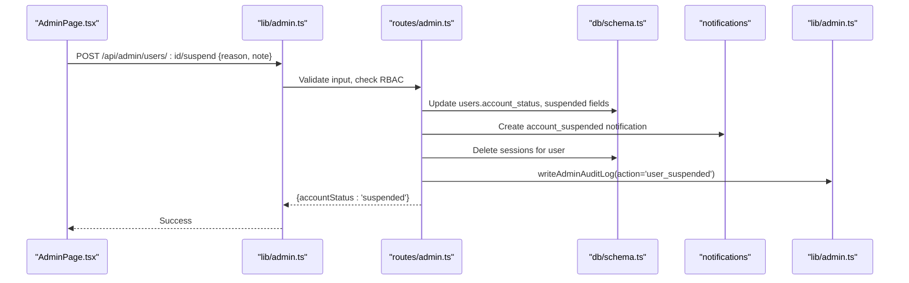

**Diagram sources**
- [AdminPage.tsx](file://src/react-app/pages/AdminPage.tsx)
- [admin.ts](file://src/react-app/lib/admin.ts)
- [admin.ts](file://src/worker/routes/admin.ts)
- [schema.ts](file://src/worker/db/schema.ts)
- [admin.ts](file://src/worker/lib/admin.ts)

**Section sources**
- [admin.ts](file://src/worker/routes/admin.ts)
- [schema.ts](file://src/worker/db/schema.ts)
- [admin.ts](file://src/worker/lib/admin.ts)

### Content Review and Moderation Queues
- Reports creation:
  - POST /api/reports creates or updates a moderation case for post/reply/user.
  - Prevents self-reporting and duplicate reports per reporter per case.
- Admin reports list:
  - GET /api/admin/reports supports filtering by status, targetType, assigned (me/unassigned).
- Case assignment:
  - POST /api/admin/reports/:id/assign sets assignedAdminId and transitions status to reviewing/open.
- Case action:
  - POST /api/admin/reports/:id/action supports actions: dismiss, hide, restore, suspend, restore_user depending on target type.
  - Updates moderation status for posts/replies, suspends/restores users, marks case resolved/dismissed, writes audit log, and notifies affected users when applicable.

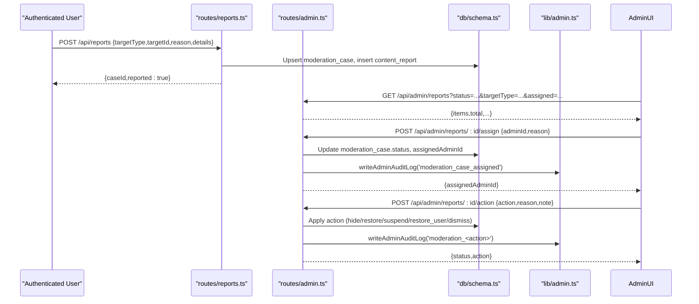

**Diagram sources**
- [reports.ts](file://src/worker/routes/reports.ts)
- [admin.ts](file://src/worker/routes/admin.ts)
- [schema.ts](file://src/worker/db/schema.ts)
- [admin.ts](file://src/worker/lib/admin.ts)

**Section sources**
- [reports.ts](file://src/worker/routes/reports.ts)
- [admin.ts](file://src/worker/routes/admin.ts)
- [schema.ts](file://src/worker/db/schema.ts)
- [admin.ts](file://src/worker/lib/admin.ts)

### Creator Application Approval Workflow
- List applications with pagination and filters (status, search by email/username/fullName).
- View application details and download NID document securely.
- Approve application:
  - Transitions status to approved, grants creator role to user, writes audit log, sends notification.
- Reject application:
  - Transitions status to rejected, records decision reason, writes audit log, sends notification.

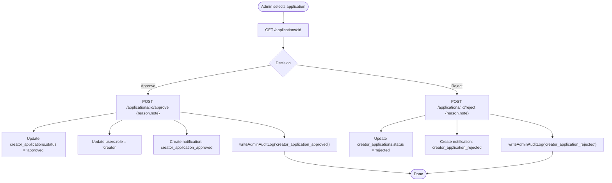

**Diagram sources**
- [admin.ts](file://src/worker/routes/admin.ts)
- [schema.ts](file://src/worker/db/schema.ts)
- [admin.ts](file://src/worker/lib/admin.ts)

**Section sources**
- [admin.ts](file://src/worker/routes/admin.ts)
- [schema.ts](file://src/worker/db/schema.ts)
- [admin.ts](file://src/worker/lib/admin.ts)

### Platform Health Monitoring
- GET /api/admin/health aggregates multiple signals:
  - Failed notification emails (last day).
  - Stale course uploads (pending > 24h).
  - Incomplete/past_due memberships.
  - Stripe webhook last processed timestamp and failures count.
  - Stale Stripe checkouts.
  - Membership plan transition failures.
  - Pending creator applications and open moderation cases.
  - Failed and overdue content schedules.
  - Stripe sandbox configuration status.
- Returns overall status ('healthy' or 'attention') and per-signal statuses.

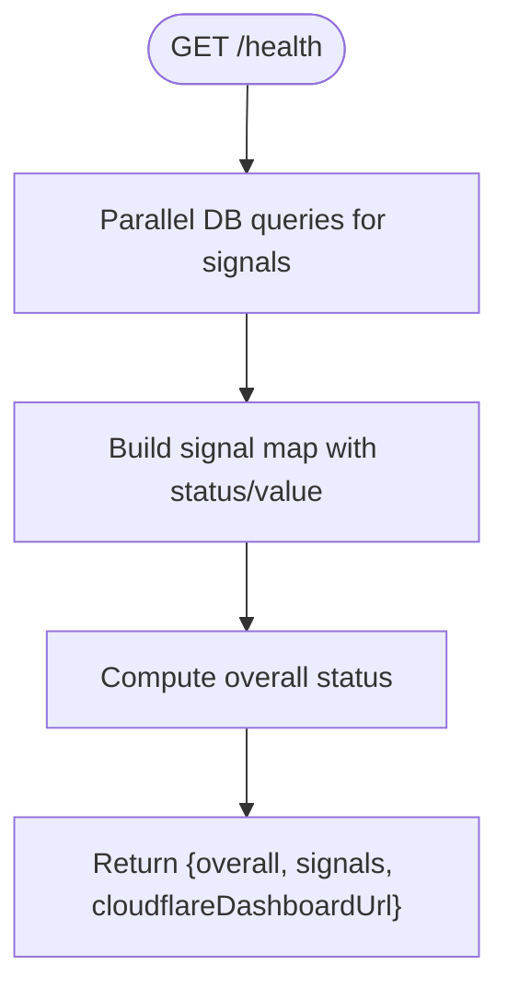

**Diagram sources**
- [admin.ts](file://src/worker/routes/admin.ts)

**Section sources**
- [admin.ts](file://src/worker/routes/admin.ts)

### Discovery Management (Owner Only)
- Categories:
  - List categories with assignment counts.
  - Create/update categories with slug generation and uniqueness checks.
  - Reorder categories atomically with batch updates.
- Featured creators:
  - List eligible creators and current featured list.
  - Replace featured creators with validated eligible IDs; record previous and next lists in audit log.

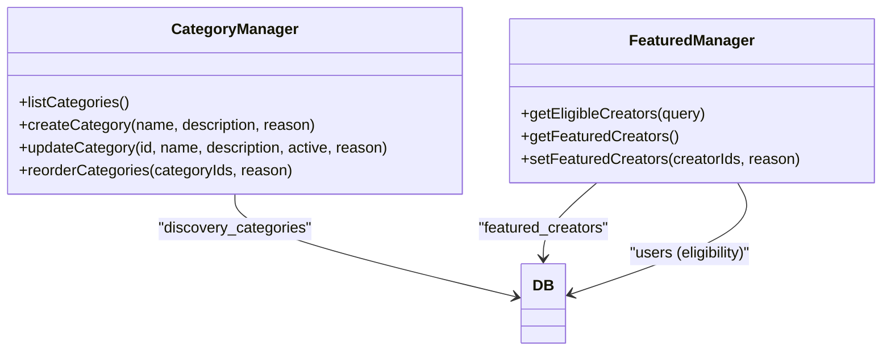

**Diagram sources**
- [admin.ts](file://src/worker/routes/admin.ts)
- [schema.ts](file://src/worker/db/schema.ts)
- [AdminDiscoveryPanel.tsx](file://src/react-app/components/AdminDiscoveryPanel.tsx)

**Section sources**
- [admin.ts](file://src/worker/routes/admin.ts)
- [schema.ts](file://src/worker/db/schema.ts)
- [AdminDiscoveryPanel.tsx](file://src/react-app/components/AdminDiscoveryPanel.tsx)

### Audit Logging
- writeAdminAuditLog persists every administrative action with actor, action, target type/id, reason, and optional metadata.
- Console event emission for observability.
- Admin audit log endpoint allows filtering by action and paginated browsing.

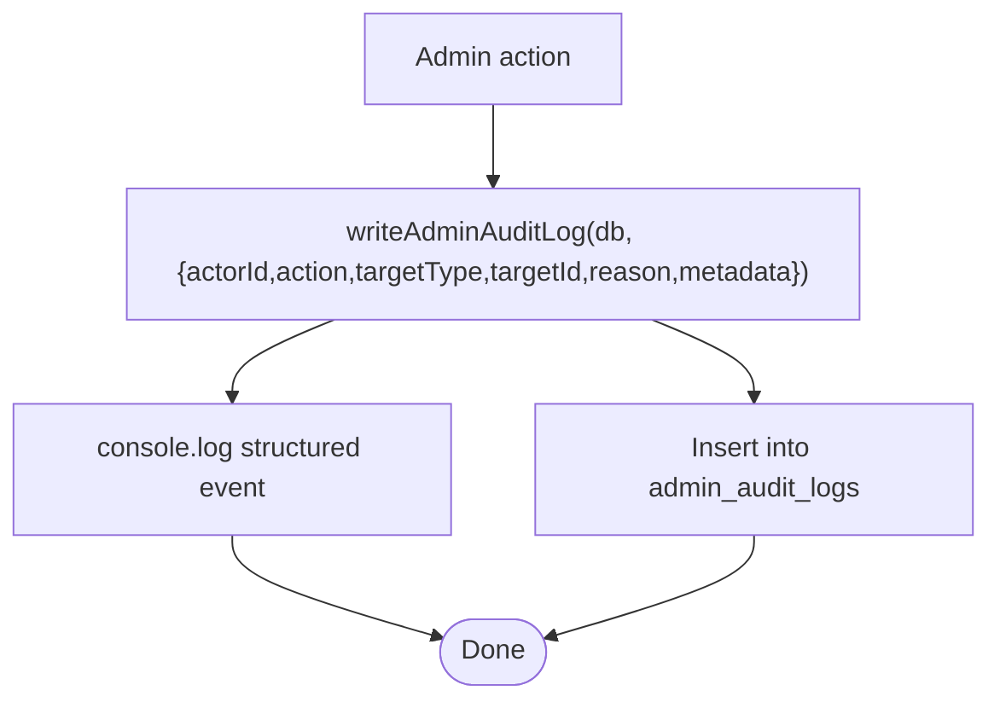

**Diagram sources**
- [admin.ts](file://src/worker/lib/admin.ts)
- [admin.ts](file://src/worker/routes/admin.ts)
- [schema.ts](file://src/worker/db/schema.ts)

**Section sources**
- [admin.ts](file://src/worker/lib/admin.ts)
- [admin.ts](file://src/worker/routes/admin.ts)
- [schema.ts](file://src/worker/db/schema.ts)

### Administrator Role Management (Owner Only)
- List administrators with roles and grantors.
- Assign/change administrator role for a user with owner protection (assertOwnerWillRemain).
- Revoke administrator role with reason and audit logging.

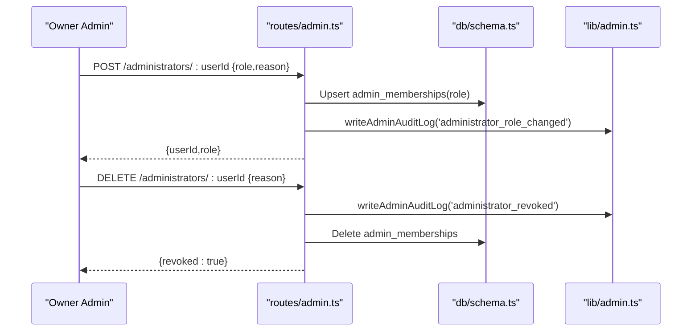

**Diagram sources**
- [admin.ts](file://src/worker/routes/admin.ts)
- [schema.ts](file://src/worker/db/schema.ts)
- [admin.ts](file://src/worker/lib/admin.ts)

**Section sources**
- [admin.ts](file://src/worker/routes/admin.ts)
- [schema.ts](file://src/worker/db/schema.ts)
- [admin.ts](file://src/worker/lib/admin.ts)

### Content Visibility and Moderation State
- getPostModerationState returns moderation status and author account status.
- isPostMemberVisible determines member-facing visibility based on both post moderation status and author account status.

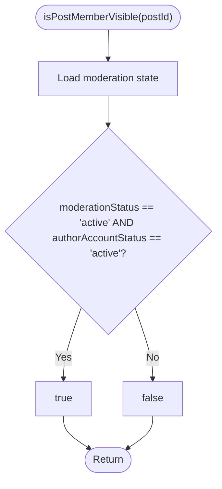

**Diagram sources**
- [moderation.ts](file://src/worker/lib/moderation.ts)

**Section sources**
- [moderation.ts](file://src/worker/lib/moderation.ts)

## Dependency Analysis
- Frontend dependencies:
  - AdminPage uses lib/admin helpers to call endpoints and manage state.
  - Route guards enforce admin access client-side.
- Worker dependencies:
  - Admin routes depend on auth and admin middleware, DB schema, audit logging, notifications, and discovery utilities.
  - Reports routes depend on auth middleware and DB schema.
- Database schema:
  - Users, admin_memberships, moderation_cases, content_reports, admin_audit_logs are central to admin functionality.

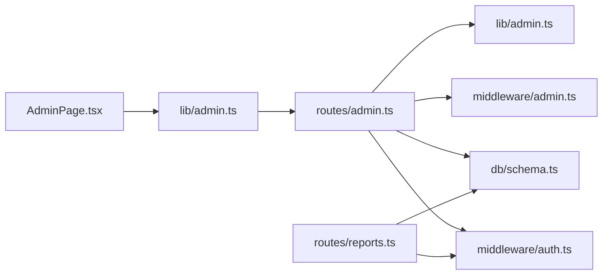

**Diagram sources**
- [AdminPage.tsx](file://src/react-app/pages/AdminPage.tsx)
- [admin.ts](file://src/react-app/lib/admin.ts)
- [admin.ts](file://src/worker/routes/admin.ts)
- [reports.ts](file://src/worker/routes/reports.ts)
- [auth.ts](file://src/worker/middleware/auth.ts)
- [admin.ts](file://src/worker/middleware/admin.ts)
- [schema.ts](file://src/worker/db/schema.ts)
- [admin.ts](file://src/worker/lib/admin.ts)

**Section sources**
- [AdminPage.tsx](file://src/react-app/pages/AdminPage.tsx)
- [admin.ts](file://src/react-app/lib/admin.ts)
- [admin.ts](file://src/worker/routes/admin.ts)
- [reports.ts](file://src/worker/routes/reports.ts)
- [auth.ts](file://src/worker/middleware/auth.ts)
- [admin.ts](file://src/worker/middleware/admin.ts)
- [schema.ts](file://src/worker/db/schema.ts)
- [admin.ts](file://src/worker/lib/admin.ts)

## Performance Considerations
- Parallel queries: Health endpoint uses Promise.all for concurrent metrics collection to minimize latency.
- Pagination: All list endpoints implement consistent pagination with bounds on pageSize to avoid heavy responses.
- Batch operations: Category ordering and featured creators replacement use batch statements for efficient updates.
- Indexes: Schema includes indexes on frequently filtered columns (e.g., moderation status, account status, timestamps) to optimize queries.
- Notification and audit writes: Asynchronous side effects should be considered; ensure they do not block critical paths.

[No sources needed since this section provides general guidance]

## Troubleshooting Guide
Common issues and resolutions:
- Unauthorized or forbidden errors:
  - Ensure session is valid and user has appropriate adminRole.
  - For owner-only endpoints, verify adminRole === 'owner'.
- Moderator cannot act on administrators:
  - ensureCanActOnUser will block such actions; escalate to owner.
- Duplicate reports or self-reporting:
  - Reports endpoint enforces uniqueness per reporter per case and disallows self-reports.
- Stale health signals:
  - Investigate failed notifications, pending uploads, webhook failures, and schedule backlogs indicated by health endpoint.
- Audit log gaps:
  - Confirm writeAdminAuditLog is called for all admin actions; check console events and database entries.

**Section sources**
- [auth.ts](file://src/worker/middleware/auth.ts)
- [admin.ts](file://src/worker/middleware/admin.ts)
- [reports.ts](file://src/worker/routes/reports.ts)
- [admin.ts](file://src/worker/routes/admin.ts)
- [admin.ts](file://src/worker/lib/admin.ts)

## Conclusion
The administrative system provides robust controls for user moderation, content review, and platform analytics with strong RBAC, comprehensive audit logging, and clear health monitoring. The design emphasizes security, data integrity, and operational visibility, enabling safe and effective administration of the platform.

[No sources needed since this section summarizes without analyzing specific files]

## Appendices

### API Endpoints Summary
- Admin overview: GET /api/admin/overview
- Health diagnostics: GET /api/admin/health
- Creator applications:
  - GET /api/admin/applications
  - GET /api/admin/applications/:id
  - GET /api/admin/applications/:id/document
  - POST /api/admin/applications/:id/approve
  - POST /api/admin/applications/:id/reject
- Reports:
  - GET /api/admin/reports
  - GET /api/admin/reports/:id
  - POST /api/admin/reports/:id/assign
  - POST /api/admin/reports/:id/action
- Users:
  - GET /api/admin/users
  - GET /api/admin/users/:id
  - POST /api/admin/users/:id/suspend
  - POST /api/admin/users/:id/restore
  - POST /api/admin/users/:id/revoke-sessions
- Discovery (owner only):
  - GET /api/admin/discovery/categories
  - POST /api/admin/discovery/categories
  - PUT /api/admin/discovery/categories/order
  - PUT /api/admin/discovery/categories/:id
  - GET /api/admin/discovery/eligible-creators
  - GET /api/admin/discovery/featured
  - PUT /api/admin/discovery/featured
- Audit log: GET /api/admin/audit-log
- Administrators (owner only):
  - GET /api/admin/administrators
  - POST /api/admin/administrators/:userId
  - DELETE /api/admin/administrators/:userId
- Reports submission (non-admin): POST /api/reports

**Section sources**
- [admin.ts](file://src/worker/routes/admin.ts)
- [reports.ts](file://src/worker/routes/reports.ts)

### Data Models
- Users: id, email, role, accountStatus, suspensionReason, suspendedAt, suspendedBy, displayName, username, createdAt, updatedAt.
- Admin memberships: userId, role, grantedBy, createdAt, updatedAt.
- Moderation cases: id, targetType, targetId, status, assignedAdminId, resolutionAction, resolutionNote, resolvedBy, resolvedAt, createdAt, updatedAt.
- Content reports: id, caseId, reporterId, reason, details, createdAt.
- Admin audit logs: id, actorId, action, targetType, targetId, reason, metadata, createdAt.

**Section sources**
- [schema.ts](file://src/worker/db/schema.ts)
- [0011_admin_dashboard.sql](file://drizzle/0011_admin_dashboard.sql)