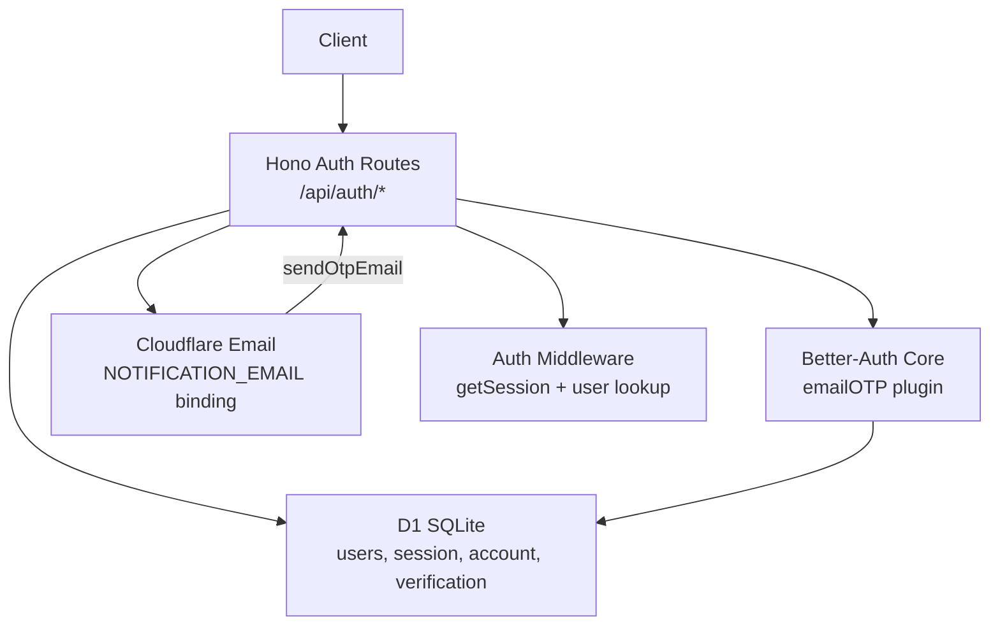
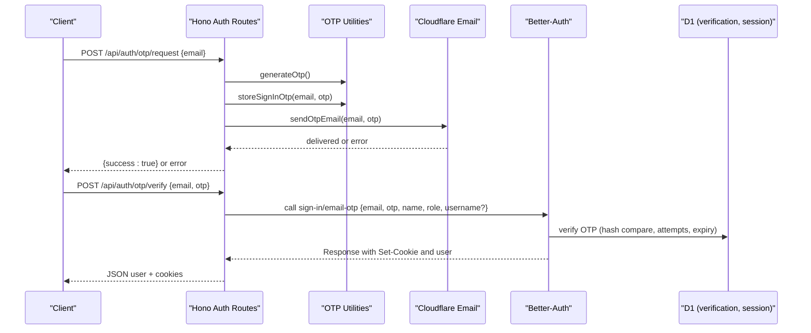
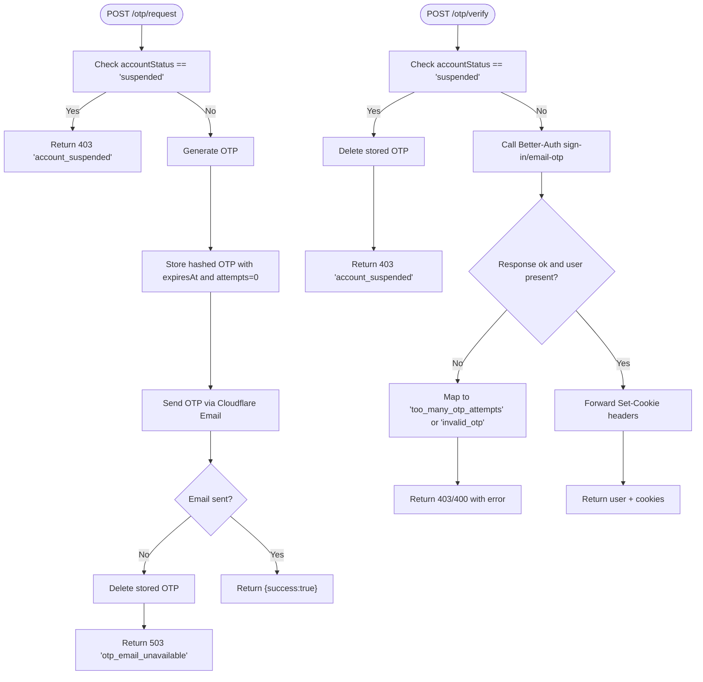
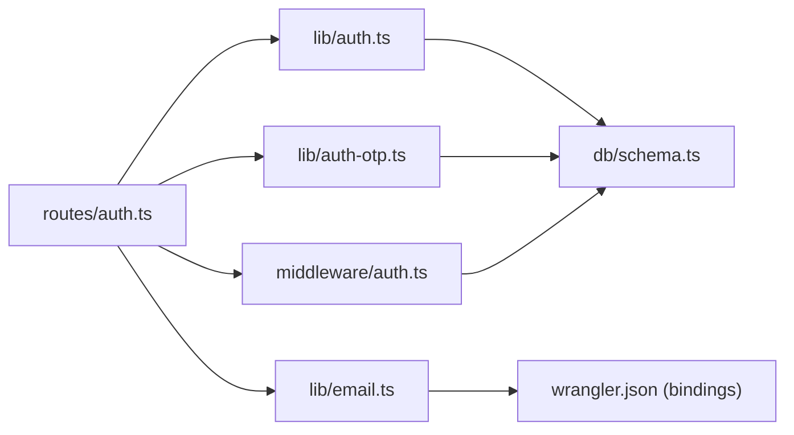

# Authentication Routes

<cite>
**Referenced Files in This Document**
- [auth.ts](file://src/worker/routes/auth.ts)
- [auth-otp.ts](file://src/worker/lib/auth-otp.ts)
- [auth.ts](file://src/worker/lib/auth.ts)
- [email.ts](file://src/worker/lib/email.ts)
- [auth.ts](file://src/worker/middleware/auth.ts)
- [schemas.ts](file://src/worker/lib/schemas.ts)
- [schema.ts](file://src/worker/db/schema.ts)
- [0002_better_auth.sql](file://drizzle/0002_better_auth.sql)
- [http.ts](file://src/worker/lib/http.ts)
- [wrangler.json](file://wrangler.json)
</cite>

## Table of Contents
1. [Introduction](#introduction)
2. [Project Structure](#project-structure)
3. [Core Components](#core-components)
4. [Architecture Overview](#architecture-overview)
5. [Detailed Component Analysis](#detailed-component-analysis)
6. [Dependency Analysis](#dependency-analysis)
7. [Performance Considerations](#performance-considerations)
8. [Troubleshooting Guide](#troubleshooting-guide)
9. [Conclusion](#conclusion)

## Introduction
This document explains the email OTP-based authentication routes and flows implemented in the Worker. It covers registration, login, password reset, session management, and integration with Better-Auth and Cloudflare Email. It also documents HTTP endpoints, request/response schemas, error handling, security considerations (rate limiting via attempt tracking, token validation, session persistence), and common troubleshooting steps.

## Project Structure
The authentication system is centered around:
- Hono route handlers for public auth endpoints
- Better-Auth configuration and plugin integration
- OTP generation, hashing, storage, and verification utilities
- Cloudflare Email delivery for OTP codes
- Middleware to enforce authenticated sessions and user state
- Database schema for users, sessions, accounts, and verification tokens

**Diagram sources**
- [auth.ts:1-259](file://src/worker/routes/auth.ts#L1-L259)
- [auth.ts:1-80](file://src/worker/lib/auth.ts#L1-L80)
- [email.ts:1-56](file://src/worker/lib/email.ts#L1-L56)
- [schema.ts:107-165](file://src/worker/db/schema.ts#L107-L165)
- [auth.ts:1-57](file://src/worker/middleware/auth.ts#L1-L57)

**Section sources**
- [auth.ts:1-259](file://src/worker/routes/auth.ts#L1-L259)
- [auth.ts:1-80](file://src/worker/lib/auth.ts#L1-L80)
- [email.ts:1-56](file://src/worker/lib/email.ts#L1-L56)
- [schema.ts:107-165](file://src/worker/db/schema.ts#L107-L165)
- [auth.ts:1-57](file://src/worker/middleware/auth.ts#L1-L57)

## Core Components
- Hono auth routes: define /register, /login (disabled), /otp/request, /otp/verify, /logout, /me, and a catch-all for Better-Auth native endpoints.
- Better-Auth setup: configures Drizzle adapter, disables password auth, enables emailOTP plugin with custom store and send hooks.
- OTP utilities: generate secure OTPs, hash them, store with expiry and attempt counters, verify with constant-time comparison and rate limiting.
- Email service: sends OTP emails via Cloudflare Email binding.
- Auth middleware: validates sessions and enriches context with user data and account status.
- Schemas: validate request payloads for OTP flows.
- Database schema: defines users, session, account, and verification tables used by Better-Auth and OTP logic.

**Section sources**
- [auth.ts:1-259](file://src/worker/routes/auth.ts#L1-L259)
- [auth.ts:1-80](file://src/worker/lib/auth.ts#L1-L80)
- [auth-otp.ts:1-124](file://src/worker/lib/auth-otp.ts#L1-L124)
- [email.ts:1-56](file://src/worker/lib/email.ts#L1-L56)
- [auth.ts:1-57](file://src/worker/middleware/auth.ts#L1-L57)
- [schemas.ts:1-221](file://src/worker/lib/schemas.ts#L1-L221)
- [schema.ts:107-165](file://src/worker/db/schema.ts#L107-L165)

## Architecture Overview
The OTP sign-in flow uses a two-step process:
1. Request an OTP code sent to the user’s email.
2. Verify the OTP; on success, Better-Auth creates a session and sets cookies.

**Diagram sources**
- [auth.ts:127-212](file://src/worker/routes/auth.ts#L127-L212)
- [auth-otp.ts:26-73](file://src/worker/lib/auth-otp.ts#L26-L73)
- [email.ts:45-55](file://src/worker/lib/email.ts#L45-L55)
- [auth.ts:27-37](file://src/worker/lib/auth.ts#L27-L37)

## Detailed Component Analysis

### Endpoints and Schemas
- POST /api/auth/register
  - Method: POST
  - Behavior: Disabled; returns a specific error indicating password auth is replaced by email sign-in codes.
  - Error response: 400 with code 'password_auth_disabled'.
  - Section sources
    - [auth.ts:127-131](file://src/worker/routes/auth.ts#L127-L131)
    - [http.ts:23-33](file://src/worker/lib/http.ts#L23-L33)

- POST /api/auth/login
  - Method: POST
  - Behavior: Disabled; same behavior as register.
  - Error response: 400 with code 'password_auth_disabled'.
  - Section sources
    - [auth.ts:127-131](file://src/worker/routes/auth.ts#L127-L131)
    - [http.ts:23-33](file://src/worker/lib/http.ts#L23-L33)

- POST /api/auth/otp/request
  - Method: POST
  - Request body: { email: string } validated by authOtpRequestSchema.
  - Behavior: Checks if account is suspended, generates OTP, stores hashed OTP with expiry and attempt counter, sends OTP via Cloudflare Email.
  - Success response: { success: true }
  - Errors:
    - 403 'account_suspended' if user is suspended.
    - 503 'otp_email_unavailable' if email delivery fails; cleans up stored OTP.
  - Section sources
    - [auth.ts:135-164](file://src/worker/routes/auth.ts#L135-L164)
    - [auth-otp.ts:67-73](file://src/worker/lib/auth-otp.ts#L67-L73)
    - [email.ts:45-55](file://src/worker/lib/email.ts#L45-L55)
    - [schemas.ts:13-15](file://src/worker/lib/schemas.ts#L13-L15)
    - [http.ts:23-33](file://src/worker/lib/http.ts#L23-L33)

- POST /api/auth/otp/verify
  - Method: POST
  - Request body: { email: string, otp: string } validated by authOtpVerifySchema.
  - Behavior: Validates account status, calls Better-Auth sign-in/email-otp endpoint, maps errors to client-friendly codes, forwards cookies from Better-Auth.
  - Success response: User object compatible with legacy format plus cookies.
  - Errors:
    - 403 'too_many_otp_attempts' when too many incorrect attempts.
    - 400 'invalid_otp' for invalid/expired OTP.
  - Section sources
    - [auth.ts:168-212](file://src/worker/routes/auth.ts#L168-L212)
    - [auth.ts:27-37](file://src/worker/lib/auth.ts#L27-L37)
    - [auth-otp.ts:87-123](file://src/worker/lib/auth-otp.ts#L87-L123)
    - [schemas.ts:17-23](file://src/worker/lib/schemas.ts#L17-L23)
    - [http.ts:23-33](file://src/worker/lib/http.ts#L23-L33)

- POST /api/auth/logout
  - Method: POST
  - Auth: Requires valid session via authMiddleware.
  - Behavior: Calls Better-Auth sign-out and returns confirmation message with cleared cookies.
  - Success response: { message: "Logged out" }
  - Errors: 401 unauthorized if no session.
  - Section sources
    - [auth.ts:216-220](file://src/worker/routes/auth.ts#L216-L220)
    - [auth.ts:23-50](file://src/worker/middleware/auth.ts#L23-L50)

- GET /api/auth/me
  - Method: GET
  - Auth: Requires valid session via authMiddleware.
  - Behavior: Returns enriched user profile including admin role if present.
  - Success response: User object with id, email, role, displayName, username, tagline, avatarUrl, socialLinks, adminRole.
  - Errors: 404 not found if user missing; 401 unauthorized if no session.
  - Section sources
    - [auth.ts:224-249](file://src/worker/routes/auth.ts#L224-L249)
    - [auth.ts:23-50](file://src/worker/middleware/auth.ts#L23-L50)

- Catch-all /api/auth/*
  - Methods: GET, POST
  - Behavior: Forwards requests to Better-Auth handler unless path is blocked (e.g., email-otp endpoints are handled by this app).
  - Section sources
    - [auth.ts:253-258](file://src/worker/routes/auth.ts#L253-L258)

### OTP Flow Algorithm

**Diagram sources**
- [auth.ts:135-212](file://src/worker/routes/auth.ts#L135-L212)
- [auth-otp.ts:67-73](file://src/worker/lib/auth-otp.ts#L67-L73)
- [email.ts:45-55](file://src/worker/lib/email.ts#L45-L55)

### Better-Auth Integration
- The app configures Better-Auth with:
  - Drizzle adapter pointing to D1 SQLite using the project schema.
  - emailOTP plugin with custom OTP length, expiry, allowed attempts, and a custom store that hashes OTPs before storing.
  - Custom sendVerificationOTP hook to deliver OTPs via Cloudflare Email.
  - User field mappings to align with existing user model fields.
- Native Better-Auth endpoints are proxied except for explicitly blocked paths which are handled by this application.

**Section sources**
- [auth.ts:9-77](file://src/worker/lib/auth.ts#L9-L77)
- [auth.ts:253-258](file://src/worker/routes/auth.ts#L253-L258)

### Session Management
- Sessions are managed by Better-Auth and persisted in the session table.
- The auth middleware retrieves the session from incoming cookies, loads user details, checks account status, and attaches user info to the request context.
- Logout triggers Better-Auth sign-out, clearing session cookies.

**Section sources**
- [auth.ts:23-50](file://src/worker/middleware/auth.ts#L23-L50)
- [schema.ts:107-124](file://src/worker/db/schema.ts#L107-L124)

### Security Considerations
- Rate limiting: OTP verification enforces maximum attempts per OTP entry using attempt counters stored alongside hashed OTP values.
- Token validation: OTPs are hashed before storage; verification uses constant-time comparison to prevent timing attacks.
- Expiry: OTP entries expire after a fixed duration; expired entries are deleted during verification.
- Session persistence: Better-Auth manages session lifecycle and cookie propagation across requests.
- Account suspension: Requests are rejected early for suspended accounts.
- Input validation: All inputs are validated with Zod schemas to prevent malformed or malicious payloads.

**Section sources**
- [auth-otp.ts:17-24](file://src/worker/lib/auth-otp.ts#L17-L24)
- [auth-otp.ts:87-123](file://src/worker/lib/auth-otp.ts#L87-L123)
- [auth.ts:168-212](file://src/worker/routes/auth.ts#L168-L212)
- [auth.ts:23-50](file://src/worker/middleware/auth.ts#L23-L50)
- [schemas.ts:13-23](file://src/worker/lib/schemas.ts#L13-L23)

### Password Reset and Email Change
- Password reset via email-otp is disabled at the route level; password auth is fully replaced by OTP sign-in.
- Email change flow:
  - POST /settings/email/otp/request: Generates and sends OTP to new email.
  - POST /settings/email/otp/verify: Verifies OTP and updates user email if valid.
  - Uses the same OTP utilities and Cloudflare Email service.

**Section sources**
- [auth.ts:127-131](file://src/worker/routes/auth.ts#L127-L131)
- [settings.ts:137-255](file://src/worker/routes/settings.ts#L137-L255)
- [auth-otp.ts:75-81](file://src/worker/lib/auth-otp.ts#L75-L81)
- [email.ts:27-43](file://src/worker/lib/email.ts#L27-L43)

## Dependency Analysis

**Diagram sources**
- [auth.ts:1-259](file://src/worker/routes/auth.ts#L1-L259)
- [auth.ts:1-80](file://src/worker/lib/auth.ts#L1-L80)
- [auth-otp.ts:1-124](file://src/worker/lib/auth-otp.ts#L1-L124)
- [email.ts:1-56](file://src/worker/lib/email.ts#L1-L56)
- [auth.ts:1-57](file://src/worker/middleware/auth.ts#L1-L57)
- [schema.ts:107-165](file://src/worker/db/schema.ts#L107-L165)
- [wrangler.json:44-51](file://wrangler.json#L44-L51)

**Section sources**
- [auth.ts:1-259](file://src/worker/routes/auth.ts#L1-L259)
- [auth.ts:1-80](file://src/worker/lib/auth.ts#L1-L80)
- [auth-otp.ts:1-124](file://src/worker/lib/auth-otp.ts#L1-L124)
- [email.ts:1-56](file://src/worker/lib/email.ts#L1-L56)
- [auth.ts:1-57](file://src/worker/middleware/auth.ts#L1-L57)
- [schema.ts:107-165](file://src/worker/db/schema.ts#L107-L165)
- [wrangler.json:44-51](file://wrangler.json#L44-L51)

## Performance Considerations
- Minimize database round-trips: OTP storage deletes previous entries before inserting new ones to keep lookups fast.
- Use hashed OTPs and constant-time comparisons to avoid side-channel leaks while maintaining performance.
- Short-lived OTPs reduce storage growth and improve security.
- Leverage Cloudflare Email binding for efficient delivery without additional infrastructure overhead.
- Avoid unnecessary JSON parsing; reuse responses and headers where possible.

[No sources needed since this section provides general guidance]

## Troubleshooting Guide
- Invalid or expired OTP:
  - Ensure OTP was requested recently and not reused beyond allowed attempts.
  - Check logs for email delivery failures; retry OTP request if necessary.
  - Section sources
    - [auth.ts:168-212](file://src/worker/routes/auth.ts#L168-L212)
    - [auth-otp.ts:87-123](file://src/worker/lib/auth-otp.ts#L87-L123)

- Too many OTP attempts:
  - Wait for OTP expiry or request a new OTP.
  - Section sources
    - [auth.ts:168-212](file://src/worker/routes/auth.ts#L168-L212)
    - [auth-otp.ts:106-109](file://src/worker/lib/auth-otp.ts#L106-L109)

- Email delivery failures:
  - Verify NOTIFICATION_EMAIL binding and allowed sender addresses in wrangler configuration.
  - Confirm recipient email is valid and reachable via Email Routing if required.
  - Section sources
    - [email.ts:27-43](file://src/worker/lib/email.ts#L27-L43)
    - [wrangler.json:44-51](file://wrangler.json#L44-L51)

- Suspended accounts:
  - Requests are rejected with 'account_suspended'; contact admin to reactivate.
  - Section sources
    - [auth.ts:135-164](file://src/worker/routes/auth.ts#L135-L164)
    - [auth.ts:44-46](file://src/worker/middleware/auth.ts#L44-L46)

- Session issues:
  - Ensure cookies are preserved across requests; check browser settings and CORS/trusted origins.
  - Validate that BETTER_AUTH_SECRET is configured and matches environment.
  - Section sources
    - [auth.ts:23-50](file://src/worker/middleware/auth.ts#L23-L50)
    - [auth.ts:12-15](file://src/worker/lib/auth.ts#L12-L15)
    - [wrangler.json:84-90](file://wrangler.json#L84-L90)

## Conclusion
The authentication system implements a secure, OTP-based email sign-in flow integrated with Better-Auth and Cloudflare Email. It enforces strong security practices such as hashed OTP storage, attempt limits, short expiration windows, and robust session management. The design cleanly separates concerns between routing, OTP utilities, email delivery, and middleware, making it maintainable and extensible.

[No sources needed since this section summarizes without analyzing specific files]