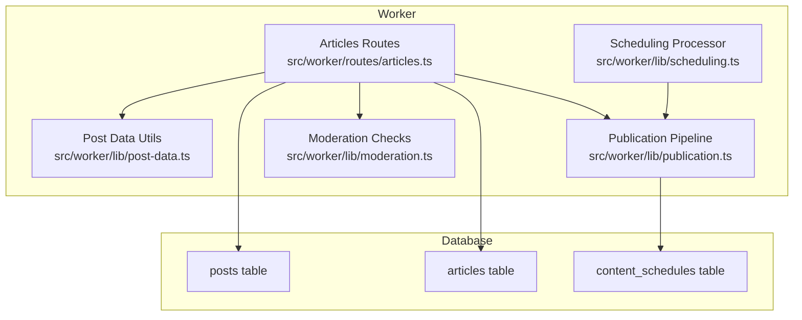
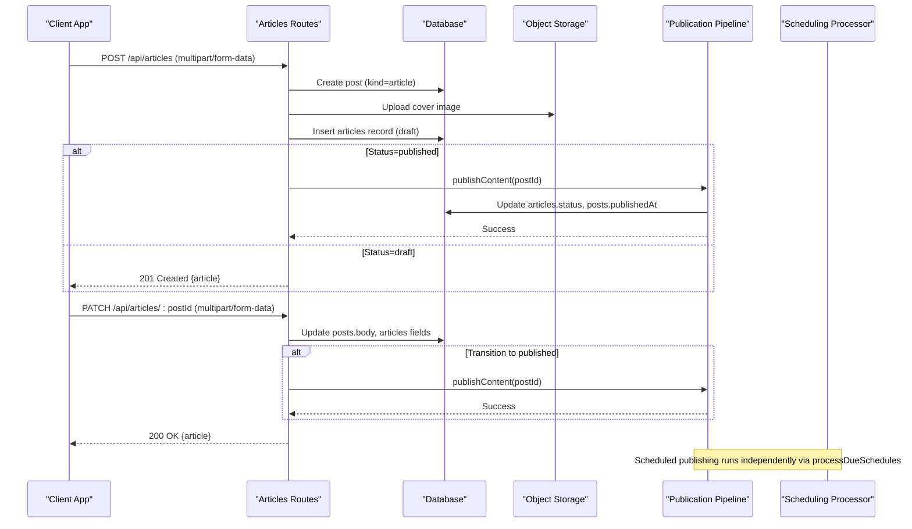
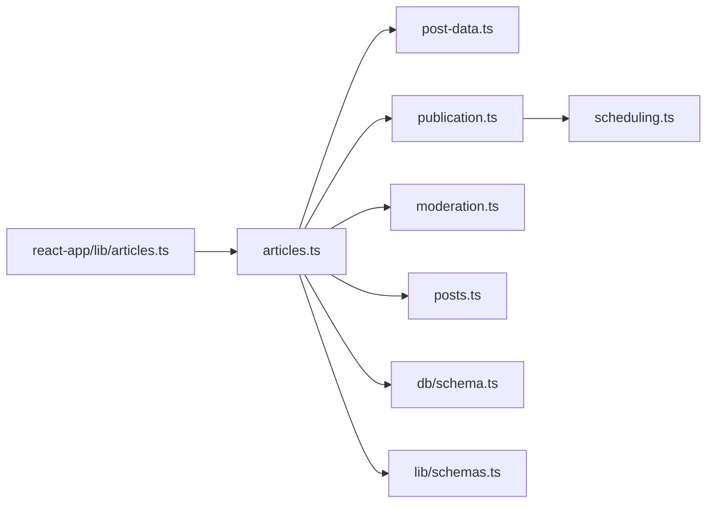

# Articles Routes

<cite>
**Referenced Files in This Document**
- [articles.ts](file://src/worker/routes/articles.ts)
- [0005_articles.sql](file://drizzle/0005_articles.sql)
- [schemas.ts](file://src/worker/lib/schemas.ts)
- [post-data.ts](file://src/worker/lib/post-data.ts)
- [publication.ts](file://src/worker/lib/publication.ts)
- [moderation.ts](file://src/worker/lib/moderation.ts)
- [posts.ts](file://src/worker/routes/posts.ts)
- [0014_content_scheduling.sql](file://drizzle/0014_content_scheduling.sql)
- [scheduling.ts](file://src/worker/lib/scheduling.ts)
- [articles.ts (frontend)](file://src/react-app/lib/articles.ts)
- [ArticleEditorPage.tsx](file://src/react-app/pages/ArticleEditorPage.tsx)
</cite>

## Table of Contents
1. [Introduction](#introduction)
2. [Project Structure](#project-structure)
3. [Core Components](#core-components)
4. [Architecture Overview](#architecture-overview)
5. [Detailed Component Analysis](#detailed-component-analysis)
6. [Dependency Analysis](#dependency-analysis)
7. [Performance Considerations](#performance-considerations)
8. [Troubleshooting Guide](#troubleshooting-guide)
9. [Conclusion](#conclusion)

## Introduction
This document provides detailed API documentation for the Articles route handler, covering creation, editing, publishing workflows, and content management. It explains how long-form content with markdown is handled, metadata management, versioning via scheduling, publication status transitions, cover image uploads, validation rules, and integration points with the unified post system, moderation workflow, and discovery system. It also clarifies article-specific features such as excerpt generation and related content interactions through the shared post infrastructure.

## Project Structure
The articles feature is implemented as a Hono-based worker route module that:
- Accepts multipart/form-data for creating and updating articles
- Persists data across two tables: posts (unified content base) and articles (long-form content specifics)
- Integrates with storage for cover images
- Uses a centralized publication pipeline to enforce validation and publish state changes
- Leverages moderation checks and membership access controls
- Exposes endpoints for reading by ID or slug, and retrieving cover images



**Diagram sources**
- [articles.ts:1-456](file://src/worker/routes/articles.ts#L1-L456)
- [post-data.ts:1-350](file://src/worker/lib/post-data.ts#L1-L350)
- [publication.ts:1-273](file://src/worker/lib/publication.ts#L1-L273)
- [moderation.ts:1-17](file://src/worker/lib/moderation.ts#L1-L17)
- [scheduling.ts:1-127](file://src/worker/lib/scheduling.ts#L1-L127)
- [0005_articles.sql:1-22](file://drizzle/0005_articles.sql#L1-L22)
- [0014_content_scheduling.sql:1-47](file://drizzle/0014_content_scheduling.sql#L1-L47)

**Section sources**
- [articles.ts:1-456](file://src/worker/routes/articles.ts#L1-L456)
- [0005_articles.sql:1-22](file://drizzle/0005_articles.sql#L1-L22)
- [0014_content_scheduling.sql:1-47](file://drizzle/0014_content_scheduling.sql#L1-L47)

## Core Components
- Articles routes: define endpoints for creating, updating, publishing, reading by ID or slug, and fetching cover images.
- Post-data utilities: provide media URL helpers, image type constants, size limits, and building post extras (likes, replies, viewer state).
- Publication pipeline: validates publishable content, updates statuses atomically, and notifies subscribers.
- Moderation checks: ensure visibility based on moderation status and account status.
- Scheduling processor: processes due schedules, retries failures, and publishes content at scheduled times.
- Frontend client: React Query hooks and functions to create, update, publish, and fetch articles.

Key responsibilities:
- Input parsing and validation for multipart form submissions
- Cover image upload to object storage
- Unified post record creation and linking to articles
- Access control and moderation enforcement
- Publishing orchestration and error mapping
- Response serialization including author info and engagement metrics

**Section sources**
- [articles.ts:1-456](file://src/worker/routes/articles.ts#L1-L456)
- [post-data.ts:1-350](file://src/worker/lib/post-data.ts#L1-L350)
- [publication.ts:1-273](file://src/worker/lib/publication.ts#L1-L273)
- [moderation.ts:1-17](file://src/worker/lib/moderation.ts#L1-L17)
- [scheduling.ts:1-127](file://src/worker/lib/scheduling.ts#L1-L127)
- [articles.ts (frontend):1-71](file://src/react-app/lib/articles.ts#L1-L71)

## Architecture Overview
The articles system builds upon a unified post model where each piece of content has a base post record and optional specialized records (e.g., articles). The flow for creating and publishing an article involves:
- Creating a post record with kind 'article'
- Inserting an articles record with title, excerpt, markdown, status, and cover metadata
- Optionally invoking the publication pipeline to transition to published state
- Updating content schedules if scheduling is used
- Returning serialized article data with engagement metrics and author details



**Diagram sources**
- [articles.ts:215-331](file://src/worker/routes/articles.ts#L215-L331)
- [publication.ts:197-273](file://src/worker/lib/publication.ts#L197-L273)
- [scheduling.ts:42-127](file://src/worker/lib/scheduling.ts#L42-L127)

## Detailed Component Analysis

### Endpoints and Workflows

#### Create Article
- Method: POST
- Path: /api/articles
- Auth: Required (creator role)
- Content-Type: multipart/form-data
- Fields:
  - title: string (trimmed), max length enforced
  - excerpt: string (trimmed), optional; derived from markdown if not provided
  - markdown: string (trimmed), max length enforced
  - status: "draft" | "published"
  - cover: File (optional), validated type and size
- Behavior:
  - Validates multipart/form-data and field constraints
  - If status is "published", requires a cover image
  - Creates a post record with kind "article" and body set to excerpt or title
  - Inserts an articles record with draft status and cover metadata
  - If status is "published", invokes publishContent to transition to published
  - Returns serialized article with author info and engagement metrics

Response:
- 201 Created with { article }
- Validation errors return 422 with descriptive messages
- Unsupported media type returns 415
- Payload too large returns 413

**Section sources**
- [articles.ts:86-131](file://src/worker/routes/articles.ts#L86-L131)
- [articles.ts:215-260](file://src/worker/routes/articles.ts#L215-L260)
- [post-data.ts:18-42](file://src/worker/lib/post-data.ts#L18-L42)

#### Update Article
- Method: PATCH
- Path: /api/articles/:postId
- Auth: Required (creator role)
- Content-Type: multipart/form-data
- Fields: Same as create
- Behavior:
  - Verifies ownership and moderation visibility
  - Prevents edits while schedule is processing
  - Updates posts.body and articles fields
  - Preserves publishedAt when remaining published
  - If transitioning to published, invokes publishContent
  - Returns updated article

Response:
- 200 OK with { article }
- 404 Not Found if article does not exist
- 403 Forbidden if not owner or moderated
- 409 Conflict if schedule is processing

**Section sources**
- [articles.ts:262-314](file://src/worker/routes/articles.ts#L262-L314)
- [moderation.ts:13-17](file://src/worker/lib/moderation.ts#L13-L17)

#### Publish Article
- Method: POST
- Path: /api/articles/:postId/publish
- Auth: Required (creator role)
- Behavior:
  - Verifies ownership and moderation visibility
  - Invokes publishContent to transition to published
  - Returns updated article

Response:
- 200 OK with { article }
- 404 Not Found if article does not exist
- 403 Forbidden if not owner or moderated

**Section sources**
- [articles.ts:316-331](file://src/worker/routes/articles.ts#L316-L331)
- [publication.ts:197-273](file://src/worker/lib/publication.ts#L197-L273)

#### Read Article by ID
- Method: GET
- Path: /api/articles/:postId
- Auth: Required
- Behavior:
  - Fetches article joined with posts and users
  - Enforces read access via moderation and membership checks
  - Builds post extras (likes, replies, viewer state)
  - Serializes replies alongside article

Response:
- 200 OK with { article, replies }
- 404 Not Found if article does not exist
- 403 Forbidden if access denied

**Section sources**
- [articles.ts:382-396](file://src/worker/routes/articles.ts#L382-L396)
- [post-data.ts:144-292](file://src/worker/lib/post-data.ts#L144-L292)

#### Read Article by Username and Slug
- Method: GET
- Path: /api/articles/by-slug/:username/:slug
- Auth: Required
- Behavior:
  - Queries by username and slug with kind filter and moderation/account status checks
  - Enforces read access
  - Returns article and replies

Response:
- 200 OK with { article, replies }
- 404 Not Found if article does not exist
- 403 Forbidden if access denied

**Section sources**
- [articles.ts:333-380](file://src/worker/routes/articles.ts#L333-L380)

#### Get Cover Image
- Method: GET
- Path: /api/articles/:postId/cover
- Auth: Required
- Behavior:
  - Retrieves cover from object storage using stored R2 key
  - Sets appropriate headers (content-type, cache-control, content-disposition)
  - Enforces read access

Response:
- 200 OK with binary image data
- 404 Not Found if cover missing or access denied

**Section sources**
- [articles.ts:398-415](file://src/worker/routes/articles.ts#L398-L415)
- [post-data.ts:104-106](file://src/worker/lib/post-data.ts#L104-L106)

### Data Model and Relationships
- posts table: unified base for all content types with kind discriminator
- articles table: stores long-form content specifics (title, excerpt, markdown, status, cover metadata)
- content_schedules table: tracks scheduled publications with retry logic and failure handling

```mermaid
erDiagram
POSTS {
text id PK
text kind
text slug
text body
integer created_at
integer published_at
text author_id FK
text moderation_status
}
ARTICLES {
text post_id PK FK
text title
text excerpt
text markdown
text status
text cover_r2_key
text cover_file_name
text cover_content_type
integer cover_size_bytes
integer published_at
integer created_at
integer updated_at
}
CONTENT_SCHEDULES {
text post_id PK FK
text creator_id FK
text status
integer scheduled_for
integer next_attempt_at
integer attempt_count
integer revision
integer processing_started_at
text last_error_code
text last_error_message
integer published_at
integer created_at
integer updated_at
}
USERS {
text id PK
text username
text display_name
text avatar_url
text account_status
}
POSTS ||--o| ARTICLES : "has one"
POSTS ||--o{ CONTENT_SCHEDULES : "scheduled"
POSTS }o--|| USERS : "author"
```

**Diagram sources**
- [0005_articles.sql:1-22](file://drizzle/0005_articles.sql#L1-L22)
- [0014_content_scheduling.sql:1-47](file://drizzle/0014_content_scheduling.sql#L1-L47)
- [schema.ts:190-231](file://src/worker/db/schema.ts#L190-L231)

**Section sources**
- [0005_articles.sql:1-22](file://drizzle/0005_articles.sql#L1-L22)
- [0014_content_scheduling.sql:1-47](file://drizzle/0014_content_scheduling.sql#L1-L47)
- [schema.ts:190-231](file://src/worker/db/schema.ts#L190-L231)

### Validation and Error Handling
- Multipart/form-data required for create/update
- Title, excerpt, and markdown length limits enforced
- Drafts require at least title or markdown; published require title, markdown, and cover
- Cover image type and size validated against allowed MIME types and maximum size
- Publication errors mapped to appropriate HTTP responses (forbidden, not found, validation failed)
- Schedule processing conflicts prevented during edit

Error codes and messages are returned consistently via helper functions for unsupported media type, payload too large, validation failures, and forbidden/not found scenarios.

**Section sources**
- [articles.ts:86-131](file://src/worker/routes/articles.ts#L86-L131)
- [articles.ts:209-213](file://src/worker/routes/articles.ts#L209-L213)
- [post-data.ts:18-42](file://src/worker/lib/post-data.ts#L18-L42)

### Integration Points

#### Unified Post System
- Articles share the posts table with kind discriminator
- Slug generation is centralized and reused across content types
- Engagement metrics (likes, replies) and viewer state are built via shared utilities

**Section sources**
- [posts.ts:92-119](file://src/worker/routes/posts.ts#L92-L119)
- [post-data.ts:144-292](file://src/worker/lib/post-data.ts#L144-L292)

#### Content Moderation Workflow
- Visibility checks ensure only active moderation status and active accounts can be accessed
- Editing and publishing blocked for moderated content until restored

**Section sources**
- [moderation.ts:13-17](file://src/worker/lib/moderation.ts#L13-L17)
- [articles.ts:202-207](file://src/worker/routes/articles.ts#L202-L207)

#### Discovery System
- Articles are part of the broader content ecosystem but do not directly interact with discovery endpoints in this module
- Discovery focuses on creators and categories; articles contribute to creator profiles via published listings

**Section sources**
- [discovery.ts (frontend):51-98](file://src/react-app/lib/discovery.ts#L51-L98)

#### Scheduling Capabilities
- Content schedules track pending, processing, published, failed, and canceled states
- Scheduler processes due items, retries failures with backoff, and notifies creators on failure
- Articles can be scheduled for future publication via the same pipeline

**Section sources**
- [scheduling.ts:42-127](file://src/worker/lib/scheduling.ts#L42-L127)
- [0014_content_scheduling.sql:26-47](file://drizzle/0014_content_scheduling.sql#L26-L47)

### Article-Specific Features
- Markdown support: Full markdown body stored and returned; excerpt auto-generated if not provided
- Cover image upload: Stored in object storage with metadata persisted
- Reading time calculation: Not implemented in this module; would typically be computed client-side or via a utility
- Table of contents generation: Not implemented in this module; could be derived from markdown headings client-side
- SEO optimization fields: Not present in the articles schema; title and excerpt serve basic SEO needs

Note: While these features are not implemented server-side in the current codebase, they can be added by extending the articles schema and response serialization.

**Section sources**
- [articles.ts:146-171](file://src/worker/routes/articles.ts#L146-L171)
- [0005_articles.sql:5-19](file://drizzle/0005_articles.sql#L5-L19)

## Dependency Analysis
The articles routes depend on several core modules:
- Database client and schema definitions for queries and mutations
- Post-data utilities for media URLs, image validation, and engagement metrics
- Publication pipeline for consistent publishing logic across content types
- Moderation utilities for visibility checks
- Scheduling processor for background publication tasks
- Frontend client for API consumption and UI state management



**Diagram sources**
- [articles.ts:1-456](file://src/worker/routes/articles.ts#L1-L456)
- [post-data.ts:1-350](file://src/worker/lib/post-data.ts#L1-L350)
- [publication.ts:1-273](file://src/worker/lib/publication.ts#L1-L273)
- [moderation.ts:1-17](file://src/worker/lib/moderation.ts#L1-L17)
- [posts.ts:1-200](file://src/worker/routes/posts.ts#L1-L200)
- [scheduling.ts:1-127](file://src/worker/lib/scheduling.ts#L1-L127)
- [articles.ts (frontend):1-71](file://src/react-app/lib/articles.ts#L1-L71)

**Section sources**
- [articles.ts:1-456](file://src/worker/routes/articles.ts#L1-L456)
- [post-data.ts:1-350](file://src/worker/lib/post-data.ts#L1-L350)
- [publication.ts:1-273](file://src/worker/lib/publication.ts#L1-L273)
- [moderation.ts:1-17](file://src/worker/lib/moderation.ts#L1-L17)
- [posts.ts:1-200](file://src/worker/routes/posts.ts#L1-L200)
- [scheduling.ts:1-127](file://src/worker/lib/scheduling.ts#L1-L127)
- [articles.ts (frontend):1-71](file://src/react-app/lib/articles.ts#L1-L71)

## Performance Considerations
- Batch database operations during publishing to minimize round trips
- Use parallel queries for building post extras and serializing replies
- Cache cover images with appropriate headers to reduce storage reads
- Limit markdown length to prevent excessive payloads
- Validate inputs early to fail fast and avoid unnecessary work

[No sources needed since this section provides general guidance]

## Troubleshooting Guide
Common issues and resolutions:
- Unsupported media type: Ensure cover images are JPEG, PNG, or WebP
- Payload too large: Reduce cover image size below the maximum limit
- Validation failed: Check title, excerpt, markdown lengths and required fields for published status
- Forbidden: Verify ownership, moderation status, and account status
- Not found: Confirm postId or username/slug correctness
- Schedule processing conflict: Wait until processing completes before editing

Use the error responses and logs to diagnose issues. Publication errors map to specific HTTP codes for clear client feedback.

**Section sources**
- [articles.ts:86-131](file://src/worker/routes/articles.ts#L86-L131)
- [articles.ts:209-213](file://src/worker/routes/articles.ts#L209-L213)
- [publication.ts:113-195](file://src/worker/lib/publication.ts#L113-L195)

## Conclusion
The Articles route handler provides a robust foundation for managing long-form content within a unified post system. It supports markdown-based articles, cover image uploads, validation, moderation, and publishing workflows. Integration with scheduling and discovery systems ensures scalable content delivery and discoverability. Future enhancements can include table of contents generation, reading time calculation, and SEO optimization fields by extending the schema and serialization logic.

[No sources needed since this section summarizes without analyzing specific files]