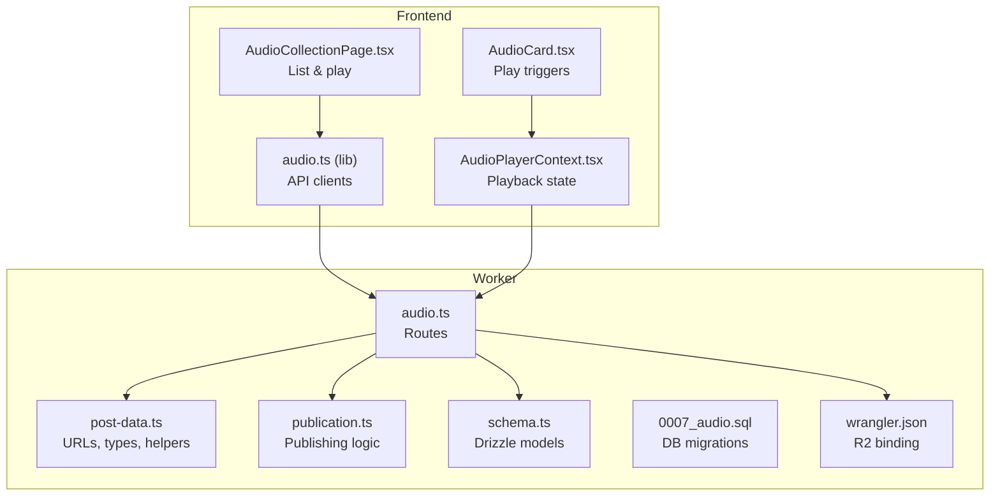
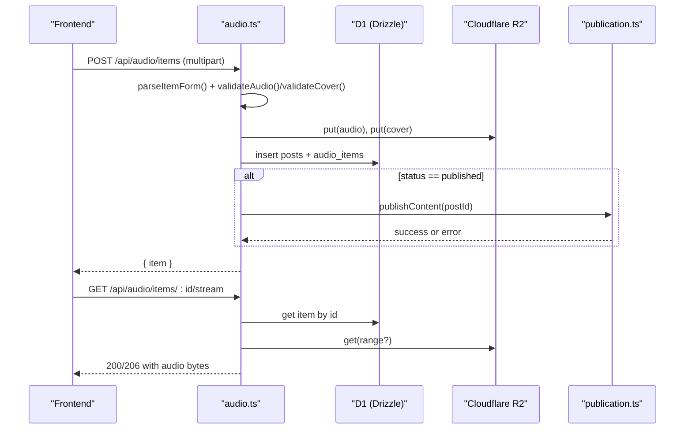
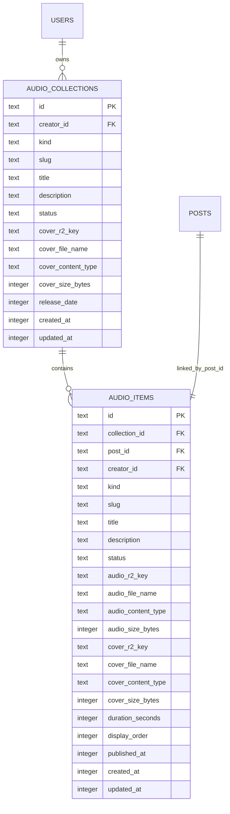
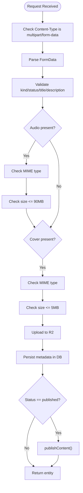
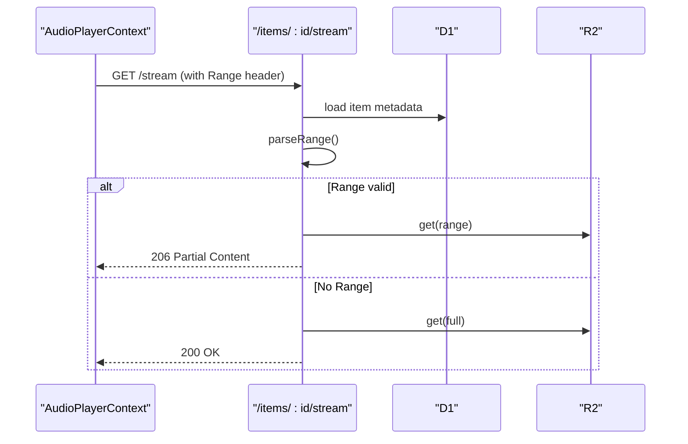
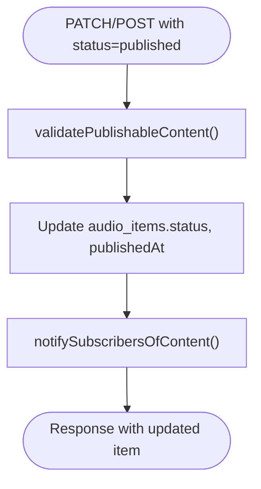
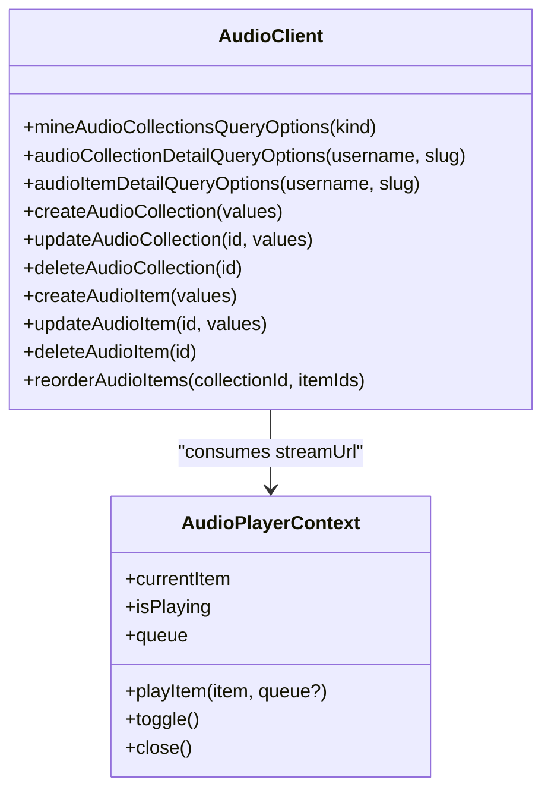
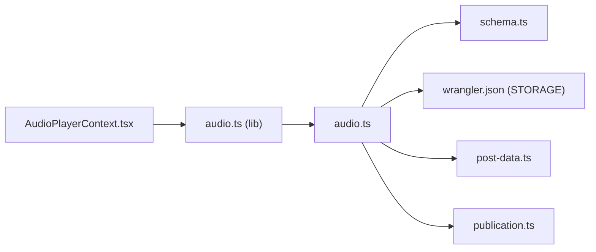

# Audio Routes

<cite>
**Referenced Files in This Document**
- [audio.ts](file://src/worker/routes/audio.ts)
- [post-data.ts](file://src/worker/lib/post-data.ts)
- [schema.ts](file://src/worker/db/schema.ts)
- [0007_audio.sql](file://drizzle/0007_audio.sql)
- [publication.ts](file://src/worker/lib/publication.ts)
- [wrangler.json](file://wrangler.json)
- [audio.ts (frontend)](file://src/react-app/lib/audio.ts)
- [AudioPlayerContext.tsx](file://src/react-app/context/AudioPlayerContext.tsx)
- [AudioCard.tsx](file://src/react-app/components/AudioCard.tsx)
- [AudioCollectionPage.tsx](file://src/react-app/pages/AudioCollectionPage.tsx)
</cite>

## Table of Contents
1. [Introduction](#introduction)
2. [Project Structure](#project-structure)
3. [Core Components](#core-components)
4. [Architecture Overview](#architecture-overview)
5. [Detailed Component Analysis](#detailed-component-analysis)
6. [Dependency Analysis](#dependency-analysis)
7. [Performance Considerations](#performance-considerations)
8. [Troubleshooting Guide](#troubleshooting-guide)
9. [Conclusion](#conclusion)
10. [Appendices](#appendices)

## Introduction
This document provides comprehensive API documentation for the audio route handler, covering audio collection management, file uploads, metadata handling, and streaming capabilities. It documents endpoints for uploading audio files, managing collections, setting track metadata, generating thumbnails, and handling playback URLs. It also explains file format validation, size limits, transcoding workflows, CDN integration, and audio-specific features such as chapter markers, episode descriptions, RSS feed generation, and subscription management. Finally, it details the relationship with Cloudflare R2 storage, audio processing pipelines, and integration with the player context in the frontend.

## Project Structure
The audio feature is implemented as a Hono-based worker route module that interacts with:
- A D1 database via Drizzle ORM for schema-managed tables
- Cloudflare R2 for object storage of audio and cover images
- A publication system for scheduling and publishing content to subscribers
- The frontend React app for UI, state, and playback

**Diagram sources**
- [audio.ts](file://src/worker/routes/audio.ts)
- [post-data.ts](file://src/worker/lib/post-data.ts)
- [publication.ts](file://src/worker/lib/publication.ts)
- [schema.ts](file://src/worker/db/schema.ts)
- [0007_audio.sql](file://drizzle/0007_audio.sql)
- [wrangler.json](file://wrangler.json)
- [audio.ts (frontend)](file://src/react-app/lib/audio.ts)
- [AudioPlayerContext.tsx](file://src/react-app/context/AudioPlayerContext.tsx)
- [AudioCard.tsx](file://src/react-app/components/AudioCard.tsx)
- [AudioCollectionPage.tsx](file://src/react-app/pages/AudioCollectionPage.tsx)

**Section sources**
- [audio.ts](file://src/worker/routes/audio.ts)
- [post-data.ts](file://src/worker/lib/post-data.ts)
- [schema.ts](file://src/worker/db/schema.ts)
- [0007_audio.sql](file://drizzle/0007_audio.sql)
- [wrangler.json](file://wrangler.json)
- [audio.ts (frontend)](file://src/react-app/lib/audio.ts)
- [AudioPlayerContext.tsx](file://src/react-app/context/AudioPlayerContext.tsx)
- [AudioCard.tsx](file://src/react-app/components/AudioCard.tsx)
- [AudioCollectionPage.tsx](file://src/react-app/pages/AudioCollectionPage.tsx)

## Core Components
- Audio routes module: defines endpoints for collections and items, handles multipart form parsing, validates inputs, uploads to R2, persists metadata, and streams audio with HTTP range support.
- Post data utilities: define allowed MIME types and sizes, generate stable URLs for covers and streams, and build post extras like likes/replies counts.
- Publication system: validates publishability, updates statuses, sets published timestamps, and notifies subscribers.
- Database schema: defines audio_collections and audio_items tables with indexes and foreign keys.
- Frontend client: typed query/mutation functions for all audio endpoints.
- Player context: manages queue, playback state, and integrates with stream URLs.

**Section sources**
- [audio.ts](file://src/worker/routes/audio.ts)
- [post-data.ts](file://src/worker/lib/post-data.ts)
- [publication.ts](file://src/worker/lib/publication.ts)
- [schema.ts](file://src/worker/db/schema.ts)
- [audio.ts (frontend)](file://src/react-app/lib/audio.ts)
- [AudioPlayerContext.tsx](file://src/react-app/context/AudioPlayerContext.tsx)

## Architecture Overview
The audio subsystem follows a clear separation of concerns:
- Client calls typed API methods from the frontend library
- Worker routes validate requests, persist metadata, upload media to R2, and respond with serialized entities
- Streaming endpoint serves audio bytes with Range support for efficient playback
- Publication pipeline ensures content meets requirements before becoming visible to subscribers

**Diagram sources**
- [audio.ts](file://src/worker/routes/audio.ts)
- [publication.ts](file://src/worker/lib/publication.ts)

## Detailed Component Analysis

### API Endpoints

#### Collections
- GET /api/audio/collections/mine
  - Auth: creator role required
  - Query: kind (optional, album|podcast)
  - Response: { collections: AudioCollectionSummary[] }
  - Behavior: returns collections owned by the authenticated creator; includes itemCount per collection

- POST /api/audio/collections
  - Auth: creator role required
  - Content-Type: multipart/form-data
  - Fields: kind, title, description, status, releaseDate (optional), cover (image)
  - Validation: kind must be album|podcast; status draft|published; title length <= 140; description <= 1000 chars; image type and size constraints
  - Behavior: creates collection, uploads cover if provided, generates slug, returns created collection

- PATCH /api/audio/collections/:collectionId
  - Auth: creator role required
  - Content-Type: multipart/form-data
  - Fields: same as create; kind cannot be changed after creation
  - Behavior: updates fields, optional cover upload, returns updated collection

- DELETE /api/audio/collections/:collectionId
  - Auth: creator role required
  - Behavior: deletes collection only if empty; otherwise returns conflict; cleans up cover file

- PUT /api/audio/collections/:collectionId/order
  - Auth: creator role required
  - Body: { itemIds: string[] }
  - Behavior: reorders items within a collection; requires exact set of existing ids

- GET /api/audio/collections/by-slug/:username/:slug
  - Auth: required
  - Behavior: returns collection and its published items with access checks

- GET /api/audio/collections/:collectionId/cover
  - Auth: required
  - Behavior: streams cover image with appropriate headers and caching

#### Items
- POST /api/audio/items
  - Auth: creator role required
  - Content-Type: multipart/form-data
  - Fields: collectionId, title, description, status, durationSeconds (optional), audio (file), cover (image)
  - Validation: collection exists and belongs to creator; status draft|published; title length <= 160; description <= 1000; audio type and size constraints; published requires audio and cover (item or collection)
  - Behavior: creates post record, inserts audio item, uploads audio and cover if provided, optionally publishes content

- PATCH /api/audio/items/:itemId
  - Auth: creator role required
  - Content-Type: multipart/form-data
  - Fields: same as create; moving between collections not supported
  - Behavior: updates metadata, optional uploads, preserves publishedAt when remaining published, optionally publishes

- DELETE /api/audio/items/:itemId
  - Auth: creator role required
  - Behavior: deletes post and associated audio/cover files

- GET /api/audio/items/by-slug/:username/:slug
  - Auth: required
  - Behavior: returns item detail with replies and post extras

- GET /api/audio/items/:itemId/cover
  - Auth: required
  - Behavior: streams item cover or falls back to collection cover

- GET /api/audio/items/:itemId/stream
  - Auth: required
  - Behavior: streams audio with Range support; returns 206 partial content when requested

**Section sources**
- [audio.ts](file://src/worker/routes/audio.ts)

### Data Models and Schema
- audio_collections: stores collection metadata, cover info, status, release date, timestamps
- audio_items: stores item metadata, audio and cover references, duration, display order, timestamps
- Indexes optimize queries by creator, kind/status, collection order, and published timestamps

**Diagram sources**
- [schema.ts](file://src/worker/db/schema.ts)
- [0007_audio.sql](file://drizzle/0007_audio.sql)

**Section sources**
- [schema.ts](file://src/worker/db/schema.ts)
- [0007_audio.sql](file://drizzle/0007_audio.sql)

### File Uploads and Validation
- Allowed audio types: MP3, M4A, WAV, OGG, WebM
- Allowed image types: JPEG, PNG, WebP
- Size limits: audio up to 90 MB; images up to 5 MB
- Validation returns specific HTTP errors for unsupported media types and payload too large
- Files are uploaded to R2 under structured keys:
  - audio/items/{itemId}/source-{uuid}.{ext}
  - audio/items/{itemId}/cover-{uuid}.{ext}
  - audio/collections/{collectionId}/cover-{uuid}.{ext}

**Diagram sources**
- [audio.ts](file://src/worker/routes/audio.ts)
- [post-data.ts](file://src/worker/lib/post-data.ts)

**Section sources**
- [audio.ts](file://src/worker/routes/audio.ts)
- [post-data.ts](file://src/worker/lib/post-data.ts)

### Streaming and Playback
- Stream endpoint supports HTTP Range requests for efficient seeking and buffering
- Returns proper headers: content-type, accept-ranges, content-range, content-length
- Caching uses private cache-control with short max-age for security
- Frontend player consumes streamUrl directly via HTMLAudioElement

**Diagram sources**
- [audio.ts](file://src/worker/routes/audio.ts)
- [AudioPlayerContext.tsx](file://src/react-app/context/AudioPlayerContext.tsx)

**Section sources**
- [audio.ts](file://src/worker/routes/audio.ts)
- [AudioPlayerContext.tsx](file://src/react-app/context/AudioPlayerContext.tsx)

### Metadata Handling and Thumbnails
- Cover images are stored and served via dedicated endpoints
- Item cover can fall back to collection cover if not provided
- Thumbnail generation is not performed server-side; original images are stored and served as-is
- DurationSeconds is an optional field; frontend may use it as fallback when metadata is unavailable

**Section sources**
- [audio.ts](file://src/worker/routes/audio.ts)
- [post-data.ts](file://src/worker/lib/post-data.ts)

### Publishing Workflow and Subscription Management
- When status is published, the publication system validates prerequisites (audio file, cover, parent collection published)
- Updates audio item and post timestamps, marks schedule as published
- Notifies subscribers about new content; target URL points to the audio page
- Moderation and account status checks prevent publishing of restricted content

**Diagram sources**
- [publication.ts](file://src/worker/lib/publication.ts)
- [audio.ts](file://src/worker/routes/audio.ts)

**Section sources**
- [publication.ts](file://src/worker/lib/publication.ts)
- [audio.ts](file://src/worker/routes/audio.ts)

### Frontend Integration
- Typed client functions call the audio endpoints and manage query keys for caching
- AudioPlayerContext maintains queue, playback state, and theme derived from cover colors
- AudioCard triggers playback using streamUrl and integrates with like/save actions
- Collection page lists items and offers “Play latest” functionality

**Diagram sources**
- [audio.ts (frontend)](file://src/react-app/lib/audio.ts)
- [AudioPlayerContext.tsx](file://src/react-app/context/AudioPlayerContext.tsx)

**Section sources**
- [audio.ts (frontend)](file://src/react-app/lib/audio.ts)
- [AudioPlayerContext.tsx](file://src/react-app/context/AudioPlayerContext.tsx)
- [AudioCard.tsx](file://src/react-app/components/AudioCard.tsx)
- [AudioCollectionPage.tsx](file://src/react-app/pages/AudioCollectionPage.tsx)

## Dependency Analysis
- Worker routes depend on:
  - Drizzle ORM for database operations
  - Cloudflare R2 for object storage
  - Publication utilities for publishing and notifications
  - Shared post-data utilities for types, constants, and URL builders
- Frontend depends on:
  - TanStack Query for data fetching and caching
  - AudioPlayerContext for playback orchestration
  - UI components for rendering and interactions

**Diagram sources**
- [audio.ts](file://src/worker/routes/audio.ts)
- [schema.ts](file://src/worker/db/schema.ts)
- [wrangler.json](file://wrangler.json)
- [post-data.ts](file://src/worker/lib/post-data.ts)
- [publication.ts](file://src/worker/lib/publication.ts)
- [audio.ts (frontend)](file://src/react-app/lib/audio.ts)
- [AudioPlayerContext.tsx](file://src/react-app/context/AudioPlayerContext.tsx)

**Section sources**
- [audio.ts](file://src/worker/routes/audio.ts)
- [schema.ts](file://src/worker/db/schema.ts)
- [wrangler.json](file://wrangler.json)
- [post-data.ts](file://src/worker/lib/post-data.ts)
- [publication.ts](file://src/worker/lib/publication.ts)
- [audio.ts (frontend)](file://src/react-app/lib/audio.ts)
- [AudioPlayerContext.tsx](file://src/react-app/context/AudioPlayerContext.tsx)

## Performance Considerations
- Use HTTP Range requests to avoid downloading entire audio files; the stream endpoint supports partial content
- Cache control headers are set to private with short max-age to balance freshness and bandwidth
- Bulk operations like building post extras minimize round-trips by batching queries
- Indexes on collection_id/display_order and creator/status/published_at improve ordering and filtering performance

[No sources needed since this section provides general guidance]

## Troubleshooting Guide
Common issues and resolutions:
- Unsupported media type: ensure audio/image MIME types match allowed lists
- Payload too large: reduce file sizes below 90 MB (audio) and 5 MB (images)
- Validation failed: check required fields, lengths, and status rules
- Schedule processing: concurrent edits while publishing are blocked; retry after processing completes
- Access denied: verify ownership, moderation status, and membership entitlements

**Section sources**
- [audio.ts](file://src/worker/routes/audio.ts)
- [publication.ts](file://src/worker/lib/publication.ts)

## Conclusion
The audio routes provide a robust, secure, and scalable solution for managing audio collections and items. They integrate tightly with Cloudflare R2 for storage, D1 for persistence, and a publication system for subscriber notifications. The frontend leverages typed APIs and a centralized player context to deliver a seamless listening experience. Future enhancements could include server-side transcoding, chapter markers, and RSS feed generation for podcast syndication.

[No sources needed since this section summarizes without analyzing specific files]

## Appendices

### Cloudflare R2 Integration
- Binding name: STORAGE
- Bucket names vary by environment (local vs production)
- Keys follow structured paths for audio and covers

**Section sources**
- [wrangler.json](file://wrangler.json)

### Audio-Specific Features
- Chapter markers: not implemented in current schema; would require additional fields in audio_items
- Episode descriptions: supported via description field in audio_items
- RSS feed generation: not implemented; could be added by extending publication utilities
- Subscription management: integrated via hasCreatorAccess and notification flow

**Section sources**
- [schema.ts](file://src/worker/db/schema.ts)
- [publication.ts](file://src/worker/lib/publication.ts)
- [post-data.ts](file://src/worker/lib/post-data.ts)