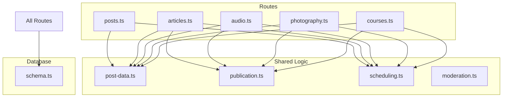
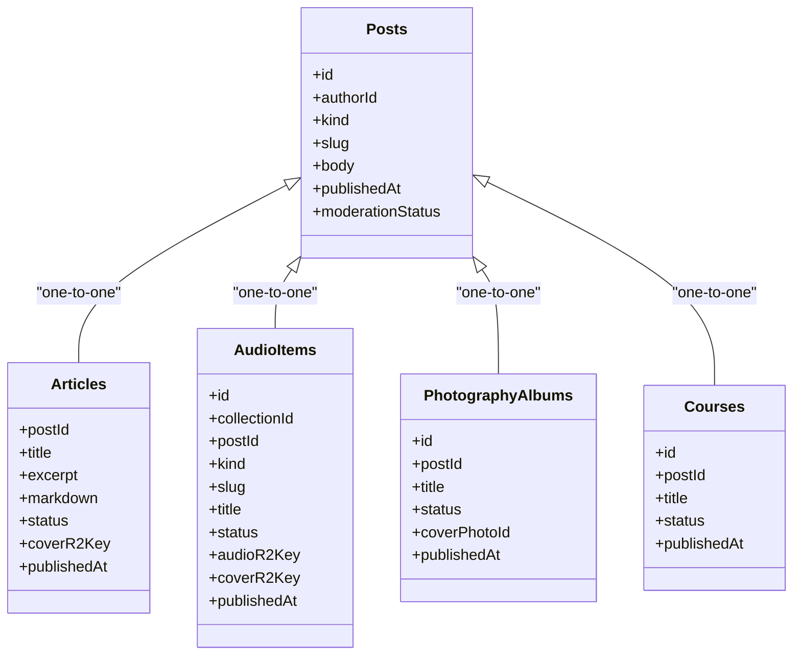
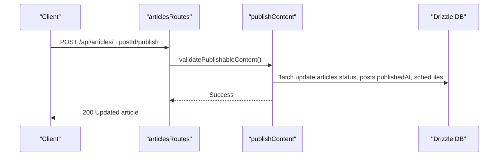
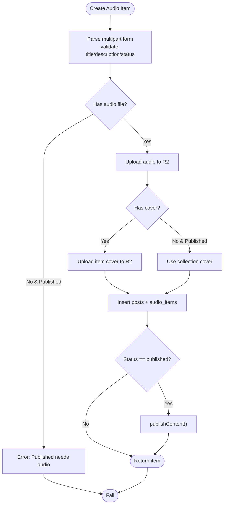
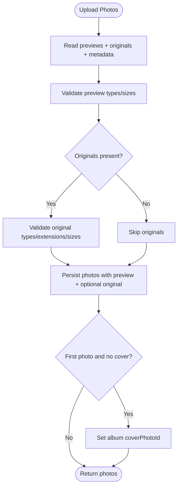
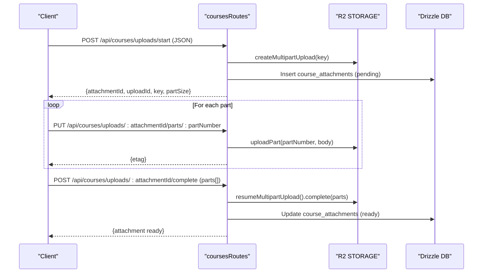

# Content Management Routes

<cite>
**Referenced Files in This Document**
- [posts.ts](file://src/worker/routes/posts.ts)
- [articles.ts](file://src/worker/routes/articles.ts)
- [audio.ts](file://src/worker/routes/audio.ts)
- [photography.ts](file://src/worker/routes/photography.ts)
- [courses.ts](file://src/worker/routes/courses.ts)
- [post-data.ts](file://src/worker/lib/post-data.ts)
- [publication.ts](file://src/worker/lib/publication.ts)
- [scheduling.ts](file://src/worker/lib/scheduling.ts)
- [moderation.ts](file://src/worker/lib/moderation.ts)
- [schema.ts](file://src/worker/db/schema.ts)
</cite>

## Table of Contents
1. Introduction
2. Project Structure
3. Core Components
4. Architecture Overview
5. Detailed Component Analysis
6. Dependency Analysis
7. Performance Considerations
8. Troubleshooting Guide
9. Conclusion

## Introduction
This document provides comprehensive documentation for the content management route handlers covering posts, articles, audio collections, photography albums, and courses. It explains CRUD operations, file upload handling, content versioning, publishing workflows, multi-format architecture, shared business logic patterns, media processing pipelines, thumbnail generation, CDN integration points, content relationships, tagging systems, and search functionality.

## Project Structure
The backend is implemented as a set of Hono route modules under src/worker/routes, each dedicated to a content type. Shared utilities live under src/worker/lib, and database models are defined in src/worker/db/schema.ts. The routes use middleware for authentication and authorization, Zod-based validation, and Drizzle ORM for data access.



**Diagram sources**
- [posts.ts](file://src/worker/routes/posts.ts)
- [articles.ts](file://src/worker/routes/articles.ts)
- [audio.ts](file://src/worker/routes/audio.ts)
- [photography.ts](file://src/worker/routes/photography.ts)
- [courses.ts](file://src/worker/routes/courses.ts)
- [post-data.ts](file://src/worker/lib/post-data.ts)
- [publication.ts](file://src/worker/lib/publication.ts)
- [scheduling.ts](file://src/worker/lib/scheduling.ts)
- [moderation.ts](file://src/worker/lib/moderation.ts)
- [schema.ts](file://src/worker/db/schema.ts)

**Section sources**
- [posts.ts](file://src/worker/routes/posts.ts)
- [articles.ts](file://src/worker/routes/articles.ts)
- [audio.ts](file://src/worker/routes/audio.ts)
- [photography.ts](file://src/worker/routes/photography.ts)
- [courses.ts](file://src/worker/routes/courses.ts)
- [post-data.ts](file://src/worker/lib/post-data.ts)
- [publication.ts](file://src/worker/lib/publication.ts)
- [scheduling.ts](file://src/worker/lib/scheduling.ts)
- [moderation.ts](file://src/worker/lib/moderation.ts)
- [schema.ts](file://src/worker/db/schema.ts)

## Core Components
- Posts: Short-form text with optional images and polls; supports replies, likes, saves, and scheduling.
- Articles: Markdown-based long-form content with cover images; draft/published lifecycle; scheduled publish.
- Audio Collections: Albums or podcasts containing music or podcast episodes; streaming endpoints; ordering.
- Photography Albums: Curated photo sets with preview/original assets; download controls; ordering.
- Courses: Structured learning with modules and lessons; large multipart uploads; progress tracking.

Key shared capabilities:
- File upload handling via Cloudflare R2 (STORAGE).
- Consistent slug generation and URL helpers.
- Unified publication pipeline and scheduling engine.
- Access control via creator membership checks.
- Rich post extras (likes, replies, attachments, polls).

**Section sources**
- [posts.ts](file://src/worker/routes/posts.ts)
- [articles.ts](file://src/worker/routes/articles.ts)
- [audio.ts](file://src/worker/routes/audio.ts)
- [photography.ts](file://src/worker/routes/photography.ts)
- [courses.ts](file://src/worker/routes/courses.ts)
- [post-data.ts](file://src/worker/lib/post-data.ts)
- [publication.ts](file://src/worker/lib/publication.ts)
- [scheduling.ts](file://src/worker/lib/scheduling.ts)
- [moderation.ts](file://src/worker/lib/moderation.ts)
- [schema.ts](file://src/worker/db/schema.ts)

## Architecture Overview
Content types share a common base “post” record that tracks kind, slug, body, moderation state, and publishedAt. Each content type adds its own entity table (articles, audio_items, photography_albums, courses) linked back to the post. Publishing transitions status fields and timestamps atomically through a centralized publication function. Scheduling uses a job queue-like table to defer publication until due.



**Diagram sources**
- [schema.ts](file://src/worker/db/schema.ts)
- [publication.ts](file://src/worker/lib/publication.ts)

**Section sources**
- [schema.ts](file://src/worker/db/schema.ts)
- [publication.ts](file://src/worker/lib/publication.ts)

## Detailed Component Analysis

### Posts API
- Create POST /api/posts: Supports JSON and multipart/form-data with images and polls. Validates sizes/types, generates slug, inserts post, attachments, poll, and optionally schedules publication.
- Update PATCH /api/posts/:postId: Draft-only editing with image replacement/removal and poll updates.
- Delete DELETE /api/posts/:postId: Removes post and associated attachments.
- Read GET /api/posts/by-slug/:username/:slug: Public read with access checks and reply serialization.
- Replies: GET/POST /api/posts/:postId/replies with attachment support and mention notifications.
- Likes: POST /api/posts/:postId/like toggles like state and notifies creators.

File upload handling:
- Images validated against allowed types and size limits; stored in R2 under posts/{postId}/{id}.
- Polls parsed from form fields with strict option counts and lengths.

Scheduling:
- If scheduledFor provided, a content schedule entry is created with nextAttemptAt and status pending.

Access control:
- Requires creator role for write endpoints.
- Read endpoints enforce moderation and account status, plus creator membership for private content.

Response shaping:
- Uses buildPostExtras to attach like counts, reply counts, viewer states, and polls.

**Section sources**
- [posts.ts](file://src/worker/routes/posts.ts)
- [post-data.ts](file://src/worker/lib/post-data.ts)

#### Posts Creation Flow
```mermaid
sequenceDiagram
participant Client as "Client"
participant Posts as "postsRoutes"
participant DB as "Drizzle DB"
participant Storage as "R2 STORAGE"
participant Schedule as "contentSchedules"
Client->>Posts : POST /api/posts (multipart or JSON)
Posts->>Posts : Validate body/images/poll
Posts->>DB : Insert posts
alt Has images
Posts->>Storage : Upload images
Posts->>DB : Insert post_attachments
end
opt Has poll
Posts->>DB : Insert post_polls + options
end
opt Scheduled
Posts->>Schedule : Insert schedule (pending)
else Immediate publish
Posts->>DB : Set publishedAt
Posts-->>Client : 201 Created
end
```

**Diagram sources**
- [posts.ts](file://src/worker/routes/posts.ts)
- [post-data.ts](file://src/worker/lib/post-data.ts)

### Articles API
- Create POST /api/articles: Multipart form with title, excerpt, markdown, status, and optional cover image. Creates post and article rows; if status=published, triggers publishContent.
- Update PATCH /api/articles/:postId: Updates fields; preserves publishedAt when remaining published; re-publishes if transitioning to published.
- Publish POST /api/articles/:postId/publish: Explicit publish endpoint.
- Read GET /api/articles/by-slug/:username/:slug and GET /api/articles/:postId: Enforces visibility rules and returns serialized article with extras and replies.
- Cover GET /api/articles/:postId/cover: Streams cover image with appropriate headers.

Validation and constraints:
- Title/excerpt/markdown length limits.
- Published articles require a cover image.

Publication workflow:
- Calls publishContent which validates prerequisites and updates statuses atomically.

**Section sources**
- [articles.ts](file://src/worker/routes/articles.ts)
- [publication.ts](file://src/worker/lib/publication.ts)

#### Article Publish Sequence


**Diagram sources**
- [articles.ts](file://src/worker/routes/articles.ts)
- [publication.ts](file://src/worker/lib/publication.ts)

### Audio Collections API
- Collections:
  - List GET /api/audio/collections/mine: Creator-scoped listing with item counts.
  - Create POST /api/audio/collections: Validates kind (album/podcast), title, description, status, releaseDate, cover.
  - Update PATCH /api/audio/collections/:collectionId: Prevents kind change; enforces cover requirement for published.
  - Delete DELETE /api/audio/collections/:collectionId: Fails if collection has items.
  - Order PUT /api/audio/collections/:collectionId/order: Reorders items within a collection.
- Items:
  - Create POST /api/audio/items: Creates post and audio item; requires audio file for published; cover can be item or collection-level.
  - Update PATCH /api/audio/items/:itemId: Allows metadata and media updates; prevents moving between collections.
  - Delete DELETE /api/audio/items/:itemId: Cleans up audio and cover files.
  - Stream GET /api/audio/items/:itemId/stream: Streams audio using R2.
  - Cover GET /api/audio/items/:itemId/cover: Streams item or collection cover.

Media handling:
- Audio files validated by type and size; stored under audio/items/{itemId}/source-{uuid}.
- Covers validated and stored under audio/items/{itemId}/cover-{uuid} or collections.

Access control:
- Creator ownership enforced; public reads require published status and active accounts.

**Section sources**
- [audio.ts](file://src/worker/routes/audio.ts)
- [post-data.ts](file://src/worker/lib/post-data.ts)

#### Audio Item Creation Flow


**Diagram sources**
- [audio.ts](file://src/worker/routes/audio.ts)

### Photography API
- Albums:
  - List GET /api/photography/albums/mine: Creator-scoped listing with photos.
  - Create POST /api/photography/albums: Draft-only creation; publishes after adding photos.
  - Update PATCH /api/photography/albums/:albumId: Enforces at least one published photo and a published cover for published status.
  - Delete DELETE /api/photography/albums/:albumId: Fails if album has photos.
  - Order PUT /api/photography/albums/:albumId/order: Reorders photos.
- Photos:
  - Create POST /api/photography/albums/:albumId/photos: Bulk upload previews and optional originals; metadata per photo.
  - Update PATCH /api/photography/photos/:photoId: Replace preview/original; update metadata.
  - Delete DELETE /api/photography/photos/:photoId: Deletes both preview and original; resets album cover if needed.
  - Preview GET /api/photography/photos/:photoId/preview: Streams preview.
  - Original GET /api/photography/photos/:photoId/original: Streams original if enabled.

Media handling:
- Previews validated and stored under photography/albums/{albumId}/photos/{photoId}/preview-{uuid}.
- Originals validated by type/extension and stored under same path with original-{uuid}.

Access control:
- Creator ownership required for writes; reads enforce moderation and account status.

**Section sources**
- [photography.ts](file://src/worker/routes/photography.ts)
- [post-data.ts](file://src/worker/lib/post-data.ts)

#### Photo Upload Flow


**Diagram sources**
- [photography.ts](file://src/worker/routes/photography.ts)

### Courses API
- Course CRUD:
  - Create POST /api/courses: Creates post and course; initial status draft.
  - Read GET /api/courses/by-slug/:username/:slug and GET /api/courses/:courseId: Returns structure with modules/lessons and progress.
  - Update PATCH /api/courses/:courseId: Partial updates; setting status=published triggers publish.
  - Publish POST /api/courses/:courseId/publish: Explicit publish.
  - Unpublish POST /api/courses/:courseId/unpublish: Sets draft and clears publishedAt.
  - Delete DELETE /api/courses/:courseId: Cleans up attachments.
- Modules and Lessons:
  - Create/Update/Delete modules and lessons with ordering endpoints.
  - Lesson publish requires either markdown content or an attachment ready.
- Attachments:
  - Multipart upload flow: start -> parts -> complete; supports range requests for streaming.
  - Attachment deletion cleans up R2 objects and aborts in-progress uploads.
- Progress:
  - PUT /api/courses/lessons/:lessonId/progress marks completion and returns aggregated progress.

Large file handling:
- Part size 8 MB; max sizes per kind (video/audio/file).
- Range parsing supports partial downloads for video/audio.

Access control:
- Owner-only writes; readers must have creator access or be owner; published content visible to subscribers.

**Section sources**
- [courses.ts](file://src/worker/routes/courses.ts)
- [post-data.ts](file://src/worker/lib/post-data.ts)

#### Course Attachment Upload Sequence


**Diagram sources**
- [courses.ts](file://src/worker/routes/courses.ts)

## Dependency Analysis
- Route modules depend on:
  - Authentication and role enforcement middleware.
  - Validation schemas (Zod) for request bodies and params.
  - Database client and schema definitions.
  - Shared utilities for media URLs, access checks, and post extras.
  - Publication and scheduling libraries for consistent lifecycle management.

Coupling and cohesion:
- High cohesion within each route module for domain-specific logic.
- Low coupling via shared libraries for cross-cutting concerns (publication, scheduling, moderation, post extras).

External dependencies:
- Cloudflare R2 storage accessed via c.env.STORAGE.
- Drizzle ORM for SQL queries.
- Hono framework for routing and context.

Potential circular dependencies:
- None detected; routes import shared libs but not vice versa.

**Section sources**
- [posts.ts](file://src/worker/routes/posts.ts)
- [articles.ts](file://src/worker/routes/articles.ts)
- [audio.ts](file://src/worker/routes/audio.ts)
- [photography.ts](file://src/worker/routes/photography.ts)
- [courses.ts](file://src/worker/routes/courses.ts)
- [post-data.ts](file://src/worker/lib/post-data.ts)
- [publication.ts](file://src/worker/lib/publication.ts)
- [scheduling.ts](file://src/worker/lib/scheduling.ts)
- [moderation.ts](file://src/worker/lib/moderation.ts)
- [schema.ts](file://src/worker/db/schema.ts)

## Performance Considerations
- Batched DB operations:
  - Posts update uses batch for multiple statements.
  - Publication batches updates across posts and entity tables.
- Parallelism:
  - buildPostExtras aggregates attachments, likes, replies, polls in parallel.
  - Reply serialization fetches attachments and like state concurrently.
- Streaming:
  - Courses attachments support HTTP Range for efficient large file delivery.
  - Audio stream and photo preview/original endpoints stream directly from R2.
- Limits and validations:
  - Strict size/type checks prevent oversized payloads and reduce downstream processing.
- Indexing:
  - Schema includes indexes for moderation, author, kind, and ordering fields to optimize queries.

[No sources needed since this section provides general guidance]

## Troubleshooting Guide
Common errors and resolutions:
- Validation failures:
  - Ensure multipart forms include required fields and valid types/sizes.
  - For articles, published status requires a cover image.
  - For audio items, published status requires audio and cover (item or collection).
  - For photography albums, published status requires at least one published photo and a published cover.
- Scheduling conflicts:
  - If content is being published now (processing), edits are blocked; retry later.
- Moderation blocks:
  - Hidden or moderated content cannot be edited/published until restored.
- Access denied:
  - Verify creator role for write endpoints; ensure subscriber entitlement for reading private content.
- Upload issues:
  - For courses, verify part numbers and sizes; ensure complete matches declared size.
  - Abort or delete incomplete uploads to avoid orphaned objects.

**Section sources**
- [posts.ts](file://src/worker/routes/posts.ts)
- [articles.ts](file://src/worker/routes/articles.ts)
- [audio.ts](file://src/worker/routes/audio.ts)
- [photography.ts](file://src/worker/routes/photography.ts)
- [courses.ts](file://src/worker/routes/courses.ts)
- [publication.ts](file://src/worker/lib/publication.ts)
- [scheduling.ts](file://src/worker/lib/scheduling.ts)
- [moderation.ts](file://src/worker/lib/moderation.ts)

## Conclusion
The content management system implements a robust, multi-format architecture centered around a unified post model and shared publication/scheduling mechanisms. Each content type extends core capabilities with specialized media handling, validation, and access control. The design emphasizes consistency, performance, and extensibility, enabling reliable CRUD operations, rich media workflows, and scalable publishing.

[No sources needed since this section summarizes without analyzing specific files]