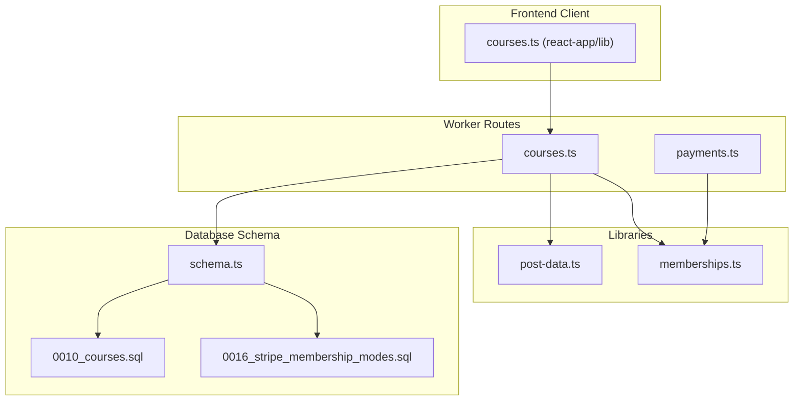
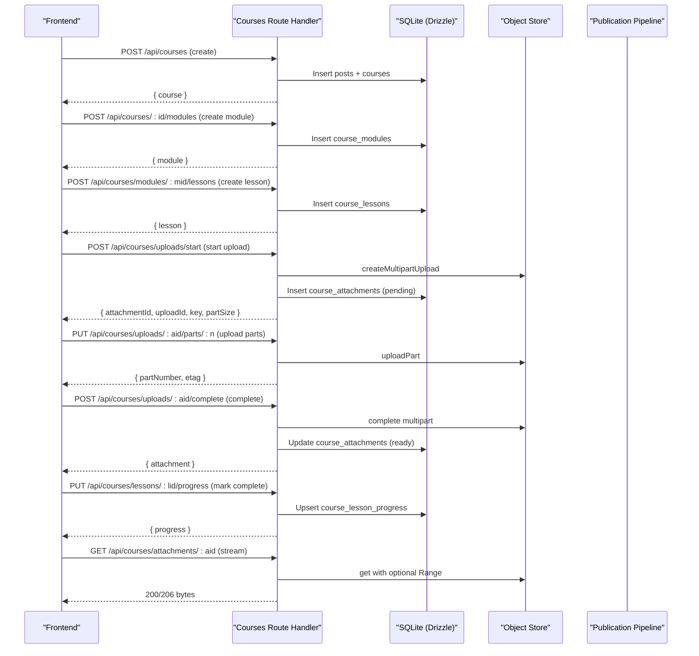
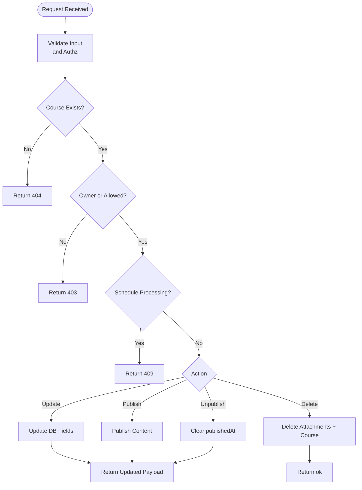
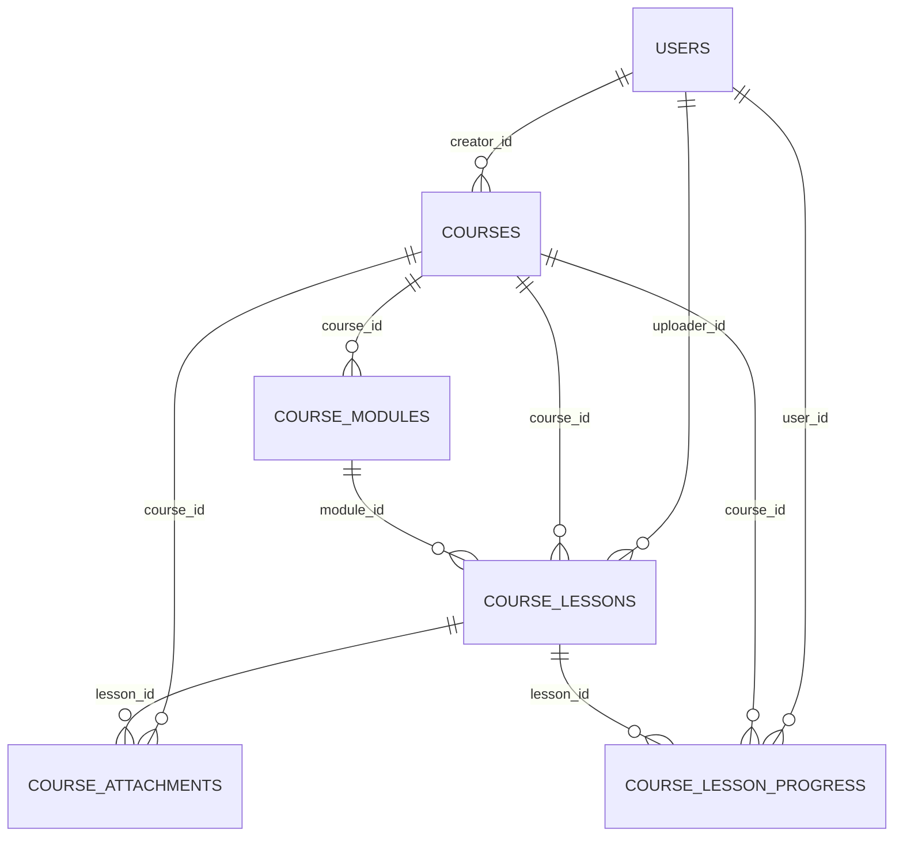
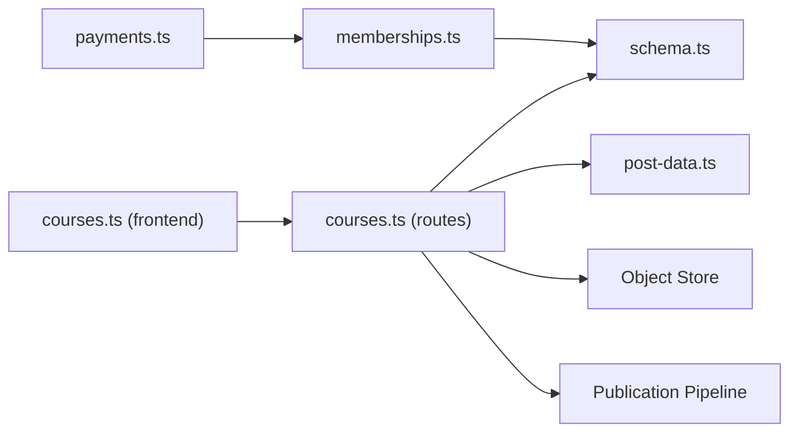

# Courses Routes

<cite>
**Referenced Files in This Document**
- [courses.ts](file://src/worker/routes/courses.ts)
- [0010_courses.sql](file://drizzle/0010_courses.sql)
- [schema.ts](file://src/worker/db/schema.ts)
- [post-data.ts](file://src/worker/lib/post-data.ts)
- [payments.ts](file://src/worker/routes/payments.ts)
- [memberships.ts](file://src/worker/lib/memberships.ts)
- [0016_stripe_membership_modes.sql](file://drizzle/0016_stripe_membership_modes.sql)
- [courses.ts (frontend)](file://src/react-app/lib/courses.ts)
</cite>

## Table of Contents
1. Introduction
2. Project Structure
3. Core Components
4. Architecture Overview
5. Detailed Component Analysis
6. Dependency Analysis
7. Performance Considerations
8. Troubleshooting Guide
9. Conclusion

## Introduction
This document provides comprehensive API documentation for the courses route handler, covering course creation, lesson management, enrollment systems, and progress tracking. It explains how modules and lessons are structured, how attachments (including video and audio) are uploaded and served, how access control integrates with creator subscriptions, and how learning progress is persisted. It also outlines integration points with Stripe payments and membership modes to support subscription-based access to courses.

## Project Structure
The courses feature is implemented as a Hono-based worker route module that interacts with a SQLite database via Drizzle ORM. The schema defines entities for courses, modules, lessons, attachments, and progress. Access control is enforced through a membership system tied to creator subscriptions.

**Diagram sources**
- [courses.ts](file://src/worker/routes/courses.ts)
- [payments.ts](file://src/worker/routes/payments.ts)
- [post-data.ts](file://src/worker/lib/post-data.ts)
- [memberships.ts](file://src/worker/lib/memberships.ts)
- [schema.ts](file://src/worker/db/schema.ts)
- [0010_courses.sql](file://drizzle/0010_courses.sql)
- [0016_stripe_membership_modes.sql](file://drizzle/0016_stripe_membership_modes.sql)
- [courses.ts (frontend)](file://src/react-app/lib/courses.ts)

**Section sources**
- [courses.ts](file://src/worker/routes/courses.ts)
- [0010_courses.sql](file://drizzle/0010_courses.sql)
- [schema.ts](file://src/worker/db/schema.ts)
- [post-data.ts](file://src/worker/lib/post-data.ts)
- [payments.ts](file://src/worker/routes/payments.ts)
- [memberships.ts](file://src/worker/lib/memberships.ts)
- [0016_stripe_membership_modes.sql](file://drizzle/0016_stripe_membership_modes.sql)
- [courses.ts (frontend)](file://src/react-app/lib/courses.ts)

## Core Components
- Course CRUD: Create, read, update, delete courses; publish/unpublish; list owned courses.
- Module Management: Create, update, reorder, delete modules within a course.
- Lesson Management: Create, update, reorder, delete lessons within a module; draft/publish workflow.
- Attachments: Multipart upload for video/audio/file assets; range requests for streaming; deletion.
- Progress Tracking: Mark lessons complete/incomplete; compute completion counts.
- Access Control: Enforce ownership and creator subscription entitlements using hasCreatorAccess.
- Integration Points: Publication pipeline for content visibility; Stripe membership modes for paid/free/trial plans.

Key endpoints include:
- POST /api/courses — create course
- GET /api/courses/mine — list creator’s courses
- GET /api/courses/:courseId — get course details
- PATCH /api/courses/:courseId — update course metadata/status
- POST /api/courses/:courseId/publish — publish course
- POST /api/courses/:courseId/unpublish — unpublish course
- DELETE /api/courses/:courseId — delete course
- POST /api/courses/:courseId/modules — create module
- PATCH /api/courses/modules/:moduleId — update module
- PUT /api/courses/:courseId/modules/order — reorder modules
- DELETE /api/courses/modules/:moduleId — delete module
- POST /api/courses/modules/:moduleId/lessons — create lesson
- PATCH /api/courses/lessons/:lessonId — update lesson
- PUT /api/courses/modules/:moduleId/lessons/order — reorder lessons
- DELETE /api/courses/lessons/:lessonId — delete lesson
- POST /api/courses/uploads/start — start multipart upload
- PUT /api/courses/uploads/:attachmentId/parts/:partNumber — upload part
- POST /api/courses/uploads/:attachmentId/complete — complete upload
- DELETE /api/courses/attachments/:attachmentId — delete attachment
- GET /api/courses/attachments/:attachmentId — stream attachment with Range support
- PUT /api/courses/lessons/:lessonId/progress — mark lesson completed or not

**Section sources**
- [courses.ts](file://src/worker/routes/courses.ts)

## Architecture Overview
The courses API follows a layered architecture:
- Route handlers validate inputs, enforce roles and ownership, and orchestrate business logic.
- Data access uses Drizzle ORM against SQLite tables defined by the schema.
- Access control relies on membership entitlement checks against subscription memberships.
- Media storage uses an R2-compatible object store with multipart uploads and byte-range streaming.
- Content publication integrates with a publishing pipeline to manage visibility and moderation.

**Diagram sources**
- [courses.ts](file://src/worker/routes/courses.ts)
- [0010_courses.sql](file://drizzle/0010_courses.sql)

## Detailed Component Analysis

### Course Lifecycle Endpoints
- Creation: Validates payload, creates post and course records, returns enriched course payload including owner flags and initial structure.
- Retrieval: By ID or by username/slug; enforces moderation and account status; includes replies and post extras.
- Updates: Partial updates for title/description/status; prevents edits during scheduling processing; toggling to published triggers publication flow.
- Publish/Unpublish: Publish invokes publication pipeline; unpublish clears publishedAt timestamps on both course and post.
- Deletion: Deletes course and associated attachments; aborts any pending multipart uploads.

**Diagram sources**
- [courses.ts](file://src/worker/routes/courses.ts)

**Section sources**
- [courses.ts](file://src/worker/routes/courses.ts)

### Module and Lesson Management
- Modules: Create with title/description; update fields; reorder by itemIds array; delete cascades to lessons and cleans up attachments.
- Lessons: Create with title/summary/markdown; cannot be created as published directly; must save as draft then publish after content validation; update supports partial fields and status transitions; reorder validated against existing lessons; delete cascades to attachments.

Validation rules:
- Publishing a lesson requires either markdown content or at least one ready attachment.
- Reordering endpoints verify that provided itemIds match existing items exactly.

**Section sources**
- [courses.ts](file://src/worker/routes/courses.ts)

### Attachment Upload and Streaming
- Start: Validates kind/contentType size limits; creates multipart upload; persists pending attachment record.
- Parts: Streams chunked data; validates uploader and active state; returns part etags.
- Complete: Verifies final size matches declared size; marks attachment ready; returns serialized attachment.
- Stream: Supports HTTP Range for efficient video/audio streaming; enforces course/lesson visibility and creator access.

Constraints:
- Max sizes per kind: video 2GB, audio 1GB, file 250MB.
- Part numbers must be between 1 and 10,000.
- Range header parsing supports suffix ranges and clamps end to file size.

**Section sources**
- [courses.ts](file://src/worker/routes/courses.ts)

### Enrollment Systems and Access Control
- Creator access check: Determines if a viewer is entitled to access a creator’s content based on active or valid trial membership.
- Course detail responses include hasAccess flag and progress only when access is granted.
- Attachment streaming requires either ownership or creator subscription entitlement.

Membership models:
- Plans can be disabled, free_permanent, free_trial, or paid.
- Subscriptions have statuses like active or trialing with trial end times.
- Entitlement condition considers active status or non-expired trials.

**Section sources**
- [post-data.ts](file://src/worker/lib/post-data.ts)
- [memberships.ts](file://src/worker/lib/memberships.ts)
- [0016_stripe_membership_modes.sql](file://drizzle/0016_stripe_membership_modes.sql)

### Progress Tracking
- Marking a lesson complete inserts or updates a progress record with timestamp; marking incomplete deletes the record.
- Progress response returns completedLessons count among published lessons for the course.
- Course payload aggregates progress when access is granted.

**Section sources**
- [courses.ts](file://src/worker/routes/courses.ts)

### Data Model Relationships

**Diagram sources**
- [0010_courses.sql](file://drizzle/0010_courses.sql)
- [schema.ts](file://src/worker/db/schema.ts)

**Section sources**
- [0010_courses.sql](file://drizzle/0010_courses.sql)
- [schema.ts](file://src/worker/db/schema.ts)

### Stripe Payments and Subscription Integration
- Membership plans support modes: disabled, free_permanent, free_trial, paid.
- Plan prices are indexed by provider and price id; subscriptions track plan_price_id and provider events.
- Transitions handle cancellation at period end with retries and error logging.
- Payment webhooks capture event lifecycle and status transitions.

Integration points relevant to courses:
- Access to course content depends on active or valid trial memberships.
- Frontend client exposes functions for creating/updating courses and managing lessons, which rely on backend access control.

**Section sources**
- [payments.ts](file://src/worker/routes/payments.ts)
- [memberships.ts](file://src/worker/lib/memberships.ts)
- [0016_stripe_membership_modes.sql](file://drizzle/0016_stripe_membership_modes.sql)
- [courses.ts (frontend)](file://src/react-app/lib/courses.ts)

## Dependency Analysis
- Route handlers depend on:
  - Database schema for queries and mutations.
  - Access control utilities for membership checks.
  - Object store for media operations.
  - Publication pipeline for content visibility.
- Frontend client depends on:
  - API wrappers for REST calls.
  - Types mirroring server payloads.

**Diagram sources**
- [courses.ts (frontend)](file://src/react-app/lib/courses.ts)
- [courses.ts](file://src/worker/routes/courses.ts)
- [schema.ts](file://src/worker/db/schema.ts)
- [post-data.ts](file://src/worker/lib/post-data.ts)
- [payments.ts](file://src/worker/routes/payments.ts)
- [memberships.ts](file://src/worker/lib/memberships.ts)

**Section sources**
- [courses.ts (frontend)](file://src/react-app/lib/courses.ts)
- [courses.ts](file://src/worker/routes/courses.ts)
- [schema.ts](file://src/worker/db/schema.ts)
- [post-data.ts](file://src/worker/lib/post-data.ts)
- [payments.ts](file://src/worker/routes/payments.ts)
- [memberships.ts](file://src/worker/lib/memberships.ts)

## Performance Considerations
- Use batched DB operations where possible (e.g., unpublish updates).
- Leverage indexes defined in schema for ordering and filtering (display_order, course_id, status, published_at).
- Support HTTP Range for large media to avoid full downloads.
- Avoid unnecessary joins in high-frequency reads; fetch only required fields.
- Validate and reject oversized uploads early to reduce bandwidth waste.

[No sources needed since this section provides general guidance]

## Troubleshooting Guide
Common errors and resolutions:
- Validation failures: Ensure JSON payloads conform to schemas; check field lengths and enums.
- Schedule processing conflicts: Wait until processing completes before editing or deleting.
- Attachment upload issues: Verify part numbers, content types, and size declarations; ensure upload is still active.
- Access denied: Confirm user has creator subscription entitlement or is the course owner.
- Not found: Check IDs and slugs; ensure course and lesson are published when required.

Operational tips:
- Inspect error responses for codes like schedule_processing, validation_failed, upload_failed.
- For media streaming, confirm Range headers and ETag handling.
- For progress updates, ensure lesson and course are published and user has access.

**Section sources**
- [courses.ts](file://src/worker/routes/courses.ts)

## Conclusion
The courses route handler provides a robust foundation for building educational content platforms with structured modules and lessons, secure media delivery, and subscription-based access control. Integration with Stripe membership modes enables flexible pricing strategies, while progress tracking supports learner engagement. Proper use of validation, access control, and performance optimizations ensures a reliable and scalable experience.

[No sources needed since this section summarizes without analyzing specific files]