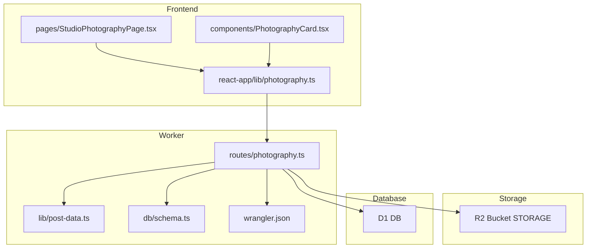
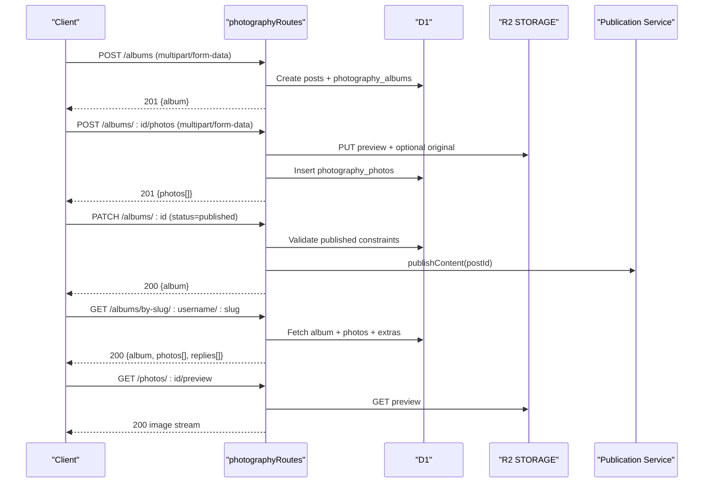
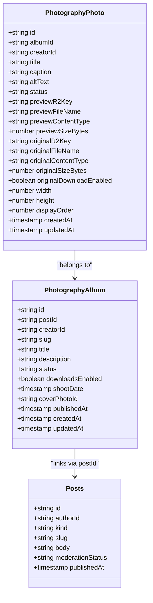
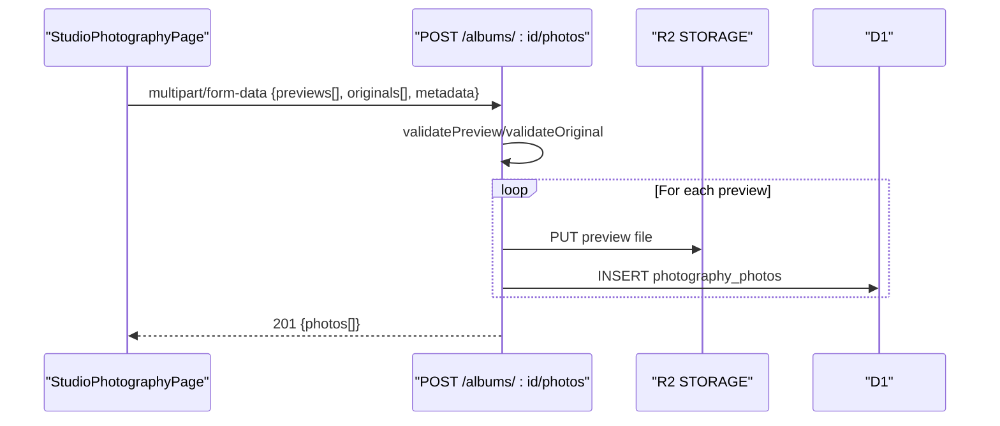
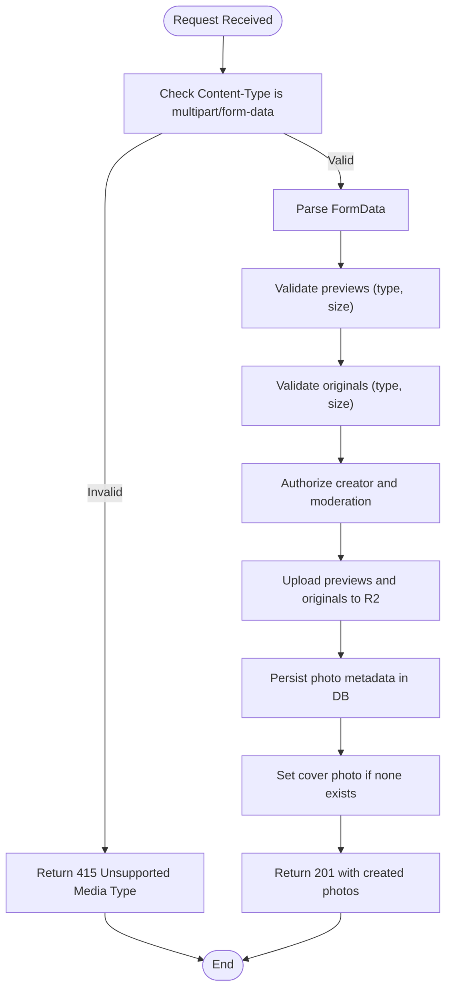
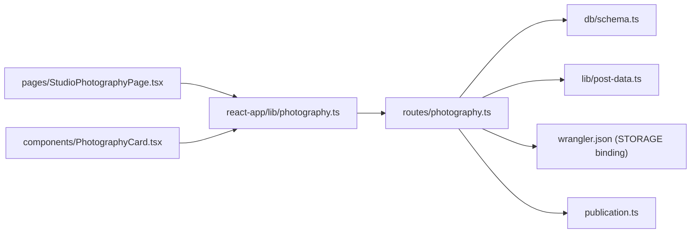

# Photography Routes

<cite>
**Referenced Files in This Document**
- [photography.ts](file://src/worker/routes/photography.ts)
- [post-data.ts](file://src/worker/lib/post-data.ts)
- [schema.ts](file://src/worker/db/schema.ts)
- [0008_photography.sql](file://drizzle/0008_photography.sql)
- [wrangler.json](file://wrangler.json)
- [photography.ts](file://src/react-app/lib/photography.ts)
- [StudioPhotographyPage.tsx](file://src/react-app/pages/StudioPhotographyPage.tsx)
- [PhotographyCard.tsx](file://src/react-app/components/PhotographyCard.tsx)
</cite>

## Table of Contents
1. [Introduction](#introduction)
2. [Project Structure](#project-structure)
3. [Core Components](#core-components)
4. [Architecture Overview](#architecture-overview)
5. [Detailed Component Analysis](#detailed-component-analysis)
6. [Dependency Analysis](#dependency-analysis)
7. [Performance Considerations](#performance-considerations)
8. [Troubleshooting Guide](#troubleshooting-guide)
9. [Conclusion](#conclusion)
10. [Appendices](#appendices)

## Introduction
This document provides detailed API documentation for the photography route handler, covering album management, photo uploads, metadata handling, and gallery features. It explains endpoints for creating albums, uploading high-resolution images, managing photo metadata (titles, captions, alt text), ordering photos, and serving previews and originals. It also documents image processing workflows, format validation, size limits, R2 storage integration, CDN optimization headers, and social sharing capabilities via post-like/reply interactions.

## Project Structure
The photography feature is implemented as a Hono-based worker route with:
- Route handlers for CRUD operations on albums and photos
- Validation and parsing utilities for multipart form data
- Storage integration with Cloudflare R2 for preview and original files
- Database models using Drizzle ORM for albums and photos
- Frontend client library and pages that consume these APIs

**Diagram sources**
- [photography.ts](file://src/worker/routes/photography.ts)
- [post-data.ts](file://src/worker/lib/post-data.ts)
- [schema.ts](file://src/worker/db/schema.ts)
- [wrangler.json](file://wrangler.json)
- [photography.ts](file://src/react-app/lib/photography.ts)
- [StudioPhotographyPage.tsx](file://src/react-app/pages/StudioPhotographyPage.tsx)
- [PhotographyCard.tsx](file://src/react-app/components/PhotographyCard.tsx)

**Section sources**
- [photography.ts](file://src/worker/routes/photography.ts)
- [post-data.ts](file://src/worker/lib/post-data.ts)
- [schema.ts](file://src/worker/db/schema.ts)
- [wrangler.json](file://wrangler.json)
- [photography.ts](file://src/react-app/lib/photography.ts)
- [StudioPhotographyPage.tsx](file://src/react-app/pages/StudioPhotographyPage.tsx)
- [PhotographyCard.tsx](file://src/react-app/components/PhotographyCard.tsx)

## Core Components
- Album entity: stores title, description, status, downloadsEnabled, shootDate, coverPhotoId, timestamps, and links to a post for moderation and social features.
- Photo entity: stores per-image metadata (title, caption, altText), status, preview/original file references, dimensions, displayOrder, and download permissions.
- Upload pipeline: validates input types/sizes, uploads preview and optional original to R2, persists metadata, sets cover photo if missing, and returns serialized results.
- Ordering endpoint: updates displayOrder for all photos in an album atomically based on provided order.
- Access control: enforces creator ownership, moderation visibility, and member-only download rules.

**Section sources**
- [schema.ts](file://src/worker/db/schema.ts)
- [0008_photography.sql](file://drizzle/0008_photography.sql)
- [photography.ts](file://src/worker/routes/photography.ts)

## Architecture Overview
The photography routes expose REST endpoints under /api/photography. They integrate with:
- D1 database for album/photo metadata
- R2 object storage for preview and original images
- Post system for moderation, likes, replies, and scheduling

**Diagram sources**
- [photography.ts](file://src/worker/routes/photography.ts)
- [post-data.ts](file://src/worker/lib/post-data.ts)

## Detailed Component Analysis

### Endpoints Summary
- GET /api/photography/albums/mine
- POST /api/photography/albums
- PATCH /api/photography/albums/:albumId
- DELETE /api/photography/albums/:albumId
- POST /api/photography/albums/:albumId/photos
- PATCH /api/photography/photos/:photoId
- DELETE /api/photography/photos/:photoId
- PUT /api/photography/albums/:albumId/order
- GET /api/photography/albums/by-slug/:username/:slug
- GET /api/photography/photos/:photoId/preview
- GET /api/photography/photos/:photoId/original

#### Authentication and Authorization
- All write endpoints require authentication and creator role.
- Read endpoints require authentication; access is validated against post membership and moderation state.
- Original downloads require both album-level downloadsEnabled and per-photo originalDownloadEnabled.

**Section sources**
- [photography.ts](file://src/worker/routes/photography.ts)

#### Album Management
- Create album:
  - Method: POST /api/photography/albums
  - Content-Type: multipart/form-data
  - Fields: title, description, status (draft|published), downloadsEnabled (boolean), shootDate (optional date string)
  - Behavior: Creates a post record, generates unique slug, inserts album row, returns serialized album
  - Constraints: status must be draft at creation time
- Update album:
  - Method: PATCH /api/photography/albums/:albumId
  - Fields: same as create
  - Behavior: Updates post body and album fields; preserves publishedAt when remaining published; triggers publication flow when transitioning to published
  - Validation: Published albums require a published cover photo and at least one published photo
- Delete album:
  - Method: DELETE /api/photography/albums/:albumId
  - Behavior: Requires empty album (no photos); deletes associated post; returns success
- List mine:
  - Method: GET /api/photography/albums/mine
  - Behavior: Returns albums owned by authenticated user with their photos ordered by displayOrder

**Section sources**
- [photography.ts](file://src/worker/routes/photography.ts)

#### Photo Upload and Metadata
- Upload photos:
  - Method: POST /api/photography/albums/:albumId/photos
  - Content-Type: multipart/form-data
  - Fields:
    - previews[]: required array of preview images (JPEG, PNG, WebP; max 10 MB each; up to 30 files)
    - originals[]: optional array of original files (JPEG, PNG, WebP, TIFF, RAW formats; max 90 MB each)
    - metadata: JSON string array aligned with previews, each item may include title, caption, altText, status (draft|published), originalDownloadEnabled
  - Behavior: Validates types and sizes, uploads previews and originals to R2, inserts photo rows with displayOrder, auto-sets cover photo if none exists
- Update photo:
  - Method: PATCH /api/photography/photos/:photoId
  - Fields: title, caption, altText, status, originalDownloadEnabled, optional preview and original replacements
  - Behavior: Replaces files if provided, deletes old files from R2, updates metadata
- Delete photo:
  - Method: DELETE /api/photography/photos/:photoId
  - Behavior: Removes photo row and associated files; resets album cover and unpublishes album if needed

**Section sources**
- [photography.ts](file://src/worker/routes/photography.ts)

#### Ordering Photos
- Reorder photos:
  - Method: PUT /api/photography/albums/:albumId/order
  - Body: { photoIds: string[] }
  - Behavior: Validates permutation of existing photo IDs; updates displayOrder for each photo in sequence

**Section sources**
- [photography.ts](file://src/worker/routes/photography.ts)

#### Gallery and Detail Views
- Get album by slug:
  - Method: GET /api/photography/albums/by-slug/:username/:slug
  - Behavior: Enforces access control; returns album, photos, and replies; includes post extras like like counts and viewer states
- Preview and original streams:
  - GET /api/photography/photos/:photoId/preview
  - GET /api/photography/photos/:photoId/original
  - Behavior: Streams content from R2 with appropriate content-type and cache-control headers; original requires permission checks

**Section sources**
- [photography.ts](file://src/worker/routes/photography.ts)

### Image Processing Workflows and Validation
- Allowed preview types: JPEG, PNG, WebP
- Allowed original types: JPEG, PNG, WebP, TIFF, and common RAW formats (CR2, CR3, NEF, ARW, RAF, ORF, RW2, DNG)
- Size limits:
  - Preview: up to 10 MB
  - Original: up to 90 MB
- Extension/type validation ensures safe upload and correct content-type handling
- No server-side thumbnail generation or EXIF extraction is performed; previews are stored as uploaded; originals are preserved verbatim

**Section sources**
- [post-data.ts](file://src/worker/lib/post-data.ts)
- [photography.ts](file://src/worker/routes/photography.ts)

### R2 Storage Integration
- Preview and original files are stored under structured keys:
  - photography/albums/{albumId}/photos/{photoId}/preview-{uuid}.{ext}
  - photography/albums/{albumId}/photos/{photoId}/original-{uuid}.{ext}
- Content-type metadata is set on upload
- Deletion occurs on replacement or deletion of photos

**Section sources**
- [photography.ts](file://src/worker/routes/photography.ts)
- [wrangler.json](file://wrangler.json)

### CDN Optimization and Headers
- Preview responses include:
  - content-type set to image type
  - cache-control: private, max-age=300
  - content-disposition inline with filename
  - content-length set
- Original responses include:
  - content-type set to original type
  - cache-control: private, max-age=300
  - content-disposition attachment with filename
  - content-length set

**Section sources**
- [photography.ts](file://src/worker/routes/photography.ts)

### Social Sharing and Moderation
- Albums are backed by posts, enabling:
  - Like/unlike actions
  - Replies and reply counts
  - Save/bookmark functionality
  - Moderation status enforcement
- Publication flow integrates with a publication service to handle publishing and errors

**Section sources**
- [post-data.ts](file://src/worker/lib/post-data.ts)
- [photography.ts](file://src/worker/routes/photography.ts)

### Data Models and Schema
- photography_albums: id, postId, creatorId, slug, title, description, status, downloadsEnabled, shootDate, coverPhotoId, publishedAt, createdAt, updatedAt
- photography_photos: id, albumId, creatorId, title, caption, altText, status, previewR2Key, previewFileName, previewContentType, previewSizeBytes, originalR2Key, originalFileName, originalContentType, originalSizeBytes, originalDownloadEnabled, width, height, displayOrder, createdAt, updatedAt

**Section sources**
- [schema.ts](file://src/worker/db/schema.ts)
- [0008_photography.sql](file://drizzle/0008_photography.sql)

### Class Diagram

**Diagram sources**
- [schema.ts](file://src/worker/db/schema.ts)
- [0008_photography.sql](file://drizzle/0008_photography.sql)

### Sequence Diagram: Upload Flow

**Diagram sources**
- [photography.ts](file://src/worker/routes/photography.ts)
- [StudioPhotographyPage.tsx](file://src/react-app/pages/StudioPhotographyPage.tsx)

### Flowchart: Validation and Upload

**Diagram sources**
- [photography.ts](file://src/worker/routes/photography.ts)

## Dependency Analysis
- The photography routes depend on:
  - Drizzle ORM schema definitions for queries and mutations
  - post-data utilities for URL helpers, constants, and post extras
  - R2 binding for object storage
  - D1 database for persistence
  - Publication service for publishing workflow
- Frontend depends on the client library functions which call the API endpoints

**Diagram sources**
- [photography.ts](file://src/worker/routes/photography.ts)
- [schema.ts](file://src/worker/db/schema.ts)
- [post-data.ts](file://src/worker/lib/post-data.ts)
- [wrangler.json](file://wrangler.json)
- [photography.ts](file://src/react-app/lib/photography.ts)
- [StudioPhotographyPage.tsx](file://src/react-app/pages/StudioPhotographyPage.tsx)
- [PhotographyCard.tsx](file://src/react-app/components/PhotographyCard.tsx)

**Section sources**
- [photography.ts](file://src/worker/routes/photography.ts)
- [schema.ts](file://src/worker/db/schema.ts)
- [post-data.ts](file://src/worker/lib/post-data.ts)
- [wrangler.json](file://wrangler.json)
- [photography.ts](file://src/react-app/lib/photography.ts)
- [StudioPhotographyPage.tsx](file://src/react-app/pages/StudioPhotographyPage.tsx)
- [PhotographyCard.tsx](file://src/react-app/components/PhotographyCard.tsx)

## Performance Considerations
- Batch uploads support up to 30 previews per request; consider chunking large batches to avoid timeouts
- R2 operations are asynchronous; ensure proper error handling and retries for network failures
- Cache-Control headers are set to short-lived private caching; adjust as needed for CDN behavior
- Avoid unnecessary re-uploads by checking file changes before replacing originals/previews
- Use efficient queries with indexes defined on album/photo tables for ordering and filtering

[No sources needed since this section provides general guidance]

## Troubleshooting Guide
Common issues and resolutions:
- Unsupported media type: Ensure Content-Type is multipart/form-data and files match allowed types
- Payload too large: Respect preview (10 MB) and original (90 MB) limits
- Validation failed: Provide required fields and adhere to length constraints; ensure metadata JSON is valid and aligned with previews
- Schedule processing: Cannot edit while content is being published; wait until processing completes
- Not found: Verify album/photo IDs exist and belong to the authenticated user
- Forbidden: Ownership and moderation checks failed; ensure user has creator role and content is not moderated

**Section sources**
- [photography.ts](file://src/worker/routes/photography.ts)

## Conclusion
The photography routes provide a robust system for managing albums and photos with secure uploads, metadata handling, ordering, and streaming of previews and originals. Integration with R2 and D1 ensures scalable storage and reliable persistence, while post-backed moderation and social features enable community engagement. The frontend offers intuitive tools for creators to manage their photography collections effectively.

[No sources needed since this section summarizes without analyzing specific files]

## Appendices

### API Endpoint Reference
- GET /api/photography/albums/mine
  - Response: { albums: AlbumSummary[] }
- POST /api/photography/albums
  - Request: multipart/form-data { title, description, status, downloadsEnabled, shootDate }
  - Response: { album: AlbumSummary | null }, 201
- PATCH /api/photography/albums/:albumId
  - Request: multipart/form-data { title, description, status, downloadsEnabled, shootDate, coverPhotoId }
  - Response: { album: AlbumSummary | null }
- DELETE /api/photography/albums/:albumId
  - Response: { ok: true }
- POST /api/photography/albums/:albumId/photos
  - Request: multipart/form-data { previews[], originals[], metadata[] }
  - Response: { photos: PhotoSummary[] }, 201
- PATCH /api/photography/photos/:photoId
  - Request: multipart/form-data { title, caption, altText, status, originalDownloadEnabled, preview?, original? }
  - Response: { photo: PhotoSummary | null }
- DELETE /api/photography/photos/:photoId
  - Response: { ok: true }
- PUT /api/photography/albums/:albumId/order
  - Request: { photoIds: string[] }
  - Response: { ok: true }
- GET /api/photography/albums/by-slug/:username/:slug
  - Response: { album: AlbumSummary, photos: PhotoSummary[], replies: Reply[] }
- GET /api/photography/photos/:photoId/preview
  - Response: image stream
- GET /api/photography/photos/:photoId/original
  - Response: original file stream (permission-gated)

**Section sources**
- [photography.ts](file://src/worker/routes/photography.ts)
- [post-data.ts](file://src/worker/lib/post-data.ts)

### Frontend Usage Notes
- Client library functions encapsulate API calls for albums and photos
- Studio page supports drag-and-drop reordering and batch uploads
- Card component displays album previews and social actions

**Section sources**
- [photography.ts](file://src/react-app/lib/photography.ts)
- [StudioPhotographyPage.tsx](file://src/react-app/pages/StudioPhotographyPage.tsx)
- [PhotographyCard.tsx](file://src/react-app/components/PhotographyCard.tsx)