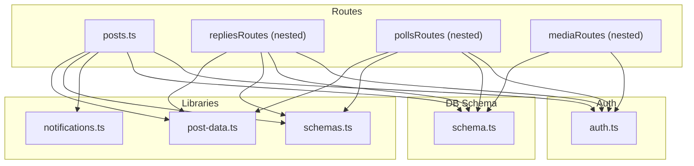
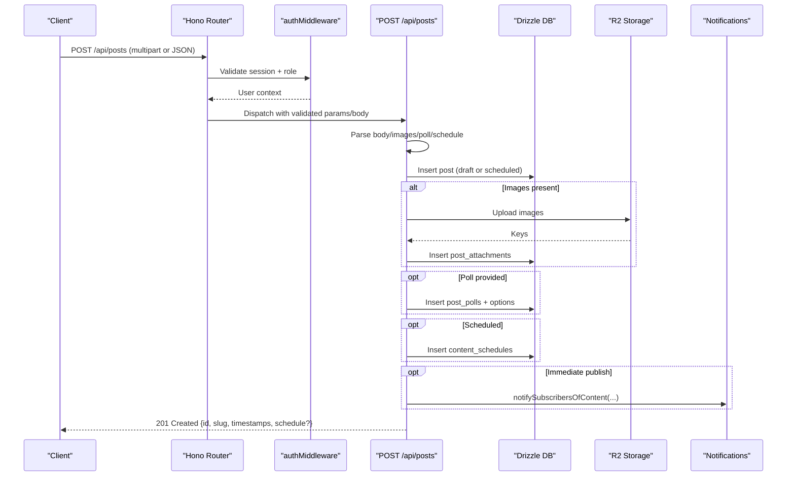
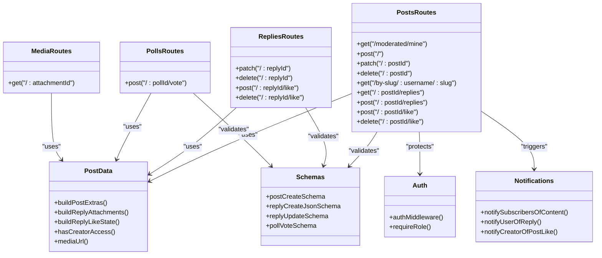
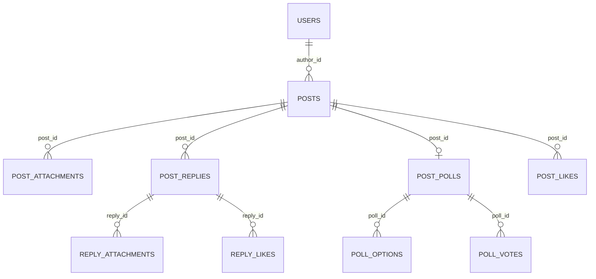

# Posts Routes

<cite>
**Referenced Files in This Document**
- [posts.ts](file://src/worker/routes/posts.ts)
- [post-data.ts](file://src/worker/lib/post-data.ts)
- [schemas.ts](file://src/worker/lib/schemas.ts)
- [schema.ts](file://src/worker/db/schema.ts)
- [auth.ts](file://src/worker/middleware/auth.ts)
- [notifications.ts](file://src/worker/lib/notifications.ts)
</cite>

## Table of Contents
1. [Introduction](#introduction)
2. [Project Structure](#project-structure)
3. [Core Components](#core-components)
4. [Architecture Overview](#architecture-overview)
5. [Detailed Component Analysis](#detailed-component-analysis)
6. [Dependency Analysis](#dependency-analysis)
7. [Performance Considerations](#performance-considerations)
8. [Troubleshooting Guide](#troubleshooting-guide)
9. [Conclusion](#conclusion)
10. [Appendices](#appendices)

## Introduction
This document provides comprehensive API documentation for the posts route handler and its nested resources. It covers:
- Creating, updating, and deleting short-form posts (drafts) with image attachments and polls
- Retrieving published posts by username and slug
- Nested replies and reply likes
- Post likes and poll voting
- Media attachment retrieval via a unified media endpoint
- Authentication, validation, error handling, file upload processing, and notification triggers
- The multi-format content architecture where posts act as a unified container for different content types (articles, audio, photography, courses), while this module focuses on the “post” kind

## Project Structure
The posts API is implemented using Hono routes with Zod-based validation and Drizzle ORM queries. Core files:
- Route handlers: src/worker/routes/posts.ts
- Shared utilities and data builders: src/worker/lib/post-data.ts
- Request/response schemas: src/worker/lib/schemas.ts
- Database schema definitions: src/worker/db/schema.ts
- Authentication middleware: src/worker/middleware/auth.ts
- Notification helpers: src/worker/lib/notifications.ts

**Diagram sources**
- [posts.ts:1-64](file://src/worker/routes/posts.ts#L1-L64)
- [post-data.ts:1-43](file://src/worker/lib/post-data.ts#L1-L43)
- [schemas.ts:25-66](file://src/worker/lib/schemas.ts#L25-L66)
- [schema.ts:167-188](file://src/worker/db/schema.ts#L167-L188)
- [auth.ts:23-56](file://src/worker/middleware/auth.ts#L23-L56)
- [notifications.ts:257-388](file://src/worker/lib/notifications.ts#L257-L388)

**Section sources**
- [posts.ts:1-64](file://src/worker/routes/posts.ts#L1-L64)
- [post-data.ts:1-43](file://src/worker/lib/post-data.ts#L1-L43)
- [schemas.ts:25-66](file://src/worker/lib/schemas.ts#L25-L66)
- [schema.ts:167-188](file://src/worker/db/schema.ts#L167-L188)
- [auth.ts:23-56](file://src/worker/middleware/auth.ts#L23-L56)
- [notifications.ts:257-388](file://src/worker/lib/notifications.ts#L257-L388)

## Core Components
- Posts routes: Create, update, delete drafts; fetch by slug; list replies; like/unlike; schedule publication
- Replies routes: Create, edit, delete replies; like/unlike replies
- Polls routes: Vote on polls attached to posts
- Media routes: Serve post and reply attachments from R2 storage with access checks
- Data builders: Aggregate attachments, like counts, reply counts, viewer state, and poll summaries
- Schemas: Validate request bodies and parameters
- Auth middleware: Enforce authentication and role checks
- Notifications: Trigger content, interaction, and subscription notifications

**Section sources**
- [posts.ts:397-815](file://src/worker/routes/posts.ts#L397-L815)
- [posts.ts:817-965](file://src/worker/routes/posts.ts#L817-L965)
- [posts.ts:967-1028](file://src/worker/routes/posts.ts#L967-L1028)
- [post-data.ts:144-292](file://src/worker/lib/post-data.ts#L144-L292)
- [schemas.ts:25-66](file://src/worker/lib/schemas.ts#L25-L66)
- [auth.ts:23-56](file://src/worker/middleware/auth.ts#L23-L56)
- [notifications.ts:257-388](file://src/worker/lib/notifications.ts#L257-L388)

## Architecture Overview
The posts API follows a layered approach:
- HTTP layer: Hono routes with auth and validation middleware
- Business logic: Validation, scheduling, permissions, and side effects
- Data layer: Drizzle ORM queries against SQLite (D1)
- Storage layer: R2 object storage for images and other media
- Notification layer: Asynchronous creation of in-app notifications and optional email delivery

**Diagram sources**
- [posts.ts:419-542](file://src/worker/routes/posts.ts#L419-L542)
- [post-data.ts:172-218](file://src/worker/lib/post-data.ts#L172-L218)
- [notifications.ts:257-299](file://src/worker/lib/notifications.ts#L257-L299)

## Detailed Component Analysis

### Authentication and Authorization
- All endpoints require a valid session via authMiddleware
- Creator-only endpoints enforce requireRole('creator')
- Access control for reading content uses hasCreatorAccess to allow subscribers with active memberships

Key behaviors:
- Unauthorized requests return 401
- Forbidden requests return 403 when roles or membership entitlements are insufficient
- Suspended accounts receive a specific error response

**Section sources**
- [auth.ts:23-56](file://src/worker/middleware/auth.ts#L23-L56)
- [post-data.ts:84-98](file://src/worker/lib/post-data.ts#L84-L98)

### POST /api/posts — Create a Post
- Supports multipart/form-data and application/json
- Accepts:
  - body: text (1–500 chars)
  - images: array of JPEG/PNG/WebP files (max 4, max 5 MB each)
  - pollQuestion and pollOptions (JSON string): 2–4 options, question ≤ 140 chars, options ≤ 80 chars
  - scheduledFor: ISO datetime at least 1 minute in future
- Creates a draft immediately unless scheduledFor is provided
- On immediate publish, notifies subscribers
- Returns 201 with id, slug, body, createdAt, publishedAt, and optional schedule status

Request schemas:
- JSON: { body: string (1–500), scheduledFor?: string (ISO datetime) }
- Form: fields body, images[], pollQuestion, pollOptions (JSON string), scheduledFor

Response schema:
- { id: string, slug: string, body: string, createdAt: number (unix seconds), publishedAt: number | null, schedule: { status: string, scheduledFor: number } | null }

Validation and errors:
- Invalid multipart body → 422
- Unsupported image type → 415
- Image too large → 413
- Too many images → 422
- Invalid poll JSON or constraints → 422
- Empty payload without images or poll → 422
- Schedule too soon → 422

File upload processing:
- Images uploaded to R2 under posts/{postId}/{uuid}{extension}
- Attachment metadata stored in post_attachments with displayOrder and size

Poll creation:
- Stores poll question and ordered options in post_polls and poll_options

Scheduling:
- Inserts content_schedules row with nextAttemptAt and status pending

Notification trigger:
- notifySubscribersOfContent called for immediate publishes

**Section sources**
- [posts.ts:419-542](file://src/worker/routes/posts.ts#L419-L542)
- [schemas.ts:25-28](file://src/worker/lib/schemas.ts#L25-L28)
- [post-data.ts:172-218](file://src/worker/lib/post-data.ts#L172-L218)
- [notifications.ts:257-299](file://src/worker/lib/notifications.ts#L257-L299)

### PATCH /api/posts/:postId — Update Draft Post
- Only applies to unpublished posts owned by the authenticated creator
- Supports multipart/form-data and application/json
- Allows:
  - Updating body
  - Adding new images
  - Removing existing attachments via removeAttachmentIds (JSON array)
  - Replacing poll entirely
- Validates image constraints and total count after removals
- Deletes removed attachments from R2
- Returns updated post serialized with extras (attachments, likes, replies, poll)

Request schemas:
- JSON: { body: string (1–500) }
- Form: fields body, images[], removeAttachmentIds (JSON array), pollQuestion, pollOptions (JSON string)

Response schema:
- { post: PostWithExtras }

Error handling:
- Not found if post not found or not a draft
- Forbidden if moderated or not owner
- Conflict if currently being processed by scheduler
- Validation errors as above

**Section sources**
- [posts.ts:555-623](file://src/worker/routes/posts.ts#L555-L623)

### DELETE /api/posts/:postId — Delete Draft Post
- Only applies to unpublished posts owned by the authenticated creator
- Removes post and all associated attachments from R2
- Returns { deleted: true }

Error handling:
- Not found if post not found or not a draft
- Conflict if currently being processed by scheduler

**Section sources**
- [posts.ts:625-636](file://src/worker/routes/posts.ts#L625-L636)

### GET /api/posts/by-slug/:username/:slug — Retrieve Published Post
- Requires authentication
- Fetches a published post by author username and slug
- Enforces moderation and account status checks
- Requires creator access (owner or subscriber with active membership)
- Returns post with serialized extras and replies

Response schema:
- { post: PostWithExtras, replies: Reply[] }

Error handling:
- Not found if post does not exist, not published, or access denied

**Section sources**
- [posts.ts:640-678](file://src/worker/routes/posts.ts#L640-L678)

### GET /api/posts/:postId/replies — List Replies
- Requires authentication and access to the post
- Returns all visible replies with author info, mentions, attachments, like counts, and viewer-like state

Response schema:
- { replies: Reply[] }

**Section sources**
- [posts.ts:682-691](file://src/worker/routes/posts.ts#L682-L691)

### POST /api/posts/:postId/replies — Create a Reply
- Requires authentication and access to the post
- Supports multipart/form-data and application/json
- Accepts:
  - body: 1–2000 characters
  - parentReplyId: optional thread reply
  - images: up to 4 images per reply (JPEG/PNG/WebP, max 5 MB each)
- Mentions the parent reply’s author if replying in a thread; otherwise mentions the post author
- Creates reply and optional attachments
- Triggers notification to mentioned user
- Returns created reply serialized

Request schemas:
- JSON: { body: string (1–2000), parentReplyId?: string }
- Form: fields body, parentReplyId, images[]

Response schema:
- { reply: Reply }

Error handling:
- Not found if post or parent reply not found
- Validation errors for body length and images

**Section sources**
- [posts.ts:695-775](file://src/worker/routes/posts.ts#L695-L775)
- [notifications.ts:328-360](file://src/worker/lib/notifications.ts#L328-L360)

### POST /api/posts/:postId/like — Like a Post
- Requires authentication and access to the post
- Idempotent: inserts like if not exists
- If first-time like, triggers notification to creator
- Returns current like state: { likeCount: number, viewerLiked: boolean }

**Section sources**
- [posts.ts:779-803](file://src/worker/routes/posts.ts#L779-L803)
- [notifications.ts:362-388](file://src/worker/lib/notifications.ts#L362-L388)

### DELETE /api/posts/:postId/like — Unlike a Post
- Requires authentication and access to the post
- Removes like and returns updated like state

**Section sources**
- [posts.ts:805-815](file://src/worker/routes/posts.ts#L805-L815)

### PATCH /api/replies/:replyId — Edit a Reply
- Requires authentication and ownership of the reply
- Updates body and timestamps
- Returns updated reply serialized

Request schema:
- JSON: { body: string (1–2000) }

**Section sources**
- [posts.ts:819-848](file://src/worker/routes/posts.ts#L819-L848)

### DELETE /api/replies/:replyId — Delete a Reply
- Requires authentication and ownership of the reply
- Soft-deletes reply (clears body, sets deletedAt), removes attachments and likes
- Returns { deleted: true }

**Section sources**
- [posts.ts:850-887](file://src/worker/routes/posts.ts#L850-L887)

### POST /api/replies/:replyId/like — Like a Reply
- Requires authentication and access to the underlying post
- Idempotent insert; returns updated like state

**Section sources**
- [posts.ts:891-903](file://src/worker/routes/posts.ts#L891-L903)

### DELETE /api/replies/:replyId/like — Unlike a Reply
- Requires authentication and access to the underlying post
- Removes like; returns updated like state

**Section sources**
- [posts.ts:905-917](file://src/worker/routes/posts.ts#L905-L917)

### POST /api/polls/:pollId/vote — Vote on a Poll
- Requires authentication and access to the poll’s post
- Accepts optionId
- Upserts vote (allows changing vote)
- Returns poll summary including viewerOptionId, totalVotes, and option vote counts

Request schema:
- JSON: { optionId: string }

Response schema:
- { poll: PollSummary }

**Section sources**
- [posts.ts:921-965](file://src/worker/routes/posts.ts#L921-L965)

### GET /api/media/:attachmentId — Retrieve Media
- Requires authentication and access to the post’s creator
- Serves both post and reply attachments from R2
- Enforces moderation and account status checks
- Sets appropriate headers (content-type, cache-control, content-disposition, content-length)

Response:
- Binary stream of the file

**Section sources**
- [posts.ts:969-1027](file://src/worker/routes/posts.ts#L969-L1027)

## Dependency Analysis
- Route handlers depend on:
  - Validation schemas (Zod)
  - Database schema (Drizzle tables)
  - Auth middleware (session and role checks)
  - Notification helpers (side effects)
  - Post data utilities (access checks, URL builders, aggregation)

**Diagram sources**
- [posts.ts:60-63](file://src/worker/routes/posts.ts#L60-L63)
- [post-data.ts:84-98](file://src/worker/lib/post-data.ts#L84-L98)
- [schemas.ts:25-66](file://src/worker/lib/schemas.ts#L25-L66)
- [auth.ts:23-56](file://src/worker/middleware/auth.ts#L23-L56)
- [notifications.ts:257-388](file://src/worker/lib/notifications.ts#L257-L388)

**Section sources**
- [posts.ts:60-63](file://src/worker/routes/posts.ts#L60-L63)
- [post-data.ts:84-98](file://src/worker/lib/post-data.ts#L84-L98)
- [schemas.ts:25-66](file://src/worker/lib/schemas.ts#L25-L66)
- [auth.ts:23-56](file://src/worker/middleware/auth.ts#L23-L56)
- [notifications.ts:257-388](file://src/worker/lib/notifications.ts#L257-L388)

## Performance Considerations
- Batched database operations for updates and deletions reduce round-trips
- Parallelized queries for building post extras (attachments, likes, replies, polls) minimize latency
- R2 uploads are performed sequentially per file but can be optimized with streaming
- Caching headers on media responses improve client-side caching
- Avoiding unnecessary notifications by checking existing like states reduces side-effect load

[No sources needed since this section provides general guidance]

## Troubleshooting Guide
Common issues and resolutions:
- 401 Unauthorized: Ensure valid session headers are included
- 403 Forbidden: Check role requirements and membership entitlements
- 415 Unsupported Media Type: Verify image MIME types (JPEG, PNG, WebP)
- 413 Payload Too Large: Reduce image sizes below 5 MB
- 422 Validation Failed: Inspect request body and field constraints
- 409 Conflict: Content may be currently processing; retry later
- Not Found: Confirm post/reply existence and visibility rules

Error response patterns:
- Standardized error objects include status code, error code, and message
- Specific codes: validation_failed, schedule_too_soon, schedule_processing, unsupportedMediaType, payloadTooLarge

**Section sources**
- [posts.ts:419-542](file://src/worker/routes/posts.ts#L419-L542)
- [posts.ts:555-623](file://src/worker/routes/posts.ts#L555-L623)
- [posts.ts:625-636](file://src/worker/routes/posts.ts#L625-L636)
- [posts.ts:695-775](file://src/worker/routes/posts.ts#L695-L775)

## Conclusion
The posts route handler provides a robust, secure, and extensible API for managing short-form posts, replies, likes, polls, and media attachments. It integrates seamlessly with R2 storage, enforces strict validation and access controls, and triggers relevant notifications. The design supports future expansion through the unified post container model for multiple content types.

[No sources needed since this section summarizes without analyzing specific files]

## Appendices

### Multi-Format Content Architecture
Posts serve as a unified container for different content kinds:
- post: short-form text with attachments and polls
- article: long-form content with markdown and cover images
- audio: collections and items with streaming support
- photography: albums and photos with preview/original variants
- course: structured modules and lessons with attachments

While this module focuses on the “post” kind, the same infrastructure enables consistent behavior across content types.

**Section sources**
- [schema.ts:167-188](file://src/worker/db/schema.ts#L167-L188)
- [schema.ts:211-231](file://src/worker/db/schema.ts#L211-L231)
- [schema.ts:234-291](file://src/worker/db/schema.ts#L234-L291)
- [schema.ts:294-348](file://src/worker/db/schema.ts#L294-L348)
- [schema.ts:351-370](file://src/worker/db/schema.ts#L351-L370)

### Data Models Diagram

**Diagram sources**
- [schema.ts:167-188](file://src/worker/db/schema.ts#L167-L188)
- [schema.ts:449-463](file://src/worker/db/schema.ts#L449-L463)
- [schema.ts:466-491](file://src/worker/db/schema.ts#L466-L491)
- [schema.ts:542-580](file://src/worker/db/schema.ts#L542-L580)
- [schema.ts:509-529](file://src/worker/db/schema.ts#L509-L529)