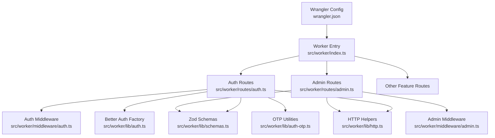
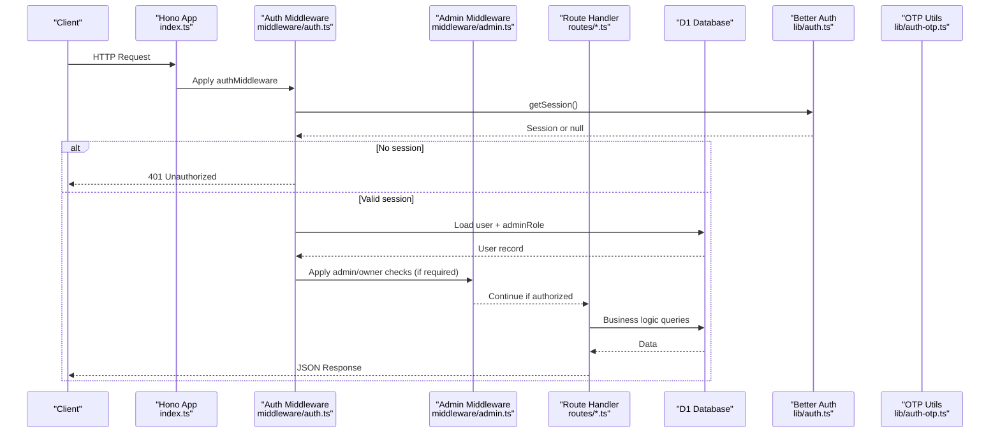
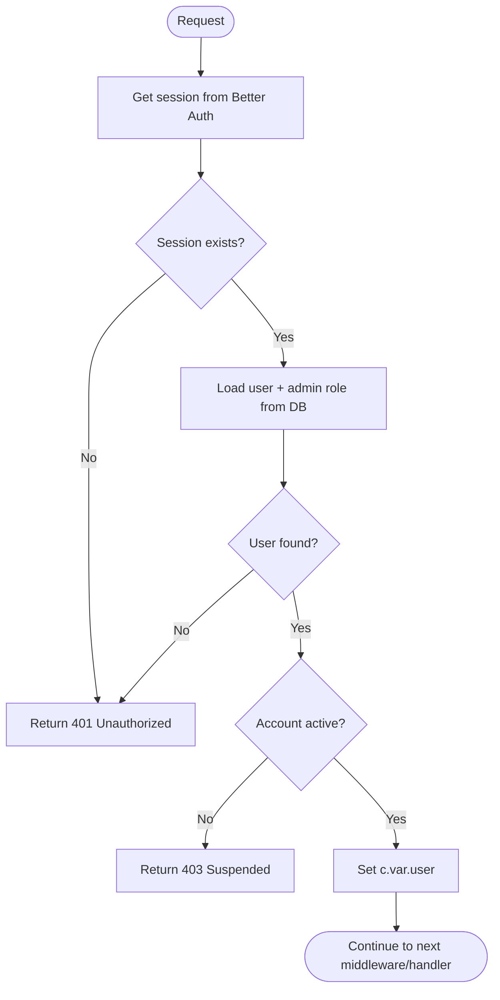
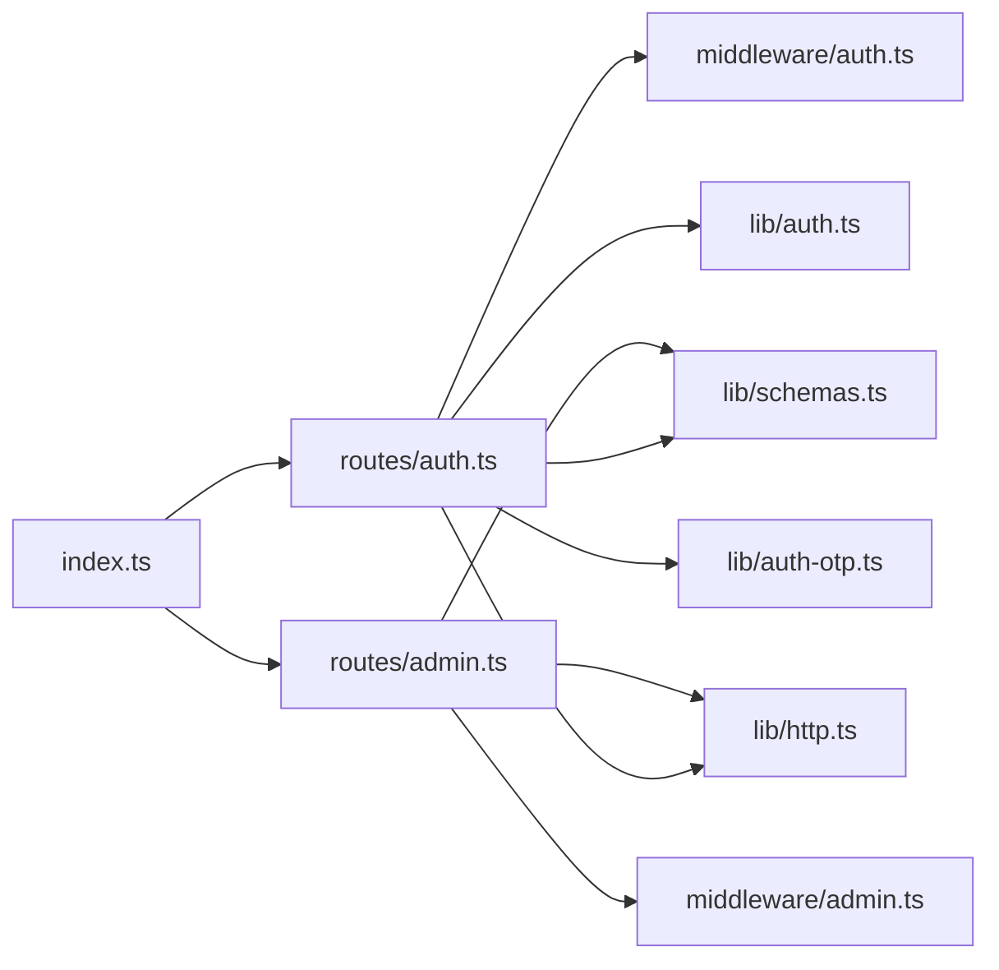

# Middleware & Security Patterns

<cite>
**Referenced Files in This Document**
- [src/worker/index.ts](file://src/worker/index.ts)
- [src/worker/middleware/auth.ts](file://src/worker/middleware/auth.ts)
- [src/worker/middleware/admin.ts](file://src/worker/middleware/admin.ts)
- [src/worker/lib/http.ts](file://src/worker/lib/http.ts)
- [src/worker/lib/schemas.ts](file://src/worker/lib/schemas.ts)
- [src/worker/routes/auth.ts](file://src/worker/routes/auth.ts)
- [src/worker/routes/admin.ts](file://src/worker/routes/admin.ts)
- [src/worker/lib/auth.ts](file://src/worker/lib/auth.ts)
- [src/worker/lib/auth-otp.ts](file://src/worker/lib/auth-otp.ts)
- [wrangler.json](file://wrangler.json)
- [plans/002-throttle-otp-requests.md](file://plans/002-throttle-otp-requests.md)
- [plans/003-apply-browser-security-headers.md](file://plans/003-apply-browser-security-headers.md)
</cite>

## Table of Contents
1. Introduction
2. Project Structure
3. Core Components
4. Architecture Overview
5. Detailed Component Analysis
6. Dependency Analysis
7. Performance Considerations
8. Troubleshooting Guide
9. Conclusion

## Introduction
This document explains the middleware and security patterns used in the Worker-based API, focusing on authentication, authorization, input validation with Zod schemas, request/response transformation, error handling, logging, performance monitoring, and testing strategies. It also provides guidance for implementing custom middleware, configuring security headers, and adding rate limiting.

## Project Structure
The Worker application is built with Hono and organized by feature routes. Middleware is centralized under a dedicated folder and reused across routes. Validation schemas are defined centrally and consumed via a Zod validator integration. Error responses and helpers are encapsulated for consistency.

**Diagram sources**
- [src/worker/index.ts:1-71](file://src/worker/index.ts#L1-L71)
- [src/worker/routes/auth.ts:1-259](file://src/worker/routes/auth.ts#L1-L259)
- [src/worker/routes/admin.ts:1-530](file://src/worker/routes/admin.ts#L1-L530)
- [src/worker/middleware/auth.ts:1-57](file://src/worker/middleware/auth.ts#L1-L57)
- [src/worker/middleware/admin.ts:1-14](file://src/worker/middleware/admin.ts#L1-L14)
- [src/worker/lib/schemas.ts:1-221](file://src/worker/lib/schemas.ts#L1-L221)
- [src/worker/lib/http.ts:1-80](file://src/worker/lib/http.ts#L1-L80)
- [src/worker/lib/auth.ts:1-80](file://src/worker/lib/auth.ts#L1-L80)
- [src/worker/lib/auth-otp.ts:1-124](file://src/worker/lib/auth-otp.ts#L1-L124)
- [wrangler.json:1-139](file://wrangler.json#L1-L139)

**Section sources**
- [src/worker/index.ts:1-71](file://src/worker/index.ts#L1-L71)
- [wrangler.json:1-139](file://wrangler.json#L1-L139)

## Core Components
- Authentication middleware validates sessions and enriches context with user data.
- Authorization middleware enforces role-based access (admin/owner).
- Input validation uses Zod schemas integrated via a Hono validator hook.
- HTTP helpers standardize error responses and status codes.
- Better Auth factory configures OTP-based sign-in and integrates with the database.
- OTP utilities manage generation, hashing, storage, and verification with attempt limits.

Key implementation references:
- Authentication and role checks: [src/worker/middleware/auth.ts:1-57](file://src/worker/middleware/auth.ts#L1-L57), [src/worker/middleware/admin.ts:1-14](file://src/worker/middleware/admin.ts#L1-L14)
- Validation schemas: [src/worker/lib/schemas.ts:1-221](file://src/worker/lib/schemas.ts#L1-L221)
- Error helpers and Zod hook: [src/worker/lib/http.ts:1-80](file://src/worker/lib/http.ts#L1-L80)
- Better Auth configuration: [src/worker/lib/auth.ts:1-80](file://src/worker/lib/auth.ts#L1-L80)
- OTP lifecycle: [src/worker/lib/auth-otp.ts:1-124](file://src/worker/lib/auth-otp.ts#L1-L124)

**Section sources**
- [src/worker/middleware/auth.ts:1-57](file://src/worker/middleware/auth.ts#L1-L57)
- [src/worker/middleware/admin.ts:1-14](file://src/worker/middleware/admin.ts#L1-L14)
- [src/worker/lib/schemas.ts:1-221](file://src/worker/lib/schemas.ts#L1-L221)
- [src/worker/lib/http.ts:1-80](file://src/worker/lib/http.ts#L1-L80)
- [src/worker/lib/auth.ts:1-80](file://src/worker/lib/auth.ts#L1-L80)
- [src/worker/lib/auth-otp.ts:1-124](file://src/worker/lib/auth-otp.ts#L1-L124)

## Architecture Overview
Requests flow through Hono’s middleware chain before reaching route handlers. Authentication and authorization are applied per-route or globally within route groups. Validation occurs at the boundary using Zod schemas. Errors are normalized and returned consistently.

**Diagram sources**
- [src/worker/index.ts:1-71](file://src/worker/index.ts#L1-L71)
- [src/worker/middleware/auth.ts:1-57](file://src/worker/middleware/auth.ts#L1-L57)
- [src/worker/middleware/admin.ts:1-14](file://src/worker/middleware/admin.ts#L1-L14)
- [src/worker/lib/auth.ts:1-80](file://src/worker/lib/auth.ts#L1-L80)
- [src/worker/lib/auth-otp.ts:1-124](file://src/worker/lib/auth-otp.ts#L1-L124)

## Detailed Component Analysis

### Authentication Middleware
- Validates session via Better Auth and loads user details including role and admin role.
- Rejects unauthorized requests and suspended accounts.
- Enriches context with typed user object for downstream use.

**Diagram sources**
- [src/worker/middleware/auth.ts:1-57](file://src/worker/middleware/auth.ts#L1-L57)

**Section sources**
- [src/worker/middleware/auth.ts:1-57](file://src/worker/middleware/auth.ts#L1-L57)

### Authorization Middleware
- Enforces admin-level access and owner-only endpoints.
- Returns 403 Forbidden when roles do not match.

Usage examples:
- Global admin protection: [src/worker/routes/admin.ts:85-86](file://src/worker/routes/admin.ts#L85-L86)
- Owner-only endpoints: [src/worker/routes/admin.ts:366-374](file://src/worker/routes/admin.ts#L366-L374)

**Section sources**
- [src/worker/middleware/admin.ts:1-14](file://src/worker/middleware/admin.ts#L1-L14)
- [src/worker/routes/admin.ts:85-86](file://src/worker/routes/admin.ts#L85-L86)
- [src/worker/routes/admin.ts:366-374](file://src/worker/routes/admin.ts#L366-L374)

### Input Validation with Zod Schemas
- Centralized schemas define strict rules for emails, passwords, OTPs, posts, replies, payments, profile settings, and more.
- Integrated via @hono/zod-validator with a Zod hook that returns standardized validation errors.

Examples:
- OTP request/verify schemas: [src/worker/lib/schemas.ts:13-23](file://src/worker/lib/schemas.ts#L13-L23)
- Profile settings schema with URL validation: [src/worker/lib/schemas.ts:126-154](file://src/worker/lib/schemas.ts#L126-L154)
- Zod hook for consistent 422 responses: [src/worker/lib/http.ts:77-80](file://src/worker/lib/http.ts#L77-L80)

Validation usage pattern:
- Route handler applies zValidator with schema and zodHook: [src/worker/routes/auth.ts:135-136](file://src/worker/routes/auth.ts#L135-L136)

**Section sources**
- [src/worker/lib/schemas.ts:1-221](file://src/worker/lib/schemas.ts#L1-L221)
- [src/worker/lib/http.ts:77-80](file://src/worker/lib/http.ts#L77-L80)
- [src/worker/routes/auth.ts:135-136](file://src/worker/routes/auth.ts#L135-L136)

### Request/Response Transformation
- Auth routes transform Better Auth responses into legacy-compatible user objects and propagate cookies correctly.
- Helper functions ensure consistent JSON responses and cookie handling.

References:
- Cookie propagation and JSON wrapper: [src/worker/routes/auth.ts:24-41](file://src/worker/routes/auth.ts#L24-L41)
- Legacy user mapping: [src/worker/routes/auth.ts:72-80](file://src/worker/routes/auth.ts#L72-L80)

**Section sources**
- [src/worker/routes/auth.ts:24-41](file://src/worker/routes/auth.ts#L24-L41)
- [src/worker/routes/auth.ts:72-80](file://src/worker/routes/auth.ts#L72-L80)

### Error Handling Strategies
- Centralized error helpers provide consistent JSON error shapes and status codes.
- Global onError handler logs and returns server error responses.
- Not-found handling differentiates API vs static assets.

References:
- Error helpers and Zod hook: [src/worker/lib/http.ts:1-80](file://src/worker/lib/http.ts#L1-L80)
- Global error/not-found handlers: [src/worker/index.ts:47-60](file://src/worker/index.ts#L47-L60)

**Section sources**
- [src/worker/lib/http.ts:1-80](file://src/worker/lib/http.ts#L1-L80)
- [src/worker/index.ts:47-60](file://src/worker/index.ts#L47-L60)

### Logging and Performance Monitoring
- Workers observability is enabled with invocation logs and traces configured in Wrangler.
- Sampling rates can be tuned for cost/performance balance.

References:
- Observability configuration: [wrangler.json:13-24](file://wrangler.json#L13-L24)

**Section sources**
- [wrangler.json:13-24](file://wrangler.json#L13-L24)

### Custom Middleware Development
- Use createMiddleware from Hono to build reusable logic (auth, roles, validation wrappers).
- Attach middleware per-route or globally within route groups.

Examples:
- Role-specific middleware: [src/worker/middleware/auth.ts:52-57](file://src/worker/middleware/auth.ts#L52-L57)
- Admin/owner middleware: [src/worker/middleware/admin.ts:5-13](file://src/worker/middleware/admin.ts#L5-L13)

**Section sources**
- [src/worker/middleware/auth.ts:52-57](file://src/worker/middleware/auth.ts#L52-L57)
- [src/worker/middleware/admin.ts:5-13](file://src/worker/middleware/admin.ts#L5-L13)

### Security Headers Configuration
- Plan outlines applying baseline browser security headers to both static assets and API responses.
- Static headers via public/_headers; API headers via Hono middleware.

References:
- Plan details and steps: [plans/003-apply-browser-security-headers.md:1-152](file://plans/003-apply-browser-security-headers.md#L1-L152)

Implementation guidance:
- Add top-level middleware in index.ts before route mounting to append API-safe headers.
- Ensure CSP is either enforced after testing or set report-only with documented exceptions.

**Section sources**
- [plans/003-apply-browser-security-headers.md:1-152](file://plans/003-apply-browser-security-headers.md#L1-L152)

### Rate Limiting Implementation
- Plan specifies throttling OTP email requests using Cloudflare Worker rate limits.
- Two limiters: per-email fingerprint and per-IP, rejecting early before D1/email work.

References:
- Plan steps and constraints: [plans/002-throttle-otp-requests.md:1-164](file://plans/002-throttle-otp-requests.md#L1-L164)
- OTP endpoint behavior: [src/worker/routes/auth.ts:135-164](file://src/worker/routes/auth.ts#L135-L164)

Integration notes:
- Configure ratelimits bindings in wrangler.json and regenerate types.
- Return 429 with Retry-After header and generic message to avoid leaking account existence.

**Section sources**
- [plans/002-throttle-otp-requests.md:1-164](file://plans/002-throttle-otp-requests.md#L1-L164)
- [src/worker/routes/auth.ts:135-164](file://src/worker/routes/auth.ts#L135-L164)

### Testing Strategies for Middleware
- Use Workers Vitest pool with SELF.fetch to simulate real requests against mounted routes.
- Validate middleware behavior:
  - Unauthenticated access returns 401.
  - Invalid payloads return 422 with structured issues.
  - Authorized flows succeed and include expected response shape.
- For rate limiting, fix CF-Connecting-IP and assert 429 behavior under limits.

References:
- Integration test conventions: [plans/002-throttle-otp-requests.md:103-126](file://plans/002-throttle-otp-requests.md#L103-L126)
- Header regression tests: [plans/003-apply-browser-security-headers.md:107-127](file://plans/003-apply-browser-security-headers.md#L107-L127)

**Section sources**
- [plans/002-throttle-otp-requests.md:103-126](file://plans/002-throttle-otp-requests.md#L103-L126)
- [plans/003-apply-browser-security-headers.md:107-127](file://plans/003-apply-browser-security-headers.md#L107-L127)

### Debugging Techniques for Request Processing Chains
- Inspect global error logs via console.error in onError and Workers logs.
- Use tracing and invocation logs to correlate request lifecycles.
- Validate middleware order and ensure early exits (e.g., unauthorized, validation failures) prevent unnecessary work.

References:
- Global error handler: [src/worker/index.ts:47-50](file://src/worker/index.ts#L47-L50)
- Observability settings: [wrangler.json:13-24](file://wrangler.json#L13-L24)

**Section sources**
- [src/worker/index.ts:47-50](file://src/worker/index.ts#L47-L50)
- [wrangler.json:13-24](file://wrangler.json#L13-L24)

## Dependency Analysis
The following diagram shows how core modules depend on each other during a typical authenticated request.

**Diagram sources**
- [src/worker/index.ts:1-71](file://src/worker/index.ts#L1-L71)
- [src/worker/routes/auth.ts:1-259](file://src/worker/routes/auth.ts#L1-L259)
- [src/worker/routes/admin.ts:1-530](file://src/worker/routes/admin.ts#L1-L530)
- [src/worker/middleware/auth.ts:1-57](file://src/worker/middleware/auth.ts#L1-L57)
- [src/worker/middleware/admin.ts:1-14](file://src/worker/middleware/admin.ts#L1-L14)
- [src/worker/lib/schemas.ts:1-221](file://src/worker/lib/schemas.ts#L1-L221)
- [src/worker/lib/http.ts:1-80](file://src/worker/lib/http.ts#L1-L80)
- [src/worker/lib/auth.ts:1-80](file://src/worker/lib/auth.ts#L1-L80)
- [src/worker/lib/auth-otp.ts:1-124](file://src/worker/lib/auth-otp.ts#L1-L124)

**Section sources**
- [src/worker/index.ts:1-71](file://src/worker/index.ts#L1-L71)
- [src/worker/routes/auth.ts:1-259](file://src/worker/routes/auth.ts#L1-L259)
- [src/worker/routes/admin.ts:1-530](file://src/worker/routes/admin.ts#L1-L530)

## Performance Considerations
- Enable Workers observability with controlled sampling to reduce overhead while retaining diagnostics.
- Validate inputs early to avoid expensive DB calls or external service invocations.
- Use batched DB operations where possible (e.g., admin bulk updates).
- Avoid unnecessary transformations; reuse helper functions for consistent and efficient responses.

[No sources needed since this section provides general guidance]

## Troubleshooting Guide
Common issues and resolutions:
- Unauthorized access: Ensure session is present and not expired; check auth middleware ordering.
- Validation failures: Confirm Zod schemas match payload structure; inspect 422 issues.
- Rate-limited OTP requests: Verify rate-limit bindings and headers; ensure generic messages do not leak info.
- Missing security headers: Implement API middleware and static _headers as per plan.

References:
- Error helpers and Zod hook: [src/worker/lib/http.ts:1-80](file://src/worker/lib/http.ts#L1-L80)
- OTP verification and attempts: [src/worker/lib/auth-otp.ts:87-124](file://src/worker/lib/auth-otp.ts#L87-L124)
- Rate limiting plan: [plans/002-throttle-otp-requests.md:85-126](file://plans/002-throttle-otp-requests.md#L85-L126)
- Security headers plan: [plans/003-apply-browser-security-headers.md:93-127](file://plans/003-apply-browser-security-headers.md#L93-L127)

**Section sources**
- [src/worker/lib/http.ts:1-80](file://src/worker/lib/http.ts#L1-L80)
- [src/worker/lib/auth-otp.ts:87-124](file://src/worker/lib/auth-otp.ts#L87-L124)
- [plans/002-throttle-otp-requests.md:85-126](file://plans/002-throttle-otp-requests.md#L85-L126)
- [plans/003-apply-browser-security-headers.md:93-127](file://plans/003-apply-browser-security-headers.md#L93-L127)

## Conclusion
The Worker API employs robust middleware patterns for authentication and authorization, strong input validation with Zod, and consistent error handling. Security headers and rate limiting are planned to harden the system further. Observability and testing practices enable reliable debugging and continuous improvement. Following the referenced plans ensures secure, maintainable, and performant middleware implementations.

[No sources needed since this section summarizes without analyzing specific files]