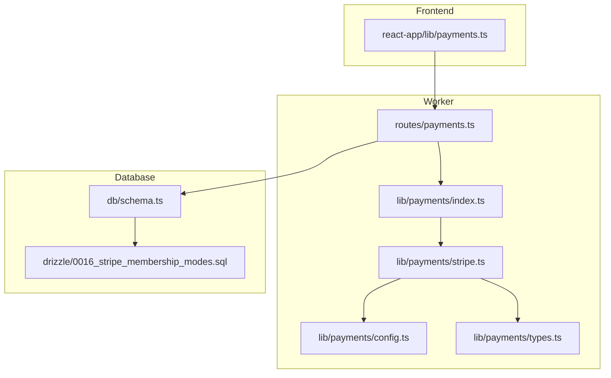
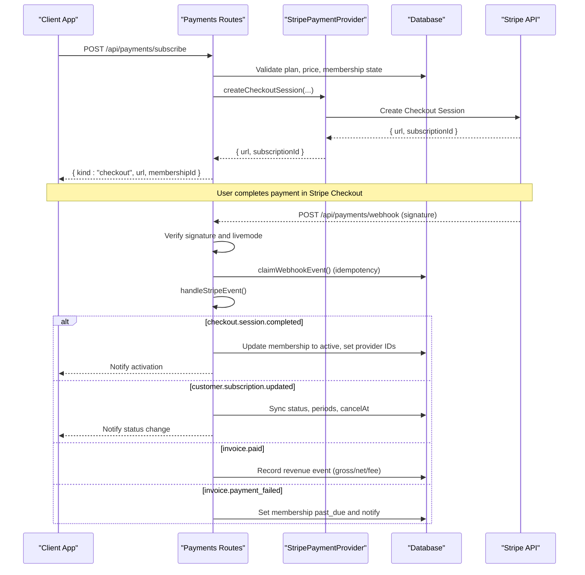
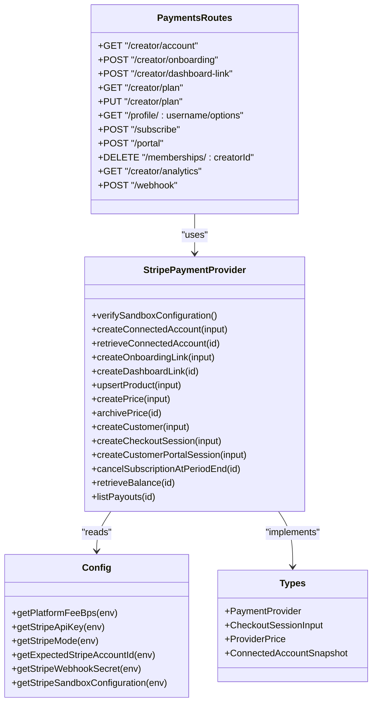

# Payment & Subscription Routes

<cite>
**Referenced Files in This Document**
- [payments.ts](file://src/worker/routes/payments.ts)
- [stripe.ts](file://src/worker/lib/payments/stripe.ts)
- [index.ts](file://src/worker/lib/payments/index.ts)
- [config.ts](file://src/worker/lib/payments/config.ts)
- [types.ts](file://src/worker/lib/payments/types.ts)
- [schema.ts](file://src/worker/db/schema.ts)
- [0016_stripe_membership_modes.sql](file://drizzle/0016_stripe_membership_modes.sql)
- [payments.ts (frontend)](file://src/react-app/lib/payments.ts)
- [payments.test.ts](file://src/worker/routes/payments.test.ts)
</cite>

## Table of Contents
1. [Introduction](#introduction)
2. [Project Structure](#project-structure)
3. [Core Components](#core-components)
4. [Architecture Overview](#architecture-overview)
5. [Detailed Component Analysis](#detailed-component-analysis)
6. [Dependency Analysis](#dependency-analysis)
7. [Performance Considerations](#performance-considerations)
8. [Troubleshooting Guide](#troubleshooting-guide)
9. [Conclusion](#conclusion)

## Introduction
This document provides comprehensive documentation for the payment and subscription route handlers that integrate with Stripe for subscription management, payment processing, and webhook handling. It covers membership tier management, access control based on subscription status, revenue tracking, and operational flows such as subscription lifecycle management, payment retry logic, and refund/cancellation considerations. Security considerations include PCI compliance guidance and webhook signature verification.

## Project Structure
The payment system is implemented primarily in the worker routes and a dedicated payments library:
- Worker routes define HTTP endpoints for creator account setup, plan configuration, subscription checkout, billing portal, analytics, and webhooks.
- The payments library abstracts Stripe interactions via a provider interface and enforces sandbox-only configuration.
- Database schema defines tables for memberships, plans, prices, trial claims, transitions, and webhook events.

**Diagram sources**
- [payments.ts](file://src/worker/routes/payments.ts)
- [index.ts](file://src/worker/lib/payments/index.ts)
- [stripe.ts](file://src/worker/lib/payments/stripe.ts)
- [config.ts](file://src/worker/lib/payments/config.ts)
- [types.ts](file://src/worker/lib/payments/types.ts)
- [schema.ts](file://src/worker/db/schema.ts)
- [0016_stripe_membership_modes.sql](file://drizzle/0016_stripe_membership_modes.sql)
- [payments.ts (frontend)](file://src/react-app/lib/payments.ts)

**Section sources**
- [payments.ts](file://src/worker/routes/payments.ts)
- [index.ts](file://src/worker/lib/payments/index.ts)
- [stripe.ts](file://src/worker/lib/payments/stripe.ts)
- [config.ts](file://src/worker/lib/payments/config.ts)
- [types.ts](file://src/worker/lib/payments/types.ts)
- [schema.ts](file://src/worker/db/schema.ts)
- [0016_stripe_membership_modes.sql](file://drizzle/0016_stripe_membership_modes.sql)
- [payments.ts (frontend)](file://src/react-app/lib/payments.ts)

## Core Components
- Payments routes: Define endpoints for creator account onboarding, plan updates, subscription options, checkout, billing portal, cancellation, analytics, and Stripe webhook ingestion.
- Stripe provider: Implements all Stripe operations including connected accounts, products/prices, customers, checkout sessions, billing portal, balance/payouts, and webhook event construction.
- Configuration: Enforces sandbox-only mode, validates API keys, webhook secrets, and platform fee basis points.
- Types: Defines interfaces for provider methods and data models used across routes and provider.
- Database schema: Tracks memberships, plan prices, trial claims, plan transitions, and webhook events to ensure idempotency and auditability.

Key responsibilities:
- Membership tiers: Plans support disabled, free_permanent, free_trial, and paid modes. Prices are stored per interval (monthly/yearly).
- Access control: Entitlement is determined by membership status and trial expiration; active or trialing members within their period are entitled.
- Revenue tracking: Invoice payments create revenue events with gross/net amounts and platform fees. Analytics aggregate MRR and subscriber counts.

**Section sources**
- [payments.ts](file://src/worker/routes/payments.ts)
- [stripe.ts](file://src/worker/lib/payments/stripe.ts)
- [config.ts](file://src/worker/lib/payments/config.ts)
- [types.ts](file://src/worker/lib/payments/types.ts)
- [schema.ts](file://src/worker/db/schema.ts)
- [0016_stripe_membership_modes.sql](file://drizzle/0016_stripe_membership_modes.sql)

## Architecture Overview
The system uses a Hono-based worker with middleware for authentication and role checks. Stripe integration is abstracted behind a provider interface to keep routes decoupled from provider specifics. Webhook processing ensures idempotent updates and tracks failures.

**Diagram sources**
- [payments.ts](file://src/worker/routes/payments.ts)
- [stripe.ts](file://src/worker/lib/payments/stripe.ts)
- [config.ts](file://src/worker/lib/payments/config.ts)

**Section sources**
- [payments.ts](file://src/worker/routes/payments.ts)
- [stripe.ts](file://src/worker/lib/payments/stripe.ts)
- [config.ts](file://src/worker/lib/payments/config.ts)

## Detailed Component Analysis

### Creator Account Management
Endpoints:
- GET /creator/account: Returns current connected account status, refreshing from Stripe if available.
- POST /creator/onboarding: Creates or retrieves a connected account and returns an onboarding link.
- POST /creator/dashboard-link: Generates a dashboard login link for the creator’s Stripe Express account.

Behavior:
- Validates creator role and authenticates user.
- Uses provider to verify sandbox configuration and manage connected accounts.
- Persists account snapshot and requirements due list.

Security:
- Requires authentication and creator role.
- Sandbox-only enforcement via configuration validation.

**Section sources**
- [payments.ts](file://src/worker/routes/payments.ts)
- [stripe.ts](file://src/worker/lib/payments/stripe.ts)
- [config.ts](file://src/worker/lib/payments/config.ts)

### Membership Plan Management
Endpoints:
- GET /creator/plan: Retrieves plan details, active prices, and transition counts.
- PUT /creator/plan: Updates plan mode, name, description, and prices; creates/archives provider prices accordingly.

Behavior:
- Supports modes: disabled, free_permanent, free_trial, paid.
- For paid mode, requires fully onboarded Stripe account; otherwise returns setup required error.
- Upserts product and prices with idempotency keys; archives outdated prices.
- Records plan transitions for existing paid memberships when disabling paid mode.

Data model:
- Plans store revision and provider product ID.
- Prices track interval, amount, currency, and provider identifiers.

**Section sources**
- [payments.ts](file://src/worker/routes/payments.ts)
- [0016_stripe_membership_modes.sql](file://drizzle/0016_stripe_membership_modes.sql)
- [schema.ts](file://src/worker/db/schema.ts)

### Subscription Options and Actions
Endpoints:
- GET /profile/:username/options: Returns plan info, viewer membership, and trial availability.
- POST /subscribe: Starts a free membership or initiates Stripe Checkout for paid subscriptions.
- POST /portal: Opens Stripe Customer Portal for managing paid subscriptions.
- DELETE /memberships/:creatorId: Cancels free/trial memberships; paid cancellations require Stripe portal.

Behavior:
- Free permanent and free trial memberships are created directly without payment.
- Paid subscriptions require selecting monthly or yearly interval and creating a checkout session.
- Billing portal requires an existing paid membership with a Stripe customer ID.
- Cancellation of paid memberships is delegated to Stripe portal.

Access control:
- Prevents self-subscription and enforces creator/account status checks.
- Ensures entitlement before allowing actions.

**Section sources**
- [payments.ts](file://src/worker/routes/payments.ts)
- [payments.ts (frontend)](file://src/react-app/lib/payments.ts)

### Webhook Processing and Idempotency
Endpoint:
- POST /webhook: Ingests Stripe webhook events, verifies signature, rejects live mode, claims event for idempotency, and processes event types.

Processing:
- Verifies signature using configured secret and constructs event safely.
- Rejects live mode events to enforce sandbox-only operation.
- Claims event to prevent duplicate processing; supports reclamation if stale.
- Handles checkout completion/expired, subscription changes, invoice paid/failed.

Idempotency:
- Uses provider event timestamps and membership fields to avoid out-of-order updates.
- Tracks attempts and last errors for failed events.

**Section sources**
- [payments.ts](file://src/worker/routes/payments.ts)
- [stripe.ts](file://src/worker/lib/payments/stripe.ts)
- [config.ts](file://src/worker/lib/payments/config.ts)
- [schema.ts](file://src/worker/db/schema.ts)

### Revenue Tracking and Analytics
Endpoints:
- GET /creator/analytics: Aggregates account status, balance, payouts, metrics (MRR, totals), chart (30-day), and subscribers.

Revenue recording:
- On invoice.paid, records gross/net amounts and platform fee based on basis points.
- Chart buckets revenue by UTC date for consistent reporting.

Metrics:
- MRR computed from active paid subscribers’ monthly-equivalent amounts.
- Subscriber counts segmented by access type and entitlement.

**Section sources**
- [payments.ts](file://src/worker/routes/payments.ts)
- [schema.ts](file://src/worker/db/schema.ts)

### Subscription Lifecycle Management
Flows:
- Free/Trial: Immediate creation with optional trial window; follow relationship established.
- Paid: Checkout session creation; on success, membership becomes active and follows established.
- Status changes: Subscription updates sync status, periods, and cancellation timing.
- Past due: Failed invoice sets membership to past_due and notifies stakeholders.

Lifecycle states:
- pending -> active (checkout completed)
- active -> past_due (payment failed)
- active -> canceled (period end or manual cancellation via portal)
- trialing -> active or expired (trial end)

**Section sources**
- [payments.ts](file://src/worker/routes/payments.ts)

### Payment Retry Logic
- Webhook reprocessing: Stale or in-progress events can be reclaimed and retried up to configured limits.
- Subscription retries: Managed by Stripe; local state reflects past_due until resolved.
- Transition table: Tracks plan transitions with attempts and next attempt scheduling for reconciliation tasks.

Operational notes:
- Monitor failed webhook events and reconcile membership states periodically.
- Use analytics endpoint to detect anomalies in revenue and subscriber counts.

**Section sources**
- [payments.ts](file://src/worker/routes/payments.ts)
- [0016_stripe_membership_modes.sql](file://drizzle/0016_stripe_membership_modes.sql)

### Refund Processing
- Refunds are not explicitly handled in the provided routes; they are typically managed through Stripe Dashboard or API.
- Revenue events record invoice payments; refunds would need separate handling to adjust net revenue if required.
- Recommendation: Implement refund webhooks (e.g., charge.refunded) to update revenue records and membership status if applicable.

[No sources needed since this section provides general guidance]

### Security Considerations and PCI Compliance
- Webhook signature verification: Mandatory; invalid signatures rejected immediately.
- Sandbox-only enforcement: Live Stripe keys and live mode events are rejected.
- Data minimization: No sensitive card data touches application servers; use Stripe-hosted Checkout and Billing Portal.
- PCI scope reduction: By delegating payment collection to Stripe, PCI compliance burden is minimized.
- Secrets management: Store API keys, webhook secrets, and account IDs securely in environment variables.

Best practices:
- Always validate request origins and headers where applicable.
- Log minimal PII; avoid logging secrets or raw payloads.
- Rotate secrets regularly and monitor webhook failure rates.

**Section sources**
- [payments.ts](file://src/worker/routes/payments.ts)
- [config.ts](file://src/worker/lib/payments/config.ts)
- [stripe.ts](file://src/worker/lib/payments/stripe.ts)

## Dependency Analysis
The payments module depends on:
- Hono routing and Zod validators for input validation.
- Drizzle ORM for database operations.
- Stripe SDK for provider interactions.
- Environment configuration for sandbox enforcement and fee calculation.

**Diagram sources**
- [payments.ts](file://src/worker/routes/payments.ts)
- [stripe.ts](file://src/worker/lib/payments/stripe.ts)
- [config.ts](file://src/worker/lib/payments/config.ts)
- [types.ts](file://src/worker/lib/payments/types.ts)

**Section sources**
- [payments.ts](file://src/worker/routes/payments.ts)
- [stripe.ts](file://src/worker/lib/payments/stripe.ts)
- [config.ts](file://src/worker/lib/payments/config.ts)
- [types.ts](file://src/worker/lib/payments/types.ts)

## Performance Considerations
- Batch database operations: Use batch writes for membership creation and price updates to reduce round trips.
- Idempotency keys: Ensure provider calls are idempotent to avoid duplicate charges or resources.
- Caching: Consider caching plan and price queries for frequently accessed profiles.
- Webhook processing: Keep handlers fast and offload heavy work to background jobs if necessary.
- Metrics aggregation: Precompute charts and metrics server-side to minimize client load.

[No sources needed since this section provides general guidance]

## Troubleshooting Guide
Common issues:
- Missing Stripe signature: Ensure correct header and secret configuration.
- Live mode rejection: Confirm STRIPE_MODE=test and test keys are used.
- Payment setup required: Complete Stripe Sandbox Express onboarding for creators enabling paid memberships.
- Duplicate webhooks: Rely on idempotency; check claimed events and reprocess if stale.
- Failed webhooks: Inspect last_error and attempts; reconcile membership states.

Diagnostic endpoints:
- Creator analytics: Review balance, payouts, metrics, and subscriber lists.
- Admin health signals: Check stripeSandbox and stripeWebhookFailures indicators.

Recovery steps:
- Re-run checkout flow if session expired.
- Use billing portal to update payment methods or cancel subscriptions.
- Manually reconcile membership statuses against Stripe if discrepancies occur.

**Section sources**
- [payments.ts](file://src/worker/routes/payments.ts)
- [payments.test.ts](file://src/worker/routes/payments.test.ts)

## Conclusion
The payment and subscription system integrates Stripe securely via sandbox-only configuration, providing robust endpoints for creator onboarding, plan management, subscription checkout, billing portal, analytics, and webhook processing. Idempotency, access control, and revenue tracking are implemented to ensure reliability and accuracy. Adhering to security best practices and leveraging Stripe-hosted flows reduces PCI scope and enhances safety. Operational monitoring and troubleshooting tools help maintain system health and resolve issues efficiently.