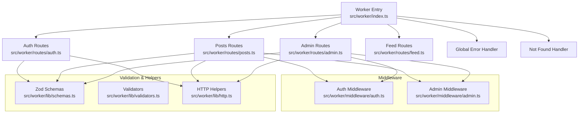
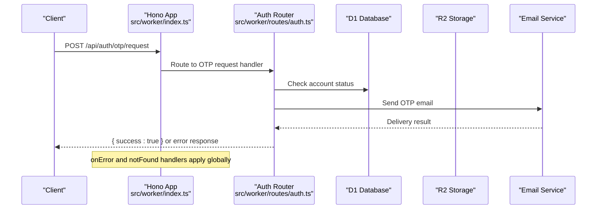
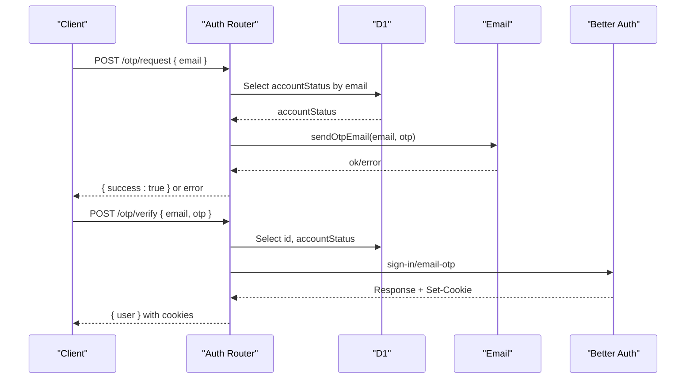
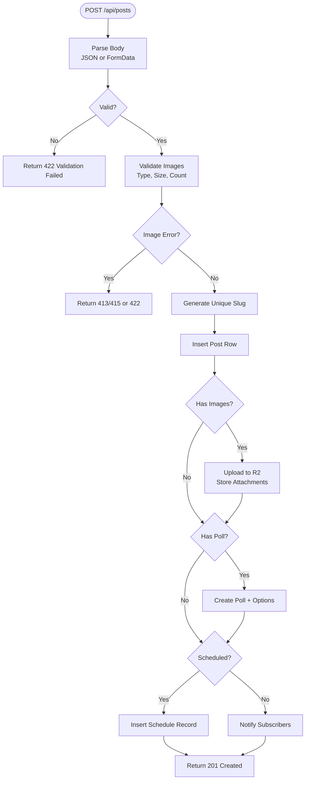
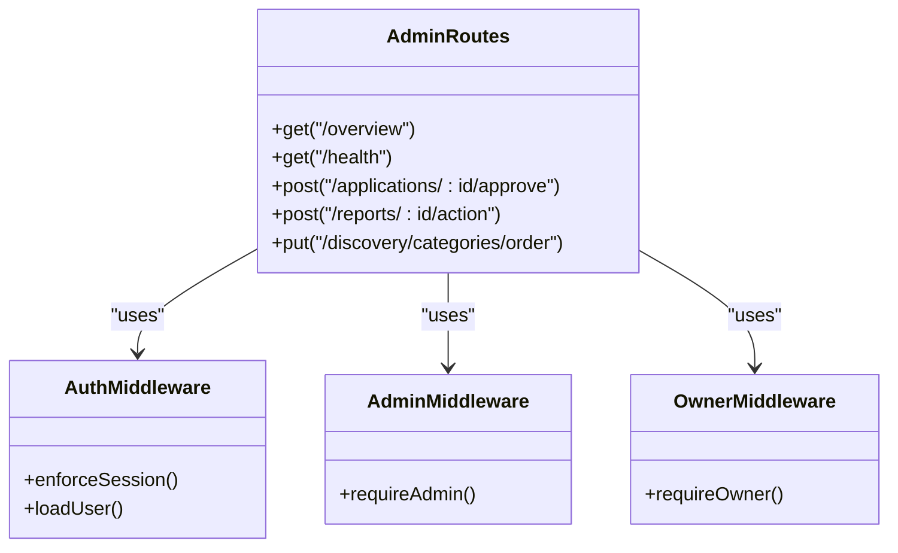
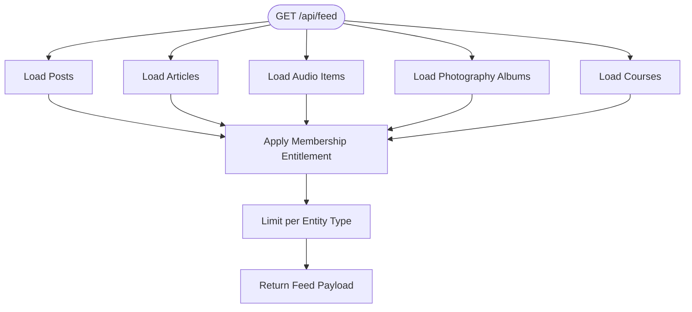
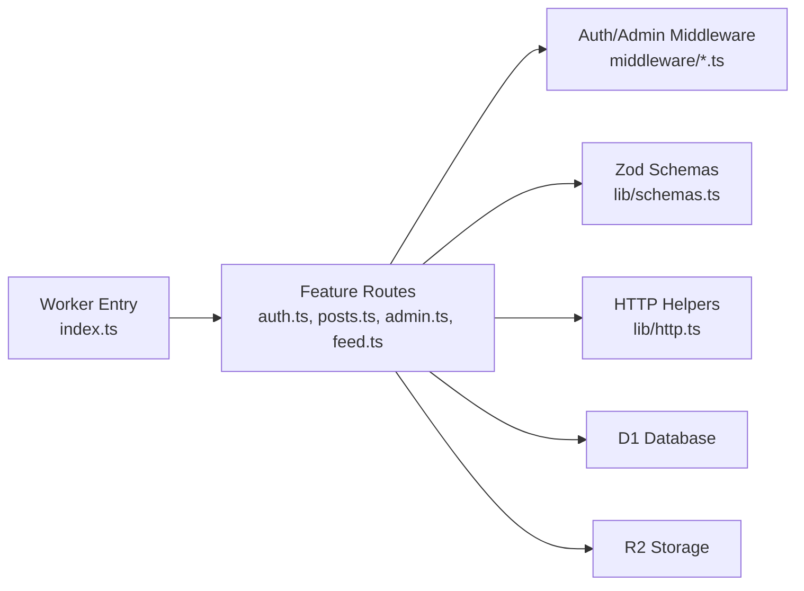
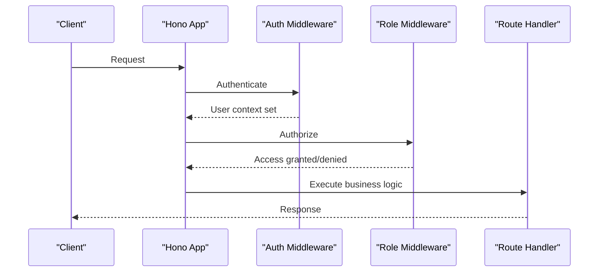

# Route Handlers

<cite>
**Referenced Files in This Document**
- [index.ts](file://src/worker/index.ts)
- [auth.ts](file://src/worker/routes/auth.ts)
- [posts.ts](file://src/worker/routes/posts.ts)
- [admin.ts](file://src/worker/routes/admin.ts)
- [feed.ts](file://src/worker/routes/feed.ts)
- [schemas.ts](file://src/worker/lib/schemas.ts)
- [validators.ts](file://src/worker/lib/validators.ts)
- [http.ts](file://src/worker/lib/http.ts)
- [auth-middleware.ts](file://src/worker/middleware/auth.ts)
- [admin-middleware.ts](file://src/worker/middleware/admin.ts)
- [wrangler.json](file://wrangler.json)
</cite>

## Table of Contents
1. [Introduction](#introduction)
2. [Project Structure](#project-structure)
3. [Core Components](#core-components)
4. [Architecture Overview](#architecture-overview)
5. [Detailed Component Analysis](#detailed-component-analysis)
6. [Dependency Analysis](#dependency-analysis)
7. [Performance Considerations](#performance-considerations)
8. [Troubleshooting Guide](#troubleshooting-guide)
9. [Conclusion](#conclusion)
10. [Appendices](#appendices)

## Introduction
This document explains the route handler architecture and implementation patterns used by the Cloudflare Worker backend. It covers modular organization by feature domain, request processing flow, input validation with Zod schemas, parameter sanitization, error handling strategies, CRUD operations, file uploads, complex business logic, middleware composition for cross-cutting concerns, performance optimization techniques specific to Cloudflare Workers, and testing strategies for route handlers.

## Project Structure
The Worker application is built with Hono and organized by feature domains under src/worker/routes. Each domain module defines its own Hono router and registers endpoints. The main app entry point wires these routers under /api prefixes and configures global error and not-found handlers. Middleware lives under src/worker/middleware and provides authentication and authorization. Validation schemas are centralized under src/worker/lib/schemas.ts, while common HTTP helpers live under src/worker/lib/http.ts. Configuration for Cloudflare Workers (bindings, assets, cron triggers) is defined in wrangler.json.

**Diagram sources**
- [index.ts:24-60](file://src/worker/index.ts#L24-L60)
- [auth.ts:14-259](file://src/worker/routes/auth.ts#L14-L259)
- [posts.ts:60-800](file://src/worker/routes/posts.ts#L60-L800)
- [admin.ts:85-530](file://src/worker/routes/admin.ts#L85-L530)
- [feed.ts:9-200](file://src/worker/routes/feed.ts#L9-L200)
- [auth-middleware.ts:23-50](file://src/worker/middleware/auth.ts#L23-L50)
- [admin-middleware.ts:5-13](file://src/worker/middleware/admin.ts#L5-L13)
- [schemas.ts:1-221](file://src/worker/lib/schemas.ts#L1-L221)
- [validators.ts:1-94](file://src/worker/lib/validators.ts#L1-L94)
- [http.ts:1-80](file://src/worker/lib/http.ts#L1-L80)

**Section sources**
- [index.ts:24-60](file://src/worker/index.ts#L24-L60)
- [wrangler.json:6-33](file://wrangler.json#L6-L33)

## Core Components
- Router modules: Each feature domain exports a Hono instance with typed environment and routes. Examples include auth, posts, admin, feed, and others registered under /api/* in the main app.
- Middleware: Authentication and role-based authorization are implemented as Hono middlewares that attach user context and enforce access control.
- Validation: Zod schemas define strict input contracts for JSON bodies and parameters. A shared zodHook converts validation failures into standardized error responses.
- HTTP helpers: Centralized functions produce consistent error responses with codes, messages, and optional details.
- Data access: Drizzle ORM queries are used within route handlers; object storage is accessed via R2 bindings.

Key responsibilities:
- Modular routing by domain ensures clear separation of concerns.
- Middleware composes cross-cutting concerns like authentication, authorization, and future logging/metrics.
- Zod schemas provide runtime validation and type safety.
- Standardized error responses simplify client error handling.

**Section sources**
- [index.ts:24-45](file://src/worker/index.ts#L24-L45)
- [auth-middleware.ts:23-50](file://src/worker/middleware/auth.ts#L23-L50)
- [admin-middleware.ts:5-13](file://src/worker/middleware/admin.ts#L5-L13)
- [schemas.ts:1-221](file://src/worker/lib/schemas.ts#L1-L221)
- [http.ts:23-80](file://src/worker/lib/http.ts#L23-L80)

## Architecture Overview
The Worker exposes a single fetch handler that delegates requests to domain-specific routers. Global error and not-found handlers ensure consistent behavior across API and asset routes. Scheduled tasks run background maintenance jobs.

**Diagram sources**
- [index.ts:47-60](file://src/worker/index.ts#L47-L60)
- [auth.ts:135-164](file://src/worker/routes/auth.ts#L135-L164)

**Section sources**
- [index.ts:47-71](file://src/worker/index.ts#L47-L71)

## Detailed Component Analysis

### Authentication Flow (OTP Sign-In)
The auth router implements an OTP-based sign-in flow:
- Request OTP: Validates email, checks account status, stores OTP, sends email, returns success or error.
- Verify OTP: Validates OTP, calls Better Auth endpoint, handles errors, sets cookies, returns legacy user shape.
- Logout and Me: Uses auth middleware to enforce session and return user profile.

**Diagram sources**
- [auth.ts:135-212](file://src/worker/routes/auth.ts#L135-L212)

**Section sources**
- [auth.ts:127-212](file://src/worker/routes/auth.ts#L127-L212)

### Posts CRUD and File Uploads
The posts router demonstrates comprehensive CRUD operations, multipart form handling, image uploads to R2, poll creation, scheduling, and notifications.

Key behaviors:
- Create post: Supports JSON and multipart/form-data; validates body length; parses scheduled time; uploads images; creates polls; schedules publication if needed; notifies subscribers.
- Update draft: Supports removing attachments, updating body/images/poll; enforces limits; updates DB and R2; returns updated post.
- Delete draft: Removes DB row and associated R2 attachments.
- Replies: Create replies with optional parent reply and images; notify mentioned users.
- Likes: Toggle like state and notify creators.

**Diagram sources**
- [posts.ts:419-542](file://src/worker/routes/posts.ts#L419-L542)
- [posts.ts:172-218](file://src/worker/routes/posts.ts#L172-L218)
- [posts.ts:121-170](file://src/worker/routes/posts.ts#L121-L170)

**Section sources**
- [posts.ts:419-542](file://src/worker/routes/posts.ts#L419-L542)
- [posts.ts:555-623](file://src/worker/routes/posts.ts#L555-L623)
- [posts.ts:625-636](file://src/worker/routes/posts.ts#L625-L636)
- [posts.ts:695-775](file://src/worker/routes/posts.ts#L695-L775)

### Admin Operations and Authorization
Admin routes demonstrate role-based access control, audit logging, moderation actions, and discovery category management.

Highlights:
- All admin endpoints require authentication and admin role; owner-only endpoints use additional middleware.
- Actions write audit logs and create notifications where appropriate.
- Bulk operations use batched SQL statements for efficiency.

**Diagram sources**
- [admin.ts:85-101](file://src/worker/routes/admin.ts#L85-L101)
- [admin.ts:209-236](file://src/worker/routes/admin.ts#L209-L236)
- [admin.ts:398-420](file://src/worker/routes/admin.ts#L398-L420)
- [admin-middleware.ts:5-13](file://src/worker/middleware/admin.ts#L5-L13)
- [auth-middleware.ts:23-50](file://src/worker/middleware/auth.ts#L23-L50)

**Section sources**
- [admin.ts:85-530](file://src/worker/routes/admin.ts#L85-L530)

### Feed Aggregation
The feed router aggregates content from multiple entities (posts, articles, audio, photography, courses) based on subscription entitlements and membership conditions.

Key aspects:
- Queries join posts with related tables and filter by published status and moderation/account states.
- Membership entitlement condition gates access to premium content.
- Results are limited per entity type to optimize performance.

**Diagram sources**
- [feed.ts:13-200](file://src/worker/routes/feed.ts#L13-L200)

**Section sources**
- [feed.ts:13-200](file://src/worker/routes/feed.ts#L13-L200)

### Input Validation and Parameter Sanitization
Zod schemas define strict contracts for inputs:
- Email and password constraints.
- OTP request and verification payloads.
- Post and reply creation/update payloads.
- Poll voting and creator plan updates.
- Profile settings including social links URL validation.
- Notification preferences and creator application fields.

Parameter schemas validate path parameters such as usernames, slugs, IDs.

Custom validators provide reusable checks for emails, passwords, usernames, and URLs.

**Section sources**
- [schemas.ts:1-221](file://src/worker/lib/schemas.ts#L1-L221)
- [validators.ts:1-94](file://src/worker/lib/validators.ts#L1-L94)

### Error Handling Strategy
A unified error response format is used across all routes:
- Consistent structure with code, message, and optional details.
- Helper functions for common statuses: bad request, unauthorized, forbidden, not found, conflict, payload too large, unsupported media type, internal server error.
- Zod hook integrates validation failures into this format.

Global error and not-found handlers ensure consistent behavior at the app level.

**Section sources**
- [http.ts:23-80](file://src/worker/lib/http.ts#L23-L80)
- [index.ts:47-60](file://src/worker/index.ts#L47-L60)

## Dependency Analysis
The system exhibits clear separation between routing, middleware, validation, and data access. Dependencies are primarily one-directional:
- Routes depend on middleware for authz and on schemas for validation.
- Routes call database and storage services through bindings.
- Shared HTTP helpers standardize responses.

**Diagram sources**
- [index.ts:24-45](file://src/worker/index.ts#L24-L45)
- [auth.ts:14-259](file://src/worker/routes/auth.ts#L14-L259)
- [posts.ts:60-800](file://src/worker/routes/posts.ts#L60-L800)
- [admin.ts:85-530](file://src/worker/routes/admin.ts#L85-L530)
- [feed.ts:9-200](file://src/worker/routes/feed.ts#L9-L200)
- [auth-middleware.ts:23-50](file://src/worker/middleware/auth.ts#L23-L50)
- [admin-middleware.ts:5-13](file://src/worker/middleware/admin.ts#L5-L13)
- [schemas.ts:1-221](file://src/worker/lib/schemas.ts#L1-L221)
- [http.ts:1-80](file://src/worker/lib/http.ts#L1-L80)

**Section sources**
- [index.ts:24-45](file://src/worker/index.ts#L24-L45)

## Performance Considerations
Cloudflare Workers have unique constraints and opportunities:
- Cold start mitigation: Keep initialization lightweight; avoid heavy synchronous work during module load. Use lazy loading for non-critical dependencies.
- Memory management: Stream large payloads when possible; avoid retaining large objects beyond request scope; prefer streaming responses for large datasets.
- Database efficiency: Use batched SQL statements for bulk updates; minimize N+1 queries by joining where appropriate; limit result sets.
- Object storage: Upload files directly to R2 using array buffers; delete unused attachments promptly; use metadata headers for correct content types.
- Observability: Enable invocation logs and traces via Wrangler configuration; sample traces appropriately to reduce overhead.
- Cron jobs: Offload background tasks to scheduled handlers; process due schedules and membership maintenance asynchronously.

[No sources needed since this section provides general guidance]

## Troubleshooting Guide
Common issues and resolutions:
- Validation failures: Ensure JSON bodies match Zod schemas; check required fields and formats; inspect validation issues returned in error details.
- Unauthorized/Forbidden: Confirm session validity and user roles; verify middleware chain order; check account status.
- Not Found: Verify resource existence and access permissions; ensure slugs and IDs are correct.
- Payload Too Large/Unsupported Media Type: Enforce size limits and allowed MIME types for uploads; handle errors early.
- Internal Server Error: Review global error handler logs; check database connectivity and external service availability.

**Section sources**
- [http.ts:23-80](file://src/worker/lib/http.ts#L23-L80)
- [index.ts:47-60](file://src/worker/index.ts#L47-L60)

## Conclusion
The route handler architecture leverages Hono’s modular routing, middleware composition, and Zod-based validation to deliver a robust, maintainable API surface. Feature-domain routers encapsulate business logic, while shared middleware and helpers ensure consistency and reusability. Cloudflare Workers’ constraints guide performance-oriented design choices, and standardized error handling simplifies debugging and client integration.

[No sources needed since this section summarizes without analyzing specific files]

## Appendices

### Middleware Composition Pattern
- Authentication middleware loads session, fetches user details, and attaches user context.
- Role-based middleware enforces subscriber/creator roles.
- Admin/owner middleware restricts sensitive endpoints to authorized administrators.

**Diagram sources**
- [auth-middleware.ts:23-50](file://src/worker/middleware/auth.ts#L23-L50)
- [admin-middleware.ts:5-13](file://src/worker/middleware/admin.ts#L5-L13)

**Section sources**
- [auth-middleware.ts:23-50](file://src/worker/middleware/auth.ts#L23-L50)
- [admin-middleware.ts:5-13](file://src/worker/middleware/admin.ts#L5-L13)

### Testing Strategies for Route Handlers
- Unit tests construct minimal Hono apps with mocked middleware and dependencies.
- Simulate requests using Request objects and assert status codes and response shapes.
- Validate Zod schema behavior independently to ensure consistent validation outcomes.
- Mock external services (database, storage, email) to isolate route logic.

Example references:
- Posts route unit tests assert role enforcement and validation failures.
- Payments tests validate discriminated unions and sandbox configuration checks.

**Section sources**
- [posts.test.ts:158-193](file://src/worker/routes/posts.test.ts#L158-L193)
- [payments.test.ts:26-75](file://src/worker/routes/payments.test.ts#L26-L75)