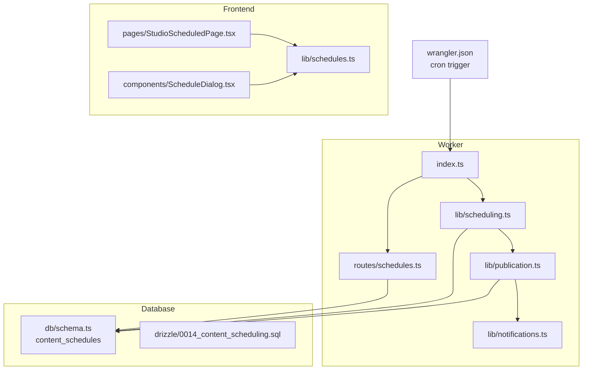
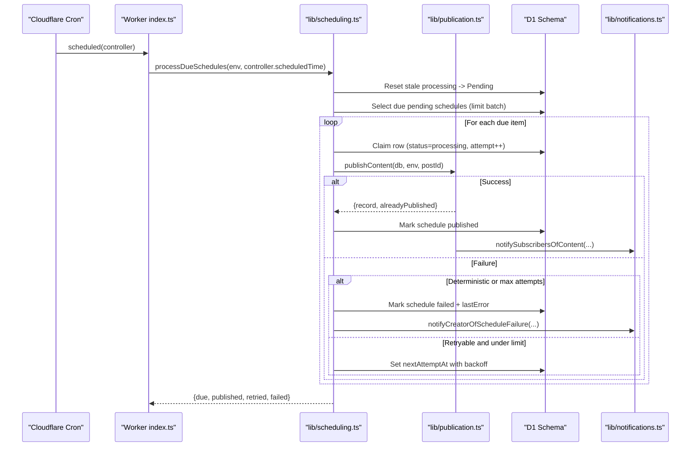
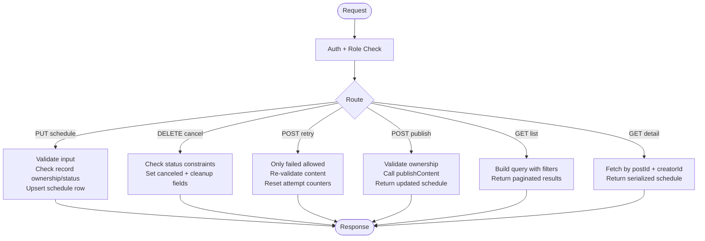
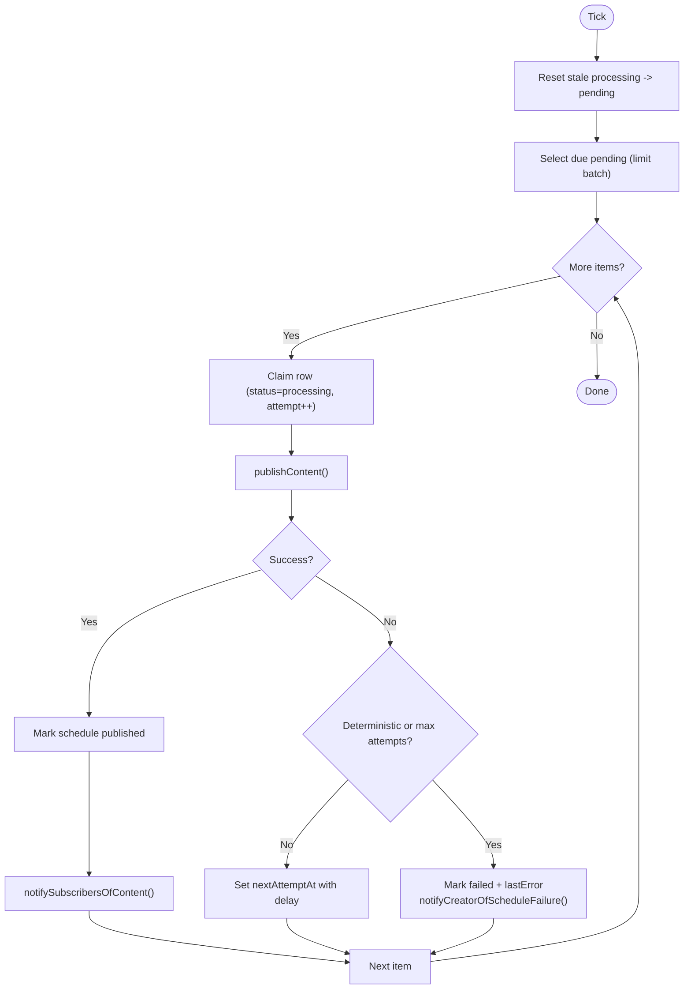
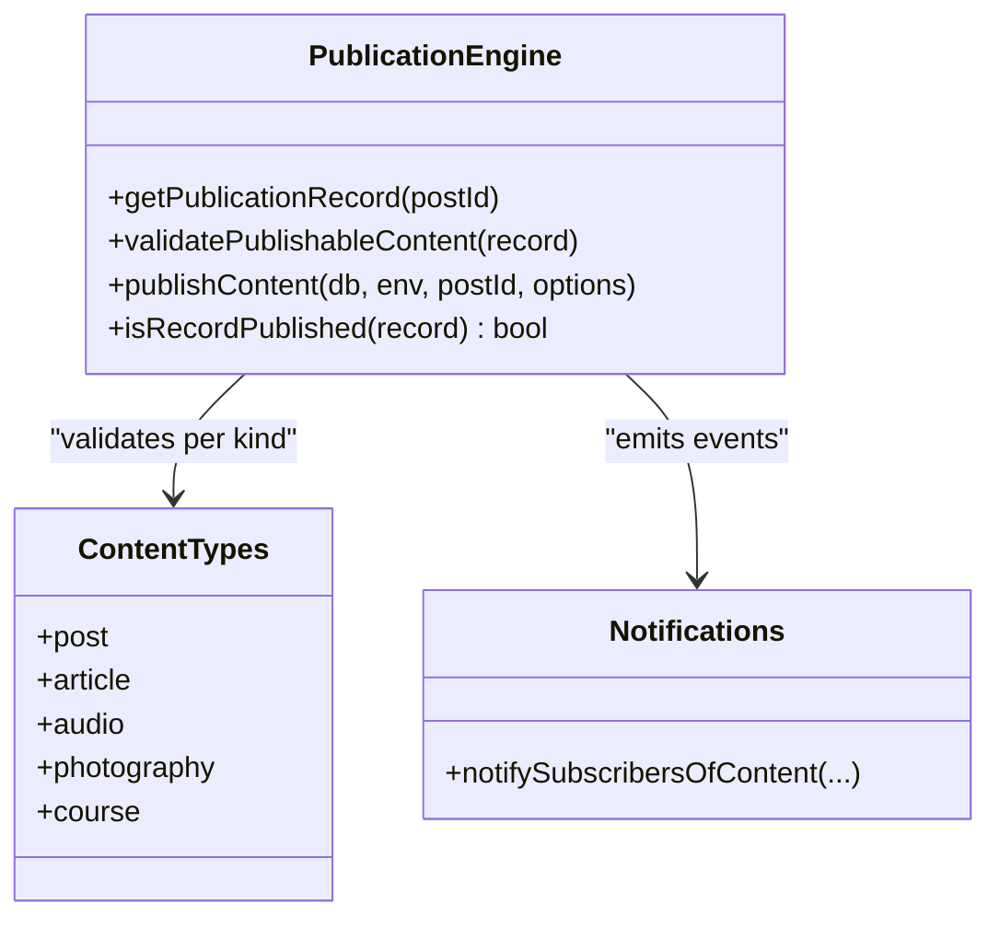
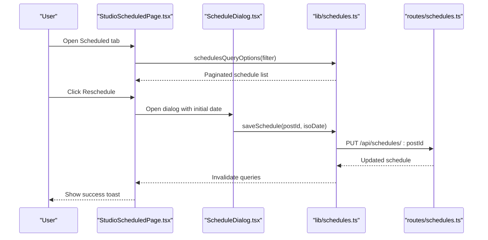
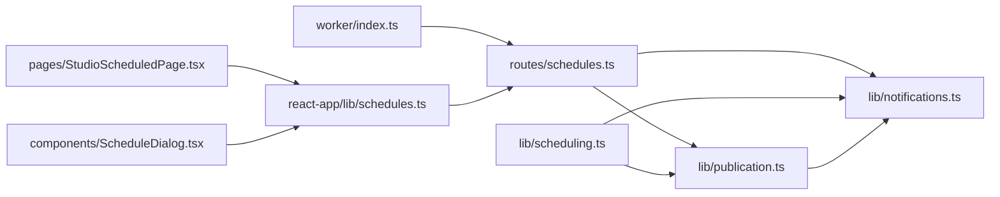

# Scheduling & Automation Routes

<cite>
**Referenced Files in This Document**
- [index.ts](file://src/worker/index.ts)
- [schedules.ts](file://src/worker/routes/schedules.ts)
- [scheduling.ts](file://src/worker/lib/scheduling.ts)
- [publication.ts](file://src/worker/lib/publication.ts)
- [notifications.ts](file://src/worker/lib/notifications.ts)
- [schema.ts](file://src/worker/db/schema.ts)
- [0014_content_scheduling.sql](file://drizzle/0014_content_scheduling.sql)
- [wrangler.json](file://wrangler.json)
- [StudioScheduledPage.tsx](file://src/react-app/pages/StudioScheduledPage.tsx)
- [ScheduleDialog.tsx](file://src/react-app/components/ScheduleDialog.tsx)
- [schedules.ts](file://src/react-app/lib/schedules.ts)
</cite>

## Table of Contents
1. [Introduction](#introduction)
2. [Project Structure](#project-structure)
3. [Core Components](#core-components)
4. [Architecture Overview](#architecture-overview)
5. [Detailed Component Analysis](#detailed-component-analysis)
6. [Dependency Analysis](#dependency-analysis)
7. [Performance Considerations](#performance-considerations)
8. [Troubleshooting Guide](#troubleshooting-guide)
9. [Conclusion](#conclusion)

## Introduction
This document explains the content scheduling and automation system that powers scheduled publishing, background job processing, and retry mechanisms. It covers:
- API routes for creating, listing, canceling, retrying, and immediately publishing scheduled content
- The cron-like worker that processes due schedules with retries and failure notifications
- Data model and indexes used to efficiently schedule and track publication attempts
- Frontend interfaces for managing schedules and triggering actions
- Reliability patterns including idempotency, stale-processing recovery, and error handling

## Project Structure
The scheduling system spans backend routes, a background scheduler, database schema, and frontend UI components:
- Worker entrypoint wires all API routes and registers a scheduled handler for cron execution
- Schedules API routes handle CRUD and lifecycle operations for scheduled content
- Scheduling library implements the due-scan, claim-and-publish loop, and retry/failure logic
- Publication library validates and publishes content atomically across related tables
- Notifications library emits user-facing alerts on failures and successful publications
- Database schema defines the content_schedules table and supporting indexes
- Wrangler configuration enables per-minute cron triggers in production
- React app exposes pages and dialogs to manage schedules and trigger publish-now or retry

**Diagram sources**
- [index.ts:1-71](file://src/worker/index.ts#L1-L71)
- [schedules.ts:1-295](file://src/worker/routes/schedules.ts#L1-L295)
- [scheduling.ts:1-127](file://src/worker/lib/scheduling.ts#L1-L127)
- [publication.ts:1-273](file://src/worker/lib/publication.ts#L1-L273)
- [notifications.ts:1-52](file://src/worker/lib/notifications.ts#L1-L52)
- [schema.ts:190-208](file://src/worker/db/schema.ts#L190-L208)
- [0014_content_scheduling.sql:1-47](file://drizzle/0014_content_scheduling.sql#L1-L47)
- [wrangler.json:66-83](file://wrangler.json#L66-L83)
- [StudioScheduledPage.tsx:1-167](file://src/react-app/pages/StudioScheduledPage.tsx#L1-L167)
- [ScheduleDialog.tsx:1-108](file://src/react-app/components/ScheduleDialog.tsx#L1-L108)
- [schedules.ts:1-73](file://src/react-app/lib/schedules.ts#L1-L73)

**Section sources**
- [index.ts:1-71](file://src/worker/index.ts#L1-L71)
- [wrangler.json:66-83](file://wrangler.json#L66-L83)

## Core Components
- Schedules API (Hono routes): Create/update/cancel schedules, list paginated queues, retry failed items, and publish now
- Cron Scheduler (processDueSchedules): Scans due pending schedules, claims them, attempts publication, retries with backoff, and fails after max attempts
- Publication Engine (publishContent): Validates content readiness, updates status and timestamps, and notifies subscribers
- Notification System: Emits creator failure alerts and subscriber publication notifications
- Data Model: content_schedules table tracks state, timing, attempts, errors, and published timestamps
- Frontend: Studio Scheduled page and Schedule dialog provide UI for scheduling, rescheduling, retrying, and immediate publishing

**Section sources**
- [schedules.ts:1-295](file://src/worker/routes/schedules.ts#L1-L295)
- [scheduling.ts:1-127](file://src/worker/lib/scheduling.ts#L1-L127)
- [publication.ts:1-273](file://src/worker/lib/publication.ts#L1-L273)
- [notifications.ts:284-326](file://src/worker/lib/notifications.ts#L284-L326)
- [schema.ts:190-208](file://src/worker/db/schema.ts#L190-L208)
- [0014_content_scheduling.sql:26-47](file://drizzle/0014_content_scheduling.sql#L26-L47)
- [StudioScheduledPage.tsx:1-167](file://src/react-app/pages/StudioScheduledPage.tsx#L1-L167)
- [ScheduleDialog.tsx:1-108](file://src/react-app/components/ScheduleDialog.tsx#L1-L108)
- [schedules.ts:1-73](file://src/react-app/lib/schedules.ts#L1-L73)

## Architecture Overview
The system uses Cloudflare Workers scheduled events to run a cron-like task every minute. The scheduler scans for due schedules, claims them atomically, attempts publication, and handles retries or failures. The API allows creators to schedule, cancel, retry, and publish immediately.

**Diagram sources**
- [index.ts:62-70](file://src/worker/index.ts#L62-L70)
- [scheduling.ts:42-126](file://src/worker/lib/scheduling.ts#L42-L126)
- [publication.ts:197-272](file://src/worker/lib/publication.ts#L197-L272)
- [notifications.ts:284-326](file://src/worker/lib/notifications.ts#L284-L326)
- [schema.ts:190-208](file://src/worker/db/schema.ts#L190-L208)

## Detailed Component Analysis

### Schedules API Routes
Endpoints exposed under /api/schedules:
- GET /api/schedules?status=&type=&page=&pageSize=: List schedules with filters and pagination
- GET /api/schedules/:postId: Get a single schedule by post ID
- PUT /api/schedules/:postId: Create or update a schedule for a draft content
- DELETE /api/schedules/:postId: Cancel a schedule if not processing/published
- POST /api/schedules/:postId/retry: Retry a failed schedule
- POST /api/schedules/:postId/publish: Publish immediately

Key behaviors:
- Authorization: Requires authenticated creator role
- Validation: Ensures minimum lead time for scheduling; rejects processing/published states for certain actions
- Idempotency: Upserts schedule by postId; increments revision on updates
- Error mapping: Maps PublicationError codes to appropriate HTTP responses

**Diagram sources**
- [schedules.ts:25-295](file://src/worker/routes/schedules.ts#L25-L295)

**Section sources**
- [schedules.ts:1-295](file://src/worker/routes/schedules.ts#L1-L295)

### Cron Scheduler and Retry Mechanism
The scheduler runs via Cloudflare Workers scheduled event configured in wrangler.json. It:
- Resets stale processing rows to pending to recover from crashes
- Selects due pending schedules ordered by nextAttemptAt
- Claims each row atomically and attempts publication
- Applies retry/backoff strategy with exponential delays
- Marks final failures and sends creator notifications

**Diagram sources**
- [scheduling.ts:42-126](file://src/worker/lib/scheduling.ts#L42-L126)
- [publication.ts:197-272](file://src/worker/lib/publication.ts#L197-L272)
- [notifications.ts:301-326](file://src/worker/lib/notifications.ts#L301-L326)

**Section sources**
- [scheduling.ts:1-127](file://src/worker/lib/scheduling.ts#L1-L127)
- [wrangler.json:66-83](file://wrangler.json#L66-L83)

### Publication Engine
The publication engine ensures content is valid and performs atomic updates:
- Validates account and moderation status
- Enforces content-specific rules (e.g., attachments, cover images, parent albums)
- Updates posts and type-specific tables in a transactional batch
- Sets schedule status to published and records timestamps
- Emits subscriber notifications and logs events

**Diagram sources**
- [publication.ts:1-273](file://src/worker/lib/publication.ts#L1-L273)
- [notifications.ts:284-326](file://src/worker/lib/notifications.ts#L284-L326)

**Section sources**
- [publication.ts:1-273](file://src/worker/lib/publication.ts#L1-L273)

### Data Model and Indexes
The content_schedules table stores scheduling metadata and lifecycle state:
- Primary key: post_id
- Status transitions: pending → processing → published | failed | canceled
- Timing: scheduled_for, next_attempt_at, processing_started_at
- Attempt tracking: attempt_count, revision
- Errors: last_error_code, last_error_message
- Timestamps: created_at, updated_at, published_at

Indexes optimize queries for due scanning and creator filtering:
- content_schedules_due_idx(status, next_attempt_at)
- content_schedules_creator_status_idx(creator_id, status, scheduled_for)

Migration also backfills posts.published_at based on child entity statuses.

**Section sources**
- [schema.ts:190-208](file://src/worker/db/schema.ts#L190-L208)
- [0014_content_scheduling.sql:1-47](file://drizzle/0014_content_scheduling.sql#L1-L47)

### Frontend Interfaces
- StudioScheduledPage.tsx: Displays upcoming, failed, and history tabs; supports filtering by content type; provides actions: edit, reschedule, retry, publish now, cancel, delete draft
- ScheduleDialog.tsx: Collects local datetime input, converts to ISO string, enforces minimum future time, and calls saveSchedule mutation
- lib/schedules.ts: Defines types and query/mutation helpers for schedules API

**Diagram sources**
- [StudioScheduledPage.tsx:1-167](file://src/react-app/pages/StudioScheduledPage.tsx#L1-L167)
- [ScheduleDialog.tsx:1-108](file://src/react-app/components/ScheduleDialog.tsx#L1-L108)
- [schedules.ts:1-73](file://src/react-app/lib/schedules.ts#L1-L73)
- [schedules.ts:170-224](file://src/worker/routes/schedules.ts#L170-L224)

**Section sources**
- [StudioScheduledPage.tsx:1-167](file://src/react-app/pages/StudioScheduledPage.tsx#L1-L167)
- [ScheduleDialog.tsx:1-108](file://src/react-app/components/ScheduleDialog.tsx#L1-L108)
- [schedules.ts:1-73](file://src/react-app/lib/schedules.ts#L1-L73)

## Dependency Analysis
- Worker entrypoint aggregates routes and registers scheduled handler
- Schedules routes depend on auth middleware, validation schemas, and publication utilities
- Scheduling library depends on database client, schema, and publication/notification libraries
- Publication library depends on schema and notification library
- Frontend depends on react-query hooks and API helpers

**Diagram sources**
- [index.ts:1-71](file://src/worker/index.ts#L1-L71)
- [schedules.ts:1-295](file://src/worker/routes/schedules.ts#L1-L295)
- [scheduling.ts:1-127](file://src/worker/lib/scheduling.ts#L1-L127)
- [publication.ts:1-273](file://src/worker/lib/publication.ts#L1-L273)
- [notifications.ts:1-52](file://src/worker/lib/notifications.ts#L1-L52)
- [schedules.ts:1-73](file://src/react-app/lib/schedules.ts#L1-L73)
- [StudioScheduledPage.tsx:1-167](file://src/react-app/pages/StudioScheduledPage.tsx#L1-L167)
- [ScheduleDialog.tsx:1-108](file://src/react-app/components/ScheduleDialog.tsx#L1-L108)

**Section sources**
- [index.ts:1-71](file://src/worker/index.ts#L1-L71)

## Performance Considerations
- Batch size: Due scan limits to a fixed number per tick to avoid long-running tasks
- Stale recovery: Processing rows older than threshold are reset to pending to survive crashes
- Index usage: Optimized indexes support efficient due scanning and creator-filtered queries
- Atomic claims: Row-level status checks prevent duplicate processing
- Minimal retries: Exponential backoff reduces load while preserving reliability
- Notification decoupling: Subscriber notifications are attempted but failures do not block publication

[No sources needed since this section provides general guidance]

## Troubleshooting Guide
Common issues and resolutions:
- Schedule too soon: Ensure the scheduled time is at least one minute in the future
- Cannot schedule processing/published: Only drafts can be scheduled; running or published items cannot be modified
- Failed schedules: Inspect last_error_code and last_error_message; use retry endpoint after fixing conditions
- Immediate publish conflicts: If currently processing, wait or cancel before publishing now
- Creator notifications: On final failure, a notification is sent to the creator with reason and link to studio

Operational monitoring:
- Logs include structured events for scheduling ticks, retries, failures, and published content
- Admin health endpoints expose counts of recent failures and overdue items

**Section sources**
- [schedules.ts:170-295](file://src/worker/routes/schedules.ts#L170-L295)
- [scheduling.ts:16-40](file://src/worker/lib/scheduling.ts#L16-L40)
- [notifications.ts:301-326](file://src/worker/lib/notifications.ts#L301-L326)

## Conclusion
The scheduling and automation system provides robust, reliable content publishing workflows with clear APIs, resilient background processing, and comprehensive error handling. Creators can schedule, reschedule, retry, and publish immediately through intuitive UI controls, while the worker ensures timely execution with retries and notifications. Proper indexing and atomic operations maintain performance and correctness under concurrent workloads.