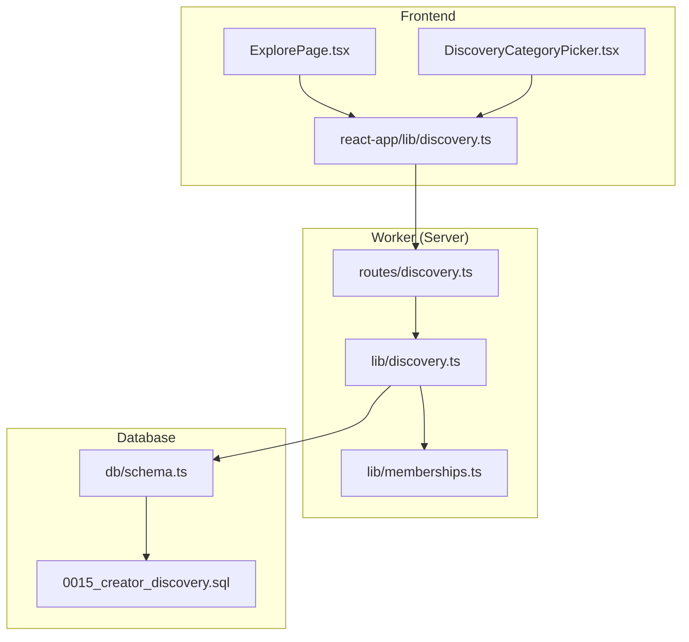
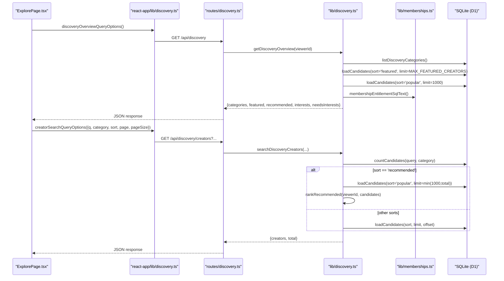
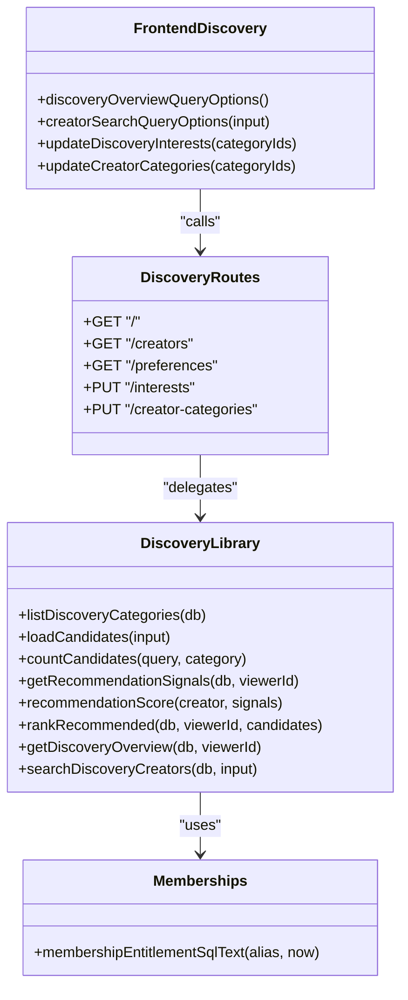
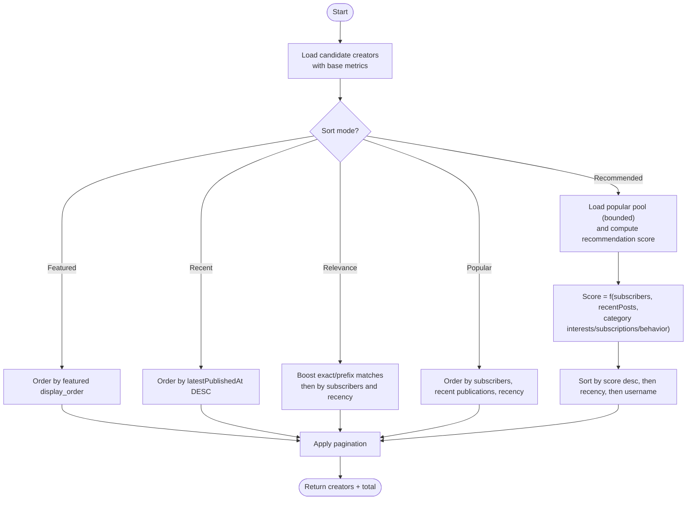

# Content Discovery Routes

<cite>
**Referenced Files in This Document**
- [discovery.ts](file://src/worker/routes/discovery.ts)
- [discovery.ts](file://src/worker/lib/discovery.ts)
- [discovery.ts](file://src/react-app/lib/discovery.ts)
- [0015_creator_discovery.sql](file://drizzle/0015_creator_discovery.sql)
- [schema.ts](file://src/worker/db/schema.ts)
- [ExplorePage.tsx](file://src/react-app/pages/ExplorePage.tsx)
- [DiscoveryCategoryPicker.tsx](file://src/react-app/components/DiscoveryCategoryPicker.tsx)
- [settings_.discovery.tsx](file://src/react-app/routes/_authenticated/settings_.discovery.tsx)
- [memberships.ts](file://src/worker/lib/memberships.ts)
</cite>

## Table of Contents
1. [Introduction](#introduction)
2. [Project Structure](#project-structure)
3. [Core Components](#core-components)
4. [Architecture Overview](#architecture-overview)
5. [Detailed Component Analysis](#detailed-component-analysis)
6. [Dependency Analysis](#dependency-analysis)
7. [Performance Considerations](#performance-considerations)
8. [Troubleshooting Guide](#troubleshooting-guide)
9. [Conclusion](#conclusion)
10. [Appendices](#appendices)

## Introduction
This document explains the content discovery routes that power recommendation algorithms and trending features for creators. It covers how creator categories are managed, how content tagging works, and how the recommendation engine ranks creators based on popularity, recency, and personalization signals. It also documents query parameters, ranking logic, and data models used by the system.

## Project Structure
The discovery feature spans server-side routes, business logic, database schema, and frontend integration:
- Server routes expose endpoints for overview, creator search, preferences, and interest/category management.
- Business logic implements candidate loading, scoring, and ranking.
- Database schema defines categories, user interests, creator categories, and featured creators.
- Frontend components and hooks consume the API to render discovery pages and manage preferences.

**Diagram sources**
- [discovery.ts:1-120](file://src/worker/routes/discovery.ts#L1-L120)
- [discovery.ts:1-390](file://src/worker/lib/discovery.ts#L1-L390)
- [memberships.ts:1-144](file://src/worker/lib/memberships.ts#L1-L144)
- [schema.ts:63-105](file://src/worker/db/schema.ts#L63-L105)
- [0015_creator_discovery.sql:1-70](file://drizzle/0015_creator_discovery.sql#L1-L70)
- [ExplorePage.tsx:1-223](file://src/react-app/pages/ExplorePage.tsx#L1-L223)
- [DiscoveryCategoryPicker.tsx:1-58](file://src/react-app/components/DiscoveryCategoryPicker.tsx#L1-L58)
- [discovery.ts:1-99](file://src/react-app/lib/discovery.ts#L1-L99)

**Section sources**
- [discovery.ts:1-120](file://src/worker/routes/discovery.ts#L1-L120)
- [discovery.ts:1-390](file://src/worker/lib/discovery.ts#L1-L390)
- [schema.ts:63-105](file://src/worker/db/schema.ts#L63-L105)
- [0015_creator_discovery.sql:1-70](file://drizzle/0015_creator_discovery.sql#L1-L70)
- [ExplorePage.tsx:1-223](file://src/react-app/pages/ExplorePage.tsx#L1-L223)
- [DiscoveryCategoryPicker.tsx:1-58](file://src/react-app/components/DiscoveryCategoryPicker.tsx#L1-L58)
- [discovery.ts:1-99](file://src/react-app/lib/discovery.ts#L1-L99)

## Core Components
- Discovery routes: HTTP endpoints for overview, creator search, preferences, and updating interests/categories.
- Discovery library: SQL queries, candidate normalization, category enrichment, recommendation scoring, and ranking.
- Membership utilities: Entitlement checks used when counting active subscribers and filtering subscriptions.
- Frontend discovery hooks: Query options and mutations for fetching overview/preferences and performing searches.

Key responsibilities:
- Validate and normalize inputs for search and preference updates.
- Build dynamic SQL with filters for text search, category slug, and sort modes.
- Compute recommendation scores using engagement signals and personalization factors.
- Return paginated results with total counts.

**Section sources**
- [discovery.ts:1-120](file://src/worker/routes/discovery.ts#L1-L120)
- [discovery.ts:1-390](file://src/worker/lib/discovery.ts#L1-L390)
- [memberships.ts:1-144](file://src/worker/lib/memberships.ts#L1-L144)
- [discovery.ts:1-99](file://src/react-app/lib/discovery.ts#L1-L99)

## Architecture Overview
The discovery flow starts at the frontend, which calls the worker’s discovery routes. The route validates input, delegates to the discovery library, which executes SQL against the database and returns structured results. Personalization is derived from user interests, subscriptions, and behavior.

**Diagram sources**
- [ExplorePage.tsx:1-223](file://src/react-app/pages/ExplorePage.tsx#L1-L223)
- [discovery.ts:1-99](file://src/react-app/lib/discovery.ts#L1-L99)
- [discovery.ts:1-120](file://src/worker/routes/discovery.ts#L1-L120)
- [discovery.ts:1-390](file://src/worker/lib/discovery.ts#L1-L390)
- [memberships.ts:1-144](file://src/worker/lib/memberships.ts#L1-L144)

## Detailed Component Analysis

### Discovery Routes (HTTP Endpoints)
Endpoints:
- GET /api/discovery: Returns overview including categories, featured creators, recommended creators, and user interests. Requires authentication.
- GET /api/discovery/creators: Search and list creators with query, category, sort, pagination. Supports relevance, recommended, popular, recent.
- GET /api/discovery/preferences: Returns available categories and current user interests and creator categories.
- PUT /api/discovery/interests: Update user interests (up to a maximum). Validates active categories.
- PUT /api/discovery/creator-categories: Update public creator categories (only for creators). Validates active categories.

Input validation:
- Query schema enforces max lengths, enum sorts, and pagination bounds.
- Category selection schemas enforce uniqueness and maximum limits.

Authorization:
- All routes require authentication; creator-category update requires creator role.

Error handling:
- Validation errors return 422 via zodHook.
- Invalid category selections return 400 if any selected category is inactive.
- Unauthorized role returns 403.

**Section sources**
- [discovery.ts:1-120](file://src/worker/routes/discovery.ts#L1-L120)

### Discovery Library (Algorithm Implementation)
Candidate loading:
- Base SQL aggregates published content count, distinct content types, active subscriber count, recent publication count, latest published timestamp, and whether viewer is subscribed.
- Filters support text search across username, display name, tagline, and category names; category filter by slug; sort modes include featured, recent, relevance (when query present), and default popular.

Recommendation signals:
- Interests: explicit user-selected categories.
- Subscriptions: categories of creators the user subscribes to (membership entitlement considered).
- Behavior: categories of creators whose content the user liked or saved.

Scoring and ranking:
- Score combines capped active subscriber count and recent publication count, plus weighted boosts per matching category source (interests highest, then subscriptions, then behavior).
- Tiebreakers use latest published time and lexicographic username.
- Recommendation reason strings explain why a creator was suggested.

Personalization:
- Viewer-subscribed creators are excluded from recommendations.
- If no interests set, overview indicates needsInterests to prompt setup.

Caching considerations:
- Frontend uses React Query with staleTime to cache responses. No server-side caching is implemented in these routes.

Trending calculation:
- “Popular” sort uses active subscriber count, recent publication count, and latest published timestamp.
- “Recent” sort prioritizes latest published timestamp.
- “Relevance” boosts exact matches and prefix matches for query terms.

Freshness scoring:
- Latest published timestamp influences ordering in multiple sorts.
- Recent publication count over a fixed window contributes to popularity.

Engagement metrics aggregation:
- Active subscriber count reflects membership status considering entitlement rules.
- Behavior signals derive from likes and saved items.

**Section sources**
- [discovery.ts:1-390](file://src/worker/lib/discovery.ts#L1-L390)
- [memberships.ts:1-144](file://src/worker/lib/memberships.ts#L1-L144)

### Database Schema and Migrations
Tables:
- discovery_categories: Master list of categories with slugs, names, descriptions, display order, and active flag.
- creator_categories: Maps creators to categories with display order.
- user_category_interests: Stores user-selected interests.
- featured_creators: Curated list of featured creators with display order.

Indexes:
- Optimized for active+order lookups, category-to-creator joins, and user-interest queries.

Seed data:
- Default categories inserted during migration.

**Section sources**
- [0015_creator_discovery.sql:1-70](file://drizzle/0015_creator_discovery.sql#L1-L70)
- [schema.ts:63-105](file://src/worker/db/schema.ts#L63-L105)

### Frontend Integration
- ExplorePage orchestrates overview and search queries, renders featured/recommended sections, and provides search and sorting controls.
- DiscoveryCategoryPicker allows selecting up to a maximum number of categories for interests.
- React Query keys and options encapsulate API calls and caching configuration.

**Section sources**
- [ExplorePage.tsx:1-223](file://src/react-app/pages/ExplorePage.tsx#L1-L223)
- [DiscoveryCategoryPicker.tsx:1-58](file://src/react-app/components/DiscoveryCategoryPicker.tsx#L1-L58)
- [discovery.ts:1-99](file://src/react-app/lib/discovery.ts#L1-L99)
- [settings_.discovery.tsx:1-7](file://src/react-app/routes/_authenticated/settings_.discovery.tsx#L1-L7)

## Dependency Analysis
- Routes depend on Zod schemas for validation and middleware for auth.
- Discovery library depends on membership utilities for entitlement-aware subscriber counts.
- Frontend discovery hooks depend on shared API helpers and React Query.

**Diagram sources**
- [discovery.ts:1-120](file://src/worker/routes/discovery.ts#L1-L120)
- [discovery.ts:1-390](file://src/worker/lib/discovery.ts#L1-L390)
- [memberships.ts:1-144](file://src/worker/lib/memberships.ts#L1-L144)
- [discovery.ts:1-99](file://src/react-app/lib/discovery.ts#L1-L99)

**Section sources**
- [discovery.ts:1-120](file://src/worker/routes/discovery.ts#L1-L120)
- [discovery.ts:1-390](file://src/worker/lib/discovery.ts#L1-L390)
- [memberships.ts:1-144](file://src/worker/lib/memberships.ts#L1-L144)
- [discovery.ts:1-99](file://src/react-app/lib/discovery.ts#L1-L99)

## Performance Considerations
- SQL optimization: Queries use indexed columns for category lookups and active flags; LIMIT/OFFSET pagination avoids large result sets.
- Candidate pool sizing: Recommended mode loads up to a bounded pool (e.g., 1000) before ranking to control CPU usage.
- Subscription entitlement: Membership checks are embedded in SQL to avoid extra round-trips.
- Frontend caching: React Query staleTime reduces repeated network requests.
- Batch operations: Preference updates use batched statements to minimize transaction overhead.

[No sources needed since this section provides general guidance]

## Troubleshooting Guide
Common issues and resolutions:
- Validation errors (422): Ensure query fields respect length limits and enums; category arrays must be unique and within maximums.
- Inactive categories: Interest/category updates fail if any selected category is inactive; verify category active status.
- Role restrictions: Creator-only endpoints return 403 if not logged in as creator.
- Empty results: Adjust search query, category filter, or sort mode; ensure creators have published content and active accounts.

**Section sources**
- [discovery.ts:1-120](file://src/worker/routes/discovery.ts#L1-L120)

## Conclusion
The discovery system provides robust creator search and personalized recommendations through well-defined routes, clear ranking logic, and efficient SQL queries. It balances popularity, freshness, and personalization while maintaining scalability via bounded pools and indexed queries. Frontend caching improves responsiveness, and validation ensures data integrity.

[No sources needed since this section summarizes without analyzing specific files]

## Appendices

### API Reference: Discovery Endpoints
- GET /api/discovery
  - Purpose: Overview with categories, featured, recommended, and user interests.
  - Auth: Required.
  - Response includes categories, featured creators, recommended creators, interests, and needsInterests flag.

- GET /api/discovery/creators
  - Query parameters:
    - q: string, optional, trimmed, max length enforced.
    - category: string, optional, category slug.
    - sort: enum ["relevance","recommended","popular","recent"], defaults to relevance.
    - page: integer >= 1, defaults to 1.
    - pageSize: integer between 1 and 50, defaults to 20.
  - Response: creators array and total count; includes page and pageSize.

- GET /api/discovery/preferences
  - Purpose: Lists all categories and current user interests and creator categories.
  - Auth: Required.

- PUT /api/discovery/interests
  - Body: { categoryIds: string[] }, unique, max length enforced.
  - Validates active categories; replaces existing interests.

- PUT /api/discovery/creator-categories
  - Body: { categoryIds: string[] }, unique, max length enforced.
  - Only creators can update; validates active categories; replaces existing categories.

**Section sources**
- [discovery.ts:1-120](file://src/worker/routes/discovery.ts#L1-L120)
- [discovery.ts:1-99](file://src/react-app/lib/discovery.ts#L1-L99)

### Ranking Algorithm Flowchart

**Diagram sources**
- [discovery.ts:167-220](file://src/worker/lib/discovery.ts#L167-L220)
- [discovery.ts:290-318](file://src/worker/lib/discovery.ts#L290-L318)