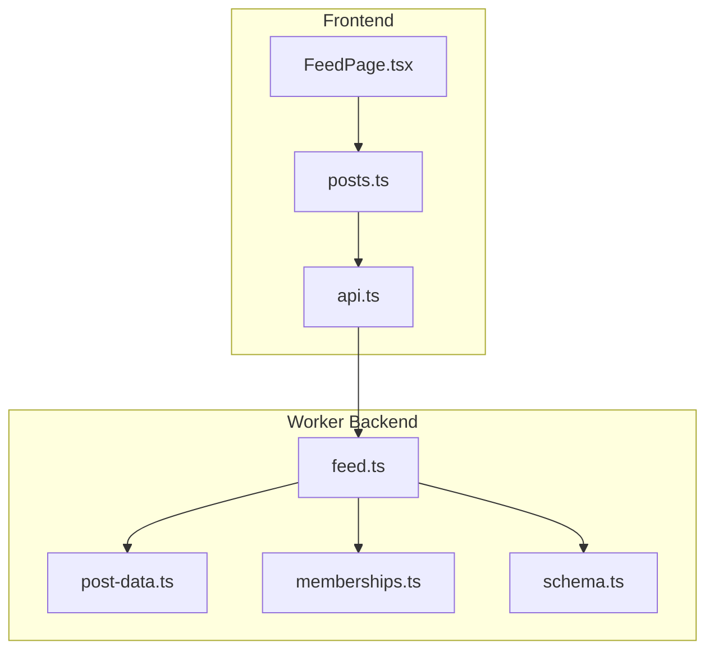
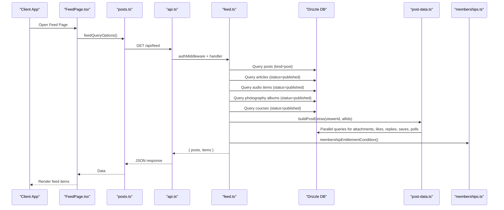
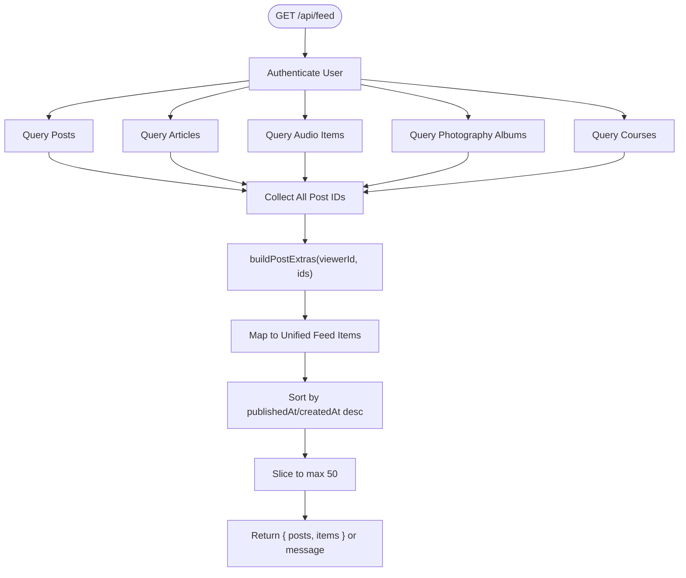
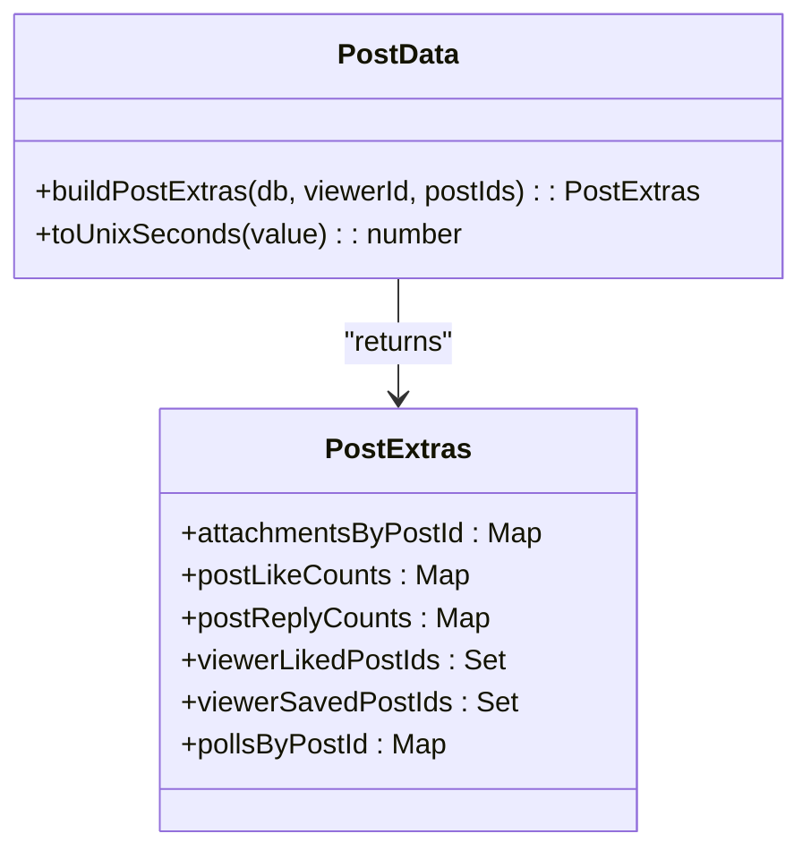
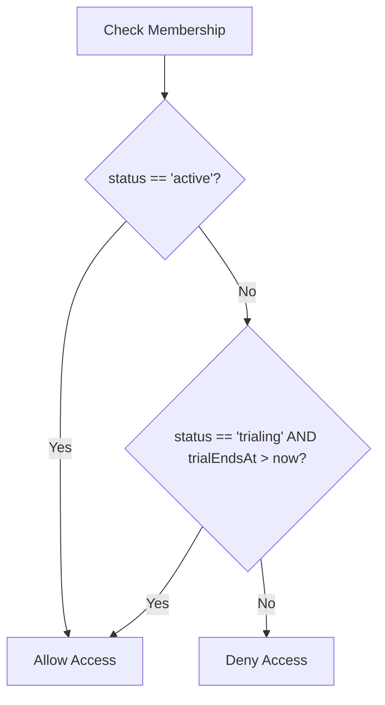
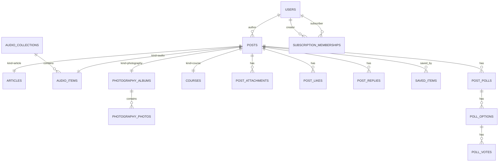
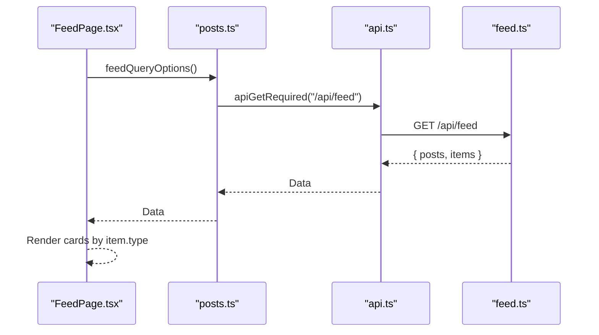
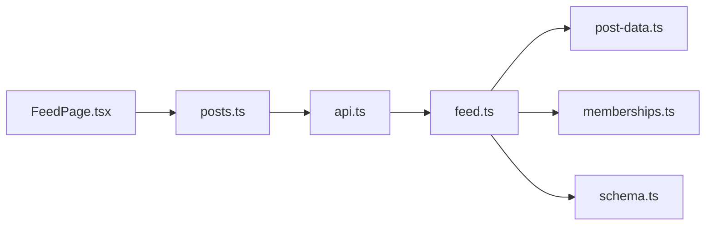

# Feed Generation Routes

<cite>
**Referenced Files in This Document**
- [feed.ts](file://src/worker/routes/feed.ts)
- [post-data.ts](file://src/worker/lib/post-data.ts)
- [memberships.ts](file://src/worker/lib/memberships.ts)
- [schema.ts](file://src/worker/db/schema.ts)
- [FeedPage.tsx](file://src/react-app/pages/FeedPage.tsx)
- [posts.ts](file://src/react-app/lib/posts.ts)
- [api.ts](file://src/react-app/lib/api.ts)
- [articles.ts](file://src/react-app/lib/articles.ts)
- [audio.ts](file://src/react-app/lib/audio.ts)
</cite>

## Table of Contents
1. [Introduction](#introduction)
2. [Project Structure](#project-structure)
3. [Core Components](#core-components)
4. [Architecture Overview](#architecture-overview)
5. [Detailed Component Analysis](#detailed-component-analysis)
6. [Dependency Analysis](#dependency-analysis)
7. [Performance Considerations](#performance-considerations)
8. [Troubleshooting Guide](#troubleshooting-guide)
9. [Conclusion](#conclusion)

## Introduction
This document explains the feed generation routes that aggregate content from multiple creators based on user subscriptions. It covers how posts, articles, audio collections and items, photography albums, and courses are fetched, filtered by subscription entitlements, validated for moderation and account status, and combined into a unified feed response. It also details database query optimization strategies, pagination handling, performance considerations for large-scale aggregation, and the relationship between user subscriptions, creator entitlements, and personalized feed delivery.

## Project Structure
The feed feature spans both the worker backend (Hono routes and Drizzle queries) and the React frontend (pages and query hooks). The key files involved are:
- Worker route for the feed endpoint
- Utilities for post extras and URL helpers
- Membership entitlement logic
- Database schema definitions for all content types and relationships
- Frontend page and query options to call the feed API

**Diagram sources**
- [FeedPage.tsx](file://src/react-app/pages/FeedPage.tsx)
- [posts.ts](file://src/react-app/lib/posts.ts)
- [api.ts](file://src/react-app/lib/api.ts)
- [feed.ts](file://src/worker/routes/feed.ts)
- [post-data.ts](file://src/worker/lib/post-data.ts)
- [memberships.ts](file://src/worker/lib/memberships.ts)
- [schema.ts](file://src/worker/db/schema.ts)

**Section sources**
- [feed.ts](file://src/worker/routes/feed.ts)
- [post-data.ts](file://src/worker/lib/post-data.ts)
- [memberships.ts](file://src/worker/lib/memberships.ts)
- [schema.ts](file://src/worker/db/schema.ts)
- [FeedPage.tsx](file://src/react-app/pages/FeedPage.tsx)
- [posts.ts](file://src/react-app/lib/posts.ts)
- [api.ts](file://src/react-app/lib/api.ts)

## Core Components
- Feed Route: Aggregates five content types with subscription-based filtering and returns a unified list.
- Post Extras Builder: Efficiently fetches attachments, like/reply counts, viewer likes/saves, and polls for many posts in parallel.
- Membership Entitlement: Provides SQL conditions and checks for active/trialing memberships.
- Schema Definitions: Define tables for users, posts, articles, audio collections/items, photography albums/photos, courses, and related interaction tables.

Key responsibilities:
- Enforce moderation and account status filters
- Ensure subscriber has an active or valid trial membership to the creator
- Combine heterogeneous content into a single sorted feed
- Attach rich metadata via post extras

**Section sources**
- [feed.ts](file://src/worker/routes/feed.ts)
- [post-data.ts](file://src/worker/lib/post-data.ts)
- [memberships.ts](file://src/worker/lib/memberships.ts)
- [schema.ts](file://src/worker/db/schema.ts)

## Architecture Overview
The feed endpoint performs multiple targeted queries per content type, each constrained by:
- Subscription membership between the current user and the creator
- Active or trialing membership status
- Published timestamps and moderation/account statuses
- Content-specific status fields (e.g., article/podcast/course published)

After collecting IDs across all content types, it calls a shared helper to build post extras in parallel, then maps results into a unified array sorted by publish/create time and truncated to a fixed size.

**Diagram sources**
- [FeedPage.tsx](file://src/react-app/pages/FeedPage.tsx)
- [posts.ts](file://src/react-app/lib/posts.ts)
- [api.ts](file://src/react-app/lib/api.ts)
- [feed.ts](file://src/worker/routes/feed.ts)
- [post-data.ts](file://src/worker/lib/post-data.ts)
- [memberships.ts](file://src/worker/lib/memberships.ts)

## Detailed Component Analysis

### Feed Route (/api/feed)
- Authentication: Uses middleware to ensure a valid user context.
- Queries:
  - Posts: kind=post, publishedAt not null, moderationStatus=active, author accountStatus=active, subscriber is subscribed to author, membership entitlement condition.
  - Articles: kind=article, publishedAt not null, moderationStatus=active, author accountStatus=active, articles.status=published, subscriber subscribed to author, membership entitlement condition.
  - Audio Items: status=published, associated post published and moderated active, author accountStatus=active, collection status=published, subscriber subscribed to author, membership entitlement condition.
  - Photography Albums: status=published, associated post published and moderated active, author accountStatus=active, subscriber subscribed to author, membership entitlement condition.
  - Courses: status=published, associated post published and moderated active, author accountStatus=active, subscriber subscribed to author, membership entitlement condition.
- Post Extras: Collects all relevant post IDs and builds attachments, like/reply counts, viewer liked/saved flags, and polls in parallel.
- Mapping: Converts rows into typed feed items with author info, media URLs, and engagement metrics.
- Sorting and Pagination: Merges all mapped items, sorts by publishedAt or createdAt descending, and slices to a maximum of 50 items. Returns both posts and items arrays; if no subscriptions exist, returns a message.

**Diagram sources**
- [feed.ts](file://src/worker/routes/feed.ts)
- [post-data.ts](file://src/worker/lib/post-data.ts)

**Section sources**
- [feed.ts](file://src/worker/routes/feed.ts)

### Post Extras Builder
- Purpose: Efficiently gather cross-cutting data for many posts without N+1 queries.
- Operations:
  - Attachments by post
  - Like counts grouped by post
  - Reply counts grouped by post with moderation and author status filters
  - Viewer’s liked post IDs
  - Viewer’s saved post IDs
  - Polls with options, vote counts, and viewer selection
- Complexity: O(N) reads across several tables using inArray filters and groupBy aggregations; parallelized via Promise.all.

**Diagram sources**
- [post-data.ts](file://src/worker/lib/post-data.ts)

**Section sources**
- [post-data.ts](file://src/worker/lib/post-data.ts)

### Membership Entitlement Logic
- Conditions:
  - Active membership qualifies immediately
  - Trialing membership qualifies while trialEndsAt > now
- Usage: Applied consistently across all content queries to ensure only entitled subscribers see creator content.

**Diagram sources**
- [memberships.ts](file://src/worker/lib/memberships.ts)

**Section sources**
- [memberships.ts](file://src/worker/lib/memberships.ts)

### Database Schema Relationships
- Users: Central identity with accountStatus and role.
- Posts: Base entity with kind discriminator and moderation fields.
- Articles: Linked to posts via postId; includes title, excerpt, markdown, cover, and publishedAt.
- Audio Collections and Items: Collections hold items; items link back to posts and include streaming metadata.
- Photography Albums and Photos: Albums link to posts; photos belong to albums with preview/original assets.
- Courses: Link to posts; include modules and lessons (not used directly in feed but part of schema).
- Interactions: Likes, replies, saved items, polls, votes.
- Subscriptions: subscriptionMemberships ties subscriberId to creatorId with status and trial fields.

**Diagram sources**
- [schema.ts](file://src/worker/db/schema.ts)

**Section sources**
- [schema.ts](file://src/worker/db/schema.ts)

### Frontend Integration
- FeedPage consumes feedQueryOptions which calls /api/feed.
- Response shape supports both posts and items arrays; items is preferred when present.
- Error handling uses normalized ApiError with status and code.

**Diagram sources**
- [FeedPage.tsx](file://src/react-app/pages/FeedPage.tsx)
- [posts.ts](file://src/react-app/lib/posts.ts)
- [api.ts](file://src/react-app/lib/api.ts)
- [feed.ts](file://src/worker/routes/feed.ts)

**Section sources**
- [FeedPage.tsx](file://src/react-app/pages/FeedPage.tsx)
- [posts.ts](file://src/react-app/lib/posts.ts)
- [api.ts](file://src/react-app/lib/api.ts)

## Dependency Analysis
- Route dependencies:
  - Drizzle ORM for querying posts, articles, audio, photography, courses, and interactions
  - Membership entitlement condition reused across queries
  - Post extras builder for efficient enrichment
- Frontend dependencies:
  - TanStack Query for caching and fetching
  - API utilities for standardized error handling and request methods
- Schema dependencies:
  - Consistent use of indexes on moderation, publishedAt, creatorId, and status fields to optimize queries

**Diagram sources**
- [FeedPage.tsx](file://src/react-app/pages/FeedPage.tsx)
- [posts.ts](file://src/react-app/lib/posts.ts)
- [api.ts](file://src/react-app/lib/api.ts)
- [feed.ts](file://src/worker/routes/feed.ts)
- [post-data.ts](file://src/worker/lib/post-data.ts)
- [memberships.ts](file://src/worker/lib/memberships.ts)
- [schema.ts](file://src/worker/db/schema.ts)

**Section sources**
- [feed.ts](file://src/worker/routes/feed.ts)
- [post-data.ts](file://src/worker/lib/post-data.ts)
- [memberships.ts](file://src/worker/lib/memberships.ts)
- [schema.ts](file://src/worker/db/schema.ts)
- [FeedPage.tsx](file://src/react-app/pages/FeedPage.tsx)
- [posts.ts](file://src/react-app/lib/posts.ts)
- [api.ts](file://src/react-app/lib/api.ts)

## Performance Considerations
- Query Optimization:
  - Separate targeted queries per content type reduce join complexity and leverage indexes on moderationStatus, publishedAt, creatorId, and status fields.
  - InArray filters for post extras avoid N+1 patterns and batch loads attachments, likes, replies, saves, and polls efficiently.
- Parallelization:
  - Post extras builder uses Promise.all to execute independent queries concurrently.
- Pagination:
  - Each content-type query limits to 50 rows; final merged list is sliced to 50 items. For larger feeds, consider cursor-based pagination or offset with stable sort keys.
- Caching:
  - Frontend uses TanStack Query to cache feed responses and reduce redundant network requests.
- Indexing Strategy:
  - Ensure indexes exist on frequently filtered columns: posts.moderationStatus, posts.publishedAt, posts.kind, subscriptionMemberships.subscriberId, subscriptionMemberships.creatorId, and content-specific status fields.
- Memory and Payload Size:
  - Limit returned fields to what is needed for the feed view; defer detailed payloads to detail endpoints.
- Media URLs:
  - Use lightweight URL helpers instead of embedding full media data in feed responses.

[No sources needed since this section provides general guidance]

## Troubleshooting Guide
Common issues and resolutions:
- Empty feed with “You haven't subscribed to any creators yet”:
  - Verify subscriptionMemberships entries for the viewer and target creators.
  - Confirm membership status is active or trialing within the trial window.
- No articles/audio/photography/courses appear:
  - Check content-specific status fields (published/draft).
  - Validate associated posts have publishedAt set and moderationStatus=active.
  - Ensure creator accountStatus=active.
- Incorrect ordering:
  - Confirm sorting uses publishedAt where available, otherwise falls back to createdAt.
- High latency:
  - Inspect database indexes and query plans for inArray and join operations.
  - Reduce payload size by limiting fields and deferring heavy data.

**Section sources**
- [feed.ts](file://src/worker/routes/feed.ts)
- [post-data.ts](file://src/worker/lib/post-data.ts)
- [memberships.ts](file://src/worker/lib/memberships.ts)
- [schema.ts](file://src/worker/db/schema.ts)

## Conclusion
The feed generation system aggregates multiple content types through subscription-based filtering, robust moderation and account validation, and efficient database queries. By leveraging parallel post extras loading and consistent membership entitlement conditions, it delivers a personalized, performant feed suitable for large-scale usage. Proper indexing, careful field selection, and frontend caching further enhance scalability and responsiveness.

[No sources needed since this section summarizes without analyzing specific files]