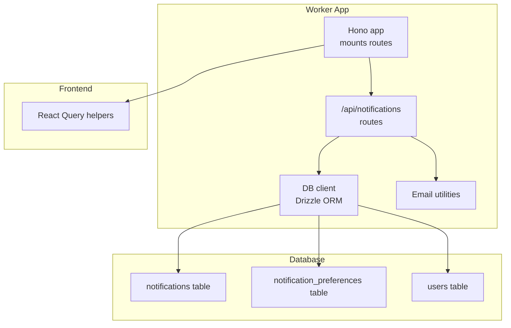
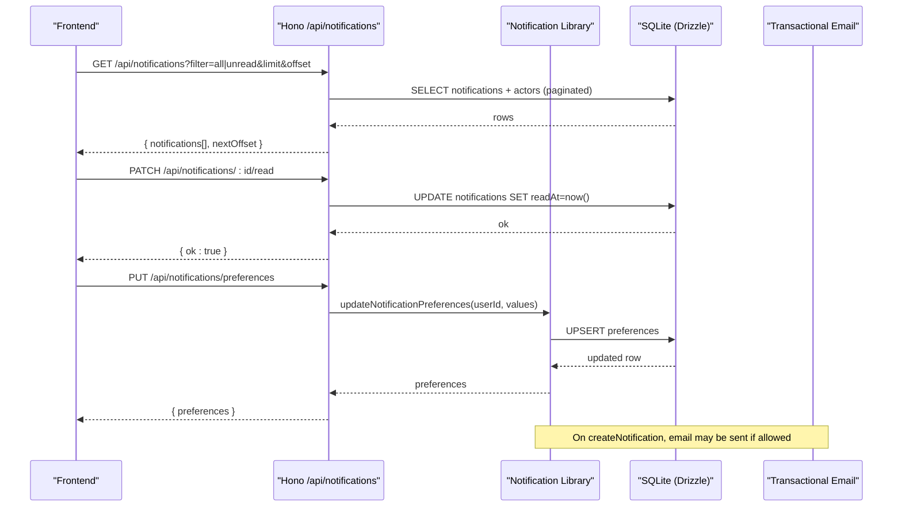
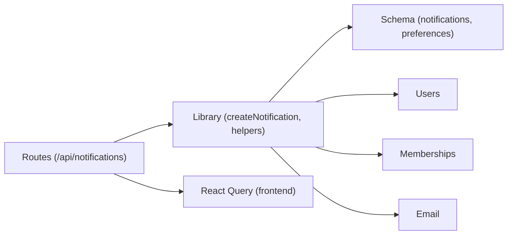

# Notification System Routes

<cite>
**Referenced Files in This Document**
- [notifications.ts](file://src/worker/routes/notifications.ts)
- [notifications.ts (lib)](file://src/worker/lib/notifications.ts)
- [schema.ts](file://src/worker/db/schema.ts)
- [0009_notifications.sql](file://drizzle/0009_notifications.sql)
- [index.ts (worker)](file://src/worker/index.ts)
- [notifications.ts (react-app lib)](file://src/react-app/lib/notifications.ts)
- [posts.ts](file://src/worker/routes/posts.ts)
- [admin.ts](file://src/worker/routes/admin.ts)
- [publication.ts](file://src/worker/lib/publication.ts)
- [notifications.integration.test.ts](file://src/worker/routes/notifications.integration.test.ts)
</cite>

## Table of Contents
1. [Introduction](#introduction)
2. [Project Structure](#project-structure)
3. [Core Components](#core-components)
4. [Architecture Overview](#architecture-overview)
5. [Detailed Component Analysis](#detailed-component-analysis)
6. [Dependency Analysis](#dependency-analysis)
7. [Performance Considerations](#performance-considerations)
8. [Troubleshooting Guide](#troubleshooting-guide)
9. [Conclusion](#conclusion)
10. [Appendices](#appendices)

## Introduction
This document provides comprehensive documentation for the notification system routes and supporting logic. It covers real-time notification delivery patterns, queuing mechanisms, user preference management, notification types, lifecycle from creation to delivery, priority handling, rate limiting considerations, database schema and indexing strategies, cleanup policies, payload structures, filtering options, bulk operations, performance optimization for high-frequency scenarios, and caching strategies for improved response times.

## Project Structure
The notification system is implemented as a set of Hono routes under /api/notifications, backed by Drizzle ORM models and SQLite tables. The worker application mounts these routes at runtime. Frontend code consumes the API via React Query helpers.

**Diagram sources**
- [index.ts (worker):24-45](file://src/worker/index.ts#L24-L45)
- [notifications.ts:11-12](file://src/worker/routes/notifications.ts#L11-L12)
- [schema.ts:871-930](file://src/worker/db/schema.ts#L871-L930)

**Section sources**
- [index.ts (worker):24-45](file://src/worker/index.ts#L24-L45)
- [notifications.ts:11-12](file://src/worker/routes/notifications.ts#L11-L12)

## Core Components
- Notification routes: GET list with pagination and unread filter, GET unread count, GET/PUT preferences, PATCH mark read, POST mark all read.
- Notification library: createNotification with deduplication, email decision based on preferences, and side-effect-safe wrappers; helper functions for specific event notifications.
- Database schema: notifications and notification_preferences tables with indexes optimized for common queries.
- Frontend integration: React Query hooks and typed request/response helpers.

Key responsibilities:
- Route handlers enforce authentication and input validation, then delegate to DB operations or business logic.
- Library functions encapsulate notification creation, deduplication, email eligibility, and safe async side effects.
- Schema defines entities, constraints, and indexes for efficient querying.

**Section sources**
- [notifications.ts:74-183](file://src/worker/routes/notifications.ts#L74-L183)
- [notifications.ts (lib):153-234](file://src/worker/lib/notifications.ts#L153-L234)
- [schema.ts:871-930](file://src/worker/db/schema.ts#L871-L930)
- [notifications.ts (react-app lib):49-78](file://src/react-app/lib/notifications.ts#L49-L78)

## Architecture Overview
The notification system follows a clear separation between HTTP routes, business logic, and persistence. Notifications are created through library functions that handle deduplication and optional email delivery. Routes expose CRUD-like operations for listing, marking read, and managing preferences.

**Diagram sources**
- [notifications.ts:74-183](file://src/worker/routes/notifications.ts#L74-L183)
- [notifications.ts (lib):153-234](file://src/worker/lib/notifications.ts#L153-L234)

## Detailed Component Analysis

### Notification Routes
Endpoints:
- GET /api/notifications: Lists notifications for the authenticated user with optional filter (all/unread), limit (1–50), offset (≥0). Returns serialized notifications and nextOffset for pagination.
- GET /api/notifications/unread-count: Returns count of unread notifications for the current user.
- GET /api/notifications/preferences: Retrieves user’s notification preferences, creating defaults if missing.
- PUT /api/notifications/preferences: Updates preferences with validation.
- PATCH /api/notifications/:notificationId/read: Marks a single notification as read if owned by the user.
- POST /api/notifications/read-all: Marks all unread notifications for the user as read.

Behavior highlights:
- Authentication enforced via middleware.
- Input validation using Zod schemas.
- Efficient queries using indexes on recipient_id and timestamps.
- Actor details joined from users table.

**Section sources**
- [notifications.ts:74-183](file://src/worker/routes/notifications.ts#L74-L183)

### Notification Library
Core functions:
- getNotificationPreferences: Reads or creates default preferences per user.
- updateNotificationPreferences: Upserts preferences and returns updated state.
- createNotification: Creates a notification with deduplication via unique dedupe_key; decides email delivery based on category and preferences; updates email status accordingly.
- notifySubscribersOfContent: Broadcasts content_published notifications to eligible subscribers.
- notifyUserOfReply: Notifies recipients about new replies or thread continuations.
- notifyCreatorOfPostLike: Notifies creators when their posts are liked.
- notifyMembershipActivated: Notifies both creator and subscriber on membership activation.
- notifySubscriptionStatusChanged: Notifies subscribers about subscription status changes or payment failures.
- notifyCreatorOfScheduleFailure: Forces account-category notification for scheduling failures.

Deduplication strategy:
- Each notification has a unique dedupe_key; duplicate attempts return existing records without re-insertion.

Email decision logic:
- Account category always allows email unless disabled globally.
- Other categories respect per-category toggles.
- forceEmail flag can override category rules.
- Transactional email must be enabled in environment.

Error handling:
- Email send failures are captured and stored as failed status with truncated error messages.

**Section sources**
- [notifications.ts (lib):118-234](file://src/worker/lib/notifications.ts#L118-L234)
- [notifications.ts (lib):257-461](file://src/worker/lib/notifications.ts#L257-L461)

### Database Schema and Indexing
Tables:
- notifications: Stores all notification records with fields for type, category, title, body, targetUrl, entity references, metadata, dedupe_key, read_at, email_status, email_error, email_sent_at, created_at.
- notification_preferences: Per-user toggles for email_enabled, content_email_enabled, interaction_email_enabled, subscription_email_enabled, with timestamps.

Indexes:
- Unique index on dedupe_key ensures deduplication.
- Composite index on (recipient_id, read_at, created_at) optimizes filtered lists and unread counts.
- Index on (recipient_id, created_at) supports general listing by time.
- Index on actor_id supports actor-centric queries.

Constraints:
- Foreign keys to users table with cascade/set null semantics.
- Enumerated types for notification type and category.

**Section sources**
- [schema.ts:871-930](file://src/worker/db/schema.ts#L871-L930)
- [0009_notifications.sql:1-41](file://drizzle/0009_notifications.sql#L1-L41)

### Frontend Integration
React Query helpers:
- notificationsQueryOptions(filter): Fetches paginated notifications with staleTime.
- unreadNotificationCountQueryOptions: Polls unread count.
- notificationPreferencesQueryOptions: Fetches preferences.
- markNotificationRead(id): Marks a single notification read.
- markAllNotificationsRead(): Bulk marks all unread as read.
- updateNotificationPreferences(values): Updates preferences.

Types:
- NotificationItem includes actor info, email status, timestamps, and metadata.
- NotificationPreferences mirrors backend toggles.

**Section sources**
- [notifications.ts (react-app lib):1-79](file://src/react-app/lib/notifications.ts#L1-L79)

### Event Triggers and Usage
- Posts and replies trigger notifications:
  - notifyUserOfReply on reply creation.
  - notifyCreatorOfPostLike on post like.
  - notifySubscribersOfContent on content publication.
- Admin actions trigger account-category notifications:
  - Creator application approval/rejection.
  - Content moderation hide/restore.
  - Account suspension/restoration.
- Membership flows trigger subscription notifications:
  - Activation and status changes.

These integrations call library functions which perform deduplication and optional email delivery.

**Section sources**
- [posts.ts:54-58](file://src/worker/routes/posts.ts#L54-L58)
- [posts.ts:764-794](file://src/worker/routes/posts.ts#L764-L794)
- [publication.ts:18-258](file://src/worker/lib/publication.ts#L18-L258)
- [admin.ts:220-527](file://src/worker/routes/admin.ts#L220-L527)

## Dependency Analysis
The notification system depends on:
- Hono routing and middleware for authentication and validation.
- Drizzle ORM for type-safe queries against SQLite.
- Email utilities for transactional emails.
- Membership entitlement conditions for subscriber targeting.

**Diagram sources**
- [notifications.ts:1-10](file://src/worker/routes/notifications.ts#L1-L10)
- [notifications.ts (lib):1-12](file://src/worker/lib/notifications.ts#L1-L12)
- [schema.ts:871-930](file://src/worker/db/schema.ts#L871-L930)

**Section sources**
- [notifications.ts:1-10](file://src/worker/routes/notifications.ts#L1-L10)
- [notifications.ts (lib):1-12](file://src/worker/lib/notifications.ts#L1-L12)

## Performance Considerations
- Pagination and limits:
  - List endpoint enforces max limit of 50 and minimum 1; offsets are clamped to non-negative values.
- Index usage:
  - Queries leverage composite indexes for recipient-based filtering and sorting by createdAt.
- Deduplication:
  - Unique dedupe_key prevents redundant inserts and reduces write amplification.
- Email decisions:
  - Preference checks avoid unnecessary email sends; failed emails are recorded without blocking responses.
- Frontend caching:
  - React Query uses staleTime to reduce frequent polling; unread count and preferences have separate query keys.

Optimization opportunities:
- Consider background job queues for high-volume events (e.g., content_published to many subscribers).
- Add batched reads/writes for bulk operations where feasible.
- Implement server-side caching for frequently accessed preferences and unread counts.

[No sources needed since this section provides general guidance]

## Troubleshooting Guide
Common issues and diagnostics:
- Duplicate notifications:
  - Ensure dedupe_key uniqueness across events; verify caller constructs consistent keys.
- Missing emails:
  - Check emailEnabled and category-specific toggles; confirm hasTransactionalEmail(env) is true.
  - Inspect emailStatus and emailError fields for failure reasons.
- Unauthorized access:
  - Mark-read endpoints validate ownership by recipientId; ensure correct user context.
- High latency on list:
  - Validate indexes exist; check query parameters and pagination bounds.

Relevant tests:
- Integration tests cover deduplication, unread counting, permission checks, and preference updates.

**Section sources**
- [notifications.integration.test.ts:86-201](file://src/worker/routes/notifications.integration.test.ts#L86-L201)

## Conclusion
The notification system provides robust, deduplicated, and preference-aware notification creation with optional email delivery. Routes offer efficient listing, filtering, and bulk operations, while the schema and indexes support scalable querying. Integrations across posts, admin actions, and membership flows ensure timely user feedback. For high-frequency scenarios, consider queueing and caching enhancements to further improve throughput and responsiveness.

[No sources needed since this section summarizes without analyzing specific files]

## Appendices

### Notification Types and Categories
- Categories: content, interaction, subscription, account.
- Types include content_published, reply_created, post_liked, subscription_started, subscription_active, subscription_status_changed, payment_failed, creator_application_approved, creator_application_rejected, content_hidden, content_restored, account_suspended, account_restored, content_schedule_failed.

**Section sources**
- [notifications.ts (lib):14-31](file://src/worker/lib/notifications.ts#L14-L31)
- [schema.ts:876-894](file://src/worker/db/schema.ts#L876-L894)

### Payload Structures
- NotificationItem fields: id, type, category, title, body, targetUrl, entityType, entityId, metadata, readAt, unread, emailStatus, emailError, emailSentAt, createdAt, actor.
- NotificationPreferences fields: emailEnabled, contentEmailEnabled, interactionEmailEnabled, subscriptionEmailEnabled.

**Section sources**
- [notifications.ts (react-app lib):6-35](file://src/react-app/lib/notifications.ts#L6-L35)

### Filtering Options and Bulk Operations
- Filters: all, unread.
- Bulk operations: mark all read via POST /api/notifications/read-all.
- Single mark read via PATCH /api/notifications/:id/read.

**Section sources**
- [notifications.ts:74-183](file://src/worker/routes/notifications.ts#L74-L183)

### Cleanup Policies
- No automatic cleanup is implemented in the provided code. Consider periodic jobs to archive or delete old notifications based on retention policies.

[No sources needed since this section provides general guidance]

### Real-Time Delivery Notes
- Current implementation does not use WebSockets or Server-Sent Events; clients poll via React Query.
- To enable real-time delivery, integrate a push mechanism (e.g., WebSocket channels or SSE) and invalidate frontend caches upon new notifications.

[No sources needed since this section provides general guidance]