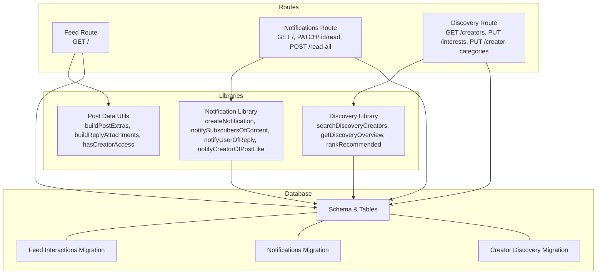
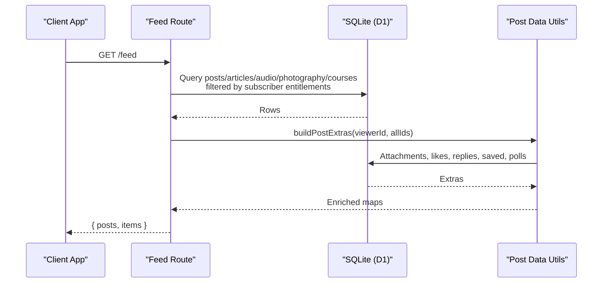
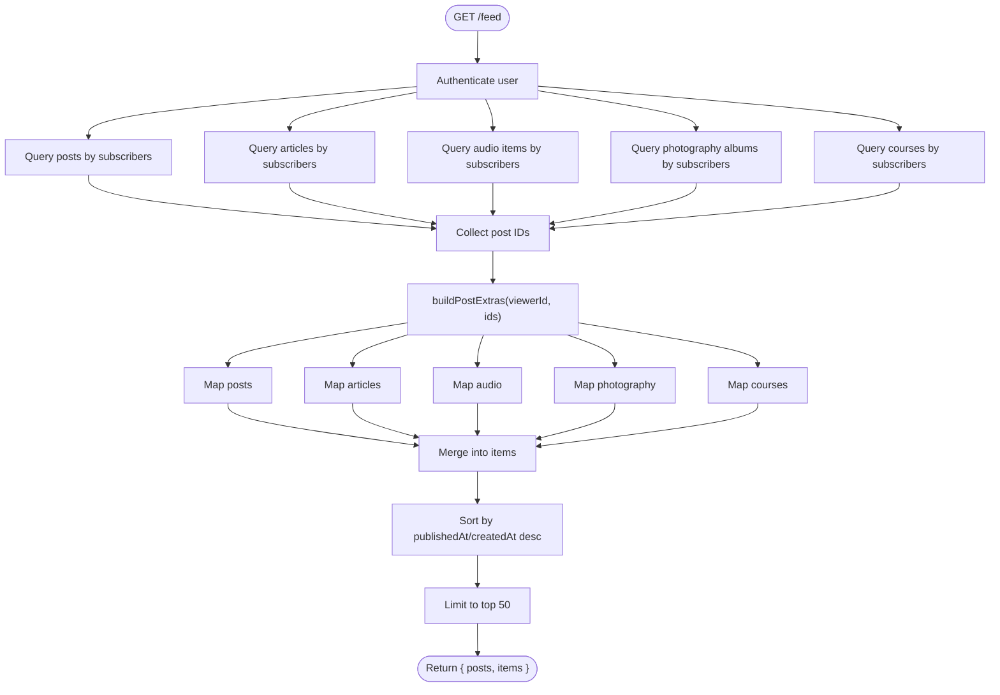
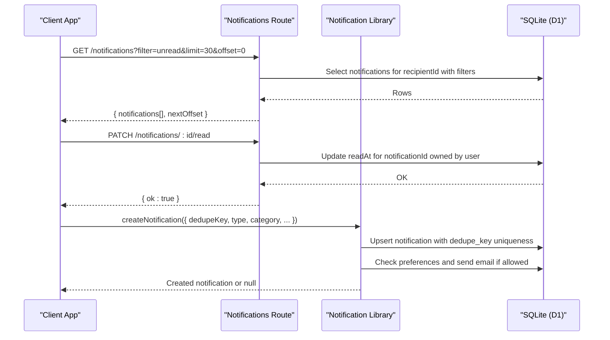
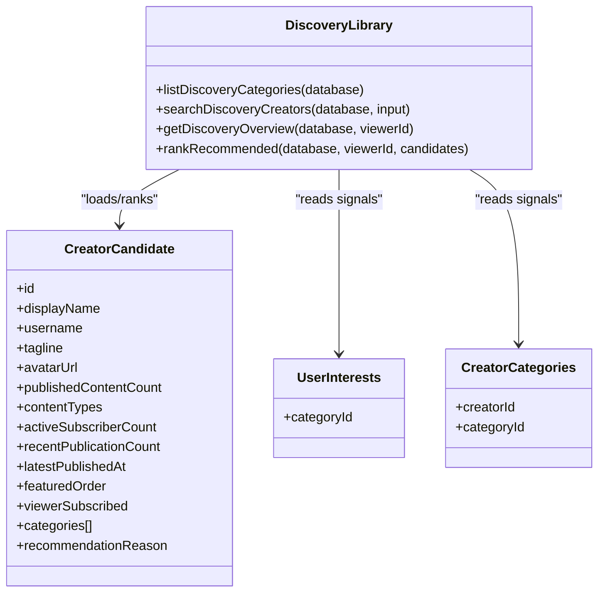
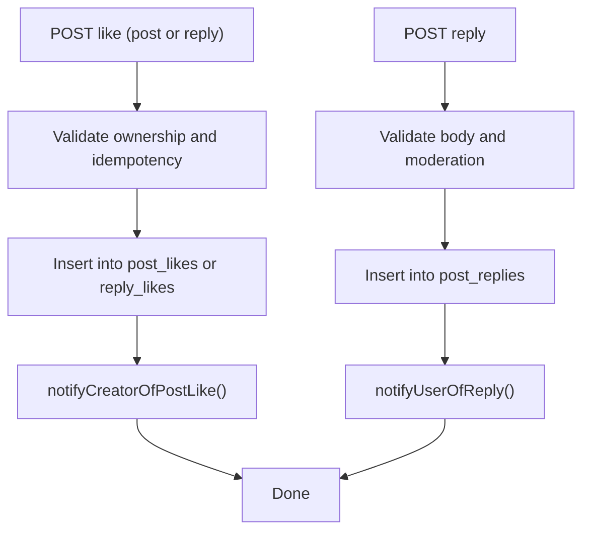
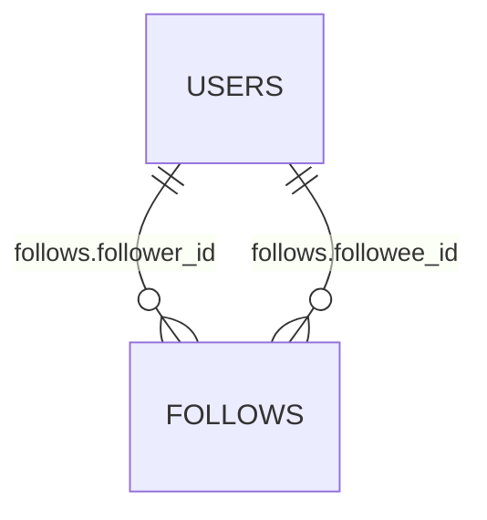
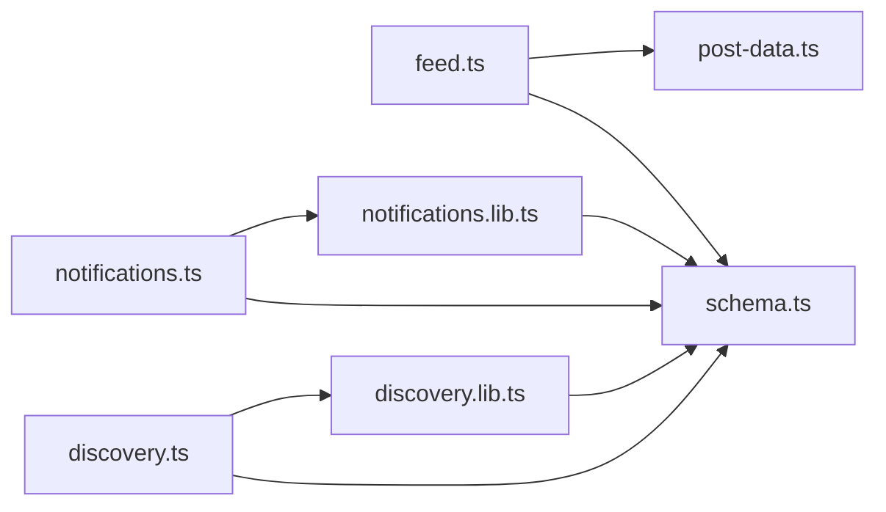

# Social Features Routes

<cite>
**Referenced Files in This Document**
- [feed.ts](file://src/worker/routes/feed.ts)
- [notifications.ts](file://src/worker/routes/notifications.ts)
- [discovery.ts](file://src/worker/routes/discovery.ts)
- [notifications.lib.ts](file://src/worker/lib/notifications.ts)
- [discovery.lib.ts](file://src/worker/lib/discovery.ts)
- [post-data.ts](file://src/worker/lib/post-data.ts)
- [schema.ts](file://src/worker/db/schema.ts)
- [0004_feed_interactions.sql](file://drizzle/0004_feed_interactions.sql)
- [0009_notifications.sql](file://drizzle/0009_notifications.sql)
- [0015_creator_discovery.sql](file://drizzle/0015_creator_discovery.sql)
</cite>

## Table of Contents
1. [Introduction](#introduction)
2. [Project Structure](#project-structure)
3. [Core Components](#core-components)
4. [Architecture Overview](#architecture-overview)
5. [Detailed Component Analysis](#detailed-component-analysis)
6. [Dependency Analysis](#dependency-analysis)
7. [Performance Considerations](#performance-considerations)
8. [Troubleshooting Guide](#troubleshooting-guide)
9. [Conclusion](#conclusion)

## Introduction
This document explains the social interaction route handlers for feed generation, notifications, and content discovery. It covers how followers receive content, how likes and replies trigger notifications, and how personalized recommendations are computed. It also includes examples of social graph queries, notification filtering, and performance optimization strategies such as batching and deduplication.

## Project Structure
The social features are implemented as Hono routes with supporting libraries and database schemas:
- Feed generation is handled by a single authenticated GET endpoint that aggregates multiple content types and enriches them with like/reply counts and viewer state.
- Notifications provide endpoints to list, filter, mark read, and manage preferences, backed by a robust library that creates notifications and optionally sends emails.
- Discovery provides search, categories, and recommendation logic based on user interests, subscriptions, and behavior signals.

**Diagram sources**
- [feed.ts:1-395](file://src/worker/routes/feed.ts#L1-L395)
- [notifications.ts:1-188](file://src/worker/routes/notifications.ts#L1-L188)
- [discovery.ts:1-120](file://src/worker/routes/discovery.ts#L1-L120)
- [notifications.lib.ts:1-461](file://src/worker/lib/notifications.ts#L1-L461)
- [discovery.lib.ts:1-390](file://src/worker/lib/discovery.ts#L1-L390)
- [post-data.ts:1-350](file://src/worker/lib/post-data.ts#L1-L350)
- [schema.ts:1-978](file://src/worker/db/schema.ts#L1-L978)
- [0004_feed_interactions.sql:1-123](file://drizzle/0004_feed_interactions.sql#L1-L123)
- [0009_notifications.sql:1-41](file://drizzle/0009_notifications.sql#L1-L41)
- [0015_creator_discovery.sql:1-70](file://drizzle/0015_creator_discovery.sql#L1-L70)

**Section sources**
- [feed.ts:1-395](file://src/worker/routes/feed.ts#L1-L395)
- [notifications.ts:1-188](file://src/worker/routes/notifications.ts#L1-L188)
- [discovery.ts:1-120](file://src/worker/routes/discovery.ts#L1-L120)
- [notifications.lib.ts:1-461](file://src/worker/lib/notifications.ts#L1-L461)
- [discovery.lib.ts:1-390](file://src/worker/lib/discovery.ts#L1-L390)
- [post-data.ts:1-350](file://src/worker/lib/post-data.ts#L1-L350)
- [schema.ts:1-978](file://src/worker/db/schema.ts#L1-L978)
- [0004_feed_interactions.sql:1-123](file://drizzle/0004_feed_interactions.sql#L1-L123)
- [0009_notifications.sql:1-41](file://drizzle/0009_notifications.sql#L1-L41)
- [0015_creator_discovery.sql:1-70](file://drizzle/0015_creator_discovery.sql#L1-L70)

## Core Components
- Feed Generation: Aggregates posts, articles, audio items, photography albums, and courses created by creators the current user subscribes to. Enriches each item with attachments, like/reply counts, viewer liked/saved flags, and polls.
- Notifications: Provides listing, filtering (unread/all), marking read, and bulk read operations. Supports per-user email preferences and deduplication via unique keys.
- Discovery: Offers creator search with relevance/popular/recent/recommended sorting, category filters, and personalized recommendations based on interests, subscriptions, and behavior.

**Section sources**
- [feed.ts:1-395](file://src/worker/routes/feed.ts#L1-L395)
- [notifications.ts:1-188](file://src/worker/routes/notifications.ts#L1-L188)
- [discovery.ts:1-120](file://src/worker/routes/discovery.ts#L1-L120)
- [notifications.lib.ts:1-461](file://src/worker/lib/notifications.ts#L1-L461)
- [discovery.lib.ts:1-390](file://src/worker/lib/discovery.ts#L1-L390)
- [post-data.ts:1-350](file://src/worker/lib/post-data.ts#L1-L350)

## Architecture Overview
The system uses Hono routes to expose REST endpoints. Each route authenticates the user, performs data access through Drizzle ORM against SQLite (D1), and returns JSON responses. Libraries encapsulate business logic for notifications and discovery. The feed route composes multiple queries and enriches results using post utilities.

**Diagram sources**
- [feed.ts:1-395](file://src/worker/routes/feed.ts#L1-L395)
- [post-data.ts:144-292](file://src/worker/lib/post-data.ts#L144-L292)

## Detailed Component Analysis

### Feed Generation
- Authentication: Requires an authenticated user context.
- Queries: Separate queries for each content type, joined with users and subscription memberships to enforce entitlements. Results are limited and ordered by published timestamps.
- Enrichment: A single call to buildPostExtras gathers attachments, like/reply counts, viewer interactions, and poll details across all IDs.
- Response: Returns both typed posts and a unified items array sorted by published or created time.

**Diagram sources**
- [feed.ts:13-394](file://src/worker/routes/feed.ts#L13-L394)
- [post-data.ts:144-292](file://src/worker/lib/post-data.ts#L144-L292)

**Section sources**
- [feed.ts:1-395](file://src/worker/routes/feed.ts#L1-L395)
- [post-data.ts:1-350](file://src/worker/lib/post-data.ts#L1-L350)

### Notifications System
- Endpoints:
  - GET /notifications: List notifications with optional unread filter, pagination via limit and offset.
  - GET /notifications/unread-count: Count unread notifications for the current user.
  - GET /notifications/preferences: Retrieve per-user email preferences.
  - PUT /notifications/preferences: Update preferences.
  - PATCH /notifications/:notificationId/read: Mark a specific notification as read.
  - POST /notifications/read-all: Mark all unread notifications as read.
- Notification creation:
  - createNotification enforces deduplication via a unique key, respects email preferences, and attempts email delivery when enabled.
  - Helper functions create notifications for content publication, replies, likes, and membership events.

**Diagram sources**
- [notifications.ts:74-183](file://src/worker/routes/notifications.ts#L74-L183)
- [notifications.lib.ts:153-234](file://src/worker/lib/notifications.ts#L153-L234)

**Section sources**
- [notifications.ts:1-188](file://src/worker/routes/notifications.ts#L1-L188)
- [notifications.lib.ts:1-461](file://src/worker/lib/notifications.ts#L1-L461)

### Content Discovery and Recommendations
- Search and categories:
  - GET /discovery/creators supports query, category, sort modes (relevance, recommended, popular, recent), and pagination.
  - GET /discovery/preferences lists available categories and user-selected interests; creators can set public categories.
  - PUT /discovery/interests and PUT /discovery/creator-categories allow updating selections with validation against active categories.
- Recommendation engine:
  - Signals collected from user interests, subscribed creators’ categories, and behavior (likes/saves).
  - Scoring combines popularity metrics, recency, and signal matches to produce ranked results with reasons.

**Diagram sources**
- [discovery.lib.ts:151-390](file://src/worker/lib/discovery.ts#L151-L390)
- [schema.ts:64-105](file://src/worker/db/schema.ts#L64-L105)

**Section sources**
- [discovery.ts:1-120](file://src/worker/routes/discovery.ts#L1-L120)
- [discovery.lib.ts:1-390](file://src/worker/lib/discovery.ts#L1-L390)
- [schema.ts:64-105](file://src/worker/db/schema.ts#L64-L105)

### Like and Reply Systems
- Likes:
  - Post likes stored in post_likes with composite primary key (post_id, user_id).
  - Reply likes stored in reply_likes similarly.
  - Counts and viewer state are aggregated via buildPostExtras and buildReplyLikeState.
- Replies:
  - post_replies support threading via parent_reply_id and mention tracking.
  - Creating a reply triggers a notification to relevant recipients (e.g., original author or mentioned users).

**Diagram sources**
- [schema.ts:466-529](file://src/worker/db/schema.ts#L466-L529)
- [notifications.lib.ts:328-388](file://src/worker/lib/notifications.ts#L328-L388)

**Section sources**
- [schema.ts:466-529](file://src/worker/db/schema.ts#L466-L529)
- [notifications.lib.ts:328-388](file://src/worker/lib/notifications.ts#L328-L388)

### Following Mechanisms
- Data model:
  - follows table stores followerId and followeeId relationships with indexes for efficient queries.
- Usage in feed:
  - The feed currently filters content by subscription memberships rather than explicit follows. If following is used elsewhere, it can be integrated by querying followed creator IDs and filtering posts accordingly.

**Diagram sources**
- [schema.ts:583-593](file://src/worker/db/schema.ts#L583-L593)

**Section sources**
- [schema.ts:583-593](file://src/worker/db/schema.ts#L583-L593)

## Dependency Analysis
- Feed depends on post-data utilities for enrichment and schema tables for core entities.
- Notifications depend on the notification library for creation and email dispatch, and schema tables for persistence.
- Discovery depends on the discovery library for SQL construction and ranking, and schema tables for categories and interests.

**Diagram sources**
- [feed.ts:1-395](file://src/worker/routes/feed.ts#L1-L395)
- [notifications.ts:1-188](file://src/worker/routes/notifications.ts#L1-L188)
- [discovery.ts:1-120](file://src/worker/routes/discovery.ts#L1-L120)
- [notifications.lib.ts:1-461](file://src/worker/lib/notifications.ts#L1-L461)
- [discovery.lib.ts:1-390](file://src/worker/lib/discovery.ts#L1-L390)
- [post-data.ts:1-350](file://src/worker/lib/post-data.ts#L1-L350)
- [schema.ts:1-978](file://src/worker/db/schema.ts#L1-L978)

**Section sources**
- [feed.ts:1-395](file://src/worker/routes/feed.ts#L1-L395)
- [notifications.ts:1-188](file://src/worker/routes/notifications.ts#L1-L188)
- [discovery.ts:1-120](file://src/worker/routes/discovery.ts#L1-L120)
- [notifications.lib.ts:1-461](file://src/worker/lib/notifications.ts#L1-L461)
- [discovery.lib.ts:1-390](file://src/worker/lib/discovery.ts#L1-L390)
- [post-data.ts:1-350](file://src/worker/lib/post-data.ts#L1-L350)
- [schema.ts:1-978](file://src/worker/db/schema.ts#L1-L978)

## Performance Considerations
- Batching and aggregation:
  - buildPostExtras consolidates attachments, likes, replies, saved items, and polls into a single enrichment step, minimizing round-trips.
- Pagination and limits:
  - Feed caps results at 50 per content type and final merge; notifications use limit/offset with safe bounds.
- Deduplication:
  - Notifications use unique dedupe_key to prevent duplicates efficiently.
- Indexing:
  - Schema includes targeted indexes for frequent lookups (followers/followees, notifications by recipient and read status, post/reply counts).
- Entitlement checks:
  - Membership entitlement conditions ensure only eligible content is returned, reducing unnecessary processing.

[No sources needed since this section provides general guidance]

## Troubleshooting Guide
- Feed empty:
  - Ensure the user has active subscription memberships to creators and that content is published and moderated as active.
- Notifications not appearing:
  - Verify dedupe_key uniqueness and that the recipient exists; check email preferences and transactional email configuration.
- Discovery results missing:
  - Confirm categories are active and creator/category associations exist; validate user interests and behavior signals.

**Section sources**
- [feed.ts:214-216](file://src/worker/routes/feed.ts#L214-L216)
- [notifications.lib.ts:153-234](file://src/worker/lib/notifications.ts#L153-L234)
- [discovery.lib.ts:151-220](file://src/worker/lib/discovery.ts#L151-L220)

## Conclusion
The social features combine efficient data retrieval, enrichment, and personalization to deliver a responsive feed, reliable notifications, and meaningful discovery. By leveraging batching, deduplication, and well-indexed schemas, the system scales to high-frequency operations while maintaining accuracy and relevance.

[No sources needed since this section summarizes without analyzing specific files]